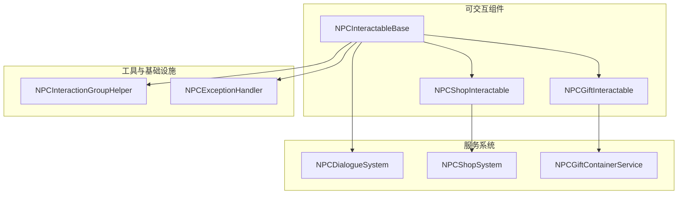
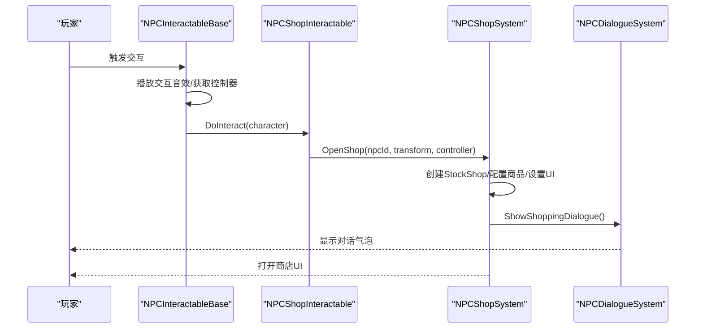
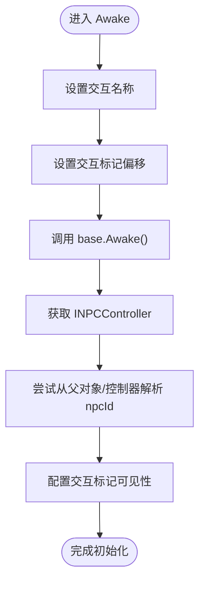
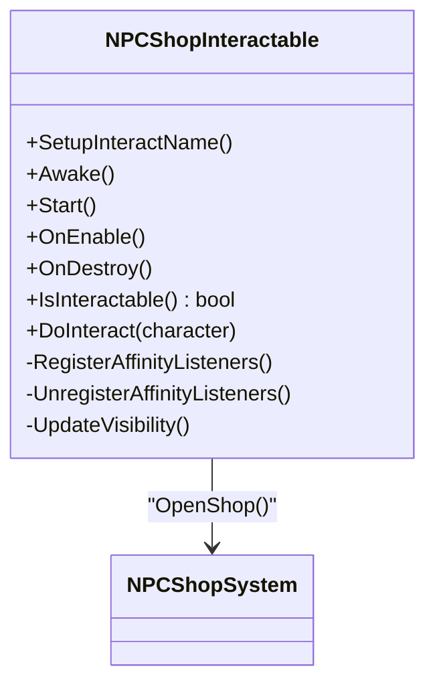
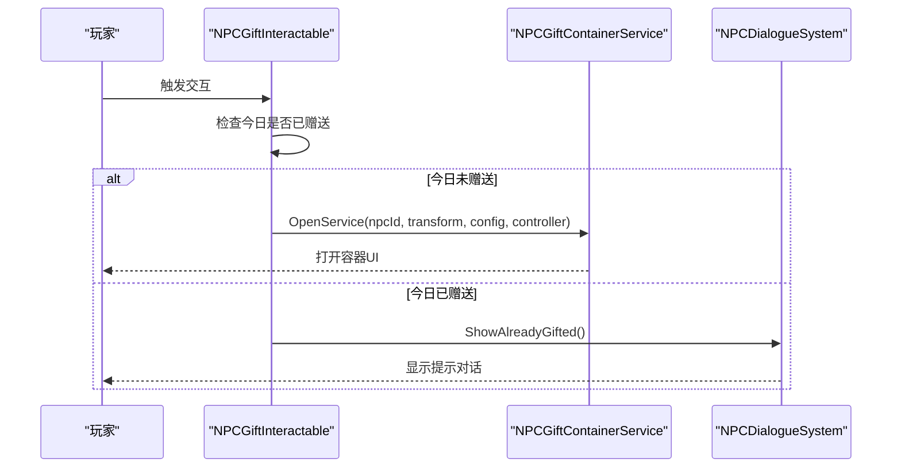
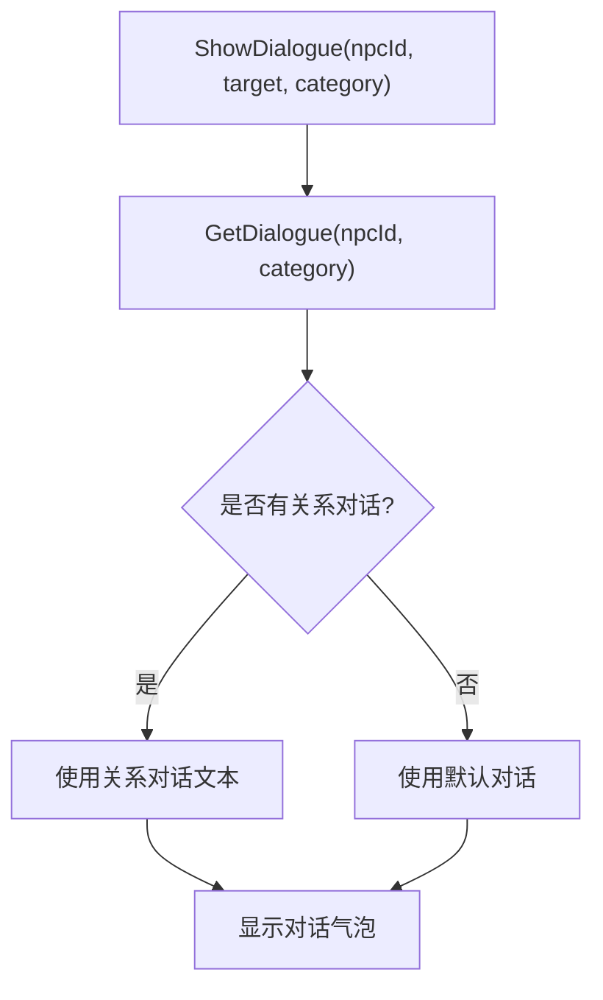
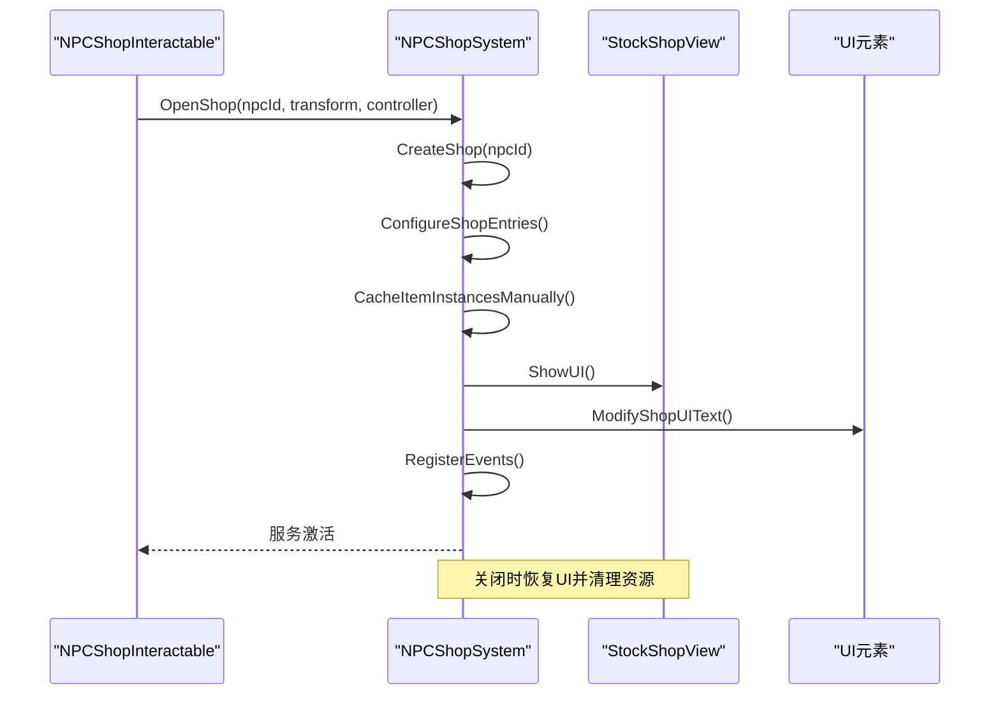
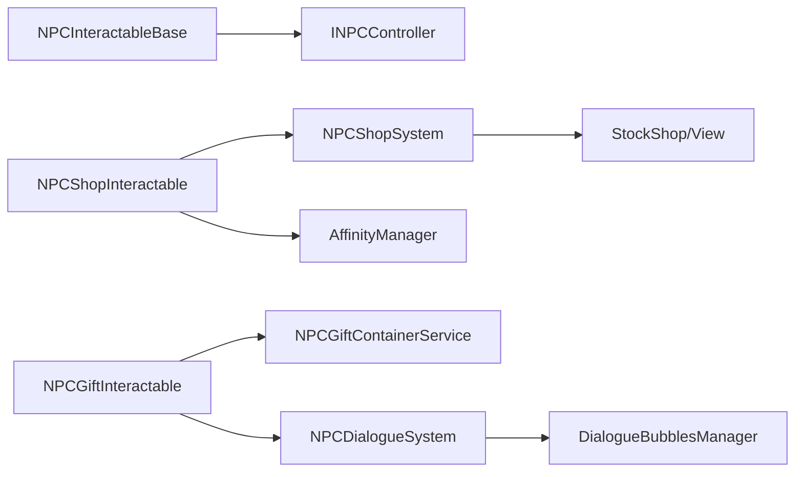

# NPC 交互系统

<cite>
**本文引用的文件**
- [NPCInteractableBase.cs](file://Integration/Affinity/Interactables/NPCInteractableBase.cs)
- [NPCGiftInteractable.cs](file://Integration/Affinity/Interactables/NPCGiftInteractable.cs)
- [NPCShopInteractable.cs](file://Integration/Affinity/Interactables/NPCShopInteractable.cs)
- [NPCDialogueSystem.cs](file://Integration/Affinity/Systems/NPCDialogueSystem.cs)
- [NPCShopSystem.cs](file://Integration/Affinity/Systems/NPCShopSystem.cs)
- [NPCGiftContainerService.cs](file://Integration/Affinity/Services/NPCGiftContainerService.cs)
- [NPCInteractionGroupHelper.cs](file://Integration/Utils/NPCInteractionGroupHelper.cs)
- [NPCExceptionHandler.cs](file://Integration/Utils/NPCExceptionHandler.cs)
- [ZombieModeTemporaryNpcAwakeGuard.py](file://tests/ZombieModeTemporaryNpcAwakeGuard.py)
- [ZombieModeRewardServiceAtomicityGuard.py](file://tests/ZombieModeRewardServiceAtomicityGuard.py)
- [ZombieModeUIHelperGraphicCompositionGuard.py](file://tests/ZombieModeUIHelperGraphicCompositionGuard.py)
- [ZombieModeTemporaryNpcResponsiveUiGuard.py](file://tests/ZombieModeTemporaryNpcResponsiveUiGuard.py)
</cite>

## 目录
1. [简介](#简介)
2. [项目结构](#项目结构)
3. [核心组件](#核心组件)
4. [架构总览](#架构总览)
5. [详细组件分析](#详细组件分析)
6. [依赖关系分析](#依赖关系分析)
7. [性能与可维护性](#性能与可维护性)
8. [故障排查指南](#故障排查指南)
9. [结论](#结论)
10. [附录：扩展开发指南与最佳实践](#附录：扩展开发指南与最佳实践)

## 简介
本文件系统化梳理并文档化 NPC 交互框架，覆盖可交互对象基类、交互事件处理、状态管理、对话系统、礼物交换、商店交易、任务接取等交互类型，以及服务层注册、生命周期管理与错误处理。同时给出 UI 集成方案（对话框显示、进度条、反馈效果）和扩展开发指南，帮助开发者快速接入或扩展新的 NPC 交互能力。

## 项目结构
NPC 交互系统围绕“可交互组件 + 服务系统 + UI 桥接”的三层组织方式展开：
- 可交互组件层：提供统一的交互入口、生命周期、标记可见性与基础交互流程。
- 服务系统层：封装具体业务（对话、商店、礼物容器、临时服务等），负责状态机、事件订阅与资源清理。
- UI 集成层：通过游戏原生 UI 或自定义 UI 展示对话气泡、商店界面、进度提示与反馈。

图表来源
- [NPCInteractableBase.cs:18-122](file://Integration/Affinity/Interactables/NPCInteractableBase.cs#L18-L122)
- [NPCShopInteractable.cs:19-164](file://Integration/Affinity/Interactables/NPCShopInteractable.cs#L19-L164)
- [NPCGiftInteractable.cs:20-81](file://Integration/Affinity/Interactables/NPCGiftInteractable.cs#L20-L81)
- [NPCDialogueSystem.cs:18-168](file://Integration/Affinity/Systems/NPCDialogueSystem.cs#L18-L168)
- [NPCShopSystem.cs:28-189](file://Integration/Affinity/Systems/NPCShopSystem.cs#L28-L189)
- [NPCGiftContainerService.cs](file://Integration/Affinity/Services/NPCGiftContainerService.cs)
- [NPCInteractionGroupHelper.cs](file://Integration/Utils/NPCInteractionGroupHelper.cs)
- [NPCExceptionHandler.cs](file://Integration/Utils/NPCExceptionHandler.cs)

章节来源
- [NPCInteractableBase.cs:18-122](file://Integration/Affinity/Interactables/NPCInteractableBase.cs#L18-L122)
- [NPCShopInteractable.cs:19-164](file://Integration/Affinity/Interactables/NPCShopInteractable.cs#L19-L164)
- [NPCGiftInteractable.cs:20-81](file://Integration/Affinity/Interactables/NPCGiftInteractable.cs#L20-L81)
- [NPCDialogueSystem.cs:18-168](file://Integration/Affinity/Systems/NPCDialogueSystem.cs#L18-L168)
- [NPCShopSystem.cs:28-189](file://Integration/Affinity/Systems/NPCShopSystem.cs#L28-L189)

## 核心组件
- NPCInteractableBase：所有 NPC 交互组件的基类，统一处理 Awake/Start、交互标记偏移、控制器获取、交互音效播放、异常捕获、对话状态控制与关闭交互。
- NPCShopInteractable：通用商店交互，基于好感度解锁与事件驱动更新可见性，打开 NPCShopSystem 提供的商店 UI。
- NPCGiftInteractable：通用礼物赠送交互，支持今日已赠送判断、容器式 UI 打开与对话提示。
- NPCDialogueSystem：统一对话显示与文本选择，支持问候、收到礼物、升级、购物、告别等类别，并适配当前配偶关系对话。
- NPCShopSystem：动态创建与管理 StockShop，配置商品、折扣、卖出加成、UI 文字修改、事件绑定与清理；支持临时净化点商店的特殊逻辑。
- NPCGiftContainerService：以容器式 UI 承载礼物赠送流程，配合好感度系统与对话反馈。

章节来源
- [NPCInteractableBase.cs:57-180](file://Integration/Affinity/Interactables/NPCInteractableBase.cs#L57-L180)
- [NPCShopInteractable.cs:40-164](file://Integration/Affinity/Interactables/NPCShopInteractable.cs#L40-L164)
- [NPCGiftInteractable.cs:36-93](file://Integration/Affinity/Interactables/NPCGiftInteractable.cs#L36-L93)
- [NPCDialogueSystem.cs:31-168](file://Integration/Affinity/Systems/NPCDialogueSystem.cs#L31-L168)
- [NPCShopSystem.cs:75-189](file://Integration/Affinity/Systems/NPCShopSystem.cs#L75-L189)
- [NPCGiftContainerService.cs](file://Integration/Affinity/Services/NPCGiftContainerService.cs)

## 架构总览
NPC 交互系统采用“组件触发 -> 服务处理 -> UI 反馈”的事件驱动架构。可交互组件仅关注输入与基础状态，具体业务由服务层实现，UI 通过统一管理器呈现。

图表来源
- [NPCInteractableBase.cs:149-172](file://Integration/Affinity/Interactables/NPCInteractableBase.cs#L149-L172)
- [NPCShopInteractable.cs:158-164](file://Integration/Affinity/Interactables/NPCShopInteractable.cs#L158-L164)
- [NPCShopSystem.cs:95-189](file://Integration/Affinity/Systems/NPCShopSystem.cs#L95-L189)
- [NPCDialogueSystem.cs:662-686](file://Integration/Affinity/Systems/NPCDialogueSystem.cs#L662-L686)

## 详细组件分析

### NPCInteractableBase：可交互对象基类
- 职责
  - 初始化交互名称、标记偏移、控制器引用与可见性。
  - 统一拦截 OnInteractStart/Stop，播放交互音效，执行子类 DoInteract。
  - 提供 StartNPCDialogue/EndNPCDialogue/CloseCurrentInteraction 等便捷方法。
  - 从父对象或控制器继承 npcId，保证跨层级复用。
- 关键流程
  - Awake 中安全调用 base.Awake，避免异常导致后续流程中断。
  - IsInteractable 基于初始化与 npcId 有效性判定。
  - OnInteractStart 中捕获异常并结束交互，确保稳定性。

图表来源
- [NPCInteractableBase.cs:57-100](file://Integration/Affinity/Interactables/NPCInteractableBase.cs#L57-L100)
- [NPCInteractableBase.cs:189-207](file://Integration/Affinity/Interactables/NPCInteractableBase.cs#L189-L207)

章节来源
- [NPCInteractableBase.cs:57-180](file://Integration/Affinity/Interactables/NPCInteractableBase.cs#L57-L180)

### NPCShopInteractable：商店交互
- 职责
  - 根据好感度等级解锁商店选项，事件驱动更新可见性，避免每帧轮询。
  - 打开 NPCShopSystem 提供的商店 UI，并让 NPC 进入对话状态。
- 关键点
  - 使用 AffinityManager 的事件监听 OnAffinityChanged/OnLevelUp 刷新可见性。
  - 缓存可见性状态，减少重复计算。

图表来源
- [NPCShopInteractable.cs:40-164](file://Integration/Affinity/Interactables/NPCShopInteractable.cs#L40-L164)
- [NPCShopSystem.cs:75-189](file://Integration/Affinity/Systems/NPCShopSystem.cs#L75-L189)

章节来源
- [NPCShopInteractable.cs:40-164](file://Integration/Affinity/Interactables/NPCShopInteractable.cs#L40-L164)

### NPCGiftInteractable：礼物交换
- 职责
  - 检查今日是否已赠送，若不可赠送则显示对应对话。
  - 打开容器式 UI（NPCGiftContainerService）进行礼物放入与确认。
  - 支持配偶跟随、离婚、回家等衍生交互（同文件内其他类）。
- 关键点
  - 始终可交互（即使今日已赠送），但行为分支不同。
  - 通过 NPCDialogueSystem 显示提示与反馈。

图表来源
- [NPCGiftInteractable.cs:60-93](file://Integration/Affinity/Interactables/NPCGiftInteractable.cs#L60-L93)
- [NPCDialogueSystem.cs:165-168](file://Integration/Affinity/Systems/NPCDialogueSystem.cs#L165-L168)
- [NPCGiftContainerService.cs](file://Integration/Affinity/Services/NPCGiftContainerService.cs)

章节来源
- [NPCGiftInteractable.cs:60-93](file://Integration/Affinity/Interactables/NPCGiftInteractable.cs#L60-L93)

### NPCDialogueSystem：对话系统
- 职责
  - 根据 NPC ID 与对话类别返回文本，优先匹配关系对话（如已婚）。
  - 在 NPC 头顶显示对话气泡，支持自定义高度与时长。
  - 提供快捷方法：问候、收到礼物、升级、购物、告别等。
- 关键点
  - 默认对话兜底，确保无配置时仍可显示友好提示。
  - 对特殊事件键（eventKey）支持关系对话覆盖。

图表来源
- [NPCDialogueSystem.cs:93-135](file://Integration/Affinity/Systems/NPCDialogueSystem.cs#L93-L135)
- [NPCDialogueSystem.cs:217-236](file://Integration/Affinity/Systems/NPCDialogueSystem.cs#L217-L236)

章节来源
- [NPCDialogueSystem.cs:93-168](file://Integration/Affinity/Systems/NPCDialogueSystem.cs#L93-L168)

### NPCShopSystem：商店服务
- 职责
  - 检查商店解锁条件（好感度等级）。
  - 动态创建 StockShop，配置商品条目、折扣、卖出加成与物品实例缓存。
  - 修改 UI 文字（购买/净化点）、注册事件（购买、出售、UI 关闭）。
  - 支持临时净化点商店的特殊价格计算与货币 UI 更新。
- 关键点
  - 反射缓存 UI 字段，避免每次访问开销。
  - 严格的生命周期管理：OpenShop -> RegisterEvents -> ShowUI -> CloseShop -> Cleanup。
  - 与 ModBehaviour 集成，支持临时 NPC 服务的边界与权限校验。

图表来源
- [NPCShopSystem.cs:95-189](file://Integration/Affinity/Systems/NPCShopSystem.cs#L95-L189)
- [NPCShopSystem.cs:311-462](file://Integration/Affinity/Systems/NPCShopSystem.cs#L311-L462)
- [NPCShopSystem.cs:534-558](file://Integration/Affinity/Systems/NPCShopSystem.cs#L534-L558)

章节来源
- [NPCShopSystem.cs:75-189](file://Integration/Affinity/Systems/NPCShopSystem.cs#L75-L189)
- [NPCShopSystem.cs:311-462](file://Integration/Affinity/Systems/NPCShopSystem.cs#L311-L462)
- [NPCShopSystem.cs:534-558](file://Integration/Affinity/Systems/NPCShopSystem.cs#L534-L558)

### 临时 NPC 服务与边界约束（测试保障）
- 临时服务终端必须在基类 Awake 之前准备 InteractableBase 内部组，确保交互组正确初始化。
- 临时服务关闭时需按顺序关闭各子系统（商店、锻造 UI、快递服务、存储寄存、付费扫货），再销毁对象。
- UI 尺寸与响应式布局需遵循共享辅助方法，确保多分辨率适配。

章节来源
- [ZombieModeTemporaryNpcAwakeGuard.py:34-49](file://tests/ZombieModeTemporaryNpcAwakeGuard.py#L34-L49)
- [ZombieModeRewardServiceAtomicityGuard.py:205-233](file://tests/ZombieModeRewardServiceAtomicityGuard.py#L205-L233)
- [ZombieModeUIHelperGraphicCompositionGuard.py:31-52](file://tests/ZombieModeUIHelperGraphicCompositionGuard.py#L31-L52)
- [ZombieModeTemporaryNpcResponsiveUiGuard.py:32-44](file://tests/ZombieModeTemporaryNpcResponsiveUiGuard.py#L32-L44)

## 依赖关系分析
- 组件耦合
  - NPCInteractableBase 与 INPCController 松耦合，通过接口解耦控制器实现。
  - NPCShopInteractable 依赖 NPCShopSystem，不直接操作 StockShop 细节。
  - NPCGiftInteractable 依赖 NPCGiftContainerService 与 NPCDialogueSystem。
- 外部依赖
  - 游戏原生的 StockShop/StockShopView 用于商店 UI。
  - DialogueBubblesManager 用于对话气泡显示。
  - AffinityManager 提供好感度与关系数据。
- 潜在循环依赖
  - 服务层与组件层通过明确接口与静态方法解耦，避免循环引用。
  - 事件订阅在组件启用时注册，销毁时取消，防止内存泄漏。

图表来源
- [NPCInteractableBase.cs:149-172](file://Integration/Affinity/Interactables/NPCInteractableBase.cs#L149-L172)
- [NPCShopInteractable.cs:77-93](file://Integration/Affinity/Interactables/NPCShopInteractable.cs#L77-L93)
- [NPCShopSystem.cs:95-189](file://Integration/Affinity/Systems/NPCShopSystem.cs#L95-L189)
- [NPCDialogueSystem.cs:119-135](file://Integration/Affinity/Systems/NPCDialogueSystem.cs#L119-L135)

章节来源
- [NPCShopInteractable.cs:77-93](file://Integration/Affinity/Interactables/NPCShopInteractable.cs#L77-L93)
- [NPCShopSystem.cs:95-189](file://Integration/Affinity/Systems/NPCShopSystem.cs#L95-L189)
- [NPCDialogueSystem.cs:119-135](file://Integration/Affinity/Systems/NPCDialogueSystem.cs#L119-L135)

## 性能与可维护性
- 性能优化
  - 商店可见性使用事件驱动与缓存，避免每帧轮询。
  - 反射字段一次性缓存，降低运行时反射开销。
  - 物品实例手动缓存，解决动态创建商店的空引用问题。
- 可维护性
  - 统一异常处理包装，避免单点失败影响整体流程。
  - 清晰的组件职责划分，便于独立测试与替换。
  - 通过测试守卫保障关键路径（Awake 顺序、关闭顺序、UI 组成与响应式布局）。

[本节为通用指导，无需特定文件来源]

## 故障排查指南
- 常见问题
  - 商店无法打开：检查场景是否存在 StockShopView，若无则显示提示并退出。
  - 对话气泡不显示：确认目标 Transform 有效且文本非空。
  - 礼物赠送无效：检查今日是否已赠送与容器 UI 是否正确打开。
- 定位步骤
  - 查看日志输出（DevLog）中的模块前缀（如 [NPCShop]、[NPCDialogue]）。
  - 验证 NPC ID 是否正确解析（从父对象或控制器）。
  - 检查事件订阅是否正确注册与注销。
- 修复建议
  - 确保 Awake 中先初始化交互组再调用 base.Awake。
  - 关闭服务时按顺序关闭各子系统，再销毁对象。
  - 使用共享 UI 辅助方法创建高亮条与文本，避免图形组合错误。

章节来源
- [NPCShopSystem.cs:109-140](file://Integration/Affinity/Systems/NPCShopSystem.cs#L109-L140)
- [NPCDialogueSystem.cs:119-135](file://Integration/Affinity/Systems/NPCDialogueSystem.cs#L119-L135)
- [ZombieModeTemporaryNpcAwakeGuard.py:34-49](file://tests/ZombieModeTemporaryNpcAwakeGuard.py#L34-L49)
- [ZombieModeRewardServiceAtomicityGuard.py:205-233](file://tests/ZombieModeRewardServiceAtomicityGuard.py#L205-L233)
- [ZombieModeUIHelperGraphicCompositionGuard.py:31-52](file://tests/ZombieModeUIHelperGraphicCompositionGuard.py#L31-L52)

## 结论
NPC 交互系统通过基类抽象、服务分层与 UI 解耦，提供了稳定可扩展的交互框架。商店与礼物交互均具备完善的生命周期管理与错误处理，并通过测试守卫保障关键路径的正确性。开发者可基于此框架快速接入新交互类型，并保持代码的可维护性与性能表现。

[本节为总结性内容，无需特定文件来源]

## 附录：扩展开发指南与最佳实践
- 新增交互类型
  - 继承 NPCInteractableBase，实现 SetupInteractName 与 DoInteract。
  - 在 Awake/Start 中按需注册事件与更新可见性。
  - 通过服务层（如 NPCShopSystem、NPCDialogueSystem）完成复杂业务。
- 服务注册与生命周期
  - 在服务开启时注册事件，关闭时注销并清理资源。
  - 使用 NPCInteractionGroupHelper 管理交互组，确保基类 Awake 前初始化。
- 错误处理
  - 使用 NPCExceptionHandler 包裹关键逻辑，记录日志并忽略不影响主流程的错误。
  - 对 UI 操作增加空引用与可用性检查。
- UI 集成
  - 对话气泡通过 NPCDialogueSystem 显示，支持自定义高度与时长。
  - 商店 UI 通过 StockShopView 打开，必要时修改按钮与文本。
  - 进度条与反馈使用共享 UI 辅助方法，确保响应式布局与图形组合正确。
- 最佳实践
  - 保持组件职责单一，复杂逻辑下沉至服务层。
  - 使用事件驱动替代轮询，提升低端设备性能。
  - 通过测试守卫验证关键路径，避免回归问题。

章节来源
- [NPCInteractableBase.cs:114-122](file://Integration/Affinity/Interactables/NPCInteractableBase.cs#L114-L122)
- [NPCShopInteractable.cs:50-75](file://Integration/Affinity/Interactables/NPCShopInteractable.cs#L50-L75)
- [NPCShopSystem.cs:534-558](file://Integration/Affinity/Systems/NPCShopSystem.cs#L534-L558)
- [NPCDialogueSystem.cs:93-135](file://Integration/Affinity/Systems/NPCDialogueSystem.cs#L93-L135)
- [NPCInteractionGroupHelper.cs](file://Integration/Utils/NPCInteractionGroupHelper.cs)
- [NPCExceptionHandler.cs](file://Integration/Utils/NPCExceptionHandler.cs)
- [ZombieModeTemporaryNpcAwakeGuard.py:34-49](file://tests/ZombieModeTemporaryNpcAwakeGuard.py#L34-L49)
- [ZombieModeUIHelperGraphicCompositionGuard.py:31-52](file://tests/ZombieModeUIHelperGraphicCompositionGuard.py#L31-L52)
- [ZombieModeTemporaryNpcResponsiveUiGuard.py:32-44](file://tests/ZombieModeTemporaryNpcResponsiveUiGuard.py#L32-L44)