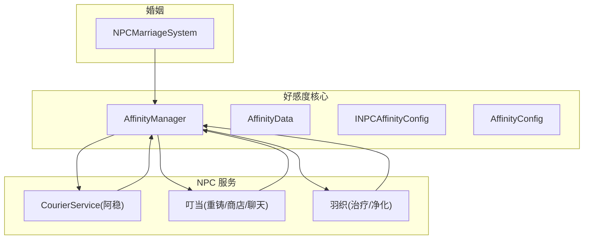
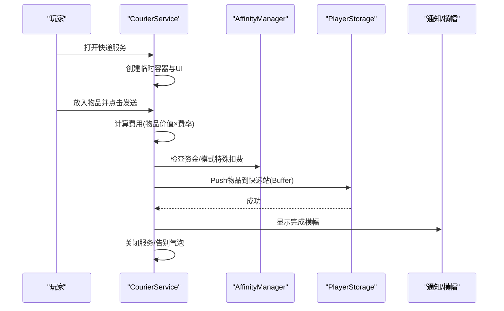
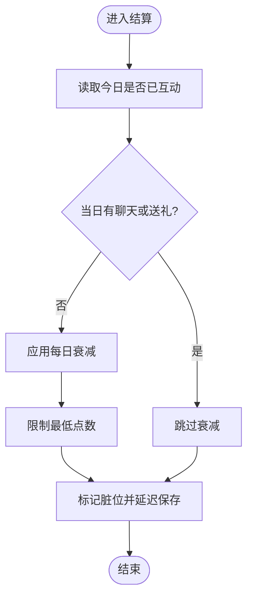
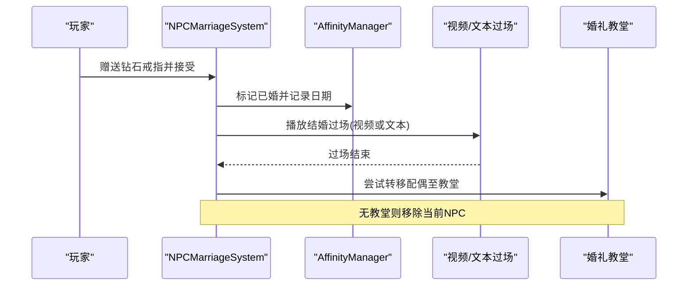
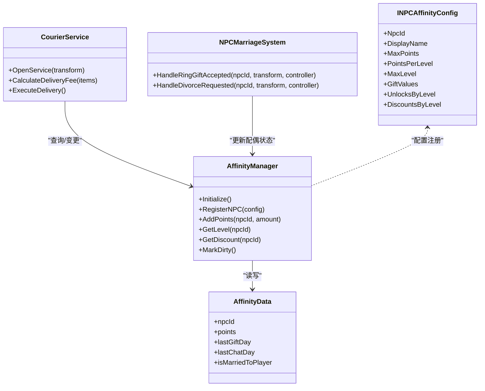

# NPC 关系系统

<cite>
**本文引用的文件**
- [AffinityManager.cs](file://Integration/Affinity/AffinityManager.cs)
- [AffinityData.cs](file://Integration/Affinity/AffinityData.cs)
- [INPCAffinityConfig.cs](file://Integration/Affinity/INPCAffinityConfig.cs)
- [AffinityConfig.cs](file://Integration/Affinity/AffinityConfig.cs)
- [CourierService.cs](file://Integration/NPCs/Courier/CourierService.cs)
- [NPCMarriageSystem.cs](file://Integration/Wedding/NPCMarriageSystem.cs)
- [index.md](file://wiki-site/docs/en/npcs/index.md)
- [affinity-marriage.md](file://wiki-site/docs/en/systems/affinity-marriage.md)
</cite>

## 目录
1. [简介](#简介)
2. [项目结构](#项目结构)
3. [核心组件](#核心组件)
4. [架构总览](#架构总览)
5. [详细组件分析](#详细组件分析)
6. [依赖分析](#依赖分析)
7. [性能考虑](#性能考虑)
8. [故障排查指南](#故障排查指南)
9. [结论](#结论)
10. [附录](#附录)

## 简介
本模块为 BossRush Mod 的 NPC 关系系统，围绕三位常驻 NPC：阿稳（快递员）、叮当（哥布林工匠）、羽织（护士）构建。系统提供好感度等级机制、礼物与对话交互、商店折扣、快递寄存服务、以及婚姻关系（求婚、婚礼过场、离婚）。其中叮当与羽织具备完整好感度体系，阿稳以“纯业务”方式提供寄存与取回服务。

## 项目结构
- 好感度核心位于 Integration/Affinity，负责数据模型、配置接口、管理器与持久化钩子。
- NPC 行为与服务位于 Integration/NPCs，包含 Courier（阿稳）、Goblin（叮当）、Nurse（羽织）等。
- 婚姻系统位于 Integration/Wedding，处理求婚、过场、转移与离婚流程。
- 文档与规则参考 wiki-site/docs 下的 NPC 与关系说明。

图表来源
- [AffinityManager.cs:1-120](file://Integration/Affinity/AffinityManager.cs#L1-L120)
- [AffinityData.cs:1-60](file://Integration/Affinity/AffinityData.cs#L1-L60)
- [INPCAffinityConfig.cs:1-77](file://Integration/Affinity/INPCAffinityConfig.cs#L1-L77)
- [AffinityConfig.cs:1-70](file://Integration/Affinity/AffinityConfig.cs#L1-L70)
- [CourierService.cs:1-120](file://Integration/NPCs/Courier/CourierService.cs#L1-L120)
- [NPCMarriageSystem.cs:1-120](file://Integration/Wedding/NPCMarriageSystem.cs#L1-L120)

章节来源
- [index.md:1-30](file://wiki-site/docs/en/npcs/index.md#L1-L30)

## 核心组件
- 好感度管理器（AffinityManager）：单例式全局管理所有 NPC 的好感度点数、等级、解锁、折扣、故事触发标记、每日衰减与延迟保存。
- 数据模型（AffinityData）：序列化存储每个 NPC 的状态（点数、最近互动日、故事触发、婚姻状态、跟随状态等）。
- 配置接口（INPCAffinityConfig）：定义 NPC 个性化配置（最大点数、每级点数、礼物偏好、等级解锁与折扣）。
- 全局常量（AffinityConfig）：默认值、每日衰减开关与存档键名。
- 快递服务（CourierService）：阿稳的容器 UI、费用计算、支付、发送物品到玩家仓库、通知与气泡反馈。
- 婚姻系统（NPCMarriageSystem）：求婚接受、视频/文字过场、爱心气泡、配偶转移、离婚流程。

章节来源
- [AffinityManager.cs:1-120](file://Integration/Affinity/AffinityManager.cs#L1-L120)
- [AffinityData.cs:1-60](file://Integration/Affinity/AffinityData.cs#L1-L60)
- [INPCAffinityConfig.cs:1-77](file://Integration/Affinity/INPCAffinityConfig.cs#L1-L77)
- [AffinityConfig.cs:1-70](file://Integration/Affinity/AffinityConfig.cs#L1-L70)
- [CourierService.cs:1-120](file://Integration/NPCs/Courier/CourierService.cs#L1-L120)
- [NPCMarriageSystem.cs:1-120](file://Integration/Wedding/NPCMarriageSystem.cs#L1-L120)

## 架构总览
好感度系统通过统一等级表驱动等级判定与进度展示；各 NPC 通过实现配置接口注册到管理器。服务层（如快递、商店、治疗）在交互时读取当前等级与折扣，执行对应业务逻辑。婚姻系统作为上层流程，调用好感度管理器更新配偶状态并触发场景事件。

图表来源
- [CourierService.cs:240-500](file://Integration/NPCs/Courier/CourierService.cs#L240-L500)
- [AffinityManager.cs:340-420](file://Integration/Affinity/AffinityManager.cs#L340-L420)

## 详细组件分析

### 好感度系统与等级机制
- 统一等级表：固定 10 级阈值（累计点数），用于所有支持好感度的 NPC。
- 等级计算：根据累计点数从最高级向下匹配，得到当前等级与进度。
- 事件与持久化：点数变化触发事件，标记脏位并延迟保存；存档切换时加载数据。
- 每日衰减：若当天未聊天或送礼，次日扣除固定数值（可配置开关）。
- 解锁与折扣：按等级解锁内容与应用折扣（由具体 NPC 配置决定）。

图表来源
- [AffinityManager.cs:590-695](file://Integration/Affinity/AffinityManager.cs#L590-L695)
- [AffinityConfig.cs:40-70](file://Integration/Affinity/AffinityConfig.cs#L40-L70)

章节来源
- [AffinityManager.cs:20-120](file://Integration/Affinity/AffinityManager.cs#L20-L120)
- [AffinityManager.cs:248-420](file://Integration/Affinity/AffinityManager.cs#L248-L420)
- [AffinityManager.cs:590-695](file://Integration/Affinity/AffinityManager.cs#L590-L695)
- [AffinityConfig.cs:40-70](file://Integration/Affinity/AffinityConfig.cs#L40-L70)

### 三位常驻 NPC 功能特性
- 阿稳（快递员）
  - 提供容器式快递服务：打开 LootView、放入物品、计算费用、支付、发送到玩家仓库缓冲。
  - 支持一键清包快捷发送与汇总通知。
  - 在特定模式下可使用净化点支付。
- 叮当（哥布林工匠）
  - 提供重铸、商店、日常对话等服务。
  - 拥有完整好感度体系，随等级解锁服务与折扣。
- 羽织（护士）
  - 提供治疗、移除负面状态等服务。
  - 拥有完整好感度体系，随等级解锁服务与折扣。

章节来源
- [index.md:1-30](file://wiki-site/docs/en/npcs/index.md#L1-L30)
- [CourierService.cs:240-500](file://Integration/NPCs/Courier/CourierService.cs#L240-L500)

### 对话系统、礼物系统与商店集成
- 对话系统：通过 NPC 控制器与对话管理器播放双语对话序列，支持过场与气泡反馈。
- 礼物系统：基于配置字典映射物品类型与好感度增益；记录最近赠送日与反应类型，参与等级提升与衰减判断。
- 商店集成：按当前等级获取折扣率，应用于商品价格；部分 NPC 在高等级解锁额外商品或服务。

章节来源
- [INPCAffinityConfig.cs:1-77](file://Integration/Affinity/INPCAffinityConfig.cs#L1-L77)
- [AffinityManager.cs:470-498](file://Integration/Affinity/AffinityManager.cs#L470-L498)
- [AffinityManager.cs:500-590](file://Integration/Affinity/AffinityManager.cs#L500-L590)

### 婚姻关系高级功能
- 求婚流程：钻石戒指赠送成功后，持久化配偶状态，优先播放结婚视频，缺失则回退文字过场。
- 过场与反馈：全屏视频播放期间锁定输入，结束后显示爱心气泡与纪念日期。
- 配偶转移：尝试将配偶移动到婚礼教堂刷新点；若无教堂则从当前地图移除，后续仅在教堂刷新。
- 离婚流程：解除关系、心碎反馈、恢复普通地图刷新。

图表来源
- [NPCMarriageSystem.cs:38-120](file://Integration/Wedding/NPCMarriageSystem.cs#L38-L120)
- [NPCMarriageSystem.cs:180-225](file://Integration/Wedding/NPCMarriageSystem.cs#L180-L225)
- [NPCMarriageSystem.cs:604-655](file://Integration/Wedding/NPCMarriageSystem.cs#L604-L655)

章节来源
- [affinity-marriage.md:1-65](file://wiki-site/docs/en/systems/affinity-marriage.md#L1-L65)
- [NPCMarriageSystem.cs:38-120](file://Integration/Wedding/NPCMarriageSystem.cs#L38-L120)
- [NPCMarriageSystem.cs:180-225](file://Integration/Wedding/NPCMarriageSystem.cs#L180-L225)
- [NPCMarriageSystem.cs:604-655](file://Integration/Wedding/NPCMarriageSystem.cs#L604-L655)

### 行为模式与交互逻辑
- 阿稳：服务开启时停止移动并播放对话动画；使用官方 LootView 事件驱动 UI；发送完成后清空通知队列并显示汇总横幅；关闭服务时恢复移动并显示告别气泡。
- 叮当/羽织：通过好感度等级解锁服务与折扣；日常聊天与送礼增加点数；等级提升触发解锁与奖励。
- 婚姻：过场期间锁定输入，确保体验；失败时回退文本过场；离婚后延迟回收与重定位。

章节来源
- [CourierService.cs:240-650](file://Integration/NPCs/Courier/CourierService.cs#L240-L650)
- [NPCMarriageSystem.cs:420-489](file://Integration/Wedding/NPCMarriageSystem.cs#L420-L489)

### 持久化存储实现
- 数据模型：AffinityData 序列化字段包含点数、最近互动日、故事触发、婚姻状态、跟随状态等。
- 管理器：订阅存档系统事件，在切换存档时加载数据，收集保存数据时立即保存并写入磁盘；支持延迟保存以减少 IO 频率。
- 交互历史：维护最近 30 天的互动日列表，用于衰减判定与防刷。

章节来源
- [AffinityData.cs:1-60](file://Integration/Affinity/AffinityData.cs#L1-L60)
- [AffinityManager.cs:100-220](file://Integration/Affinity/AffinityManager.cs#L100-L220)
- [AffinityManager.cs:590-695](file://Integration/Affinity/AffinityManager.cs#L590-L695)

### NPC 扩展开发指导原则
- 新增 NPC 步骤：
  - 实现 INPCAffinityConfig 接口，提供 NpcId、DisplayName、MaxPoints、PointsPerLevel、MaxLevel、GiftValues、UnlocksByLevel、DiscountsByLevel。
  - 在合适时机调用 AffinityManager.RegisterNPC(config) 注册配置。
  - 在交互逻辑中读取当前等级与折扣，应用解锁内容与价格调整。
  - 如需对话与礼物，接入对话系统与礼物判定逻辑，记录 lastChatDay/lastGiftDay 与反应类型。
- 注意事项：
  - 避免重复初始化与资源泄漏；遵循事件驱动而非每帧轮询。
  - 对异常进行捕获与日志记录，保证稳定性。
  - 遵循统一等级表与衰减规则，保持平衡性。

章节来源
- [INPCAffinityConfig.cs:1-77](file://Integration/Affinity/INPCAffinityConfig.cs#L1-L77)
- [AffinityManager.cs:220-242](file://Integration/Affinity/AffinityManager.cs#L220-L242)

## 依赖分析
- 耦合关系：
  - 服务层（CourierService）依赖 AffinityManager 进行资金检查与状态查询。
  - 婚姻系统（NPCMarriageSystem）依赖 AffinityManager 更新配偶状态与获取配置。
  - 数据模型（AffinityData）被管理器读写，承担持久化载体。
- 外部集成：
  - 游戏存档系统（Saves.SavesSystem）用于加载与保存。
  - 原版库存与商店系统（Inventory、StockShop）用于物品与价格。
  - 对话系统（DialogueManager、DuckovDialogueActor）用于对话与过场。

图表来源
- [AffinityManager.cs:1-120](file://Integration/Affinity/AffinityManager.cs#L1-L120)
- [AffinityData.cs:1-60](file://Integration/Affinity/AffinityData.cs#L1-L60)
- [INPCAffinityConfig.cs:1-77](file://Integration/Affinity/INPCAffinityConfig.cs#L1-L77)
- [CourierService.cs:240-500](file://Integration/NPCs/Courier/CourierService.cs#L240-L500)
- [NPCMarriageSystem.cs:38-120](file://Integration/Wedding/NPCMarriageSystem.cs#L38-L120)

章节来源
- [AffinityManager.cs:1-120](file://Integration/Affinity/AffinityManager.cs#L1-L120)
- [CourierService.cs:240-500](file://Integration/NPCs/Courier/CourierService.cs#L240-L500)
- [NPCMarriageSystem.cs:38-120](file://Integration/Wedding/NPCMarriageSystem.cs#L38-L120)

## 性能考虑
- 延迟保存：通过脏标记与时间间隔减少频繁 IO，降低卡顿。
- 事件驱动：快递服务使用 OnStartLoot/OnStopLoot 事件，避免每帧检测。
- 反射缓存：仅初始化一次反射字段，减少运行时开销。
- 通知队列清理：批量发送后清空逐条通知，避免刷屏影响性能。

章节来源
- [AffinityManager.cs:190-220](file://Integration/Affinity/AffinityManager.cs#L190-L220)
- [CourierService.cs:520-555](file://Integration/NPCs/Courier/CourierService.cs#L520-L555)
- [CourierService.cs:670-715](file://Integration/NPCs/Courier/CourierService.cs#L670-L715)

## 故障排查指南
- 无法打开快递服务：
  - 检查服务是否已在运行中；确认容器创建与反射字段初始化成功。
  - 查看日志中的错误提示与警告。
- 资金不足或扣费失败：
  - 确认 CanAffordDelivery 与 TryPayDeliveryFee 返回原因；检查模式特殊支付路径。
- 好感度不增长或不衰减：
  - 检查 lastChatDay/lastGiftDay 是否正确设置；确认 interactionHistoryDays 是否记录；验证 ENABLE_DAILY_DECAY 开关。
- 婚姻过场异常：
  - 确认视频文件是否存在；检查输入锁定与资源释放；必要时回退文本过场。

章节来源
- [CourierService.cs:240-650](file://Integration/NPCs/Courier/CourierService.cs#L240-L650)
- [AffinityManager.cs:590-695](file://Integration/Affinity/AffinityManager.cs#L590-L695)
- [NPCMarriageSystem.cs:420-489](file://Integration/Wedding/NPCMarriageSystem.cs#L420-L489)

## 结论
该 NPC 关系系统以统一好感度等级为核心，结合礼物、对话、商店折扣与婚姻关系，形成完整的 NPC 交互生态。阿稳专注于高效可靠的寄存服务，叮当与羽织通过等级解锁丰富玩法。系统采用事件驱动与延迟保存，兼顾性能与稳定性。扩展新 NPC 只需实现配置接口并注册，即可无缝融入现有体系。

## 附录
- 等级阈值与收益参考：
  - 等级阈值与每日收益、衰减规则详见关系文档。
- 常见交互路径：
  - 快递：打开服务 → 放入物品 → 计算费用 → 支付 → 发送 → 横幅通知 → 关闭服务。
  - 婚姻：赠送戒指 → 标记已婚 → 播放过场 → 爱心气泡 → 转移至教堂。

章节来源
- [affinity-marriage.md:1-65](file://wiki-site/docs/en/systems/affinity-marriage.md#L1-L65)
- [index.md:1-30](file://wiki-site/docs/en/npcs/index.md#L1-L30)