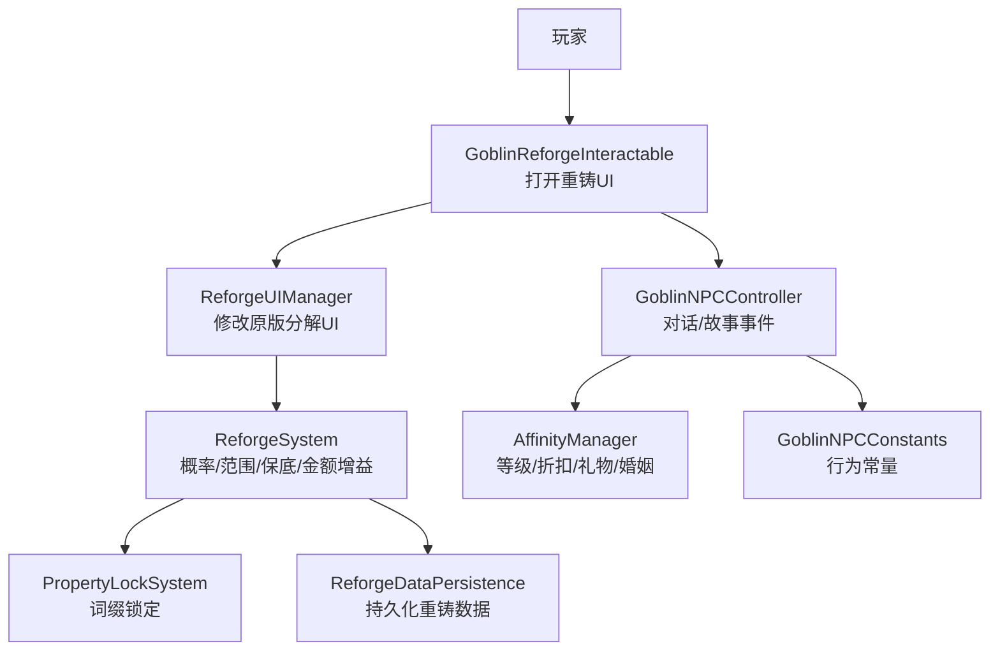
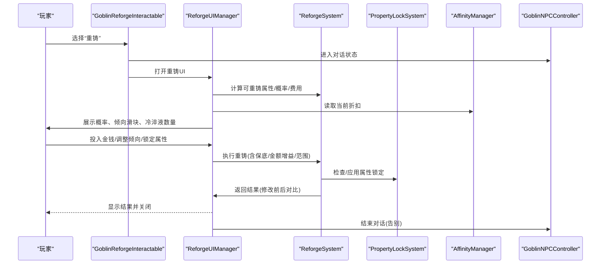
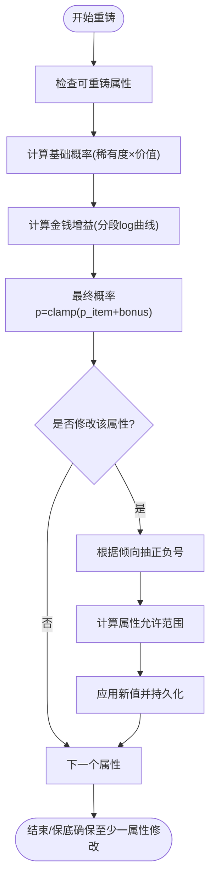
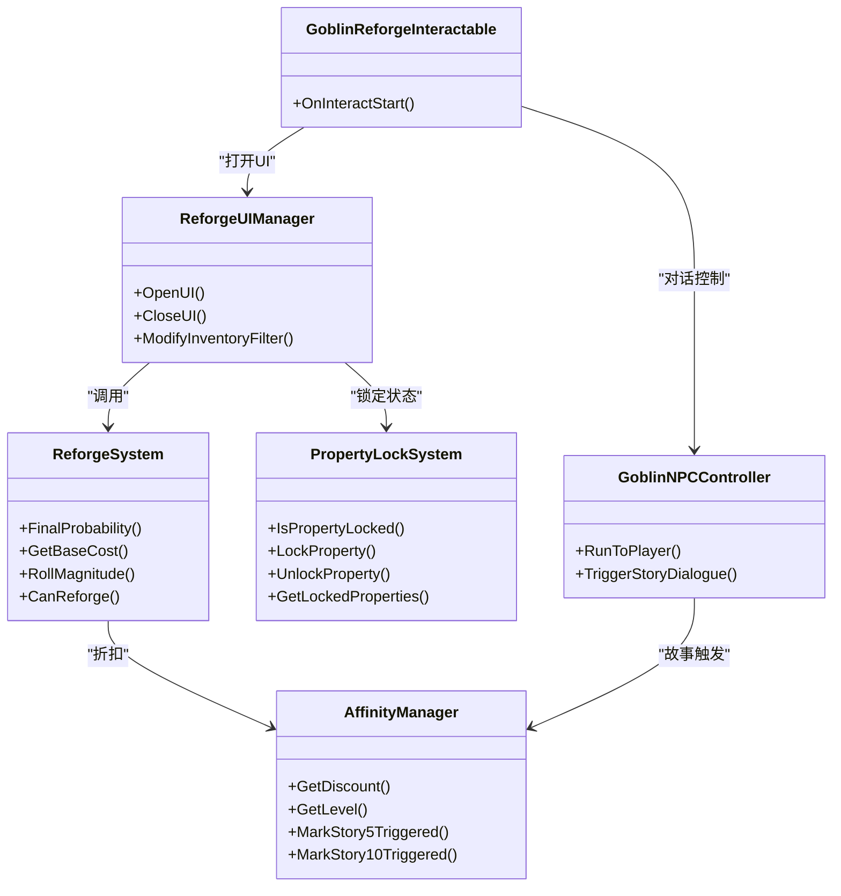

# 叮当（哥布林工匠）

<cite>
**本文引用的文件**
- [ReforgeSystem.cs](file://Integration/Reforge/ReforgeSystem.cs)
- [ReforgeSystem_ApplyAndResults.cs](file://Integration/Reforge/ReforgeSystem_ApplyAndResults.cs)
- [PropertyLockSystem.cs](file://Integration/Reforge/PropertyLockSystem.cs)
- [GoblinReforgeInteractable.cs](file://Integration/Reforge/GoblinReforgeInteractable.cs)
- [ReforgeUIManager.cs](file://Integration/Reforge/ReforgeUIManager.cs)
- [GoblinNPC.cs](file://Integration/NPCs/Goblin/GoblinNPC.cs)
- [GoblinNPCController.cs](file://Integration/NPCs/Goblin/GoblinNPCController.cs)
- [AffinityManager.cs](file://Integration/Affinity/AffinityManager.cs)
- [GoblinNPCConstants.cs](file://Integration/Constants/GoblinNPCConstants.cs)
</cite>

## 目录
1. [简介](#简介)
2. [项目结构](#项目结构)
3. [核心组件](#核心组件)
4. [架构总览](#架构总览)
5. [详细组件分析](#详细组件分析)
6. [依赖关系分析](#依赖关系分析)
7. [性能与扩展性](#性能与扩展性)
8. [故障排查指南](#故障排查指南)
9. [结论](#结论)
10. [附录：配置与自定义扩展](#附录：配置与自定义扩展)

## 简介
本文件面向“叮当（哥布林工匠）”这一重铸师 NPC，系统性说明其作为重铸服务的实现原理、属性随机化算法、词缀锁定机制、与好感度系统的深度集成（折扣、礼物偏好、关系影响），以及哥布林的独特行为模式（贪婪性格、讨价还价、节日活动等）。同时提供重铸系统配置方法与自定义扩展指南，帮助开发者在不破坏现有功能的前提下进行二次开发。

## 项目结构
围绕叮当的重铸能力，代码主要分布在以下模块：
- 重铸核心：概率计算、属性范围、结果应用、持久化
- UI交互：基于原版分解界面改造的重铸界面、倾向滑块、冷淬液消耗、属性锁定可视化
- NPC控制：生成、移动、对话、故事事件触发
- 好感度：等级、折扣、礼物、婚姻等状态管理
- 常量：距离阈值、动画参数、气泡显示等

图表来源
- [GoblinReforgeInteractable.cs:56-79](file://Integration/Reforge/GoblinReforgeInteractable.cs#L56-L79)
- [ReforgeUIManager.cs:397-421](file://Integration/Reforge/ReforgeUIManager.cs#L397-L421)
- [ReforgeSystem.cs:301-420](file://Integration/Reforge/ReforgeSystem.cs#L301-L420)
- [PropertyLockSystem.cs:61-140](file://Integration/Reforge/PropertyLockSystem.cs#L61-L140)
- [GoblinNPCController.cs:214-256](file://Integration/NPCs/Goblin/GoblinNPCController.cs#L214-L256)
- [AffinityManager.cs:471-497](file://Integration/Affinity/AffinityManager.cs#L471-L497)
- [GoblinNPCConstants.cs:27-53](file://Integration/Constants/GoblinNPCConstants.cs#L27-L53)

章节来源
- [GoblinReforgeInteractable.cs:56-79](file://Integration/Reforge/GoblinReforgeInteractable.cs#L56-L79)
- [ReforgeUIManager.cs:397-421](file://Integration/Reforge/ReforgeUIManager.cs#L397-L421)
- [ReforgeSystem.cs:301-420](file://Integration/Reforge/ReforgeSystem.cs#L301-L420)
- [PropertyLockSystem.cs:61-140](file://Integration/Reforge/PropertyLockSystem.cs#L61-L140)
- [GoblinNPCController.cs:214-256](file://Integration/NPCs/Goblin/GoblinNPCController.cs#L214-L256)
- [AffinityManager.cs:471-497](file://Integration/Affinity/AffinityManager.cs#L471-L497)
- [GoblinNPCConstants.cs:27-53](file://Integration/Constants/GoblinNPCConstants.cs#L27-L53)

## 核心组件
- 重铸系统核心：负责可重铸属性判定、概率计算、幅度抽取、正负号倾向、保底机制、费用计算、结果应用与持久化。
- 属性锁定系统：通过物品 Variables 存储固定标记，支持锁定/解锁、查询已锁定属性数量。
- 重铸UI管理器：复用原版分解界面，注入金钱滑块、倾向滑块、概率显示、冷淬液消耗、属性锁定可视化。
- 哥布林交互组件：为哥布林添加“重铸”子选项，并处理聊天、礼物、商店、婚姻等组合交互。
- 哥布林控制器：管理生成、移动、对话、故事事件、气泡反馈、10级故事奖励。
- 好感度管理器：统一等级体系、折扣计算、礼物偏好、婚姻状态、故事触发标记。

章节来源
- [ReforgeSystem.cs:18-16](file://Integration/Reforge/ReforgeSystem.cs#L18-L16)
- [PropertyLockSystem.cs:23-36](file://Integration/Reforge/PropertyLockSystem.cs#L23-L36)
- [ReforgeUIManager.cs:130-133](file://Integration/Reforge/ReforgeUIManager.cs#L130-L133)
- [GoblinReforgeInteractable.cs:16-20](file://Integration/Reforge/GoblinReforgeInteractable.cs#L16-L20)
- [GoblinNPCController.cs:21-25](file://Integration/NPCs/Goblin/GoblinNPCController.cs#L21-L25)
- [AffinityManager.cs:16-19](file://Integration/Affinity/AffinityManager.cs#L16-L19)

## 架构总览
重铸流程从玩家与哥布林交互开始，到最终属性变更与持久化，涉及多个子系统协作：

图表来源
- [GoblinReforgeInteractable.cs:56-79](file://Integration/Reforge/GoblinReforgeInteractable.cs#L56-L79)
- [ReforgeUIManager.cs:397-421](file://Integration/Reforge/ReforgeUIManager.cs#L397-L421)
- [ReforgeSystem.cs:301-420](file://Integration/Reforge/ReforgeSystem.cs#L301-L420)
- [PropertyLockSystem.cs:61-140](file://Integration/Reforge/PropertyLockSystem.cs#L61-L140)
- [AffinityManager.cs:471-497](file://Integration/Affinity/AffinityManager.cs#L471-L497)
- [GoblinNPCController.cs:423-593](file://Integration/NPCs/Goblin/GoblinNPCController.cs#L423-L593)

## 详细组件分析

### 重铸系统（ReforgeSystem）
- 可重铸属性判定：仅对 Display=true 的 Modifier/Stat/Variable 参与；排除系统跟踪变量与特定 Stat（如 DealDamageTime、ShotCount、ShotAngle）。
- 概率公式：基础概率由稀有度因子与价值因子决定；金钱投入按分段函数提供额外加成；最终概率 p = clamp(p_item + money_bonus)。
- 幅度抽取：使用 u^expo，p越大 expo越小，幅度分布更偏向大值。
- 正负号倾向：倾向滑块控制绝对正负号概率（0必定负，1必定正，0.5各半）。
- 属性范围：小数值属性（≤1或强制键）采用绝对范围；其他属性按原值的百分比范围限制；整数属性保持整数。
- 保底机制：连续失败后提升成功率，保证每次重铸至少一个属性被修改。
- 费用计算：基础费用为物品价值的1/100，最低有最小费用；结合好感度折扣得到最终费用。
- 结果应用：通过委托缓存高效修改 Modifier/Stat/Variable 的值，并持久化重铸数据以应对场景切换。

图表来源
- [ReforgeSystem.cs:301-420](file://Integration/Reforge/ReforgeSystem.cs#L301-L420)
- [ReforgeSystem_ApplyAndResults.cs:147-179](file://Integration/Reforge/ReforgeSystem_ApplyAndResults.cs#L147-L179)

章节来源
- [ReforgeSystem.cs:18-16](file://Integration/Reforge/ReforgeSystem.cs#L18-L16)
- [ReforgeSystem.cs:301-420](file://Integration/Reforge/ReforgeSystem.cs#L301-L420)
- [ReforgeSystem_ApplyAndResults.cs:147-179](file://Integration/Reforge/ReforgeSystem_ApplyAndResults.cs#L147-L179)

### 属性锁定系统（PropertyLockSystem）
- 持久化前缀：Modifier/Stat/Variable 分别使用不同前缀存储在物品 Variables 中。
- 锁定/解锁：锁定后在重铸时跳过该属性；解锁则恢复可重铸。
- 查询：可获取所有已锁定属性及其类型，便于UI显示与逻辑判断。
- 安全：异常捕获与日志记录，避免锁状态损坏。

章节来源
- [PropertyLockSystem.cs:23-36](file://Integration/Reforge/PropertyLockSystem.cs#L23-L36)
- [PropertyLockSystem.cs:61-140](file://Integration/Reforge/PropertyLockSystem.cs#L61-L140)
- [PropertyLockSystem.cs:179-251](file://Integration/Reforge/PropertyLockSystem.cs#L179-L251)

### 重铸UI（ReforgeUIManager）
- 复用原版分解界面：通过反射获取并修改内部字段，将分解按钮改为“重铸”，滑块改为金钱滑块。
- 倾向滑块：新增滑动条控制正负号倾向，实时影响重铸结果。
- 冷淬液消耗：属性锁定需要消耗冷淬液，UI显示库存并在点击时扣减。
- 概率与结果展示：动态显示概率描述、属性范围、修改前后对比。
- 过滤条件：仅允许选择可重铸的物品。

章节来源
- [ReforgeUIManager.cs:130-133](file://Integration/Reforge/ReforgeUIManager.cs#L130-L133)
- [ReforgeUIManager.cs:397-421](file://Integration/Reforge/ReforgeUIManager.cs#L397-L421)
- [ReforgeUIManager.cs:576-626](file://Integration/Reforge/ReforgeUIManager.cs#L576-L626)
- [ReforgeUIManager.cs:712-763](file://Integration/Reforge/ReforgeUIManager.cs#L712-L763)

### 哥布林交互（GoblinReforgeInteractable / GoblinInteractable）
- 子选项：在主交互下提供“重铸”、“商店”、“礼物”、“婚姻相关”等组合选项。
- 对话状态：交互时让哥布林进入对话状态，播放音效，延迟结束对话。
- 婚姻选项：仅在已婚且为当前配偶时显示跟随、离婚、回家等专属选项。

章节来源
- [GoblinReforgeInteractable.cs:16-20](file://Integration/Reforge/GoblinReforgeInteractable.cs#L16-L20)
- [GoblinReforgeInteractable.cs:56-79](file://Integration/Reforge/GoblinReforgeInteractable.cs#L56-L79)
- [GoblinReforgeInteractable.cs:87-100](file://Integration/Reforge/GoblinReforgeInteractable.cs#L87-L100)
- [GoblinReforgeInteractable.cs:187-250](file://Integration/Reforge/GoblinReforgeInteractable.cs#L187-L250)
- [GoblinReforgeInteractable.cs:252-305](file://Integration/Reforge/GoblinReforgeInteractable.cs#L252-L305)

### 哥布林控制器（GoblinNPCController）
- 生成与销毁：懒加载资源，避开快递员位置，Raycast修正落点。
- 移动与动画：跑向玩家、急停动画、停止待机、面向玩家。
- 故事对话：达到5级/10级时在3米内触发多段对话，完成后发放礼物。
- 气泡反馈：爱心/碎心气泡，配合对话与召唤行为。

章节来源
- [GoblinNPC.cs:40-48](file://Integration/NPCs/Goblin/GoblinNPC.cs#L40-L48)
- [GoblinNPC.cs:114-230](file://Integration/NPCs/Goblin/GoblinNPC.cs#L114-L230)
- [GoblinNPCController.cs:166-212](file://Integration/NPCs/Goblin/GoblinNPCController.cs#L166-L212)
- [GoblinNPCController.cs:214-256](file://Integration/NPCs/Goblin/GoblinNPCController.cs#L214-L256)
- [GoblinNPCController.cs:267-329](file://Integration/NPCs/Goblin/GoblinNPCController.cs#L267-L329)
- [GoblinNPCController.cs:423-593](file://Integration/NPCs/Goblin/GoblinNPCController.cs#L423-L593)

### 好感度系统（AffinityManager）
- 统一等级：10级递增式点数要求，提供等级进度与详情。
- 折扣机制：根据当前等级查找最高折扣，用于重铸费用减免。
- 礼物偏好：记录上次赠送日期与反应，支持每日衰减与历史追踪。
- 婚姻状态：检测是否已婚、当前配偶ID，控制婚后专属选项。
- 故事触发：持久化标记5级/10级故事是否已触发，避免重复。

章节来源
- [AffinityManager.cs:21-47](file://Integration/Affinity/AffinityManager.cs#L21-L47)
- [AffinityManager.cs:248-343](file://Integration/Affinity/AffinityManager.cs#L248-L343)
- [AffinityManager.cs:471-497](file://Integration/Affinity/AffinityManager.cs#L471-L497)
- [AffinityManager.cs:503-560](file://Integration/Affinity/AffinityManager.cs#L503-L560)
- [AffinityManager.cs:727-793](file://Integration/Affinity/AffinityManager.cs#L727-L793)

## 依赖关系分析
- ReforgeSystem 依赖 AffinityManager 获取折扣，依赖 PropertyLockSystem 进行属性锁定，依赖 ReforgeDataPersistence 进行持久化。
- ReforgeUIManager 依赖 ItemDecomposeView 进行界面改造，依赖 ReforgeSystem 计算概率与范围，依赖 PropertyLockSystem 更新锁定状态。
- GoblinReforgeInteractable 依赖 GoblinNPCController 控制对话状态，依赖 ReforgeUIManager 打开界面。
- GoblinNPCController 依赖 AffinityManager 检查故事触发条件，依赖常量类控制行为阈值。

图表来源
- [ReforgeSystem.cs:301-420](file://Integration/Reforge/ReforgeSystem.cs#L301-L420)
- [PropertyLockSystem.cs:61-140](file://Integration/Reforge/PropertyLockSystem.cs#L61-L140)
- [ReforgeUIManager.cs:397-421](file://Integration/Reforge/ReforgeUIManager.cs#L397-L421)
- [GoblinReforgeInteractable.cs:56-79](file://Integration/Reforge/GoblinReforgeInteractable.cs#L56-L79)
- [GoblinNPCController.cs:214-256](file://Integration/NPCs/Goblin/GoblinNPCController.cs#L214-L256)
- [AffinityManager.cs:471-497](file://Integration/Affinity/AffinityManager.cs#L471-L497)

章节来源
- [ReforgeSystem.cs:301-420](file://Integration/Reforge/ReforgeSystem.cs#L301-L420)
- [PropertyLockSystem.cs:61-140](file://Integration/Reforge/PropertyLockSystem.cs#L61-L140)
- [ReforgeUIManager.cs:397-421](file://Integration/Reforge/ReforgeUIManager.cs#L397-L421)
- [GoblinReforgeInteractable.cs:56-79](file://Integration/Reforge/GoblinReforgeInteractable.cs#L56-L79)
- [GoblinNPCController.cs:214-256](file://Integration/NPCs/Goblin/GoblinNPCController.cs#L214-L256)
- [AffinityManager.cs:471-497](file://Integration/Affinity/AffinityManager.cs#L471-L497)

## 性能与扩展性
- 委托缓存：对 ModifierDescription.value 与 Stat.baseValue 的写入使用表达式树编译的委托，比反射快约10倍。
- 反射缓存：UI层对内部字段与方法进行一次性缓存，减少运行时反射开销。
- 预制体缓存：重铸UI中缓存物品预制体实例，避免重复实例化。
- 异步与协程：故事对话使用异步任务，UI构建使用协程合并，避免阻塞主线程。
- 可扩展点：
  - 新增可重铸属性：在 UNSUPPORTED_REFORGE_STAT_KEYS 与 UNSUPPORTED_REFORGE_VARIABLE_KEYS 中排除不需要的键。
  - 调整概率曲线：修改 RarityFactor、ValueFactor、MoneyBonus 的参数。
  - 扩展属性范围：在 GetPropertyValueBounds 中添加新的强制绝对范围键。
  - 自定义折扣：在 AffinityManager.GetDiscount 中为不同NPC配置等级-折扣映射。

章节来源
- [ReforgeSystem.cs:48-98](file://Integration/Reforge/ReforgeSystem.cs#L48-L98)
- [ReforgeSystem_ApplyAndResults.cs:181-225](file://Integration/Reforge/ReforgeSystem_ApplyAndResults.cs#L181-L225)
- [ReforgeUIManager.cs:152-206](file://Integration/Reforge/ReforgeUIManager.cs#L152-L206)
- [ReforgeUIManager.cs:269-325](file://Integration/Reforge/ReforgeUIManager.cs#L269-L325)
- [GoblinNPCController.cs:471-593](file://Integration/NPCs/Goblin/GoblinNPCController.cs#L471-L593)

## 故障排查指南
- 无法打开重铸UI：检查 ItemDecomposeView 实例是否存在，确认 ModifyUIDelayed 是否成功执行。
- 属性未修改：确认 CanReforge 返回true，检查属性是否在 UNSUPPORTED_REFORGE_STAT_KEYS 中。
- 锁定失败：检查冷淬液库存，确认 PropertyLockSystem.LockProperty 返回值。
- 故事对话未触发：检查玩家距离、UI是否打开、好感度等级、故事触发标记。
- 折扣不生效：确认 AffinityManager.GetDiscount 返回正确等级对应的折扣。

章节来源
- [ReforgeUIManager.cs:576-626](file://Integration/Reforge/ReforgeUIManager.cs#L576-L626)
- [ReforgeSystem.cs:611-671](file://Integration/Reforge/ReforgeSystem.cs#L611-L671)
- [PropertyLockSystem.cs:96-140](file://Integration/Reforge/PropertyLockSystem.cs#L96-L140)
- [GoblinNPCController.cs:214-256](file://Integration/NPCs/Goblin/GoblinNPCController.cs#L214-L256)
- [AffinityManager.cs:471-497](file://Integration/Affinity/AffinityManager.cs#L471-L497)

## 结论
叮当（哥布林工匠）通过完善的概率算法、灵活的属性范围控制、可靠的词缀锁定机制，以及与好感度系统的深度集成，提供了高质量的重铸体验。其UI基于原版界面改造，保证了兼容性与易用性；哥布林的行为模式增强了角色个性与沉浸感。开发者可通过扩展点轻松定制概率曲线、属性范围、折扣策略与故事内容。

## 附录：配置与自定义扩展
- 调整重铸概率：修改 BaseProbability、RarityFactor、ValueFactor、MoneyBonus 的参数。
- 新增可重铸属性：在 IsPropertySupportedForReforge 中放行新键，或在 UNSUPPORTED_REFORGE_*_KEYS 中排除。
- 自定义属性范围：在 GetPropertyValueBounds 中添加新的强制绝对范围键或调整百分比范围。
- 配置折扣策略：在 AffinityManager.RegisterNPC 中为哥布林配置等级-折扣映射。
- 扩展故事对话：在 LocalizationInjector 中注册新的故事对话键，并在 TriggerStoryDialogueAsync 中调用。
- 调整行为常量：在 GoblinNPCConstants 中修改距离阈值、动画参数、气泡显示等。

章节来源
- [ReforgeSystem.cs:301-420](file://Integration/Reforge/ReforgeSystem.cs#L301-L420)
- [ReforgeSystem.cs:543-565](file://Integration/Reforge/ReforgeSystem.cs#L543-L565)
- [ReforgeSystem.cs:431-478](file://Integration/Reforge/ReforgeSystem.cs#L431-L478)
- [AffinityManager.cs:219-242](file://Integration/Affinity/AffinityManager.cs#L219-L242)
- [GoblinNPCController.cs:471-593](file://Integration/NPCs/Goblin/GoblinNPCController.cs#L471-L593)
- [GoblinNPCConstants.cs:27-53](file://Integration/Constants/GoblinNPCConstants.cs#L27-L53)