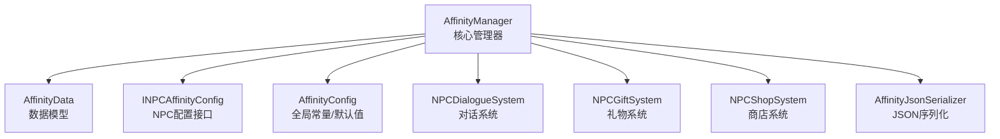
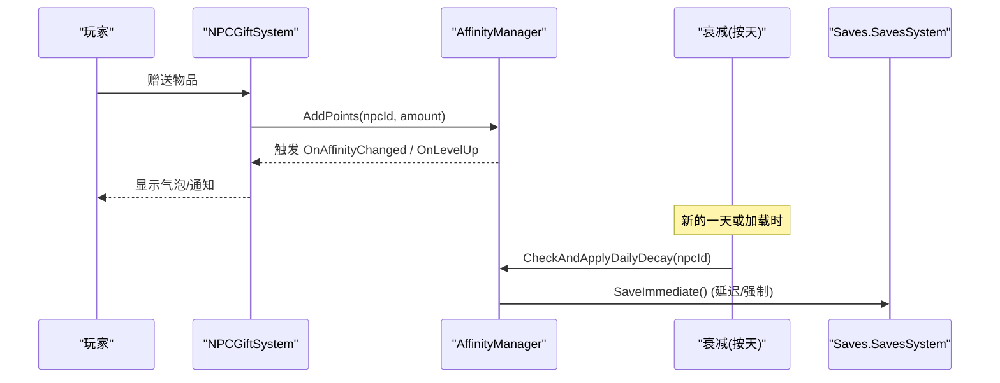
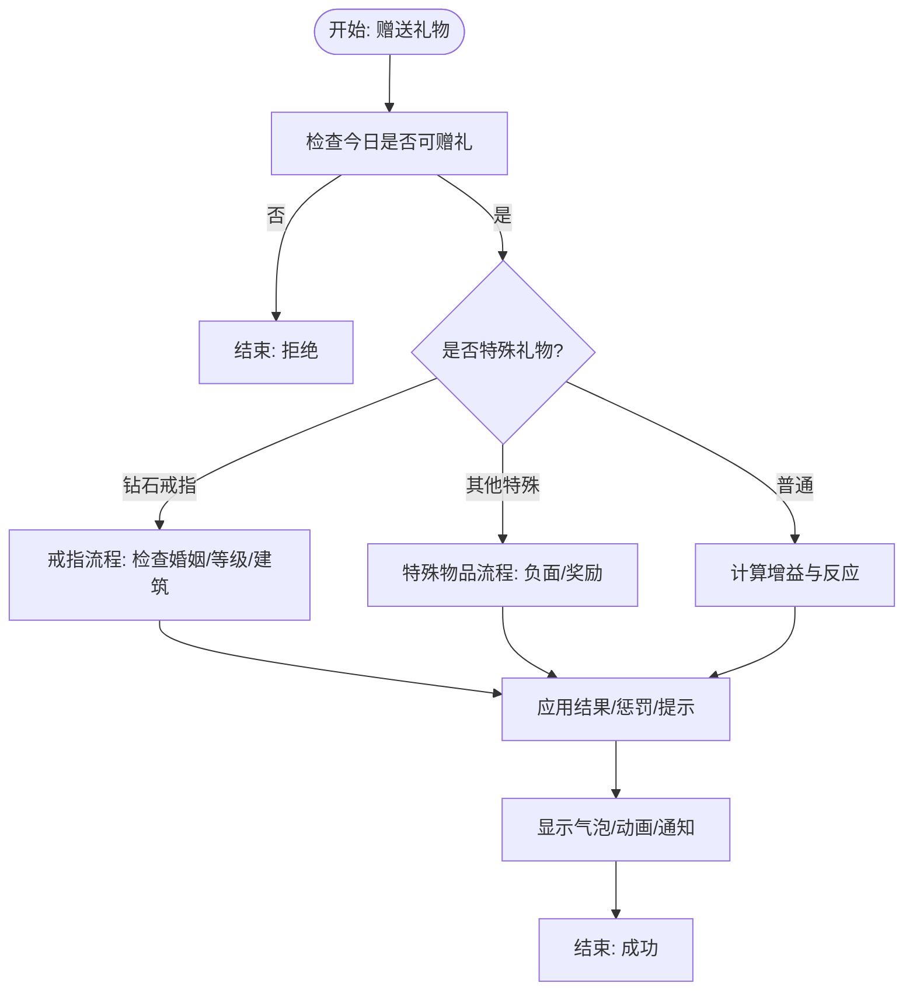
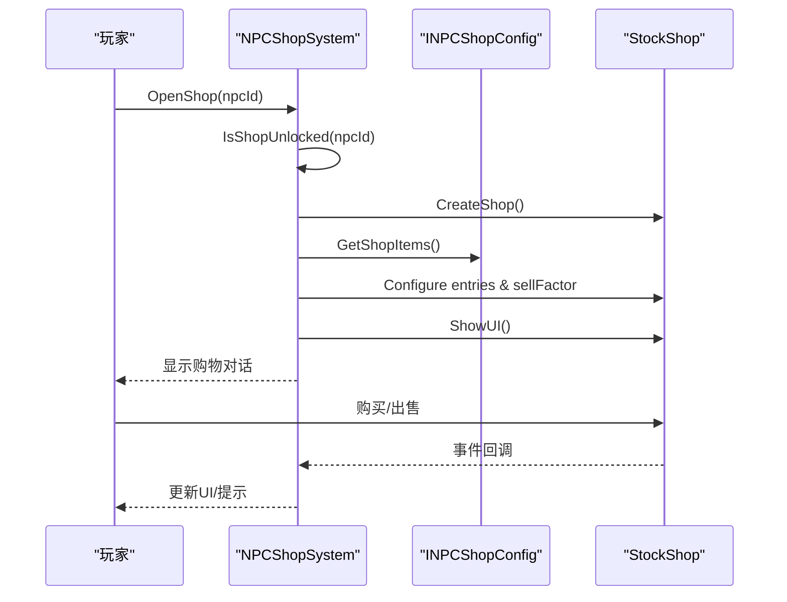
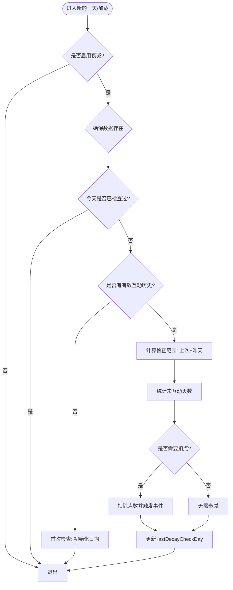
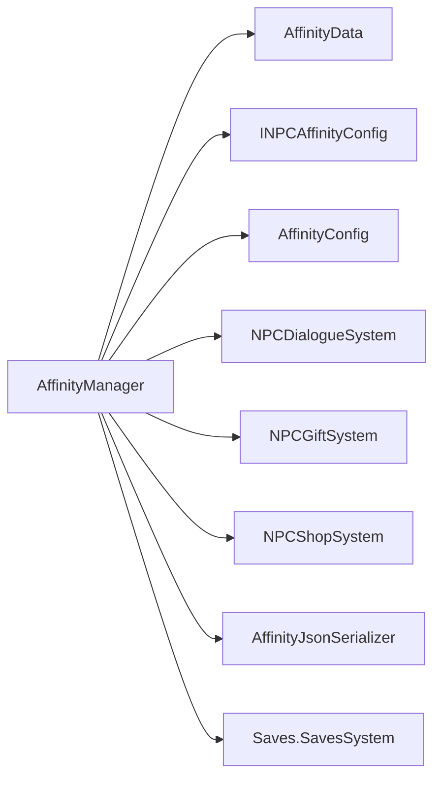

# 好感度框架核心

<cite>
**本文引用的文件**
- [AffinityManager.cs](file://Integration/Affinity/AffinityManager.cs)
- [AffinityData.cs](file://Integration/Affinity/AffinityData.cs)
- [INPCAffinityConfig.cs](file://Integration/Affinity/INPCAffinityConfig.cs)
- [AffinityConfig.cs](file://Integration/Affinity/AffinityConfig.cs)
- [NPCDialogueSystem.cs](file://Integration/Affinity/Systems/NPCDialogueSystem.cs)
- [NPCGiftSystem.cs](file://Integration/Affinity/Systems/NPCGiftSystem.cs)
- [NPCShopSystem.cs](file://Integration/Affinity/Systems/NPCShopSystem.cs)
- [AffinityManagerPersistenceAndDecay.cs](file://Integration/Affinity/AffinityManagerPersistenceAndDecay.cs)
- [AffinityJsonSerializer.cs](file://Integration/Affinity/AffinityJsonSerializer.cs)
</cite>

## 目录
1. [简介](#简介)
2. [项目结构](#项目结构)
3. [核心组件](#核心组件)
4. [架构总览](#架构总览)
5. [详细组件分析](#详细组件分析)
6. [依赖关系分析](#依赖关系分析)
7. [性能考量](#性能考量)
8. [故障排查指南](#故障排查指南)
9. [结论](#结论)
10. [附录：扩展开发最佳实践](#附录：扩展开发最佳实践)

## 简介
本模块为“好感度框架核心”，提供统一的多NPC好感度管理、等级与解锁体系、每日衰减机制、对话/礼物/商店等子系统，以及持久化与UI联动。其目标是让任意NPC通过实现配置接口即可接入完整的好感度生态，并支持剧情触发、折扣、结婚等高级玩法。

## 项目结构
好感度相关代码集中在 Integration/Affinity 目录下，采用“核心管理器 + 数据模型 + 配置接口 + 子系统”的分层组织：
- 核心管理器：AffinityManager（含持久化与衰减）
- 数据模型：AffinityData
- 配置接口与全局常量：INPCAffinityConfig、AffinityConfig
- 子系统：对话系统、礼物系统、商店系统
- 序列化：AffinityJsonSerializer

图表来源
- [AffinityManager.cs:16-84](file://Integration/Affinity/AffinityManager.cs#L16-L84)
- [AffinityData.cs:5-24](file://Integration/Affinity/AffinityData.cs#L5-L24)
- [INPCAffinityConfig.cs:14-75](file://Integration/Affinity/INPCAffinityConfig.cs#L14-L75)
- [AffinityConfig.cs:14-68](file://Integration/Affinity/AffinityConfig.cs#L14-L68)
- [NPCDialogueSystem.cs:15-299](file://Integration/Affinity/Systems/NPCDialogueSystem.cs#L15-L299)
- [NPCGiftSystem.cs:17-633](file://Integration/Affinity/Systems/NPCGiftSystem.cs#L17-L633)
- [NPCShopSystem.cs:25-800](file://Integration/Affinity/Systems/NPCShopSystem.cs#L25-L800)
- [AffinityJsonSerializer.cs:6-88](file://Integration/Affinity/AffinityJsonSerializer.cs#L6-L88)

章节来源
- [AffinityManager.cs:16-84](file://Integration/Affinity/AffinityManager.cs#L16-L84)
- [AffinityConfig.cs:14-68](file://Integration/Affinity/AffinityConfig.cs#L14-L68)

## 核心组件
- AffinityManager：单例式管理器，负责注册NPC、读写点数、计算等级/进度、事件派发、延迟保存、故事触发标记、婚姻状态查询等。
- AffinityData：每个NPC的持久化数据结构，包含点数、交互历史、故事触发、婚姻状态、衰减检查日等。
- INPCAffinityConfig：NPC个性化配置接口，定义最大点数、每级点数、最大等级、礼物增益、等级解锁、等级折扣等。
- AffinityConfig：全局默认配置与开关，如每日衰减是否启用、衰减量、存档键名等。
- 子系统：对话系统、礼物系统、商店系统分别封装了显示、赠送、购买等业务逻辑，并与管理器紧密协作。
- 序列化：将内存中的字典映射为JSON字符串进行存档。

章节来源
- [AffinityManager.cs:16-84](file://Integration/Affinity/AffinityManager.cs#L16-L84)
- [AffinityData.cs:5-24](file://Integration/Affinity/AffinityData.cs#L5-L24)
- [INPCAffinityConfig.cs:14-75](file://Integration/Affinity/INPCAffinityConfig.cs#L14-L75)
- [AffinityConfig.cs:14-68](file://Integration/Affinity/AffinityConfig.cs#L14-L68)
- [AffinityJsonSerializer.cs:6-88](file://Integration/Affinity/AffinityJsonSerializer.cs#L6-L88)

## 架构总览
好感度框架以管理器为中心，各子系统通过管理器提供的API完成业务动作；数据通过专用序列化器落盘；等级与解锁由统一递增式配置驱动；每日衰减在合适时机触发并累积扣点。

图表来源
- [NPCGiftSystem.cs:42-245](file://Integration/Affinity/Systems/NPCGiftSystem.cs#L42-L245)
- [AffinityManager.cs:348-422](file://Integration/Affinity/AffinityManager.cs#L348-L422)
- [AffinityManagerPersistenceAndDecay.cs:20-125](file://Integration/Affinity/AffinityManagerPersistenceAndDecay.cs#L20-L125)
- [AffinityManagerPersistenceAndDecay.cs:235-255](file://Integration/Affinity/AffinityManagerPersistenceAndDecay.cs#L235-L255)

## 详细组件分析

### 好感度管理器（AffinityManager）
- 统一等级与进度
  - 使用统一的累计点数表决定等级，从1到10级，满级固定上限。
  - 提供获取当前等级、进度百分比、进度详情（当前等级内已获点数/本级所需点数）等方法。
- 点数操作与事件
  - AddPoints/SetPoints 会约束范围、触发 OnAffinityChanged，并在升级时触发 OnLevelUp。
  - 所有变更均标记脏数据，延迟保存。
- 解锁与折扣
  - IsUnlocked 基于当前等级判断。
  - GetDiscount 根据配置中等级到折扣率的映射，取不超过当前等级的最高折扣。
- 交互历史与衰减
  - 记录聊天/送礼日期与最近一次互动日，维护有限长度的互动历史字符串用于衰减判定。
  - 提供 HasMet、故事触发标记、婚姻状态查询等。
- 初始化与生命周期
  - Initialize 订阅存档事件，LoadFromSave/Load 读取存档，Shutdown 取消订阅并强制写入磁盘。
  - UpdateDeferredSave/FlushSave 控制延迟保存与场景切换时的强制保存。

章节来源
- [AffinityManager.cs:21-57](file://Integration/Affinity/AffinityManager.cs#L21-L57)
- [AffinityManager.cs:107-184](file://Integration/Affinity/AffinityManager.cs#L107-L184)
- [AffinityManager.cs:248-422](file://Integration/Affinity/AffinityManager.cs#L248-L422)
- [AffinityManager.cs:428-497](file://Integration/Affinity/AffinityManager.cs#L428-L497)
- [AffinityManager.cs:503-694](file://Integration/Affinity/AffinityManager.cs#L503-L694)
- [AffinityManager.cs:696-800](file://Integration/Affinity/AffinityManager.cs#L696-L800)

### 数据模型（AffinityData）
- 字段说明
  - npcId、points：标识与点数
  - lastGiftDay、lastChatDay、interactionHistoryDays：交互时间与历史
  - hasMet、hasTriggeredStory5/10、triggeredEventKeys、claimedRewardKeys：剧情与事件标记
  - isMarriedToPlayer、isFollowingPlayer、marriageDateText：婚姻与跟随
  - cheatingIncidentCount、hasPendingCheatingRebuke：花心事件与待处理谴责
  - lastDecayCheckDay：上次衰减检查日
- 设计要点
  - 可序列化，支持 Clone 便于快照或调试。
  - 通过 JSON 序列化器精确映射到存档字段。

章节来源
- [AffinityData.cs:5-24](file://Integration/Affinity/AffinityData.cs#L5-L24)
- [AffinityData.cs:26-57](file://Integration/Affinity/AffinityData.cs#L26-L57)
- [AffinityJsonSerializer.cs:42-87](file://Integration/Affinity/AffinityJsonSerializer.cs#L42-L87)

### 配置系统（INPCAffinityConfig 与 AffinityConfig）
- INPCAffinityConfig
  - 定义 NPC 唯一ID、显示名、最大点数、每级点数、最大等级、礼物增益映射、等级解锁内容、等级折扣映射。
  - 支持多NPC扩展，新增NPC只需实现该接口并注册到管理器。
- AffinityConfig
  - 全局默认值：默认最大点数、每级点数、最大等级、默认礼物增益。
  - 每日衰减：是否启用、每次不互动的扣点。
  - 存档键名与Mod名称。

章节来源
- [INPCAffinityConfig.cs:14-75](file://Integration/Affinity/INPCAffinityConfig.cs#L14-L75)
- [AffinityConfig.cs:14-68](file://Integration/Affinity/AffinityConfig.cs#L14-L68)

### 对话系统（NPCDialogueSystem）
- 功能
  - 根据NPC等级与类别获取对话文本，优先返回关系专属对话（如已婚）。
  - 支持特殊事件对话、问候、收到礼物后对话、等级提升对话、告别等。
  - 通过游戏原生气泡系统展示，高度与时长可由NPC配置覆盖。
- 关键点
  - 若未实现对话接口则回退到默认本地化文案。
  - 对已婚NPC提供差异化对话键，增强沉浸感。

章节来源
- [NPCDialogueSystem.cs:15-299](file://Integration/Affinity/Systems/NPCDialogueSystem.cs#L15-L299)

### 礼物系统（NPCGiftSystem）
- 流程
  - 检查当日是否可赠礼（支持钻石戒指的特殊豁免）。
  - 特殊礼物分支：
    - 钻石戒指：仅对达到指定等级的NPC接受；已婚状态下向其他NPC送戒指视为“花心惩罚”；未建婚礼教堂拒绝求婚。
    - 特定物品（如叮当涂鸦）触发负面效果与反馈。
  - 普通礼物：计算增益、反应类型、增加点数、更新最后赠送日与反应、显示气泡与动画、通知进度。
  - 成功后可能触发结婚流程。
- 算法
  - 物品类型识别（武器、防具、消耗品、图腾、宝石等），结合正负物品列表与标签匹配确定最终增益与反应。
  - 支持关系专属对话回退。

图表来源
- [NPCGiftSystem.cs:32-245](file://Integration/Affinity/Systems/NPCGiftSystem.cs#L32-L245)
- [NPCGiftSystem.cs:248-583](file://Integration/Affinity/Systems/NPCGiftSystem.cs#L248-L583)

章节来源
- [NPCGiftSystem.cs:32-245](file://Integration/Affinity/Systems/NPCGiftSystem.cs#L32-L245)
- [NPCGiftSystem.cs:248-583](file://Integration/Affinity/Systems/NPCGiftSystem.cs#L248-L583)

### 商店系统（NPCShopSystem）
- 功能
  - 检查商店解锁条件（等级门槛）。
  - 动态创建商店对象，配置商品条目、价格因子（受好感度折扣影响）、卖出加成。
  - 监听UI事件，关闭时恢复UI文字并清理资源。
  - 支持临时净化点商店等特殊模式（禁用现金出售、动态价格）。
- 折扣与卖出加成
  - 购买价格 = 基础价格 × (1 - 折扣)。
  - 卖出加成 = 0.5 + 折扣/2，使高好感度玩家获得更好的卖出回报。
- UI与交互
  - 反射修改UI文本，注册选择变化事件，异步更新货币显示。

图表来源
- [NPCShopSystem.cs:75-189](file://Integration/Affinity/Systems/NPCShopSystem.cs#L75-L189)
- [NPCShopSystem.cs:311-392](file://Integration/Affinity/Systems/NPCShopSystem.cs#L311-L392)
- [NPCShopSystem.cs:464-528](file://Integration/Affinity/Systems/NPCShopSystem.cs#L464-L528)

章节来源
- [NPCShopSystem.cs:75-189](file://Integration/Affinity/Systems/NPCShopSystem.cs#L75-L189)
- [NPCShopSystem.cs:311-392](file://Integration/Affinity/Systems/NPCShopSystem.cs#L311-L392)
- [NPCShopSystem.cs:464-528](file://Integration/Affinity/Systems/NPCShopSystem.cs#L464-L528)

### 持久化与衰减（AffinityManagerPersistenceAndDecay）
- 每日衰减
  - 仅在启用且存在有效互动历史时执行。
  - 计算自上次检查日到昨天之间未互动的天数，乘以每日衰减量得到总扣点。
  - 限制最大衰减天数为30天，避免异常累积。
  - 触发 OnAffinityChanged 并更新 lastDecayCheckDay。
- 存档
  - 使用专用序列化器将内存字典序列化为JSON，通过 Saves.SavesSystem 保存。
  - 支持 Load/ResetAll/OnSceneUnload 等生命周期方法。
  - 延迟保存策略：UpdateDeferredSave 在间隔后自动保存，FlushSave 强制保存。

图表来源
- [AffinityManagerPersistenceAndDecay.cs:20-125](file://Integration/Affinity/AffinityManagerPersistenceAndDecay.cs#L20-L125)
- [AffinityManagerPersistenceAndDecay.cs:172-183](file://Integration/Affinity/AffinityManagerPersistenceAndDecay.cs#L172-L183)

章节来源
- [AffinityManagerPersistenceAndDecay.cs:20-125](file://Integration/Affinity/AffinityManagerPersistenceAndDecay.cs#L20-L125)
- [AffinityManagerPersistenceAndDecay.cs:235-298](file://Integration/Affinity/AffinityManagerPersistenceAndDecay.cs#L235-L298)

## 依赖关系分析
- 管理器依赖
  - 数据模型：AffinityData
  - 配置接口：INPCAffinityConfig
  - 全局常量：AffinityConfig
  - 子系统：NPCDialogueSystem、NPCGiftSystem、NPCShopSystem
  - 序列化：AffinityJsonSerializer
  - 存档：Saves.SavesSystem
- 子系统依赖
  - 礼物系统与商店系统均依赖管理器进行点数增减、折扣计算与等级判断。
  - 对话系统依赖管理器获取等级与配置，并通过游戏气泡系统展示。

图表来源
- [AffinityManager.cs:16-84](file://Integration/Affinity/AffinityManager.cs#L16-L84)
- [AffinityManagerPersistenceAndDecay.cs:192-208](file://Integration/Affinity/AffinityManagerPersistenceAndDecay.cs#L192-L208)
- [AffinityJsonSerializer.cs:6-88](file://Integration/Affinity/AffinityJsonSerializer.cs#L6-L88)

章节来源
- [AffinityManager.cs:16-84](file://Integration/Affinity/AffinityManager.cs#L16-L84)
- [AffinityManagerPersistenceAndDecay.cs:192-208](file://Integration/Affinity/AffinityManagerPersistenceAndDecay.cs#L192-L208)

## 性能考量
- 延迟保存：通过脏标记与时间间隔减少频繁IO，场景切换时强制保存保证数据一致性。
- 衰减计算：限制最大检查范围为30天，避免长周期累积导致的性能问题。
- 反射缓存：礼物与商店系统对反射字段进行缓存，降低重复反射开销。
- 物品实例缓存：商店打开前手动缓存物品实例，避免运行时重复实例化。
- 事件最小化：仅在点数变化或升级时触发事件，减少UI刷新压力。

[本节为通用性能建议，不直接分析具体文件]

## 故障排查指南
- 无法打开商店
  - 检查当前场景是否存在 StockShopView；若无，会显示提示气泡并中止。
  - 确认NPC等级满足解锁要求。
- 礼物被拒绝
  - 钻石戒指需要达到指定等级且已建造婚礼教堂；已婚状态下向其他NPC送戒指会触发惩罚。
  - 某些特殊物品（如叮当涂鸦）有负面效果。
- 每日衰减异常
  - 确认是否启用了衰减；检查 lastDecayCheckDay 是否正确更新；确认互动历史是否记录。
- 存档丢失
  - 检查是否在正确时机调用 SaveImmediate/FlushSave；确认 Saves.SavesSystem 可用。

章节来源
- [NPCShopSystem.cs:95-189](file://Integration/Affinity/Systems/NPCShopSystem.cs#L95-L189)
- [NPCGiftSystem.cs:82-158](file://Integration/Affinity/Systems/NPCGiftSystem.cs#L82-L158)
- [AffinityManagerPersistenceAndDecay.cs:20-125](file://Integration/Affinity/AffinityManagerPersistenceAndDecay.cs#L20-L125)
- [AffinityManagerPersistenceAndDecay.cs:235-298](file://Integration/Affinity/AffinityManagerPersistenceAndDecay.cs#L235-L298)

## 结论
好感度框架以管理器为核心，围绕统一等级、配置接口、子系统与持久化构建出可扩展、易用的NPC关系系统。通过清晰的职责划分与事件驱动，开发者可以快速接入新的NPC与玩法，同时保持性能与稳定性。

[本节为总结性内容，不直接分析具体文件]

## 附录：扩展开发最佳实践
- 新增NPC
  - 实现 INPCAffinityConfig，设置 NpcId、DisplayName、MaxPoints、PointsPerLevel、MaxLevel、GiftValues、UnlocksByLevel、DiscountsByLevel。
  - 在适当时机调用 AffinityManager.RegisterNPC(config) 注册。
- 自定义对话
  - 如需更丰富的对话，可实现 INPCDialogueConfig（参考对话系统对配置的读取方式），并提供不同类别与等级下的对话文本。
- 自定义礼物
  - 在 INPCGiftConfig（由礼物系统读取）中配置 PositiveItems/NegativeItems/PositiveTags 等，以精细控制增益与反应。
  - 利用 NPCGiftSystem.CalculateGiftValue 与 GetGiftReactionType 的行为进行扩展。
- 自定义商店
  - 实现 INPCShopConfig，提供 GetShopItems 与折扣计算；商店会自动应用等级解锁与折扣。
- 衰减与存档
  - 确保在场景切换或新的一天开始时调用衰减检查；必要时调用 FlushSave 保证数据落盘。
- 事件驱动
  - 订阅 OnAffinityChanged 与 OnLevelUp 以更新UI或触发剧情。
- 调试技巧
  - 使用 ResetAll/ResetDailyGift 重置状态；查看日志输出定位问题。

[本节为通用指导，不直接分析具体文件]