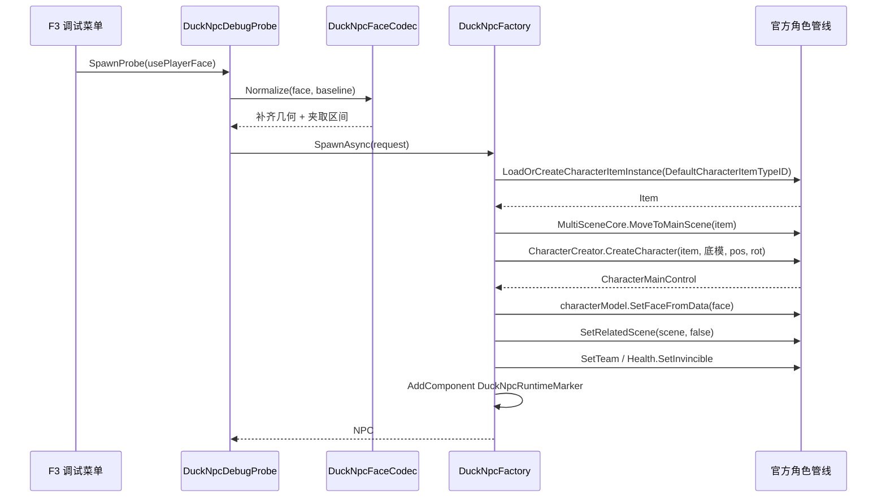

# 捏脸 NPC 工具链

<cite>
**本文引用的文件**
- [DuckNpcFaceCatalog.cs](file://Integration/NPCs/DuckNpc/DuckNpcFaceCatalog.cs)
- [DuckNpcFaceCodec.cs](file://Integration/NPCs/DuckNpc/DuckNpcFaceCodec.cs)
- [DuckNpcFactory.cs](file://Integration/NPCs/DuckNpc/DuckNpcFactory.cs)
- [DuckNpcRuntimeMarker.cs](file://Integration/NPCs/DuckNpc/DuckNpcRuntimeMarker.cs)
- [DuckNpcDebugProbe.cs](file://Integration/NPCs/DuckNpc/DuckNpcDebugProbe.cs)
- [F3DebugCheatMenuUi.cs](file://DebugAndTools/F3DebugCheatMenuUi.cs)
- [F3DebugCheatMenuActions.cs](file://DebugAndTools/F3DebugCheatMenuActions.cs)
- [AlwaysOnRuntimeHooks.cs](file://Utilities/AlwaysOnRuntimeHooks.cs)
- [DeathWraithSpawnFlow.cs](file://Integration/DeathWraith/DeathWraithSpawnFlow.cs)
- [ModeHArenaIsolationLease.cs](file://ModeH/ModeHArenaIsolationLease.cs)
- `docs/制作教程/捏脸NPC工具.md`（本地制作资料）
</cite>

## 目录
1. [简介](#简介)
2. [与现有 NPC 的关系](#与现有-npc-的关系)
3. [核心组件](#核心组件)
4. [生成链路](#生成链路)
5. [兼容面与不变式](#兼容面与不变式)
6. [F3 数据采集](#f3-数据采集)
7. [当前进度与后续](#当前进度与后续)

## 简介

`Integration/NPCs/DuckNpc/` 是**未来新增鸭形 NPC** 的工具链：不建模、不打 AssetBundle，
直接复用官方捏脸系统（`CustomFaceSettingData` / `CustomFaceInstance`）与官方角色管线
（`CharacterCreator.CreateCharacter`）造 NPC。NPC 的长相由一份可进版本库的 JSON 定义，
移动、动画、语音、脚步全部由官方栈提供。

这条链路不是新发明：`Integration/DeathWraith/` 的死亡亡魂已经在做同一件事
（抓玩家捏脸 → 落 ES3 → 凭空造角色 → `SetFaceFromData` 贴脸）。本模块把它提炼为通用工具，
并把亡魂那边对 `LevelManager.characterModel` 的反射替换为官方 public 的
`GameplayDataSettings.Prefabs.DefaultCharacterModel`。

完整设计说明、官方 API 参照表、可捏参数区间与坑位清单见
`docs/制作教程/捏脸NPC工具.md`（本地制作资料）。

## 与现有 NPC 的关系

**并行，不替代。** 阿稳（快递员）、叮当（哥布林）、羽织（护士）三个 AssetBundle NPC
不在本模块范围内，也不迁移：

- 它们有独立且可用的移动（A* + `NPCFollowMovementBase`）、动画与对话栈。
- 叮当是异形，捏脸系统只能造鸭子，**技术上不可能**迁。
- 迁移属于纯风险，无收益。

本模块面向的是"下一个 NPC"，与 [NPC 交互系统](NPC%20交互系统.md) 共用
`INPCController` / `NPCInteractableBase` / 好感度框架，因此新 NPC 可以直接挂现成的交互组件。

## 核心组件

| 组件 | 职责 | 关键设计 |
| --- | --- | --- |
| `DuckNpcFaceCatalog` | 清点官方捏脸家底 | 部件 ID 枚举**纯 public API 实现**：`GetPartPrefab(不存在的 ID)` 回落 `parts[0]`，再用 `GetNextOrPrevPrefab` 步进，`totalCount` 卡上限防打转 |
| `DuckNpcFaceCodec` | 脸数据 JSON 双向 + 归一化 | `ApplyBaselineGeometry` 用官方基线补齐 `radius` / `heightOffset`（捏脸 UI 不暴露这两项）；`Clamp` 按 `CustomFaceUI.Init()` 的真实滑条区间夹取 |
| `DuckNpcFactory` | 生成核心 | 走无 preset 裸造路线，失败自清理不留半成品角色或孤儿物品树 |
| `DuckNpcRuntimeMarker` | 运行时身份 | 实现 `INPCController`，是清场豁免的凭证 |
| `DuckNpcDebugProbe` | F3 数据采集与探针 | 报告落盘 `persistentDataPath/BossRushTestReports/`；日志走 `LogInfo` 而非 `DevLog` |

### 为什么日志不用 DevLog

`ModBehaviour.DevLog` 带 `[System.Diagnostics.Conditional("BOSSRUSH_DEV")]`，
正式构建（未定义 `BOSSRUSH_DEV`）里整句调用被编译器删除。探针的产出需要给人看，
所以采集路径统一用无条件的 `ModBehaviour.LogInfo` / `LogWarning`。
模块内部的诊断信息仍用 `DevLog`。

## 生成链路



### `characterPreset` 留 null 是安全的

裸造路线不经 `CharacterRandomPreset`，因此 `character.characterPreset` 为 null。
官方与本仓库的全部消费方都有 null 守卫：`HealthBar`、`QuestTask_KillCount`、
`BDSManager`、`DamageInfo`、`CodexKillCollector`。唯一副作用是没有官方名条和等级图标，
而交互型 NPC 本来就使用自绘气泡。

## 兼容面与不变式

以下四条是本模块的 load-bearing 约束，回退任何一条都会导致**静默失败**（编译绿、guard 绿、功能不工作）：

1. **`SetRelatedScene` 第二参必须为 `false`。**
   传 `true` 会注册进官方 `SetActiveByPlayerDistance`，该组件每帧无条件
   `SetActive(距玩家 < 100m)`，玩家跑远后 NPC 被静默关掉、服务凭空消失且零报错。
   同一坑位见 `AGENTS.md` 第 14 节与 `Utilities/SpawnedEnemyActivationHelper.cs`。

2. **`DuckNpcRuntimeMarker` 必须挂上。**
   `ModeHArenaIsolationLease.ShouldPreserveNativeCharacter` 靠
   `GetComponentInChildren<INPCController>()` 判定豁免。挂载失败在 `DuckNpcFactory`
   里是**硬失败**（抛异常并销毁半成品），而不是留一个开局就会被清掉的 NPC。

3. **阵营须为非敌对（默认 `Teams.player`）。**
   丧尸模式隔离走"非敌对阵营即保留"，不看 `INPCController`。

4. **外来脸数据必须先过 `DuckNpcFaceCodec.Normalize`。**
   否则 `radius` / `heightOffset` 为 0，五官糊在头部中心。

其他注意项：
- `CustomFaceInstance` 每帧有 `LateUpdate`，不要批量生成大量捏脸 NPC。
- `LoadFromData` 会 Instantiate 7 个部件并 Destroy 旧的，只能在生成时调一次。
- 移动速度写 `WalkSpeed` / `RunSpeed` / `Moveability`，**不是** `MoveSpeed`（那只是 Animator 参数名）。
- `CustomFaceData.Decorations` 是死代码，`CustomFacePartTypes` 与 `CustomFaceSettingData` 都没有对应项。

## F3 数据采集

入口：**F3 → NPC/剧情 页 → 捏脸 NPC 工具区**，六个按钮：

| 按钮 | 产出 |
| --- | --- |
| 输出捏脸家底报告 | `DuckNpcInventory_*.md`：7 类部件的完整 ID 列表、去重底模池及其 `CustomFace` 挂载情况、官方捏脸基线与 preset 模板 JSON |
| 导出玩家捏脸 JSON | `DuckNpcFace_*.json.txt` + 剪贴板。这是新 NPC 长相的**作者工作流** |
| 探针：用玩家脸生成 | 验证"抓脸 → 贴脸"链路 |
| 探针：用官方基线生成 | 验证"手写蓝图"链路的几何补全是否正确 |
| 探针：输出状态 | `DuckNpcProbeState_*.md`，含自动观测项 + 人工目视清单 |
| 探针：回收 | 销毁探针 |
| 探针：随机夸张脸 | 用 `DuckNpcFaceRandomizer` 的 Exaggerated 档生成，参数推到官方区间两端 |
| 探针：随机脸+随机装备 | 上一条 + `DuckNpcOutfitter` 随机穿 8 个视觉槽位 |
| 探针：原地换一张脸 | 不重新生成角色，直接 `SetFaceFromData` 换脸，连点几次即可确认差异 |

探针的静态字段握有 `CharacterMainControl` 引用，已在
`AlwaysOnRuntimeHooks` 卸载路径接入 `DuckNpcDebugProbe.ResetStaticCaches()`。

## 随机脸与装备

`DuckNpcFaceRandomizer` 两档：`Varied`（像玩家正常捏的脸）与 `Exaggerated`
（`PickExtreme()` 只取区间两端各 25% 的窄带，避开中间地带，用于肉眼验证差异）。

**部件 ID 必须走 `DuckNpcFaceCatalog.EnumeratePartIds()` 的真实枚举结果。**
2026-09-04 实测 hair 的合法 ID 是 `0,1,2,3,4,6,...,18` —— **缺 5，不连续**。
用 `Random.Range(0, totalCount)` 会取到不存在的 5，官方 `GetPartPrefab`
找不到时**静默回落 `parts[0]`**，随机结果会异常偏向 0 号且不报任何错。

`DuckNpcOutfitter` 给 NPC 穿官方装备，**不硬编码任何 TypeID**：

```
ItemAssetsCollection.Search(全表) → GetPrefab(id)（不实例化）
  → slot.CanPlug(prefab) → 该槽位候选池（按槽位 key 静态缓存，惰性构建）
  → 随机取一件 InstantiateAsync → characterItem.TryPlug(item)
```

`Slot.CanPlug` 归根到底是 `item.Tags.Check(requireTags, excludeTags)`，
拿预制体判定安全且避免为筛选实例化上千个物品；游戏更新新增装备会自动进池。
装备插进物品树后，官方 `CharacterModel` 自行把模型挂到
`HelmatSocket` / `ArmorSocket` / `BackpackSocket` 等 socket。

2026-09-04 实测：6 个槽位 6 件全中、0 跳过（五级作战头盔 / 五级重型防弹衣 /
橘子耳机 / 防毒面具 / 行军背包MAX / SKS-45）。角色完整槽位为
`PrimaryWeapon / SecondaryWeapon / MeleeWeapon / Helmat / Armor / FaceMask /
Headset / Backpack / Totem1 / Totem2`。

全表扫描的缓存由 `AlwaysOnRuntimeHooks` 调
`DuckNpcOutfitter.ResetStaticCaches()` 在卸载时清掉。

## 物理诊断结论

2026-09-04 的并排诊断显示：探针与官方角色的 **layer、`MovementEnabled`、
Rigidbody（kinematic / detectCollisions）、根 `CapsuleCollider`（enabled、
非 trigger、同 layer）、根组件清单全部一致**，唯一多出的是我们自己挂的
`DuckNpcRuntimeMarker`。因此生成链路没有漏配任何碰撞相关配置。

裸造路线相对官方 `CreateCharacterAsync` 唯一漏调的是
`movementControl.SetPushCharacter(preset.pushCharacter)`，已补为
`DuckNpcSpawnRequest.PushCharacter`（默认 `true`）。

探针报告另加了「层碰撞矩阵 Character↔Character」与 `AllowPushCharacters`
两行：若前者显示"已忽略"，则"玩家能穿过 NPC"是本作既定行为而非本工具缺陷。

## 蓝图层（Phase 2）

新增一个 NPC 的成本 = 往 `Assets/Data/DuckNpcs.json` 的 `npcs` 数组加一条，
不写 C#、不建模、不打包、不改编译清单。代码召唤是一行
`DuckNpcSpawner.SpawnAsync(id, position, facing)`。

分层：`DuckNpcRegistry`（数据）→ `DuckNpcSpawner`（唯一生成入口）→
`DuckNpcFactory`（官方角色管线）/ `DuckNpcOutfitter`（装备）/
`DuckNpcMovement`（可选移动）/ `DuckNpcRuntimeMarker`（身份与清场豁免）；
`DuckNpcModule` 实现 `INPCModule` 接进 `NPCModuleRegistry` 复用场景刷新与销毁。

两个非显然选择：

- **蓝图表不用 Unity `JsonUtility`**。实机 Unity 2022.3 在「int version + 对象数组」
  的 internal DTO 上会只填 version、静默把数组留成 null（Campaign 章节表实测，
  `Campaign/CampaignContentCatalog.cs:136`），故复用 `ModeHJsonParser`；
  配套 DTO 禁字段初始化器，默认值只在 `ParseRow` 里给。
- **移动只接 `AI_PathControl` + `Seeker`，不接 `AICharacterController`**。
  后者的 `pathControl` 与四棵行为树都是 private SerializeField（只能反射 preset 掏），
  `Init()` 还会覆写音色、占技能槽、挂 Stat Modifier、注册 OnHurt 监听。
  `AI_PathControl` 字段全 public，可直接 `AddComponent` 接线，零反射零战斗面，
  且 ECM2 位移与走路动画白送。必须自补的一处是每帧刷 `SetAimPoint`，
  否则官方 `Movement.UpdateAiming` 会把朝向锁死在生成时的固定 aimPoint（NPC 会横着走）。

模块自动发现依赖 **public 无参构造**（`internal sealed` 不写显式构造即可）；
第一版在竞技场主动返回 false，避让注册中心的「随机支援 NPC 三选一」抽签，
不与哥布林/护士抢名额。

不变式由 `tests/DuckNpcInvariantGuard.py` 锁住，并做过负向测试
（逐条破坏确认都会变红）。

## 永久 NPC（模式 B）

除一次性随机 NPC 外，本链路还支持**永久 NPC** —— 常驻、每个存档长相一致、
接好感度/对话/送礼/婚姻，与羽织、叮当同一套系统。
代码在 `Integration/NPCs/DuckNpc/Permanent/`，用法见
[捏脸NPC使用手册](../../../../docs/制作教程/捏脸NPC使用手册.md)。

**好感度那一整套零改动复用**：`AffinityManager`、`NPCDialogueSystem`、
`NPCGiftSystem`、`NPCMarriageSystem` 及四个婚姻子交互的耦合面只有
`string npcId` + `Transform` + `INPCController` 三样，与 NPC 载体形态无关，
而 `DuckNpcRuntimeMarker` 已实现 `INPCController`。
新 npcId 对旧存档零风险：好感度整表存在单个 ES3 key `"NPCAffinity"` 里，
按 npcId 懒创建，无版本号无迁移。

**配置是数据驱动的一套类**：`PermanentDuckNpcAffinityConfig` 一个类服务所有
永久捏脸 NPC，文本全部来自 `Assets/Data/DuckNpcs.json` 的 `permanent` 子对象
（对话支持按好感度分档）。对比羽织/叮当「一 NPC 一类、900~1200 行、九成是对话字符串」，
第二只永久 NPC 的增量仍是「往 JSON 加一条」。
**故意不实现 `INPCShopConfig`** —— 不实现时商店选项自动隐藏，
正好满足"专属服务留接口但先不显示"。

### 两条硬约束

**交互必须挂专用子物体。** 官方 `InteractableBase.Awake` 会征用同 GameObject 上的
第一个 Collider 并把该 GO 的 layer 改成 `Interactable`。捏脸 NPC 根节点那个
Collider 是 ECM2 的移动胶囊、层是 `Character`(9)，挂根节点会静默打坏角色物理
（`Zone` / `DoorTrigger` / `OnTriggerEnterEvent` 的 `layer != Character` 提前 return、
ECM2 层碰撞矩阵）**且全程无报错**。
故由 `PermanentDuckNpcInteractable.Attach()` 建 `InteractRoot` 子物体承载，
并 `Physics.IgnoreCollision` 掉与角色自身碰撞体的接触。
这也是官方自己的做法（可交互 NPC 的交互挂在 `AISpecialAttachment_Shop.shop` 子物体上）。

**10 级必须打剧情标记。** 婚礼教堂的解锁判据是
`AffinityManager.HasAnyNPCEverReachedMaxLevel()`，它查的是 `hasTriggeredStory10`
标记而非当前点数。漏掉这步该 NPC 永远解锁不了教堂。

### 婚姻接线：一条泛化分支而非每 NPC 六处硬编码

婚姻系统对可婚 NPC 原有 6 处 `if (叮当) … else if (羽织) …` 硬编码
（教堂点生成 / 取实例 / 设站桩 / 跟随准备 / 结婚移走 / 教堂拆除）。
本链路在每处**只追加一条** `PermanentDuckNpcRegistry` 泛化分支，
一并接住所有捏脸永久 NPC，此后新增零改动；不动现有叮当/羽织分支。
`tests/DuckNpcInvariantGuard.py` 逐站点断言这 6 处都在（漏一处不会报错，
只会表现成结婚后 NPC 卡住或不消失）。

## 当前进度与后续

**Phase 1（已落地）**：家底清点、脸数据编解码、生成核心、运行时标记、F3 采集。
纯新增，默认不激活任何玩法路径，未改动现有 NPC、preset、存档 key、TypeID、本地化或 Harmony 目标。

**Phase 2（待实机数据回来后进行）**：

- 蓝图层 `DuckNpcBlueprint` + `Assets/Data/DuckNpcs.json` + Registry + 硬编码 fallback
  （按 `AGENTS.md` 4.8 的 Config 三层归位第 3 层，属 `SCHEMA+`）
- 模块层 `DuckNpcModule : INPCModule`，接进 `NPCModuleRegistry` 复用现成的场景刷新/销毁
- 移动层接官方 `AICharacterController`（`MoveToPos` / `StopMove` / `IsMoving` /
  `ReachedEndOfPath` / `HasPath` / `PutBackWeapon` / `TakeOutWeapon`）
- Python guard 断言上述四条不变式不被回退
