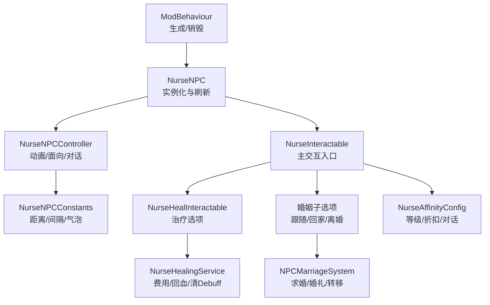
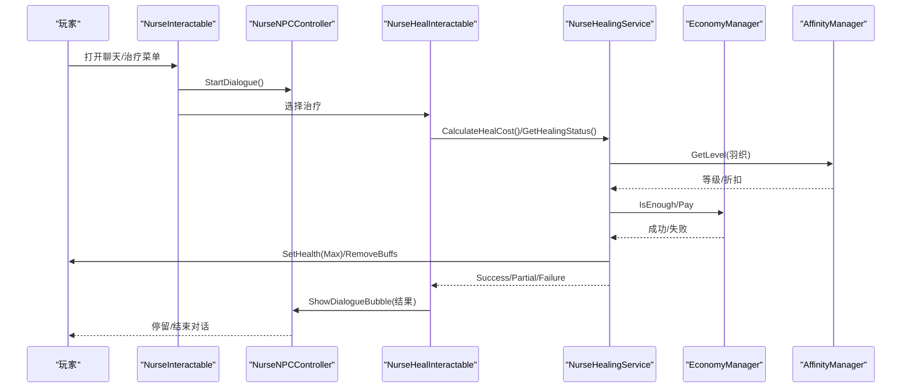
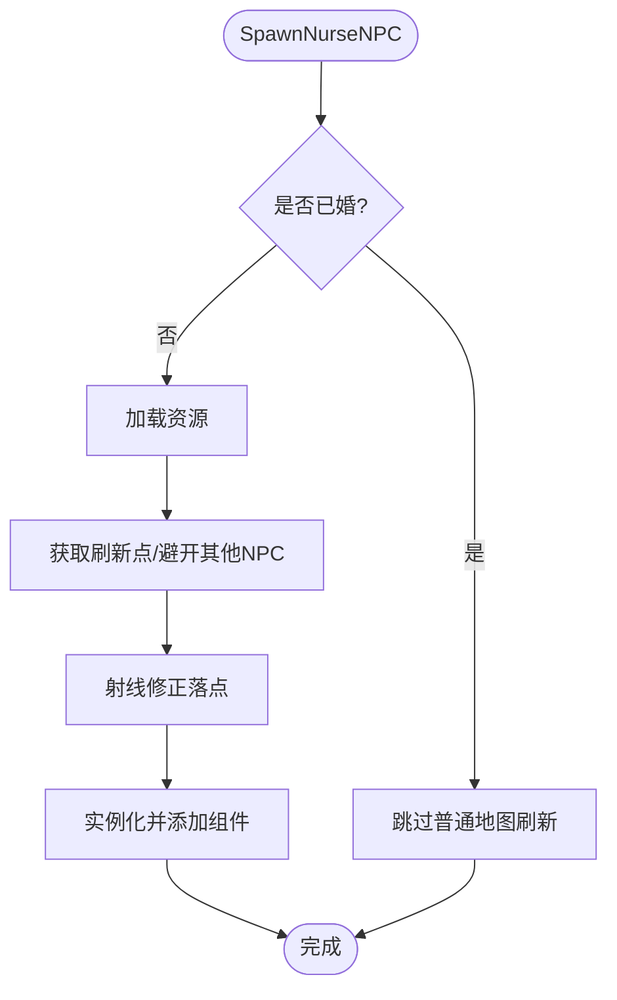
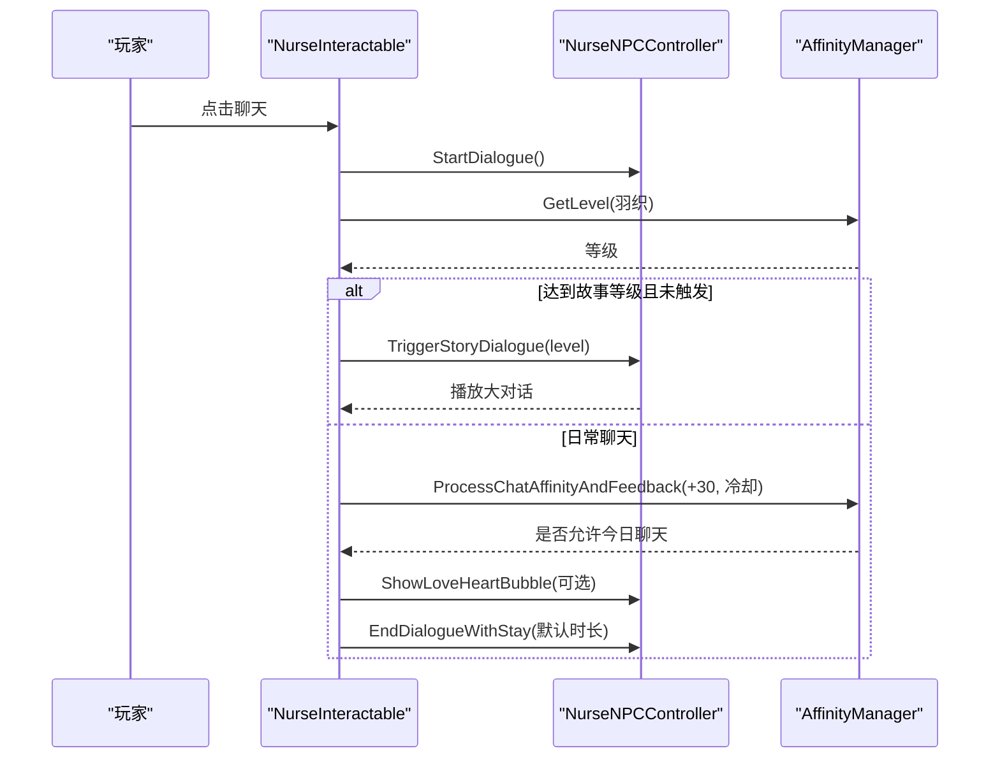
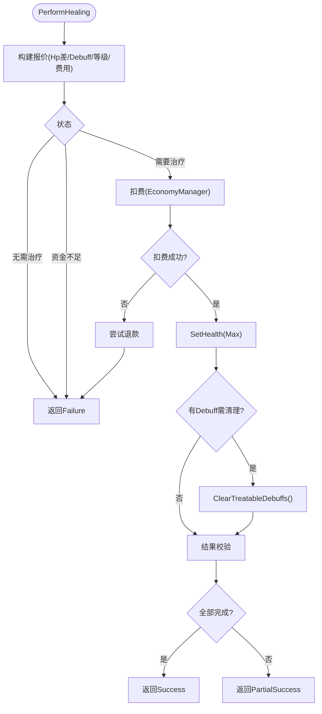
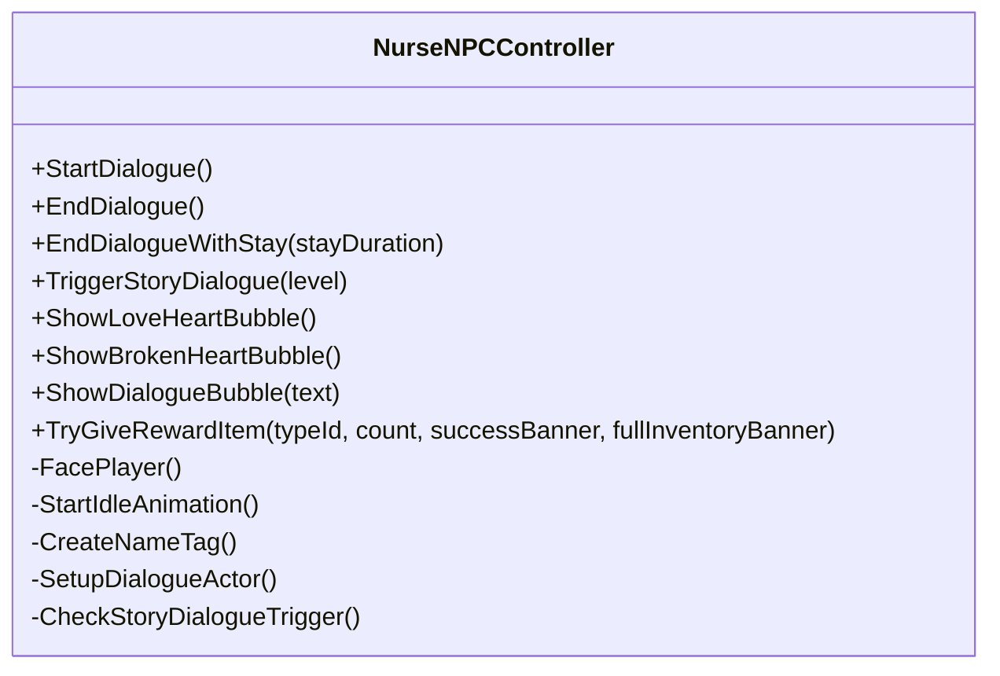
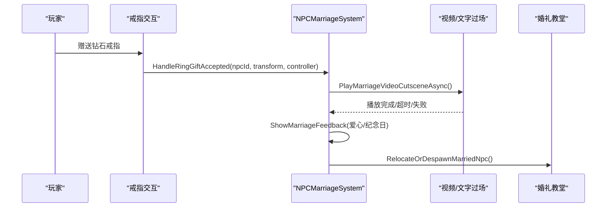
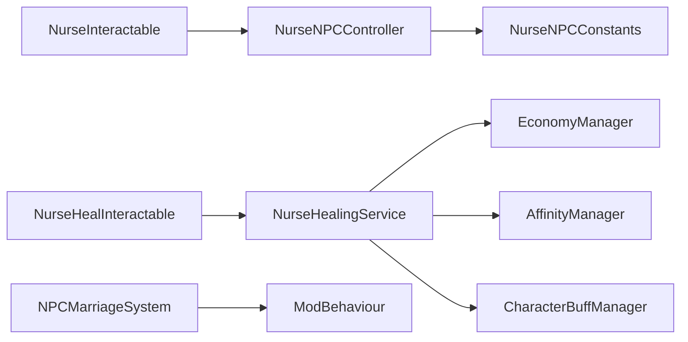

# 羽织（护士）

<cite>
**本文引用的文件**
- [NurseNPC.cs](file://Integration/NPCs/Nurse/NurseNPC.cs)
- [NurseInteractable.cs](file://Integration/NPCs/Nurse/NurseInteractable.cs)
- [NurseHealInteractable.cs](file://Integration/NPCs/Nurse/NurseHealInteractable.cs)
- [NurseHealingService.cs](file://Integration/NPCs/Nurse/NurseHealingService.cs)
- [NurseNPCController.cs](file://Integration/NPCs/Nurse/NurseNPCController.cs)
- [NurseNPCConstants.cs](file://Integration/Constants/NurseNPCConstants.cs)
- [NurseAffinityConfig.cs](file://Integration/Affinity/NPCs/NurseAffinityConfig.cs)
- [INPCAffinityConfig.cs](file://Integration/Affinity/INPCAffinityConfig.cs)
- [NPCMarriageSystem.cs](file://Integration/Wedding/NPCMarriageSystem.cs)
- [MarriageTestDebugUI.cs](file://DebugAndTools/MarriageTestDebugUI.cs)
</cite>

## 目录
1. [简介](#简介)
2. [项目结构](#项目结构)
3. [核心组件](#核心组件)
4. [架构总览](#架构总览)
5. [详细组件分析](#详细组件分析)
6. [依赖关系分析](#依赖关系分析)
7. [性能与稳定性](#性能与稳定性)
8. [故障排查指南](#故障排查指南)
9. [结论](#结论)
10. [附录：配置与扩展指南](#附录：配置与扩展指南)

## 简介
本文件为“羽织（护士）”NPC 的完整技术文档。羽织是 BossRushMod 中的治疗型 NPC，提供医疗服务、生命值恢复、负面状态清理等能力；同时深度集成好感度系统与婚姻系统，支持求婚流程、婚礼仪式、婚后互动与专属对话。文档从系统架构、数据流、处理逻辑到配置扩展进行分层说明，帮助开发者与玩家理解并自定义该模块。

## 项目结构
羽织相关代码集中在 Integration/NPCs/Nurse 目录，配合常量、好感度配置、婚礼系统与调试工具形成完整闭环：
- 生成与生命周期：NurseNPC.cs
- 交互菜单与聊天：NurseInteractable.cs
- 治疗交互与服务：NurseHealInteractable.cs、NurseHealingService.cs
- 控制器与行为：NurseNPCController.cs
- 常量与阈值：NurseNPCConstants.cs
- 好感度与解锁：NurseAffinityConfig.cs、INPCAffinityConfig.cs
- 婚姻系统：NPCMarriageSystem.cs
- 调试面板：MarriageTestDebugUI.cs

图表来源
- [NurseNPC.cs:123-241](file://Integration/NPCs/Nurse/NurseNPC.cs#L123-L241)
- [NurseInteractable.cs:101-191](file://Integration/NPCs/Nurse/NurseInteractable.cs#L101-L191)
- [NurseHealInteractable.cs:152-191](file://Integration/NPCs/Nurse/NurseHealInteractable.cs#L152-L191)
- [NurseHealingService.cs:361-425](file://Integration/NPCs/Nurse/NurseHealingService.cs#L361-L425)
- [NurseNPCController.cs:370-391](file://Integration/NPCs/Nurse/NurseNPCController.cs#L370-L391)
- [NurseNPCConstants.cs:20-80](file://Integration/Constants/NurseNPCConstants.cs#L20-L80)
- [NurseAffinityConfig.cs:109-144](file://Integration/Affinity/NPCs/NurseAffinityConfig.cs#L109-L144)
- [NPCMarriageSystem.cs:40-53](file://Integration/Wedding/NPCMarriageSystem.cs#L40-L53)

章节来源
- [NurseNPC.cs:123-241](file://Integration/NPCs/Nurse/NurseNPC.cs#L123-L241)
- [NurseInteractable.cs:101-191](file://Integration/NPCs/Nurse/NurseInteractable.cs#L101-L191)
- [NurseHealInteractable.cs:152-191](file://Integration/NPCs/Nurse/NurseHealInteractable.cs#L152-L191)
- [NurseHealingService.cs:361-425](file://Integration/NPCs/Nurse/NurseHealingService.cs#L361-L425)
- [NurseNPCController.cs:370-391](file://Integration/NPCs/Nurse/NurseNPCController.cs#L370-L391)
- [NurseNPCConstants.cs:20-80](file://Integration/Constants/NurseNPCConstants.cs#L20-L80)
- [NurseAffinityConfig.cs:109-144](file://Integration/Affinity/NPCs/NurseAffinityConfig.cs#L109-L144)
- [NPCMarriageSystem.cs:40-53](file://Integration/Wedding/NPCMarriageSystem.cs#L40-L53)

## 核心组件
- 生成与生命周期管理：负责加载资源、选择刷新点、避免与其他NPC重叠、设置移动与交互组件、已婚后跳过普通地图刷新。
- 交互与聊天：统一的主交互入口，组装子选项（礼物、治疗、婚姻），触发故事对话与日常对话，应用每日好感度衰减。
- 治疗服务：计算费用（血量差×等级×倍率 + Debuff固定加成）、应用好感度折扣、扣费、满血恢复、清除可治疗负面状态、失败退款。
- 控制器：动画参数初始化、面向玩家、名字标签、闲置气泡、故事对话检测与播放、奖励发放。
- 好感度配置：等级解锁、礼物偏好、对话池、治疗折扣表、特殊事件对话。
- 婚姻系统：戒指赠送成功后的结婚流程、过场视频或文字回退、爱心与纪念日气泡、配偶转移至婚礼教堂、离婚流程。
- 调试工具：测试面板用于快速设置好感度、发放物品、强制触发结婚/离婚、查看背包与日志。

章节来源
- [NurseNPC.cs:123-241](file://Integration/NPCs/Nurse/NurseNPC.cs#L123-L241)
- [NurseInteractable.cs:211-332](file://Integration/NPCs/Nurse/NurseInteractable.cs#L211-L332)
- [NurseHealInteractable.cs:194-321](file://Integration/NPCs/Nurse/NurseHealInteractable.cs#L194-L321)
- [NurseHealingService.cs:489-628](file://Integration/NPCs/Nurse/NurseHealingService.cs#L489-L628)
- [NurseNPCController.cs:454-539](file://Integration/NPCs/Nurse/NurseNPCController.cs#L454-L539)
- [NurseAffinityConfig.cs:109-144](file://Integration/Affinity/NPCs/NurseAffinityConfig.cs#L109-L144)
- [NPCMarriageSystem.cs:182-225](file://Integration/Wedding/NPCMarriageSystem.cs#L182-L225)
- [MarriageTestDebugUI.cs:13-190](file://DebugAndTools/MarriageTestDebugUI.cs#L13-L190)

## 架构总览
羽织模块采用“控制器+交互+服务”的分层设计：
- 控制器负责外观与行为（动画、面向、对话、气泡）。
- 交互层负责用户输入与菜单组织（聊天、礼物、治疗、婚姻）。
- 服务层封装业务规则（费用计算、经济扣费、Buff操作、状态判断）。
- 好感度与婚姻系统作为横切关注点，贯穿交互与服务。

图表来源
- [NurseInteractable.cs:211-332](file://Integration/NPCs/Nurse/NurseInteractable.cs#L211-L332)
- [NurseHealInteractable.cs:194-321](file://Integration/NPCs/Nurse/NurseHealInteractable.cs#L194-L321)
- [NurseHealingService.cs:361-628](file://Integration/NPCs/Nurse/NurseHealingService.cs#L361-L628)
- [NurseNPCController.cs:758-792](file://Integration/NPCs/Nurse/NurseNPCController.cs#L758-L792)

## 详细组件分析

### 生成与生命周期（NurseNPC）
- 懒加载 AssetBundle，按场景配置选择刷新点，避开其他NPC位置，Raycast修正落点。
- 已婚后在普通地图跳过刷新，仅在婚礼教堂强制生成。
- 添加控制器、移动、交互组件，确保模型与子对象激活。

图表来源
- [NurseNPC.cs:123-241](file://Integration/NPCs/Nurse/NurseNPC.cs#L123-L241)

章节来源
- [NurseNPC.cs:123-241](file://Integration/NPCs/Nurse/NurseNPC.cs#L123-L241)

### 交互与聊天（NurseInteractable）
- 组装子选项：礼物、治疗、婚姻（跟随/离婚/回家）。
- 聊天流程：优先处理花心斥责，再根据等级触发故事对话（3/5/8/10级），否则进入日常对话与好感度结算。
- 已婚状态下每日聊天可能获得安神滴剂奖励。

图表来源
- [NurseInteractable.cs:211-332](file://Integration/NPCs/Nurse/NurseInteractable.cs#L211-L332)
- [NurseNPCController.cs:454-539](file://Integration/NPCs/Nurse/NurseNPCController.cs#L454-L539)

章节来源
- [NurseInteractable.cs:211-332](file://Integration/NPCs/Nurse/NurseInteractable.cs#L211-L332)

### 治疗服务（NurseHealingService）
- 费用公式：基础费用 = (最大血量 - 当前血量) × 玩家等级 × 10；若存在可治疗Debuff，额外增加 玩家等级 × 50。
- 折扣：根据羽织好感度等级映射折扣率（2/4/6/7/9级分别对应不同折扣）。
- 执行流程：检查需求→计算报价→扣费→回血→清除Debuff→结果反馈（成功/部分成功/失败退款）。
- Debuff清单：基于原版Buff引用与补充列表，仅移除明确确认的负面状态，避免误删增益。

图表来源
- [NurseHealingService.cs:361-628](file://Integration/NPCs/Nurse/NurseHealingService.cs#L361-L628)

章节来源
- [NurseHealingService.cs:361-628](file://Integration/NPCs/Nurse/NurseHealingService.cs#L361-L628)

### 控制器与行为（NurseNPCController）
- 动画参数缓存与初始化，空闲时播放待机动画。
- 面向玩家：在靠近且不移动时调整朝向。
- 名字标签：注册原版健康条名称显示。
- 故事对话：每帧节流检测距离与UI状态，达到条件后播放多段对话并标记已触发，发放对应奖励（如安神滴剂、平安护身符）。
- 对话状态：StartDialogue/EndDialogueWithStay保证停留与停止移动。

图表来源
- [NurseNPCController.cs:370-391](file://Integration/NPCs/Nurse/NurseNPCController.cs#L370-L391)
- [NurseNPCController.cs:454-539](file://Integration/NPCs/Nurse/NurseNPCController.cs#L454-L539)
- [NurseNPCController.cs:758-792](file://Integration/NPCs/Nurse/NurseNPCController.cs#L758-L792)

章节来源
- [NurseNPCController.cs:370-391](file://Integration/NPCs/Nurse/NurseNPCController.cs#L370-L391)
- [NurseNPCController.cs:454-539](file://Integration/NPCs/Nurse/NurseNPCController.cs#L454-L539)
- [NurseNPCController.cs:758-792](file://Integration/NPCs/Nurse/NurseNPCController.cs#L758-L792)

### 好感度与对话（NurseAffinityConfig）
- 等级解锁：治疗折扣、剧情、奖励物品。
- 礼物偏好：医疗类标签与特定物品加分，砖石等负面物品扣分。
- 对话池：按等级分组（1-2/3-4/5-6/7-8/9/10级），包含日常、礼物反应、关系对话、治疗事件对话。
- 特殊事件：heal_success/heal_full_hp/heal_no_money/heal_debuff_only 及婚后关系对话。

章节来源
- [NurseAffinityConfig.cs:109-144](file://Integration/Affinity/NPCs/NurseAffinityConfig.cs#L109-L144)
- [NurseAffinityConfig.cs:150-210](file://Integration/Affinity/NPCs/NurseAffinityConfig.cs#L150-L210)
- [NurseAffinityConfig.cs:467-596](file://Integration/Affinity/NPCs/NurseAffinityConfig.cs#L467-L596)
- [NurseAffinityConfig.cs:602-769](file://Integration/Affinity/NPCs/NurseAffinityConfig.cs#L602-L769)

### 婚姻系统（NPCMarriageSystem）
- 求婚流程：钻石戒指赠送成功后记录配偶状态，播放全屏结婚视频（无视频则回退双语文字过场），展示爱心与纪念日气泡，延迟后将配偶转移至婚礼教堂。
- 离婚流程：解除关系、重置好感度、心碎反馈、对话提示、延迟回收/重定位。
- 回忆当天：可在婚礼教堂重播结婚过场（不改变状态）。

图表来源
- [NPCMarriageSystem.cs:40-53](file://Integration/Wedding/NPCMarriageSystem.cs#L40-L53)
- [NPCMarriageSystem.cs:182-225](file://Integration/Wedding/NPCMarriageSystem.cs#L182-L225)
- [NPCMarriageSystem.cs:234-418](file://Integration/Wedding/NPCMarriageSystem.cs#L234-L418)
- [NPCMarriageSystem.cs:570-635](file://Integration/Wedding/NPCMarriageSystem.cs#L570-L635)

章节来源
- [NPCMarriageSystem.cs:40-53](file://Integration/Wedding/NPCMarriageSystem.cs#L40-L53)
- [NPCMarriageSystem.cs:182-225](file://Integration/Wedding/NPCMarriageSystem.cs#L182-L225)
- [NPCMarriageSystem.cs:234-418](file://Integration/Wedding/NPCMarriageSystem.cs#L234-L418)
- [NPCMarriageSystem.cs:570-635](file://Integration/Wedding/NPCMarriageSystem.cs#L570-L635)

### 调试与测试（MarriageTestDebugUI）
- 显示当前配偶、哥布林/护士好感度等级与剧情触发状态。
- 一键发放钻石戒指、统计背包数量、输出背包详情。
- 设置好感度等级、重置每日限制、强制刷新NPC、恢复婚礼教堂配偶。
- 强制触发结婚/离婚流程、记录花心事件。

章节来源
- [MarriageTestDebugUI.cs:13-190](file://DebugAndTools/MarriageTestDebugUI.cs#L13-L190)
- [MarriageTestDebugUI.cs:263-352](file://DebugAndTools/MarriageTestDebugUI.cs#L263-L352)

## 依赖关系分析
- 外部系统依赖：
  - EconomyManager：资金检查与支付。
  - AffinityManager：好感度等级、剧情标记、婚姻状态。
  - DialogueManager/DuckovDialogueActor：大对话与双语过场。
  - ItemAssetsCollection/ItemFactory：奖励物品实例化与资源加载。
  - BuffManager：读取与移除Debuff。
- 内部耦合：
  - NurseInteractable 依赖 NurseNPCController 控制对话与动画。
  - NurseHealInteractable 依赖 NurseHealingService 执行治疗逻辑。
  - NurseNPCController 依赖 NurseNPCConstants 控制行为阈值。
  - 婚姻系统通过 ModBehaviour 提供的接口访问NPC实例与婚礼教堂。

图表来源
- [NurseHealingService.cs:361-628](file://Integration/NPCs/Nurse/NurseHealingService.cs#L361-L628)
- [NurseInteractable.cs:101-191](file://Integration/NPCs/Nurse/NurseInteractable.cs#L101-L191)
- [NurseNPCController.cs:370-391](file://Integration/NPCs/Nurse/NurseNPCController.cs#L370-L391)
- [NPCMarriageSystem.cs:182-225](file://Integration/Wedding/NPCMarriageSystem.cs#L182-L225)

章节来源
- [NurseHealingService.cs:361-628](file://Integration/NPCs/Nurse/NurseHealingService.cs#L361-L628)
- [NurseInteractable.cs:101-191](file://Integration/NPCs/Nurse/NurseInteractable.cs#L101-L191)
- [NurseNPCController.cs:370-391](file://Integration/NPCs/Nurse/NurseNPCController.cs#L370-L391)
- [NPCMarriageSystem.cs:182-225](file://Integration/Wedding/NPCMarriageSystem.cs#L182-L225)

## 性能与稳定性
- 节流与缓存：
  - 玩家查找间隔（约0.5秒）减少每帧查询开销。
  - Debuff状态缓存（0.2秒刷新）避免频繁遍历Buff列表。
  - 动画参数哈希缓存，降低运行时字符串解析成本。
- 资源管理：
  - AssetBundle懒加载，避免启动时阻塞。
  - 视频过场使用RenderTexture与全屏Canvas，播放结束后释放资源。
- 异常保护：
  - 大量TryExecute/LogAndIgnore包裹关键路径，防止单点异常导致崩溃。
  - 扣费失败或治疗无效时自动退款，保障经济一致性。

[本节为通用指导，不直接分析具体文件]

## 故障排查指南
- 治疗无效或费用异常：
  - 检查玩家等级与HP差值是否正确读取。
  - 确认EconomyManager资金充足与支付成功。
  - 查看日志中“费用发生变动”“扣费失败”“治疗失败”等关键字。
- Debuff未清除：
  - 确认目标Buff ID是否在可治疗列表中。
  - 观察Buff管理器事件是否触发，必要时手动刷新缓存。
- 故事对话未触发：
  - 检查玩家距离、UI是否打开、等级是否达到、是否已标记触发。
  - 查看冷却时间与重试间隔。
- 婚姻流程异常：
  - 确认视频文件是否存在或回退文字过场。
  - 检查婚礼教堂是否存在，若无则配偶会被移除。
  - 使用调试面板强制触发流程并查看日志。

章节来源
- [NurseHealingService.cs:489-628](file://Integration/NPCs/Nurse/NurseHealingService.cs#L489-L628)
- [NurseNPCController.cs:397-423](file://Integration/NPCs/Nurse/NurseNPCController.cs#L397-L423)
- [NPCMarriageSystem.cs:234-418](file://Integration/Wedding/NPCMarriageSystem.cs#L234-L418)
- [MarriageTestDebugUI.cs:13-190](file://DebugAndTools/MarriageTestDebugUI.cs#L13-L190)

## 结论
羽织（护士）以清晰的分层架构实现了治疗、好感度与婚姻的深度融合。其核心优势在于：
- 稳定的服务层：费用计算、经济扣费、Buff操作具备完善的错误处理与退款机制。
- 丰富的交互体验：故事对话、日常对话、礼物反应、婚后专属内容提升沉浸感。
- 可扩展性：通过配置接口与常量集中管理，便于新增NPC或扩展功能。

[本节为总结，不直接分析具体文件]

## 附录：配置与扩展指南
- 治疗折扣与解锁：
  - 在 NurseAffinityConfig.DiscountsByLevel 中添加等级与折扣映射。
  - 在 UnlocksByLevel 中添加等级解锁描述。
- 礼物偏好：
  - PositiveItems/NegativeItems 添加物品ID与好感度增减。
  - PositiveTags 扩展标签（如 Medical、Consumable）。
- 对话内容：
  - 在 GetChatDialoguesForLevel 中按等级分组添加对话。
  - 在 GetRelationshipDialogue 中添加婚后事件对话键值。
- 常量调整：
  - NurseNPCConstants 中调整距离阈值、气泡间隔、对话停留时间等。
- 婚姻系统：
  - 准备 Assets/cutscenes/marriage_{npcId}.mp4 与同名音频文件。
  - 使用 MarriageTestDebugUI 快速验证流程。

章节来源
- [NurseAffinityConfig.cs:109-144](file://Integration/Affinity/NPCs/NurseAffinityConfig.cs#L109-L144)
- [NurseAffinityConfig.cs:150-210](file://Integration/Affinity/NPCs/NurseAffinityConfig.cs#L150-L210)
- [NurseAffinityConfig.cs:467-596](file://Integration/Affinity/NPCs/NurseAffinityConfig.cs#L467-L596)
- [NurseNPCConstants.cs:20-80](file://Integration/Constants/NurseNPCConstants.cs#L20-L80)
- [NPCMarriageSystem.cs:234-418](file://Integration/Wedding/NPCMarriageSystem.cs#L234-L418)
- [MarriageTestDebugUI.cs:13-190](file://DebugAndTools/MarriageTestDebugUI.cs#L13-L190)