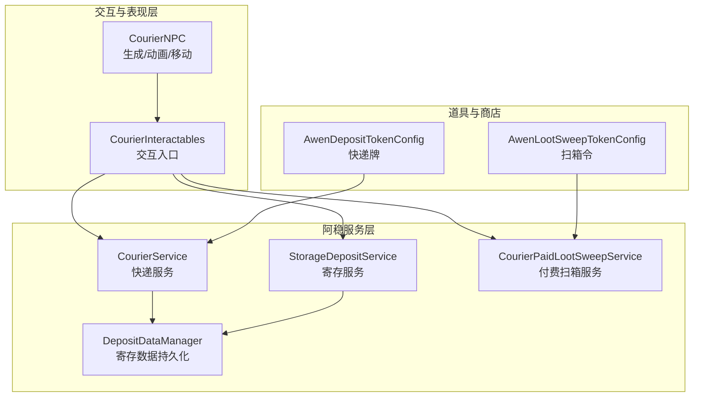
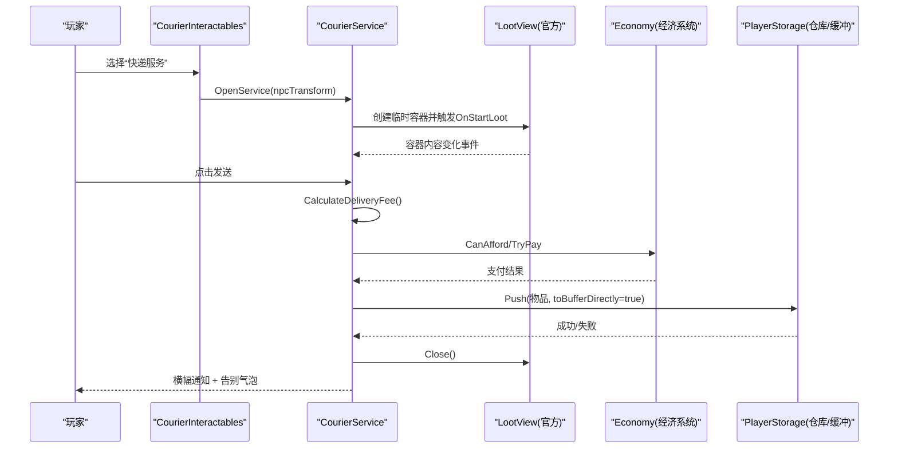
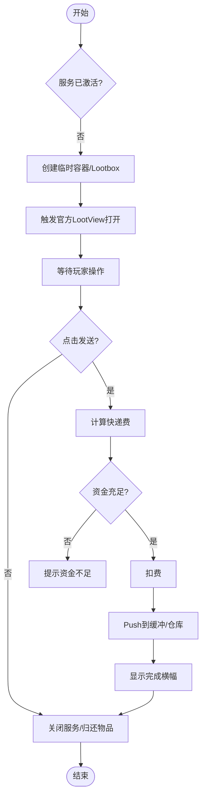
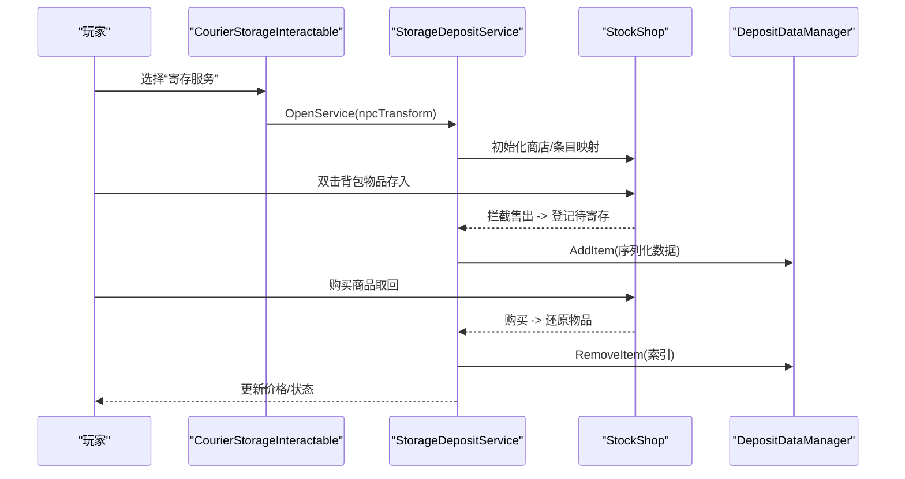
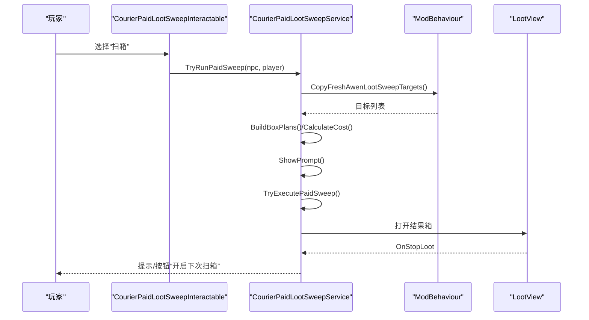
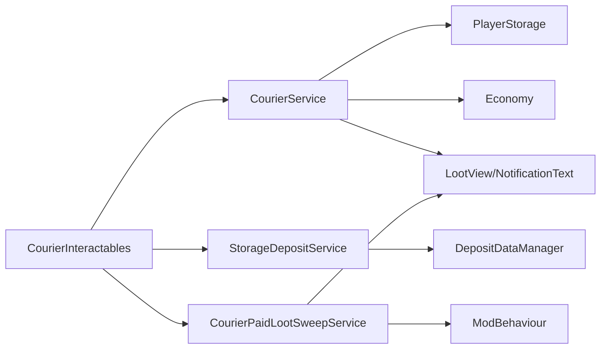

# 阿稳（快递员）

<cite>
**本文引用的文件**
- [CourierService.cs](file://Integration/NPCs/Courier/CourierService.cs)
- [StorageDepositService.cs](file://Integration/NPCs/Courier/StorageDepositService.cs)
- [DepositDataManager.cs](file://Integration/NPCs/Courier/DepositDataManager.cs)
- [CourierPaidLootSweepService.cs](file://Integration/NPCs/Courier/CourierPaidLootSweepService.cs)
- [CourierInteractables.cs](file://Integration/NPCs/Courier/CourierInteractables.cs)
- [CourierNPC.cs](file://Integration/NPCs/Courier/CourierNPC.cs)
- [AwenDepositTokenConfig.cs](file://Integration/Items/AwenDepositTokenConfig.cs)
- [AwenLootSweepTokenConfig.cs](file://Integration/Items/AwenLootSweepTokenConfig.cs)
</cite>

## 目录
1. [简介](#简介)
2. [项目结构](#项目结构)
3. [核心组件](#核心组件)
4. [架构总览](#架构总览)
5. [详细组件分析](#详细组件分析)
6. [依赖关系分析](#依赖关系分析)
7. [性能与稳定性](#性能与稳定性)
8. [故障排查指南](#故障排查指南)
9. [结论](#结论)
10. [附录：自定义开发指南](#附录自定义开发指南)

## 简介
本文件面向“阿稳（快递员）”这一引导型 NPC，系统性说明其作为新手引导、物品寄存、批量扫箱与快递服务的功能特性。文档围绕 CourierService 的服务架构展开，覆盖存储存取、交易管理、界面集成、对话系统对接、库存系统与商店系统的深度集成，并总结阿稳的个性化行为模式（友好互动、提示引导、效率优化）。文末提供扩展与二次开发的实践建议。

## 项目结构
阿稳相关代码集中在 Integration/NPCs/Courier 与 Integration/Items 两个区域：
- NPC 交互与服务逻辑：CourierInteractables、CourierService、StorageDepositService、CourierPaidLootSweepService、DepositDataManager、CourierNPC
- 道具与使用行为：AwenDepositTokenConfig、AwenLootSweepTokenConfig

图表来源
- [CourierInteractables.cs:22-519](file://Integration/NPCs/Courier/CourierInteractables.cs#L22-L519)
- [CourierService.cs:31-800](file://Integration/NPCs/Courier/CourierService.cs#L31-L800)
- [StorageDepositService.cs:81-270](file://Integration/NPCs/Courier/StorageDepositService.cs#L81-L270)
- [CourierPaidLootSweepService.cs:17-800](file://Integration/NPCs/Courier/CourierPaidLootSweepService.cs#L17-L800)
- [DepositDataManager.cs:25-516](file://Integration/NPCs/Courier/DepositDataManager.cs#L25-L516)
- [CourierNPC.cs:30-442](file://Integration/NPCs/Courier/CourierNPC.cs#L30-L442)
- [AwenDepositTokenConfig.cs:10-392](file://Integration/Items/AwenDepositTokenConfig.cs#L10-L392)
- [AwenLootSweepTokenConfig.cs:10-260](file://Integration/Items/AwenLootSweepTokenConfig.cs#L10-L260)

章节来源
- [CourierInteractables.cs:22-519](file://Integration/NPCs/Courier/CourierInteractables.cs#L22-L519)
- [CourierService.cs:31-800](file://Integration/NPCs/Courier/CourierService.cs#L31-L800)
- [StorageDepositService.cs:81-270](file://Integration/NPCs/Courier/StorageDepositService.cs#L81-L270)
- [CourierPaidLootSweepService.cs:17-800](file://Integration/NPCs/Courier/CourierPaidLootSweepService.cs#L17-L800)
- [DepositDataManager.cs:25-516](file://Integration/NPCs/Courier/DepositDataManager.cs#L25-L516)
- [CourierNPC.cs:30-442](file://Integration/NPCs/Courier/CourierNPC.cs#L30-L442)
- [AwenDepositTokenConfig.cs:10-392](file://Integration/Items/AwenDepositTokenConfig.cs#L10-L392)
- [AwenLootSweepTokenConfig.cs:10-260](file://Integration/Items/AwenLootSweepTokenConfig.cs#L10-L260)

## 核心组件
- 快递服务（CourierService）：负责打开官方 LootView 容器、计算快递费、扣费、将物品发送至玩家仓库/缓冲、关闭服务与告别气泡、一键清包等。
- 寄存服务（StorageDepositService）：基于 StockShop 实现“存入/取回”的商店式交互，支持全部取出/丢弃、动态计费、一键寄存。
- 付费扫箱服务（CourierPaidLootSweepService）：按局快照扫描掉落箱，统一整理到代收箱，支持结果暂存、开启下一次扫箱、退款与异常恢复。
- 寄存数据管理（DepositDataManager）：持久化寄存物品列表、时间与价值，具备备份与提交代号的原子性保障。
- 交互入口（CourierInteractables）：聚合主交互与子选项（快递/寄存/扫箱），处理组内交互顺序与状态。
- NPC 生命周期（CourierNPC）：加载资源、生成位置修正、添加控制器与移动组件、Boss战/完成态通知。
- 道具配置（AwenDepositTokenConfig / AwenLootSweepTokenConfig）：注册道具、注入商店、绑定使用行为与本地化。

章节来源
- [CourierService.cs:31-800](file://Integration/NPCs/Courier/CourierService.cs#L31-L800)
- [StorageDepositService.cs:81-270](file://Integration/NPCs/Courier/StorageDepositService.cs#L81-L270)
- [CourierPaidLootSweepService.cs:17-800](file://Integration/NPCs/Courier/CourierPaidLootSweepService.cs#L17-L800)
- [DepositDataManager.cs:25-516](file://Integration/NPCs/Courier/DepositDataManager.cs#L25-L516)
- [CourierInteractables.cs:22-519](file://Integration/NPCs/Courier/CourierInteractables.cs#L22-L519)
- [CourierNPC.cs:30-442](file://Integration/NPCs/Courier/CourierNPC.cs#L30-L442)
- [AwenDepositTokenConfig.cs:10-392](file://Integration/Items/AwenDepositTokenConfig.cs#L10-L392)
- [AwenLootSweepTokenConfig.cs:10-260](file://Integration/Items/AwenLootSweepTokenConfig.cs#L10-L260)

## 架构总览
阿稳以“服务+交互+数据”的分层设计实现：
- 交互层：CourierInteractables 暴露“扫箱/快递/寄存”三个入口，统一处理 NPC 对话与移动控制。
- 服务层：各 Service 封装业务流（费用计算、支付、UI 打开/关闭、事件监听、结果处理）。
- 数据层：DepositDataManager 负责寄存数据的加载、保存、备份与一致性校验；其他服务通过 PlayerStorage/Economy/UI 等系统接口与游戏原生能力集成。

图表来源
- [CourierInteractables.cs:232-310](file://Integration/NPCs/Courier/CourierInteractables.cs#L232-L310)
- [CourierService.cs:242-521](file://Integration/NPCs/Courier/CourierService.cs#L242-L521)

章节来源
- [CourierInteractables.cs:232-310](file://Integration/NPCs/Courier/CourierInteractables.cs#L232-L310)
- [CourierService.cs:242-521](file://Integration/NPCs/Courier/CourierService.cs#L242-L521)

## 详细组件分析

### 快递服务（CourierService）
- 打开服务：创建临时容器与 InteractableLootbox，绑定 Inventory 与名称键，触发官方 LootView 打开流程；同时停止 NPC 移动并播放对话动画。
- 费用计算：按容器内物品总价值的固定比例计算快递费，向上取整。
- 支付与发送：检查资金是否足够，扣除费用后遍历容器物品，分离并调用 PlayerStorage.Push 直接放入缓冲；清空逐条通知队列，显示汇总横幅。
- 关闭服务：停止对话、恢复移动、关闭 LootView、归还未发送物品、显示告别气泡并清理资源。
- 快捷快递：QuickDeliverItems 支持不打开 UI 的一键清包，失败时回退至玩家。

图表来源
- [CourierService.cs:242-521](file://Integration/NPCs/Courier/CourierService.cs#L242-L521)

章节来源
- [CourierService.cs:242-521](file://Integration/NPCs/Courier/CourierService.cs#L242-L521)

### 寄存服务（StorageDepositService）
- 商店式寄存：基于 StockShop 动态创建商品条目，拦截售出逻辑实现“存入”，购买实现“取回”。
- 动态计费：根据寄存时长与物品价值计算费用，支持“全部取出/全部丢弃”链接按钮。
- 一键寄存：在玩家背包侧提供快捷按钮，快速将当前携带物品转入寄存商店。
- 服务状态：维护 isServiceActive、isRetrieveAllInProgress 等标志，防止并发冲突。

图表来源
- [StorageDepositService.cs:81-270](file://Integration/NPCs/Courier/StorageDepositService.cs#L81-L270)
- [DepositDataManager.cs:132-267](file://Integration/NPCs/Courier/DepositDataManager.cs#L132-L267)

章节来源
- [StorageDepositService.cs:81-270](file://Integration/NPCs/Courier/StorageDepositService.cs#L81-L270)
- [DepositDataManager.cs:132-267](file://Integration/NPCs/Courier/DepositDataManager.cs#L132-L267)

### 付费扫箱服务（CourierPaidLootSweepService）
- 目标收集：复制当前局的掉落箱快照，构建扫箱计划。
- 费用与支付：按箱子数量计算费用，支持净化点或货币支付。
- 结果暂存：将扫到的物品统一放入临时容器，打开 LootView 展示结果，并提供“开启下次扫箱”按钮。
- 异常与退款：若打开失败或部分失败，进行部分退款与消息提示，确保资源释放。

图表来源
- [CourierPaidLootSweepService.cs:119-312](file://Integration/NPCs/Courier/CourierPaidLootSweepService.cs#L119-L312)
- [CourierInteractables.cs:97-230](file://Integration/NPCs/Courier/CourierInteractables.cs#L97-L230)

章节来源
- [CourierPaidLootSweepService.cs:119-312](file://Integration/NPCs/Courier/CourierPaidLootSweepService.cs#L119-L312)
- [CourierInteractables.cs:97-230](file://Integration/NPCs/Courier/CourierInteractables.cs#L97-L230)

### 交互入口（CourierInteractables）
- 主交互：默认“扫箱”，可切换为其他文本。
- 子选项：通过 NPCInteractionGroupHelper 注入“快递服务”和“寄存服务”，调整顺序与可见性。
- 状态同步：进入交互时停止 NPC 移动并播放对话，退出时恢复。

章节来源
- [CourierInteractables.cs:22-519](file://Integration/NPCs/Courier/CourierInteractables.cs#L22-L519)

### NPC 生命周期（CourierNPC）
- 资源加载：从 AssetBundle 加载预制体，修复着色器与层级。
- 生成位置：优先 NavMesh 采样，回退 Raycast；BossRush/普通模式不同策略。
- 行为控制：Boss战开始/结束、无 Boss、通关完成等状态通知；Mode E 下固定站位。

章节来源
- [CourierNPC.cs:50-442](file://Integration/NPCs/Courier/CourierNPC.cs#L50-L442)

### 道具配置（AwenDepositTokenConfig / AwenLootSweepTokenConfig）
- 快递牌：一键快递当前穿戴与背包物品，基地免费，其他地方按快递费收费；注入基地商人商店。
- 扫箱令：命令阿稳清理当前局已存在的掉落箱，按由近到远顺序执行；支持运行时兜底注册。

章节来源
- [AwenDepositTokenConfig.cs:10-392](file://Integration/Items/AwenDepositTokenConfig.cs#L10-L392)
- [AwenLootSweepTokenConfig.cs:10-260](file://Integration/Items/AwenLootSweepTokenConfig.cs#L10-L260)

## 依赖关系分析
- 与游戏系统对接：
  - 库存系统：Inventory、PlayerStorage、ItemTreeData
  - 商店系统：StockShop、StockShopDatabase.ItemEntry
  - 对话系统：DialogueBubblesManager、OriginalConfirmDialogueAdapter
  - 经济系统：EconomyManager、Cost
  - UI 系统：LootView、NotificationText、TMP 链接点击
- 模块耦合：
  - CourierInteractables 仅负责入口与状态同步，业务下沉至各 Service
  - StorageDepositService 与 DepositDataManager 解耦，后者专注持久化
  - CourierPaidLootSweepService 通过 ModBehaviour 获取局快照与工具方法

图表来源
- [CourierInteractables.cs:22-519](file://Integration/NPCs/Courier/CourierInteractables.cs#L22-L519)
- [CourierService.cs:31-800](file://Integration/NPCs/Courier/CourierService.cs#L31-L800)
- [StorageDepositService.cs:81-270](file://Integration/NPCs/Courier/StorageDepositService.cs#L81-L270)
- [CourierPaidLootSweepService.cs:17-800](file://Integration/NPCs/Courier/CourierPaidLootSweepService.cs#L17-L800)
- [DepositDataManager.cs:25-516](file://Integration/NPCs/Courier/DepositDataManager.cs#L25-L516)

章节来源
- [CourierInteractables.cs:22-519](file://Integration/NPCs/Courier/CourierInteractables.cs#L22-L519)
- [CourierService.cs:31-800](file://Integration/NPCs/Courier/CourierService.cs#L31-L800)
- [StorageDepositService.cs:81-270](file://Integration/NPCs/Courier/StorageDepositService.cs#L81-L270)
- [CourierPaidLootSweepService.cs:17-800](file://Integration/NPCs/Courier/CourierPaidLootSweepService.cs#L17-L800)
- [DepositDataManager.cs:25-516](file://Integration/NPCs/Courier/DepositDataManager.cs#L25-L516)

## 性能与稳定性
- 事件驱动：避免每帧轮询，使用 Inventory.onContentChanged、InteractableLootbox.OnStopLoot 等事件驱动 UI 与流程。
- 反射缓存：对内部字段与方法进行一次性反射缓存，降低热路径开销。
- 通知合并：清空逐条通知队列，改为汇总横幅，减少 UI 抖动。
- 数据一致性：寄存数据采用“提交代号+备份槽”机制，保证多存档互通与崩溃恢复。
- 异常保护：关键路径包裹 try/catch，记录日志并尽量回滚或降级。

[本节为通用指导，无需具体文件引用]

## 故障排查指南
- 无法打开快递/寄存界面：
  - 检查 IsServiceActive 是否被重复锁定；确认 LootView 实例是否存在。
  - 参考：[CourierService.cs:242-307](file://Integration/NPCs/Courier/CourierService.cs#L242-L307)、[StorageDepositService.cs:256-270](file://Integration/NPCs/Courier/StorageDepositService.cs#L256-L270)
- 扣费失败：
  - 检查资金是否足够，或在僵尸模式下是否走净化点支付分支。
  - 参考：[CourierService.cs:341-419](file://Integration/NPCs/Courier/CourierService.cs#L341-L419)
- 寄存数据丢失或不一致：
  - 查看加载流程是否命中备份槽或旧格式最小长度恢复；确认提交代号是否一致。
  - 参考：[DepositDataManager.cs:132-183](file://Integration/NPCs/Courier/DepositDataManager.cs#L132-L183)、[DepositDataManager.cs:350-423](file://Integration/NPCs/Courier/DepositDataManager.cs#L350-L423)
- 扫箱结果无法打开或按钮不可用：
  - 检查临时 Lootbox 创建与反射字段初始化；确认 LootView 打开时机。
  - 参考：[CourierPaidLootSweepService.cs:226-312](file://Integration/NPCs/Courier/CourierPaidLootSweepService.cs#L226-L312)、[CourierPaidLootSweepService.cs:626-714](file://Integration/NPCs/Courier/CourierPaidLootSweepService.cs#L626-L714)

章节来源
- [CourierService.cs:242-419](file://Integration/NPCs/Courier/CourierService.cs#L242-L419)
- [StorageDepositService.cs:256-270](file://Integration/NPCs/Courier/StorageDepositService.cs#L256-L270)
- [DepositDataManager.cs:132-183](file://Integration/NPCs/Courier/DepositDataManager.cs#L132-L183)
- [DepositDataManager.cs:350-423](file://Integration/NPCs/Courier/DepositDataManager.cs#L350-L423)
- [CourierPaidLootSweepService.cs:226-312](file://Integration/NPCs/Courier/CourierPaidLootSweepService.cs#L226-L312)
- [CourierPaidLootSweepService.cs:626-714](file://Integration/NPCs/Courier/CourierPaidLootSweepService.cs#L626-L714)

## 结论
阿稳（快递员）通过清晰的分层架构与事件驱动模型，实现了快递、寄存与付费扫箱三大核心服务。其与游戏原生系统（库存、商店、对话、经济、UI）深度集成，兼顾易用性与稳定性。借助道具（快递牌、扫箱令）进一步提升了玩家体验与效率。

[本节为总结，无需具体文件引用]

## 附录：自定义开发指南
- 新增交互选项：
  - 在 CourierInteractables 中通过 NPCInteractionGroupHelper 注入新的子选项，设置 InteractName 与本地化键。
  - 参考：[CourierInteractables.cs:397-445](file://Integration/NPCs/Courier/CourierInteractables.cs#L397-L445)
- 扩展寄存计费规则：
  - 修改 DepositDataManager 中的费率常量与 GetCurrentFee 计算逻辑，注意时间单位与上限。
  - 参考：[DepositDataManager.cs:48-57](file://Integration/NPCs/Courier/DepositDataManager.cs#L48-L57)、[DepositDataManager.cs:112-117](file://Integration/NPCs/Courier/DepositDataManager.cs#L112-L117)
- 接入新道具：
  - 参照 AwenDepositTokenConfig/AwenLootSweepTokenConfig 注册 ItemFactory、注入商店、绑定 UsageBehavior 与本地化。
  - 参考：[AwenDepositTokenConfig.cs:153-184](file://Integration/Items/AwenDepositTokenConfig.cs#L153-L184)、[AwenLootSweepTokenConfig.cs:46-77](file://Integration/Items/AwenLootSweepTokenConfig.cs#L46-L77)
- 与对话系统集成：
  - 使用 OriginalConfirmDialogueAdapter 弹出确认框，结合 L10n 提供多语言提示。
  - 参考：[CourierPaidLootSweepService.cs:328-374](file://Integration/NPCs/Courier/CourierPaidLootSweepService.cs#L328-L374)

章节来源
- [CourierInteractables.cs:397-445](file://Integration/NPCs/Courier/CourierInteractables.cs#L397-L445)
- [DepositDataManager.cs:48-57](file://Integration/NPCs/Courier/DepositDataManager.cs#L48-L57)
- [DepositDataManager.cs:112-117](file://Integration/NPCs/Courier/DepositDataManager.cs#L112-L117)
- [AwenDepositTokenConfig.cs:153-184](file://Integration/Items/AwenDepositTokenConfig.cs#L153-L184)
- [AwenLootSweepTokenConfig.cs:46-77](file://Integration/Items/AwenLootSweepTokenConfig.cs#L46-L77)
- [CourierPaidLootSweepService.cs:328-374](file://Integration/NPCs/Courier/CourierPaidLootSweepService.cs#L328-L374)