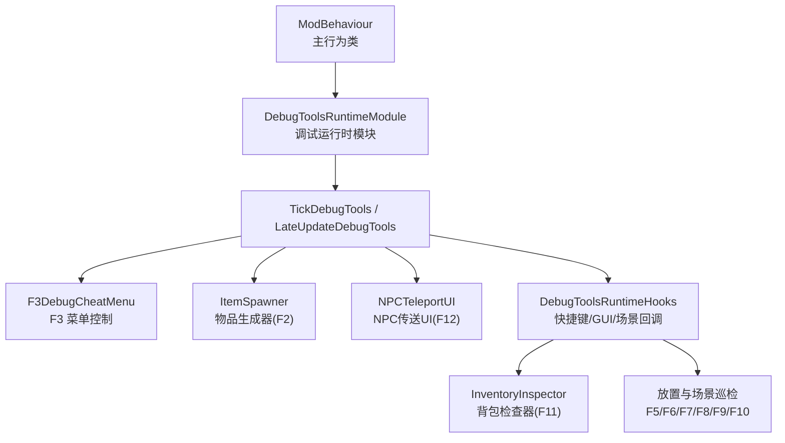
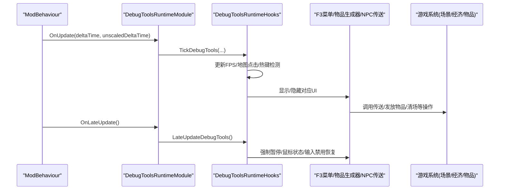
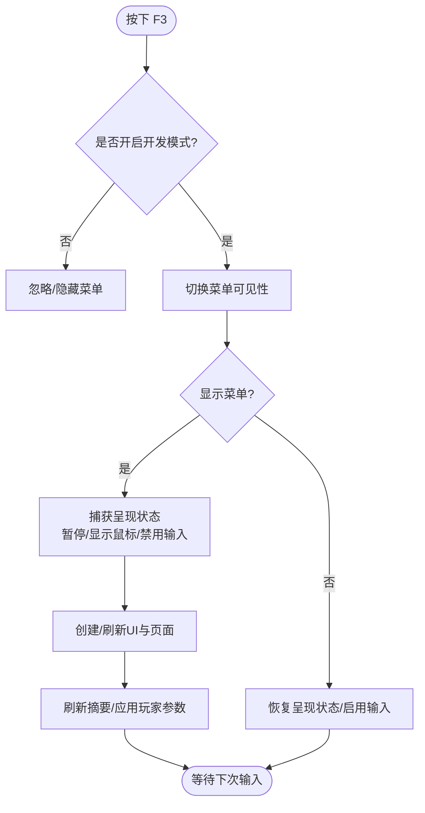
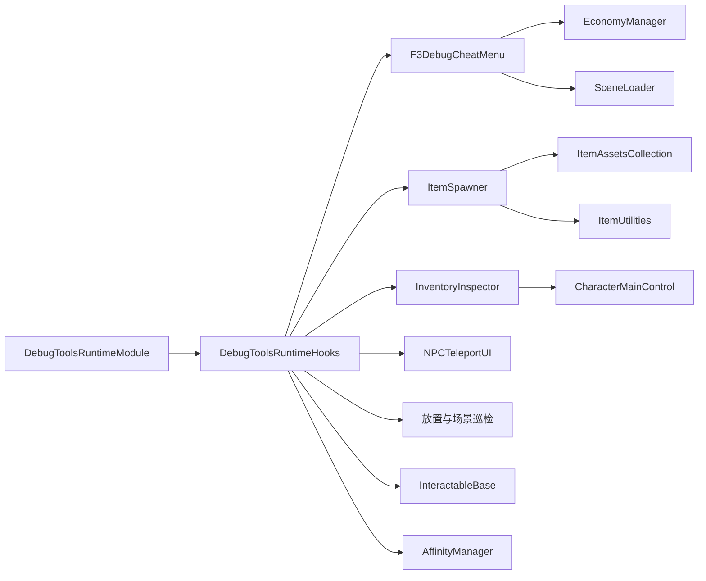

# 工具与调试

<cite>
**本文引用的文件**
- [F3DebugCheatMenu.cs](file://DebugAndTools/F3DebugCheatMenu.cs)
- [F3DebugCheatMenuUi.cs](file://DebugAndTools/F3DebugCheatMenuUi.cs)
- [F3DebugCheatMenuActions.cs](file://DebugAndTools/F3DebugCheatMenuActions.cs)
- [ItemSpawner.cs](file://DebugAndTools/ItemSpawner.cs)
- [InventoryInspector.cs](file://DebugAndTools/InventoryInspector.cs)
- [NPCTeleportUI.cs](file://DebugAndTools/NPCTeleportUI.cs)
- [DebugToolsRuntimeModule.cs](file://DebugAndTools/DebugToolsRuntimeModule.cs)
- [DebugToolsRuntimeHooks.cs](file://DebugAndTools/DebugToolsRuntimeHooks.cs)
- [DebugAndToolsPlacementAndInspection.cs](file://DebugAndTools/DebugAndToolsPlacementAndInspection.cs)
- [ArchitectureStructureGuard.py](file://tests/ArchitectureStructureGuard.py)
</cite>

## 目录
1. [简介](#简介)
2. [项目结构](#项目结构)
3. [核心组件](#核心组件)
4. [架构总览](#架构总览)
5. [详细组件分析](#详细组件分析)
6. [依赖关系分析](#依赖关系分析)
7. [性能注意事项](#性能注意事项)
8. [故障排查指南](#故障排查指南)
9. [结论](#结论)
10. [附录](#附录)

## 简介
本章节面向开发者与测试人员，系统化说明 BossRushMod 中的“工具与调试”子系统。内容覆盖：
- F3 调试菜单、物品生成器（F2）、背包检查器（F11）、NPC 传送 UI（F12）等内置调试工具的功能与使用方法。
- 调试热键体系（F2-F12、ESC）的触发流程、生命周期钩子与呈现状态管理。
- 日志输出与性能监控（FPS 计数器、场景对象/交互点/角色信息输出）。
- Python 守卫脚本在架构验证中的作用（以 ArchitectureStructureGuard 为代表），以及如何在 CI/本地构建中保障关键运行时模块不被误删或错位。
- 开发辅助工具（放置模式、地图点击调试、建筑信息输出）的使用方法与扩展方式。
- 故障排查策略与测试建议，帮助快速定位问题并安全回归。

## 项目结构
调试与工具相关代码集中在 DebugAndTools 目录，并通过统一的运行时模块与钩子接入主循环：
- 运行时模块：负责在 Update/LateUpdate 中调度调试工具的 Tick 与 LateUpdate。
- 运行时钩子：集中处理快捷键输入、GUI 绘制、场景加载回调与清理。
- 具体工具：F3 菜单、物品生成器、背包检查器、NPC 传送 UI、放置与场景巡检等。

图表来源
- [DebugToolsRuntimeModule.cs:1-43](file://DebugAndTools/DebugToolsRuntimeModule.cs#L1-L43)
- [DebugToolsRuntimeHooks.cs:10-38](file://DebugAndTools/DebugToolsRuntimeHooks.cs#L10-L38)
- [F3DebugCheatMenu.cs:107-142](file://DebugAndTools/F3DebugCheatMenu.cs#L107-L142)
- [ItemSpawner.cs:37-55](file://DebugAndTools/ItemSpawner.cs#L37-L55)
- [NPCTeleportUI.cs:45-96](file://DebugAndTools/NPCTeleportUI.cs#L45-L96)

章节来源
- [DebugToolsRuntimeModule.cs:1-43](file://DebugAndTools/DebugToolsRuntimeModule.cs#L1-L43)
- [DebugToolsRuntimeHooks.cs:10-38](file://DebugAndTools/DebugToolsRuntimeHooks.cs#L10-L38)

## 核心组件
- F3 调试菜单：提供传送、玩家属性调参、资源与物品、战斗流程、NPC/剧情、场景调试六大页面；支持暂停游戏、锁定鼠标、禁用输入、刷新摘要与状态提示。
- 物品生成器（F2）：简单窗口输入物品 ID 并发送到玩家背包，支持错误提示与日志记录。
- 背包检查器（F11）：读取当前玩家背包所有物品，展示关键字段并支持一键输出到 DevLog。
- NPC 传送 UI（F12）：列出当前地图上的已知 NPC（快递员、哥布林、护士），点击传送到其附近位置。
- 运行时模块与钩子：统一调度 F3/F2/F11/F12 等工具的生命周期与输入检测，并在 LateUpdate 中强制维持 UI 的暂停与鼠标状态。
- 放置与场景巡检：F5 输出建筑/对象信息，F6 切换放置模式，F7 输出最近交互点，F8 输出场景角色信息，F9 打开传送地图 UI，F10 清场并触发通关。

章节来源
- [F3DebugCheatMenu.cs:107-142](file://DebugAndTools/F3DebugCheatMenu.cs#L107-L142)
- [ItemSpawner.cs:37-55](file://DebugAndTools/ItemSpawner.cs#L37-L55)
- [InventoryInspector.cs:49-89](file://DebugAndTools/InventoryInspector.cs#L49-L89)
- [NPCTeleportUI.cs:45-96](file://DebugAndTools/NPCTeleportUI.cs#L45-L96)
- [DebugToolsRuntimeHooks.cs:10-38](file://DebugAndTools/DebugToolsRuntimeHooks.cs#L10-L38)

## 架构总览
调试系统通过运行时模块将各工具纳入主循环，确保仅在开发模式下启用，且与游戏呈现状态（时间缩放、光标、输入）隔离。

图表来源
- [DebugToolsRuntimeModule.cs:12-35](file://DebugAndTools/DebugToolsRuntimeModule.cs#L12-L35)
- [DebugToolsRuntimeHooks.cs:16-38](file://DebugAndTools/DebugToolsRuntimeHooks.cs#L16-L38)
- [F3DebugCheatMenu.cs:184-231](file://DebugAndTools/F3DebugCheatMenu.cs#L184-L231)
- [NPCTeleportUI.cs:63-96](file://DebugAndTools/NPCTeleportUI.cs#L63-L96)

## 详细组件分析

### F3 调试菜单
- 功能概览：
  - 传送页：回基地、返回出生点、前往 BossRush 起始点、前往场景默认点、打开 NPC 传送面板、刷新位置摘要。
  - 玩家属性页：最大生命倍率、枪械伤害倍率、近战伤害倍率、头部/身体护甲覆盖，支持预设值与立即满血。
  - 资源与物品页：按 ID 发放物品、快捷发放常用道具、加钱、清除星愿奖励/发送冷却、打开背包检查器、输出背包详细日志。
  - 战斗流程页：立即满血、强制清场、直接触发通关、发船票并打开地图、切换放置模式、尸潮邀请函+地图、触发尸潮撤离、重置尸潮模式。
  - NPC/剧情页：清空成就、强制刷新哥布林/护士、重置礼物/聊天限制、重置剧情标记、设置亲和等级、触发结婚/离婚、记录花心事件。
  - 场景调试页：输出附近对象、输出最近交互点、输出场景角色信息、刷新顶部摘要。
- 交互与呈现：
  - F3 打开/关闭菜单；ESC 关闭；打开时暂停游戏、显示鼠标、锁定解锁、禁用输入；关闭时恢复。
  - 每帧刷新摘要（防抖），应用玩家作弊参数（延迟批量应用）。
- 关键实现要点：
  - 使用运行时绑定（Stat/Modifier）对玩家属性进行覆盖，避免硬改数值。
  - 场景切换时移除玩家作弊修饰符并重新排队应用，保证一致性。
  - 大量操作通过 EconomyManager、SceneLoader、BossRushMapSelectionHelper 等系统接口完成。

图表来源
- [F3DebugCheatMenu.cs:107-142](file://DebugAndTools/F3DebugCheatMenu.cs#L107-L142)
- [F3DebugCheatMenuUi.cs:22-193](file://DebugAndTools/F3DebugCheatMenuUi.cs#L22-L193)
- [F3DebugCheatMenuActions.cs:24-195](file://DebugAndTools/F3DebugCheatMenuActions.cs#L24-L195)

章节来源
- [F3DebugCheatMenu.cs:107-142](file://DebugAndTools/F3DebugCheatMenu.cs#L107-L142)
- [F3DebugCheatMenuUi.cs:22-193](file://DebugAndTools/F3DebugCheatMenuUi.cs#L22-L193)
- [F3DebugCheatMenuActions.cs:24-195](file://DebugAndTools/F3DebugCheatMenuActions.cs#L24-L195)

### 物品生成器（F2）
- 功能：输入物品 ID 后生成并发送到玩家背包，支持错误提示与消息计时。
- 使用：
  - 仅开发模式生效。
  - 按 F2 打开/关闭窗口；输入 ID 后点击确定；失败会显示原因。
- 关键点：
  - 使用 ItemAssetsCollection.InstantiateSync 创建物品，再通过 ItemUtilities.SendToPlayer 发送给玩家。
  - 异常捕获并输出到 DevLog。

章节来源
- [ItemSpawner.cs:37-55](file://DebugAndTools/ItemSpawner.cs#L37-L55)
- [ItemSpawner.cs:150-208](file://DebugAndTools/ItemSpawner.cs#L150-L208)

### 背包检查器（F11）
- 功能：读取当前玩家背包所有物品，展示关键字段（名称、标签、品质、价值、耐久、口径、路线提示、描述预览等），支持刷新与输出到日志。
- 使用：
  - 仅开发模式生效。
  - 按 F11 打开/关闭窗口；点击“刷新背包”或“输出到日志”。
- 关键点：
  - 打开时捕获呈现状态（暂停、显示鼠标、禁用输入），关闭时恢复。
  - 使用 SafeRead 封装字段读取，避免反射/空引用异常。
  - 自动计算子弹类型对应的 BossGun/SpecialBullet 路线提示。

章节来源
- [InventoryInspector.cs:49-89](file://DebugAndTools/InventoryInspector.cs#L49-L89)
- [InventoryInspector.cs:142-212](file://DebugAndTools/InventoryInspector.cs#L142-L212)
- [InventoryInspector.cs:247-338](file://DebugAndTools/InventoryInspector.cs#L247-L338)
- [InventoryInspector.cs:351-392](file://DebugAndTools/InventoryInspector.cs#L351-L392)
- [InventoryInspector.cs:482-513](file://DebugAndTools/InventoryInspector.cs#L482-L513)

### NPC 传送 UI（F12）
- 功能：列出当前地图上的已知 NPC（快递员、哥布林、护士），点击传送到其附近位置。
- 使用：
  - 仅开发模式生效。
  - 按 F12 打开/关闭；ESC 关闭；点击背景或关闭按钮退出。
- 关键点：
  - 动态创建 Canvas/Panel/ScrollView/按钮，列表项根据 NPC 实例是否存在决定可交互性。
  - 传送时计算目标位置并进行地面射线修正，避免悬空。
  - 打开时暂停游戏、显示鼠标、禁用输入；关闭时恢复。

章节来源
- [NPCTeleportUI.cs:45-96](file://DebugAndTools/NPCTeleportUI.cs#L45-L96)
- [NPCTeleportUI.cs:127-267](file://DebugAndTools/NPCTeleportUI.cs#L127-L267)
- [NPCTeleportUI.cs:305-365](file://DebugAndTools/NPCTeleportUI.cs#L305-L365)
- [NPCTeleportUI.cs:409-450](file://DebugAndTools/NPCTeleportUI.cs#L409-L450)

### 调试热键体系与生命周期
- 热键映射：
  - F2：物品生成器
  - F3：调试菜单
  - F4：清空成就数据（开发模式）
  - F5：输出附近建筑/对象信息
  - F6：切换放置模式
  - F7：输出最近交互点
  - F8：输出场景角色信息
  - F9：打开传送地图 UI（并发送船票）
  - F10：清场并触发通关
  - F11：背包检查器
  - F12：NPC 传送 UI
  - ESC：关闭 NPC 传送 UI
- 生命周期：
  - Update：TickDebugTools 中执行 FPS 计数、地图点击调试、热键检测、F3 菜单 Tick。
  - LateUpdate：BossPoolLateUpdate、NPCTeleportUILateUpdate、F3DebugCheatMenuLateUpdate 强制维持 UI 的暂停与鼠标状态。
  - 场景加载：OnSceneLoaded 时移除玩家作弊修饰符并重新排队应用。
  - 销毁：清理 UI、退出放置模式、注销监听、重置静态缓存。

章节来源
- [DebugToolsRuntimeHooks.cs:16-38](file://DebugAndTools/DebugToolsRuntimeHooks.cs#L16-L38)
- [DebugToolsRuntimeHooks.cs:40-234](file://DebugAndTools/DebugToolsRuntimeHooks.cs#L40-L234)
- [DebugToolsRuntimeHooks.cs:358-372](file://DebugAndTools/DebugToolsRuntimeHooks.cs#L358-L372)

### 放置模式与场景巡检
- 放置模式（F6）：
  - 进入前需先按 F5 记住一个对象作为模板。
  - 滚轮旋转预览对象；按住 Shift + 滚轮切换预制体；左键确认放置；右键两次确认删除。
  - 扫描附近带渲染器的对象，去重基础名后构建可切换列表。
  - 预览对象完整克隆但禁用碰撞器与物理模拟，避免干扰。
- 场景巡检：
  - F5：输出附近建筑详细信息（ID、名称、GUID、尺寸、数量、费用、前置建筑、子对象、组件等）。
  - F7：输出最近交互点（名称、InteractName、位置、距离、组成员数量）。
  - F8：输出除玩家外所有角色信息（名称、预设键、队伍、最大生命、位置、距离）。
  - F9：发送船票并打开 BossRush 地图选择 UI。
  - F10：清场并触发通关流程。

章节来源
- [DebugAndToolsPlacementAndInspection.cs:15-302](file://DebugAndTools/DebugAndToolsPlacementAndInspection.cs#L15-L302)
- [DebugAndToolsPlacementAndInspection.cs:308-722](file://DebugAndTools/DebugAndToolsPlacementAndInspection.cs#L308-L722)
- [DebugToolsRuntimeHooks.cs:127-212](file://DebugAndTools/DebugToolsRuntimeHooks.cs#L127-L212)

## 依赖关系分析
- 运行时模块注册：
  - DebugToolsRuntimeModule 被注册为运行时模块之一，确保在主循环中被调用。
  - ArchitectureStructureGuard 校验编译清单与 ModBehaviour 钩子，确保关键模块未被遗漏。
- 外部系统依赖：
  - EconomyManager：用于加钱。
  - SceneLoader：用于场景切换（回基地、前往 BossRush 起始点）。
  - ItemAssetsCollection/ItemUtilities：用于物品创建与发放。
  - CharacterMainControl：用于获取玩家、位置与状态。
  - InteractableBase：用于查找最近交互点。
  - AffinityManager：用于 NPC 亲和度与剧情标记操作。
- 耦合与内聚：
  - 工具间通过 ModBehaviour 的 partial class 共享状态与方法，降低耦合。
  - 运行时模块与钩子解耦了输入检测与业务逻辑，便于扩展与维护。

图表来源
- [ArchitectureStructureGuard.py:48-87](file://tests/ArchitectureStructureGuard.py#L48-L87)
- [ArchitectureStructureGuard.py:156-174](file://tests/ArchitectureStructureGuard.py#L156-L174)
- [F3DebugCheatMenuActions.cs:308-343](file://DebugAndTools/F3DebugCheatMenuActions.cs#L308-L343)
- [F3DebugCheatMenuActions.cs:59-150](file://DebugAndTools/F3DebugCheatMenuActions.cs#L59-L150)
- [ItemSpawner.cs:170-184](file://DebugAndTools/ItemSpawner.cs#L170-L184)
- [InventoryInspector.cs:148-162](file://DebugAndTools/InventoryInspector.cs#L148-L162)
- [DebugToolsRuntimeHooks.cs:306-356](file://DebugAndTools/DebugToolsRuntimeHooks.cs#L306-L356)

章节来源
- [ArchitectureStructureGuard.py:48-87](file://tests/ArchitectureStructureGuard.py#L48-L87)
- [ArchitectureStructureGuard.py:156-174](file://tests/ArchitectureStructureGuard.py#L156-L174)

## 性能注意事项
- UI 呈现状态管理：
  - 打开调试 UI 时暂停游戏、显示鼠标、禁用输入，避免与游戏逻辑冲突；关闭时恢复原状。
  - LateUpdate 中强制维持 UI 的暂停与鼠标状态，防止其他系统覆盖。
- 热键与输入检测：
  - 仅在开发模式下启用，减少非开发环境的开销。
  - 使用防抖机制（如摘要刷新间隔）降低频繁 UI 更新带来的性能影响。
- 场景扫描与反射：
  - 建筑/对象/交互点扫描使用 FindObjectsOfType 与反射访问，注意控制半径与输出数量，避免全场景遍历造成卡顿。
- 物品创建与发放：
  - 批量发放时注意异常处理与成功计数，避免重复尝试导致性能浪费。

[本节为通用指导，不直接分析具体文件]

## 故障排查指南
- F3 菜单无法打开：
  - 检查是否开启开发模式；查看 DevLog 中“打开调试菜单失败”的错误信息。
  - 确认 UI 创建成功（Canvas/Panel/Content 节点存在）。
- 物品生成失败：
  - 检查输入的 ID 是否为有效整数；查看 DevLog 中“生成失败”的错误信息。
  - 确认 ItemAssetsCollection 能实例化该 ID。
- 背包检查器无数据：
  - 检查玩家或 CharacterItem 是否为空；查看状态消息与 DevLog。
  - 若读取异常，关注 SafeRead 返回的占位符与异常堆栈。
- NPC 传送失败：
  - 检查 NPC 实例是否存在；查看 DevLog 中“NPC不存在”或“传送到...失败”的信息。
  - 确认射线修正是否命中地面。
- 放置模式异常：
  - 确认已按 F5 记住对象；检查附近是否有可渲染的对象。
  - 查看 DevLog 中“进入放置模式失败”或“更新放置模式失败”的信息。
- 热键无效：
  - 确认开发模式已开启；检查对应热键是否在 DebugToolsRuntimeHooks 中注册。
  - 查看 DevLog 中对应热键的触发日志。

章节来源
- [F3DebugCheatMenu.cs:184-231](file://DebugAndTools/F3DebugCheatMenu.cs#L184-L231)
- [ItemSpawner.cs:150-208](file://DebugAndTools/ItemSpawner.cs#L150-L208)
- [InventoryInspector.cs:148-212](file://DebugAndTools/InventoryInspector.cs#L148-L212)
- [NPCTeleportUI.cs:63-125](file://DebugAndTools/NPCTeleportUI.cs#L63-L125)
- [DebugAndToolsPlacementAndInspection.cs:308-722](file://DebugAndTools/DebugAndToolsPlacementAndInspection.cs#L308-L722)
- [DebugToolsRuntimeHooks.cs:40-234](file://DebugAndTools/DebugToolsRuntimeHooks.cs#L40-L234)

## 结论
BossRushMod 的工具与调试系统通过统一的运行时模块与钩子，将 F3 菜单、物品生成器、背包检查器、NPC 传送 UI、放置模式与场景巡检等功能有机整合。系统在开发模式下提供强大的调试能力，同时通过呈现状态管理与异常处理保证稳定性。Python 守卫脚本保障了关键运行时模块的完整性，有助于在持续集成中提前发现架构漂移。开发者可基于现有热键体系与 UI 框架快速扩展新的调试工具，并通过日志与性能监控手段进行问题定位与优化。

[本节为总结，不直接分析具体文件]

## 附录
- 自定义调试工具扩展方法：
  - 新增热键：在 DebugToolsRuntimeHooks 中添加热键检测分支，复用 DevLog 与呈现状态管理。
  - 新增 UI：参考 F3 菜单或 NPC 传送 UI 的实现，创建 Canvas/Panel/控件，并在 LateUpdate 中维持暂停与鼠标状态。
  - 集成运行时模块：如需独立 Tick，可在 DebugToolsRuntimeModule 中添加新分支，或在现有 TickDebugTools 中调用新方法。
  - 日志与监控：使用 DevLog 输出关键路径信息，结合 FPS 计数器与场景对象输出进行性能分析。
- 测试策略：
  - 使用 Python 守卫脚本（ArchitectureStructureGuard）验证编译清单与运行时模块注册。
  - 针对关键路径编写单元测试（如 F3 数学计算、物品生成逻辑）。
  - 手动冒烟测试：依次触发 F2-F12 热键，验证 UI 显示、功能可用性与日志输出。
  - 回归测试：修改配置或添加新功能后，重新运行守卫脚本与冒烟测试，确保无破坏性变更。

[本节为通用指导，不直接分析具体文件]