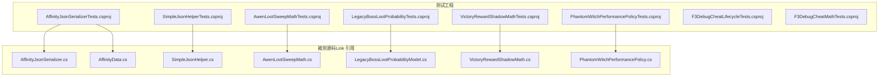
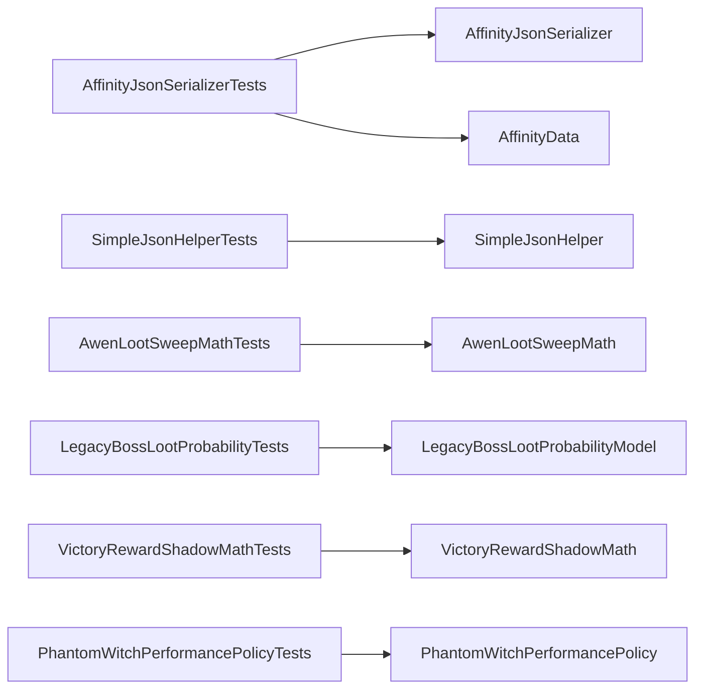
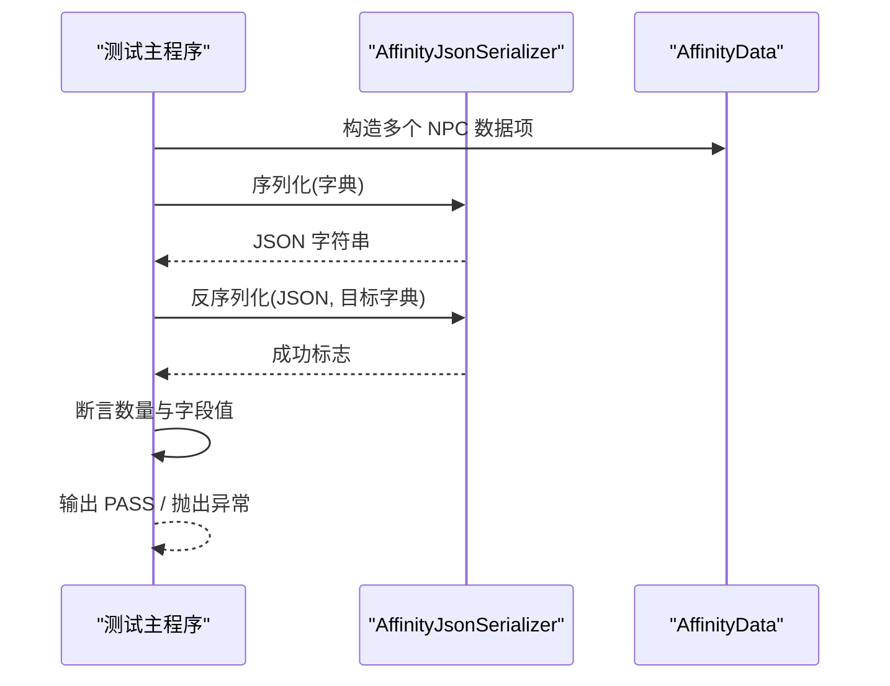
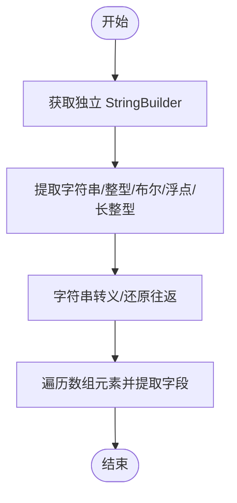
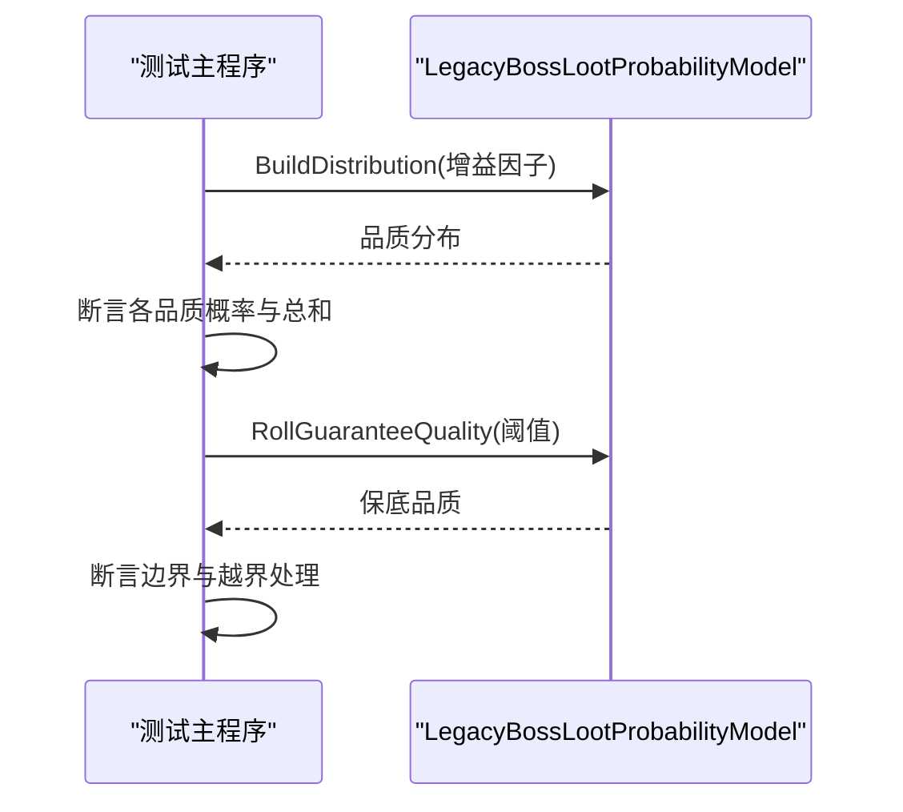
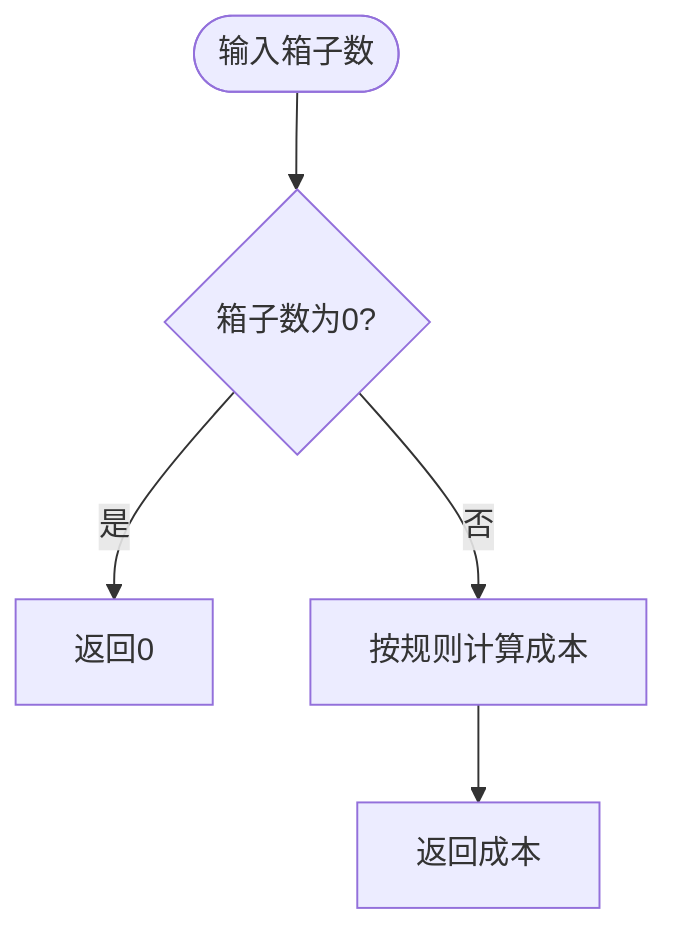
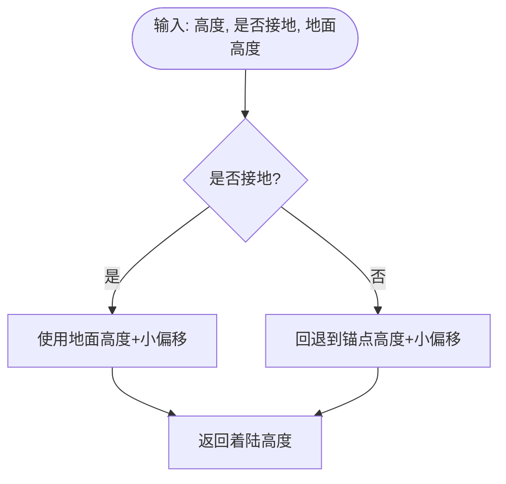
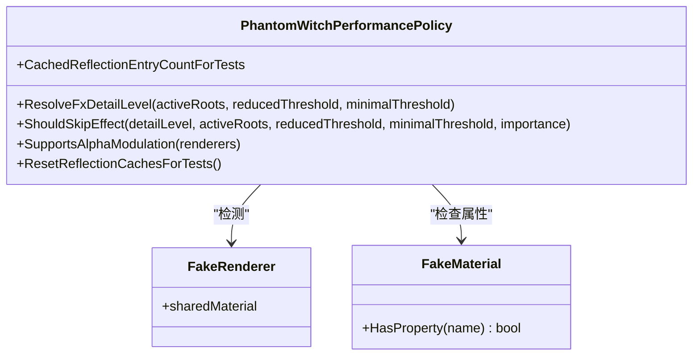
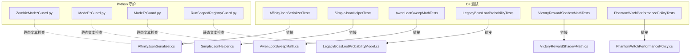

# C# 单元测试

<cite>
**本文引用的文件**
- [tests/README.md](file://tests/README.md)
- [AffinityJsonSerializerTests.cs](file://tests/AffinityJsonSerializerTests.cs)
- [AffinityJsonSerializerTests.csproj](file://tests/AffinityJsonSerializerTests.csproj)
- [SimpleJsonHelperTests.cs](file://tests/SimpleJsonHelperTests.cs)
- [SimpleJsonHelperTests.csproj](file://tests/SimpleJsonHelperTests.csproj)
- [AwenLootSweepMathTests.cs](file://tests/AwenLootSweepMathTests.cs)
- [AwenLootSweepMathTests.csproj](file://tests/AwenLootSweepMathTests.csproj)
- [LegacyBossLootProbabilityTests.cs](file://tests/LegacyBossLootProbabilityTests.cs)
- [LegacyBossLootProbabilityTests.csproj](file://tests/LegacyBossLootProbabilityTests.csproj)
- [VictoryRewardShadowMathTests.cs](file://tests/VictoryRewardShadowMathTests.cs)
- [VictoryRewardShadowMathTests.csproj](file://tests/VictoryRewardShadowMathTests.csproj)
- [PhantomWitchPerformancePolicyTests.cs](file://tests/PhantomWitchPerformancePolicyTests.cs)
- [PhantomWitchPerformancePolicyTests.csproj](file://tests/PhantomWitchPerformancePolicyTests.csproj)
- [F3DebugCheatLifecycleTests.csproj](file://tests/F3DebugCheatLifecycleTests.csproj)
- [F3DebugCheatMathTests.csproj](file://tests/F3DebugCheatMathTests.csproj)
- [LegacyBossLootProbabilityModel.cs](file://LootAndRewards/LegacyBossLootProbabilityModel.cs)
- [SimpleJsonHelper.cs](file://Utilities/SimpleJsonHelper.cs)
- [AwenLootSweepMath.cs](file://Utilities/AwenLootSweepMath.cs)
- [VictoryRewardShadowMath.cs](file://Utilities/VictoryRewardShadowMath.cs)
- [AffinityData.cs](file://Integration/Affinity/AffinityData.cs)
- [AffinityJsonSerializer.cs](file://Integration/Affinity/AffinityJsonSerializer.cs)
- [PhantomWitchPerformancePolicy.cs](file://Integration/PhantomWitch/PhantomWitchPerformancePolicy.cs)
</cite>

## 目录
1. [简介](#简介)
2. [项目结构](#项目结构)
3. [核心组件](#核心组件)
4. [架构总览](#架构总览)
5. [详细组件分析](#详细组件分析)
6. [依赖关系分析](#依赖关系分析)
7. [性能考虑](#性能考虑)
8. [故障排查指南](#故障排查指南)
9. [结论](#结论)
10. [附录](#附录)

## 简介
本仓库的测试体系由两部分组成：
- C# 控制台测试程序：针对 JSON 序列化、概率计算、数学运算、调试工具生命周期与策略等核心逻辑进行无框架、轻量级验证。每个测试工程以 .NET 8 控制台应用形式存在，通过 Main 方法顺序执行用例并输出 PASS/失败异常。
- Python 静态守护脚本：用于防止关键代码不变量被误改（如编译列表一致性、反射使用限制、热路径行为等），属于“文本守卫”，不是功能测试。

该设计强调“最小依赖、快速反馈”：C# 测试仅链接被测源码片段，避免引入完整游戏运行时；Python 守护在 CI 或本地预提交时运行，保障架构契约稳定。

## 项目结构
tests 目录下包含若干独立测试工程（.csproj）和对应的测试源文件（*.cs）。每个工程采用“显式 Include”方式只编译所需文件，并通过 Link 引用生产源码中的纯函数或轻依赖类，从而保持测试可独立构建与运行。

**图示来源**
- [AffinityJsonSerializerTests.csproj:1-18](file://tests/AffinityJsonSerializerTests.csproj#L1-L18)
- [SimpleJsonHelperTests.csproj:1-16](file://tests/SimpleJsonHelperTests.csproj#L1-L16)
- [AwenLootSweepMathTests.csproj:1-16](file://tests/AwenLootSweepMathTests.csproj#L1-L16)
- [LegacyBossLootProbabilityTests.csproj:1-16](file://tests/LegacyBossLootProbabilityTests.csproj#L1-L16)
- [VictoryRewardShadowMathTests.csproj:1-16](file://tests/VictoryRewardShadowMathTests.csproj#L1-L16)
- [PhantomWitchPerformancePolicyTests.csproj:1-16](file://tests/PhantomWitchPerformancePolicyTests.csproj#L1-L16)

**章节来源**
- [tests/README.md:1-115](file://tests/README.md#L1-L115)

## 核心组件
- JSON 序列化测试：覆盖亲和值数据的序列化/反序列化往返、缺失字段跳过、重复键处理、非法结构拒绝等边界场景。
- 概率计算测试：验证旧版 Boss 掉落品质分布、保底质量抽取、参数钳制与插值、越界回退等。
- 数学运算测试：包括扫荡成本、容器容量上限、根节点选择、阴影跟随/着陆高度、移动逼近等数值算法。
- 调试工具与性能策略测试：覆盖 F3 调试菜单生命周期、幽灵女巫性能策略（特效细节级别、是否跳过效果、Alpha 调制支持、反射缓存复用）。

这些测试统一遵循以下规范：
- 使用内部静态类 + Main 入口，按用例顺序执行。
- 断言通过自定义 AssertEqual/AssertTrue/AssertClose 等方法实现，失败即抛异常并返回非零退出码。
- 不依赖第三方测试框架，便于在无 Unity 环境下独立运行。

**章节来源**
- [AffinityJsonSerializerTests.cs:1-114](file://tests/AffinityJsonSerializerTests.cs#L1-L114)
- [SimpleJsonHelperTests.cs:1-111](file://tests/SimpleJsonHelperTests.cs#L1-L111)
- [AwenLootSweepMathTests.cs:1-43](file://tests/AwenLootSweepMathTests.cs#L1-L43)
- [LegacyBossLootProbabilityTests.cs:1-96](file://tests/LegacyBossLootProbabilityTests.cs#L1-L96)
- [VictoryRewardShadowMathTests.cs:1-55](file://tests/VictoryRewardShadowMathTests.cs#L1-L55)
- [PhantomWitchPerformancePolicyTests.cs:1-194](file://tests/PhantomWitchPerformancePolicyTests.cs#L1-L194)

## 架构总览
下图展示了测试工程与被测源码之间的引用关系，以及各测试关注的领域模块。

**图示来源**
- [AffinityJsonSerializerTests.csproj:11-15](file://tests/AffinityJsonSerializerTests.csproj#L11-L15)
- [SimpleJsonHelperTests.csproj:11-13](file://tests/SimpleJsonHelperTests.csproj#L11-L13)
- [AwenLootSweepMathTests.csproj:11-13](file://tests/AwenLootSweepMathTests.csproj#L11-L13)
- [LegacyBossLootProbabilityTests.csproj:11-13](file://tests/LegacyBossLootProbabilityTests.csproj#L11-L13)
- [VictoryRewardShadowMathTests.csproj:11-13](file://tests/VictoryRewardShadowMathTests.csproj#L11-L13)
- [PhantomWitchPerformancePolicyTests.csproj:11-13](file://tests/PhantomWitchPerformancePolicyTests.csproj#L11-L13)

## 详细组件分析

### JSON 序列化测试（亲和值数据）
- 目标：确保 AffinityData 字典到 JSON 的往返一致，且对缺失字段、重复键、非法结构具备健壮性。
- 关键点：
  - 构造多组数据（含空值、特殊字符、布尔、字符串数组编码等）。
  - 调用 Serialize/Deserialize 完成往返校验。
  - 断言计数、字段值、空值转默认值等行为。
- 典型流程如下：

**图示来源**
- [AffinityJsonSerializerTests.cs:23-75](file://tests/AffinityJsonSerializerTests.cs#L23-L75)
- [AffinityJsonSerializerTests.cs:77-102](file://tests/AffinityJsonSerializerTests.cs#L77-L102)
- [AffinityJsonSerializerTests.cs:104-112](file://tests/AffinityJsonSerializerTests.cs#L104-L112)

**章节来源**
- [AffinityJsonSerializerTests.cs:1-114](file://tests/AffinityJsonSerializerTests.cs#L1-L114)
- [AffinityJsonSerializerTests.csproj:11-15](file://tests/AffinityJsonSerializerTests.csproj#L11-L15)

### 简单 JSON 解析器测试
- 目标：验证 SimpleJsonHelper 的提取器、转义、科学计数法、大小写不敏感、对象遍历等能力。
- 关键点：
  - GetBuilder 返回独立实例，避免共享状态污染。
  - ExtractXxx 精确匹配键名，不匹配前缀。
  - Escape/Unescape 往返一致。
  - ForEachObject 能正确跳过字符串内的花括号。
- 流程图：

**图示来源**
- [SimpleJsonHelperTests.cs:24-96](file://tests/SimpleJsonHelperTests.cs#L24-L96)
- [SimpleJsonHelperTests.cs:98-109](file://tests/SimpleJsonHelperTests.cs#L98-L109)

**章节来源**
- [SimpleJsonHelperTests.cs:1-111](file://tests/SimpleJsonHelperTests.cs#L1-L111)
- [SimpleJsonHelperTests.csproj:11-13](file://tests/SimpleJsonHelperTests.csproj#L11-L13)

### 概率计算测试（旧版 Boss 掉落）
- 目标：验证品质分布构建、保底质量抽取、参数钳制与插值、越界回退、无效质量查询等。
- 关键点：
  - BuildDistribution 在不同增益因子下产出不同分布，总和为 1。
  - RollGuaranteeQuality 根据阈值映射到保底品质。
  - Clamp01/Lerp 保证输入范围安全。
  - 越界因子被钳制到基线/最大值。
- 序列图：

**图示来源**
- [LegacyBossLootProbabilityTests.cs:22-82](file://tests/LegacyBossLootProbabilityTests.cs#L22-L82)
- [LegacyBossLootProbabilityTests.cs:84-94](file://tests/LegacyBossLootProbabilityTests.cs#L84-L94)

**章节来源**
- [LegacyBossLootProbabilityTests.cs:1-96](file://tests/LegacyBossLootProbabilityTests.cs#L1-L96)
- [LegacyBossLootProbabilityTests.csproj:11-13](file://tests/LegacyBossLootProbabilityTests.csproj#L11-L13)
- [LegacyBossLootProbabilityModel.cs:1-200](file://LootAndRewards/LegacyBossLootProbabilityModel.cs#L1-L200)

### 数学运算测试（扫荡与阴影）
- 扫荡成本与容量：
  - 计算扫荡成本随箱子数变化。
  - 容器容量有下限与上限（例如 35~512）。
  - 根据随机比例选择已消耗根节点索引。
- 胜利奖励阴影：
  - 跟随高度增加基础偏移。
  - 着陆高度优先使用地面高度，否则回退锚点高度。
  - 移动逼近速度与时步控制，到达目标后钳制。
- 流程图（扫荡成本）：

**图示来源**
- [AwenLootSweepMathTests.cs:14-32](file://tests/AwenLootSweepMathTests.cs#L14-L32)
- [AwenLootSweepMathTests.cs:34-41](file://tests/AwenLootSweepMathTests.cs#L34-L41)

**章节来源**
- [AwenLootSweepMathTests.cs:1-43](file://tests/AwenLootSweepMathTests.cs#L1-L43)
- [AwenLootSweepMathTests.csproj:11-13](file://tests/AwenLootSweepMathTests.csproj#L11-L13)
- [AwenLootSweepMath.cs:1-200](file://Utilities/AwenLootSweepMath.cs#L1-L200)

- 流程图（阴影着陆高度）：

**图示来源**
- [VictoryRewardShadowMathTests.cs:20-30](file://tests/VictoryRewardShadowMathTests.cs#L20-L30)

**章节来源**
- [VictoryRewardShadowMathTests.cs:1-55](file://tests/VictoryRewardShadowMathTests.cs#L1-L55)
- [VictoryRewardShadowMathTests.csproj:11-13](file://tests/VictoryRewardShadowMathTests.csproj#L11-L13)
- [VictoryRewardShadowMath.cs:1-200](file://Utilities/VictoryRewardShadowMath.cs#L1-L200)

### 调试工具与性能策略测试
- F3 调试菜单生命周期：
  - 通过独立测试工程验证生命周期相关约束（具体用例位于对应测试工程）。
- 幽灵女巫性能策略：
  - ResolveFxDetailLevel：根据活跃根数与阈值决定特效细节级别。
  - ShouldSkipEffect：依据重要性（Critical/Standard/Optional）与饱和度决定是否跳过。
  - SupportsAlphaModulation：检测渲染器与材质属性支持情况，并缓存反射结果以提升性能。
- 类关系图：

**图示来源**
- [PhantomWitchPerformancePolicyTests.cs:7-25](file://tests/PhantomWitchPerformancePolicyTests.cs#L7-L25)
- [PhantomWitchPerformancePolicyTests.cs:51-182](file://tests/PhantomWitchPerformancePolicyTests.cs#L51-L182)
- [PhantomWitchPerformancePolicy.cs:1-200](file://Integration/PhantomWitch/PhantomWitchPerformancePolicy.cs#L1-L200)

**章节来源**
- [PhantomWitchPerformancePolicyTests.cs:1-194](file://tests/PhantomWitchPerformancePolicyTests.cs#L1-L194)
- [PhantomWitchPerformancePolicyTests.csproj:11-13](file://tests/PhantomWitchPerformancePolicyTests.csproj#L11-L13)
- [F3DebugCheatLifecycleTests.csproj:11-13](file://tests/F3DebugCheatLifecycleTests.csproj#L11-L13)
- [F3DebugCheatMathTests.csproj:11-13](file://tests/F3DebugCheatMathTests.csproj#L11-L13)

## 依赖关系分析
- 测试工程通过 <Compile Include="... Link=..."> 将生产源码作为链接文件纳入编译，避免复制代码，同时屏蔽游戏引擎依赖。
- 每个测试工程仅链接必要源码，形成“低耦合、高内聚”的测试单元。
- Python 守护脚本与 C# 测试相互补充：前者保障架构契约，后者验证核心逻辑。

**图示来源**
- [tests/README.md:9-99](file://tests/README.md#L9-L99)
- [AffinityJsonSerializerTests.csproj:11-15](file://tests/AffinityJsonSerializerTests.csproj#L11-L15)
- [SimpleJsonHelperTests.csproj:11-13](file://tests/SimpleJsonHelperTests.csproj#L11-L13)
- [AwenLootSweepMathTests.csproj:11-13](file://tests/AwenLootSweepMathTests.csproj#L11-L13)
- [LegacyBossLootProbabilityTests.csproj:11-13](file://tests/LegacyBossLootProbabilityTests.csproj#L11-L13)
- [VictoryRewardShadowMathTests.csproj:11-13](file://tests/VictoryRewardShadowMathTests.csproj#L11-L13)
- [PhantomWitchPerformancePolicyTests.csproj:11-13](file://tests/PhantomWitchPerformancePolicyTests.csproj#L11-L13)

**章节来源**
- [tests/README.md:1-115](file://tests/README.md#L1-L115)

## 性能考虑
- 测试工程禁用隐式 using 与 nullable，减少额外依赖与编译开销。
- 通过 Link 方式引入源码，避免重复编译与内存占用。
- 性能相关测试（如幽灵女巫性能策略）重点验证缓存复用、反射缓存、阈值归一化等热点优化点。
- Python 守护脚本关注热路径行为（如避免临时分配、Transform 缓存、单读查找等），在生产代码中维持高性能。

[本节为通用指导，不直接分析具体文件]

## 故障排查指南
- 运行 C# 测试：
  - 使用 dotnet build 与 dotnet run 分别构建与执行各测试工程。
  - 若出现断言失败，会抛出异常并返回非零退出码；查看控制台输出定位失败用例。
- 运行 Python 守护：
  - 参考 tests/README.md 中的命令批量或单独执行守护脚本。
  - 退出码 0 表示通过；非 0 表示破坏了对应 invariant，输出会指明具体条目。
- 常见问题：
  - 链接文件路径错误：检查 .csproj 中 Compile Include 的路径是否正确。
  - 环境差异：确保 .NET 8 SDK 可用；Python 守护需要 Python 解释器。
  - 断言精度：概率与浮点比较使用容差断言，注意精度设置。

**章节来源**
- [tests/README.md:103-115](file://tests/README.md#L103-L115)
- [AffinityJsonSerializerTests.cs:104-112](file://tests/AffinityJsonSerializerTests.cs#L104-L112)
- [SimpleJsonHelperTests.cs:98-109](file://tests/SimpleJsonHelperTests.cs#L98-L109)
- [AwenLootSweepMathTests.cs:34-41](file://tests/AwenLootSweepMathTests.cs#L34-L41)
- [LegacyBossLootProbabilityTests.cs:84-94](file://tests/LegacyBossLootProbabilityTests.cs#L84-L94)
- [VictoryRewardShadowMathTests.cs:44-53](file://tests/VictoryRewardShadowMathTests.cs#L44-L53)
- [PhantomWitchPerformancePolicyTests.cs:184-192](file://tests/PhantomWitchPerformancePolicyTests.cs#L184-L192)

## 结论
本项目采用“轻量 C# 测试 + Python 静态守护”的双轨测试策略：
- C# 测试聚焦核心逻辑的正确性与边界条件，覆盖 JSON 序列化、概率模型、数学运算与性能策略。
- Python 守护保障架构契约与生产代码不变量，降低回归风险。
两者结合，既保证了开发效率，又提升了系统稳定性与可维护性。

[本节为总结性内容，不直接分析具体文件]

## 附录
- 测试工程清单与目标：
  - JSON 序列化：AffinityJsonSerializerTests
  - JSON 解析器：SimpleJsonHelperTests
  - 扫荡数学：AwenLootSweepMathTests
  - 概率模型：LegacyBossLootProbabilityTests
  - 阴影数学：VictoryRewardShadowMathTests
  - 性能策略：PhantomWitchPerformancePolicyTests
  - 调试工具：F3DebugCheatLifecycleTests、F3DebugCheatMathTests

- 最佳实践建议：
  - 测试数据准备：构造覆盖正常、边界、异常的数据集，确保断言全面。
  - 模拟对象：对复杂依赖（如渲染器、材质）使用最小接口模拟，隔离外部影响。
  - 异步测试：当前测试以同步为主；如需扩展异步用例，建议封装等待与超时机制。
  - 结果分析：关注断言失败的具体字段与期望值，逐步缩小问题范围。

[本节为通用指导，不直接分析具体文件]