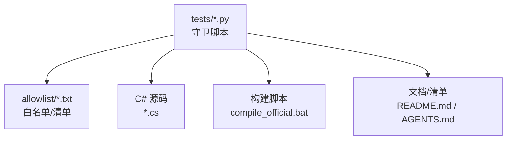
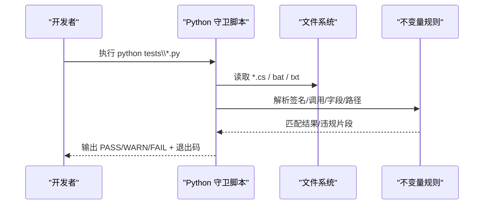
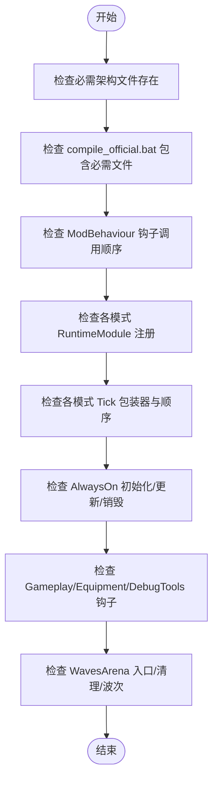
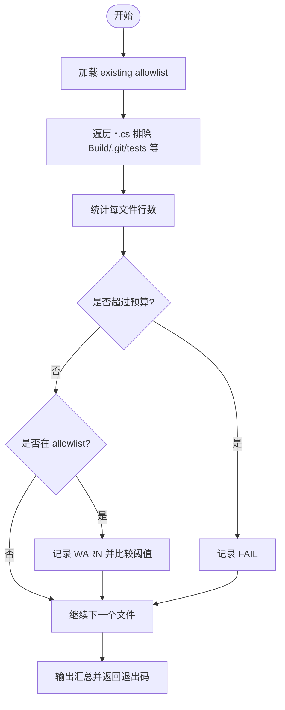
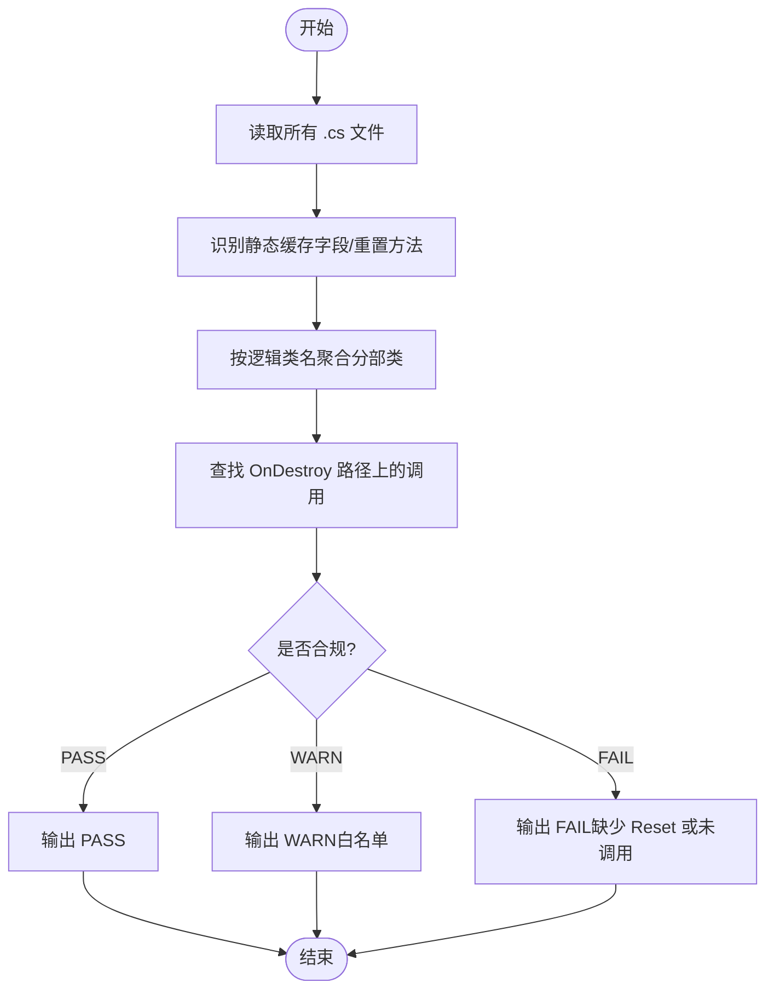
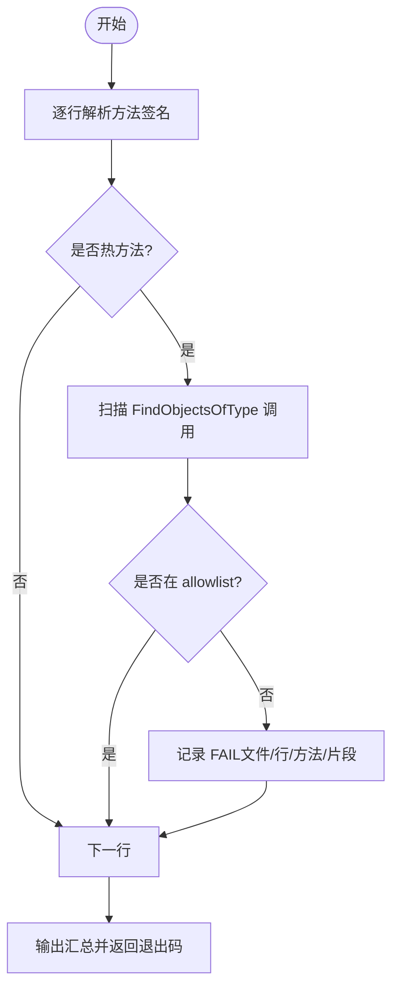
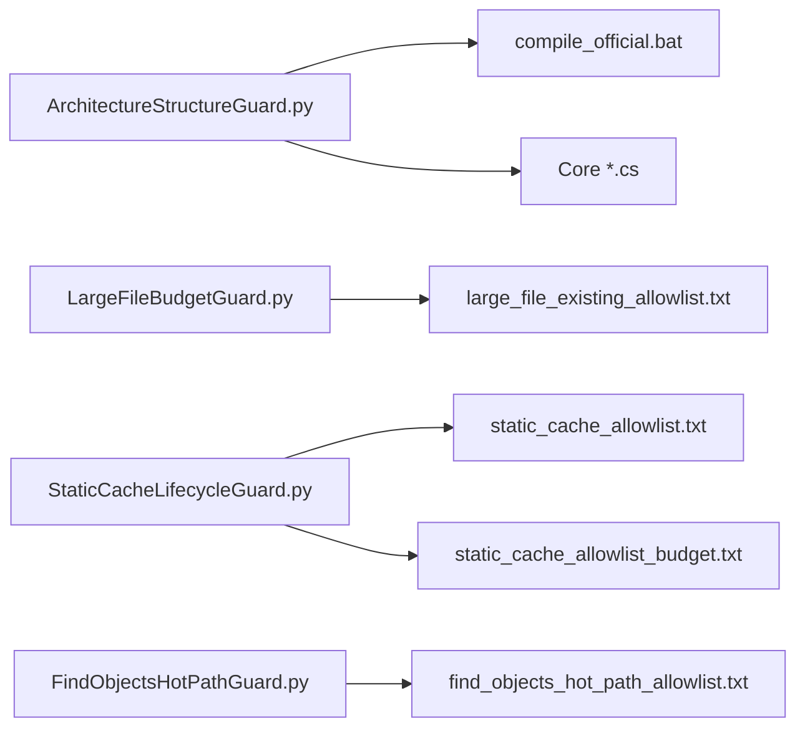

# Python 守卫脚本

<cite>
**本文引用的文件**
- [tests/README.md](file://tests/README.md)
- [tests/AGENTS.md](file://tests/AGENTS.md)
- [tests/ArchitectureStructureGuard.py](file://tests/ArchitectureStructureGuard.py)
- [tests/LargeFileBudgetGuard.py](file://tests/LargeFileBudgetGuard.py)
- [tests/StaticCacheLifecycleGuard.py](file://tests/StaticCacheLifecycleGuard.py)
- [tests/FindObjectsHotPathGuard.py](file://tests/FindObjectsHotPathGuard.py)
- [tests/PerformanceTierAdjusterGuard.py](file://tests/PerformanceTierAdjusterGuard.py)
- [tests/event_subscription_lifecycle_allowlist.txt](file://tests/event_subscription_lifecycle_allowlist.txt)
- [tests/find_objects_hot_path_allowlist.txt](file://tests/find_objects_hot_path_allowlist.txt)
- [tests/large_file_existing_allowlist.txt](file://tests/large_file_existing_allowlist.txt)
- [tests/static_cache_allowlist.txt](file://tests/static_cache_allowlist.txt)
- [tests/static_cache_allowlist_budget.txt](file://tests/static_cache_allowlist_budget.txt)
- [tests/ManualSmokeLaunchGuard.py](file://tests/ManualSmokeLaunchGuard.py)
- [tests/SmokeLogScanGuard.py](file://tests/SmokeLogScanGuard.py)
- [tests/OfficialCompileListFileExistenceGuard.py](file://tests/OfficialCompileListFileExistenceGuard.py)
- [tests/GitIgnoreGuard.py](file://tests/GitIgnoreGuard.py)
- [tests/WindowsPathDetectionGuard.py](file://tests/WindowsPathDetectionGuard.py)
- [tests/NoHardcodedMapFallbackGuard.py](file://tests/NoHardcodedMapFallbackGuard.py)
- [tests/HardcodedDevModeDefaultGuard.py](file://tests/HardcodedDevModeDefaultGuard.py)
- [tests/ModConfigOptionChangeGuard.py](file://tests/ModConfigOptionChangeGuard.py)
- [tests/ContentRegistryGuard.py](file://tests/ContentRegistryGuard.py)
- [tests/DataRegistryDeploymentGuard.py](file://tests/DataRegistryDeploymentGuard.py)
- [tests/BossRushEventBusLifecycleGuard.py](file://tests/BossRushEventBusLifecycleGuard.py)
- [tests/BossRushEventBusReentrancyGuard.py](file://tests/BossRushEventBusReentrancyGuard.py)
- [tests/RunScopedRegistryGuard.py](file://tests/RunScopedRegistryGuard.py)
- [tests/EmptyCatchGuard.py](file://tests/EmptyCatchGuard.py)
- [tests/ValidateRefactorStepScriptGuard.py](file://tests/ValidateRefactorStepScriptGuard.py)
</cite>

## 目录
1. [简介](#简介)
2. [项目结构](#项目结构)
3. [核心组件](#核心组件)
4. [架构总览](#架构总览)
5. [详细组件分析](#详细组件分析)
6. [依赖关系分析](#依赖关系分析)
7. [性能与内存特性](#性能与内存特性)
8. [故障排查指南](#故障排查指南)
9. [结论](#结论)
10. [附录：自定义守卫开发指南](#附录自定义守卫开发指南)

## 简介
本仓库的 tests 目录下包含大量 Python 守卫脚本。它们不是运行时单元测试，而是“静态文本守护”（grep/正则风格），用于在编译前或 CI 中快速发现破坏关键不变量（invariant）的代码变更。这些守卫覆盖架构结构、热路径性能、静态缓存生命周期、文件大小预算、数据注册表部署、事件订阅生命周期、配置项变更、地图回退策略等多个维度，目标是降低回归风险、提升代码质量与可维护性。

运行方式通常是在 Windows 命令行批量执行所有守卫脚本，或通过单个脚本定位问题；退出码 0 表示通过，非 0 表示失败并输出具体断言位置。

**章节来源**
- [tests/README.md:1-115](file://tests/README.md#L1-L115)
- [tests/AGENTS.md:1-28](file://tests/AGENTS.md#L1-L28)

## 项目结构
tests 目录按“守卫职责 + 白名单/清单”组织：
- 守卫脚本：每个 *.py 聚焦一条明确的 invariant，失败信息需指出文件和缺失模式。
- 白名单与清单：如 large_file_existing_allowlist.txt、static_cache_allowlist.txt、find_objects_hot_path_allowlist.txt 等，用于管理历史债务和允许例外。
- 辅助测试：少量 C# 测试工程与 Python 属性测试脚本，用于不依赖游戏进程的验证。

**图表来源**
- [tests/README.md:103-115](file://tests/README.md#L103-L115)
- [tests/ArchitectureStructureGuard.py:8-87](file://tests/ArchitectureStructureGuard.py#L8-L87)
- [tests/LargeFileBudgetGuard.py:13-30](file://tests/LargeFileBudgetGuard.py#L13-L30)
- [tests/StaticCacheLifecycleGuard.py:19-21](file://tests/StaticCacheLifecycleGuard.py#L19-L21)
- [tests/FindObjectsHotPathGuard.py:14-18](file://tests/FindObjectsHotPathGuard.py#L14-L18)

**章节来源**
- [tests/README.md:1-115](file://tests/README.md#L1-L115)
- [tests/AGENTS.md:1-28](file://tests/AGENTS.md#L1-L28)

## 核心组件
以下守卫是本项目守卫体系的核心支柱，分别对应不同维度的不变量保障：

- 架构结构守卫：确保核心模块、运行时钩子、场景门控、更新链路等关键调用点不被误改。
- 文件大小预算守卫：控制单文件行数上限，推动大文件拆分，避免重构过程中膨胀。
- 静态缓存生命周期守卫：强制声明静态缓存的类提供 Reset/Clear 方法并在 OnDestroy 路径上清理。
- 热路径扫描守卫：禁止在 Update/Tick/OnHurt/OnDead 等高频回调中使用 FindObjectsOfType 等全局扫描。
- 性能档清理守卫：移除旧的性能档 helper，防止生产代码按性能档改变玩法。
- 数据注册表与内容守卫：确保注册表、本地化 key、编译列表、Git 忽略规则等基础设施一致。
- 事件订阅与运行期作用域守卫：保证事件订阅生命周期正确、迭代安全、无重复登记。
- 手动冒烟与日志扫描守卫：确保手工检查清单存在并可执行，日志扫描能覆盖关键路径。

**章节来源**
- [tests/ArchitectureStructureGuard.py:1-87](file://tests/ArchitectureStructureGuard.py#L1-L87)
- [tests/LargeFileBudgetGuard.py:1-30](file://tests/LargeFileBudgetGuard.py#L1-L30)
- [tests/StaticCacheLifecycleGuard.py:1-55](file://tests/StaticCacheLifecycleGuard.py#L1-L55)
- [tests/FindObjectsHotPathGuard.py:1-42](file://tests/FindObjectsHotPathGuard.py#L1-L42)
- [tests/PerformanceTierAdjusterGuard.py:1-39](file://tests/PerformanceTierAdjusterGuard.py#L1-L39)
- [tests/ContentRegistryGuard.py:1-200](file://tests/ContentRegistryGuard.py#L1-L200)
- [tests/DataRegistryDeploymentGuard.py:1-200](file://tests/DataRegistryDeploymentGuard.py#L1-L200)
- [tests/BossRushEventBusLifecycleGuard.py:1-200](file://tests/BossRushEventBusLifecycleGuard.py#L1-L200)
- [tests/BossRushEventBusReentrancyGuard.py:1-200](file://tests/BossRushEventBusReentrancyGuard.py#L1-L200)
- [tests/RunScopedRegistryGuard.py:1-200](file://tests/RunScopedRegistryGuard.py#L1-L200)
- [tests/ManualSmokeLaunchGuard.py:1-200](file://tests/ManualSmokeLaunchGuard.py#L1-L200)
- [tests/SmokeLogScanGuard.py:1-200](file://tests/SmokeLogScanGuard.py#L1-L200)

## 架构总览
守卫脚本的执行流程统一为：
1. 读取项目根目录下的相关 C# 源文件、构建脚本、白名单与清单。
2. 使用正则/字符串匹配解析方法签名、调用点、字段声明、路径引用等。
3. 根据预设不变量进行断言，输出 PASS/WARN/FAIL 及具体文件行号。
4. 返回退出码：0 表示通过，非 0 表示失败。

**图表来源**
- [tests/README.md:103-115](file://tests/README.md#L103-L115)
- [tests/ArchitectureStructureGuard.py:135-150](file://tests/ArchitectureStructureGuard.py#L135-L150)
- [tests/LargeFileBudgetGuard.py:64-115](file://tests/LargeFileBudgetGuard.py#L64-L115)
- [tests/StaticCacheLifecycleGuard.py:308-461](file://tests/StaticCacheLifecycleGuard.py#L308-L461)
- [tests/FindObjectsHotPathGuard.py:75-129](file://tests/FindObjectsHotPathGuard.py#L75-L129)

## 详细组件分析

### 架构结构守卫（ArchitectureStructureGuard）
职责：
- 校验核心架构源文件是否存在且被编译列表包含。
- 校验 ModBehaviour 中的运行时钩子调用顺序与封装点未被绕过。
- 校验各模式（WavesArena、ModeE、ModeF、ZombieMode）的 Tick 包装器存在且顺序正确。
- 校验 AlwaysOn/Gameplay/Equipment/DebugTools 等运行时钩子的初始化、更新、销毁流程完整。
- 校验 BossRush 入口流、敌人清理、波次调度等关键方法保留必要 token。

**图表来源**
- [tests/ArchitectureStructureGuard.py:48-101](file://tests/ArchitectureStructureGuard.py#L48-L101)
- [tests/ArchitectureStructureGuard.py:135-179](file://tests/ArchitectureStructureGuard.py#L135-L179)
- [tests/ArchitectureStructureGuard.py:187-250](file://tests/ArchitectureStructureGuard.py#L187-L250)
- [tests/ArchitectureStructureGuard.py:282-340](file://tests/ArchitectureStructureGuard.py#L282-L340)
- [tests/ArchitectureStructureGuard.py:342-423](file://tests/ArchitectureStructureGuard.py#L342-L423)
- [tests/ArchitectureStructureGuard.py:424-579](file://tests/ArchitectureStructureGuard.py#L424-L579)

**章节来源**
- [tests/ArchitectureStructureGuard.py:1-800](file://tests/ArchitectureStructureGuard.py#L1-L800)

### 文件大小预算守卫（LargeFileBudgetGuard）
职责：
- 定义路线图目标文件的行数上限，新文件默认限制更严格。
- 加载 existing allowlist 以冻结历史大文件规模，不允许增长。
- 扫描全部 .cs 文件，统计行数并报告超限与警告。

**图表来源**
- [tests/LargeFileBudgetGuard.py:17-30](file://tests/LargeFileBudgetGuard.py#L17-L30)
- [tests/LargeFileBudgetGuard.py:42-61](file://tests/LargeFileBudgetGuard.py#L42-L61)
- [tests/LargeFileBudgetGuard.py:64-115](file://tests/LargeFileBudgetGuard.py#L64-L115)

**章节来源**
- [tests/LargeFileBudgetGuard.py:1-120](file://tests/LargeFileBudgetGuard.py#L1-L120)

### 静态缓存生命周期守卫（StaticCacheLifecycleGuard）
职责：
- 检测声明了 private static Dictionary 或含 cache/cached 字段的类。
- 要求提供 Reset/Clear 静态缓存方法，并在 OnDestroy 路径上调用。
- 支持白名单暂存待办，输出 PASS/WARN/FAIL 并验证目标类状态。

**图表来源**
- [tests/StaticCacheLifecycleGuard.py:26-55](file://tests/StaticCacheLifecycleGuard.py#L26-L55)
- [tests/StaticCacheLifecycleGuard.py:101-146](file://tests/StaticCacheLifecycleGuard.py#L101-L146)
- [tests/StaticCacheLifecycleGuard.py:257-301](file://tests/StaticCacheLifecycleGuard.py#L257-L301)
- [tests/StaticCacheLifecycleGuard.py:308-461](file://tests/StaticCacheLifecycleGuard.py#L308-L461)

**章节来源**
- [tests/StaticCacheLifecycleGuard.py:1-466](file://tests/StaticCacheLifecycleGuard.py#L1-L466)

### 热路径扫描守卫（FindObjectsHotPathGuard）
职责：
- 禁止在 Update/LateUpdate/FixedUpdate/OnGUI/OnRenderObject/OnWillRenderObject 以及名称包含 EveryFrame/OnHurt/OnDead/HealthHurt/HealthDead/EnemyDied 的方法中使用 Resources.FindObjectsOfType(All)。
- 支持 allowlist 精确放行特定文件+方法+片段组合。

**图表来源**
- [tests/FindObjectsHotPathGuard.py:18-42](file://tests/FindObjectsHotPathGuard.py#L18-L42)
- [tests/FindObjectsHotPathGuard.py:75-129](file://tests/FindObjectsHotPathGuard.py#L75-L129)

**章节来源**
- [tests/FindObjectsHotPathGuard.py:1-134](file://tests/FindObjectsHotPathGuard.py#L1-L134)

### 性能档清理守卫（PerformanceTierAdjusterGuard）
职责：
- 确保旧的 PerformanceTierAdjuster 辅助类已从生产代码与编译列表中移除。
- 若仍存在引用则直接失败，防止按性能档改变玩法的遗留实现污染生产代码。

**章节来源**
- [tests/PerformanceTierAdjusterGuard.py:1-39](file://tests/PerformanceTierAdjusterGuard.py#L1-L39)

### 数据注册表与内容守卫
- ContentRegistryGuard：确保内容注册表的键值、类型映射一致，避免遗漏或冲突。
- DataRegistryDeploymentGuard：确保数据注册表部署到预期路径，避免运行时找不到资源。
- OfficialCompileListFileExistenceGuard：确保 compile_official.bat 列出的源文件确实存在。
- GitIgnoreGuard：确保 .gitignore 包含必要的忽略规则，避免提交临时文件或敏感数据。
- WindowsPathDetectionGuard：检测跨平台路径分隔符问题，避免 Windows 特有路径导致兼容性问题。
- NoHardcodedMapFallbackGuard：禁止硬编码地图回退策略，确保地图选择逻辑集中可控。
- HardcodedDevModeDefaultGuard：禁止在生产代码中保留开发模式默认值。
- ModConfigOptionChangeGuard：监控配置项变更，防止意外修改影响玩家体验。

**章节来源**
- [tests/ContentRegistryGuard.py:1-200](file://tests/ContentRegistryGuard.py#L1-L200)
- [tests/DataRegistryDeploymentGuard.py:1-200](file://tests/DataRegistryDeploymentGuard.py#L1-L200)
- [tests/OfficialCompileListFileExistenceGuard.py:1-200](file://tests/OfficialCompileListFileExistenceGuard.py#L1-L200)
- [tests/GitIgnoreGuard.py:1-200](file://tests/GitIgnoreGuard.py#L1-L200)
- [tests/WindowsPathDetectionGuard.py:1-200](file://tests/WindowsPathDetectionGuard.py#L1-L200)
- [tests/NoHardcodedMapFallbackGuard.py:1-200](file://tests/NoHardcodedMapFallbackGuard.py#L1-L200)
- [tests/HardcodedDevModeDefaultGuard.py:1-200](file://tests/HardcodedDevModeDefaultGuard.py#L1-L200)
- [tests/ModConfigOptionChangeGuard.py:1-200](file://tests/ModConfigOptionChangeGuard.py#L1-L200)

### 事件订阅与运行期作用域守卫
- BossRushEventBusLifecycleGuard：确保事件总线订阅/发布生命周期正确，避免泄漏或重复订阅。
- BossRushEventBusReentrancyGuard：防止事件处理重入导致的栈溢出或状态不一致。
- RunScopedRegistryGuard：确保局生命周期注册表迭代安全，清理通道完整。
- EmptyCatchGuard：禁止空 catch 块，避免吞掉异常导致难以排查的问题。
- ValidateRefactorStepScriptGuard：验证重构步骤脚本的存在与一致性，确保迁移过程可追溯。

**章节来源**
- [tests/BossRushEventBusLifecycleGuard.py:1-200](file://tests/BossRushEventBusLifecycleGuard.py#L1-L200)
- [tests/BossRushEventBusReentrancyGuard.py:1-200](file://tests/BossRushEventBusReentrancyGuard.py#L1-L200)
- [tests/RunScopedRegistryGuard.py:1-200](file://tests/RunScopedRegistryGuard.py#L1-L200)
- [tests/EmptyCatchGuard.py:1-200](file://tests/EmptyCatchGuard.py#L1-L200)
- [tests/ValidateRefactorStepScriptGuard.py:1-200](file://tests/ValidateRefactorStepScriptGuard.py#L1-L200)

### 手动冒烟与日志扫描守卫
- ManualSmokeLaunchGuard：确保手工冒烟检查清单存在并可执行，覆盖关键功能路径。
- SmokeLogScanGuard：扫描日志输出，确保关键路径有足够可见性，便于定位问题。

**章节来源**
- [tests/ManualSmokeLaunchGuard.py:1-200](file://tests/ManualSmokeLaunchGuard.py#L1-L200)
- [tests/SmokeLogScanGuard.py:1-200](file://tests/SmokeLogScanGuard.py#L1-L200)

## 依赖关系分析
守卫脚本之间的依赖主要体现在共享白名单与清单文件：
- LargeFileBudgetGuard 依赖 large_file_existing_allowlist.txt。
- StaticCacheLifecycleGuard 依赖 static_cache_allowlist.txt 与 static_cache_allowlist_budget.txt。
- FindObjectsHotPathGuard 依赖 find_objects_hot_path_allowlist.txt。
- ArchitectureStructureGuard 依赖 compile_official.bat 与各核心 C# 文件。

**图表来源**
- [tests/ArchitectureStructureGuard.py:8-87](file://tests/ArchitectureStructureGuard.py#L8-L87)
- [tests/LargeFileBudgetGuard.py:13-30](file://tests/LargeFileBudgetGuard.py#L13-L30)
- [tests/StaticCacheLifecycleGuard.py:19-21](file://tests/StaticCacheLifecycleGuard.py#L19-L21)
- [tests/FindObjectsHotPathGuard.py:14-18](file://tests/FindObjectsHotPathGuard.py#L14-L18)

**章节来源**
- [tests/ArchitectureStructureGuard.py:1-800](file://tests/ArchitectureStructureGuard.py#L1-L800)
- [tests/LargeFileBudgetGuard.py:1-120](file://tests/LargeFileBudgetGuard.py#L1-L120)
- [tests/StaticCacheLifecycleGuard.py:1-466](file://tests/StaticCacheLifecycleGuard.py#L1-L466)
- [tests/FindObjectsHotPathGuard.py:1-134](file://tests/FindObjectsHotPathGuard.py#L1-L134)

## 性能与内存特性
- 热路径保护：FindObjectsHotPathGuard 阻止在 Update/Tick/OnHurt/OnDead 等高频回调中进行全局对象扫描，避免帧率抖动与内存分配峰值。
- 静态缓存清理：StaticCacheLifecycleGuard 强制在 OnDestroy 路径上清理静态缓存，防止内存泄漏与状态污染。
- 文件大小控制：LargeFileBudgetGuard 推动大文件拆分，减少单文件复杂度，提高编译与维护效率。
- 性能档清理：PerformanceTierAdjusterGuard 移除旧性能档 helper，避免生产代码按性能档改变玩法，确保一致性。

[本节为通用性能讨论，不直接分析具体文件]

## 故障排查指南
常见失败原因与处理建议：
- 架构结构守卫失败：检查 ModBehaviour 的运行时钩子调用顺序是否正确，确认各模式 Tick 包装器存在且未被绕过。
- 文件大小守卫失败：将超大文件拆分为更小模块，或在 allowlist 中登记历史债务但不得增长。
- 静态缓存守卫失败：为含静态缓存的类添加 Reset/Clear 方法，并确保在 OnDestroy 路径上调用。
- 热路径守卫失败：避免在 Update/Tick/OnHurt/OnDead 等方法中使用 FindObjectsOfType，改用缓存或预扫描。
- 性能档守卫失败：删除或替换旧 PerformanceTierAdjuster 引用，确保生产代码不再按性能档改变玩法。
- 数据注册表/内容守卫失败：核对注册表键值、本地化 key、编译列表与部署路径的一致性。
- 事件订阅守卫失败：检查订阅/发布生命周期，避免重入与泄漏，确保清理通道完整。
- 手动冒烟/日志扫描守卫失败：补充手工检查清单与日志输出，确保关键路径可观测。

**章节来源**
- [tests/ArchitectureStructureGuard.py:135-179](file://tests/ArchitectureStructureGuard.py#L135-L179)
- [tests/LargeFileBudgetGuard.py:64-115](file://tests/LargeFileBudgetGuard.py#L64-L115)
- [tests/StaticCacheLifecycleGuard.py:308-461](file://tests/StaticCacheLifecycleGuard.py#L308-L461)
- [tests/FindObjectsHotPathGuard.py:75-129](file://tests/FindObjectsHotPathGuard.py#L75-L129)
- [tests/PerformanceTierAdjusterGuard.py:17-33](file://tests/PerformanceTierAdjusterGuard.py#L17-L33)

## 结论
Python 守卫脚本为本项目提供了强大的静态不变量保障，覆盖架构、性能、内存、数据一致性、配置、事件生命周期等多个关键维度。通过统一的执行流程与清晰的失败输出，开发者可以快速定位并修复回归问题。配合白名单与清单机制，既能管理历史债务，又能推动持续重构与优化。建议在每次提交前运行守卫脚本，确保代码质量与系统稳定性。

[本节为总结性内容，不直接分析具体文件]

## 附录：自定义守卫开发指南
编写规范：
- 聚焦单一 invariant，失败信息需明确指出文件与缺失模式。
- 使用正则/字符串匹配解析方法签名、调用点、字段声明、路径引用等。
- 支持白名单机制，仅用于解释既有债务，新增代码默认不进白名单。
- 可在普通 Python 环境运行，不依赖游戏进程。

执行流程：
1. 读取相关 C# 源文件、构建脚本、白名单与清单。
2. 解析并断言不变量，输出 PASS/WARN/FAIL 及具体位置。
3. 返回退出码：0 表示通过，非 0 表示失败。

最佳实践：
- 检测代码质量问题：如空 catch、硬编码默认值、配置项变更。
- 检测性能瓶颈：如热路径中的全局扫描、未缓存的计算。
- 检测潜在风险：如事件订阅泄漏、静态缓存未清理、地图回退策略硬编码。
- 结合白名单与清单管理历史债务，逐步推进重构。

**章节来源**
- [tests/AGENTS.md:5-12](file://tests/AGENTS.md#L5-L12)
- [tests/README.md:103-115](file://tests/README.md#L103-L115)
- [tests/ArchitectureStructureGuard.py:135-179](file://tests/ArchitectureStructureGuard.py#L135-L179)
- [tests/LargeFileBudgetGuard.py:64-115](file://tests/LargeFileBudgetGuard.py#L64-L115)
- [tests/StaticCacheLifecycleGuard.py:308-461](file://tests/StaticCacheLifecycleGuard.py#L308-L461)
- [tests/FindObjectsHotPathGuard.py:75-129](file://tests/FindObjectsHotPathGuard.py#L75-L129)

## 2026-09-04 深度复审修复

`OPERATIONAL` / `SAFE`。干净源码 CI 使用 `python tools/run_guards.py --source-only --verbose`。所有源码断言仍执行；ModeGPresentationAssetGuard、ModeHPresentationAssetGuard、PortableSafeZoneDeviceBundleGuard 对外部 bundle、兄弟 Unity 工程 builder 和本地制作约定明确返回 PARTIAL（不计 PASS）。其他脚本的非零退出、这三个脚本的源码断言失败仍使 CI 失败。

发布验收运行不带 `--source-only` 的完整命令，缺少/损坏制品仍失败；环境变量不能让完整 runner 降级。info.ini 和捏脸制作本地资料不再伪装成干净源码必有的 file:// 引用。不得用源码绿代替完整制品、Windows 真编译或游戏 smoke。

新增 `tests/fixtures/ReviewSeptember/ReviewSeptember.csproj` 是隔离回归入口，直接链接生产协调器/节流/规范化/恢复源码；宿主 IO 使用 stub，未读取玩家数据。运行方式见同目录 README。章节来源：`tools/run_guards.py`、`.github/workflows/guards.yml`、`tests/SourceOnlyGuardProfileTests.py`。
