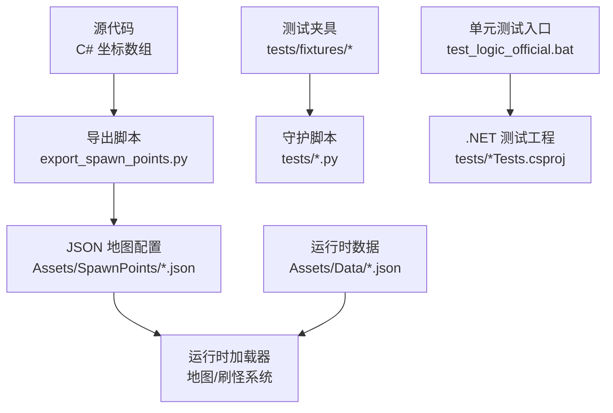
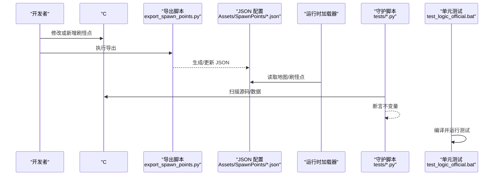
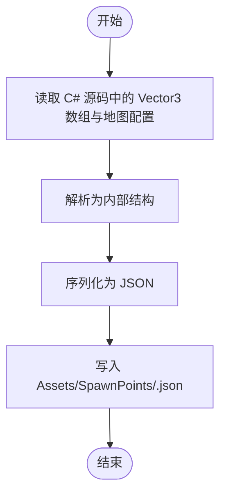
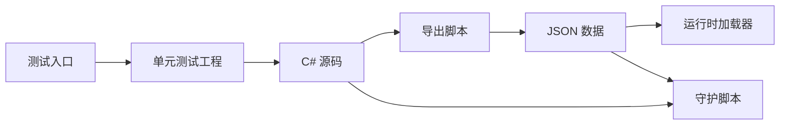

# 测试数据与夹具

<cite>
**本文引用的文件**
- [tests/README.md](file://tests/README.md)
- [tests/fixtures/LegacyMapSpawnPointFallbackSnapshot.cs.txt](file://tests/fixtures/LegacyMapSpawnPointFallbackSnapshot.cs.txt)
- [Assets/Data/LootBlacklist.json](file://Assets/Data/LootBlacklist.json)
- [Assets/SpawnPoints/Level_GroundZero_1.json](file://Assets/SpawnPoints/Level_GroundZero_1.json)
- [tools/export_spawn_points.py](file://tools/export_spawn_points.py)
- [test_logic_official.bat](file://test_logic_official.bat)
- [tests/LegacyBossLootProbabilityTests.csproj](file://tests/LegacyBossLootProbabilityTests.csproj)
- [tests/SimpleJsonHelperTests.csproj](file://tests/SimpleJsonHelperTests.csproj)
</cite>

## 目录
1. [简介](#简介)
2. [项目结构](#项目结构)
3. [核心组件](#核心组件)
4. [架构总览](#架构总览)
5. [详细组件分析](#详细组件分析)
6. [依赖关系分析](#依赖关系分析)
7. [性能考虑](#性能考虑)
8. [故障排查指南](#故障排查指南)
9. [结论](#结论)
10. [附录](#附录)

## 简介
本文件系统性说明本项目中的“测试数据与夹具”体系，覆盖固定数据、模拟数据、测试夹具的组织方式、格式规范、版本控制与更新策略。重点解释：
- 如何使用 JSON 地图刷怪点与黑名单作为可复用的测试数据源；
- 如何通过 Python 守护脚本进行静态不变量检查（类“数据驱动”的契约验证）；
- 如何借助导出工具将代码中的坐标数据同步为 JSON，从而形成单一事实来源；
- 如何在单元测试中复用公共逻辑并隔离外部依赖；
- 数据复用、版本兼容性与维护的最佳实践。

## 项目结构
测试数据与夹具主要分布在以下位置：
- tests/fixtures：存放历史快照型夹具（例如旧版地图刷怪点回退表），用于回归保护与兼容性校验。
- Assets/Data：运行时数据（如掉落黑名单），以 JSON 形式管理，便于配置与版本化。
- Assets/SpawnPoints：每张地图的刷怪点 JSON，作为地图生成与刷怪逻辑的数据源。
- tools：导出脚本，将 C# 源码中的坐标数组导出为 JSON，确保“代码即事实”向“JSON 即事实”迁移。
- tests/*.py：大量守护脚本，通过文本扫描断言关键不变量，属于“静态守护式测试”。
- test_logic_official.bat：统一运行若干 .NET 单元测试的批处理入口。

图表来源
- [tools/export_spawn_points.py:362-479](file://tools/export_spawn_points.py#L362-L479)
- [Assets/SpawnPoints/Level_GroundZero_1.json:1-148](file://Assets/SpawnPoints/Level_GroundZero_1.json#L1-L148)
- [tests/README.md:1-115](file://tests/README.md#L1-L115)
- [test_logic_official.bat:1-47](file://test_logic_official.bat#L1-L47)

章节来源
- [tests/README.md:1-115](file://tests/README.md#L1-L115)
- [test_logic_official.bat:1-47](file://test_logic_official.bat#L1-L47)

## 核心组件
- 地图刷怪点 JSON（Assets/SpawnPoints/*.json）
  - 作用：定义场景名、显示名、排序、刷怪点数组、自定义出生点、信标索引、预览图、地图北向向量、Mode E 专用刷怪点等。
  - 特点：结构化、可读、可版本化；支持多模式（普通/Mode E）刷怪点分离。
- 掉落黑名单（Assets/Data/LootBlacklist.json）
  - 作用：声明不参与掉落的物品 ID 列表，便于在测试与生产环境保持一致行为。
  - 特点：包含 version 字段，便于未来扩展与向后兼容。
- 历史快照夹具（tests/fixtures/LegacyMapSpawnPointFallbackSnapshot.cs.txt）
  - 作用：保留旧版硬编码刷怪点表，作为回归对比基线，防止运行时误用硬编码回退。
- 导出工具（tools/export_spawn_points.py）
  - 作用：从 C# 源码解析 Vector3 数组与地图配置，输出到 Assets/SpawnPoints/*.json，保证“单一事实来源”。
- 守护脚本（tests/*.py）
  - 作用：对源码与数据进行静态断言，确保不变量不被破坏（如“运行时地图查找必须仅使用 JSON”）。
- 单元测试入口（test_logic_official.bat）
  - 作用：统一编译并运行多个 .NET 测试工程，保障基础逻辑正确性。

章节来源
- [Assets/SpawnPoints/Level_GroundZero_1.json:1-148](file://Assets/SpawnPoints/Level_GroundZero_1.json#L1-L148)
- [Assets/Data/LootBlacklist.json:1-23](file://Assets/Data/LootBlacklist.json#L1-L23)
- [tests/fixtures/LegacyMapSpawnPointFallbackSnapshot.cs.txt:1-800](file://tests/fixtures/LegacyMapSpawnPointFallbackSnapshot.cs.txt#L1-L800)
- [tools/export_spawn_points.py:362-479](file://tools/export_spawn_points.py#L362-L479)
- [tests/README.md:1-115](file://tests/README.md#L1-L115)
- [test_logic_official.bat:1-47](file://test_logic_official.bat#L1-L47)

## 架构总览
下图展示了测试数据从“代码事实”到“JSON 事实”，再到“运行时加载”和“测试守护”的全链路。

图表来源
- [tools/export_spawn_points.py:362-479](file://tools/export_spawn_points.py#L362-L479)
- [Assets/SpawnPoints/Level_GroundZero_1.json:1-148](file://Assets/SpawnPoints/Level_GroundZero_1.json#L1-L148)
- [tests/README.md:1-115](file://tests/README.md#L1-L115)
- [test_logic_official.bat:1-47](file://test_logic_official.bat#L1-L47)

## 详细组件分析

### 地图刷怪点 JSON（数据模型与版本）
- 字段说明（节选）
  - sceneName：场景名称
  - sceneID：场景标识
  - displayNameCN/displayNameEN：多语言显示名
  - sortOrder：排序权重
  - spawnPoints：通用刷怪点数组（三维坐标）
  - customSpawnPos：自定义出生点
  - defaultSignPos：默认标志位点（可为空）
  - beaconIndex：信标索引
  - previewImageName：预览图名称（可为空）
  - mapNorth：地图北向向量
  - modeESpawnPoints：Mode E 专用刷怪点数组
  - modeEPlayerSpawnPos：Mode E 玩家出生点（部分地图存在）
- 版本与兼容
  - 建议为 JSON 增加 version 字段（参考 LootBlacklist.json 的做法），以便后续扩展时保持向后兼容。
- 数据来源与一致性
  - 通过导出脚本从 C# 源码生成，避免手工维护导致的不一致。

图表来源
- [tools/export_spawn_points.py:362-479](file://tools/export_spawn_points.py#L362-L479)

章节来源
- [Assets/SpawnPoints/Level_GroundZero_1.json:1-148](file://Assets/SpawnPoints/Level_GroundZero_1.json#L1-L148)
- [tools/export_spawn_points.py:362-479](file://tools/export_spawn_points.py#L362-L479)

### 掉落黑名单（数据清单）
- 结构
  - version：版本号
  - itemIds：被排除的物品 ID 列表
- 用途
  - 在生产与测试环境中统一掉落过滤规则，便于数据驱动测试与回归验证。
- 维护建议
  - 新增条目需附带变更原因与影响范围；必要时在测试中增加断言，确保黑名单生效路径未被绕过。

章节来源
- [Assets/Data/LootBlacklist.json:1-23](file://Assets/Data/LootBlacklist.json#L1-L23)

### 历史快照夹具（回归基线）
- 内容
  - 保留旧版硬编码刷怪点表（LegacyMapSpawnPointFallback），作为历史对照。
- 目的
  - 防止运行时误用硬编码回退；确保 JSON-first 策略不被破坏。
- 使用方式
  - 守护脚本会断言运行时不使用硬编码回退；若发现回归，立即失败。

章节来源
- [tests/fixtures/LegacyMapSpawnPointFallbackSnapshot.cs.txt:1-800](file://tests/fixtures/LegacyMapSpawnPointFallbackSnapshot.cs.txt#L1-L800)
- [tests/README.md:1-115](file://tests/README.md#L1-L115)

### 守护脚本（静态不变量守护）
- 定位
  - 非功能测试，而是“静态文本守护”，针对易回归点进行 grep 风格断言。
- 典型断言
  - 运行时地图查找必须仅使用 JSON；
  - 某些模块必须走指定入口；
  - 特定常量/方法调用不得出现；
  - 编译列表必须包含全部相关源文件。
- 运行方式
  - 可通过批量命令或单独执行单个守护脚本；退出码 0 表示通过，非 0 表示失败。

章节来源
- [tests/README.md:1-115](file://tests/README.md#L1-L115)

### 单元测试入口（.NET 测试）
- 作用
  - 统一清理构建产物、按顺序运行多个测试工程，快速反馈基础逻辑问题。
- 示例工程
  - LegacyBossLootProbabilityTests.csproj：链接并测试掉落概率模型；
  - SimpleJsonHelperTests.csproj：链接并测试 JSON 辅助工具。
- 运行方式
  - 使用 test_logic_official.bat 一键运行。

章节来源
- [test_logic_official.bat:1-47](file://test_logic_official.bat#L1-L47)
- [tests/LegacyBossLootProbabilityTests.csproj:1-16](file://tests/LegacyBossLootProbabilityTests.csproj#L1-L16)
- [tests/SimpleJsonHelperTests.csproj:1-16](file://tests/SimpleJsonHelperTests.csproj#L1-L16)

## 依赖关系分析
- 导出脚本依赖 C# 源码中的命名约定与数据结构，因此源码重构时需同步更新导出脚本。
- 运行时加载器依赖 Assets/SpawnPoints/*.json 的结构稳定，任何字段变更都应评估兼容性。
- 守护脚本依赖源码与数据的文本形态，适合捕捉“不该出现的代码片段”或“缺失的关键调用”。
- 单元测试通过 Link 方式引入生产代码，避免复制粘贴，保证测试与实现一致。

图表来源
- [tools/export_spawn_points.py:362-479](file://tools/export_spawn_points.py#L362-L479)
- [Assets/SpawnPoints/Level_GroundZero_1.json:1-148](file://Assets/SpawnPoints/Level_GroundZero_1.json#L1-L148)
- [tests/README.md:1-115](file://tests/README.md#L1-L115)
- [test_logic_official.bat:1-47](file://test_logic_official.bat#L1-L47)

## 性能考虑
- JSON 刷怪点数量较大时，建议在运行时进行缓存与懒加载，避免重复解析。
- 守护脚本应限制扫描范围，避免全仓扫描导致 CI 变慢。
- 单元测试尽量只链接必要源码，减少编译时间。

## 故障排查指南
- 导出失败
  - 检查 C# 源码中 Vector3 数组命名与结构是否符合导出脚本预期；查看导出日志输出。
- JSON 不生效
  - 确认运行时是否加载了正确的 JSON 文件；核对 sceneName 与文件名一致。
- 守护脚本失败
  - 根据失败信息定位具体不变量；检查是否误删关键调用或引入了不允许的代码片段。
- 单元测试失败
  - 查看对应测试工程的输出；确认链接的源码未发生破坏性变更。

章节来源
- [tests/README.md:1-115](file://tests/README.md#L1-L115)
- [test_logic_official.bat:1-47](file://test_logic_official.bat#L1-L47)

## 结论
本项目采用“代码即事实 → JSON 即事实 → 运行时加载 + 守护断言 + 单元测试”的分层策略，有效提升了测试数据的可维护性与稳定性。通过导出工具、JSON 配置、守护脚本与单元测试的组合，实现了：
- 数据与逻辑解耦；
- 变更可追溯、可回滚；
- 回归风险可控；
- 测试环境隔离且可复现。

## 附录

### 数据驱动测试与夹具使用建议
- 数据驱动
  - 将刷怪点、黑名单等配置放入 JSON，测试用例直接读取 JSON 作为输入，避免硬编码。
- 夹具组织
  - 历史快照放在 tests/fixtures，用于回归对比；
  - 当前有效数据放在 Assets 下，由运行时加载。
- 模拟外部依赖
  - 单元测试通过链接源码而非启动游戏，隔离 Unity/引擎依赖；
  - 守护脚本通过文本断言，无需运行游戏即可捕获回归。
- 数据复用
  - 同一份 JSON 同时服务于运行时与测试；
  - 导出脚本保证唯一事实来源。
- 版本兼容性
  - 为 JSON 增加 version 字段；
  - 变更时提供迁移脚本或兼容层。
- 维护最佳实践
  - 每次修改刷怪点都执行导出脚本并提交 JSON；
  - 新增/修改守护脚本以覆盖新的不变量；
  - 定期运行守护脚本与单元测试，纳入 CI。