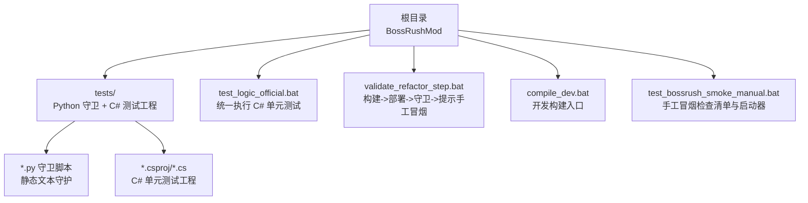
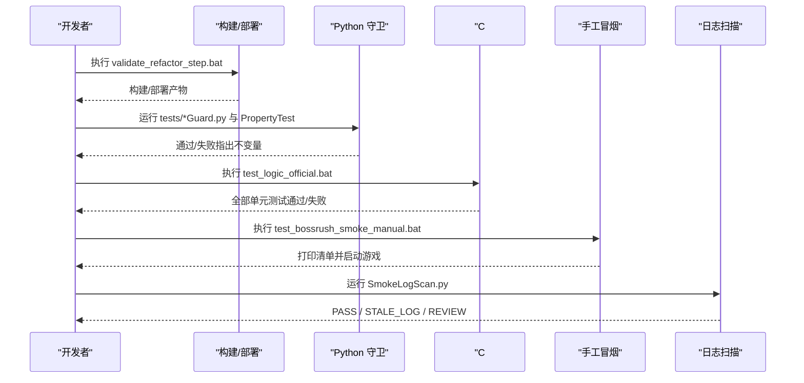
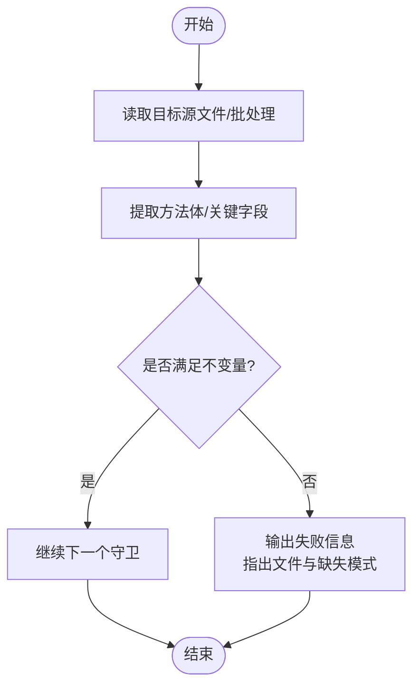
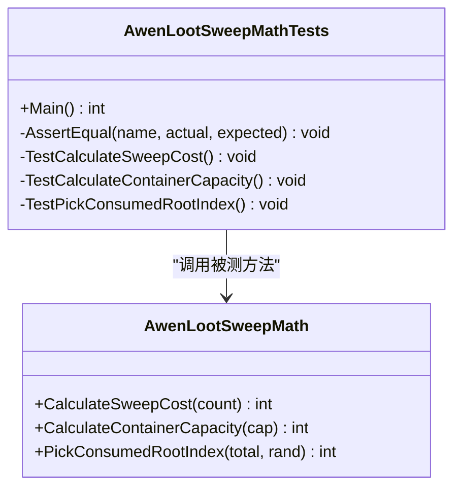
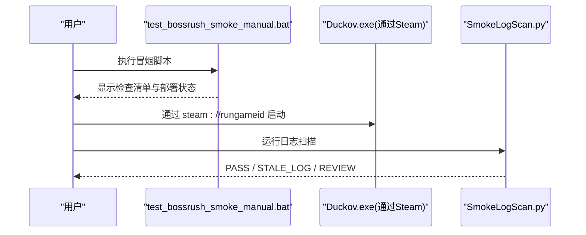
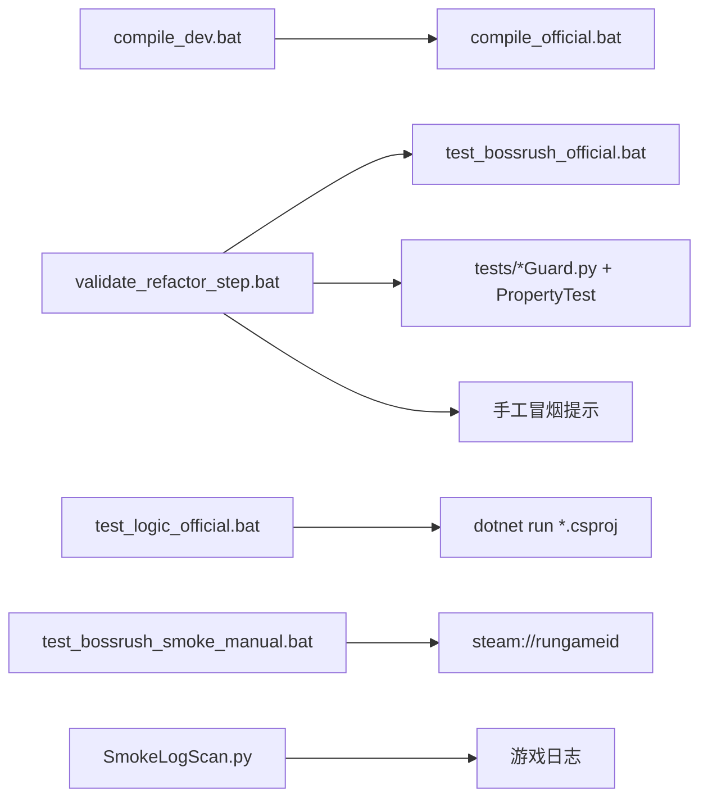

# 测试框架

<cite>
**本文引用的文件**
- [tests/README.md](file://tests/README.md)
- [tests/AGENTS.md](file://tests/AGENTS.md)
- [tests/ArchitectureStructureGuard.py](file://tests/ArchitectureStructureGuard.py)
- [tests/SmokeLogScan.py](file://tests/SmokeLogScan.py)
- [tests/ManualSmokeLaunchGuard.py](file://tests/ManualSmokeLaunchGuard.py)
- [test_logic_official.bat](file://test_logic_official.bat)
- [compile_dev.bat](file://compile_dev.bat)
- [validate_refactor_step.bat](file://validate_refactor_step.bat)
- [test_bossrush_smoke_manual.bat](file://test_bossrush_smoke_manual.bat)
- [tests/AwenLootSweepMathTests.csproj](file://tests/AwenLootSweepMathTests.csproj)
- [tests/AwenLootSweepMathTests.cs](file://tests/AwenLootSweepMathTests.cs)
</cite>

## 目录
1. [简介](#简介)
2. [项目结构](#项目结构)
3. [核心组件](#核心组件)
4. [架构总览](#架构总览)
5. [详细组件分析](#详细组件分析)
6. [依赖关系分析](#依赖关系分析)
7. [性能与稳定性考量](#性能与稳定性考量)
8. [故障排查指南](#故障排查指南)
9. [结论](#结论)
10. [附录](#附录)

## 简介
本项目的测试体系由两部分组成：
- C# 单元测试：以独立可执行程序形式运行，验证纯逻辑（如数值计算、序列化、策略判定等），不依赖游戏进程。
- Python 守卫脚本：以静态文本守护为主，通过扫描源码和批处理脚本中的关键模式，确保架构不变量、编译清单、运行时钩子顺序、清理流程等不被误改。

此外，项目提供手动冒烟测试入口与日志扫描工具，用于在真实游戏环境中进行快速回归验证。

## 项目结构
测试相关代码集中在 tests 目录，配合根目录的批处理脚本完成构建、部署、守卫执行与手工冒烟引导。

图表来源
- [test_logic_official.bat:1-86](file://test_logic_official.bat#L1-L86)
- [validate_refactor_step.bat:1-47](file://validate_refactor_step.bat#L1-L47)
- [compile_dev.bat:1-6](file://compile_dev.bat#L1-L6)
- [test_bossrush_smoke_manual.bat:1-153](file://test_bossrush_smoke_manual.bat#L1-L153)
- [tests/README.md:1-115](file://tests/README.md#L1-L115)

章节来源
- [tests/README.md:1-115](file://tests/README.md#L1-L115)
- [tests/AGENTS.md:1-28](file://tests/AGENTS.md#L1-L28)

## 核心组件
- Python 守卫脚本集合：覆盖架构结构、运行时钩子顺序、编译清单一致性、模式特定不变量、性能与热路径约束等。每个守卫聚焦一个明确不变量，失败时输出具体文件和缺失模式。
- C# 单元测试工程：以 .NET 控制台应用形式组织，每个测试工程引用被测源文件，断言纯逻辑正确性。
- 统一执行脚本：
  - test_logic_official.bat：按序运行所有 C# 单元测试工程。
  - validate_refactor_step.bat：串联“构建/部署 -> 守卫套件 -> 手工冒烟提示”。
  - compile_dev.bat：设置开发标志并调用官方构建脚本。
- 手工冒烟与日志扫描：
  - test_bossrush_smoke_manual.bat：打印检查清单、检测已部署 DLL、通过 Steam URL 启动游戏。
  - SmokeLogScan.py：扫描最新游戏日志，过滤 BossRush 相关错误块，辅助手工冒烟结果分析。

章节来源
- [test_logic_official.bat:1-86](file://test_logic_official.bat#L1-L86)
- [validate_refactor_step.bat:1-47](file://validate_refactor_step.bat#L1-L47)
- [compile_dev.bat:1-6](file://compile_dev.bat#L1-L6)
- [test_bossrush_smoke_manual.bat:1-153](file://test_bossrush_smoke_manual.bat#L1-L153)
- [tests/SmokeLogScan.py:1-142](file://tests/SmokeLogScan.py#L1-L142)
- [tests/README.md:1-115](file://tests/README.md#L1-L115)

## 架构总览
测试架构围绕“静态不变量守护 + 纯逻辑单元测试 + 手工冒烟”三层展开：
- 静态守护层：在提交前或 CI 中快速发现破坏架构契约的代码变更。
- 单元测试层：对无副作用的算法、序列化、策略等进行确定性验证。
- 手工冒烟层：在真实游戏环境中验证端到端流程，结合日志扫描定位问题。

图表来源
- [validate_refactor_step.bat:1-47](file://validate_refactor_step.bat#L1-L47)
- [test_logic_official.bat:1-86](file://test_logic_official.bat#L1-L86)
- [test_bossrush_smoke_manual.bat:1-153](file://test_bossrush_smoke_manual.bat#L1-L153)
- [tests/SmokeLogScan.py:1-142](file://tests/SmokeLogScan.py#L1-L142)

## 详细组件分析

### Python 守卫脚本体系
守卫脚本是本项目最重要的“防回归”机制，覆盖以下方面：
- 架构结构守卫：校验核心模块注册、运行时钩子封装、更新循环路由、场景切换清理顺序等。
- 编译清单守卫：确保官方编译列表包含必要源文件，且源文件存在。
- 模式不变量守卫：针对 ModeD/ModeE/ModeF/ZombieMode 等模式的运行时行为、资源边界、事务边界、UI 布局、性能层级等不变量进行静态断言。
- 热路径与性能守卫：禁止在热路径中进行昂贵操作（如频繁全局查找、重复归一化、不当分配）。
- 数据一致性与生命周期守卫：确保事件订阅/取消订阅、缓存清理、对象池状态重置等闭环。

图表来源
- [tests/ArchitectureStructureGuard.py:1-800](file://tests/ArchitectureStructureGuard.py#L1-L800)

章节来源
- [tests/ArchitectureStructureGuard.py:1-800](file://tests/ArchitectureStructureGuard.py#L1-L800)
- [tests/README.md:1-115](file://tests/README.md#L1-L115)

### C# 单元测试工程
单元测试以独立控制台程序组织，每个工程对应一组逻辑断言，避免依赖游戏进程。典型工程包括：
- 数值与数学：如拾取扫荡成本、容器容量、根索引选择等。
- 序列化与 JSON：如亲和值序列化、简单 JSON 解析。
- 调试与生命周期：如 F3 作弊菜单生命周期、胜利奖励阴影数学。
- 性能策略：如幽灵女巫性能策略判定。

图表来源
- [tests/AwenLootSweepMathTests.cs:1-43](file://tests/AwenLootSweepMathTests.cs#L1-L43)
- [tests/AwenLootSweepMathTests.csproj:1-16](file://tests/AwenLootSweepMathTests.csproj#L1-L16)

章节来源
- [tests/AwenLootSweepMathTests.cs:1-43](file://tests/AwenLootSweepMathTests.cs#L1-L43)
- [tests/AwenLootSweepMathTests.csproj:1-16](file://tests/AwenLootSweepMathTests.csproj#L1-L16)
- [test_logic_official.bat:1-86](file://test_logic_official.bat#L1-L86)

### 手工冒烟与日志扫描
手工冒烟脚本负责：
- 打印检查清单，覆盖主菜单加载、地图选择、标准 BossRush 流程、各模式路径、商店/仓库/UI、近战特效等。
- 检测已部署的 BossRush.dll，若不存在则提示先构建部署。
- 通过 Steam URL 启动游戏，避免直接启动导致 Steamworks 重启异常。
- 指导在冒烟后使用日志扫描工具分析最新日志。

日志扫描工具负责：
- 定位最新日志文件，判断是否晚于已部署 DLL。
- 扫描错误块并筛选包含 BossRush 的上下文。
- 输出 PASS/STALE_LOG/REVIEW 三种结果，便于自动化集成。

图表来源
- [test_bossrush_smoke_manual.bat:1-153](file://test_bossrush_smoke_manual.bat#L1-L153)
- [tests/SmokeLogScan.py:1-142](file://tests/SmokeLogScan.py#L1-L142)
- [tests/ManualSmokeLaunchGuard.py:1-45](file://tests/ManualSmokeLaunchGuard.py#L1-L45)

章节来源
- [test_bossrush_smoke_manual.bat:1-153](file://test_bossrush_smoke_manual.bat#L1-L153)
- [tests/SmokeLogScan.py:1-142](file://tests/SmokeLogScan.py#L1-L142)
- [tests/ManualSmokeLaunchGuard.py:1-45](file://tests/ManualSmokeLaunchGuard.py#L1-L45)

## 依赖关系分析
- 构建与部署：
  - compile_dev.bat 设置开发标志并调用官方构建脚本。
  - validate_refactor_step.bat 依赖 test_bossrush_official.bat（由官方构建流程提供）完成构建与部署。
- 守卫执行：
  - validate_refactor_step.bat 调用 Python 守卫与属性测试，要求系统安装 Python 3。
- 单元测试执行：
  - test_logic_official.bat 依赖 dotnet CLI，按序运行多个 .csproj 工程。
- 手工冒烟：
  - test_bossrush_smoke_manual.bat 依赖 Steam URL 启动游戏，并通过环境变量或默认路径定位游戏目录。
  - SmokeLogScan.py 依赖游戏日志与已部署 DLL 的时间戳比较。

图表来源
- [compile_dev.bat:1-6](file://compile_dev.bat#L1-L6)
- [validate_refactor_step.bat:1-47](file://validate_refactor_step.bat#L1-L47)
- [test_logic_official.bat:1-86](file://test_logic_official.bat#L1-L86)
- [test_bossrush_smoke_manual.bat:1-153](file://test_bossrush_smoke_manual.bat#L1-L153)
- [tests/SmokeLogScan.py:1-142](file://tests/SmokeLogScan.py#L1-L142)

章节来源
- [compile_dev.bat:1-6](file://compile_dev.bat#L1-L6)
- [validate_refactor_step.bat:1-47](file://validate_refactor_step.bat#L1-L47)
- [test_logic_official.bat:1-86](file://test_logic_official.bat#L1-L86)
- [test_bossrush_smoke_manual.bat:1-153](file://test_bossrush_smoke_manual.bat#L1-L153)
- [tests/SmokeLogScan.py:1-142](file://tests/SmokeLogScan.py#L1-L142)

## 性能与稳定性考量
- 守卫脚本优先保证架构不变量与热路径安全，避免引入性能退化。
- 单元测试聚焦无副作用逻辑，运行速度快、结果稳定。
- 手工冒烟覆盖关键用户体验路径，结合日志扫描快速定位异常。
- 建议在 CI 中集成守卫套件与单元测试；手工冒烟作为发布前必检步骤。

## 故障排查指南
- 未找到 dotnet：
  - 现象：test_logic_official.bat 报告无法运行逻辑测试。
  - 处理：安装 .NET 8 SDK 并确保 PATH 配置正确。
- 未找到 Python：
  - 现象：validate_refactor_step.bat 报告未找到 py -3。
  - 处理：安装 Python 3 并将 python 加入 PATH。
- 手工冒烟启动失败：
  - 现象：直接启动 Duckov.exe 触发 Steamworks 重启或致命错误。
  - 处理：使用 steam://rungameid 启动，确保 STEAM_APP_ID=3167020。
- 日志扫描返回 STALE_LOG：
  - 现象：最新日志早于已部署 DLL。
  - 处理：重新运行冒烟流程，等待新日志生成后再扫描。
- 守卫失败：
  - 现象：输出具体守卫名称与缺失模式。
  - 处理：根据失败信息修改源码或同步更新守卫白名单（仅解释既有债务）。

章节来源
- [test_logic_official.bat:1-86](file://test_logic_official.bat#L1-L86)
- [validate_refactor_step.bat:1-47](file://validate_refactor_step.bat#L1-L47)
- [test_bossrush_smoke_manual.bat:1-153](file://test_bossrush_smoke_manual.bat#L1-L153)
- [tests/SmokeLogScan.py:1-142](file://tests/SmokeLogScan.py#L1-L142)
- [tests/ManualSmokeLaunchGuard.py:1-45](file://tests/ManualSmokeLaunchGuard.py#L1-L45)
- [tests/README.md:1-115](file://tests/README.md#L1-L115)

## 结论
本项目采用“静态守卫 + 单元测试 + 手工冒烟”的分层测试策略，既保证了架构不变量的长期稳定，又覆盖了关键业务路径的回归验证。通过统一的批处理脚本与清晰的职责划分，开发者可以快速定位问题并进行修复。建议将守卫与单元测试纳入持续集成，手工冒烟作为发布前强制环节，以确保质量基线。

## 附录
- 编写自定义守卫脚本的最佳实践：
  - 聚焦单一不变量，失败信息明确指出文件与缺失模式。
  - 避免引入游戏进程依赖，保持可在普通 Python 环境运行。
  - 新增代码默认不进白名单，白名单仅用于解释既有债务。
- 编写 C# 单元测试的最佳实践：
  - 使用独立控制台工程，避免依赖 Unity/游戏库。
  - 断言纯逻辑函数，输入输出明确，易于回归。
  - 通过统一脚本集中执行，便于 CI 集成。
- 持续集成建议：
  - 在每次提交时运行守卫套件与单元测试。
  - 在发布分支合并前执行手工冒烟与日志扫描。
  - 记录冒烟结果与日志扫描输出，形成可追溯的质量证据。