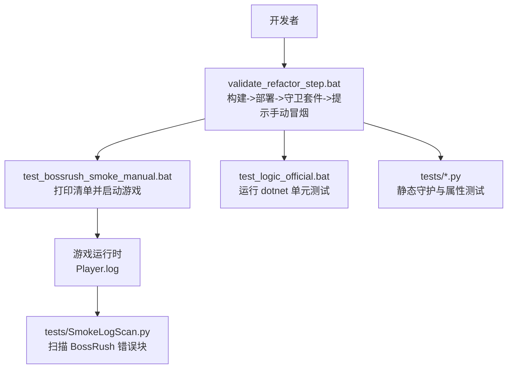
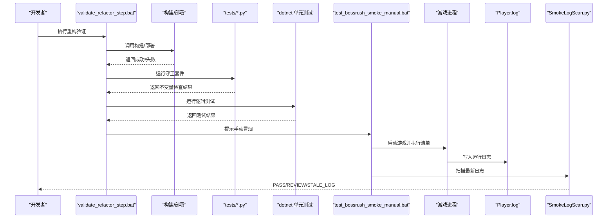
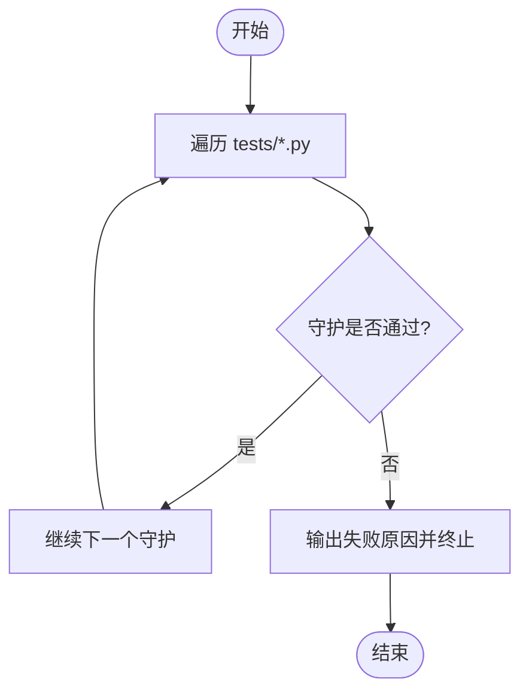
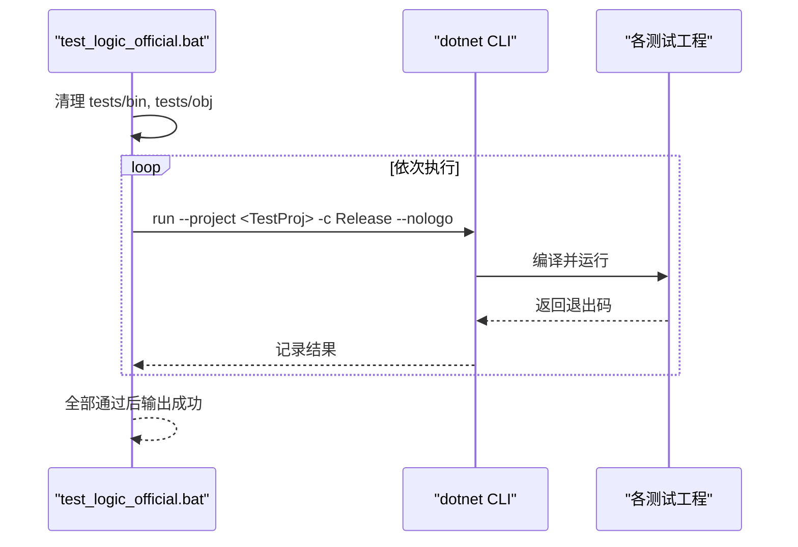
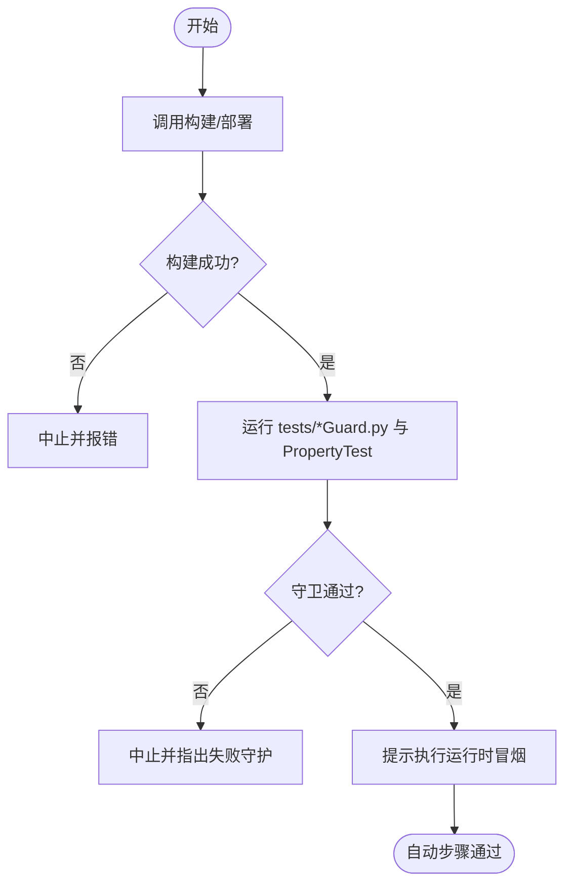
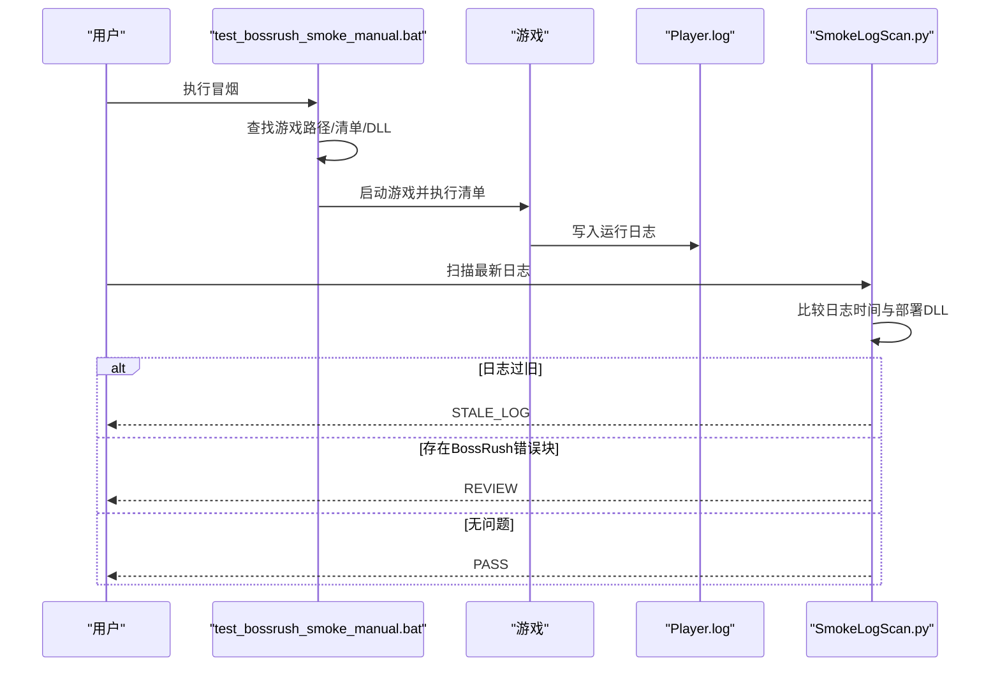
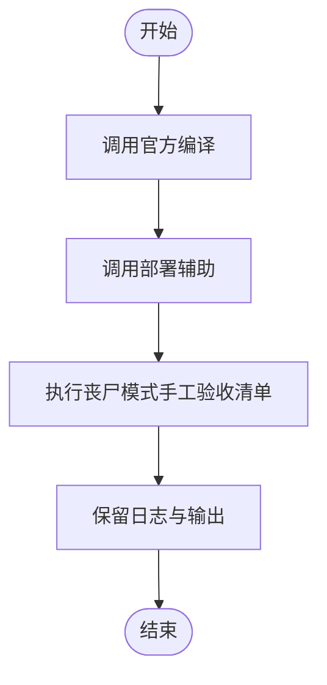
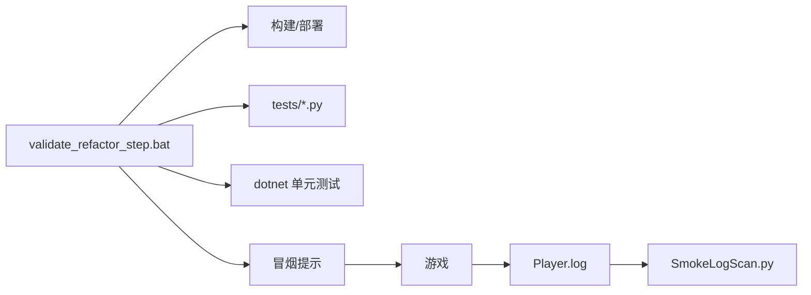

# 测试自动化

<cite>
**本文引用的文件**
- [tests/README.md](file://tests/README.md)
- [tests/AGENTS.md](file://tests/AGENTS.md)
- [test_bossrush_smoke_manual.bat](file://test_bossrush_smoke_manual.bat)
- [test_logic_official.bat](file://test_logic_official.bat)
- [test_zombiemode_goal_windows.bat](file://test_zombiemode_goal_windows.bat)
- [validate_refactor_step.bat](file://validate_refactor_step.bat)
- [compile_dev.bat](file://compile_dev.bat)
- [tests/SmokeLogScan.py](file://tests/SmokeLogScan.py)
- [.github/workflows/deploy.yml](file://.github/workflows/deploy.yml)
</cite>

## 目录
1. [简介](#简介)
2. [项目结构](#项目结构)
3. [核心组件](#核心组件)
4. [架构总览](#架构总览)
5. [详细组件分析](#详细组件分析)
6. [依赖关系分析](#依赖关系分析)
7. [性能与稳定性考量](#性能与稳定性考量)
8. [故障排查指南](#故障排查指南)
9. [结论](#结论)
10. [附录：扩展指南](#附录扩展指南)

## 简介
本项目的测试自动化围绕“静态守护 + 逻辑单元测试 + 构建部署验证 + 运行时冒烟”四层展开，目标是尽早发现回归、保证编译与部署产物一致，并在真实游戏环境中完成关键路径的冒烟验证。整体流程强调：
- 静态守护（Python）：以 grep 风格断言代码不变量，快速反馈破坏点。
- 逻辑测试（dotnet）：对纯函数和策略进行无依赖单元测试。
- 构建与部署：通过批处理脚本统一执行编译、部署与前置检查。
- 运行时冒烟：在真实游戏中按清单逐项验证，并结合日志扫描工具输出可判定的结果。

## 项目结构
测试相关资产主要分布在以下位置：
- tests：静态守护脚本与 dotnet 单元测试工程。
- 根目录批处理：构建、部署、冒烟、目标模式验收等入口。
- .github/workflows：当前仓库包含一个用于 Wiki 站点发布的 CI 工作流；测试流水线可通过本地脚本或后续扩展接入 CI。

图表来源
- [validate_refactor_step.bat:1-48](file://validate_refactor_step.bat#L1-L48)
- [test_bossrush_smoke_manual.bat:1-153](file://test_bossrush_smoke_manual.bat#L1-L153)
- [test_logic_official.bat:1-86](file://test_logic_official.bat#L1-L86)
- [tests/SmokeLogScan.py:1-142](file://tests/SmokeLogScan.py#L1-L142)

章节来源
- [tests/README.md:1-115](file://tests/README.md#L1-L115)
- [tests/AGENTS.md:1-28](file://tests/AGENTS.md#L1-L28)

## 核心组件
- 静态守护套件（Python）
  - 职责：针对易回归点做文本级不变量检查，失败即阻断。
  - 覆盖范围：丧尸模式、各模式、共享层、地图选择注入、性能档、编译列表等。
  - 运行方式：单个 Python 文件或批量遍历 tests/*.py。
- 逻辑单元测试（dotnet）
  - 职责：对概率模型、JSON 序列化、性能策略、数学计算等进行无依赖测试。
  - 运行方式：通过 test_logic_official.bat 顺序执行多个 csproj。
- 构建与部署验证
  - 职责：统一设置开发/生产构建开关、调用官方编译与部署脚本、清理中间产物。
  - 入口：validate_refactor_step.bat、compile_dev.bat。
- 运行时冒烟与日志扫描
  - 职责：在游戏内按清单逐项验证关键路径，并扫描最新日志中的 BossRush 相关错误块。
  - 入口：test_bossrush_smoke_manual.bat、tests/SmokeLogScan.py。
- 目标模式验收
  - 职责：针对特定模式（如丧尸模式）提供编译->部署->手工验收的串联入口。
  - 入口：test_zombiemode_goal_windows.bat。

章节来源
- [tests/README.md:1-115](file://tests/README.md#L1-L115)
- [tests/AGENTS.md:1-28](file://tests/AGENTS.md#L1-L28)
- [test_logic_official.bat:1-86](file://test_logic_official.bat#L1-L86)
- [validate_refactor_step.bat:1-48](file://validate_refactor_step.bat#L1-L48)
- [compile_dev.bat:1-6](file://compile_dev.bat#L1-L6)
- [test_bossrush_smoke_manual.bat:1-153](file://test_bossrush_smoke_manual.bat#L1-L153)
- [tests/SmokeLogScan.py:1-142](file://tests/SmokeLogScan.py#L1-L142)
- [test_zombiemode_goal_windows.bat:1-40](file://test_zombiemode_goal_windows.bat#L1-L40)

## 架构总览
测试流水线由“静态守护 + 逻辑测试 + 构建部署 + 运行时冒烟”组成，形成从代码到运行的闭环质量保障。

图表来源
- [validate_refactor_step.bat:1-48](file://validate_refactor_step.bat#L1-L48)
- [test_bossrush_smoke_manual.bat:1-153](file://test_bossrush_smoke_manual.bat#L1-L153)
- [tests/SmokeLogScan.py:1-142](file://tests/SmokeLogScan.py#L1-L142)

## 详细组件分析

### 静态守护套件（Python）
- 设计要点
  - 每个守护聚焦一条具体不变量，失败时明确指出破坏点。
  - 支持单测式运行与全量运行，便于局部调试与 CI 集成。
  - 白名单仅解释既有债务，新增代码默认不进入白名单。
- 覆盖范围
  - 丧尸模式：编译列表、本地化键注入、刷怪点隔离、状态机结构、事务边界、UI 布局、奖励选项上限、净化点支付、时间轴、Windows 验收脚本等。
  - 其他模式与共享层：ModeD/E/F/G、地图选择注入、敌人回收、性能档、事件订阅生命周期等。
- 运行方式
  - 单个：python tests\SomeGuard.py
  - 全量：for %f in (tests\*.py) do python %f
  - 退出码：0 表示通过，非 0 表示失败。

图表来源
- [tests/README.md:103-115](file://tests/README.md#L103-L115)
- [tests/AGENTS.md:13-28](file://tests/AGENTS.md#L13-L28)

章节来源
- [tests/README.md:1-115](file://tests/README.md#L1-L115)
- [tests/AGENTS.md:1-28](file://tests/AGENTS.md#L1-L28)

### 逻辑单元测试（dotnet）
- 设计要点
  - 使用 net8.0 控制台应用组织测试工程，避免游戏依赖。
  - 通过 test_logic_official.bat 顺序执行多个独立测试集，任一失败立即中止。
- 覆盖范围
  - 概率模型、JSON 序列化、性能策略、调试作弊数学、胜利奖励阴影数学、拾取扫掠数学等。
- 运行方式
  - 清理 bin/obj 后依次运行各 csproj，输出标准化进度信息。

图表来源
- [test_logic_official.bat:1-86](file://test_logic_official.bat#L1-L86)

章节来源
- [test_logic_official.bat:1-86](file://test_logic_official.bat#L1-L86)

### 构建与部署验证
- 设计要点
  - validate_refactor_step.bat 将“构建/部署 -> 守卫套件 -> 手动冒烟提示”串联为一步。
  - compile_dev.bat 设置开发构建开关，复用官方编译流程。
- 运行方式
  - 直接执行 validate_refactor_step.bat，或在 CI 中调用。
  - 若守卫套件或构建失败，立即中止并输出失败原因。

图表来源
- [validate_refactor_step.bat:1-48](file://validate_refactor_step.bat#L1-L48)
- [compile_dev.bat:1-6](file://compile_dev.bat#L1-L6)

章节来源
- [validate_refactor_step.bat:1-48](file://validate_refactor_step.bat#L1-L48)
- [compile_dev.bat:1-6](file://compile_dev.bat#L1-L6)

### 运行时冒烟与日志扫描
- 设计要点
  - 冒烟脚本负责：定位游戏安装路径、准备清单、检测已部署 DLL、打印清单、启动游戏。
  - 日志扫描脚本负责：定位最新日志、校验日志时间戳与部署 DLL、提取 BossRush 相关错误块、给出 PASS/REVIEW/STALE_LOG。
- 运行方式
  - 先执行冒烟脚本完成游戏内清单验证。
  - 再运行 SmokeLogScan.py 扫描最新日志，根据返回码判断是否需要人工复核。

图表来源
- [test_bossrush_smoke_manual.bat:1-153](file://test_bossrush_smoke_manual.bat#L1-L153)
- [tests/SmokeLogScan.py:1-142](file://tests/SmokeLogScan.py#L1-L142)

章节来源
- [test_bossrush_smoke_manual.bat:1-153](file://test_bossrush_smoke_manual.bat#L1-L153)
- [tests/SmokeLogScan.py:1-142](file://tests/SmokeLogScan.py#L1-L142)

### 目标模式验收（丧尸模式）
- 设计要点
  - 串联官方编译、部署与手工验收清单，确保关键体验路径可用。
  - 明确验收项：现金与净化点换算、开局装备、信标触发波次、清理与结算、UI 布局等。
- 运行方式
  - 执行 test_zombiemode_goal_windows.bat，按提示完成手工验收并保留日志。

图表来源
- [test_zombiemode_goal_windows.bat:1-40](file://test_zombiemode_goal_windows.bat#L1-L40)

章节来源
- [test_zombiemode_goal_windows.bat:1-40](file://test_zombiemode_goal_windows.bat#L1-L40)

## 依赖关系分析
- 脚本间依赖
  - validate_refactor_step.bat 依赖构建/部署脚本、Python 环境、以及冒烟提示。
  - test_bossrush_smoke_manual.bat 依赖游戏安装路径、Steam URL、已部署 DLL。
  - tests/SmokeLogScan.py 依赖游戏日志与已部署 DLL 的时间戳。
- 测试工程依赖
  - 各 dotnet 测试工程引用对应生产代码片段（通过 Link），保证测试与实现同步演进。
- CI 现状
  - 当前 .github/workflows/deploy.yml 用于 Wiki 站点发布；测试流水线可通过本地脚本或后续扩展接入 CI。

图表来源
- [validate_refactor_step.bat:1-48](file://validate_refactor_step.bat#L1-L48)
- [test_bossrush_smoke_manual.bat:1-153](file://test_bossrush_smoke_manual.bat#L1-L153)
- [tests/SmokeLogScan.py:1-142](file://tests/SmokeLogScan.py#L1-L142)

章节来源
- [validate_refactor_step.bat:1-48](file://validate_refactor_step.bat#L1-L48)
- [test_bossrush_smoke_manual.bat:1-153](file://test_bossrush_smoke_manual.bat#L1-L153)
- [tests/SmokeLogScan.py:1-142](file://tests/SmokeLogScan.py#L1-L142)
- [.github/workflows/deploy.yml:1-54](file://.github/workflows/deploy.yml#L1-L54)

## 性能与稳定性考量
- 静态守护
  - 基于文本匹配，开销极低，适合频繁运行。
  - 建议保持守护粒度小且专注，避免过度耦合导致误报。
- 逻辑测试
  - 无外部依赖，启动快，适合本地快速迭代与 CI 预检。
  - 建议按功能域拆分工程，便于并行执行与定位失败。
- 冒烟与日志扫描
  - 冒烟需人工参与，但能覆盖真实运行时路径。
  - 日志扫描通过时间戳比对避免读取旧日志，减少误判。

[本节为通用指导，无需列出具体文件来源]

## 故障排查指南
- 常见错误与处理
  - 未找到 dotnet：检查系统 PATH 或安装 .NET 8 SDK。
  - 未找到 Python：确保 py -3 可用或配置 Python 环境。
  - 未找到游戏路径：设置环境变量或修正 GAME_PATH；确保存在 Duckov.exe 与 Managed 目录。
  - 部署 DLL 缺失：先执行构建/部署脚本，再运行冒烟。
  - 日志过旧（STALE_LOG）：重新运行游戏生成新日志后再扫描。
  - 守护失败：根据输出定位破坏的不变量，修复代码或更新守护。
- 定位方法
  - 使用 validate_refactor_step.bat 逐步确认构建、守卫、单元测试阶段。
  - 使用 test_bossrush_smoke_manual.bat 打印清单并启动游戏，逐项核对。
  - 使用 tests/SmokeLogScan.py 获取 BossRush 相关错误块上下文，便于快速定位堆栈。

章节来源
- [test_logic_official.bat:1-86](file://test_logic_official.bat#L1-L86)
- [validate_refactor_step.bat:1-48](file://validate_refactor_step.bat#L1-L48)
- [test_bossrush_smoke_manual.bat:1-153](file://test_bossrush_smoke_manual.bat#L1-L153)
- [tests/SmokeLogScan.py:1-142](file://tests/SmokeLogScan.py#L1-L142)

## 结论
本项目采用“静态守护 + 逻辑测试 + 构建部署 + 运行时冒烟”的分层测试策略，既能在代码层面快速发现回归，又能在真实环境中验证关键路径。通过统一的批处理入口与日志扫描工具，开发者可以高效地完成日常验证与问题定位。建议在后续工作中将测试流水线接入 CI，以实现更严格的持续集成与质量门禁。

[本节为总结性内容，无需列出具体文件来源]

## 附录：扩展指南
- 添加新的静态守护
  - 在 tests/ 下新增 *.py，聚焦单一不变量，失败时输出清晰的原因与文件位置。
  - 遵循 tests/AGENTS.md 的规则，不要新建子目录，保持扁平结构。
  - 运行单个守护或全量守护进行验证。
- 添加新的逻辑测试
  - 新增 dotnet 测试工程（csproj），引用需要测试的生产代码片段。
  - 在 test_logic_official.bat 中添加执行步骤，确保顺序执行与失败中断。
- 配置测试环境
  - 确保安装 dotnet 8 与 Python 3，并可在命令行中调用。
  - 配置游戏安装路径（GAME_PATH 或环境变量），确保冒烟脚本能定位到游戏与日志。
- 集成到 CI/CD
  - 可参考现有 .github/workflows/deploy.yml 的结构，新增工作流任务：
    - 安装依赖（dotnet、Python）。
    - 执行 validate_refactor_step.bat。
    - 上传构建产物与测试报告。
  - 建议将守护套件与单元测试作为质量门禁，冒烟可作为可选的人工环节或结合云真机。

章节来源
- [tests/AGENTS.md:1-28](file://tests/AGENTS.md#L1-L28)
- [test_logic_official.bat:1-86](file://test_logic_official.bat#L1-L86)
- [test_bossrush_smoke_manual.bat:1-153](file://test_bossrush_smoke_manual.bat#L1-L153)
- [.github/workflows/deploy.yml:1-54](file://.github/workflows/deploy.yml#L1-L54)