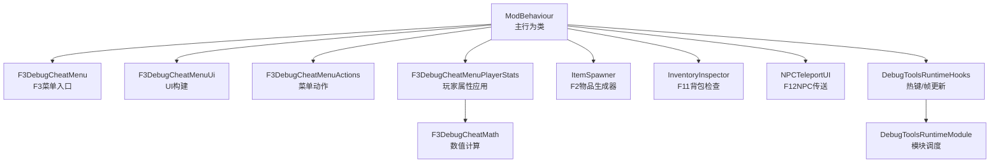
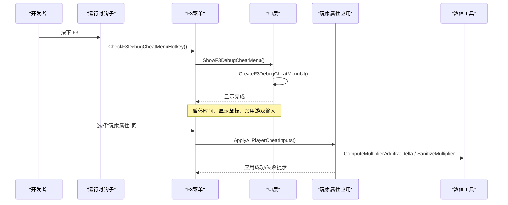
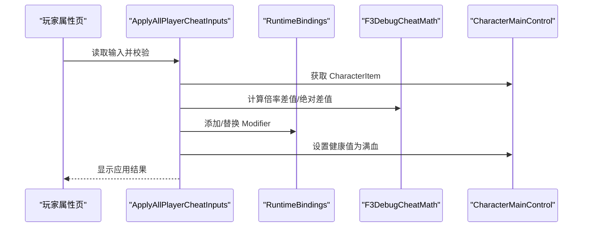
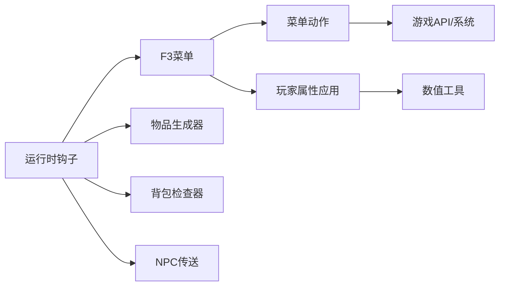

# 调试工具

> 天空岛当前基线为正式独立 `SkyIslandRaid` 出击地图，使用自己的官方关卡服务、持久故事、居民与进度门。本文较早的 F3 / 保留基地 / 全开放 / 仅会话记录段落均为原型历史；当前实现见天空岛剧情专题及本文末尾独立出击记录。2026-09-08 按用户要求不执行游戏实测。


2026-09-02 第四轮输出 69 PASS / 2 FAIL，返基地、终章死亡、最终清场/泄漏/存档回读通过。
`F3GameplayValidationDeepFlows.cs` 的标准胜利用例现在等生产 currentBoss 登记完成，定点 Hurt
确认死亡后才等待胜利奖励箱；全场发现角色不代表创建完成。Mode F 撤离必须比较真实成功结算计数，
同时等待基地完整就绪，不能在退出 Reset 后读取瞬时标志。标准奖励箱与 Mode F 撤离均已实机通过，
Mode D 活跃首波、BGM 加载/播放/租约也通过。
Mode D 多波测试只快照当前登记角色，每次真实击杀后让出一帧，避免已安装的击杀提示
在同帧第二次死亡中解析尚未初始化的经验文本；异常记完整栈并 FAIL。
波次编号增加后继续等待新波角色实际生成，避免全场清理误删下一波。
第四轮 D 多波已通过（wave=1->2、playable=3/3），H 伤害异常也未再出现。
H 首次认证/缓存仍受口令矩阵无人写入阻断，现补生产 adapter 跨帧采样、合法逐效果缓存恢复与具体门槛日志，
新 H 流程仍待游戏内复测，不能把没有逐 key 拒绝等同于整体开局通过。

<cite>
**本文引用的文件**
- [F3DebugCheatMenu.cs](file://DebugAndTools/F3DebugCheatMenu.cs)
- [F3DebugCheatMenuActions.cs](file://DebugAndTools/F3DebugCheatMenuActions.cs)
- [F3DebugCheatMenuPlayerStats.cs](file://DebugAndTools/F3DebugCheatMenuPlayerStats.cs)
- [F3DebugCheatMenuUi.cs](file://DebugAndTools/F3DebugCheatMenuUi.cs)
- [F3GameplayValidationRunner.cs](file://DebugAndTools/F3GameplayValidationRunner.cs)
- [F3GameplayValidationRandomEvents.cs](file://DebugAndTools/F3GameplayValidationRandomEvents.cs)
- [F3GameplayValidationPersistence.cs](file://DebugAndTools/F3GameplayValidationPersistence.cs)
- [ItemSpawner.cs](file://DebugAndTools/ItemSpawner.cs)
- [InventoryInspector.cs](file://DebugAndTools/InventoryInspector.cs)
- [NPCTeleportUI.cs](file://DebugAndTools/NPCTeleportUI.cs)
- [DebugToolsRuntimeHooks.cs](file://DebugAndTools/DebugToolsRuntimeHooks.cs)
- [DebugToolsRuntimeModule.cs](file://DebugAndTools/DebugToolsRuntimeModule.cs)
- [F3DebugCheatMath.cs](file://Utilities/F3DebugCheatMath.cs)
</cite>

## 目录
1. [简介](#简介)
2. [项目结构](#项目结构)
3. [核心组件](#核心组件)
4. [架构总览](#架构总览)
5. [详细组件分析](#详细组件分析)
6. [依赖关系分析](#依赖关系分析)
7. [性能考虑](#性能考虑)
8. [故障排查指南](#故障排查指南)
9. [结论](#结论)
10. [附录：热键与操作速查](#附录热键与操作速查)

## 简介
本模块提供一套面向开发/测试的调试工具集，核心为 F3 调试菜单系统，覆盖传送、玩家属性调参、资源与物品发放、战斗流程控制、NPC/剧情测试、场景调试等能力。同时包含独立的物品生成器（F2）和背包检查器（F11），以及 NPC 传送面板（F12）。所有功能均在开发模式下受控启用，具备完善的输入暂停、状态恢复与错误处理机制，便于快速定位问题、验证玩法与内容。

## 项目结构
调试工具集中在 DebugAndTools 目录下，按职责拆分：
- F3 菜单体系：入口、UI、动作、玩家属性应用、数学工具
- 独立工具：物品生成器、背包检查器、NPC 传送 UI
- 运行时钩子：统一的热键检测、帧更新与生命周期管理



图表来源
- [F3DebugCheatMenu.cs:16-122](file://DebugAndTools/F3DebugCheatMenu.cs#L16-L122)
- [F3DebugCheatMenuUi.cs:22-298](file://DebugAndTools/F3DebugCheatMenuUi.cs#L22-L298)
- [F3DebugCheatMenuActions.cs:24-769](file://DebugAndTools/F3DebugCheatMenuActions.cs#L24-L769)
- [F3DebugCheatMenuPlayerStats.cs:22-644](file://DebugAndTools/F3DebugCheatMenuPlayerStats.cs#L22-L644)
- [ItemSpawner.cs:21-211](file://DebugAndTools/ItemSpawner.cs#L21-L211)
- [InventoryInspector.cs:9-548](file://DebugAndTools/InventoryInspector.cs#L9-L548)
- [NPCTeleportUI.cs:18-466](file://DebugAndTools/NPCTeleportUI.cs#L18-L466)
- [DebugToolsRuntimeHooks.cs:10-37](file://DebugAndTools/DebugToolsRuntimeHooks.cs#L10-L37)
- [DebugToolsRuntimeModule.cs:1-43](file://DebugAndTools/DebugToolsRuntimeModule.cs#L1-L43)
- [F3DebugCheatMath.cs:1-21](file://Utilities/F3DebugCheatMath.cs#L1-L21)

章节来源
- [F3DebugCheatMenu.cs:16-122](file://DebugAndTools/F3DebugCheatMenu.cs#L16-L122)
- [DebugToolsRuntimeHooks.cs:10-37](file://DebugAndTools/DebugToolsRuntimeHooks.cs#L10-L37)
- [DebugToolsRuntimeModule.cs:1-43](file://DebugAndTools/DebugToolsRuntimeModule.cs#L1-L43)

## 核心组件
- F3 调试菜单：通过 F3 打开，提供多页导航（传送、玩家属性、资源与物品、战斗流程、NPC/剧情、场景调试），支持实时摘要与状态提示。
- 玩家属性调参：对最大生命、枪械伤害、近战伤害进行倍率调整；对头部/身体护甲进行绝对值覆盖；自动清理并安全应用修改。
- 物品生成器（F2）：简单窗口输入物品 ID 获取物品，适合快速验证道具。
- 背包检查器（F11）：读取当前角色背包，输出详细信息到日志或界面，辅助定位掉落、标签、口径等问题。
- NPC 传送面板（F12）：列出当前地图中的已知 NPC，点击传送到其附近位置。
- 运行时钩子：集中处理热键、帧更新、LateUpdate 状态维持与销毁清理。

章节来源
- [F3DebugCheatMenu.cs:107-122](file://DebugAndTools/F3DebugCheatMenu.cs#L107-L122)
- [F3DebugCheatMenuUi.cs:275-298](file://DebugAndTools/F3DebugCheatMenuUi.cs#L275-L298)
- [F3DebugCheatMenuPlayerStats.cs:242-347](file://DebugAndTools/F3DebugCheatMenuPlayerStats.cs#L242-L347)
- [ItemSpawner.cs:40-55](file://DebugAndTools/ItemSpawner.cs#L40-L55)
- [InventoryInspector.cs:49-74](file://DebugAndTools/InventoryInspector.cs#L49-L74)
- [NPCTeleportUI.cs:45-96](file://DebugAndTools/NPCTeleportUI.cs#L45-L96)

## F3 完整玩法验收

Dev 版 F3 新增“验收测试”页。先在基地把当前槽标记为专用测试档，再点“完整玩法验收”；普通档、
活动模式、存档忙、模态租约或关键资源未就绪会给出具体拒绝原因。测试逻辑由
`F3GameplayValidationRunner` 的 `DontDestroyOnLoad` 串行状态机承载，F3 关闭和自动切图不会中断。

**七阶段**覆盖数据/基线、基地玩法、后山与经济、标准与 D/E/F/G/H/Zombie、模式深度流程、
征程终章与 BGM owner、最终清场/泄漏差值/回读。套件超时上限 2700 秒（45 分钟）。

**按用例隔离（一次性测完）**：单个用例失败不再中断整套。每个模式用例走 `RunIsolatedCase`
包壳——协程内异常只记它自己的 FAIL，随后强制清场并继续下一个。清场失败也不再立即停：
先做一次强化清场（`ForceReclaimArena`：安全清理 + `ValidationForceClearArenaEnemies` + 等帧）
并复检，只有**连续两次**不可恢复才真中止（脏状态会污染后续结论）。进不了竞技场时
场内用例批量记 `SKIP` 而不是留空白。

**过图就绪与场地恢复（2026-09-02）**：`F3GameplayValidationScenes` 统一切图与诊断。
返基地调用官方 `LoadBaseScene`，不能把 `Base_SceneV2` 子场景当作完整基地入口。
加载任务结束后还必须核对目标 active scene、`IsSceneLoading=false`、`LevelManager.AfterInit`、
主玩家活动且存活、有 CharacterItem、GameCamera 启用，才记 PASS；终态不再跳过初始化。
失败报告附这些状态，最终基地未就绪时跳过性能、清场、泄漏和存档回读，仍汇总失败。
取消/套件超时后的返基地仍有独立的 90 秒等待预算；已有加载未结束时不叠加新加载。
每个场内用例之前重新确认竞技场。Mode H 认证拒绝返基地、Mode F 撤离后，先恢复竞技场再继续；
恢复失败把依赖用例记 SKIP，不在基地继续刷怪或把它们误报为模式故障。Mode H 状态已清空时立即
记录失败和 `exit_reason`，不再空等 180 秒。Windows 编译与相关 guard 已通过，实机复测未完成。

终章伤害使用 `new DamageInfo(player)`，显式调用官方构造器初始化 `elementFactors` 等字段；
`DamageInfo` 是 struct，无参 new 不会调用其带可选参数的构造器，会导致 `Health.Hurt` 空引用。

报告状态：`PASS` / `FAIL` / `INCOMPLETE`（自动项未全部通过）/ `REPORT_ERROR`（报告 I/O 失败）/
`CANCELLED`（玩家点取消）/ `TIMEOUT`（套件超时）/ `ABORTED_DIRTY`（连续脏状态）/
`ABORTED_SLOT_CHANGED`（换槽或同槽重载）/ `ABORTED_HOST_DESTROYED`（宿主销毁/停用）。取消与超时仍尝试最终返基地；
换槽后不在新槽执行旧模式的资产清理。`SUMMARY` 附 `failed_ids=` 与
`skipped_ids=`，不用翻全文找红项。报告位于
`Application.persistentDataPath/BossRushTestReports/BossRushValidation_<runId>.log`，崩溃时再附
`Player.log`。性能门槛为预热后 p95 不超过 `max(50ms, baseline×1.75)`，超过 200ms 的单帧记录阶段。

**泄漏差值**：`FINAL_LEAK_DELTA` 取套件开始时的一组静态计数（模态租约、BGM owner、
Mode H 参赛者/诊断对象、词缀激活条数与熔石钩子、遗种巢掉落钩子/闲逛体/倒地数、图鉴战斗钩子）
作为基线，跑完全部模式后核对是否回落。这类泄漏不会让清场断言变红，但会在连打几局后
表现为帧率下降或事件重复触发。`SamplePerformance` 的 p95 超过上述阈值会判 FAIL；单帧峰值超过 200ms
另报 `PERFORMANCE_WARNING`。性能异常需结合后台负载与日志复核，不能仅凭单次采样判断产品原因。

**深度流程已全自动化**（2026-09-01，owner 拍板）：Mode E 收尾、Mode F 赏金链与撤离、标准模式
胜利奖励结算此前因产品代码全 private 而记 `SKIP`，需真人走撤离点/打完整波。现由产品侧 5 个
`internal` 验收入口驱动，深度阶段 6 条用例全自动：`MODE_F_BOUNTY`、`MODE_F_EXTRACTION`、
`MODE_E_EXTRACTION`、`STANDARD_VICTORY_REWARD`、`SCENE_CLICK_GATE`、`MODE_D_MULTI_WAVE`。

入口设计原则是**只补前提、不替玩法链**：推进 `PhaseElapsed` 让真实阶段机自己切、触发官方
`CountDownArea.onCountDownSucceed`、把 Boss 池收窄到 1 个再走 `currentEnemyIndex >= presetCount`
那条真实结算条件。断言一律取产品状态（印记数、撤离结算标记、奖励箱控制器、阵营复位），
所以是真测而不是凑绿。全部入口 `internal` + `DevModeEnabled` 门控，正式玩家路径不可达。
Mode E 无自建撤离点（全模块无 `CountDownArea` 引用），其"撤离"实为 `EndModeE(false)` 收尾链，
metrics 标 `semantics=end_settlement`，不冒充撤离点验证。

**过场点击门**：部分图 `clickToContinue=true`，需玩家点一下鼠标才继续，卡住时旧套件报告仍是绿的。
现 `LoadScene` 协程在该模式下自动喂官方 `SceneLoader.NotifyPointerClick`，喂点次数记入报告供断言。
`SCENE_CLICK_GATE` 是唯一走 `clickToContinue=true` 的用例（与丧尸模式选图同路径），其余仍传 `false`；
判定只认「进得去」：现有反编译仅保留 LoadScene 转发壳，无法确认官方 `SceneLoader.clicked`
是否每次加载重置。该用例排在第 5 阶段，前面已切过多次图，门可能早被满足、一次都不用喂。
故喂点次数为 0 记 **WARN**（这轮没压到点击门、
没有回归价值）而非 FAIL，不冤枉健康构建；要单独验证点击门，把该用例挪到套件最前面再跑。

随机事件验收不是“调用入口没抛异常”检查：八种事件各自输出 `RANDOM_EVENT_*`，异步等待空投落地、
Boss/商人实体与库存、声源/烟花序列、现金堆和巡游鸭全部收敛，30 秒未完成即失败。清场只统计
runtime team 明确敌对玩家的角色，报告会附对象名、team 与 preset key；友军和遗种随从不会误报。
套件运行期间暂停向官方普通消息/大横幅队列写入，finally 恢复，避免测试播报在结束后排队弹出。
- [DebugToolsRuntimeHooks.cs:23-37](file://DebugAndTools/DebugToolsRuntimeHooks.cs#L23-L37)

## 架构总览

2026-09-07（COMPAT）：执行层改由 `F3GameplayValidationExecution` + `ValidationCoroutineStack` 持有完整协程栈。
嵌套异常、取消和超时均从叶到根释放，父 finally 必须先于强制清场；全套收尾采用独立相位（最多 270 秒，单次加载 90 秒）。
运行期固定宿主/槽位并订阅错误日志，主玩家临时无敌/回血，完成后还原。新增 G 九波与 H 六场真实流程；
后者点击既有 Button 回调并检查六条唯一战报/奖励归档、2/4 场转会、名人堂及完整返基地，固定零押品。
正式生成对象只经 Health.Hurt 结算，不写模式状态冒充通关；这些辅助流程不验证战斗平衡或按钮实际命中区域。
单日志增加启动 Harmony 快照、运行期异常和文字错误诊断，F3 可直接打开报告目录。
`tools/gameplay_coverage.py --log <日志> --analyze --expected-mvid <MVID>` 拒绝旧构建、缺项与中断；
错误级 BossRush 异常判红，文字诊断可能来自故障注入而保留 WARN 待复核。旧 2026-09-02 实机结果只证明当时 DLL。

调试工具以 ModBehaviour 为中心，通过运行时模块在 Update/LateUpdate 中轮询热键与状态，按需创建/显示 UI，并在关闭时恢复游戏时间、光标与输入。



图表来源
- [DebugToolsRuntimeHooks.cs:23-37](file://DebugAndTools/DebugToolsRuntimeHooks.cs#L23-L37)
- [F3DebugCheatMenu.cs:107-122](file://DebugAndTools/F3DebugCheatMenu.cs#L107-L122)
- [F3DebugCheatMenuUi.cs:22-298](file://DebugAndTools/F3DebugCheatMenuUi.cs#L22-L298)
- [F3DebugCheatMenuPlayerStats.cs:242-347](file://DebugAndTools/F3DebugCheatMenuPlayerStats.cs#L242-L347)
- [F3DebugCheatMath.cs:5-18](file://Utilities/F3DebugCheatMath.cs#L5-L18)

## 详细组件分析

### F3 调试菜单系统
- 功能页面
  - 传送：回基地、返回出生点、前往 BossRush 起始点、传送到当前场景默认点、打开 NPC 传送面板。
  - 玩家属性：最大生命倍率、枪械伤害倍率、近战伤害倍率、头部/身体护甲覆盖；支持预设按钮与一键应用/重置。
  - 资源与物品：按 ID 发放物品、快捷发放常用物品、加钱、清空星愿奖励/发送冷却、打开背包检查器。
  - 战斗流程：满血、强制清场、触发通关、发船票并打开地图、切换放置模式、尸潮邀请函+地图、触发尸潮撤离、重置尸潮模式。
  - NPC/剧情：清空成就、强制刷新哥布林/护士、重置礼物/聊天限制、重置剧情标记、设置亲和等级、触发结婚/离婚、记录花心事件；
    页面末尾另有「捏脸 NPC 工具」区（输出捏脸家底报告、导出玩家捏脸 JSON、探针生成/回收/输出状态，随机夸张脸、随机脸+随机装备、原地换脸、重掷装备，
    以及「★ 保存为永久 NPC 数据」——把摇到满意的长相固化成蓝图）；
    其下另有「永久捏脸 NPC（模式 B）」区（当场召唤/回收/输出状态/好感度拉满/清零），
    用于在蓝图尚未指定常驻场景时验证永久 NPC 整条链路。
    注意现有 MarriageTestDebugUI 与本页其余好感度按钮都写死了叮当与护士的 NPC_ID，
    对新永久 NPC 无效，故该区自带好感度调节；
    为未来新增鸭形 NPC 采集实机数据，报告落盘 `persistentDataPath/BossRushTestReports/`，
    详见 [捏脸 NPC 工具链](../NPC%20关系系统/捏脸%20NPC%20工具链.md)。
  - 场景调试：输出附近对象、最近交互点、场景角色信息、刷新摘要。
- 交互与状态
  - 顶部摘要每 0.25 秒刷新一次，显示 DevMode、场景、SubScene、坐标、BossRush/ModeE/ModeF 激活状态、作弊状态与当前玩家属性读值。
  - 底部状态栏显示操作结果，错误高亮提示。
  - 打开菜单时暂停时间、显示鼠标、禁用游戏输入；关闭时恢复。


图表来源
- [F3DebugCheatMenuUi.cs:275-574](file://DebugAndTools/F3DebugCheatMenuUi.cs#L275-L574)
- [F3DebugCheatMenuActions.cs:24-769](file://DebugAndTools/F3DebugCheatMenuActions.cs#L24-L769)
- [F3DebugCheatMenuPlayerStats.cs:22-126](file://DebugAndTools/F3DebugCheatMenuPlayerStats.cs#L22-L126)

章节来源
- [F3DebugCheatMenuUi.cs:22-298](file://DebugAndTools/F3DebugCheatMenuUi.cs#L22-L298)
- [F3DebugCheatMenuActions.cs:24-769](file://DebugAndTools/F3DebugCheatMenuActions.cs#L24-L769)
- [F3DebugCheatMenuPlayerStats.cs:22-126](file://DebugAndTools/F3DebugCheatMenuPlayerStats.cs#L22-L126)

### 玩家属性调参与应用
- 可调参数
  - 最大生命倍率：通过字符项 MaxHealth 统计添加修正量实现。
  - 枪械伤害倍率：通过 GunDamageMultiplier 统计添加修正量实现。
  - 近战伤害倍率：通过 MeleeDamageMultiplier 统计添加修正量实现。
  - 头部/身体护甲覆盖：优先从装备或角色项解析目标 Stat，若不存在则尝试创建运行时 Stat 并覆盖。
- 应用策略
  - 使用 F3DebugCheatMath 计算差值，避免负数倍率。
  - 应用前移除旧修正，防止叠加；应用成功后立即将生命值设为满血。
  - 若玩家或 CharacterItem 未就绪，延迟重试（队列化应用）。
- 数据流
  - 输入校验 → 参数缓存 → 计算差值 → 添加/移除修正 → 刷新摘要。



图表来源
- [F3DebugCheatMenuPlayerStats.cs:242-347](file://DebugAndTools/F3DebugCheatMenuPlayerStats.cs#L242-L347)
- [F3DebugCheatMenuPlayerStats.cs:349-519](file://DebugAndTools/F3DebugCheatMenuPlayerStats.cs#L349-L519)
- [F3DebugCheatMath.cs:5-18](file://Utilities/F3DebugCheatMath.cs#L5-L18)

章节来源
- [F3DebugCheatMenuPlayerStats.cs:242-347](file://DebugAndTools/F3DebugCheatMenuPlayerStats.cs#L242-L347)
- [F3DebugCheatMenuPlayerStats.cs:349-519](file://DebugAndTools/F3DebugCheatMenuPlayerStats.cs#L349-L519)
- [F3DebugCheatMath.cs:5-18](file://Utilities/F3DebugCheatMath.cs#L5-L18)

### 物品生成器（F2）
- 功能：输入物品 ID，调用底层 API 实例化并发送给玩家。
- 特点：仅在开发模式生效；支持拖动窗口；失败/成功消息限时显示。
- 适用场景：快速验证新物品、测试掉落逻辑、核对名称与描述。

章节来源
- [ItemSpawner.cs:40-55](file://DebugAndTools/ItemSpawner.cs#L40-L55)
- [ItemSpawner.cs:90-211](file://DebugAndTools/ItemSpawner.cs#L90-L211)

### 背包检查器（F11）
- 功能：读取当前角色背包，展示每个物品的关键元数据（类型ID、名称键、内部名、标签、分类、口径、品质、价值、耐久、描述预览等），并支持输出到日志。
- 特性：打开时暂停时间、显示鼠标、禁用输入；关闭时恢复；异常安全读取。
- 适用场景：定位掉落问题、校验标签/口径/路线提示、核对价值与堆叠。

章节来源
- [InventoryInspector.cs:49-74](file://DebugAndTools/InventoryInspector.cs#L49-L74)
- [InventoryInspector.cs:91-140](file://DebugAndTools/InventoryInspector.cs#L91-L140)
- [InventoryInspector.cs:142-212](file://DebugAndTools/InventoryInspector.cs#L142-L212)
- [InventoryInspector.cs:214-338](file://DebugAndTools/InventoryInspector.cs#L214-L338)
- [InventoryInspector.cs:351-513](file://DebugAndTools/InventoryInspector.cs#L351-L513)

### NPC 传送面板（F12）
- 功能：列出当前地图中的已知 NPC（如快递员、哥布林、护士），点击后传送到该 NPC 前方地面位置。
- 特性：打开时暂停时间、显示鼠标、禁用输入；关闭时恢复；列表动态刷新。
- 适用场景：快速接近特定 NPC、测试对话/交互、验证刷新与存在性。

章节来源
- [NPCTeleportUI.cs:45-96](file://DebugAndTools/NPCTeleportUI.cs#L45-L96)
- [NPCTeleportUI.cs:127-272](file://DebugAndTools/NPCTeleportUI.cs#L127-L272)
- [NPCTeleportUI.cs:305-450](file://DebugAndTools/NPCTeleportUI.cs#L305-L450)

### 运行时钩子与生命周期
- 热键检测：F3 打开/关闭菜单；F2 打开物品生成器；F11 打开背包检查器；F12 打开 NPC 传送面板；其他 F4-F10 用于成就清空、场景调试、放置模式、地图选择、角色/交互点输出、通关触发等。
- 帧更新：每帧刷新摘要、延迟应用玩家参数、维护 UI 状态。
- LateUpdate：确保 UI 可见期间保持暂停与鼠标状态。
- 销毁清理：释放 UI、恢复输入、退出放置模式、注销监听。

章节来源
- [DebugToolsRuntimeHooks.cs:10-37](file://DebugAndTools/DebugToolsRuntimeHooks.cs#L10-L37)
- [DebugToolsRuntimeHooks.cs:40-234](file://DebugAndTools/DebugToolsRuntimeHooks.cs#L40-L234)
- [DebugToolsRuntimeHooks.cs:358-372](file://DebugAndTools/DebugToolsRuntimeHooks.cs#L358-L372)
- [DebugToolsRuntimeModule.cs:12-35](file://DebugAndTools/DebugToolsRuntimeModule.cs#L12-L35)

## 依赖关系分析
- 模块耦合
  - F3 菜单依赖 UI 构建、动作实现、玩家属性应用与数学工具。
  - 运行时钩子集中协调各工具的启停与热键分发。
  - 独立工具（物品生成器、背包检查器、NPC 传送）可单独使用，但共享输入暂停与状态恢复机制。
- 外部依赖
  - 角色与物品系统：CharacterMainControl、ItemAssetsCollection、ItemUtilities、EconomyManager。
  - 场景与加载：SceneManager、SceneLoader、MultiSceneCore。
  - 成就与剧情：BossRushAchievementManager、AffinityManager、ZombieModeMapSelectionHelper 等。
- 潜在循环
  - 通过 partial class 与模块调度解耦，未见直接循环引用。



图表来源
- [DebugToolsRuntimeHooks.cs:23-37](file://DebugAndTools/DebugToolsRuntimeHooks.cs#L23-L37)
- [F3DebugCheatMenu.cs:16-122](file://DebugAndTools/F3DebugCheatMenu.cs#L16-L122)
- [F3DebugCheatMenuActions.cs:24-769](file://DebugAndTools/F3DebugCheatMenuActions.cs#L24-L769)
- [F3DebugCheatMenuPlayerStats.cs:242-347](file://DebugAndTools/F3DebugCheatMenuPlayerStats.cs#L242-L347)
- [F3DebugCheatMath.cs:5-18](file://Utilities/F3DebugCheatMath.cs#L5-L18)

章节来源
- [DebugToolsRuntimeHooks.cs:23-37](file://DebugAndTools/DebugToolsRuntimeHooks.cs#L23-L37)
- [F3DebugCheatMenu.cs:16-122](file://DebugAndTools/F3DebugCheatMenu.cs#L16-L122)

## 性能考虑
- UI 刷新频率：摘要每 0.25 秒刷新一次，避免每帧重绘造成开销。
- 输入暂停：打开调试 UI 时将 Time.timeScale 置零并禁用输入，减少后台逻辑干扰。
- 延迟应用：玩家属性参数在玩家或 CharacterItem 未就绪时排队重试，降低空引用风险。
- 日志输出：背包检查器与场景调试输出大量信息，建议在必要时使用，避免频繁刷屏影响性能。

[本节为通用指导，不直接分析具体文件]

## 故障排查指南
- 无法打开 F3 菜单
  - 确认已启用开发模式；检查是否被其他 UI 遮挡；查看状态栏错误提示。
  - 参考：[F3DebugCheatMenu.cs:107-122](file://DebugAndTools/F3DebugCheatMenu.cs#L107-L122)、[F3DebugCheatMenu.cs:184-232](file://DebugAndTools/F3DebugCheatMenu.cs#L184-L232)
- 玩家属性应用失败
  - 检查输入是否为有效数字；确认玩家与 CharacterItem 已就绪；查看是否因权限或系统限制导致失败。
  - 参考：[F3DebugCheatMenuPlayerStats.cs:242-347](file://DebugAndTools/F3DebugCheatMenuPlayerStats.cs#L242-L347)、[F3DebugCheatMenuPlayerStats.cs:349-519](file://DebugAndTools/F3DebugCheatMenuPlayerStats.cs#L349-L519)
- 物品生成失败
  - 确认物品 ID 有效；检查 ItemAssetsCollection 是否能实例化；查看 DevLog 错误信息。
  - 参考：[F3DebugCheatMenuActions.cs:152-195](file://DebugAndTools/F3DebugCheatMenuActions.cs#L152-L195)、[ItemSpawner.cs:152-211](file://DebugAndTools/ItemSpawner.cs#L152-L211)
- 背包检查器为空或报错
  - 确认角色与 Inventory 非空；查看异常捕获与状态消息；必要时输出到日志。
  - 参考：[InventoryInspector.cs:142-212](file://DebugAndTools/InventoryInspector.cs#L142-L212)、[InventoryInspector.cs:214-338](file://DebugAndTools/InventoryInspector.cs#L214-L338)
- NPC 传送无效
  - 确认 NPC 在当前地图存在；检查射线校正与地面命中；查看 DevLog 输出。
  - 参考：[NPCTeleportUI.cs:305-450](file://DebugAndTools/NPCTeleportUI.cs#L305-L450)

章节来源
- [F3DebugCheatMenu.cs:107-232](file://DebugAndTools/F3DebugCheatMenu.cs#L107-L232)
- [F3DebugCheatMenuPlayerStats.cs:242-519](file://DebugAndTools/F3DebugCheatMenuPlayerStats.cs#L242-L519)
- [F3DebugCheatMenuActions.cs:152-195](file://DebugAndTools/F3DebugCheatMenuActions.cs#L152-L195)
- [ItemSpawner.cs:152-211](file://DebugAndTools/ItemSpawner.cs#L152-L211)
- [InventoryInspector.cs:142-338](file://DebugAndTools/InventoryInspector.cs#L142-L338)
- [NPCTeleportUI.cs:305-450](file://DebugAndTools/NPCTeleportUI.cs#L305-L450)

## 结论
本调试工具集围绕 F3 菜单构建了完整的开发/测试工作流，涵盖传送、属性调参、物品发放、战斗流程、NPC/剧情与场景诊断等高频需求。通过统一的运行时钩子与严格的输入/状态管理，保证了调试过程的安全性与稳定性。建议在实际使用中结合日志输出与场景调试能力，快速定位问题并验证改动效果。

[本节为总结性内容，不直接分析具体文件]

## 完整玩法验收的清场诊断

Dev F3 的完整玩法验收由独立 `DontDestroyOnLoad` runner 串行执行。模式用例结束后不再固定等待
0.5 秒，而是在 2 秒内逐帧回读空闲不变式，等待 Unity 延迟销毁完成。诊断同时区分玩家敌对角色
与带模式命名前缀的自有角色；后者即使 inactive 也会计为残留，并在报告中输出对象名、preset、
active、Health、team 与 hostile 状态。Mode D 用例另核对登记表对象确实存活且敌对。

章节来源
- [F3GameplayValidationRunner.cs](file://DebugAndTools/F3GameplayValidationRunner.cs)
- [F3GameplayValidationDiagnostics.cs](file://DebugAndTools/F3GameplayValidationDiagnostics.cs)

## 附录：热键与操作速查

### F3 自动验收与全功能待测清单（2026-09-02，COMPAT）

F3 的「自动验收 + 完整待测清单」读取 `Assets/Data/GameplayCoverage.json`，关联全部当前 Wiki 功能、生产模块及 F3 固定断言。每轮输出原 `.log` 和同名 `.coverage.md`，记录自动 PASS/FAIL/SKIP/NOT_RUN 与人工 MANUAL_PENDING；SUMMARY 自动绿与 COVERAGE 全覆盖结果分离，人工没有证据时始终待验。阶段快照在强退时可能落后于日志，人工结果另存。

自动追加每个动态 TypeID 的游离工厂实例/本地化/图标检查，以及丧尸撤离事件、现金结算幂等、完整返基地检查。它们不替代装备战斗、自然撤离倒计时、H 全赛季/真实押品、NPC 实际交互、视觉音频与跨槽/重启场景。第六轮工厂及丧尸撤离用例均已实机通过；自然倒计时仍待人工。

清单维护与旧日志对账使用 `tools/gameplay_coverage.py`，新增遗漏由 `tests/GameplayValidationCoverageGuard.py` 守卫。52 个领域与 113 条人工场景是本次登记规模，准确值以清单为准；登记不等于路径覆盖证明。

章节来源：`DebugAndTools/F3GameplayValidationCoverage.cs`、`F3GameplayValidationItems.cs`、`F3GameplayValidationZombie.cs`、`Assets/Data/GameplayCoverage.json`。

- F2：打开/关闭物品生成器窗口（DevMode 下）
- F3：打开/关闭 F3 调试菜单（DevMode 下）
- F4：清空所有成就数据（DevMode 下）
- F5：输出附近建筑/对象信息（DevMode 下）
- F6：切换放置模式（DevMode 下）
- F7：输出最近交互点信息（DevMode 下）
- F8：输出场景中除玩家外所有角色信息（DevMode 下）
- F9：发放 BossRush 船票并打开地图选择（DevMode 下）
- F10：强制清场并触发通关（DevMode 且处于 BossRush 流程中）
- F11：打开/关闭背包检查器（DevMode 下）
- F12：打开/关闭 NPC 传送面板（DevMode 下）
- ESC：关闭当前调试 UI（如 NPC 传送面板）

章节来源
- [DebugToolsRuntimeHooks.cs:40-234](file://DebugAndTools/DebugToolsRuntimeHooks.cs#L40-L234)
- [ItemSpawner.cs:40-55](file://DebugAndTools/ItemSpawner.cs#L40-L55)
- [F3DebugCheatMenu.cs:107-122](file://DebugAndTools/F3DebugCheatMenu.cs#L107-L122)
- [InventoryInspector.cs:49-74](file://DebugAndTools/InventoryInspector.cs#L49-L74)
- [NPCTeleportUI.cs:45-96](file://DebugAndTools/NPCTeleportUI.cs#L45-L96)

## 2026-09-02 第五轮验收更新

兼容分类：COMPAT。本轮 134 PASS / 3 FAIL / 1 WARN；H 首次认证与缓存、全部 63 个动态物品工厂检查实机通过。覆盖账本正确保留 3 个自动红项和 113 条人工待验。

丧尸撤离用例此前在正常零净化点开局后直接要求正数，尚未走到成功事件。现在通过生产拾取入口准备 3 点并回读，再执行原有现金差值、重复事件幂等和完整返基地断言；自然倒计时仍是人工用例。

新增 `F3GameplayValidationModeHKits.cs` / `MODE_H_STARTER_KITS`：在 H 缓存认证后的 Drafting 阶段，用认证池、真实隔离桥和生产装配器检查全部 starter kit 的真实槽位、弹匣和备用弹药。每件 finally 回收，超时/取消的迟到生成同样清理。H 原用例追加正常退出后的入场意图清除断言；单纯认证通过不再掩盖弹药未装配。

Windows Dev 编译与 99 个相关守卫通过；整备生产源码模拟探针 34 项通过。这些不替代新 DLL 的 Unity 复测；旧报告没有 MODE_H_STARTER_KITS，离线对账必须显示 NOT_RUN。六场赛季、押品恢复、装备实战等人工清单继续保留待验。

章节来源：`DebugAndTools/F3GameplayValidationModes.cs`、`F3GameplayValidationModeHKits.cs`、`F3GameplayValidationZombie.cs`、`Assets/Data/GameplayCoverage.json`。

## 2026-09-02 第六轮实机结果（SAFE）

`BossRushValidation_20260902_140735_794.log` 完整结束：138 PASS / 0 FAIL / 0 SKIP / 0 WARN。
H 初始整备 8/8、入场意图清除、丧尸 3 点仅结算一次并返基地、终章死亡呈现一次及最终所有被测订阅归零均通过。
COVERAGE 仍为 INCOMPLETE：auto_not_passed=0、manual_pending=113；不能将自动绿当作装备实战、六场赛季、押品或所有人工交互已通过。
Player.log 仍有三种上轮已存在的 AI/外部 Mod 异常栈，本轮无新栈种类；自动结果不证明宿主零异常。详见 `docs/testing/F3复测诊断-2026-09-02第六轮.md`。

## 2026-09-08 自建场地原型（COMPAT / WIRE+ / OPERATIONAL）

F3 场景调试新增“自建场景实验 · 石砌遗迹”：30×30 米 Blender 场地作为 prefab 临时放在玩家原位置上方 80 米。它不注册正式地图/物品 ID，不写存档，不接独立 Scene 出击。`DebugAndTools/ArenaPrototype/` 的 Session 是唯一会话 owner，Controls 使用共享 TMP/UI，Navigation 只增加、扫描和删除本次专属 NavMeshGraph；宿主只增加一行菜单分发。

进入要求 Dev、玩家与关卡就绪、无活动模式、无 F3 完整验收。先验证脚下自建地面、墙体碰撞及出生点到敌人点的绕障路径，再传送。退出/切图/死亡/宿主销毁先返还玩家，再退订、停敌人和寻路、释放扫描器、移除本图、销毁场地/局部灯/动态材质、卸载 bundle。不可取消的异步生成若迟到必须销毁结果。F3 验收与场景实验双向互斥。

测试敌人从非 Boss、非丧尸的 scav preset 中确定性选择，排除 Dummy 与本模块克隆；克隆禁用奖励箱/魂，成功后保留到角色销毁。Seeker 限定本图、解除官方距离休眠，生成后验证 AICharacterController，并仅对该测试实例设置 50 米主动追踪。测试槽实测选择 `EnemyPreset_BossMelee_SchoolBully_Child`；名字含 Boss，但 preset.isBoss=false，不把它当作 Boss 奖励内容。

资源接入必须适配宿主：官方普通墙层本身包含在 Projectile 命中掩码内，不能与特殊 BulletBlocker 层取交集。可见网格与碰撞体分离，两者都需设置环境层。作者 bundle 的 URP/Lit 实测不显示，切到既有 NPC 路径使用的 `SodaCraft/SodaCharacter` 后正常；源 `_BaseColor` 映射到实机确认的 `_Tint`，不能用 `_Color` 或 Material.color 替代。动态材质按源材质去重并归会话清理；平台局部点光范围不覆盖原关卡，不改全局环境光。

制作入口为 `tools/generate_arena_prototype.py` 与用户 Unity 工程 `Assets/Editor/ArenaPrototypeBundleBuilder.cs`；工作场景是 `Assets/ArenaPrototype/ArenaPrototype_Workspace.unity`，Windows bundle 部署为 `Assets/arenas/prototype_arena`。Unity 回载通过（7 可见网格、12 碰撞体、3 标记、导航 2787 顶点、386749 字节）。Windows Dev 编译和 558 个 guard 通过，结构不变式由 `tests/ArenaPrototypeLifecycleGuard.py` 守卫。

游戏测试槽 1 已验证平台显示、站立、摄像机跟随、5122 导航节点与 104 点绕障路径、测试敌人到达并攻击、手动返回及可见资源回收。正式地图迷雾、玩家击杀/掉落、蓝环/死亡/切图与底层泄漏全套测试仍未完成；当前 smoke 不能作为正式发布验收。最终颜色与重复进出结果见 `FIX_TRACKER.md` 同日记录；制作/试用说明位于本地 `docs/制作教程/石砌遗迹场景原型试用.md`。

最终复测：`_Tint` 颜色生效；同进程两轮进入/手动返回均通过，日志无本模块失败或清理异常。最终 Dev DLL 与部署副本 SHA-256 为 `5BED30302BD40C315D712361E6599AE98EB842BE294D2DB4B3F5C528052A7439`；截图 `Build/arena_prototype_ingame.png`，重复进出日志 `Build/arena_prototype_final_smoke.log`。平台照明仍偏暗，保留为原型美术待调项。


## 石堡前哨独立 Scene 实验（2026-09-08）

COMPAT / WIRE+ / OPERATIONAL。F3 增加“从基地出发 · 100 米石堡前哨”。`ArenaPrototypeSession` 同时支持旧 30 米 prefab 平台与新 100 米 Scene；`StoneOutpostSceneLease` 单独持有 scene bundle / 异步加载卸载，必须等 `LoadResolved` 回调屏障后才读取根节点，路径按实际 Scene.path 忽略大小写匹配。取消加载也等待迟到回调，先卸载场景再释放 bundle。宿主 `OnSceneLoaded` 只为此精确资源路径跳过正式关卡状态重置。

前哨通过 Additive 加载、位于 `(2048,0,2048)`；基地 LevelManager、玩家、相机、背包和战斗服务保留，官方 active scene 身份及 SceneInfoCollection 不变。尚未登记到正式地图菜单，不能把资源 Scene 接入宣称为完整独立出击地图。三名敌人使用本次 A* 图、克隆 preset、无奖励箱/魂；三处搜索记录由 `StoneOutpostSearchPoint` 复用建筑交互基类，仅保存会话进度。蓝环停留 3 秒撤离，离开圆环取消倒计时，允许未搜齐提前返回。

`ArenaPrototypeLighting` 同时服务两种实验：会话主日光 + 官方 LightControl Volume + 复用官方 SodaPointLight 网格材质的仓房灯。退出时清理自建资源并返还旧灯/环境色，跨关卡时不把旧环境色写入新场景。日照强度 1.8，环境色已按用户“仍偏暗”的反馈提高；最终观感需复测。

制作入口 `tools/generate_stone_outpost.py` 与 Unity 工程 `Assets/Editor/StoneOutpostBundleBuilder.cs`；资源 `Assets/arenas/stone_outpost`。构建器统一 FBX 的 X/Z 方向，将带 100 倍缩放/-90° 旋转的 Empty 标记归一化为 root 下的单位 Transform；场景根默认 inactive，运行时装配完成后激活。7 个可见网格、28 个碰撞体、8136 个导航顶点、15176 三角形。新增 `StoneOutpostSceneOwnershipGuard` 与生产源码租约执行回归，后者通过 `tools/run_runtime_regressions.py --filter StoneOutpostSceneLease` 运行。

用户已确认旧原型光照生效、敌人/寻路/击杀正常。第一轮前哨实际收到 sceneLoaded，随后“前哨场景根节点缺失”，未移动玩家且卸载；见 `Build/stone_outpost_owner_first_smoke.log`。修复完成屏障/路径匹配后，隔离回归 14 断言通过；最终资源与完整场景进入、灯光、搜索、撤离仍须实机复测。用户使用电脑期间暂停 UI 自动化，不以静态结果代替实机验收。


### 2026-09-08 导航顶点上限修正

第二轮用户实机日志已通过前哨 Scene 加载、两盏房间灯装配和地面/墙体检查，但游戏 A* 拒绝 8136 顶点（单块上限 4095）。`tools/stone_outpost_navigation.py` 现以通行状态边界压缩矩形网格：1013 顶点、1604 三角形，原 7588 平方米通行域逐格一致，障碍孔洞与窄通道保留。Unity 构建和运行时扫描前均增加上限检查。`StoneOutpostNavigationPropertyTest` 覆盖 102 布局、边界/面积/流形及超限拒绝；它不替代游戏内战斗与撤离测试。最终部署和扫描验证见 FIX_TRACKER.md 的本次导航上限条目。

### 2026-09-08 石堡前哨地图（COMPAT / WIRE+）

用户实机日志已确认导航 1604 节点、绕障路径、独立场景进入、三个敌人生成及一处记录搜索。按地图键仍见地堡，是保留基地游戏身份时未接入官方地图数据的缺口。

`DebugAndTools/ArenaPrototype/StoneOutpostMap.cs` 在前哨会话内复用官方 MiniMapView、MiniMapDisplay 和 SimplePointOfInterest。`StoneOutpostMapRaster.cs` 根据实际碰撞体 X/Z 足迹生成 512×512 底图（范围 100 米、网格 10 米），显示玩家、入口、记录、撤离和北向标记；搜索后标记变绿。地图窗口继续使用官方缩放/拖动/居中。

`StoneOutpostMapDataLease.cs` 暂时替换地图数据引用、地图中心与组合底图，仍借宿主 sceneID 完成官方 UI 换算，不修改地图身份。离场返还旧引用；已有后来 owner 或单字段外部更新时不覆盖。四处 Harmony 补丁只在 owner 存活时生效：地图标题、确定数据源、过滤基地 POI、将右键操作转为会话临时标记。不会把前哨坐标写到地堡地图标记存档。

Session 在卸载资源场景前 Dispose 地图，停用并注销 POI、归还地图数据、回收 Sprite/Texture。18 条生产源码隔离断言覆盖租约与栅格几何；源码编译及底图检查通过，官方地图窗口的实际输入/显示与离场恢复仍待实机。验证状态见根 FIX_TRACKER 对应条目。

## 天空岛探索场景（2026-09-08，COMPAT / WIRE+ / OPERATIONAL）

`DebugAndTools/SkyIsland/` 是独立的天空岛会话模块。F3「场景调试」提供从基地进入、巡览下一地标、生成本区单个测试敌人和立即返回四个入口；与原型平台、石堡前哨及完整玩法验收双向互斥。（原型期资源包 `Assets/arenas/sky_island_world` 与 `SkyIslandSceneLease` 已于 2026-09-08 删除，运行时零加载路径，构建脚本不再部署。）保留 BASE 的 LevelManager、玩家、相机、战斗服务与 active scene；场景 root 默认 inactive，装配后移至 `(8192,0,8192)` 再启用。它不是正式地图菜单或独立出击身份。

进入之前校验 PlayerSpawn、Exit、EnemySpawn 与 POI 地面，读取 root 下单位 Transform 的 Navigation，自有 A* 图只扫描本次网格；4095 顶点上限沿用 ArenaPrototypeNavigation 的检查，所有敌人点必须通过码头出发的寻路探针。可沿桥探索 Search 见闻，记录只在当前会话内；蓝环停留 3 秒或 F3 随时返回。落崖/离开地图范围回最近确认的安全地面，F3 巡览只传到已验证地标。测试敌人克隆非 Boss scav preset，设 wolf、独立图掩码，关闭距离休眠、奖励箱、魂和经验；离场后的异步迟到角色回收。

`SkyIslandRendering` 原样保留三个专用 shader：`BossRush/SkyIsland/Environment`、`Water`、`Cloud`。其他材质才适配 SodaCharacter；按目标 HasProperty 复制真实 BaseMap/MainTex、UV scale/offset，缺少可识别目标字段明确失败，不能把壁画退化成纯色。COL_Ground_* 配地面层，COL_Wall_* 与 COL_Rail_* 配墙层。`SkyIslandLighting` 复用场景光照租约，同时保存/设置/恢复四个 `_SkyIsland*` 全局参数。F3 光色按钮仅在会话 ready 后可用，循环晴昼、暮色、星夜、晨光；确认 `RenderSettings.sun` 属于当前 root 后，同步实际主光源、同 root 的 `LightControl` 与专用 shader，官方角色和场景材质共用同档调色。每次进入默认晴昼，退出恢复宿主光照，不修改 GameClock、配置或存档。

退出、死亡、切图和宿主销毁先返还玩家，再退订、回收测试敌人/preset、取消路径/扫描、移除本图、恢复灯光和 shader 参数、关闭 root、卸载资源 Scene，最后释放 bundle。不能取消的 Scene 加载由 `SkyIslandRaidLease` 自己等候迟到回调，卸载完成之前不释放 bundle。宿主只新增一行精确 Scene 过滤和一行 F3 UI 分发。

验证入口：`python tests/SkyIslandLifecycleGuard.py` 与 `python tools/run_runtime_regressions.py --filter SkyIslandRaidLease`。生产租约回归覆盖完成屏障、大小写、迟到取消、卸载顺序、错误根、激活前合同失败与有界返航；替身不验证 Unity 渲染、导航、碰撞或实际玩家往返。Windows Dev 编译通过，日志 `Build/sky_island_compile.log`。天空岛完整游戏实机 smoke 和性能仍待人工。


### 2026-09-08 从零制作教程入口（SAFE）

完整操作手册见 [从零搭建自定义场景：Blender → Unity → Mod](../../../../../docs/制作教程/从零搭建自定义场景_Blender到Unity到Mod完整教程.md)。涵盖手工白盒建模、碰撞代理、导航与标记、FBX 导入、手工场景转换/只打包工具、现有石堡自动重建、运行时 owner、A*、光照、地图、交互、撤离、部署和验证。教学练习场 TrainingYard 是示例，不代表新增了已实装的地图；两个编辑器完整代码示例经过独立编译，未执行作者场景修改。现有石堡脚本会覆盖其固定生成文件，手工路线须使用自己的目录与只打包工具。

### 天空岛地图：改用官方 M 键地图（2026-09-09 修订）

**2026-09-08 那版自绘简图（`SkyIslandMap.cs` + F6）已删除。** 复审发现官方地图系统是纯场景数据驱动的：`MiniMapDisplay.AutoSetup()` 就是一句 `FindAnyObjectByType<MiniMapSettings>()`，`MiniMapView.OnOpen()` 每次开图都会重跑；场景里没有那份数据时 `MiniMapView.Show()` 第一句就早返，于是官方地图键在天空岛上原本是**死键**，Mod 反而另画了一套。

现在天空岛用官方地图：场景包里带 `MiniMapSettings`（1 张底图 + 12 张分区图层），玩家按自己绑定的地图键开合（`CharacterInputControl.OnUIMapInput` → `MiniMapView.Show()`），缩放、拖动、手动标点、指北针全部是官方的。Mod 侧只保留 `SkyIslandSession.OpenMap()` → `MiniMapView.Show()` 这一个同等入口，供航路图交互体与 F3 菜单使用，不再处理任何地图输入。

完整流程与踩坑见 `docs/制作教程/自定义地图接入官方M键地图.md`。

官方地图自带模态处理，Mod 不再接管输入租约或时间缩放。`SkyIslandSession.HideMapBeforeF3(this)` 保留下来，现在只负责在开 F3 前收起 Mod 自己的剧情对话框。新的场景状态、地图网格与 UI 始终在独立类型里；宿主 partial 仍为 204 文件 / 105055 行，未增加预算。Windows Dev 编译与相关守卫通过，地图实际可视布局和输入需游戏中人工复测。


## 2026-09-08 附加资源 Scene 不改变装备切图保护（COMPAT）

`SceneRuntimeGate` 统一登记 `StoneOutpostResourceScenePath` / `SkyIslandResourceScenePath`，两份资源租约引用同一常量；`IsModResourceScene(Scene)` 只按完整 Scene.path 忽略大小写识别。`EquipmentEffectManager.OnSceneLoaded/OnSceneUnloaded` 在修改 `sceneTransitionProtection` 前跳过这些附加环境资源，使资源返回后卸装仍能执行真实能力停用和飞行图腾的 Dash 恢复。Common 装备层不反向引用 DebugAndTools 类型，其他同名或路径前缀相同的 Scene 不在排除范围。

真实关卡卸载仍保护临时空槽，真实关卡加载后清除保护；真实切图期间到达的资源回调不能提前解除或新增保护。此调整只在两个 Scene 回调执行两个字符串比较，不增加每帧扫描。`EquipmentResourceScene` 直接链接装备与飞行生产管理器，旧回调 27 断言中 10 失败，修复后 27 全通过；包括真实反射的 Dash 缓存/恢复。对象/场景/槽位与飞行动作为替身，实际游戏飞行、返航与死亡/切图仍待人工。结构由 `EquipmentResourceSceneGuard` 固定，记录 `CR-2026-09-08-001`。

## 2026-09-08 天空岛作者模型、真实贴图与场景交付（COMPAT / OPERATIONAL）

> 本节为首次交付记录；当前桥路、布景、资源规模与验证结果见文末「天空岛梦幻布景与桥路修整」。

`tools/sky_island_navigation.py` 是几何布局入口：12 岛（8 主区、4 支路）、15 条开放桥路、60 个障碍，输出 `ArtSource/SkyIsland/layout.json`。`tools/generate_sky_island.py` 用同一份数据制作可见模型、物理代理、导航与点位；地面高差 0–62 米。Unity 导入后导航为 2421 顶点 / 2543 三角面，低于当前 A* 的 4095 顶点上限。`SkyIslandNavigationPropertyTest` 检查共边连通、面积、障碍、坡度与点位，并用七种人为破坏验证失败边界。

六张 imagegen 贴图实际绑定模型 UV：归航壁画、风纹织物、石面、草地、木板、鱼鳞瓦；石/草/木/瓦按米制重复铺设。提示词保存在 `ArtSource/SkyIsland/image_prompts.txt`，运行时只使用作者工程 `Assets/SkyIsland/Textures/` 的副本。模型包括村舍茶铺、梯田水车、悬根拱、镜水寺、星盘、归航钟、云海与生活装饰；`generate_sky_island_kit.py` 另生成 10 个独立 FBX/Prefab 和已打包贴图的模型库 blend。

作者工程位于本机 `duckov_modding-main/UnityFiles/BossRush`：`Assets/Editor/SkyIslandBundleBuilder.cs` 装配 `SkyIslandWorld.prefab`、默认 inactive 的运行时 `SkyIslandWorld.unity` 和可见的 `SkyIslandAuthoring.unity`。运行时资源 Scene 无作者相机/灯光。预览通过专用 URP 资产生成，不升级工程 package manifest；构建器将岛面/建筑按区与材质合并，云水远景不设碰撞。最终 Unity 统计 482 Renderer、536555 可见三角形、32 材质、27 地面 MeshCollider、60 障碍 BoxCollider、1 护栏 MeshCollider；这些是资源规模，不能推出游戏帧率。

`SkyIslandLighting` 按晴昼→暮色→星夜→晨光循环，默认晴昼；晨光从东侧低角度照入（Euler 20,60,0，强度 1.25），色温和环境填充与作者预览一致。四档同步专用 shader、实际方向光与官方角色 LightControl，只在 F3 操作时更新。`RenderPreviewsAndExit` 可单独更新作者场景及六张 Unity 预览，不改已经验收的资源包；原构建入口也包含全部预览。

最终 bundle 44837792 字节，作者/仓库/游戏副本指纹一致，见 `ArtSource/SkyIsland/Validation/deployment_hashes.json`。真实 bundle 进入 Unity PlayMode 后，49 个玩法点地面射线与胶囊、2543 个导航面中心地面射线全部通过；10 个模块尺寸、轴向和底部原点通过。Windows Dev 编译与相关守卫通过，全量 565 项在一次批次和一次超时重跑后全部通过。四时段增量重新编译并重跑天空岛守卫，未改变导航或碰撞资源。六张预览为真实 Unity 作者渲染；启动游戏的尝试在进入天空岛前结束，未完成游戏内通行、战斗、光色、输入恢复和性能验收。

本轮是场景与探索入口，尚未实现设计稿的永久关系 NPC、章节任务、结局、门锁进度或完整战役存档。详情见本地 `docs/制作教程/天空岛/天空岛_实际交付与验收.md`；预览和验证副本见 `ArtSource/SkyIsland/Previews` / `Validation`。


## 2026-09-08 天空岛梦幻布景与桥路修整（COMPAT / SCHEMA+ / OPERATIONAL）

桥路由折线路点改为相切圆弧，所有 15 条桥、30 个桥口共用实体桥面、护栏与导航的横截面。最大分段转角 10°；4 米桥口缓坡的入口最高约 2.10°；岛内铺路吸附真实桥中心并沿桥方向延伸 8 / 16 米后转弯。桥板和桥墩按全桥累计里程布置，纵梁共用横截面端点；焊点检查覆盖舍入格边缘的近重合顶点。

免费素材来自 Kenney Nature Kit（CC0-1.0）：原包、License.txt、36 组精选 OBJ/MTL、清单与导入模块保存在 `ArtSource/SkyIsland/ThirdParty/KenneyNatureKit/` 和 `tools/sky_island_nature_assets.py`。`tools/sky_island_dressing.py` 将其中 13 种草甸模型组成 194 处花草簇、2303 株装饰，另用睡莲叶制作莲花；配合原创粉白树冠、40 处浮空晶簇花园、9 株月光蘑菇、225 条悬崖藤蔓、9 条根拱花藤、8 朵莲花、28 盏祈愿灯与少量发光花粉。各区按花色和植物种类区分，草甸按真实模型半径避开铺路、桥口、建筑、标记与中央空场；高体量晶簇与月蘑菇放在可行走岛面之外。

云团在 Blender 中融合为静态平滑网格，56 组云分近、中、远层，各组球冠大小、高度、缩放与朝向不同；运行时只消费成品网格。`Cloud` 专用 shader 使用不透明深度写入、冷暖阴影、银边和轻微缓漂；远平面改为与四时段天空匹配的浅色雾底，移除周期条纹和可见背景边缘。`Environment` / `Water` 增加晶体柔光、细波与瀑布流纹，`PearlGlow` / 晶体可轻微呼吸。保留原三个 shader 名与四个会话光照全局参数，无新增运行时组件、逐物体 Update、实时灯或透明叠层。

新增植物、晶簇与灯饰按岛区/共享材质合并；护栏去掉密集曲线节点上的重复柱头、降低小件面数并按所在岛/桥分组剔除。云有独立扩大后的包围盒，关闭会重算该包围盒的静态合并。最终 Unity 资源为 632 Renderer、924964 可见三角、39 材质，云占 109030 三角。新增内容后总规模高于旧版；这些是资产统计，不能据此声称游戏帧率提升。

当前导航 3533 顶点 / 3655 三角，低于 A* 4095 顶点限制。独立几何回归覆盖 12 种人为破坏；实际布景重放与 2303 株净空检查通过，最近铺路净空约 0.797 米，9 株月光蘑菇距岛面至少 4.807 米、距桥面约 4.02 米，160 晶体跨材质重复面为 0。最终资源包进入 Unity PlayMode 后，49 个玩法点的地面/胶囊与 3655 个导航面中心射线通过。九张 Unity 作者预览已目检；Windows Dev 编译与天空岛相关守卫通过，资源已部署至本机 Mod 目录。资源包 54310321 字节，SHA-256 `ebf6f76758515d03551a058845b13e192c17a29c3aff1cbb9e359a24ab137afc`。

验证证据在 `ArtSource/SkyIsland/Validation/`，日志为 `Build/sky_island_enhancement_blender.log`、`sky_island_enhancement_unity.log`、`sky_island_enhancement_physics.log`、`sky_island_enhancement_compile.log`。本轮没有进入 Duckov 验证玩家移动、战斗、镜头和帧率；Unity 作者验证不等于游戏实机 smoke。此前模型交付中的旧统计由本次记录取代，该次增景尚未扩展任务/存档/正式入口；随后独立出击实现已取代此原型范围。

详情：`ArtSource/SkyIsland/ENHANCEMENT.md`；新增生成源码 `tools/sky_island_dressing.py`、`tools/sky_island_nature_assets.py`，主模型仍由 `tools/generate_sky_island.py` 产生。


## 2026-09-08 天空岛正式船点入口与旅程地图（COMPAT）

本节更新此前仅 F3 探索版本的入口描述。`SkyIslandRuntimeModule` 由 `BossRushRuntimeModuleRegistration` 唯一注册，复用基地船点的 `IsBaseHubBoatInteractable` 匹配与 `NPCInteractionGroupHelper` 添加「前往天空岛」。关卡就绪事件幂等订阅，场景及初始化回调安排最多 12 次、每秒一次的查找，成功后停止；离开基地及模块销毁时移除组内选项与世界文字。开发开关只保留给原型场/F3 调试操作，正式天空岛会话不再依赖该开关。

玩家在天空岛按自己绑定的**地图键**开合官方地图，Mod 不处理这个输入。`SkyIslandGuideInteractable.Attach` 在已验证的 `Search_A_02`、`Search_B_02` 点位提供常驻航路图与光色交互，手柄可用，无需开发菜单。

分区「未探索」灰显保留了下来，改成**纯数据**实现：场景包里是 1 张暗灰底图（恒显）+ 12 张分区彩色图层，运行时 `SkyIslandMapFog` 按存档的到访掩码逐个翻 `MapEntry.hide`（A–H 占 bit 0–7，S1–S4 占 bit 8–11）。图层按 sprite 名字认领，不按列表下标。贴图由 `tools/build_sky_island_minimap.py` 从 `layout.json` 的地面三角离线烘焙，与导航面同源，因此地图轮廓与实际可走地面一致。图层默认可见、由运行时关掉未到访的（失败开放：认领失败最坏只是没有迷雾，地图仍可用）。此分区只影响显示，不改实际导航与桥路通行。

船点世界文字使用共享 Canvas 层级、缩放与游戏 TMP 字体；地图完全走官方界面，不占用共享输入租约。玩家说明新增 `WikiContent/zh|en/map__sky_island.md`，并同步 catalog、站点路径映射、导航结构、地图总览与新手入口。`tests/SkyIslandPlayerEntryGuard.py` 检查正式入口可达、无 Dev 门、生命周期配对、常规地图/光色服务及探索显示接线；船点选择、手柄交互、文字布局与输入恢复仍须游戏内 smoke，结构 guard 不能证明实机通过。


### 天空岛独立出击的官方 SceneReference 桥接（COMPAT / WIRE+）

`SkyIslandSceneReferenceBridge` 为正式 `Assets/SkyIsland/SkyIslandRaid.unity` / `BossRush_SkyIsland` 提供官方场景引用与 metadata。真实 DLL 核对显示，`SceneLoader.LoadScene(SceneReference, …)` 按 `Name` 调用 `SceneManager.LoadSceneAsync(string, …)`，无需修改官方加载状态机。Eflatun 的 `LoadedScene` 原生按完整 Path 查询；bridge 只注册独占 GUID ↔ Path 项并对自身引用的 `UnsafeReason` 做兼容。

Unity 返回的 `BuildIndex = -1` 保持原样。不往 `SceneInfoCollection.Entries` 塞 -1 条目，不改变全局 `GetSceneID(int)` / `GetSceneInfo(int)`；精确 sceneID/reference 查询提供天空岛 metadata，MultiSceneCore 的名字、主场景/活动子场景身份根据真实 core Scene 路径提供。其它路径的同名 Scene 和其它 -1 场景不共享天空岛身份。

单个 Raid Scene 同时拥有官方 MultiSceneCore 与可玩世界。其 `SubScenes` 含自身 sceneID，并由真实 `SceneLocationsProvider` 提供 `StartPoints/PlayerSpawn`。官方 `LoadAndTeleport` 保留，private `LoadSubScene` 仅在自身 core + 自身 reference 命中时使用已经加载的 Scene，设置官方 activeSubScene/cachedSubsceneEntry、执行 LocalOnSubSceneLoaded，下一帧解除 loading 后触发实际 OnSubSceneLoaded 委托。官方墓碑服务因此沿既有订阅恢复；场景切换取消会回滚尚未广播的激活状态。`GetSetActiveWithSceneParent(-1)` 只有在 core 的 path/handle 与当前 active Scene 一致时返回活跃的天空岛父容器，避免墓碑隐藏，又不把其它 -1 归入本图。

路径映射和 14 处窄范围 Harmony 前缀由独立 Harmony owner 安装，模块销毁请求清理后，等待官方加载结束且目标 Scene 卸载，再撤销自己的补丁及自己新增且未被改写的映射，避免官方 async 后续读取 Name 时引用失效；安装失败立即回滚。所有反射目标必须存在才发布注册完成；失败回滚并报错。实际游戏 DLL 的 C# 7.3 编译探针通过；`tests/fixtures/SkyIslandSceneReferenceBridge` 使用生产桥接代码与真实安装的 Harmony 执行，Unity 和官方类是隔离替身，37 条断言覆盖身份隔离、实际路径位置服务、墓碑父容器、事件顺序、取消恢复、官方加载期间延迟清理及清理重入。它不代替 Duckov 的真实加载、角色/相机初始化或死亡复进实机验收。

## 2026-09-09 天空岛原创生活模型与独立美术验收（COMPAT / OPERATIONAL / SCHEMA+）

本轮新增 14 类原创生活模型，在 12 座岛上布置 28 个实例，每类均已进入整图。菜摊、补给车、帐篷、工作台、雨水桶架、风车菜圃、物资箱组、柴架、鸭嘴邮筒、晾晒架、堆肥箱、野餐桌凳、路牌与茶水灶分别说明各区的运输、居住、种植和维修活动。造型使用共享基础网格与色板，主要轮廓保持厚实可辨，细节由篷布、绳索、把手和工具等补足；低矮植被沿路侧和道具外围分组。详细分布、制作方法及三篇已核实的研究参考见 [天空岛生活布景](../../../../../ArtSource/SkyIsland/SETTLEMENT.md)。

作者生成链依次为 `tools/sky_island_settlement.py` 规划 -> `sky_island_navigation.py` -> `generate_sky_island.py` -> `generate_sky_island_kit.py` -> Unity world builder -> raid builder。第一步通过 Blender 获取实际模型范围并生成 `ArtSource/SkyIsland/settlement_layout.json`，导航随后消费同一障碍表，整图复用 `sky_island_life_models.py` 的造型与摆放变换。独立模型库导出不能替代整图摆放；模型尺寸改变后需重做规划与后续步骤。`SCHEMA+` 对应离线规划和布景 metadata 扩展。

作者项目仍在 `D:/code/ykf/duckov_modding-main/UnityFiles/BossRush`。`Assets/SkyIsland/SkyIslandAuthoring.unity` 是作者预览场景，`Assets/SkyIsland/SkyIslandRaid.unity` 是正式出击场景。作者工程 `Assets/Editor/SkyIslandBundleBuilder.cs` 的 `BossRush.SkyIslandBundleBuilder.BuildResourcesAndExit` 更新 world prefab 与包，`SkyIslandRaidBuilder.cs` 的 `BossRush.SkyIslandRaidBuilder.BuildAndExit` 据此生成 `SkyIslandRaidExport/sky_island_raid`；正式运行时仍只加载 `Assets/arenas/sky_island_raid`。

真实 Unity 作者预览已在独立 `Build/sky-island-art-preview` 工程成功。工具 [build_sky_island_art_preview.ps1](../../../../../tools/build_sky_island_art_preview.ps1) 复制美术与资源构建器、配置独立预览依赖，不导入游戏 DLL，从而规避作者宿主中 `SodaCraft.LightControl` 缺 Umbra 依赖的问题；游戏 DLL 不作修改。仓库根目录命令如下：

```powershell
./tools/build_sky_island_art_preview.ps1
./tools/build_sky_island_art_preview.ps1 -Physics
```

默认执行 `RenderPreviewsAndExit`，日志为 `Build/sky_island_life_preview.log`。`-Physics` 将原作者工程已构建的 `SkyIslandExport/sky_island_world` 和构建来源报告复制到独立工程，执行 `ValidatePhysicsAndExit` 的 PlayMode 地面、玩法点胶囊与导航面检查，日志为 `Build/sky_island_life_physics.log`。输出位于 `Build/sky-island-art-preview/SkyIslandExport/`；变更源 FBX 后，原作者 world 包与报告必须先重建匹配。两种调用会更新独立工程，须串行运行，物理入口不等于正式 raid 场景的游戏实测。

最终交付图已复制为 `ArtSource/SkyIsland/Previews/` 下村落、码头、农田等 `.webp` 和 `SkyIsland_LifeKit_Preview.webp`；区域图来自 Unity，模型陈列图来自 Blender。截图同步、补种复核与重建已完成，当前资源统计和最终验证状态查看 `ArtSource/SkyIsland/Validation/` 对应版本记录。前文历史三角数、包指纹与 PASS 不代表本轮结果；预览成功不预先证明最终物理、部署或游戏内表现全部通过。
