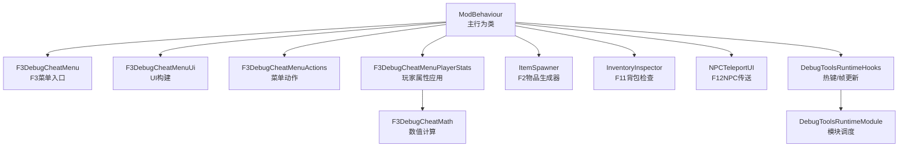
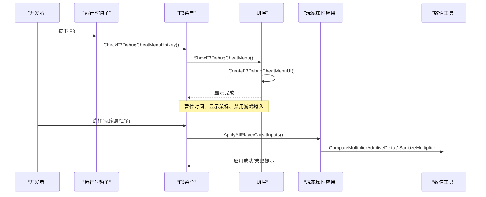
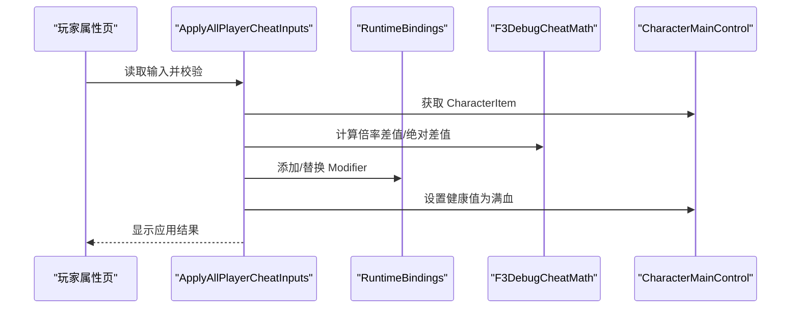
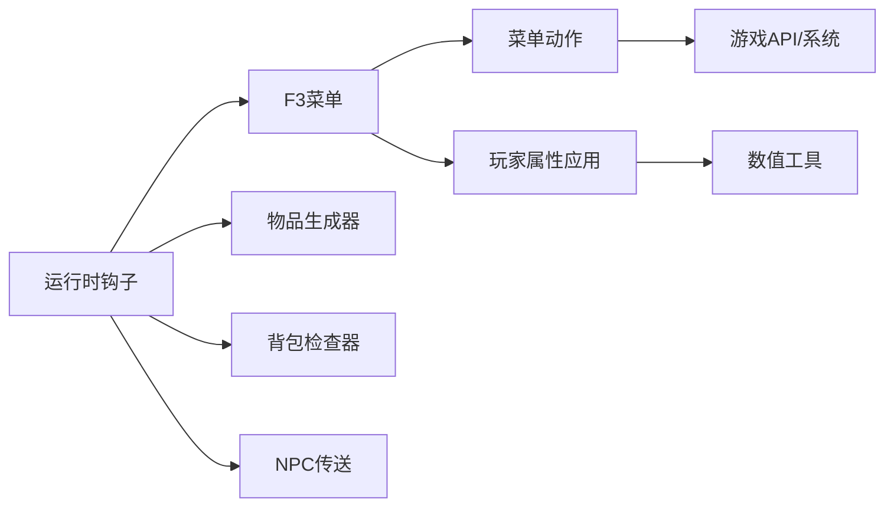

# 调试工具

2026-09-02 第四轮输出 69 PASS / 2 FAIL，返基地、终章死亡、最终清场/泄漏/存档回读通过。
`F3GameplayValidationDeepFlows.cs` 的标准胜利用例现在等生产 currentBoss 登记完成，定点 Hurt
确认死亡后才等待胜利奖励箱；全场发现角色不代表创建完成。Mode F 撤离必须比较真实成功结算计数，
同时等待基地完整就绪，不能在退出 Reset 后读取瞬时标志。标准奖励箱与 Mode F 撤离均已实机通过，
Mode D 活跃首波、BGM 加载/播放/租约也通过。
Mode D 多波测试只快照当前登记角色，每次真实击杀后让出一帧，避免已安装的击杀提示
在同帧第二次死亡中解析尚未初始化的经验文本；异常记完整栈并 FAIL。
波次编号增加后继续等待新波角色实际生成，避免全场清理误删下一波。
第四轮 D 多波已通过（wave=1->2、playable=3/3），H 伤害异常也未再出现。
H 首次认证/缓存仍受口令矩阵无人写入阻断，现补生产 adapter 跨帧采样、合法逐效果缓存恢复与具体门槛日志，
新 H 流程仍待游戏内复测，不能把没有逐 key 拒绝等同于整体开局通过。

<cite>
**本文引用的文件**
- [F3DebugCheatMenu.cs](file://DebugAndTools/F3DebugCheatMenu.cs)
- [F3DebugCheatMenuActions.cs](file://DebugAndTools/F3DebugCheatMenuActions.cs)
- [F3DebugCheatMenuPlayerStats.cs](file://DebugAndTools/F3DebugCheatMenuPlayerStats.cs)
- [F3DebugCheatMenuUi.cs](file://DebugAndTools/F3DebugCheatMenuUi.cs)
- [F3GameplayValidationRunner.cs](file://DebugAndTools/F3GameplayValidationRunner.cs)
- [F3GameplayValidationRandomEvents.cs](file://DebugAndTools/F3GameplayValidationRandomEvents.cs)
- [F3GameplayValidationPersistence.cs](file://DebugAndTools/F3GameplayValidationPersistence.cs)
- [ItemSpawner.cs](file://DebugAndTools/ItemSpawner.cs)
- [InventoryInspector.cs](file://DebugAndTools/InventoryInspector.cs)
- [NPCTeleportUI.cs](file://DebugAndTools/NPCTeleportUI.cs)
- [DebugToolsRuntimeHooks.cs](file://DebugAndTools/DebugToolsRuntimeHooks.cs)
- [DebugToolsRuntimeModule.cs](file://DebugAndTools/DebugToolsRuntimeModule.cs)
- [F3DebugCheatMath.cs](file://Utilities/F3DebugCheatMath.cs)
</cite>

## 目录
1. [简介](#简介)
2. [项目结构](#项目结构)
3. [核心组件](#核心组件)
4. [架构总览](#架构总览)
5. [详细组件分析](#详细组件分析)
6. [依赖关系分析](#依赖关系分析)
7. [性能考虑](#性能考虑)
8. [故障排查指南](#故障排查指南)
9. [结论](#结论)
10. [附录：热键与操作速查](#附录热键与操作速查)

## 简介
本模块提供一套面向开发/测试的调试工具集，核心为 F3 调试菜单系统，覆盖传送、玩家属性调参、资源与物品发放、战斗流程控制、NPC/剧情测试、场景调试等能力。同时包含独立的物品生成器（F2）和背包检查器（F11），以及 NPC 传送面板（F12）。所有功能均在开发模式下受控启用，具备完善的输入暂停、状态恢复与错误处理机制，便于快速定位问题、验证玩法与内容。

## 项目结构
调试工具集中在 DebugAndTools 目录下，按职责拆分：
- F3 菜单体系：入口、UI、动作、玩家属性应用、数学工具
- 独立工具：物品生成器、背包检查器、NPC 传送 UI
- 运行时钩子：统一的热键检测、帧更新与生命周期管理

图表来源
- [F3DebugCheatMenu.cs:16-122](file://DebugAndTools/F3DebugCheatMenu.cs#L16-L122)
- [F3DebugCheatMenuUi.cs:22-298](file://DebugAndTools/F3DebugCheatMenuUi.cs#L22-L298)
- [F3DebugCheatMenuActions.cs:24-769](file://DebugAndTools/F3DebugCheatMenuActions.cs#L24-L769)
- [F3DebugCheatMenuPlayerStats.cs:22-644](file://DebugAndTools/F3DebugCheatMenuPlayerStats.cs#L22-L644)
- [ItemSpawner.cs:21-211](file://DebugAndTools/ItemSpawner.cs#L21-L211)
- [InventoryInspector.cs:9-548](file://DebugAndTools/InventoryInspector.cs#L9-L548)
- [NPCTeleportUI.cs:18-466](file://DebugAndTools/NPCTeleportUI.cs#L18-L466)
- [DebugToolsRuntimeHooks.cs:10-37](file://DebugAndTools/DebugToolsRuntimeHooks.cs#L10-L37)
- [DebugToolsRuntimeModule.cs:1-43](file://DebugAndTools/DebugToolsRuntimeModule.cs#L1-L43)
- [F3DebugCheatMath.cs:1-21](file://Utilities/F3DebugCheatMath.cs#L1-L21)

章节来源
- [F3DebugCheatMenu.cs:16-122](file://DebugAndTools/F3DebugCheatMenu.cs#L16-L122)
- [DebugToolsRuntimeHooks.cs:10-37](file://DebugAndTools/DebugToolsRuntimeHooks.cs#L10-L37)
- [DebugToolsRuntimeModule.cs:1-43](file://DebugAndTools/DebugToolsRuntimeModule.cs#L1-L43)

## 核心组件
- F3 调试菜单：通过 F3 打开，提供多页导航（传送、玩家属性、资源与物品、战斗流程、NPC/剧情、场景调试），支持实时摘要与状态提示。
- 玩家属性调参：对最大生命、枪械伤害、近战伤害进行倍率调整；对头部/身体护甲进行绝对值覆盖；自动清理并安全应用修改。
- 物品生成器（F2）：简单窗口输入物品 ID 获取物品，适合快速验证道具。
- 背包检查器（F11）：读取当前角色背包，输出详细信息到日志或界面，辅助定位掉落、标签、口径等问题。
- NPC 传送面板（F12）：列出当前地图中的已知 NPC，点击传送到其附近位置。
- 运行时钩子：集中处理热键、帧更新、LateUpdate 状态维持与销毁清理。

章节来源
- [F3DebugCheatMenu.cs:107-122](file://DebugAndTools/F3DebugCheatMenu.cs#L107-L122)
- [F3DebugCheatMenuUi.cs:275-298](file://DebugAndTools/F3DebugCheatMenuUi.cs#L275-L298)
- [F3DebugCheatMenuPlayerStats.cs:242-347](file://DebugAndTools/F3DebugCheatMenuPlayerStats.cs#L242-L347)
- [ItemSpawner.cs:40-55](file://DebugAndTools/ItemSpawner.cs#L40-L55)
- [InventoryInspector.cs:49-74](file://DebugAndTools/InventoryInspector.cs#L49-L74)
- [NPCTeleportUI.cs:45-96](file://DebugAndTools/NPCTeleportUI.cs#L45-L96)

## F3 完整玩法验收

Dev 版 F3 新增“验收测试”页。先在基地把当前槽标记为专用测试档，再点“完整玩法验收”；普通档、
活动模式、存档忙、模态租约或关键资源未就绪会给出具体拒绝原因。测试逻辑由
`F3GameplayValidationRunner` 的 `DontDestroyOnLoad` 串行状态机承载，F3 关闭和自动切图不会中断。

**七阶段**覆盖数据/基线、基地玩法、后山与经济、标准与 D/E/F/G/H/Zombie、模式深度流程、
征程终章与 BGM owner、最终清场/泄漏差值/回读。套件超时上限 2700 秒（45 分钟）。

**按用例隔离（一次性测完）**：单个用例失败不再中断整套。每个模式用例走 `RunIsolatedCase`
包壳——协程内异常只记它自己的 FAIL，随后强制清场并继续下一个。清场失败也不再立即停：
先做一次强化清场（`ForceReclaimArena`：安全清理 + `ValidationForceClearArenaEnemies` + 等帧）
并复检，只有**连续两次**不可恢复才真中止（脏状态会污染后续结论）。进不了竞技场时
场内用例批量记 `SKIP` 而不是留空白。

**过图就绪与场地恢复（2026-09-02）**：`F3GameplayValidationScenes` 统一切图与诊断。
返基地调用官方 `LoadBaseScene`，不能把 `Base_SceneV2` 子场景当作完整基地入口。
加载任务结束后还必须核对目标 active scene、`IsSceneLoading=false`、`LevelManager.AfterInit`、
主玩家活动且存活、有 CharacterItem、GameCamera 启用，才记 PASS；终态不再跳过初始化。
失败报告附这些状态，最终基地未就绪时跳过性能、清场、泄漏和存档回读，仍汇总失败。
取消/套件超时后的返基地仍有独立的 90 秒等待预算；已有加载未结束时不叠加新加载。
每个场内用例之前重新确认竞技场。Mode H 认证拒绝返基地、Mode F 撤离后，先恢复竞技场再继续；
恢复失败把依赖用例记 SKIP，不在基地继续刷怪或把它们误报为模式故障。Mode H 状态已清空时立即
记录失败和 `exit_reason`，不再空等 180 秒。Windows 编译与相关 guard 已通过，实机复测未完成。

终章伤害使用 `new DamageInfo(player)`，显式调用官方构造器初始化 `elementFactors` 等字段；
`DamageInfo` 是 struct，无参 new 不会调用其带可选参数的构造器，会导致 `Health.Hurt` 空引用。

报告状态四分：`PASS` / `FAIL` / `CANCELLED`（玩家点取消）/ `TIMEOUT`（套件超时，剩余记 SKIP
但仍走完最终清场与汇总）/ `ABORTED_DIRTY`（连续脏状态）。`SUMMARY` 附 `failed_ids=` 与
`skipped_ids=`，不用翻全文找红项。报告位于
`Application.persistentDataPath/BossRushTestReports/BossRushValidation_<runId>.log`，崩溃时再附
`Player.log`。性能门槛为预热后 p95 不超过 `max(50ms, baseline×1.75)`，超过 200ms 的单帧记录阶段。

**泄漏差值**：`FINAL_LEAK_DELTA` 取套件开始时的一组静态计数（模态租约、BGM owner、
Mode H 参赛者/诊断对象、词缀激活条数与熔石钩子、遗种巢掉落钩子/闲逛体/倒地数、图鉴战斗钩子）
作为基线，跑完全部模式后核对是否回落。这类泄漏不会让清场断言变红，但会在连打几局后
表现为帧率下降或事件重复触发。p95 退化只报 `PERFORMANCE_WARNING` 不判红——单次实机采样
受后台进程影响太大，拿它判红会把结论变成噪声。

**深度流程已全自动化**（2026-09-01，owner 拍板）：Mode E 收尾、Mode F 赏金链与撤离、标准模式
胜利奖励结算此前因产品代码全 private 而记 `SKIP`，需真人走撤离点/打完整波。现由产品侧 5 个
`internal` 验收入口驱动，深度阶段 6 条用例全自动：`MODE_F_BOUNTY`、`MODE_F_EXTRACTION`、
`MODE_E_EXTRACTION`、`STANDARD_VICTORY_REWARD`、`SCENE_CLICK_GATE`、`MODE_D_MULTI_WAVE`。

入口设计原则是**只补前提、不替玩法链**：推进 `PhaseElapsed` 让真实阶段机自己切、触发官方
`CountDownArea.onCountDownSucceed`、把 Boss 池收窄到 1 个再走 `currentEnemyIndex >= presetCount`
那条真实结算条件。断言一律取产品状态（印记数、撤离结算标记、奖励箱控制器、阵营复位），
所以是真测而不是凑绿。全部入口 `internal` + `DevModeEnabled` 门控，正式玩家路径不可达。
Mode E 无自建撤离点（全模块无 `CountDownArea` 引用），其"撤离"实为 `EndModeE(false)` 收尾链，
metrics 标 `semantics=end_settlement`，不冒充撤离点验证。

**过场点击门**：部分图 `clickToContinue=true`，需玩家点一下鼠标才继续，卡住时旧套件报告仍是绿的。
现 `LoadScene` 协程在该模式下自动喂官方 `SceneLoader.NotifyPointerClick`，喂点次数记入报告供断言。
`SCENE_CLICK_GATE` 是唯一走 `clickToContinue=true` 的用例（与丧尸模式选图同路径），其余仍传 `false`；
判定只认「进得去」：现有反编译仅保留 LoadScene 转发壳，无法确认官方 `SceneLoader.clicked`
是否每次加载重置。该用例排在第 5 阶段，前面已切过多次图，门可能早被满足、一次都不用喂。
故喂点次数为 0 记 **WARN**（这轮没压到点击门、
没有回归价值）而非 FAIL，不冤枉健康构建；要单独验证点击门，把该用例挪到套件最前面再跑。

随机事件验收不是“调用入口没抛异常”检查：八种事件各自输出 `RANDOM_EVENT_*`，异步等待空投落地、
Boss/商人实体与库存、声源/烟花序列、现金堆和巡游鸭全部收敛，30 秒未完成即失败。清场只统计
runtime team 明确敌对玩家的角色，报告会附对象名、team 与 preset key；友军和遗种随从不会误报。
套件运行期间暂停向官方普通消息/大横幅队列写入，finally 恢复，避免测试播报在结束后排队弹出。
- [DebugToolsRuntimeHooks.cs:23-37](file://DebugAndTools/DebugToolsRuntimeHooks.cs#L23-L37)

## 架构总览
调试工具以 ModBehaviour 为中心，通过运行时模块在 Update/LateUpdate 中轮询热键与状态，按需创建/显示 UI，并在关闭时恢复游戏时间、光标与输入。

图表来源
- [DebugToolsRuntimeHooks.cs:23-37](file://DebugAndTools/DebugToolsRuntimeHooks.cs#L23-L37)
- [F3DebugCheatMenu.cs:107-122](file://DebugAndTools/F3DebugCheatMenu.cs#L107-L122)
- [F3DebugCheatMenuUi.cs:22-298](file://DebugAndTools/F3DebugCheatMenuUi.cs#L22-L298)
- [F3DebugCheatMenuPlayerStats.cs:242-347](file://DebugAndTools/F3DebugCheatMenuPlayerStats.cs#L242-L347)
- [F3DebugCheatMath.cs:5-18](file://Utilities/F3DebugCheatMath.cs#L5-L18)

## 详细组件分析

### F3 调试菜单系统
- 功能页面
  - 传送：回基地、返回出生点、前往 BossRush 起始点、传送到当前场景默认点、打开 NPC 传送面板。
  - 玩家属性：最大生命倍率、枪械伤害倍率、近战伤害倍率、头部/身体护甲覆盖；支持预设按钮与一键应用/重置。
  - 资源与物品：按 ID 发放物品、快捷发放常用物品、加钱、清空星愿奖励/发送冷却、打开背包检查器。
  - 战斗流程：满血、强制清场、触发通关、发船票并打开地图、切换放置模式、尸潮邀请函+地图、触发尸潮撤离、重置尸潮模式。
  - NPC/剧情：清空成就、强制刷新哥布林/护士、重置礼物/聊天限制、重置剧情标记、设置亲和等级、触发结婚/离婚、记录花心事件。
  - 场景调试：输出附近对象、最近交互点、场景角色信息、刷新摘要。
- 交互与状态
  - 顶部摘要每 0.25 秒刷新一次，显示 DevMode、场景、SubScene、坐标、BossRush/ModeE/ModeF 激活状态、作弊状态与当前玩家属性读值。
  - 底部状态栏显示操作结果，错误高亮提示。
  - 打开菜单时暂停时间、显示鼠标、禁用游戏输入；关闭时恢复。

图表来源
- [F3DebugCheatMenuUi.cs:275-574](file://DebugAndTools/F3DebugCheatMenuUi.cs#L275-L574)
- [F3DebugCheatMenuActions.cs:24-769](file://DebugAndTools/F3DebugCheatMenuActions.cs#L24-L769)
- [F3DebugCheatMenuPlayerStats.cs:22-126](file://DebugAndTools/F3DebugCheatMenuPlayerStats.cs#L22-L126)

章节来源
- [F3DebugCheatMenuUi.cs:22-298](file://DebugAndTools/F3DebugCheatMenuUi.cs#L22-L298)
- [F3DebugCheatMenuActions.cs:24-769](file://DebugAndTools/F3DebugCheatMenuActions.cs#L24-L769)
- [F3DebugCheatMenuPlayerStats.cs:22-126](file://DebugAndTools/F3DebugCheatMenuPlayerStats.cs#L22-L126)

### 玩家属性调参与应用
- 可调参数
  - 最大生命倍率：通过字符项 MaxHealth 统计添加修正量实现。
  - 枪械伤害倍率：通过 GunDamageMultiplier 统计添加修正量实现。
  - 近战伤害倍率：通过 MeleeDamageMultiplier 统计添加修正量实现。
  - 头部/身体护甲覆盖：优先从装备或角色项解析目标 Stat，若不存在则尝试创建运行时 Stat 并覆盖。
- 应用策略
  - 使用 F3DebugCheatMath 计算差值，避免负数倍率。
  - 应用前移除旧修正，防止叠加；应用成功后立即将生命值设为满血。
  - 若玩家或 CharacterItem 未就绪，延迟重试（队列化应用）。
- 数据流
  - 输入校验 → 参数缓存 → 计算差值 → 添加/移除修正 → 刷新摘要。

图表来源
- [F3DebugCheatMenuPlayerStats.cs:242-347](file://DebugAndTools/F3DebugCheatMenuPlayerStats.cs#L242-L347)
- [F3DebugCheatMenuPlayerStats.cs:349-519](file://DebugAndTools/F3DebugCheatMenuPlayerStats.cs#L349-L519)
- [F3DebugCheatMath.cs:5-18](file://Utilities/F3DebugCheatMath.cs#L5-L18)

章节来源
- [F3DebugCheatMenuPlayerStats.cs:242-347](file://DebugAndTools/F3DebugCheatMenuPlayerStats.cs#L242-L347)
- [F3DebugCheatMenuPlayerStats.cs:349-519](file://DebugAndTools/F3DebugCheatMenuPlayerStats.cs#L349-L519)
- [F3DebugCheatMath.cs:5-18](file://Utilities/F3DebugCheatMath.cs#L5-L18)

### 物品生成器（F2）
- 功能：输入物品 ID，调用底层 API 实例化并发送给玩家。
- 特点：仅在开发模式生效；支持拖动窗口；失败/成功消息限时显示。
- 适用场景：快速验证新物品、测试掉落逻辑、核对名称与描述。

章节来源
- [ItemSpawner.cs:40-55](file://DebugAndTools/ItemSpawner.cs#L40-L55)
- [ItemSpawner.cs:90-211](file://DebugAndTools/ItemSpawner.cs#L90-L211)

### 背包检查器（F11）
- 功能：读取当前角色背包，展示每个物品的关键元数据（类型ID、名称键、内部名、标签、分类、口径、品质、价值、耐久、描述预览等），并支持输出到日志。
- 特性：打开时暂停时间、显示鼠标、禁用输入；关闭时恢复；异常安全读取。
- 适用场景：定位掉落问题、校验标签/口径/路线提示、核对价值与堆叠。

章节来源
- [InventoryInspector.cs:49-74](file://DebugAndTools/InventoryInspector.cs#L49-L74)
- [InventoryInspector.cs:91-140](file://DebugAndTools/InventoryInspector.cs#L91-L140)
- [InventoryInspector.cs:142-212](file://DebugAndTools/InventoryInspector.cs#L142-L212)
- [InventoryInspector.cs:214-338](file://DebugAndTools/InventoryInspector.cs#L214-L338)
- [InventoryInspector.cs:351-513](file://DebugAndTools/InventoryInspector.cs#L351-L513)

### NPC 传送面板（F12）
- 功能：列出当前地图中的已知 NPC（如快递员、哥布林、护士），点击后传送到该 NPC 前方地面位置。
- 特性：打开时暂停时间、显示鼠标、禁用输入；关闭时恢复；列表动态刷新。
- 适用场景：快速接近特定 NPC、测试对话/交互、验证刷新与存在性。

章节来源
- [NPCTeleportUI.cs:45-96](file://DebugAndTools/NPCTeleportUI.cs#L45-L96)
- [NPCTeleportUI.cs:127-272](file://DebugAndTools/NPCTeleportUI.cs#L127-L272)
- [NPCTeleportUI.cs:305-450](file://DebugAndTools/NPCTeleportUI.cs#L305-L450)

### 运行时钩子与生命周期
- 热键检测：F3 打开/关闭菜单；F2 打开物品生成器；F11 打开背包检查器；F12 打开 NPC 传送面板；其他 F4-F10 用于成就清空、场景调试、放置模式、地图选择、角色/交互点输出、通关触发等。
- 帧更新：每帧刷新摘要、延迟应用玩家参数、维护 UI 状态。
- LateUpdate：确保 UI 可见期间保持暂停与鼠标状态。
- 销毁清理：释放 UI、恢复输入、退出放置模式、注销监听。

章节来源
- [DebugToolsRuntimeHooks.cs:10-37](file://DebugAndTools/DebugToolsRuntimeHooks.cs#L10-L37)
- [DebugToolsRuntimeHooks.cs:40-234](file://DebugAndTools/DebugToolsRuntimeHooks.cs#L40-L234)
- [DebugToolsRuntimeHooks.cs:358-372](file://DebugAndTools/DebugToolsRuntimeHooks.cs#L358-L372)
- [DebugToolsRuntimeModule.cs:12-35](file://DebugAndTools/DebugToolsRuntimeModule.cs#L12-L35)

## 依赖关系分析
- 模块耦合
  - F3 菜单依赖 UI 构建、动作实现、玩家属性应用与数学工具。
  - 运行时钩子集中协调各工具的启停与热键分发。
  - 独立工具（物品生成器、背包检查器、NPC 传送）可单独使用，但共享输入暂停与状态恢复机制。
- 外部依赖
  - 角色与物品系统：CharacterMainControl、ItemAssetsCollection、ItemUtilities、EconomyManager。
  - 场景与加载：SceneManager、SceneLoader、MultiSceneCore。
  - 成就与剧情：BossRushAchievementManager、AffinityManager、ZombieModeMapSelectionHelper 等。
- 潜在循环
  - 通过 partial class 与模块调度解耦，未见直接循环引用。

图表来源
- [DebugToolsRuntimeHooks.cs:23-37](file://DebugAndTools/DebugToolsRuntimeHooks.cs#L23-L37)
- [F3DebugCheatMenu.cs:16-122](file://DebugAndTools/F3DebugCheatMenu.cs#L16-L122)
- [F3DebugCheatMenuActions.cs:24-769](file://DebugAndTools/F3DebugCheatMenuActions.cs#L24-L769)
- [F3DebugCheatMenuPlayerStats.cs:242-347](file://DebugAndTools/F3DebugCheatMenuPlayerStats.cs#L242-L347)
- [F3DebugCheatMath.cs:5-18](file://Utilities/F3DebugCheatMath.cs#L5-L18)

章节来源
- [DebugToolsRuntimeHooks.cs:23-37](file://DebugAndTools/DebugToolsRuntimeHooks.cs#L23-L37)
- [F3DebugCheatMenu.cs:16-122](file://DebugAndTools/F3DebugCheatMenu.cs#L16-L122)

## 性能考虑
- UI 刷新频率：摘要每 0.25 秒刷新一次，避免每帧重绘造成开销。
- 输入暂停：打开调试 UI 时将 Time.timeScale 置零并禁用输入，减少后台逻辑干扰。
- 延迟应用：玩家属性参数在玩家或 CharacterItem 未就绪时排队重试，降低空引用风险。
- 日志输出：背包检查器与场景调试输出大量信息，建议在必要时使用，避免频繁刷屏影响性能。

[本节为通用指导，不直接分析具体文件]

## 故障排查指南
- 无法打开 F3 菜单
  - 确认已启用开发模式；检查是否被其他 UI 遮挡；查看状态栏错误提示。
  - 参考：[F3DebugCheatMenu.cs:107-122](file://DebugAndTools/F3DebugCheatMenu.cs#L107-L122)、[F3DebugCheatMenu.cs:184-232](file://DebugAndTools/F3DebugCheatMenu.cs#L184-L232)
- 玩家属性应用失败
  - 检查输入是否为有效数字；确认玩家与 CharacterItem 已就绪；查看是否因权限或系统限制导致失败。
  - 参考：[F3DebugCheatMenuPlayerStats.cs:242-347](file://DebugAndTools/F3DebugCheatMenuPlayerStats.cs#L242-L347)、[F3DebugCheatMenuPlayerStats.cs:349-519](file://DebugAndTools/F3DebugCheatMenuPlayerStats.cs#L349-L519)
- 物品生成失败
  - 确认物品 ID 有效；检查 ItemAssetsCollection 是否能实例化；查看 DevLog 错误信息。
  - 参考：[F3DebugCheatMenuActions.cs:152-195](file://DebugAndTools/F3DebugCheatMenuActions.cs#L152-L195)、[ItemSpawner.cs:152-211](file://DebugAndTools/ItemSpawner.cs#L152-L211)
- 背包检查器为空或报错
  - 确认角色与 Inventory 非空；查看异常捕获与状态消息；必要时输出到日志。
  - 参考：[InventoryInspector.cs:142-212](file://DebugAndTools/InventoryInspector.cs#L142-L212)、[InventoryInspector.cs:214-338](file://DebugAndTools/InventoryInspector.cs#L214-L338)
- NPC 传送无效
  - 确认 NPC 在当前地图存在；检查射线校正与地面命中；查看 DevLog 输出。
  - 参考：[NPCTeleportUI.cs:305-450](file://DebugAndTools/NPCTeleportUI.cs#L305-L450)

章节来源
- [F3DebugCheatMenu.cs:107-232](file://DebugAndTools/F3DebugCheatMenu.cs#L107-L232)
- [F3DebugCheatMenuPlayerStats.cs:242-519](file://DebugAndTools/F3DebugCheatMenuPlayerStats.cs#L242-L519)
- [F3DebugCheatMenuActions.cs:152-195](file://DebugAndTools/F3DebugCheatMenuActions.cs#L152-L195)
- [ItemSpawner.cs:152-211](file://DebugAndTools/ItemSpawner.cs#L152-L211)
- [InventoryInspector.cs:142-338](file://DebugAndTools/InventoryInspector.cs#L142-L338)
- [NPCTeleportUI.cs:305-450](file://DebugAndTools/NPCTeleportUI.cs#L305-L450)

## 结论
本调试工具集围绕 F3 菜单构建了完整的开发/测试工作流，涵盖传送、属性调参、物品发放、战斗流程、NPC/剧情与场景诊断等高频需求。通过统一的运行时钩子与严格的输入/状态管理，保证了调试过程的安全性与稳定性。建议在实际使用中结合日志输出与场景调试能力，快速定位问题并验证改动效果。

[本节为总结性内容，不直接分析具体文件]

## 完整玩法验收的清场诊断

Dev F3 的完整玩法验收由独立 `DontDestroyOnLoad` runner 串行执行。模式用例结束后不再固定等待
0.5 秒，而是在 2 秒内逐帧回读空闲不变式，等待 Unity 延迟销毁完成。诊断同时区分玩家敌对角色
与带模式命名前缀的自有角色；后者即使 inactive 也会计为残留，并在报告中输出对象名、preset、
active、Health、team 与 hostile 状态。Mode D 用例另核对登记表对象确实存活且敌对。

章节来源
- [F3GameplayValidationRunner.cs](file://DebugAndTools/F3GameplayValidationRunner.cs)
- [F3GameplayValidationDiagnostics.cs](file://DebugAndTools/F3GameplayValidationDiagnostics.cs)

## 附录：热键与操作速查

### F3 自动验收与全功能待测清单（2026-09-02，COMPAT）

F3 的「自动验收 + 完整待测清单」读取 `Assets/Data/GameplayCoverage.json`，关联全部当前 Wiki 功能、生产模块及 F3 固定断言。每轮输出原 `.log` 和同名 `.coverage.md`，记录自动 PASS/FAIL/SKIP/NOT_RUN 与人工 MANUAL_PENDING；SUMMARY 自动绿与 COVERAGE 全覆盖结果分离，人工没有证据时始终待验。阶段快照在强退时可能落后于日志，人工结果另存。

自动追加每个动态 TypeID 的游离工厂实例/本地化/图标检查，以及丧尸撤离事件、现金结算幂等、完整返基地检查。它们不替代装备战斗、自然撤离倒计时、H 全赛季/真实押品、NPC 实际交互、视觉音频与跨槽/重启场景。第六轮工厂及丧尸撤离用例均已实机通过；自然倒计时仍待人工。

清单维护与旧日志对账使用 `tools/gameplay_coverage.py`，新增遗漏由 `tests/GameplayValidationCoverageGuard.py` 守卫。52 个领域与 113 条人工场景是本次登记规模，准确值以清单为准；登记不等于路径覆盖证明。

章节来源：`DebugAndTools/F3GameplayValidationCoverage.cs`、`F3GameplayValidationItems.cs`、`F3GameplayValidationZombie.cs`、`Assets/Data/GameplayCoverage.json`。

- F2：打开/关闭物品生成器窗口（DevMode 下）
- F3：打开/关闭 F3 调试菜单（DevMode 下）
- F4：清空所有成就数据（DevMode 下）
- F5：输出附近建筑/对象信息（DevMode 下）
- F6：切换放置模式（DevMode 下）
- F7：输出最近交互点信息（DevMode 下）
- F8：输出场景中除玩家外所有角色信息（DevMode 下）
- F9：发放 BossRush 船票并打开地图选择（DevMode 下）
- F10：强制清场并触发通关（DevMode 且处于 BossRush 流程中）
- F11：打开/关闭背包检查器（DevMode 下）
- F12：打开/关闭 NPC 传送面板（DevMode 下）
- ESC：关闭当前调试 UI（如 NPC 传送面板）

章节来源
- [DebugToolsRuntimeHooks.cs:40-234](file://DebugAndTools/DebugToolsRuntimeHooks.cs#L40-L234)
- [ItemSpawner.cs:40-55](file://DebugAndTools/ItemSpawner.cs#L40-L55)
- [F3DebugCheatMenu.cs:107-122](file://DebugAndTools/F3DebugCheatMenu.cs#L107-L122)
- [InventoryInspector.cs:49-74](file://DebugAndTools/InventoryInspector.cs#L49-L74)
- [NPCTeleportUI.cs:45-96](file://DebugAndTools/NPCTeleportUI.cs#L45-L96)

## 2026-09-02 第五轮验收更新

兼容分类：COMPAT。本轮 134 PASS / 3 FAIL / 1 WARN；H 首次认证与缓存、全部 63 个动态物品工厂检查实机通过。覆盖账本正确保留 3 个自动红项和 113 条人工待验。

丧尸撤离用例此前在正常零净化点开局后直接要求正数，尚未走到成功事件。现在通过生产拾取入口准备 3 点并回读，再执行原有现金差值、重复事件幂等和完整返基地断言；自然倒计时仍是人工用例。

新增 `F3GameplayValidationModeHKits.cs` / `MODE_H_STARTER_KITS`：在 H 缓存认证后的 Drafting 阶段，用认证池、真实隔离桥和生产装配器检查全部 starter kit 的真实槽位、弹匣和备用弹药。每件 finally 回收，超时/取消的迟到生成同样清理。H 原用例追加正常退出后的入场意图清除断言；单纯认证通过不再掩盖弹药未装配。

Windows Dev 编译与 99 个相关守卫通过；整备生产源码模拟探针 34 项通过。这些不替代新 DLL 的 Unity 复测；旧报告没有 MODE_H_STARTER_KITS，离线对账必须显示 NOT_RUN。六场赛季、押品恢复、装备实战等人工清单继续保留待验。

章节来源：`DebugAndTools/F3GameplayValidationModes.cs`、`F3GameplayValidationModeHKits.cs`、`F3GameplayValidationZombie.cs`、`Assets/Data/GameplayCoverage.json`。

## 2026-09-02 第六轮实机结果（SAFE）

`BossRushValidation_20260902_140735_794.log` 完整结束：138 PASS / 0 FAIL / 0 SKIP / 0 WARN。
H 初始整备 8/8、入场意图清除、丧尸 3 点仅结算一次并返基地、终章死亡呈现一次及最终所有被测订阅归零均通过。
COVERAGE 仍为 INCOMPLETE：auto_not_passed=0、manual_pending=113；不能将自动绿当作装备实战、六场赛季、押品或所有人工交互已通过。
Player.log 仍有三种上轮已存在的 AI/外部 Mod 异常栈，本轮无新栈种类；自动结果不证明宿主零异常。详见 `docs/F3复测诊断-2026-09-02第六轮.md`。
