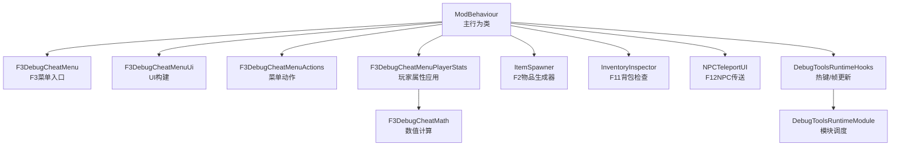
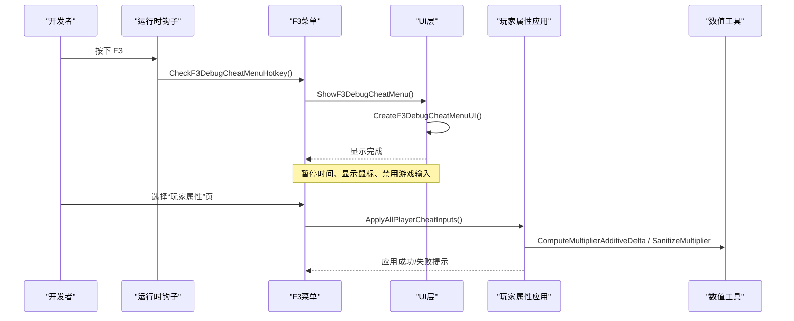
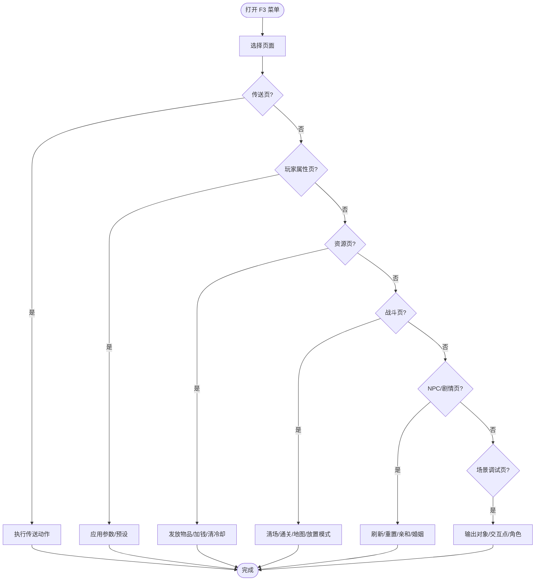
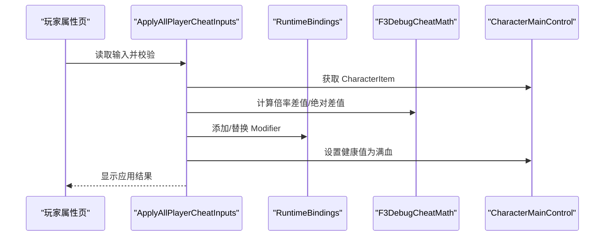
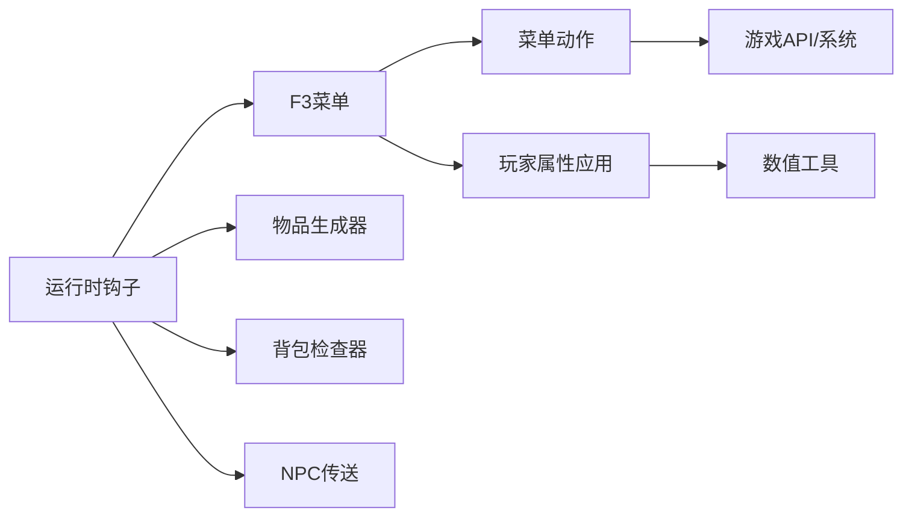

# 调试工具

<cite>
**本文引用的文件**
- [F3DebugCheatMenu.cs](file://DebugAndTools/F3DebugCheatMenu.cs)
- [F3DebugCheatMenuActions.cs](file://DebugAndTools/F3DebugCheatMenuActions.cs)
- [F3DebugCheatMenuPlayerStats.cs](file://DebugAndTools/F3DebugCheatMenuPlayerStats.cs)
- [F3DebugCheatMenuUi.cs](file://DebugAndTools/F3DebugCheatMenuUi.cs)
- [ItemSpawner.cs](file://DebugAndTools/ItemSpawner.cs)
- [InventoryInspector.cs](file://DebugAndTools/InventoryInspector.cs)
- [NPCTeleportUI.cs](file://DebugAndTools/NPCTeleportUI.cs)
- [DebugToolsRuntimeHooks.cs](file://DebugAndTools/DebugToolsRuntimeHooks.cs)
- [DebugToolsRuntimeModule.cs](file://DebugAndTools/DebugToolsRuntimeModule.cs)
- [F3DebugCheatMath.cs](file://Utilities/F3DebugCheatMath.cs)
</cite>

## 目录
1. [简介](#简介)
2. [项目结构](#项目结构)
3. [核心组件](#核心组件)
4. [架构总览](#架构总览)
5. [详细组件分析](#详细组件分析)
6. [依赖关系分析](#依赖关系分析)
7. [性能考虑](#性能考虑)
8. [故障排查指南](#故障排查指南)
9. [结论](#结论)
10. [附录：热键与操作速查](#附录热键与操作速查)

## 简介
本模块提供一套面向开发/测试的调试工具集，核心为 F3 调试菜单系统，覆盖传送、玩家属性调参、资源与物品发放、战斗流程控制、NPC/剧情测试、场景调试等能力。同时包含独立的物品生成器（F2）和背包检查器（F11），以及 NPC 传送面板（F12）。所有功能均在开发模式下受控启用，具备完善的输入暂停、状态恢复与错误处理机制，便于快速定位问题、验证玩法与内容。

## 项目结构
调试工具集中在 DebugAndTools 目录下，按职责拆分：
- F3 菜单体系：入口、UI、动作、玩家属性应用、数学工具
- 独立工具：物品生成器、背包检查器、NPC 传送 UI
- 运行时钩子：统一的热键检测、帧更新与生命周期管理

图表来源
- [F3DebugCheatMenu.cs:16-122](file://DebugAndTools/F3DebugCheatMenu.cs#L16-L122)
- [F3DebugCheatMenuUi.cs:22-298](file://DebugAndTools/F3DebugCheatMenuUi.cs#L22-L298)
- [F3DebugCheatMenuActions.cs:24-769](file://DebugAndTools/F3DebugCheatMenuActions.cs#L24-L769)
- [F3DebugCheatMenuPlayerStats.cs:22-644](file://DebugAndTools/F3DebugCheatMenuPlayerStats.cs#L22-L644)
- [ItemSpawner.cs:21-211](file://DebugAndTools/ItemSpawner.cs#L21-L211)
- [InventoryInspector.cs:9-548](file://DebugAndTools/InventoryInspector.cs#L9-L548)
- [NPCTeleportUI.cs:18-466](file://DebugAndTools/NPCTeleportUI.cs#L18-L466)
- [DebugToolsRuntimeHooks.cs:10-37](file://DebugAndTools/DebugToolsRuntimeHooks.cs#L10-L37)
- [DebugToolsRuntimeModule.cs:1-43](file://DebugAndTools/DebugToolsRuntimeModule.cs#L1-L43)
- [F3DebugCheatMath.cs:1-21](file://Utilities/F3DebugCheatMath.cs#L1-L21)

章节来源
- [F3DebugCheatMenu.cs:16-122](file://DebugAndTools/F3DebugCheatMenu.cs#L16-L122)
- [DebugToolsRuntimeHooks.cs:10-37](file://DebugAndTools/DebugToolsRuntimeHooks.cs#L10-L37)
- [DebugToolsRuntimeModule.cs:1-43](file://DebugAndTools/DebugToolsRuntimeModule.cs#L1-L43)

## 核心组件
- F3 调试菜单：通过 F3 打开，提供多页导航（传送、玩家属性、资源与物品、战斗流程、NPC/剧情、场景调试），支持实时摘要与状态提示。
- 玩家属性调参：对最大生命、枪械伤害、近战伤害进行倍率调整；对头部/身体护甲进行绝对值覆盖；自动清理并安全应用修改。
- 物品生成器（F2）：简单窗口输入物品 ID 获取物品，适合快速验证道具。
- 背包检查器（F11）：读取当前角色背包，输出详细信息到日志或界面，辅助定位掉落、标签、口径等问题。
- NPC 传送面板（F12）：列出当前地图中的已知 NPC，点击传送到其附近位置。
- 运行时钩子：集中处理热键、帧更新、LateUpdate 状态维持与销毁清理。

章节来源
- [F3DebugCheatMenu.cs:107-122](file://DebugAndTools/F3DebugCheatMenu.cs#L107-L122)
- [F3DebugCheatMenuUi.cs:275-298](file://DebugAndTools/F3DebugCheatMenuUi.cs#L275-L298)
- [F3DebugCheatMenuPlayerStats.cs:242-347](file://DebugAndTools/F3DebugCheatMenuPlayerStats.cs#L242-L347)
- [ItemSpawner.cs:40-55](file://DebugAndTools/ItemSpawner.cs#L40-L55)
- [InventoryInspector.cs:49-74](file://DebugAndTools/InventoryInspector.cs#L49-L74)
- [NPCTeleportUI.cs:45-96](file://DebugAndTools/NPCTeleportUI.cs#L45-L96)
- [DebugToolsRuntimeHooks.cs:23-37](file://DebugAndTools/DebugToolsRuntimeHooks.cs#L23-L37)

## 架构总览
调试工具以 ModBehaviour 为中心，通过运行时模块在 Update/LateUpdate 中轮询热键与状态，按需创建/显示 UI，并在关闭时恢复游戏时间、光标与输入。

图表来源
- [DebugToolsRuntimeHooks.cs:23-37](file://DebugAndTools/DebugToolsRuntimeHooks.cs#L23-L37)
- [F3DebugCheatMenu.cs:107-122](file://DebugAndTools/F3DebugCheatMenu.cs#L107-L122)
- [F3DebugCheatMenuUi.cs:22-298](file://DebugAndTools/F3DebugCheatMenuUi.cs#L22-L298)
- [F3DebugCheatMenuPlayerStats.cs:242-347](file://DebugAndTools/F3DebugCheatMenuPlayerStats.cs#L242-L347)
- [F3DebugCheatMath.cs:5-18](file://Utilities/F3DebugCheatMath.cs#L5-L18)

## 详细组件分析

### F3 调试菜单系统
- 功能页面
  - 传送：回基地、返回出生点、前往 BossRush 起始点、传送到当前场景默认点、打开 NPC 传送面板。
  - 玩家属性：最大生命倍率、枪械伤害倍率、近战伤害倍率、头部/身体护甲覆盖；支持预设按钮与一键应用/重置。
  - 资源与物品：按 ID 发放物品、快捷发放常用物品、加钱、清空星愿奖励/发送冷却、打开背包检查器。
  - 战斗流程：满血、强制清场、触发通关、发船票并打开地图、切换放置模式、尸潮邀请函+地图、触发尸潮撤离、重置尸潮模式。
  - NPC/剧情：清空成就、强制刷新哥布林/护士、重置礼物/聊天限制、重置剧情标记、设置亲和等级、触发结婚/离婚、记录花心事件。
  - 场景调试：输出附近对象、最近交互点、场景角色信息、刷新摘要。
- 交互与状态
  - 顶部摘要每 0.25 秒刷新一次，显示 DevMode、场景、SubScene、坐标、BossRush/ModeE/ModeF 激活状态、作弊状态与当前玩家属性读值。
  - 底部状态栏显示操作结果，错误高亮提示。
  - 打开菜单时暂停时间、显示鼠标、禁用游戏输入；关闭时恢复。

图表来源
- [F3DebugCheatMenuUi.cs:275-574](file://DebugAndTools/F3DebugCheatMenuUi.cs#L275-L574)
- [F3DebugCheatMenuActions.cs:24-769](file://DebugAndTools/F3DebugCheatMenuActions.cs#L24-L769)
- [F3DebugCheatMenuPlayerStats.cs:22-126](file://DebugAndTools/F3DebugCheatMenuPlayerStats.cs#L22-L126)

章节来源
- [F3DebugCheatMenuUi.cs:22-298](file://DebugAndTools/F3DebugCheatMenuUi.cs#L22-L298)
- [F3DebugCheatMenuActions.cs:24-769](file://DebugAndTools/F3DebugCheatMenuActions.cs#L24-L769)
- [F3DebugCheatMenuPlayerStats.cs:22-126](file://DebugAndTools/F3DebugCheatMenuPlayerStats.cs#L22-L126)

### 玩家属性调参与应用
- 可调参数
  - 最大生命倍率：通过字符项 MaxHealth 统计添加修正量实现。
  - 枪械伤害倍率：通过 GunDamageMultiplier 统计添加修正量实现。
  - 近战伤害倍率：通过 MeleeDamageMultiplier 统计添加修正量实现。
  - 头部/身体护甲覆盖：优先从装备或角色项解析目标 Stat，若不存在则尝试创建运行时 Stat 并覆盖。
- 应用策略
  - 使用 F3DebugCheatMath 计算差值，避免负数倍率。
  - 应用前移除旧修正，防止叠加；应用成功后立即将生命值设为满血。
  - 若玩家或 CharacterItem 未就绪，延迟重试（队列化应用）。
- 数据流
  - 输入校验 → 参数缓存 → 计算差值 → 添加/移除修正 → 刷新摘要。

图表来源
- [F3DebugCheatMenuPlayerStats.cs:242-347](file://DebugAndTools/F3DebugCheatMenuPlayerStats.cs#L242-L347)
- [F3DebugCheatMenuPlayerStats.cs:349-519](file://DebugAndTools/F3DebugCheatMenuPlayerStats.cs#L349-L519)
- [F3DebugCheatMath.cs:5-18](file://Utilities/F3DebugCheatMath.cs#L5-L18)

章节来源
- [F3DebugCheatMenuPlayerStats.cs:242-347](file://DebugAndTools/F3DebugCheatMenuPlayerStats.cs#L242-L347)
- [F3DebugCheatMenuPlayerStats.cs:349-519](file://DebugAndTools/F3DebugCheatMenuPlayerStats.cs#L349-L519)
- [F3DebugCheatMath.cs:5-18](file://Utilities/F3DebugCheatMath.cs#L5-L18)

### 物品生成器（F2）
- 功能：输入物品 ID，调用底层 API 实例化并发送给玩家。
- 特点：仅在开发模式生效；支持拖动窗口；失败/成功消息限时显示。
- 适用场景：快速验证新物品、测试掉落逻辑、核对名称与描述。

章节来源
- [ItemSpawner.cs:40-55](file://DebugAndTools/ItemSpawner.cs#L40-L55)
- [ItemSpawner.cs:90-211](file://DebugAndTools/ItemSpawner.cs#L90-L211)

### 背包检查器（F11）
- 功能：读取当前角色背包，展示每个物品的关键元数据（类型ID、名称键、内部名、标签、分类、口径、品质、价值、耐久、描述预览等），并支持输出到日志。
- 特性：打开时暂停时间、显示鼠标、禁用输入；关闭时恢复；异常安全读取。
- 适用场景：定位掉落问题、校验标签/口径/路线提示、核对价值与堆叠。

章节来源
- [InventoryInspector.cs:49-74](file://DebugAndTools/InventoryInspector.cs#L49-L74)
- [InventoryInspector.cs:91-140](file://DebugAndTools/InventoryInspector.cs#L91-L140)
- [InventoryInspector.cs:142-212](file://DebugAndTools/InventoryInspector.cs#L142-L212)
- [InventoryInspector.cs:214-338](file://DebugAndTools/InventoryInspector.cs#L214-L338)
- [InventoryInspector.cs:351-513](file://DebugAndTools/InventoryInspector.cs#L351-L513)

### NPC 传送面板（F12）
- 功能：列出当前地图中的已知 NPC（如快递员、哥布林、护士），点击后传送到该 NPC 前方地面位置。
- 特性：打开时暂停时间、显示鼠标、禁用输入；关闭时恢复；列表动态刷新。
- 适用场景：快速接近特定 NPC、测试对话/交互、验证刷新与存在性。

章节来源
- [NPCTeleportUI.cs:45-96](file://DebugAndTools/NPCTeleportUI.cs#L45-L96)
- [NPCTeleportUI.cs:127-272](file://DebugAndTools/NPCTeleportUI.cs#L127-L272)
- [NPCTeleportUI.cs:305-450](file://DebugAndTools/NPCTeleportUI.cs#L305-L450)

### 运行时钩子与生命周期
- 热键检测：F3 打开/关闭菜单；F2 打开物品生成器；F11 打开背包检查器；F12 打开 NPC 传送面板；其他 F4-F10 用于成就清空、场景调试、放置模式、地图选择、角色/交互点输出、通关触发等。
- 帧更新：每帧刷新摘要、延迟应用玩家参数、维护 UI 状态。
- LateUpdate：确保 UI 可见期间保持暂停与鼠标状态。
- 销毁清理：释放 UI、恢复输入、退出放置模式、注销监听。

章节来源
- [DebugToolsRuntimeHooks.cs:10-37](file://DebugAndTools/DebugToolsRuntimeHooks.cs#L10-L37)
- [DebugToolsRuntimeHooks.cs:40-234](file://DebugAndTools/DebugToolsRuntimeHooks.cs#L40-L234)
- [DebugToolsRuntimeHooks.cs:358-372](file://DebugAndTools/DebugToolsRuntimeHooks.cs#L358-L372)
- [DebugToolsRuntimeModule.cs:12-35](file://DebugAndTools/DebugToolsRuntimeModule.cs#L12-L35)

## 依赖关系分析
- 模块耦合
  - F3 菜单依赖 UI 构建、动作实现、玩家属性应用与数学工具。
  - 运行时钩子集中协调各工具的启停与热键分发。
  - 独立工具（物品生成器、背包检查器、NPC 传送）可单独使用，但共享输入暂停与状态恢复机制。
- 外部依赖
  - 角色与物品系统：CharacterMainControl、ItemAssetsCollection、ItemUtilities、EconomyManager。
  - 场景与加载：SceneManager、SceneLoader、MultiSceneCore。
  - 成就与剧情：BossRushAchievementManager、AffinityManager、ZombieModeMapSelectionHelper 等。
- 潜在循环
  - 通过 partial class 与模块调度解耦，未见直接循环引用。

图表来源
- [DebugToolsRuntimeHooks.cs:23-37](file://DebugAndTools/DebugToolsRuntimeHooks.cs#L23-L37)
- [F3DebugCheatMenu.cs:16-122](file://DebugAndTools/F3DebugCheatMenu.cs#L16-L122)
- [F3DebugCheatMenuActions.cs:24-769](file://DebugAndTools/F3DebugCheatMenuActions.cs#L24-L769)
- [F3DebugCheatMenuPlayerStats.cs:242-347](file://DebugAndTools/F3DebugCheatMenuPlayerStats.cs#L242-L347)
- [F3DebugCheatMath.cs:5-18](file://Utilities/F3DebugCheatMath.cs#L5-L18)

章节来源
- [DebugToolsRuntimeHooks.cs:23-37](file://DebugAndTools/DebugToolsRuntimeHooks.cs#L23-L37)
- [F3DebugCheatMenu.cs:16-122](file://DebugAndTools/F3DebugCheatMenu.cs#L16-L122)

## 性能考虑
- UI 刷新频率：摘要每 0.25 秒刷新一次，避免每帧重绘造成开销。
- 输入暂停：打开调试 UI 时将 Time.timeScale 置零并禁用输入，减少后台逻辑干扰。
- 延迟应用：玩家属性参数在玩家或 CharacterItem 未就绪时排队重试，降低空引用风险。
- 日志输出：背包检查器与场景调试输出大量信息，建议在必要时使用，避免频繁刷屏影响性能。

[本节为通用指导，不直接分析具体文件]

## 故障排查指南
- 无法打开 F3 菜单
  - 确认已启用开发模式；检查是否被其他 UI 遮挡；查看状态栏错误提示。
  - 参考：[F3DebugCheatMenu.cs:107-122](file://DebugAndTools/F3DebugCheatMenu.cs#L107-L122)、[F3DebugCheatMenu.cs:184-232](file://DebugAndTools/F3DebugCheatMenu.cs#L184-L232)
- 玩家属性应用失败
  - 检查输入是否为有效数字；确认玩家与 CharacterItem 已就绪；查看是否因权限或系统限制导致失败。
  - 参考：[F3DebugCheatMenuPlayerStats.cs:242-347](file://DebugAndTools/F3DebugCheatMenuPlayerStats.cs#L242-L347)、[F3DebugCheatMenuPlayerStats.cs:349-519](file://DebugAndTools/F3DebugCheatMenuPlayerStats.cs#L349-L519)
- 物品生成失败
  - 确认物品 ID 有效；检查 ItemAssetsCollection 是否能实例化；查看 DevLog 错误信息。
  - 参考：[F3DebugCheatMenuActions.cs:152-195](file://DebugAndTools/F3DebugCheatMenuActions.cs#L152-L195)、[ItemSpawner.cs:152-211](file://DebugAndTools/ItemSpawner.cs#L152-L211)
- 背包检查器为空或报错
  - 确认角色与 Inventory 非空；查看异常捕获与状态消息；必要时输出到日志。
  - 参考：[InventoryInspector.cs:142-212](file://DebugAndTools/InventoryInspector.cs#L142-L212)、[InventoryInspector.cs:214-338](file://DebugAndTools/InventoryInspector.cs#L214-L338)
- NPC 传送无效
  - 确认 NPC 在当前地图存在；检查射线校正与地面命中；查看 DevLog 输出。
  - 参考：[NPCTeleportUI.cs:305-450](file://DebugAndTools/NPCTeleportUI.cs#L305-L450)

章节来源
- [F3DebugCheatMenu.cs:107-232](file://DebugAndTools/F3DebugCheatMenu.cs#L107-L232)
- [F3DebugCheatMenuPlayerStats.cs:242-519](file://DebugAndTools/F3DebugCheatMenuPlayerStats.cs#L242-L519)
- [F3DebugCheatMenuActions.cs:152-195](file://DebugAndTools/F3DebugCheatMenuActions.cs#L152-L195)
- [ItemSpawner.cs:152-211](file://DebugAndTools/ItemSpawner.cs#L152-L211)
- [InventoryInspector.cs:142-338](file://DebugAndTools/InventoryInspector.cs#L142-L338)
- [NPCTeleportUI.cs:305-450](file://DebugAndTools/NPCTeleportUI.cs#L305-L450)

## 结论
本调试工具集围绕 F3 菜单构建了完整的开发/测试工作流，涵盖传送、属性调参、物品发放、战斗流程、NPC/剧情与场景诊断等高频需求。通过统一的运行时钩子与严格的输入/状态管理，保证了调试过程的安全性与稳定性。建议在实际使用中结合日志输出与场景调试能力，快速定位问题并验证改动效果。

[本节为总结性内容，不直接分析具体文件]

## 附录：热键与操作速查
- F2：打开/关闭物品生成器窗口（DevMode 下）
- F3：打开/关闭 F3 调试菜单（DevMode 下）
- F4：清空所有成就数据（DevMode 下）
- F5：输出附近建筑/对象信息（DevMode 下）
- F6：切换放置模式（DevMode 下）
- F7：输出最近交互点信息（DevMode 下）
- F8：输出场景中除玩家外所有角色信息（DevMode 下）
- F9：发放 BossRush 船票并打开地图选择（DevMode 下）
- F10：强制清场并触发通关（DevMode 且处于 BossRush 流程中）
- F11：打开/关闭背包检查器（DevMode 下）
- F12：打开/关闭 NPC 传送面板（DevMode 下）
- ESC：关闭当前调试 UI（如 NPC 传送面板）

章节来源
- [DebugToolsRuntimeHooks.cs:40-234](file://DebugAndTools/DebugToolsRuntimeHooks.cs#L40-L234)
- [ItemSpawner.cs:40-55](file://DebugAndTools/ItemSpawner.cs#L40-L55)
- [F3DebugCheatMenu.cs:107-122](file://DebugAndTools/F3DebugCheatMenu.cs#L107-L122)
- [InventoryInspector.cs:49-74](file://DebugAndTools/InventoryInspector.cs#L49-L74)
- [NPCTeleportUI.cs:45-96](file://DebugAndTools/NPCTeleportUI.cs#L45-L96)