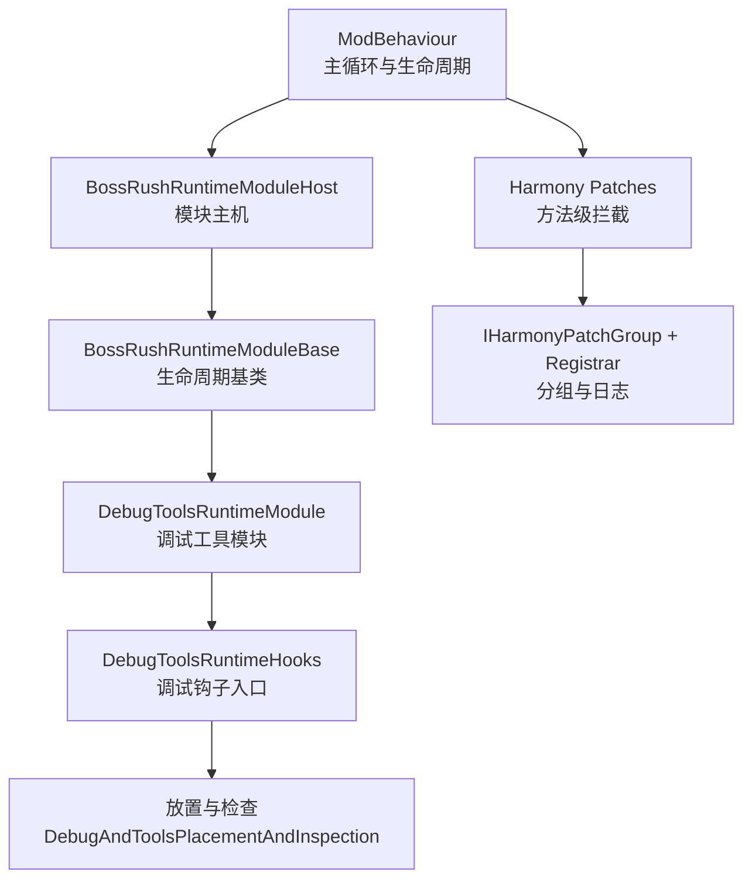
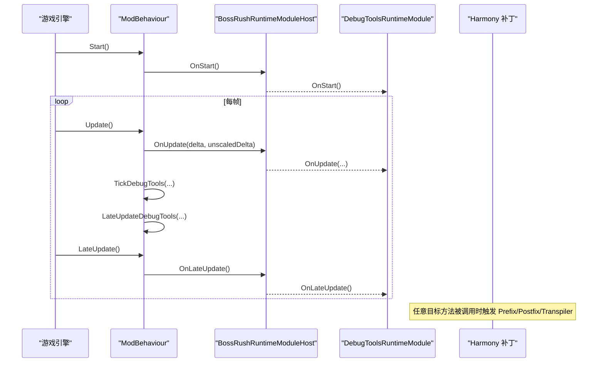
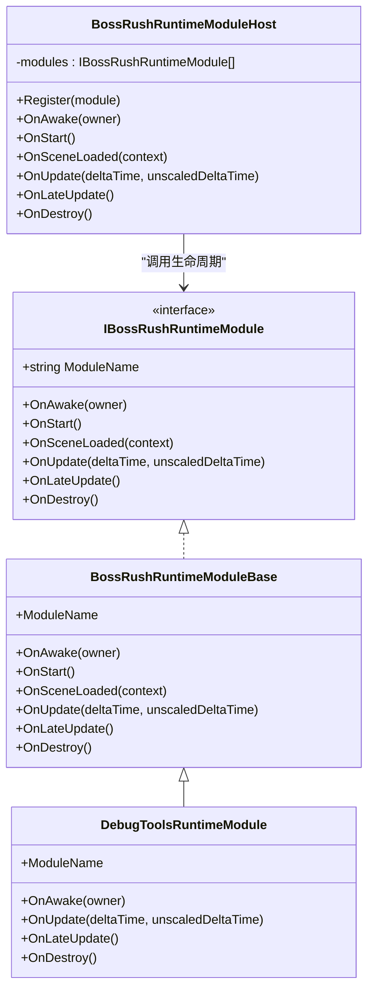
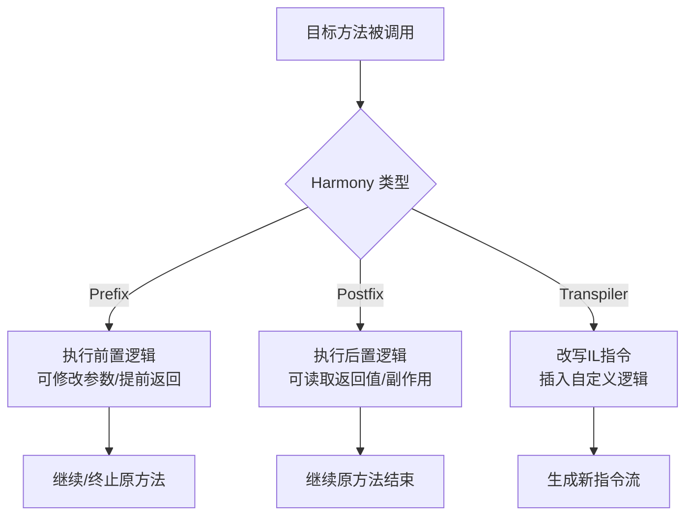
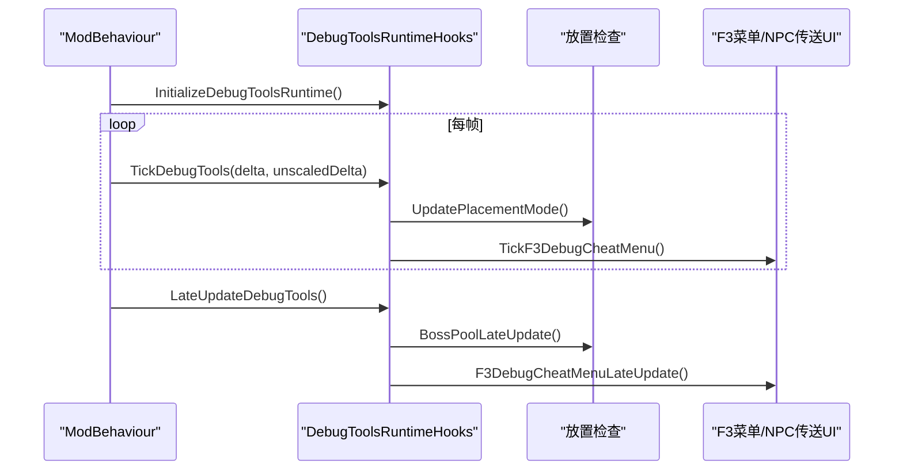
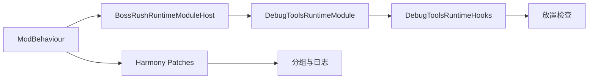

# 运行时钩子

<cite>
**本文引用的文件**
- [ModBehaviour.cs](file://ModBehaviour.cs)
- [DebugToolsRuntimeModule.cs](file://DebugAndTools/DebugToolsRuntimeModule.cs)
- [BossRushRuntimeModuleBase.cs](file://Common/Lifecycle/BossRushRuntimeModuleBase.cs)
- [BossRushRuntimeModuleHost.cs](file://Common/Lifecycle/BossRushRuntimeModuleHost.cs)
- [HarmonyPatchGroupRegistrar.cs](file://Common/Infrastructure/HarmonyPatchGroupRegistrar.cs)
- [IHarmonyPatchGroup.cs](file://Common/Infrastructure/IHarmonyPatchGroup.cs)
- [BaseHubBoatPatch.cs](file://Patches/BaseHub/BaseHubBoatPatch.cs)
- [CharacterOnDeadPatch.cs](file://Patches/Combat/CharacterOnDeadPatch.cs)
- [ModeEHarmonyPatch.cs](file://ModeE/ModeEHarmonyPatch.cs)
- [DebugToolsRuntimeHooks.cs](file://DebugAndTools/DebugToolsRuntimeHooks.cs)
- [DebugAndToolsPlacementAndInspection.cs](file://DebugAndTools/DebugAndToolsPlacementAndInspection.cs)
</cite>

## 目录
1. [简介](#简介)
2. [项目结构](#项目结构)
3. [核心组件](#核心组件)
4. [架构总览](#架构总览)
5. [详细组件分析](#详细组件分析)
6. [依赖关系分析](#依赖关系分析)
7. [性能考量](#性能考量)
8. [故障排查指南](#故障排查指南)
9. [结论](#结论)
10. [附录](#附录)

## 简介
本文件面向“运行时钩子系统”，聚焦调试工具的运行时注入机制、Harmony 补丁的使用与生命周期管理、DebugToolsRuntimeModule 的模块注册与初始化流程、放置检查与调试插桩的实现原理，以及如何扩展自定义运行时钩子并与其它系统集成。文档同时给出性能影响分析与优化建议，帮助开发者在保持游戏稳定性的前提下高效扩展功能。

## 项目结构
本项目将运行时钩子能力分为三层：
- 运行时模块层：通过 BossRushRuntimeModuleBase 抽象与 BossRushRuntimeModuleHost 主机统一调度各模块的 Awake/Start/Update/LateUpdate/Destroy 等生命周期。
- Harmony 补丁层：以 Patches 目录下的具体 Patch 类实现方法级拦截（Prefix/Postfix/Transpiler），并通过 IHarmonyPatchGroup 与 HarmonyPatchGroupRegistrar 进行分组管理与日志输出。
- 调试工具层：DebugToolsRuntimeModule 负责挂载到宿主 ModBehaviour，并在 Update/LateUpdate 中驱动 F3 菜单、放置模式、FPS 统计、场景调试快捷键等。

图表来源
- [ModBehaviour.cs:719-736](file://ModBehaviour.cs#L719-L736)
- [BossRushRuntimeModuleHost.cs:21-100](file://Common/Lifecycle/BossRushRuntimeModuleHost.cs#L21-L100)
- [BossRushRuntimeModuleBase.cs:3-13](file://Common/Lifecycle/BossRushRuntimeModuleBase.cs#L3-L13)
- [DebugToolsRuntimeModule.cs:12-35](file://DebugAndTools/DebugToolsRuntimeModule.cs#L12-L35)
- [HarmonyPatchGroupRegistrar.cs:10-61](file://Common/Infrastructure/HarmonyPatchGroupRegistrar.cs#L10-L61)
- [IHarmonyPatchGroup.cs:7-14](file://Common/Infrastructure/IHarmonyPatchGroup.cs#L7-L14)

章节来源
- [ModBehaviour.cs:719-736](file://ModBehaviour.cs#L719-L736)
- [BossRushRuntimeModuleHost.cs:21-100](file://Common/Lifecycle/BossRushRuntimeModuleHost.cs#L21-L100)
- [DebugToolsRuntimeModule.cs:12-35](file://DebugAndTools/DebugToolsRuntimeModule.cs#L12-L35)
- [HarmonyPatchGroupRegistrar.cs:10-61](file://Common/Infrastructure/HarmonyPatchGroupRegistrar.cs#L10-L61)

## 核心组件
- 运行时模块基类与主机：提供统一的模块生命周期回调分发与异常隔离，确保单个模块失败不影响整体运行。
- 调试工具模块：继承基类，持有 ModBehaviour 引用，在 Update/LateUpdate 中调用调试工具的具体逻辑。
- Harmony 补丁分组：为所有 Patch 提供分组元数据与开关预留，便于调试与未来按组启用/禁用。
- 调试钩子与放置检查：集中处理 F3/F4-F12 快捷键、放置预览、对象选择、射线检测、UI 更新等。

章节来源
- [BossRushRuntimeModuleBase.cs:3-13](file://Common/Lifecycle/BossRushRuntimeModuleBase.cs#L3-L13)
- [BossRushRuntimeModuleHost.cs:21-127](file://Common/Lifecycle/BossRushRuntimeModuleHost.cs#L21-L127)
- [DebugToolsRuntimeModule.cs:12-35](file://DebugAndTools/DebugToolsRuntimeModule.cs#L12-L35)
- [HarmonyPatchGroupRegistrar.cs:10-61](file://Common/Infrastructure/HarmonyPatchGroupRegistrar.cs#L10-L61)
- [IHarmonyPatchGroup.cs:7-14](file://Common/Infrastructure/IHarmonyPatchGroup.cs#L7-L14)

## 架构总览
运行时钩子由“模块主机”和“Harmony 补丁”两条主线组成：
- 模块主机：在 ModBehaviour 的 Start/Update/LateUpdate/OnDestroy 中统一调度各模块的生命周期，保证顺序执行与错误隔离。
- Harmony 补丁：通过 Prefix/Postfix/Transpiler 对目标方法进行拦截或改写，完成运行时注入；使用分组接口记录元数据并支持日志输出。

图表来源
- [ModBehaviour.cs:719-736](file://ModBehaviour.cs#L719-L736)
- [BossRushRuntimeModuleHost.cs:21-100](file://Common/Lifecycle/BossRushRuntimeModuleHost.cs#L21-L100)
- [DebugToolsRuntimeModule.cs:12-35](file://DebugAndTools/DebugToolsRuntimeModule.cs#L12-L35)

## 详细组件分析

### 运行时模块系统（BossRushRuntimeModuleBase / Host）
- 设计要点
  - 基类定义统一生命周期回调：OnAwake/OnStart/OnSceneLoaded/OnUpdate/OnLateUpdate/OnDestroy。
  - 主机维护模块列表，遍历调用每个模块的对应回调，并对异常进行捕获与日志记录，避免单点故障扩散。
  - 销毁阶段逆序清理，确保资源释放顺序正确。
- 集成方式
  - 在 ModBehaviour 的 Start/Update/LateUpdate/OnDestroy 中调用主机相应方法。
  - 场景加载时通过 SceneRuntimeContext 传递上下文，供模块感知场景切换。

图表来源
- [BossRushRuntimeModuleBase.cs:3-13](file://Common/Lifecycle/BossRushRuntimeModuleBase.cs#L3-L13)
- [DebugToolsRuntimeModule.cs:12-35](file://DebugAndTools/DebugToolsRuntimeModule.cs#L12-L35)
- [BossRushRuntimeModuleHost.cs:11-127](file://Common/Lifecycle/BossRushRuntimeModuleHost.cs#L11-L127)

章节来源
- [BossRushRuntimeModuleBase.cs:3-13](file://Common/Lifecycle/BossRushRuntimeModuleBase.cs#L3-L13)
- [BossRushRuntimeModuleHost.cs:21-127](file://Common/Lifecycle/BossRushRuntimeModuleHost.cs#L21-L127)
- [DebugToolsRuntimeModule.cs:12-35](file://DebugAndTools/DebugToolsRuntimeModule.cs#L12-L35)

### Harmony 补丁与分组管理
- 补丁类型
  - Prefix：在目标方法前拦截，可修改参数或提前返回。
  - Postfix：在目标方法后执行，常用于副作用或结果修正。
  - Transpiler：直接改写 IL 指令，用于复杂逻辑插入。
- 分组与日志
  - IHarmonyPatchGroup 提供 GroupName 与 IsEnabled 元数据。
  - HarmonyPatchGroupRegistrar 维护分组列表，支持去重注册、清空与日志输出。
- 典型用法
  - 基地船点交互注入：在 InteractableBase.Start 后置钩子中向实例注入 BossRush 选项。
  - 角色死亡追加掉落：在 CharacterMainControl.OnDead 前缀钩子中处理额外掉落逻辑。
  - Mode E 商店与血条：通过多个补丁组合实现购买流程重写、UI 显示修正与友方血条绿色覆盖。

图表来源
- [BaseHubBoatPatch.cs:13-31](file://Patches/BaseHub/BaseHubBoatPatch.cs#L13-L31)
- [CharacterOnDeadPatch.cs:11-19](file://Patches/Combat/CharacterOnDeadPatch.cs#L11-L19)
- [ModeEHarmonyPatch.cs:26-87](file://ModeE/ModeEHarmonyPatch.cs#L26-L87)
- [HarmonyPatchGroupRegistrar.cs:10-61](file://Common/Infrastructure/HarmonyPatchGroupRegistrar.cs#L10-L61)
- [IHarmonyPatchGroup.cs:7-14](file://Common/Infrastructure/IHarmonyPatchGroup.cs#L7-L14)

章节来源
- [BaseHubBoatPatch.cs:13-31](file://Patches/BaseHub/BaseHubBoatPatch.cs#L13-L31)
- [CharacterOnDeadPatch.cs:11-19](file://Patches/Combat/CharacterOnDeadPatch.cs#L11-L19)
- [ModeEHarmonyPatch.cs:26-87](file://ModeE/ModeEHarmonyPatch.cs#L26-L87)
- [HarmonyPatchGroupRegistrar.cs:10-61](file://Common/Infrastructure/HarmonyPatchGroupRegistrar.cs#L10-L61)
- [IHarmonyPatchGroup.cs:7-14](file://Common/Infrastructure/IHarmonyPatchGroup.cs#L7-L14)

### 调试工具运行时钩子与放置检查
- 初始化与驱动
  - ModBehaviour 在合适时机调用 InitializeDebugToolsRuntime 注册监听器与射击调试监听。
  - 每帧通过 TickDebugTools 更新 FPS、地图点击调试、快捷键检测与 F3 菜单状态。
  - LateUpdate 中执行 BossPool 与 NPC 传送 UI 的后续更新。
- 放置模式
  - F6 切换进入/退出放置模式，创建预览对象（完整克隆但禁用碰撞体与物理模拟）。
  - 滚轮旋转预览对象或按住 Shift 切换附近预制体（基于碰撞体扫描并按基础名称去重）。
  - 左键确认放置，右键两次确认删除（第一次选中描边，第二次执行删除）。
- 调试快捷键
  - F4 清空成就数据（DevMode）。
  - F5 输出附近建筑信息（反射访问 Building 类型，避免强引用）。
  - F7/F8 输出最近交互点/场景中角色信息。
  - F9 打开传送地图 UI 并发送船票。
  - F10 清场并触发通关流程。
  - F12 打开 NPC 传送 UI。

图表来源
- [DebugToolsRuntimeHooks.cs:10-38](file://DebugAndTools/DebugToolsRuntimeHooks.cs#L10-L38)
- [DebugAndToolsPlacementAndInspection.cs:311-722](file://DebugAndTools/DebugAndToolsPlacementAndInspection.cs#L311-L722)

章节来源
- [DebugToolsRuntimeHooks.cs:10-38](file://DebugAndTools/DebugToolsRuntimeHooks.cs#L10-L38)
- [DebugAndToolsPlacementAndInspection.cs:311-722](file://DebugAndTools/DebugAndToolsPlacementAndInspection.cs#L311-L722)

### 与其他系统的集成最佳实践
- 与游戏主循环集成
  - 通过 ModBehaviour 的 Start/Update/LateUpdate/OnDestroy 调用运行时模块主机，确保与游戏帧同步。
  - 场景切换时通过 OnSceneLoaded 通知模块，以便按需初始化或清理。
- 与 Harmony 补丁集成
  - 使用 Prefix/Postfix 做轻量拦截，Transpiler 仅用于必要且复杂的逻辑改写。
  - 通过 IHarmonyPatchGroup 与 Registrar 管理补丁分组，便于调试与未来按组启用/禁用。
- 与 UI 系统集成
  - 在 LateUpdate 中更新 UI 相关状态，避免在 Update 中进行昂贵的 UI 操作。
  - 使用 DevMode 开关控制调试功能，减少生产环境开销。

章节来源
- [ModBehaviour.cs:719-736](file://ModBehaviour.cs#L719-L736)
- [ModBehaviour.cs:782-797](file://ModBehaviour.cs#L782-L797)
- [HarmonyPatchGroupRegistrar.cs:10-61](file://Common/Infrastructure/HarmonyPatchGroupRegistrar.cs#L10-L61)

## 依赖关系分析
- 耦合性
  - 模块主机与模块之间松耦合：模块仅需实现接口，主机负责调度。
  - 调试工具模块依赖 ModBehaviour 提供的 Tick/LateUpdate 钩子。
  - Harmony 补丁与目标类强耦合（类型与方法签名），需确保版本兼容。
- 外部依赖
  - Unity 框架：Input、Physics、Camera、SceneManager 等。
  - 游戏内部类型：CharacterMainControl、InteractableBase、HealthBar、StockShop 等。
- 潜在循环依赖
  - 当前结构未发现循环依赖；补丁与模块职责清晰分离。

图表来源
- [ModBehaviour.cs:719-736](file://ModBehaviour.cs#L719-L736)
- [BossRushRuntimeModuleHost.cs:21-100](file://Common/Lifecycle/BossRushRuntimeModuleHost.cs#L21-L100)
- [DebugToolsRuntimeModule.cs:12-35](file://DebugAndTools/DebugToolsRuntimeModule.cs#L12-L35)
- [DebugToolsRuntimeHooks.cs:10-38](file://DebugAndTools/DebugToolsRuntimeHooks.cs#L10-L38)
- [HarmonyPatchGroupRegistrar.cs:10-61](file://Common/Infrastructure/HarmonyPatchGroupRegistrar.cs#L10-L61)

章节来源
- [ModBehaviour.cs:719-736](file://ModBehaviour.cs#L719-L736)
- [BossRushRuntimeModuleHost.cs:21-100](file://Common/Lifecycle/BossRushRuntimeModuleHost.cs#L21-L100)
- [DebugToolsRuntimeModule.cs:12-35](file://DebugAndTools/DebugToolsRuntimeModule.cs#L12-L35)
- [DebugToolsRuntimeHooks.cs:10-38](file://DebugAndTools/DebugToolsRuntimeHooks.cs#L10-L38)
- [HarmonyPatchGroupRegistrar.cs:10-61](file://Common/Infrastructure/HarmonyPatchGroupRegistrar.cs#L10-L61)

## 性能考量
- 热点路径优化
  - 血条颜色覆盖：缓存 ModBehaviour.Instance 与帧计数，降低每帧属性访问频率。
  - 放置模式：预览对象禁用碰撞体与 Rigidbody，避免物理干扰；射线检测限定 LayerMask 以减少命中计算。
  - 预制体扫描：按基础名称去重，避免重复实例化与渲染。
- 调试功能开关
  - 使用 DevMode 控制调试快捷键与日志输出，减少生产环境开销。
  - 仅在必要时执行昂贵操作（如 FindObjectsOfType、反射访问）。
- 内存与分配
  - 避免在 Update 中频繁分配临时对象；复用缓存与集合。
  - 预览对象及时销毁，防止内存泄漏。

章节来源
- [ModeEHarmonyPatch.cs:309-353](file://ModeE/ModeEHarmonyPatch.cs#L309-L353)
- [DebugAndToolsPlacementAndInspection.cs:472-554](file://DebugAndTools/DebugAndToolsPlacementAndInspection.cs#L472-L554)
- [DebugToolsRuntimeHooks.cs:40-234](file://DebugAndTools/DebugToolsRuntimeHooks.cs#L40-L234)

## 故障排查指南
- 模块生命周期异常
  - 主机在每个生命周期回调中捕获异常并记录警告日志，包含模块名与回调阶段。
  - 若某模块失败，其他模块仍可继续运行，便于定位问题。
- 场景切换问题
  - 在 OnSceneLoaded 中清理与初始化资源，避免跨场景残留状态。
  - 调试工具在场景加载时调用 OnSceneLoadedDebugToolsRuntime，确保 UI 与状态同步。
- 补丁失效或冲突
  - 检查目标方法签名是否匹配；确认 Prefix/Postfix/Transpiler 的正确使用。
  - 使用分组日志输出已注册的 Patch 分组，辅助排查。

章节来源
- [BossRushRuntimeModuleHost.cs:120-127](file://Common/Lifecycle/BossRushRuntimeModuleHost.cs#L120-L127)
- [ModBehaviour.cs:782-797](file://ModBehaviour.cs#L782-L797)
- [HarmonyPatchGroupRegistrar.cs:51-57](file://Common/Infrastructure/HarmonyPatchGroupRegistrar.cs#L51-L57)

## 结论
本运行时钩子系统通过“模块主机 + Harmony 补丁”的双轨架构，实现了高内聚、低耦合的运行时扩展能力。调试工具模块借助统一的生命周期与钩子入口，提供了丰富的开发期功能（放置检查、快捷键、UI 调试）。Harmony 补丁以细粒度拦截游戏方法，满足复杂业务需求。结合性能优化与故障排查策略，可在保证稳定性的前提下持续扩展功能。

## 附录
- 扩展自定义运行时钩子步骤
  - 新建类继承 BossRushRuntimeModuleBase，实现所需生命周期回调。
  - 在合适的时机通过 BossRushRuntimeModuleHost.Register 注册模块。
  - 在模块中调用 ModBehaviour 提供的调试钩子或集成其他系统。
- 添加 Harmony 补丁建议
  - 明确拦截点（Prefix/Postfix/Transpiler），最小化改动范围。
  - 使用 IHarmonyPatchGroup 标记分组，便于日志与未来开关。
  - 在补丁中做好异常保护与快速路径判断，避免影响性能。