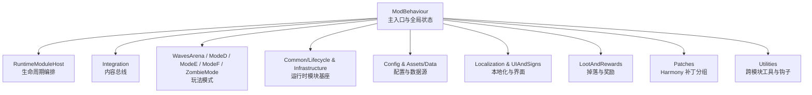
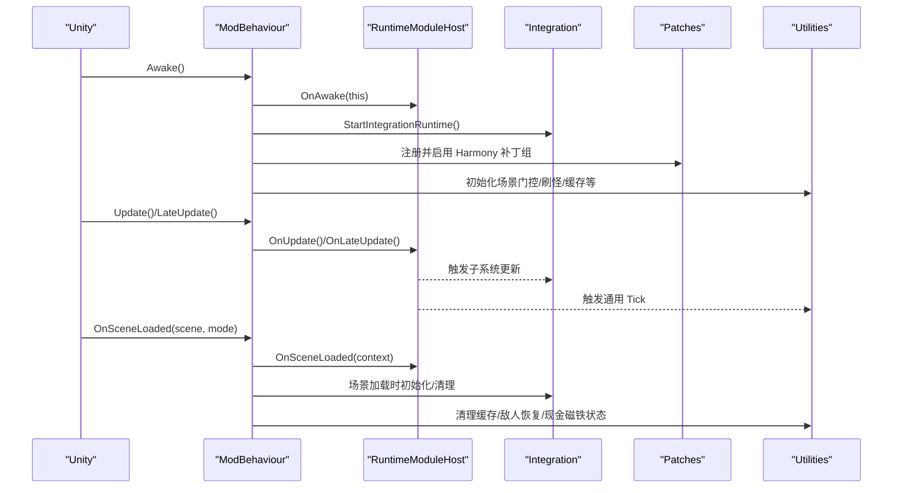
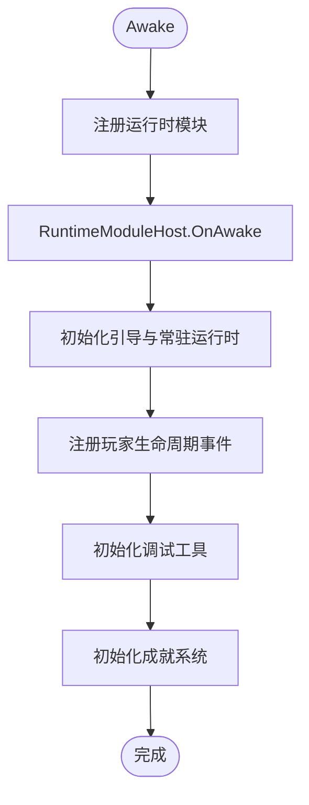
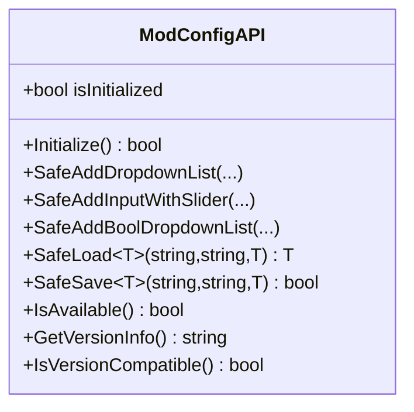
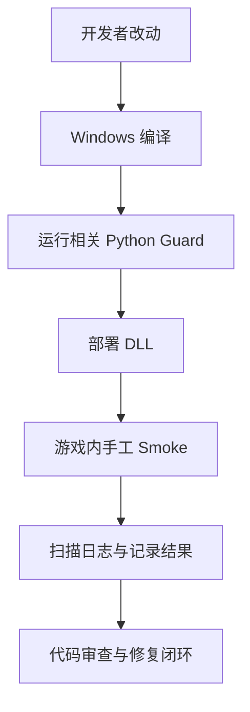
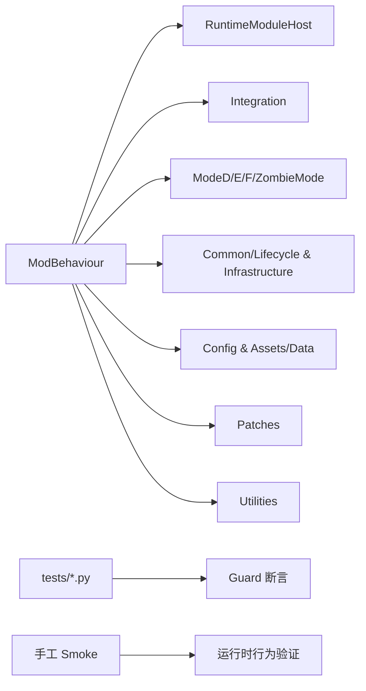

# 开发者指南

<cite>
**本文引用的文件**
- [README.md](file://README.md)
- [AGENTS.md](file://AGENTS.md)
- [CODE_REVIEW.md](file://CODE_REVIEW.md)
- [ModBehaviour.cs](file://ModBehaviour.cs)
- [ModConfigApi.cs](file://ModConfigApi.cs)
- [compile_dev.bat](file://compile_dev.bat)
- [test_bossrush_smoke_manual.bat](file://test_bossrush_smoke_manual.bat)
- [test_zombiemode_goal_windows.bat](file://test_zombiemode_goal_windows.bat)
- [ZombieModeProjectileRewardPatchGuard.py](file://tests/ZombieModeProjectileRewardPatchGuard.py)
</cite>

## 目录
1. [简介](#简介)
2. [项目结构](#项目结构)
3. [核心组件](#核心组件)
4. [架构总览](#架构总览)
5. [详细组件分析](#详细组件分析)
6. [依赖关系分析](#依赖关系分析)
7. [性能注意事项](#性能注意事项)
8. [故障排查指南](#故障排查指南)
9. [结论](#结论)
10. [附录](#附录)

## 简介
本指南面向 BossRushMod 的开发者与维护者，覆盖开发环境搭建、代码规范与命名约定、提交与审查流程、Harmony 补丁与 Unity 模组最佳实践、性能优化技巧、测试策略与质量保证、扩展开发（新增 Boss/物品/功能）、API 使用示例、常见问题解决方案以及贡献代码的完整流程。项目以 BossRush 竞技场为核心，同时包含多模式玩法、自定义 Boss/装备/NPC、成就、重铸、婚姻、Wiki、本地化、音频与运行时稳定性修复等系统。

## 项目结构
仓库采用按子系统与职责划分的目录组织方式：
- 根级入口与全局状态：ModBehaviour.cs、ModConfigApi.cs
- 运行时模块与基础设施：Common/Lifecycle、Common/Infrastructure、Utilities
- 玩法模式：WavesArena、ModeD、ModeE、ModeF、ZombieMode
- 集成内容：Integration（物品、装备、NPC、商店、Wiki、好感度、婚姻、重铸、新武器、死亡亡魂等）
- 配置与数据：Config、Assets/Data、Assets/SpawnPoints
- 本地化与 UI：Localization、UIAndSigns、Achievement、Audio
- 掉落与奖励：LootAndRewards
- Harmony 补丁分组：Patches
- 地图选择与交互：MapSelection、Interactables
- 文档与站点：docs、wiki-site、WikiContent
- 构建与测试脚本：compile_dev.bat、test_bossrush_smoke_manual.bat、test_zombiemode_goal_windows.bat、tests/*.py

图表来源
- [ModBehaviour.cs:22-120](file://ModBehaviour.cs#L22-L120)
- [README.md:194-224](file://README.md#L194-L224)

章节来源
- [README.md:15-122](file://README.md#L15-L122)
- [README.md:194-224](file://README.md#L194-L224)

## 核心组件
- ModBehaviour：BossRush 的主入口与全局状态机，负责场景门控、运行时模块宿主调度、波次与模式状态管理、刷怪范围限制、缓存与清理、调试工具与本地化注入等。
- ModConfigAPI：通过反射安全访问外部 ModConfig 的选项与版本信息，提供不抛异常的静态接口封装。
- RuntimeModuleHost：统一编排 Awake/Start/Update/LateUpdate/OnDestroy 等生命周期事件，降低耦合。
- Integration：整合物品、装备、NPC、商店、Wiki、好感度、婚姻、重铸、新武器、死亡亡魂等内容系统。
- Patches：Harmony 补丁分组，用于在不修改官方源码的前提下注入行为。
- Utilities：跨模块运行时钩子、刷怪核心、场景门控、缓存、敌人恢复监控等通用能力。

章节来源
- [ModBehaviour.cs:22-120](file://ModBehaviour.cs#L22-L120)
- [ModConfigApi.cs:12-154](file://ModConfigApi.cs#L12-L154)

## 架构总览
BossRushMod 基于 Unity 运行时与 Harmony 注入，采用“主入口 + 运行时模块宿主 + 子系统”的分层架构：
- 主入口 ModBehaviour 在 Awake/Start/Update/LateUpdate/OnSceneLoaded/OnDestroy 中协调各子系统。
- 运行时模块宿主 BossRushRuntimeModuleHost 将不同子系统的能力抽象为可插拔模块，按生命周期调用。
- 子系统通过 Common/Lifecycle、Integration、Utilities 提供的契约进行协作，避免直接强耦合。
- Harmony 补丁位于 Patches 目录，按主题分组，集中注册与管理。
- 配置与数据通过 Config、Assets/Data、Assets/SpawnPoints 管理，支持 JSON 与运行时键值。

图表来源
- [ModBehaviour.cs:598-636](file://ModBehaviour.cs#L598-L636)
- [ModBehaviour.cs:782-811](file://ModBehaviour.cs#L782-L811)

章节来源
- [ModBehaviour.cs:598-736](file://ModBehaviour.cs#L598-L736)
- [ModBehaviour.cs:782-811](file://ModBehaviour.cs#L782-L811)

## 详细组件分析

### 主入口与全局状态：ModBehaviour
- 职责：单例管理、场景门控、运行时模块宿主调度、波次与模式状态、刷怪范围限制、缓存与清理、调试工具与本地化注入。
- 关键点：
  - 场景门控：通过 SceneRuntimeGate 判断是否允许运行游戏逻辑，避免在非游戏场景执行热路径。
  - 运行时模块：Awake/Start/Update/LateUpdate/OnDestroy 委托给 BossRushRuntimeModuleHost。
  - 刷怪范围：以路牌为中心设置竞技场半径，减少无关对象影响。
  - 缓存与复用：角色列表、销毁列表、反射字段缓存，降低每帧分配。
  - 本地化：启动时注入 BossRush 相关文本 key。

图表来源
- [ModBehaviour.cs:598-620](file://ModBehaviour.cs#L598-L620)

章节来源
- [ModBehaviour.cs:22-120](file://ModBehaviour.cs#L22-L120)
- [ModBehaviour.cs:598-736](file://ModBehaviour.cs#L598-L736)
- [ModBehaviour.cs:782-811](file://ModBehaviour.cs#L782-L811)

### 配置 API：ModConfigAPI
- 职责：通过反射安全访问 ModConfig 的类型与方法，提供不抛异常的静态接口；检查版本兼容性；添加下拉列表、滑条输入框、布尔下拉等配置项；安全读取/保存配置值。
- 关键点：
  - 类型查找：在当前 AppDomain 中扫描含 “ModConfig” 的程序集，定位目标类型。
  - 方法校验：初始化时检查必要方法是否存在，失败则记录错误并返回 false。
  - 事件委托：安全添加/移除选项变更事件，避免空引用与重复订阅。
  - 泛型读写：动态构造泛型方法以读取/保存任意类型的配置值。

图表来源
- [ModConfigApi.cs:12-154](file://ModConfigApi.cs#L12-L154)
- [ModConfigApi.cs:207-498](file://ModConfigApi.cs#L207-L498)

章节来源
- [ModConfigApi.cs:12-154](file://ModConfigApi.cs#L12-L154)
- [ModConfigApi.cs:207-498](file://ModConfigApi.cs#L207-L498)

### 构建与部署：Windows 编译与 Smoke 测试
- 构建：无 .csproj，使用 compile_official.bat 显式列出源码并调用 Roslyn csc.dll；开发构建可通过 compile_dev.bat 设置 BOSSRUSH_DEV_BUILD。
- 部署与 Smoke：test_bossrush_smoke_manual.bat 打印检查清单并可启动游戏；test_zombiemode_goal_windows.bat 先编译再部署，然后提示人工验证关键流程。
- 注意：
  - 新增 .cs 必须加入编译清单，否则不会参与编译且不报错。
  - 仅在 Windows 环境真正编译；WSL/Linux 只能做阅读与 Python guard。
  - 构建产物为 Build/BossRush.dll，需复制到游戏 Mods 目录。

章节来源
- [README.md:170-192](file://README.md#L170-L192)
- [compile_dev.bat:1-6](file://compile_dev.bat#L1-L6)
- [test_bossrush_smoke_manual.bat:1-153](file://test_bossrush_smoke_manual.bat#L1-L153)
- [test_zombiemode_goal_windows.bat:1-39](file://test_zombiemode_goal_windows.bat#L1-L39)

### 测试策略与质量保证：Python Guard 与手工 Smoke
- Python Guard：tests/*.py 是结构不变式守卫，断言常量一致性、生命周期契约、缓存复用、变异词条语义禁区等；改动被 guard 断言的结构时必须同步 guard。
- 手工 Smoke：进入游戏验证波次、武器/套装、售货机 UI、过图性能、事件泄漏、Harmony/反射绑定等运行时行为。
- 示例：ZombieModeProjectileRewardPatchGuard.py 断言补丁文件存在且包含关键 token，确保补丁与效果文件一致。

图表来源
- [AGENTS.md:169-181](file://AGENTS.md#L169-L181)
- [tests/ZombieModeProjectileRewardPatchGuard.py:1-43](file://tests/ZombieModeProjectileRewardPatchGuard.py#L1-L43)

章节来源
- [AGENTS.md:169-181](file://AGENTS.md#L169-L181)
- [tests/ZombieModeProjectileRewardPatchGuard.py:1-43](file://tests/ZombieModeProjectileRewardPatchGuard.py#L1-L43)

### Harmony 补丁开发与 Unity 模组最佳实践
- 补丁分组：Patches 目录下按主题分组，集中注册与管理；避免散乱 patch 导致维护困难。
- 反射与字符串绑定：大量 AccessTools 与字符串反射绑定，官方更新后需复查契约稳定性。
- 防御式 catch：保留必要的空吞异常，避免 Mod 异常拖崩宿主；关键路径可补低噪声日志。
- 事件订阅：幂等订阅并在销毁路径退订，避免泄漏与重复触发。
- 刷怪安全网：生成后确保敌对性正确，避免不攻击或卡波次；Mode E/F 有独立阵营体系。

章节来源
- [AGENTS.md:88-110](file://AGENTS.md#L88-L110)
- [AGENTS.md:128-140](file://AGENTS.md#L128-L140)

### 扩展开发指南：添加新 Boss、创建新物品、实现新功能
- 新增 Boss：
  - 在 Integration 下新建子系统目录，遵循现有 Boss 的资产、配置、能力控制器、Bootstrap 与运行时清理分离原则。
  - 注册到地图刷新点与 Boss 池，确保敌对性与阵营隔离。
  - 接入成就、本地化、Wiki 内容与掉落表。
- 创建新物品：
  - TypeID 严格递增（5000xx 区间），不复用已删 ID；登记至 ID 表。
  - 若设置 DisplayNameRaw = "BossRush_*"，必须在对应 Config 的 InjectLocalization() 注入该 key。
  - 接入 ItemFactory/EquipmentFactory 命名规则与 AssetBundle 文件名约定。
- 实现新功能：
  - 优先放入子系统目录，跨模块/全局基础设施 hook 放 Utilities；不要提前提升到全局层。
  - 使用 RuntimeModuleHost 编排生命周期；事件订阅幂等并退订。
  - 大型数据表放 Assets/Data/*.json + Registry + guard + 硬编码 fallback。

章节来源
- [AGENTS.md:47-127](file://AGENTS.md#L47-L127)
- [AGENTS.md:128-140](file://AGENTS.md#L128-L140)

### API 使用示例：ModConfigAPI
- 添加下拉列表配置项：
  - 调用 SafeAddDropdownList(modName, key, description, options, valueType, defaultValue)。
- 添加带滑条的输入框：
  - 调用 SafeAddInputWithSlider(modName, key, description, valueType, defaultValue, sliderRange?)。
- 添加布尔下拉列表：
  - 调用 SafeAddBoolDropdownList(modName, key, description, defaultValue)。
- 读取/保存配置：
  - 调用 SafeLoad<T>(mod_name, key, defaultValue) 与 SafeSave<T>(mod_name, key, value)。
- 检查可用性与版本兼容：
  - 调用 IsAvailable() 与 IsVersionCompatible()。

章节来源
- [ModConfigApi.cs:271-498](file://ModConfigApi.cs#L271-L498)

### 常见问题解决方案
- 新增 .cs 未编译：
  - 检查 compile_official.bat 是否包含新文件；新增后必须手动加入编译清单。
- 本地化显示异常：
  - 确认 DisplayNameRaw 对应的 key 已在 InjectLocalization() 注入并挂接。
- Harmony 目标失效：
  - 官方更新后需复查 Harmony 目标与方法签名；必要时调整字符串反射绑定。
- 事件泄漏或重复订阅：
  - 确保订阅幂等并在销毁路径退订；避免在热路径加噪声日志。
- 刷怪不攻击或卡波次：
  - 确保生成后敌对性正确；Mode E/F 独立阵营不被破坏。

章节来源
- [AGENTS.md:47-127](file://AGENTS.md#L47-L127)
- [AGENTS.md:128-140](file://AGENTS.md#L128-L140)

## 依赖关系分析
- 主入口依赖运行时模块宿主与各子系统；子系统通过 Common/Lifecycle、Integration、Utilities 提供的契约协作。
- Harmony 补丁依赖 Patches 分组与 Utilities 中的注册器；反射与字符串绑定需与官方程序集保持兼容。
- 配置与数据依赖 Config、Assets/Data、Assets/SpawnPoints；JSON 数据由 MapSpawnPointRegistry 等注册表加载。
- 测试依赖 Python Guard 与手工 Smoke；Guard 断言结构不变式，Smoke 验证运行时行为。

图表来源
- [ModBehaviour.cs:598-736](file://ModBehaviour.cs#L598-L736)
- [README.md:194-224](file://README.md#L194-L224)

章节来源
- [ModBehaviour.cs:598-736](file://ModBehaviour.cs#L598-L736)
- [README.md:194-224](file://README.md#L194-L224)

## 性能注意事项
- 避免每帧分配：复用列表、缓存反射字段、减少 FindObjectsOfType 调用。
- 热路径低噪声：关键初始化与存档可补日志，但每帧热路径避免噪声日志。
- 预热与门控：装备专属预热只在实际使用时启动；离手/卸下/停用/死亡/切图立即取消未完成任务并清理 owner 状态。
- 刷怪范围限制：以路牌为中心设置竞技场半径，减少无关对象影响。
- Harmony 与反射：目标变更后及时复查，避免无效调用造成性能退化。

章节来源
- [AGENTS.md:96-127](file://AGENTS.md#L96-L127)
- [ModBehaviour.cs:530-553](file://ModBehaviour.cs#L530-L553)

## 故障排查指南
- 构建失败：
  - 检查 Windows 环境与 dotnet SDK；确认新增 .cs 已加入 compile_official.bat。
- 运行时崩溃或静默失效：
  - 检查 Harmony 目标与方法签名；复查字符串反射绑定。
  - 检查事件订阅是否幂等并退订；避免泄漏。
- 本地化缺失：
  - 确认 DisplayNameRaw 对应的 key 已注入；检查 InjectLocalization_Extra_Integration。
- 刷怪异常：
  - 检查敌对性修正逻辑；Mode E/F 独立阵营是否被破坏。
- 日志与 Smoke：
  - 使用 test_bossrush_smoke_manual.bat 打印检查清单并启动游戏；记录结果与日志。

章节来源
- [AGENTS.md:169-181](file://AGENTS.md#L169-L181)
- [test_bossrush_smoke_manual.bat:1-153](file://test_bossrush_smoke_manual.bat#L1-L153)

## 结论
BossRushMod 是一个复杂的大型 Unity Mod，涵盖多模式玩法、自定义内容、运行时稳定性修复与完善的测试体系。开发者应遵循 AGENTS.md 的 Golden Rules 与 CODE_REVIEW.md 的审查方法，确保新增内容符合架构边界、兼容契约与性能要求。通过 Python Guard 与手工 Smoke 的双重保障，结合 Harmony 补丁与运行时模块宿主的分层设计，可以在保证稳定性的前提下持续扩展功能。

## 附录
- 构建命令：
  - Windows 编译：cmd.exe /c "cd /d <仓库路径> && compile_official.bat"
  - 开发构建：compile_dev.bat（设置 BOSSRUSH_DEV_BUILD）
- 测试命令：
  - 运行相关 Guard：for %f in (tests\*.py) do python %f
  - 手工 Smoke：test_bossrush_smoke_manual.bat
- 提交规范：
  - 提交信息使用简短中文摘要；禁止英文 conventional-commit。
  - 提交前确认：新增 .cs 已进编译清单、TypeID 已登记、不包含 Build/DLL/密钥/个人工作区文件。

章节来源
- [AGENTS.md:169-181](file://AGENTS.md#L169-L181)
- [CODE_REVIEW.md:79-94](file://CODE_REVIEW.md#L79-L94)
- [AGENTS.md:222-228](file://AGENTS.md#L222-L228)