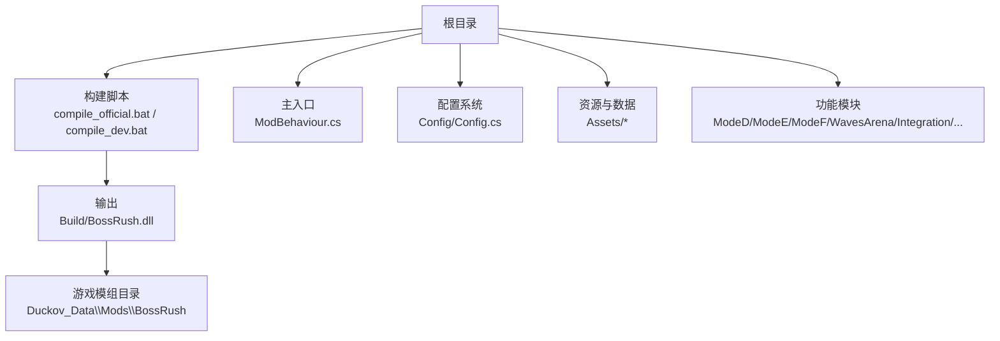
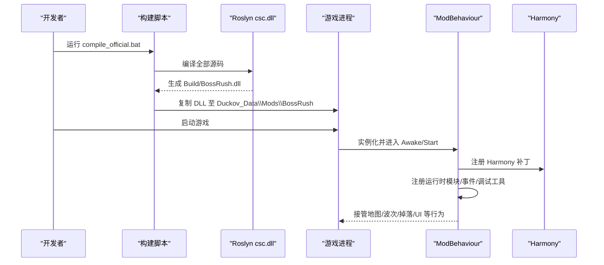
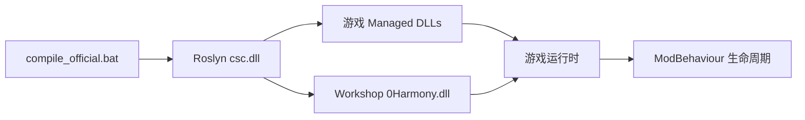

# 快速开始

<cite>
**本文引用的文件**
- [README.md](file://README.md)
- [AGENTS.md](file://AGENTS.md)
- [compile_official.bat](file://compile_official.bat)
- [compile_dev.bat](file://compile_dev.bat)
- [test_bossrush_official.bat](file://test_bossrush_official.bat)
- `info.ini`（本机制品，不随源码纳管）
- [Config.cs](file://Config/Config.cs)
- [ModBehaviour.cs](file://ModBehaviour.cs)
</cite>

## 目录
1. [简介](#简介)
2. [项目结构](#项目结构)
3. [核心组件](#核心组件)
4. [架构总览](#架构总览)
5. [详细组件分析](#详细组件分析)
6. [依赖关系分析](#依赖关系分析)
7. [性能注意事项](#性能注意事项)
8. [故障排查指南](#故障排查指南)
9. [结论](#结论)
10. [附录：热键与验证清单](#附录热键与验证清单)

## 简介
本快速开始面向首次接触 BossRushMod 的新用户，目标是在 Windows 环境下尽快完成环境准备、编译、部署与基础验证，并掌握常用调试热键。BossRushMod 是《Escape from Duckov》的大型 Unity Mod，以 BossRush 竞技场为核心，扩展多模式玩法、自定义 Boss/NPC/装备、成就、重铸、游戏内 Wiki、本地化与运行时稳定性修复等能力。

## 项目结构
仓库采用按功能域划分的目录组织方式，根目录包含构建脚本、入口类、配置与资源；各子系统（如 ModeD/E/F、Integration、WavesArena、Achievement、ZombieMode 等）职责清晰。构建产物为 `Build/BossRush.dll`，并通过脚本自动复制到游戏模组加载路径。

图表来源
- [compile_official.bat:40-66](file://compile_official.bat#L40-L66)
- [compile_official.bat:622-666](file://compile_official.bat#L622-L666)
- [ModBehaviour.cs:24-35](file://ModBehaviour.cs#L24-L35)

章节来源
- [README.md:15-24](file://README.md#L15-L24)
- [AGENTS.md:25-45](file://AGENTS.md#L25-L45)

## 核心组件
- 构建与部署
  - `compile_official.bat`：使用 .NET SDK 的 Roslyn `csc.dll` 编译全部源码，生成 `Build/BossRush.dll`，并尝试自动部署到游戏模组目录。
  - `compile_dev.bat`：在官方编译基础上启用开发宏，便于开启调试日志。
  - `test_bossrush_official.bat`：一键执行逻辑测试、编译、Wiki 内容同步与部署。
- 运行入口
  - `ModBehaviour.cs`：Unity 生命周期钩子、场景门控、模式状态机、Harmony 注册、调试工具初始化等。
- 配置
  - `Config/Config.cs`：读取 `StreamingAssets/BossRushModConfig.txt`，提供波次间隔、掉落策略、Boss 倍率、无间炼狱参数、成就热键等开关。
- 元信息
  - `info.ini`：Steam 创意工坊元信息（名称、描述、版本、标签、发布 ID）。

章节来源
- [compile_official.bat:40-105](file://compile_official.bat#L40-L105)
- [compile_official.bat:622-666](file://compile_official.bat#L622-L666)
- [compile_dev.bat:1-6](file://compile_dev.bat#L1-L6)
- [test_bossrush_official.bat:24-102](file://test_bossrush_official.bat#L24-L102)
- [ModBehaviour.cs:24-35](file://ModBehaviour.cs#L24-L35)
- [Config/Config.cs:36-81](file://Config/Config.cs#L36-L81)
- `info.ini`（本机制品，不随源码纳管）

## 架构总览
下图展示从“双击运行”到“游戏内生效”的关键链路：构建脚本调用 Roslyn 编译器生成 DLL，随后复制到游戏模组目录；游戏启动后由 Unity 加载 ModBehaviour，完成运行时模块注册、Harmony 补丁注入、场景门控与调试工具初始化。

图表来源
- [compile_official.bat:40-105](file://compile_official.bat#L40-L105)
- [compile_official.bat:622-666](file://compile_official.bat#L622-L666)
- [ModBehaviour.cs:598-620](file://ModBehaviour.cs#L598-L620)
- [ModBehaviour.cs:758-780](file://ModBehaviour.cs#L758-L780)

## 详细组件分析

### 环境与前置条件（Windows）
- 操作系统：Windows
- .NET SDK：已安装且可在 `C:\Program Files\dotnet\sdk` 下找到 Roslyn `csc.dll`
- 游戏目录：存在 `Duckov_Data\Managed\Assembly-CSharp.dll`
- Workshop/Harmony：存在 `workshop/content/3167020/<HarmonyModId>/0Harmony.dll`
- 工作目录：位于仓库根目录

说明
- 构建脚本会尝试自动探测游戏目录与 Workshop 路径；若失败，可设置环境变量 `GAME_PATH` 与 `WORKSHOP_PATH`。
- 新增 `.cs` 文件必须加入 `compile_official.bat` 源码列表，否则不会参与编译。

章节来源
- [compile_official.bat:16-33](file://compile_official.bat#L16-L33)
- [compile_official.bat:43-59](file://compile_official.bat#L43-L59)
- [compile_official.bat:668-708](file://compile_official.bat#L668-L708)
- [AGENTS.md:49-67](file://AGENTS.md#L49-L67)

### 首次编译流程（推荐）
- 打开命令提示符或 PowerShell，进入仓库根目录。
- 执行一键构建与部署：
  - `test_bossrush_official.bat`
  - 该脚本会依次执行：逻辑测试 → 编译 → Wiki 内容同步（可选）→ 创建模组目录 → 复制 DLL 与 JSON 数据。
- 若仅需编译：
  - `compile_official.bat`
- 若需开发模式（启用调试宏）：
  - `compile_dev.bat`

成功标志
- 控制台输出“Build succeeded!”，并在 `Build/BossRush.dll` 生成产物。
- 自动部署成功后，会在游戏模组目录看到对应 DLL 与 JSON 数据。

章节来源
- [test_bossrush_official.bat:24-102](file://test_bossrush_official.bat#L24-L102)
- [compile_official.bat:40-66](file://compile_official.bat#L40-L66)
- [compile_official.bat:622-666](file://compile_official.bat#L622-L666)
- [compile_dev.bat:1-6](file://compile_dev.bat#L1-L6)

### 安装部署方法
- 自动部署：`compile_official.bat` 成功后会尝试将 `Build/BossRush.dll` 复制到 `Duckov_Data\Mods\BossRush\BossRush.dll`，并同步 `Assets/SpawnPoints/*.json` 与 `Assets/Data/*.json`。
- 手动部署：将 `Build/BossRush.dll` 复制到游戏模组目录，并确保 JSON 数据文件存在于对应路径。
- Steam 创意工坊：通过 `info.ini` 中的 `publishedFileId` 进行发布管理。

章节来源
- [compile_official.bat:622-666](file://compile_official.bat#L622-L666)
- `info.ini`（本机制品，不随源码纳管）

### 基础验证步骤
- 启动游戏，进入任意支持地图或 BossRush 相关入口。
- 观察是否出现 BossRush 相关 UI、掉落、波次行为与本地化文本。
- 如需快速体验：
  - 使用调试热键发放船票并打开地图选择（见附录）。
- 建议再运行一次 `test_bossrush_smoke_manual.bat` 中的检查项，覆盖不同模式的入口、战斗、奖励与清理流程。

章节来源
- [README.md:160-168](file://README.md#L160-L168)
- [test_bossrush_smoke_manual.bat:84-102](file://test_bossrush_smoke_manual.bat#L84-L102)

### 配置与调参
- 配置文件路径：`StreamingAssets/BossRushModConfig.txt`
- 关键键名（节选）
  - `waveIntervalSeconds`：波次间休息时间（秒）
  - `enableRandomBossLoot`：是否启用 Boss 随机掉落加成
  - `useLegacyBossLootProbabilities`：标准 Boss 战利品箱是否使用原版概率区间
  - `useInteractBetweenWaves`：是否改为手动交互开下一波
  - `lootBoxBlocksBullets`：掉落箱是否可作为掩体挡子弹
  - `infiniteHellBossesPerWave`：无间炼狱每波 Boss 数
  - `bossStatMultiplier`：Boss 全局数值倍率
  - `modeDEnemiesPerWave`：白手起家每波敌人数
  - `disabledBosses`：被禁用的 Boss 列表
  - `achievementHotkey`：成就面板热键（默认 L）
  - `enableDeathWraithSystem`：死亡亡魂系统开关
  - `milestoneRestBonusSeconds`：每 5 波额外休息时间（秒）
- 读取与保存：由 `Config/Config.cs` 负责从 JSON 文件加载与回写，并提供默认值校验。

章节来源
- [README.md:123-149](file://README.md#L123-L149)
- [Config/Config.cs:36-81](file://Config/Config.cs#L36-L81)
- [Config/Config.cs:98-116](file://Config/Config.cs#L98-L116)
- [Config/Config.cs:155-200](file://Config/Config.cs#L155-L200)

### 调试热键使用说明
- F2：打开/关闭物品生成器
- F3：统一调试作弊面板（传送、属性调参、物品、加钱、清冷却等）
- F4：清空成就数据
- F5：输出附近建筑/对象信息
- F6：切换放置模式
- F7：输出最近交互点信息
- F8：输出附近角色信息
- F9：发放 BossRush 船票并打开地图选择
- F10：强制清场并触发通关流程
- F11：打开背包检视器
- F12：打开/关闭 NPC 传送 UI
- Ctrl+F10：打开/关闭 BossFilter
- L：默认成就面板热键

章节来源
- [README.md:226-245](file://README.md#L226-L245)

## 依赖关系分析
- 构建期依赖
  - .NET SDK（Roslyn `csc.dll`）
  - 游戏程序集：`Duckov_Data\Managed` 下的 Unity 与游戏 DLL
  - Harmony：来自 Steam Workshop 的 `0Harmony.dll`
- 运行期依赖
  - Unity Mono 运行时
  - 游戏场景与资源（地图、Prefab、AssetBundle）
  - 本地化系统与存档系统（JSON/序列化）

图表来源
- [compile_official.bat:43-105](file://compile_official.bat#L43-L105)
- [ModBehaviour.cs:598-620](file://ModBehaviour.cs#L598-L620)

章节来源
- [compile_official.bat:43-105](file://compile_official.bat#L43-L105)
- [AGENTS.md:49-67](file://AGENTS.md#L49-L67)

## 性能注意事项
- 构建阶段
  - 新增 `.cs` 文件必须登记到 `compile_official.bat`，避免遗漏导致运行时缺失功能。
- 运行阶段
  - 大量 Harmony 补丁与反射绑定仅在运行时生效，编译通过不代表无异常；建议在真实游戏中进行 smoke 测试。
  - 关注场景门控与缓存复用，避免每帧重复查找对象。
  - 对高频路径（如敌人恢复监控、现金磁铁吸附）保持轻量实现。

章节来源
- [README.md:160-168](file://README.md#L160-L168)
- [AGENTS.md:96-127](file://AGENTS.md#L96-L127)

## 故障排查指南
- 找不到 .NET SDK 或 Roslyn
  - 确认 `C:\Program Files\dotnet\sdk` 存在且包含 `Roslyn\bincore\csc.dll`。
  - 若路径不同，请修改 `compile_official.bat` 中对应位置。
- 找不到游戏目录或 Workshop 路径
  - 设置环境变量 `GAME_PATH` 与 `WORKSHOP_PATH`，确保指向正确路径。
  - 脚本会自动探测常见路径，但非标准安装需手动指定。
- 自动部署失败
  - 检查游戏模组目录是否存在写入权限；必要时手动复制 `Build/BossRush.dll` 与 JSON 数据。
- 编译成功但运行异常
  - 运行 `test_bossrush_smoke_manual.bat` 的检查清单逐项验证。
  - 关注 Harmony 补丁与字符串反射绑定，官方更新可能导致静默失效。
- 配置未生效
  - 检查 `StreamingAssets/BossRushModConfig.txt` 是否存在且格式正确。
  - 核对键名与取值范围，参考 `Config/Config.cs` 中的默认值与校验逻辑。

章节来源
- [compile_official.bat:43-59](file://compile_official.bat#L43-L59)
- [compile_official.bat:668-708](file://compile_official.bat#L668-L708)
- [compile_official.bat:622-666](file://compile_official.bat#L622-L666)
- [README.md:160-168](file://README.md#L160-L168)
- [Config/Config.cs:155-200](file://Config/Config.cs#L155-L200)

## 结论
通过本指南，你可以在 Windows 环境下快速完成 BossRushMod 的环境搭建、编译与部署，并使用内置调试热键进行基础验证。遇到构建或运行时问题时，优先对照“故障排查指南”定位问题；对于复杂变更，建议结合 Python 守卫脚本与游戏内 smoke 测试进行回归验证。

## 附录：热键与验证清单
- 常用热键
  - F2/F3/F4/F5/F6/F7/F8/F9/F10/F11/F12/Ctrl+F10/L
- 快速验证清单
  - 进入 BossRush 地图，确认波次与掉落正常
  - 打开/关闭调试菜单，确认功能可用
  - 切换不同模式（如 Mode D/E/F），确认入口、UI 与清理流程
  - 检查本地化文本与成就面板是否正常显示

章节来源
- [README.md:226-245](file://README.md#L226-L245)
- [test_bossrush_smoke_manual.bat:84-102](file://test_bossrush_smoke_manual.bat#L84-L102)