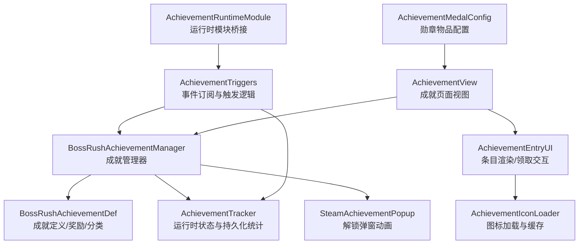
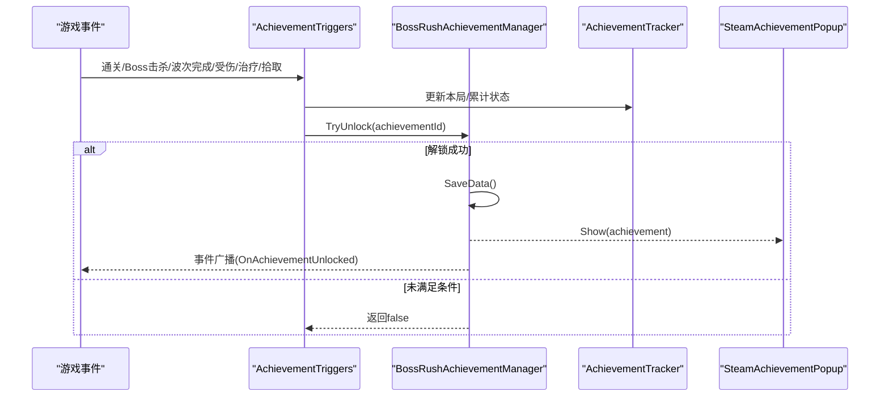
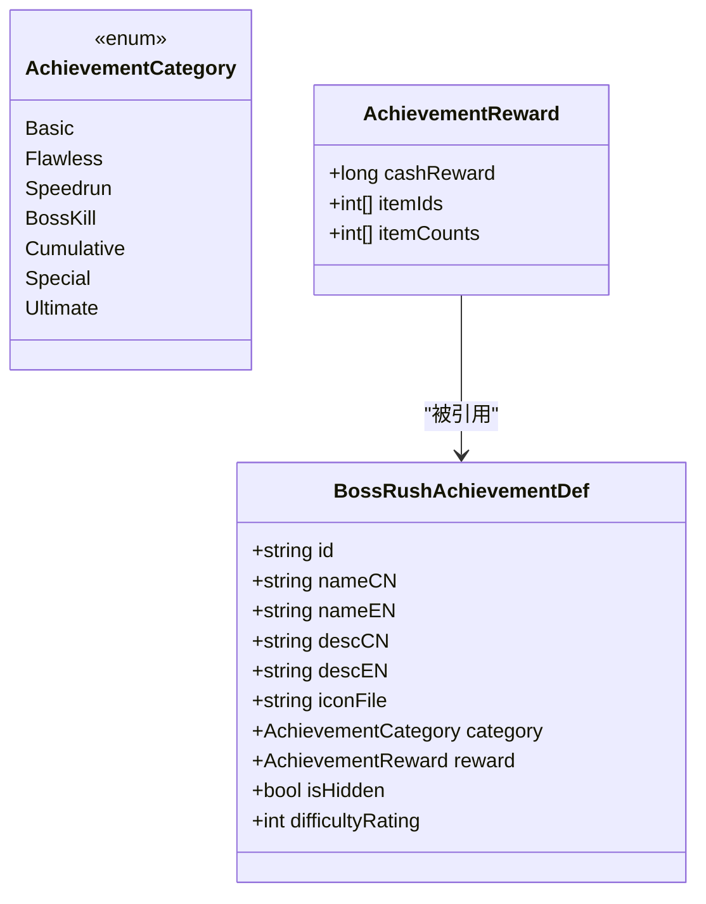
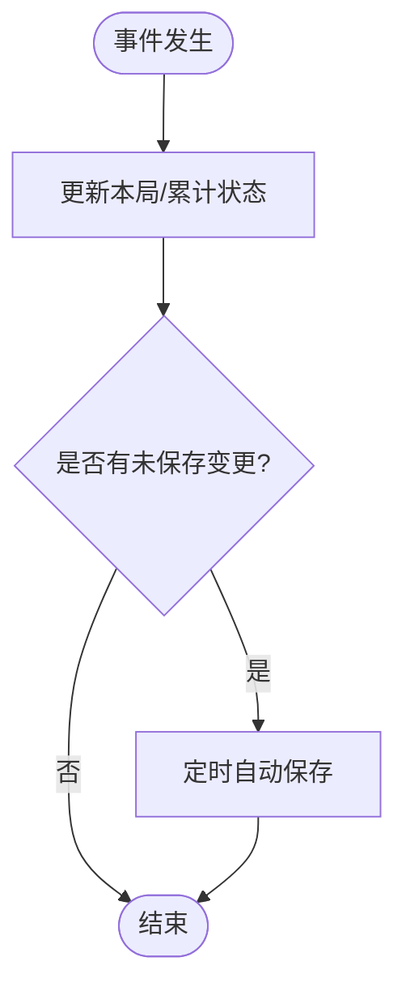
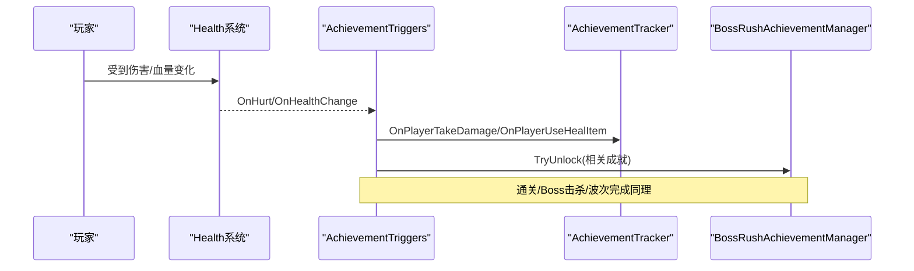
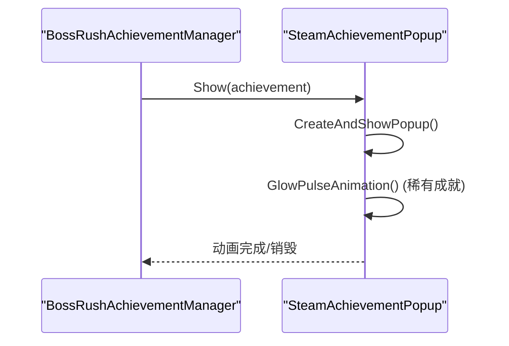
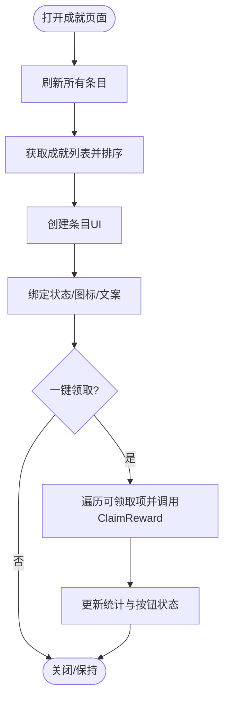
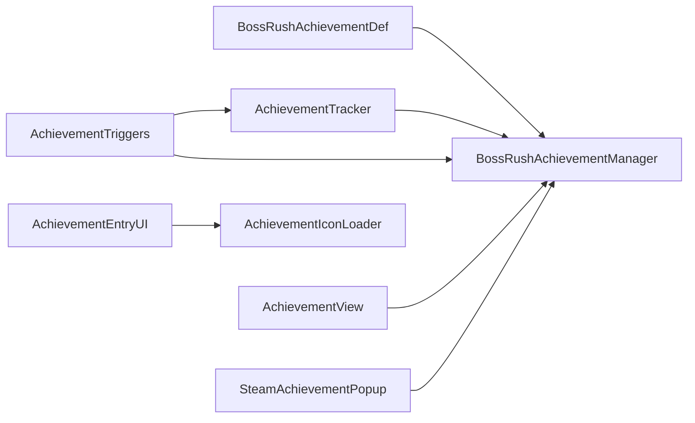

# 成就系统

<cite>
**本文引用的文件**
- [BossRushAchievementManager.cs](file://Achievement/BossRushAchievementManager.cs)
- [BossRushAchievementDef.cs](file://Achievement/BossRushAchievementDef.cs)
- [AchievementTracker.cs](file://Achievement/AchievementTracker.cs)
- [AchievementTriggers.cs](file://Achievement/AchievementTriggers.cs)
- [SteamAchievementPopup.cs](file://Achievement/SteamAchievementPopup.cs)
- [AchievementView.cs](file://Achievement/AchievementView.cs)
- [AchievementEntryUI.cs](file://Achievement/AchievementEntryUI.cs)
- [AchievementIconLoader.cs](file://Achievement/AchievementIconLoader.cs)
- [AchievementMedalConfig.cs](file://Achievement/AchievementMedalConfig.cs)
- [AchievementRuntimeModule.cs](file://Achievement/AchievementRuntimeModule.cs)
</cite>

## 目录
1. [简介](#简介)
2. [项目结构](#项目结构)
3. [核心组件](#核心组件)
4. [架构总览](#架构总览)
5. [详细组件分析](#详细组件分析)
6. [依赖关系分析](#依赖关系分析)
7. [性能与扩展性](#性能与扩展性)
8. [故障排查指南](#故障排查指南)
9. [结论](#结论)
10. [附录：API、数据模型与最佳实践](#附录api数据模型与最佳实践)

## 简介
本模块为 BossRush 模式下的“成就系统”，提供完整的成就定义、触发器集成、进度追踪、持久化存储、跨会话同步、解锁动画与 UI 展示。系统支持 Steam 风格弹窗，具备分类管理（基础完成类、累计统计类、特殊挑战类等），并提供可扩展的 API 与开发指南，便于新增自定义成就。

## 项目结构
成就系统位于 Achievement 目录下，按职责划分为：
- 管理与定义：BossRushAchievementManager、BossRushAchievementDef
- 运行时追踪：AchievementTracker、AchievementTriggers
- 表现层：SteamAchievementPopup、AchievementView、AchievementEntryUI
- 资源与配置：AchievementIconLoader、AchievementMedalConfig
- 生命周期：AchievementRuntimeModule

图表来源
- [BossRushAchievementManager.cs:16-60](file://Achievement/BossRushAchievementManager.cs#L16-L60)
- [BossRushAchievementDef.cs:12-86](file://Achievement/BossRushAchievementDef.cs#L12-L86)
- [AchievementTracker.cs:14-91](file://Achievement/AchievementTracker.cs#L14-L91)
- [AchievementTriggers.cs:28-87](file://Achievement/AchievementTriggers.cs#L28-L87)
- [SteamAchievementPopup.cs:19-150](file://Achievement/SteamAchievementPopup.cs#L19-L150)
- [AchievementView.cs:22-126](file://Achievement/AchievementView.cs#L22-L126)
- [AchievementEntryUI.cs:32-145](file://Achievement/AchievementEntryUI.cs#L32-L145)
- [AchievementIconLoader.cs:17-124](file://Achievement/AchievementIconLoader.cs#L17-L124)
- [AchievementMedalConfig.cs:20-233](file://Achievement/AchievementMedalConfig.cs#L20-L233)
- [AchievementRuntimeModule.cs:3-31](file://Achievement/AchievementRuntimeModule.cs#L3-L31)

章节来源
- [BossRushAchievementManager.cs:16-60](file://Achievement/BossRushAchievementManager.cs#L16-L60)
- [AchievementView.cs:22-126](file://Achievement/AchievementView.cs#L22-L126)

## 核心组件
- 成就管理器：负责注册成就、解锁判定、奖励发放、存档读写、事件广播。
- 成就定义：描述成就 ID、名称、描述、分类、奖励、难度评级、隐藏属性等。
- 追踪器：记录本局状态（是否受伤、时间戳、是否拾取/治疗等）与累计统计（击杀数、通关次数、最高波次、收藏掉落集合等），并实现自动/强制持久化。
- 触发器：在 ModBehaviour 中订阅游戏事件（受伤、拾取、血量变化、Boss 击杀、通关、无间炼狱波次等），驱动成就解锁检查。
- 弹窗：复刻 Steam 风格解锁弹窗，支持多弹窗堆叠、稀有成就光效、滑入滑出动画、音效播放。
- UI 视图：成就列表页，支持排序、统计、一键领取、本地化文本。
- 图标加载：统一 AssetBundle 加载与缓存，避免重复加载冲突。
- 勋章物品：可使用的非消耗物品，用于打开成就界面。

章节来源
- [BossRushAchievementManager.cs:239-373](file://Achievement/BossRushAchievementManager.cs#L239-L373)
- [BossRushAchievementDef.cs:12-86](file://Achievement/BossRushAchievementDef.cs#L12-L86)
- [AchievementTracker.cs:23-49](file://Achievement/AchievementTracker.cs#L23-L49)
- [AchievementTriggers.cs:150-368](file://Achievement/AchievementTriggers.cs#L150-L368)
- [SteamAchievementPopup.cs:121-150](file://Achievement/SteamAchievementPopup.cs#L121-L150)
- [AchievementView.cs:607-727](file://Achievement/AchievementView.cs#L607-L727)
- [AchievementIconLoader.cs:37-124](file://Achievement/AchievementIconLoader.cs#L37-L124)
- [AchievementMedalConfig.cs:240-277](file://Achievement/AchievementMedalConfig.cs#L240-L277)

## 架构总览
成就系统采用“定义 + 追踪 + 触发 + 表现”的分层设计：
- 定义层：通过管理器集中注册成就定义，包含分类、奖励、难度评级、隐藏标记。
- 追踪层：运行时记录玩家行为与累计数据，支持自动保存与跨会话恢复。
- 触发层：在游戏关键节点（通关、Boss 击杀、波次完成、伤害/治疗/拾取）调用管理器尝试解锁。
- 表现层：解锁时弹出 Steam 风格弹窗；UI 页面展示全部成就、统计与一键领取。

图表来源
- [AchievementTriggers.cs:150-368](file://Achievement/AchievementTriggers.cs#L150-L368)
- [BossRushAchievementManager.cs:244-264](file://Achievement/BossRushAchievementManager.cs#L244-L264)
- [SteamAchievementPopup.cs:121-150](file://Achievement/SteamAchievementPopup.cs#L121-L150)

## 详细组件分析

### 成就定义与分类
- 分类枚举：基础完成类、无伤通关类、速通类、Boss 击杀类、累计统计类、特殊挑战类、终极成就。
- 奖励结构：现金奖励与可选物品奖励（ID 与数量数组）。
- 隐藏成就：可通过 isHidden 控制是否在 UI 中显示。
- 难度评级：影响稀有度与弹窗特效。

图表来源
- [BossRushAchievementDef.cs:12-86](file://Achievement/BossRushAchievementDef.cs#L12-L86)

章节来源
- [BossRushAchievementDef.cs:12-86](file://Achievement/BossRushAchievementDef.cs#L12-L86)
- [BossRushAchievementManager.cs:65-235](file://Achievement/BossRushAchievementManager.cs#L65-L235)

### 进度追踪机制
- 本局状态：是否受伤、进入时间、是否拾取/治疗、特定 Boss 击杀标记。
- 累计统计：总击杀、总通关、龙王击杀数、最高无间炼狱波次、收藏掉落集合、首次使用图腾/触发逆鳞等。
- 自动保存：基于时间间隔与脏标记，减少频繁 IO。
- 强制保存：退出或离开场景时确保数据落盘。

图表来源
- [AchievementTracker.cs:95-177](file://Achievement/AchievementTracker.cs#L95-L177)
- [AchievementTracker.cs:276-384](file://Achievement/AchievementTracker.cs#L276-L384)

章节来源
- [AchievementTracker.cs:23-49](file://Achievement/AchievementTracker.cs#L23-L49)
- [AchievementTracker.cs:95-177](file://Achievement/AchievementTracker.cs#L95-L177)
- [AchievementTracker.cs:276-384](file://Achievement/AchievementTracker.cs#L276-L384)

### 触发器系统与事件集成
- 订阅事件：玩家受伤、物品拾取、血量变化（检测治疗）、Boss 击杀、通关、无间炼狱波次完成。
- 去重处理：Boss 击杀按角色实例去重，避免重复计数。
- 条件判断：根据当前模式与状态（如 Mode D、无间炼狱）触发对应成就。
- 速通成就：依据会话耗时解锁不同阈值成就。

图表来源
- [AchievementTriggers.cs:371-548](file://Achievement/AchievementTriggers.cs#L371-L548)
- [AchievementTriggers.cs:150-368](file://Achievement/AchievementTriggers.cs#L150-L368)

章节来源
- [AchievementTriggers.cs:150-368](file://Achievement/AchievementTriggers.cs#L150-L368)
- [AchievementTriggers.cs:371-548](file://Achievement/AchievementTriggers.cs#L371-L548)

### Steam 风格弹窗与动画
- 多弹窗堆叠：新弹窗从下方滑入，已有弹窗上移，避免遮挡。
- 稀有成就特效：高难度或终极成就带光效脉冲与边框亮度动画。
- 资源加载：共享 Canvas、纹理与字体，支持回退默认图标。
- 音效：反射调用音频管理器播放解锁音效。

图表来源
- [SteamAchievementPopup.cs:121-150](file://Achievement/SteamAchievementPopup.cs#L121-L150)
- [SteamAchievementPopup.cs:186-255](file://Achievement/SteamAchievementPopup.cs#L186-L255)
- [SteamAchievementPopup.cs:388-490](file://Achievement/SteamAchievementPopup.cs#L388-L490)

章节来源
- [SteamAchievementPopup.cs:19-150](file://Achievement/SteamAchievementPopup.cs#L19-L150)
- [SteamAchievementPopup.cs:186-255](file://Achievement/SteamAchievementPopup.cs#L186-L255)
- [SteamAchievementPopup.cs:388-490](file://Achievement/SteamAchievementPopup.cs#L388-L490)

### UI 视图与条目渲染
- 主视图：面板布局、统计栏、滚动区域、底部一键领取。
- 条目组件：四种状态（锁定、隐藏锁定、已解锁未领取、已解锁已领取），动态进度显示（累计类成就）。
- 排序规则：已完成优先，隐藏成就置后，同分类按难度排序。
- 本地化：标题、按钮文案、隐藏提示等支持中英文切换。

图表来源
- [AchievementView.cs:607-727](file://Achievement/AchievementView.cs#L607-L727)
- [AchievementEntryUI.cs:307-356](file://Achievement/AchievementEntryUI.cs#L307-L356)
- [AchievementEntryUI.cs:370-474](file://Achievement/AchievementEntryUI.cs#L370-L474)

章节来源
- [AchievementView.cs:607-727](file://Achievement/AchievementView.cs#L607-L727)
- [AchievementEntryUI.cs:307-356](file://Achievement/AchievementEntryUI.cs#L307-L356)
- [AchievementEntryUI.cs:370-474](file://Achievement/AchievementEntryUI.cs#L370-L474)

### 图标加载与缓存
- 单例服务：统一管理 AssetBundle 加载，避免重复加载冲突。
- 缓存策略：Sprite 与 Texture2D 双缓存，提升渲染性能。
- 回退机制：找不到指定图标时使用默认图标。

章节来源
- [AchievementIconLoader.cs:17-124](file://Achievement/AchievementIconLoader.cs#L17-L124)
- [AchievementIconLoader.cs:130-280](file://Achievement/AchievementIconLoader.cs#L130-L280)

### 勋章物品与入口
- 物品配置：非消耗耐久度，注册到 ItemFactory，注入本地化。
- 使用行为：右键打开成就界面，不消耗物品。

章节来源
- [AchievementMedalConfig.cs:20-233](file://Achievement/AchievementMedalConfig.cs#L20-L233)
- [AchievementMedalConfig.cs:240-277](file://Achievement/AchievementMedalConfig.cs#L240-L277)

## 依赖关系分析
- 管理器依赖定义与追踪器，并通过事件总线广播解锁事件。
- 触发器依赖追踪器与管理器，订阅游戏事件以驱动解锁逻辑。
- UI 视图依赖管理器查询状态与数据，条目组件依赖图标加载器。
- 弹窗依赖管理器提供的成就定义，进行视觉呈现。

图表来源
- [BossRushAchievementManager.cs:239-373](file://Achievement/BossRushAchievementManager.cs#L239-L373)
- [AchievementTriggers.cs:150-368](file://Achievement/AchievementTriggers.cs#L150-L368)
- [AchievementView.cs:607-727](file://Achievement/AchievementView.cs#L607-L727)
- [AchievementEntryUI.cs:481-520](file://Achievement/AchievementEntryUI.cs#L481-L520)
- [SteamAchievementPopup.cs:121-150](file://Achievement/SteamAchievementPopup.cs#L121-L150)

章节来源
- [BossRushAchievementManager.cs:239-373](file://Achievement/BossRushAchievementManager.cs#L239-L373)
- [AchievementTriggers.cs:150-368](file://Achievement/AchievementTriggers.cs#L150-L368)
- [AchievementView.cs:607-727](file://Achievement/AchievementView.cs#L607-L727)
- [AchievementEntryUI.cs:481-520](file://Achievement/AchievementEntryUI.cs#L481-L520)
- [SteamAchievementPopup.cs:121-150](file://Achievement/SteamAchievementPopup.cs#L121-L150)

## 性能与扩展性
- 自动保存节流：避免每次击杀都写盘，降低 IO 压力。
- 图标缓存：Sprite/Texture 缓存减少重复加载。
- 弹窗复用：共享 Canvas 与缓冲列表，减少每帧分配。
- 扩展点：
  - 新增成就：在管理器中注册定义，并在触发器中添加相应检查逻辑。
  - 自定义触发：在合适的事件回调中调用追踪器与管理器。
  - 自定义奖励：在定义中配置现金与物品奖励。
  - 自定义 UI：扩展条目或视图以展示额外信息。

[本节为通用指导，无需具体文件来源]

## 故障排查指南
- 成就未解锁：
  - 检查触发器是否正确订阅事件并调用追踪器/管理器。
  - 确认条件判断（如 Mode D、无间炼狱、是否受伤/治疗）符合预期。
- 数据丢失：
  - 检查自动保存与强制保存是否被调用。
  - 查看存档键值是否存在异常。
- 弹窗不显示：
  - 确认弹窗实例已创建且共享 Canvas 存在。
  - 检查图标与音效资源路径是否正确。
- UI 异常：
  - 检查条目状态绑定与排序逻辑。
  - 确认本地化文本注入成功。

章节来源
- [AchievementTriggers.cs:520-572](file://Achievement/AchievementTriggers.cs#L520-L572)
- [AchievementTracker.cs:276-384](file://Achievement/AchievementTracker.cs#L276-L384)
- [SteamAchievementPopup.cs:156-182](file://Achievement/SteamAchievementPopup.cs#L156-L182)
- [AchievementView.cs:607-727](file://Achievement/AchievementView.cs#L607-L727)

## 结论
该成就系统以清晰的层次划分与模块化设计，实现了从定义、追踪、触发到表现的完整闭环。通过自动保存与跨会话同步保证数据一致性，Steam 风格弹窗与 UI 提供良好的用户体验。系统具备良好的扩展性，开发者可便捷地添加新成就、自定义触发与奖励，以及扩展 UI 与资源。

[本节为总结，无需具体文件来源]

## 附录：API、数据模型与最佳实践

### 主要 API
- 初始化与注册
  - 管理器初始化：Initialize
  - 注册成就：Register（内部方法，供管理器使用）
- 解锁与查询
  - TryUnlock(achievementId)
  - IsUnlocked(achievementId)
  - GetAchievement(id)/GetAllAchievements()/GetAchievementsByCategory(category)
  - CheckCompletionistAchievement()
- 奖励领取
  - ClaimReward(achievementId)
  - IsRewardClaimed(achievementId)
- 统计数据
  - GetStats()/GetTotalRewardCash()/GetClaimedRewardCash()
- 追踪器
  - Initialize()/ResetSessionStats()
  - OnPlayerTakeDamage()/OnPlayerPickupItem()/OnPlayerUseHealItem()
  - OnBossKilled(bossType)/OnInfiniteHellWaveComplete(wave)/OnClear()
  - OnCollectDragonDescendantLoot(itemTypeId)/OnCollectDragonKingLoot(itemTypeId)
  - OnUseFlightTotem()/OnTriggerReverseScale()
  - SaveStats()/ForceSave()/LoadStats()
- 弹窗
  - EnsureInstance()/Show(achievement)
- UI
  - AchievementView.Open()/Close()/Toggle()/Refresh()/ClaimAllRewards()
  - AchievementEntryUI.Create(parent, def)/Setup(def)/TryClaim()/Refresh()
- 图标加载
  - AchievementIconLoader.GetSprite(name)/GetTexture(name)/ClearCache()/Unload()

章节来源
- [BossRushAchievementManager.cs:41-60](file://Achievement/BossRushAchievementManager.cs#L41-L60)
- [BossRushAchievementManager.cs:239-373](file://Achievement/BossRushAchievementManager.cs#L239-L373)
- [AchievementTracker.cs:65-91](file://Achievement/AchievementTracker.cs#L65-L91)
- [AchievementTracker.cs:95-177](file://Achievement/AchievementTracker.cs#L95-L177)
- [AchievementTracker.cs:276-384](file://Achievement/AchievementTracker.cs#L276-L384)
- [SteamAchievementPopup.cs:121-150](file://Achievement/SteamAchievementPopup.cs#L121-L150)
- [AchievementView.cs:607-727](file://Achievement/AchievementView.cs#L607-L727)
- [AchievementEntryUI.cs:103-145](file://Achievement/AchievementEntryUI.cs#L103-L145)
- [AchievementEntryUI.cs:307-356](file://Achievement/AchievementEntryUI.cs#L307-L356)
- [AchievementIconLoader.cs:37-124](file://Achievement/AchievementIconLoader.cs#L37-L124)

### 数据模型
- 成就定义：包含 ID、名称、描述、分类、奖励、隐藏标记、难度评级。
- 奖励：现金与物品数组（ID 与数量）。
- 追踪器状态：本局布尔标志与时间戳；累计整数与集合（掉落类型）。

章节来源
- [BossRushAchievementDef.cs:12-86](file://Achievement/BossRushAchievementDef.cs#L12-L86)
- [AchievementTracker.cs:23-49](file://Achievement/AchievementTracker.cs#L23-L49)

### 最佳实践
- 新增成就步骤
  - 在管理器中注册成就定义（ID、名称、描述、分类、奖励、难度、隐藏）。
  - 在触发器中添加相应检查逻辑（通关、Boss 击杀、波次完成、状态判定）。
  - 如需 UI 进度显示，在条目组件中扩展描述文本。
  - 准备图标资源并确保图标加载器可访问。
- 性能建议
  - 使用追踪器的自动保存机制，避免频繁写盘。
  - 使用图标加载器的缓存，减少重复加载。
  - 弹窗动画使用增量更新与缓冲，避免每帧分配。
- 稳定性建议
  - 所有外部调用包裹 try/catch，防止异常中断流程。
  - 对缺失资源进行回退处理（默认图标、默认音效）。
  - 在场景切换或退出时强制保存统计数据。

章节来源
- [BossRushAchievementManager.cs:65-235](file://Achievement/BossRushAchievementManager.cs#L65-L235)
- [AchievementTriggers.cs:150-368](file://Achievement/AchievementTriggers.cs#L150-L368)
- [AchievementEntryUI.cs:370-474](file://Achievement/AchievementEntryUI.cs#L370-L474)
- [AchievementIconLoader.cs:130-280](file://Achievement/AchievementIconLoader.cs#L130-L280)
- [SteamAchievementPopup.cs:494-597](file://Achievement/SteamAchievementPopup.cs#L494-L597)