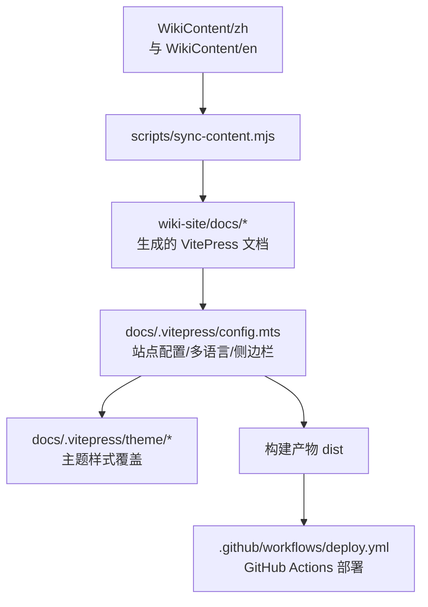
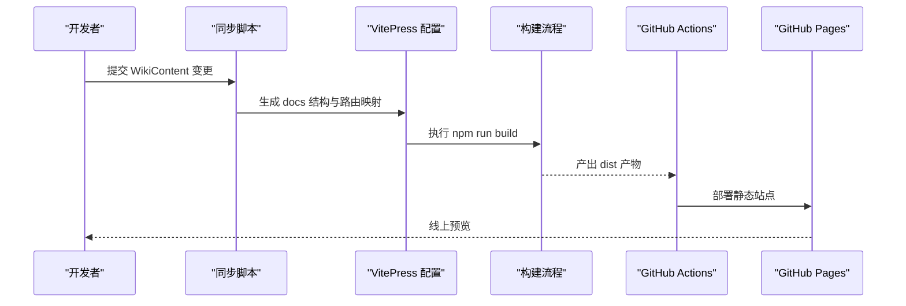
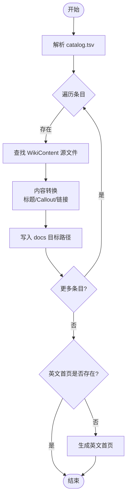
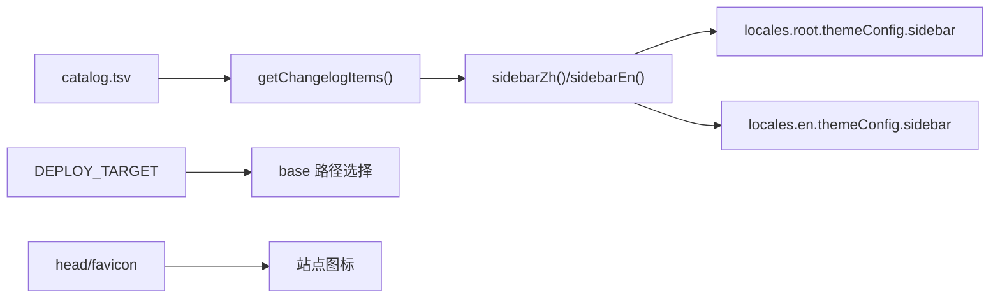
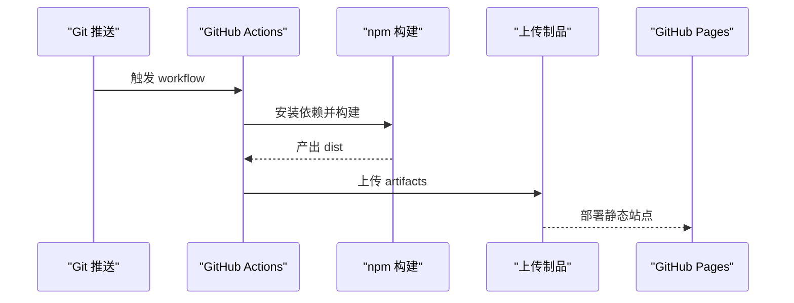
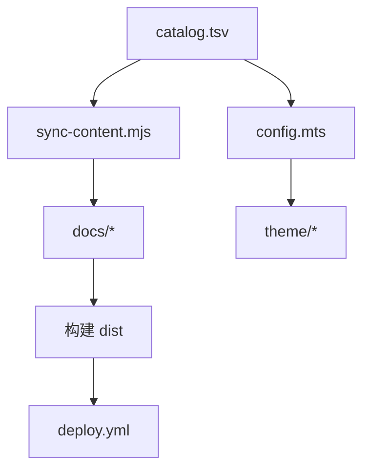

# 在线 Wiki 站点

<cite>
**本文引用的文件**
- [wiki-site/package.json](file://wiki-site/package.json)
- [wiki-site/scripts/sync-content.mjs](file://wiki-site/scripts/sync-content.mjs)
- [wiki-site/docs/.vitepress/config.mts](file://wiki-site/docs/.vitepress/config.mts)
- [wiki-site/docs/.vitepress/theme/index.ts](file://wiki-site/docs/.vitepress/theme/index.ts)
- [wiki-site/docs/.vitepress/theme/style.css](file://wiki-site/docs/.vitepress/theme/style.css)
- [WikiContent/catalog.tsv](file://WikiContent/catalog.tsv)
- [wiki-site/.github/workflows/deploy.yml](file://wiki-site/.github/workflows/deploy.yml)
</cite>

## 目录
1. [简介](#简介)
2. [项目结构](#项目结构)
3. [核心组件](#核心组件)
4. [架构总览](#架构总览)
5. [详细组件分析](#详细组件分析)
6. [依赖关系分析](#依赖关系分析)
7. [性能与 SEO 优化](#性能与-seo-优化)
8. [故障排查指南](#故障排查指南)
9. [结论](#结论)
10. [附录：编写规范与维护实践](#附录编写规范与维护实践)

## 简介
本仓库包含一个基于 VitePress 的在线 Wiki 站点，用于为 BossRush Mod 提供中英文双语文档。内容以 Markdown 形式维护在 WikiContent 目录中，通过同步脚本生成 VitePress 可构建的 docs 结构；站点配置、主题定制、多语言导航与侧边栏由 VitePress 配置统一管理；自动化部署通过 GitHub Actions 完成，支持 GitHub Pages（并可适配 Cloudflare Pages）。

## 项目结构
- wiki-site：VitePress 站点工程，包含配置、主题、脚本与包管理。
- WikiContent：权威内容源，按语言分 zh/en，并通过 catalog.tsv 统一编排条目与顺序。
- .github/workflows：GitHub Actions 工作流，负责构建与发布。

图表来源
- [wiki-site/scripts/sync-content.mjs:1-259](file://wiki-site/scripts/sync-content.mjs#L1-L259)
- [wiki-site/docs/.vitepress/config.mts:1-371](file://wiki-site/docs/.vitepress/config.mts#L1-L371)
- [wiki-site/docs/.vitepress/theme/style.css:1-67](file://wiki-site/docs/.vitepress/theme/style.css#L1-L67)
- [wiki-site/.github/workflows/deploy.yml:1-55](file://wiki-site/.github/workflows/deploy.yml#L1-L55)

章节来源
- [wiki-site/package.json:1-14](file://wiki-site/package.json#L1-L14)
- [wiki-site/scripts/sync-content.mjs:1-259](file://wiki-site/scripts/sync-content.mjs#L1-L259)
- [wiki-site/docs/.vitepress/config.mts:1-371](file://wiki-site/docs/.vitepress/config.mts#L1-L371)
- [wiki-site/docs/.vitepress/theme/style.css:1-67](file://wiki-site/docs/.vitepress/theme/style.css#L1-L67)
- [WikiContent/catalog.tsv:1-103](file://WikiContent/catalog.tsv#L1-L103)
- [wiki-site/.github/workflows/deploy.yml:1-55](file://wiki-site/.github/workflows/deploy.yml#L1-L55)

## 核心组件
- 内容同步脚本：将 WikiContent 中的 Markdown 转换为 VitePress 文档结构，并自动进行标题层级提升、Callout 转换与链接清理。
- VitePress 配置：定义站点标题、基础路径、多语言（中文根路径、英文 /en）、导航、侧边栏、搜索、社交链接与页脚。
- 主题定制：通过自定义 CSS 覆盖品牌色、深色模式背景、内容宽度、表格样式与提示块配色。
- 自动化部署：GitHub Actions 在推送 main 分支或手动触发时安装依赖、执行构建并上传至 GitHub Pages。

章节来源
- [wiki-site/scripts/sync-content.mjs:1-259](file://wiki-site/scripts/sync-content.mjs#L1-L259)
- [wiki-site/docs/.vitepress/config.mts:1-371](file://wiki-site/docs/.vitepress/config.mts#L1-L371)
- [wiki-site/docs/.vitepress/theme/style.css:1-67](file://wiki-site/docs/.vitepress/theme/style.css#L1-L67)
- [wiki-site/.github/workflows/deploy.yml:1-55](file://wiki-site/.github/workflows/deploy.yml#L1-L55)

## 架构总览
站点采用“单一权威源 + 同步生成”的架构：作者仅维护 WikiContent 下的 Markdown 与 catalog.tsv，构建前运行同步脚本生成 docs 结构，再由 VitePress 编译为静态站点，最后通过 Actions 部署到托管平台。

图表来源
- [wiki-site/scripts/sync-content.mjs:1-259](file://wiki-site/scripts/sync-content.mjs#L1-L259)
- [wiki-site/docs/.vitepress/config.mts:1-371](file://wiki-site/docs/.vitepress/config.mts#L1-L371)
- [wiki-site/.github/workflows/deploy.yml:1-55](file://wiki-site/.github/workflows/deploy.yml#L1-L55)

## 详细组件分析

### 内容同步脚本（sync-content.mjs）
- 职责
  - 解析 catalog.tsv，读取 WikiContent/zh 与 WikiContent/en 下的源文件。
  - 将源文件转换为 VitePress 文档结构，写入 wiki-site/docs 对应目录。
  - 对内容进行格式转换：标题层级提升、Callout 转换、清理本地绝对路径链接。
  - 清理受管目录与文件，确保输出干净。
  - 自动生成英文首页（若不存在）。
- 关键流程
  - 解析目录清单 → 计算路由 → 查找源文件 → 转换内容 → 写入目标路径。
  - 对 changelog 版本条目动态生成路由。

图表来源
- [wiki-site/scripts/sync-content.mjs:102-189](file://wiki-site/scripts/sync-content.mjs#L102-L189)
- [wiki-site/scripts/sync-content.mjs:191-259](file://wiki-site/scripts/sync-content.mjs#L191-L259)

章节来源
- [wiki-site/scripts/sync-content.mjs:1-259](file://wiki-site/scripts/sync-content.mjs#L1-L259)

### VitePress 配置（config.mts）
- 多语言
  - 根语言为中文，标签与语言代码已设置；英文语言位于 /en 下。
  - 导航与侧边栏分别针对中文与英文独立定义，保持结构一致。
- 侧边栏与更新日志
  - 中文与英文侧边栏函数分别返回结构化菜单。
  - 更新日志项从 catalog.tsv 动态读取并按 order 排序，链接根据 entryId 生成。
- 基础路径与环境变量
  - base 根据 DEPLOY_TARGET 环境变量切换，便于在不同平台部署（如 cloudflare 使用根路径）。
- 搜索与社交
  - 启用本地搜索，并提供中文翻译文案。
  - 社交链接指向 GitHub 仓库。
- 页脚与图标
  - 设置站点标题、描述、favicon 与页脚信息。

图表来源
- [wiki-site/docs/.vitepress/config.mts:9-43](file://wiki-site/docs/.vitepress/config.mts#L9-L43)
- [wiki-site/docs/.vitepress/config.mts:48-288](file://wiki-site/docs/.vitepress/config.mts#L48-L288)
- [wiki-site/docs/.vitepress/config.mts:291-371](file://wiki-site/docs/.vitepress/config.mts#L291-L371)

章节来源
- [wiki-site/docs/.vitepress/config.mts:1-371](file://wiki-site/docs/.vitepress/config.mts#L1-L371)

### 主题定制（theme/index.ts 与 style.css）
- 入口
  - 主题入口导入默认主题并引入自定义样式。
- 样式覆盖
  - 定义品牌主色调与渐变 Hero 背景。
  - 调整深色模式背景色。
  - 加宽内容区最大宽度，增强表格可读性。
  - 为 tip/warning 容器应用主题色边框与标题色。
  - 高亮侧边栏活跃项。

章节来源
- [wiki-site/docs/.vitepress/theme/index.ts:1-4](file://wiki-site/docs/.vitepress/theme/index.ts#L1-L4)
- [wiki-site/docs/.vitepress/theme/style.css:1-67](file://wiki-site/docs/.vitepress/theme/style.css#L1-L67)

### 自动化部署（deploy.yml）
- 触发条件
  - 推送 main 分支且路径包含 wiki-site、docs/wiki-site 或 WikiContent 时触发。
  - 支持手动触发。
- 权限与并发
  - 授予 contents、pages、id-token 权限。
  - 设置 pages 并发组，避免重复部署冲突。
- 构建步骤
  - 检出代码、安装 Node 20、缓存 npm 依赖。
  - 进入 wiki-site 目录执行 npm ci 与 npm run build。
  - 上传构建产物至 actions/upload-pages-artifact。
- 部署步骤
  - 使用 actions/deploy-pages 将产物部署到 GitHub Pages。

图表来源
- [wiki-site/.github/workflows/deploy.yml:1-55](file://wiki-site/.github/workflows/deploy.yml#L1-L55)

章节来源
- [wiki-site/.github/workflows/deploy.yml:1-55](file://wiki-site/.github/workflows/deploy.yml#L1-L55)

## 依赖关系分析
- 脚本与配置耦合点
  - sync-content.mjs 依赖 WikiContent/catalog.tsv 作为唯一权威源，决定路由与内容位置。
  - config.mts 同样读取 catalog.tsv 以生成更新日志侧边栏，保证导航与内容一致。
- 主题与样式
  - theme/index.ts 仅引入样式，不改变行为逻辑，降低耦合。
- 部署与工作流
  - deploy.yml 依赖 wiki-site 的 package.json 脚本与构建产物路径。

图表来源
- [wiki-site/scripts/sync-content.mjs:102-189](file://wiki-site/scripts/sync-content.mjs#L102-L189)
- [wiki-site/docs/.vitepress/config.mts:9-43](file://wiki-site/docs/.vitepress/config.mts#L9-L43)
- [wiki-site/.github/workflows/deploy.yml:21-55](file://wiki-site/.github/workflows/deploy.yml#L21-L55)

章节来源
- [wiki-site/scripts/sync-content.mjs:1-259](file://wiki-site/scripts/sync-content.mjs#L1-L259)
- [wiki-site/docs/.vitepress/config.mts:1-371](file://wiki-site/docs/.vitepress/config.mts#L1-L371)
- [wiki-site/.github/workflows/deploy.yml:1-55](file://wiki-site/.github/workflows/deploy.yml#L1-L55)

## 性能与 SEO 优化
- 性能
  - 使用 VitePress 静态站点生成，构建产物体积小、加载快。
  - 通过主题样式控制内容宽度与表格渲染，提升阅读体验。
  - 本地搜索减少外部请求，提高响应速度。
- SEO
  - 站点标题与描述已在配置中设置，有助于搜索引擎索引。
  - favicon 已配置，提升品牌识别度。
  - 建议在各页面 frontmatter 中添加 meta 描述与关键词（如需进一步细化）。
- 用户体验
  - 深色模式与品牌色渐变 Hero，符合游戏风格。
  - 侧边栏与导航结构清晰，中英双语一致。
  - 搜索框提供中文文案，提升易用性。

[本节为通用指导，无需特定文件引用]

## 故障排查指南
- 同步失败或缺失源文件
  - 现象：控制台输出缺失警告，对应条目被跳过。
  - 处理：检查 WikiContent 对应 entryId 的文件是否存在于正确分类目录或根目录。
  - 参考路径
    - [wiki-site/scripts/sync-content.mjs:120-128](file://wiki-site/scripts/sync-content.mjs#L120-L128)
    - [wiki-site/scripts/sync-content.mjs:163-189](file://wiki-site/scripts/sync-content.mjs#L163-L189)
- 路由映射错误
  - 现象：构建后页面 404。
  - 处理：核对 catalog.tsv 的 entryId 与 ENTRY_TO_PATH 映射是否一致；新增条目需补充映射。
  - 参考路径
    - [wiki-site/scripts/sync-content.mjs:32-99](file://wiki-site/scripts/sync-content.mjs#L32-L99)
- 更新日志未显示
  - 现象：侧边栏无更新日志项。
  - 处理：确认 catalog.tsv 中存在 changelog 类型条目，且 getChangelogItems 能正确解析。
  - 参考路径
    - [wiki-site/docs/.vitepress/config.mts:9-43](file://wiki-site/docs/.vitepress/config.mts#L9-L43)
- 部署失败
  - 现象：Actions 构建报错或无法部署。
  - 处理：检查 Node 版本、依赖缓存路径、构建命令与产物路径是否正确。
  - 参考路径
    - [wiki-site/.github/workflows/deploy.yml:21-55](file://wiki-site/.github/workflows/deploy.yml#L21-L55)

章节来源
- [wiki-site/scripts/sync-content.mjs:32-189](file://wiki-site/scripts/sync-content.mjs#L32-L189)
- [wiki-site/docs/.vitepress/config.mts:9-43](file://wiki-site/docs/.vitepress/config.mts#L9-L43)
- [wiki-site/.github/workflows/deploy.yml:21-55](file://wiki-site/.github/workflows/deploy.yml#L21-L55)

## 结论
本项目通过“权威内容源 + 同步脚本 + VitePress 配置 + 自动化部署”的架构，实现了高效、可维护的中英文双语 Wiki 站点。内容组织清晰、多语言一致、构建与部署流程稳定。遵循本文档的编写规范与维护实践，可进一步提升站点质量与协作效率。

[本节为总结，无需特定文件引用]

## 附录：编写规范与维护实践
- 内容编写规范
  - 所有文档内容必须维护在 WikiContent/zh 与 WikiContent/en 下，文件名与 catalog.tsv 的 entryId 保持一致。
  - 使用统一的标题层级与 Callout 语法，以便同步脚本正确转换。
  - 新增条目需在 catalog.tsv 中注册，并在 ENTRY_TO_PATH 中补充路由映射。
- 贡献流程
  - 修改 WikiContent 后，运行同步脚本验证生成结果。
  - 提交 PR 并等待 CI 构建与预览。
  - 合并 main 分支后，GitHub Actions 自动部署。
- 版本管理与更新策略
  - 更新日志条目按版本号命名，catalog.tsv 中维护顺序。
  - 建议在每次发布前校验 changelog 条目与路由映射。
- 最佳实践
  - 保持中英侧边栏与导航结构一致，便于用户切换语言。
  - 谨慎修改 base 路径与环境变量，确保不同平台部署正确。
  - 定期审查主题样式，确保可读性与品牌一致性。

[本节为通用指导，无需特定文件引用]