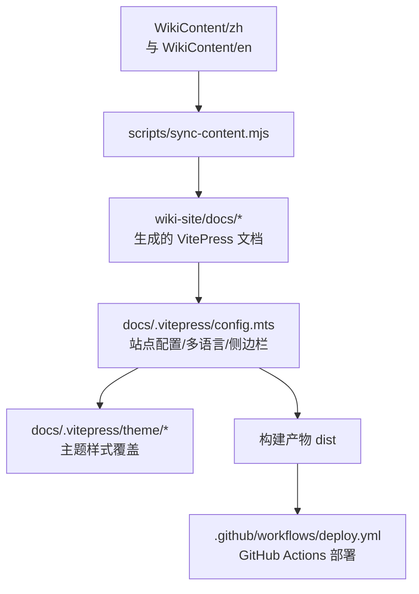
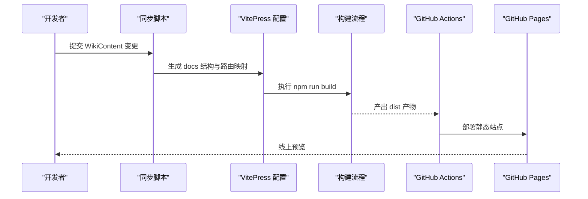
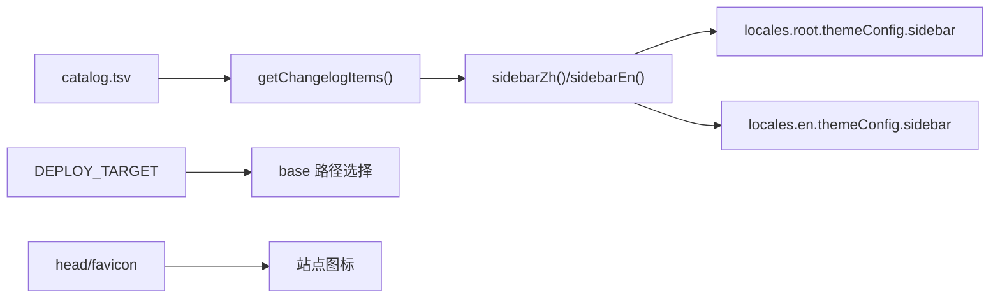
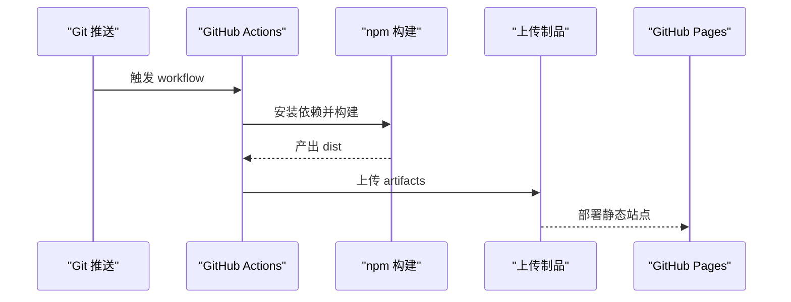
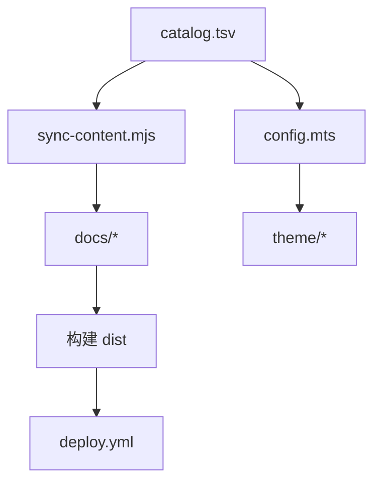

# 在线 Wiki 站点

<cite>
**本文引用的文件**
- [wiki-site/package.json](file://wiki-site/package.json)
- [wiki-site/AGENTS.md](file://wiki-site/AGENTS.md)
- [wiki-site/scripts/sync-content.mjs](file://wiki-site/scripts/sync-content.mjs)
- [wiki-site/scripts/entry-map.mjs](file://wiki-site/scripts/entry-map.mjs)
- [wiki-site/hubs/](file://wiki-site/hubs/)
- [wiki-site/docs/.vitepress/config.mts](file://wiki-site/docs/.vitepress/config.mts)
- [wiki-site/docs/.vitepress/search.mts](file://wiki-site/docs/.vitepress/search.mts)
- [wiki-site/docs/.vitepress/seo.mts](file://wiki-site/docs/.vitepress/seo.mts)
- [wiki-site/docs/.vitepress/feed.mts](file://wiki-site/docs/.vitepress/feed.mts)
- [wiki-site/docs/.vitepress/data/structure.mts](file://wiki-site/docs/.vitepress/data/structure.mts)
- [wiki-site/docs/.vitepress/data/infobox.mts](file://wiki-site/docs/.vitepress/data/infobox.mts)
- [wiki-site/docs/.vitepress/theme/index.ts](file://wiki-site/docs/.vitepress/theme/index.ts)
- [wiki-site/docs/.vitepress/theme/Layout.vue](file://wiki-site/docs/.vitepress/theme/Layout.vue)
- [wiki-site/docs/.vitepress/theme/css/tokens.css](file://wiki-site/docs/.vitepress/theme/css/tokens.css)
- [wiki-site/docs/.vitepress/theme/css/widgets.css](file://wiki-site/docs/.vitepress/theme/css/widgets.css)
- [WikiContent/catalog.tsv](file://WikiContent/catalog.tsv)
- [.github/workflows/deploy.yml](file://.github/workflows/deploy.yml)
</cite>

> 2026-09-07 同步：站点做了一次**整站换皮**——不再继承 VitePress 默认主题，版式改为
> 参照 Official Terraria Wiki（terraria.wiki.gg，MediaWiki Vector-legacy 皮肤）逐值测量后
> 净室重写的自绘骨架：网络顶栏 + Logo 带 + 左侧门户框 + 标签行 + 内容面板 + 分类栏 + 页脚，
> 另有 Overworld（深）/ Snow（浅）两套可切换皮肤。样式拆成 `theme/css/` 九层，
> `style.css` / `extras.css` 已删除。细节以 wiki-site/AGENTS.md §8、§9 为准。
>
> 2026-09-05 同步：本文按当时代码重写了「核心组件」「详细组件分析」「性能与 SEO 优化」
> 三节，并补充了类目主页（hubs/）、速查对比表、中文搜索分词、逐页 SEO 与 RSS。
> 更细的维护规则以 [wiki-site/AGENTS.md](file://wiki-site/AGENTS.md) 为准。

## 目录
1. [简介](#简介)
2. [项目结构](#项目结构)
3. [核心组件](#核心组件)
4. [架构总览](#架构总览)
5. [详细组件分析](#详细组件分析)
6. [依赖关系分析](#依赖关系分析)
7. [性能与 SEO 优化](#性能与-seo-优化)
8. [故障排查指南](#故障排查指南)
9. [结论](#结论)
10. [附录：编写规范与维护实践](#附录编写规范与维护实践)

## 简介
本仓库包含一个基于 VitePress 的在线 Wiki 站点，用于为 BossRush Mod 提供中英文双语文档。内容以 Markdown 形式维护在 WikiContent 目录中，通过同步脚本生成 VitePress 可构建的 docs 结构；站点配置、主题定制、多语言导航与侧边栏由 VitePress 配置统一管理；自动化部署通过 GitHub Actions 完成，支持 GitHub Pages（并可适配 Cloudflare Pages）。

## 项目结构
- wiki-site：VitePress 站点工程，包含配置、主题、脚本与包管理。
  - `scripts/entry-map.mjs`：entryId ↔ 站内路径的唯一映射与 catalog.tsv 读取，sync / config / seo 三处共用。
  - `hubs/`：系统、攻略两个类目主页的手写正文（中英各一份），由 sync 复制进 docs/；它们在 WikiContent 里没有对应条目。
  - `docs/.vitepress/data/`：`structure.mts`（导航结构唯一事实源）、`infobox.mts`（速查框数据）、`changelog.data.mts` / `stats.data.mts`（构建期数据加载器）。
  - `docs/.vitepress/theme/`：`Layout.vue` 是自绘的 Vector-legacy 骨架（网络顶栏 / Logo 带 / 门户框栏 / 标签行 / 内容面板 / 分类栏 / 页脚），不再继承默认主题；`components/` 下是外壳与构件（WikiNetbar / WikiPanel / WikiHead / WikiHeadSearch / WikiFooter / WikiCatlinks / WikiContentSub / WikiToc / WikiInfobox / WikiNavbox / WikiCardGrid / WikiCompare / WikiHome / WikiLightbox / WikiRefPreview / WikiNotFound）；`WikiSearchBox.vue` 仍是 VitePress 本地搜索弹层的 fork，当「完整结果页」用；`composables/` 管结构反查、索引预热、界面词表、换肤与 GitHub 链接；样式在 `css/`（tokens / base / icons / vp-bridge / layout / content / widgets / mainpage / responsive / print 九层）；版式贴图在 `assets/`（天空底图、木纹 / 冰霜、草皮条、站点 Logo），由 `tools/build_wiki_theme_assets.py` 产出、`wiki-site/scripts/wiki-theme-assets.json` 登记。
  - `docs/.vitepress/search.mts` / `seo.mts` / `feed.mts`：中文分词搜索、逐页 SEO 与编辑链接、更新日志 RSS，均在构建期生效。
- WikiContent：权威内容源，按语言分 zh/en，并通过 catalog.tsv 统一编排条目与顺序。
- .github/workflows（仓库根目录）：GitHub Actions 工作流，负责构建与发布。`wiki-site/.github/workflows/deploy.yml` 是一份未被 GitHub 读取的历史副本，以根目录那份为准。

图表来源
- [wiki-site/scripts/sync-content.mjs:1-259](file://wiki-site/scripts/sync-content.mjs#L1-L259)
- [wiki-site/docs/.vitepress/config.mts:1-371](file://wiki-site/docs/.vitepress/config.mts#L1-L371)
- [wiki-site/docs/.vitepress/theme/css/tokens.css](file://wiki-site/docs/.vitepress/theme/css/tokens.css)
- [wiki-site/.github/workflows/deploy.yml:1-55](file://wiki-site/.github/workflows/deploy.yml#L1-L55)

章节来源
- [wiki-site/package.json:1-14](file://wiki-site/package.json#L1-L14)
- [wiki-site/scripts/sync-content.mjs:1-259](file://wiki-site/scripts/sync-content.mjs#L1-L259)
- [wiki-site/docs/.vitepress/config.mts:1-371](file://wiki-site/docs/.vitepress/config.mts#L1-L371)
- [wiki-site/docs/.vitepress/theme/css/tokens.css](file://wiki-site/docs/.vitepress/theme/css/tokens.css)
- [WikiContent/catalog.tsv:1-103](file://WikiContent/catalog.tsv#L1-L103)
- [wiki-site/.github/workflows/deploy.yml:1-55](file://wiki-site/.github/workflows/deploy.yml#L1-L55)

## 核心组件

2026-09-06 导航修复：`theme/composables/useWiki.ts` 的 `href` 必须保留规范路径前导 `/`，先添加语言前缀再调用 `withBase`，避免深层页面把 `bosses/...` 相对链接拼成重复目录。`npm --prefix wiki-site run test:navigation` 执行真实组合函数与 VitePress URL 适配器，覆盖中英、根部署和 `/BossRushMod/` 部署；`python tools/check_wiki_links.py` 对构建 HTML 按浏览器 URL 规则检查目标与锚点（根部署追加 `--base /`）。这两项验证独立于页面能否构建成功，不改 WikiContent 正文或线上部署。

- 内容同步脚本：将 WikiContent 中的 Markdown 转换为 VitePress 文档结构——标题层级提升、Callout 转换、链接清理、按 IMAGE_PLACEMENT 注入配图、按 TABLEIZE 把固定句式列表转成表格（成就大全、模式总览），并把 hubs/ 下的类目主页复制进 docs/。
- VitePress 配置：站点标题、基础路径、多语言（中文根路径、英文 /en）；导航与侧边栏由 structure.mts 生成；本地搜索接入 search.mts 的中文二元分词；sitemap、逐页 description / Open Graph / canonical / hreflang（seo.mts）、「编辑此页」指向 WikiContent 源文件、更新日志 RSS（feed.mts）、中文 404 文案；markdown-it 层的 entityLinkPlugin 把列表项与表格首列里的实体名换成图标 + 链接。
- 主题层：Layout.vue 自己搭骨架（`.mw-layout` 是一张具名 CSS 网格），正文用 `<Content class="mw-parser-output" />`，页尾依次是对比表（WikiCompare）、条目清单（WikiCardGrid）、导航盒（WikiNavbox）、分类栏（WikiCatlinks）。三样东西由 config.mts 的 markdown-it 插件在**渲染期**插进正文，因此生成的 .md 一个字节不变：位置提示（contentSubSlotPlugin，h1 之后）、速查框（infoboxSlotPlugin，紧随其后）、目录框（tocSlotPlugin，第一个 h2 之前）；三者的组件都在 theme/index.ts 全局注册。首页是 layout: page + WikiHome（抬头 + 站点数据 + 最新版本 + 一排类目盒）。
- 自动化部署：GitHub Actions 在推送 main 分支或手动触发时以 fetch-depth: 0 检出（页面「最后更新」与 RSS 日期取 git 时间），安装依赖、执行构建并上传至 GitHub Pages。

章节来源
- [wiki-site/scripts/sync-content.mjs:1-259](file://wiki-site/scripts/sync-content.mjs#L1-L259)
- [wiki-site/docs/.vitepress/config.mts:1-371](file://wiki-site/docs/.vitepress/config.mts#L1-L371)
- [wiki-site/docs/.vitepress/theme/css/tokens.css](file://wiki-site/docs/.vitepress/theme/css/tokens.css)
- [wiki-site/.github/workflows/deploy.yml:1-55](file://wiki-site/.github/workflows/deploy.yml#L1-L55)

## 架构总览
站点采用“单一权威源 + 同步生成”的架构：作者仅维护 WikiContent 下的 Markdown 与 catalog.tsv，构建前运行同步脚本生成 docs 结构，再由 VitePress 编译为静态站点，最后通过 Actions 部署到托管平台。

图表来源
- [wiki-site/scripts/sync-content.mjs:1-259](file://wiki-site/scripts/sync-content.mjs#L1-L259)
- [wiki-site/docs/.vitepress/config.mts:1-371](file://wiki-site/docs/.vitepress/config.mts#L1-L371)
- [wiki-site/.github/workflows/deploy.yml:1-55](file://wiki-site/.github/workflows/deploy.yml#L1-L55)

## 详细组件分析

### 内容同步脚本（sync-content.mjs）
- 职责
  - 通过 entry-map.mjs 的 readCatalog() 解析 catalog.tsv，读取 WikiContent/zh 与 WikiContent/en 下的源文件。
  - 将源文件转换为 VitePress 文档结构，写入 wiki-site/docs 对应目录（路由来自 entry-map.mjs 的 ENTRY_TO_PATH / getRoute）。
  - 对内容进行格式转换：标题层级提升、Callout 转换、清理本地绝对路径链接（transformContent，被 ZombieModeMutantWikiGuard 逐字节镜像，不可随意改动）。
  - 在 transformContent 之后作为独立步骤：TABLEIZE 列表转表格、IMAGE_PLACEMENT 配图注入。
  - 清理受管目录与文件，确保输出干净。
  - 自动生成英文首页；把 hubs/<dir>.zh.md / .en.md 复制为 docs/<dir>/index.md 与 docs/en/<dir>/index.md（缺任一语言直接报错）。
- 关键流程
  - 解析目录清单 → 计算路由 → 查找源文件 → 转换内容 → 列表转表格 → 注入配图 → 写入目标路径 → 复制类目主页。
  - 对 changelog 版本条目动态生成路由。

图表来源
- [wiki-site/scripts/sync-content.mjs:102-189](file://wiki-site/scripts/sync-content.mjs#L102-L189)
- [wiki-site/scripts/sync-content.mjs:191-259](file://wiki-site/scripts/sync-content.mjs#L191-L259)

章节来源
- [wiki-site/scripts/sync-content.mjs:1-259](file://wiki-site/scripts/sync-content.mjs#L1-L259)

### VitePress 配置（config.mts）
- 多语言
  - 根语言为中文，标签与语言代码已设置；英文语言位于 /en 下。
  - 导航与侧边栏分别针对中文与英文独立定义，保持结构一致。
- 侧边栏与更新日志
  - 中文与英文侧边栏函数分别返回结构化菜单。
  - 更新日志项从 catalog.tsv 动态读取并按 order 排序，链接根据 entryId 生成。
- 基础路径与环境变量
  - base 根据 DEPLOY_TARGET 环境变量切换，便于在不同平台部署（如 cloudflare 使用根路径）。
- 搜索与社交
  - 启用本地搜索；search.mts 提供中文二元分词（「焚天龙皇」→ 焚天 / 天龙 / 龙皇，建索引与查询同一切法）、详细结果视图与中文文案。该 tokenizer 会被 VitePress 序列化进站点数据、在浏览器里还原，因此必须自包含。
  - 搜索弹层是 vitepress 自带 VPLocalSearchBox 的 fork（theme/components/WikiSearchBox.vue），经 config.mts 的 Vite alias 顶替：索引改为模块级缓存 + 首屏空闲预热、索引未就绪时显示加载态、先 AND 后 OR 检索、上下键判输入法组合态、弹层开合带动画。升级 VitePress 需重新对照上游，由 WikiSiteThemeWiringGuard 用版本标记守卫。
  - 社交链接指向 GitHub 仓库。
- SEO、编辑链接与订阅
  - sitemap.xml（hostname 含 base，中英页面配成 hreflang 对）；transformPageData 从正文第一段抽逐页 description；transformHead 输出 Open Graph、Twitter 卡片、canonical、zh-CN ⇄ en hreflang；buildEnd 生成 feed.xml。
  - 「编辑此页」按 frontmatter.editSource 指向 WikiContent 源文件或 hubs/ 手写页；首页无源文件则隐藏。
  - 绝对地址前缀：GitHub Pages 默认，SITE_URL 环境变量可覆盖；DEPLOY_TARGET=cloudflare 且未设 SITE_URL 时省略上述绝对地址类标签。
- 页脚与图标
  - 设置站点标题、描述、favicon、theme-color 与页脚信息；中文 404 文案。

图表来源
- [wiki-site/docs/.vitepress/config.mts:9-43](file://wiki-site/docs/.vitepress/config.mts#L9-L43)
- [wiki-site/docs/.vitepress/config.mts:48-288](file://wiki-site/docs/.vitepress/config.mts#L48-L288)
- [wiki-site/docs/.vitepress/config.mts:291-371](file://wiki-site/docs/.vitepress/config.mts#L291-L371)

章节来源
- [wiki-site/docs/.vitepress/config.mts:1-371](file://wiki-site/docs/.vitepress/config.mts#L1-L371)

### 主题定制（theme/index.ts、Layout.vue、components/、css/）
- 入口
  - 主题入口**不再** extends 默认主题，只导出 Layout 与 enhanceApp；全局注册 WikiHome / WikiCardGrid / WikiInfobox / WikiContentSub / WikiToc / WikiIcon；按层叠顺序引入 css/ 下九个样式文件。
- 布局插槽（Layout.vue）
  - doc-before：WikiBreadcrumb（面包屑）、WikiInfobox（速查框，数据来自 infobox.mts）。
  - doc-footer-before：类目主页上依次为 WikiCompare（速查对比表）与 WikiCardGrid（条目宫格）；更新日志页面用 WikiChangelogTimeline（按 major.minor 分行的版本时间线）代替 WikiNavbox（同类导航）。
  - 更新日志在 useWiki.ts 里被拼成虚拟类目（条目来自 changelog.data.mts），面包屑与时间线因此认得它。
- 速查对比表（WikiCompare.vue）
  - 按速查框眉标首段分组（装备拆成近战 / 套装 / 图腾 / 枪械），列 = 组内至少两个条目共有的标签，「获取 / 来源」「基础伤害 / 伤害」按别名合并，「物品 ID」行不进对比表；点表头按数字、★ 数或字符串排序，缺值行沉底。数据只读 infobox.mts，无独立清单。
- 首页（WikiHome.vue）
  - 刊头、WikiSearchBar（整行搜索框转发给 VitePress 搜索按钮 + 随机条目）、数据速览（模式 / Boss / 装备数来自 structure.mts，成就与地图数由 stats.data.mts 从 WikiContent 正文统计）、三步上手、门户宫格、最近更新（changelog.data.mts 前 6 条）。
- 样式
  - css/tokens.css：全部 --theme-* / --layout-* 令牌；:root 是默认皮肤 Overworld（深色），html.theme-Snow 是浅色。加皮肤只改这里加 data/themes.mts 加内联脚本三处。
  - css/layout.css / content.css / widgets.css / mainpage.css / responsive.css / print.css：骨架、正文、构件、首页、七档媒体查询与打印。
  - css/vp-bridge.css：全站唯一允许给 --vp-* 赋值的地方，只为搜索弹层那个 fork 搭一层桥（改写它的 scoped 样式会让 fork 没法再和上游 diff）。

章节来源
- [wiki-site/docs/.vitepress/theme/index.ts:1-4](file://wiki-site/docs/.vitepress/theme/index.ts#L1-L4)
- [wiki-site/docs/.vitepress/theme/css/tokens.css](file://wiki-site/docs/.vitepress/theme/css/tokens.css)

### 自动化部署（deploy.yml）
- 触发条件
  - 推送 main 分支且路径包含 wiki-site、docs/wiki-site 或 WikiContent 时触发。
  - 支持手动触发。
- 权限与并发
  - 授予 contents、pages、id-token 权限。
  - 设置 pages 并发组，避免重复部署冲突。
- 构建步骤
  - 检出代码、安装 Node 20、缓存 npm 依赖。
  - 进入 wiki-site 目录执行 npm ci 与 npm run build。
  - 上传构建产物至 actions/upload-pages-artifact。
- 部署步骤
  - 使用 actions/deploy-pages 将产物部署到 GitHub Pages。

图表来源
- [wiki-site/.github/workflows/deploy.yml:1-55](file://wiki-site/.github/workflows/deploy.yml#L1-L55)

章节来源
- [wiki-site/.github/workflows/deploy.yml:1-55](file://wiki-site/.github/workflows/deploy.yml#L1-L55)

## 依赖关系分析
- 脚本与配置耦合点
  - sync-content.mjs 依赖 WikiContent/catalog.tsv 作为唯一权威源，决定路由与内容位置。
  - config.mts 同样读取 catalog.tsv 以生成更新日志侧边栏，保证导航与内容一致。
- 主题与样式
  - theme/index.ts 仅引入样式，不改变行为逻辑，降低耦合。
- 部署与工作流
  - deploy.yml 依赖 wiki-site 的 package.json 脚本与构建产物路径。

图表来源
- [wiki-site/scripts/sync-content.mjs:102-189](file://wiki-site/scripts/sync-content.mjs#L102-L189)
- [wiki-site/docs/.vitepress/config.mts:9-43](file://wiki-site/docs/.vitepress/config.mts#L9-L43)
- [wiki-site/.github/workflows/deploy.yml:21-55](file://wiki-site/.github/workflows/deploy.yml#L21-L55)

章节来源
- [wiki-site/scripts/sync-content.mjs:1-259](file://wiki-site/scripts/sync-content.mjs#L1-L259)
- [wiki-site/docs/.vitepress/config.mts:1-371](file://wiki-site/docs/.vitepress/config.mts#L1-L371)
- [wiki-site/.github/workflows/deploy.yml:1-55](file://wiki-site/.github/workflows/deploy.yml#L1-L55)

## 性能与 SEO 优化
- 性能
  - 使用 VitePress 静态站点生成；**不加载任何网络字体**——正文 Helvetica、标题 Verdana，中文交给系统字体（与目标站中文版同一口径）。不继承默认主题之后，产物少了 14 个 woff2 与三条第三方外链，样式表从 147 KB 降到 85 KB。界面图标是内联 SVG 的 CSS mask，零请求。版式贴图（天空 / 木纹 / 草皮 / Logo）每套皮肤约 100 KB，且浏览器只会请求当前皮肤用到的那几张——另一套皮肤的 `url()` 写在不匹配的 `html.theme-*` 块里，根本不会发起请求。
  - 本地搜索索引按语言拆分；中文二元分词后的中文索引约 1 MB（gzip 后约 250 KB）。索引与弹层组件在首屏空闲时预热（省流量连接上只预热组件，鼠标移到搜索框上才强制拉索引），同一语言只解析一次。
  - 图标与配图为提交进仓库的 WebP 产物；组件图标与正文 markdown 图片都带 loading=lazy（后者由 config.mts 的渲染规则统一补上）。产物尺寸不得小于正文展示尺寸，否则浏览器会把图拉大、看起来发糊，由 WikiSiteThemeWiringGuard 核对。
- SEO
  - 逐页 description（正文第一段或 frontmatter）、Open Graph / Twitter 卡片、canonical、zh-CN ⇄ en hreflang 与 x-default，全部由 seo.mts 在构建期注入；sitemap.xml 含 lastmod 与语言对；更新日志另有 feed.xml。
  - 条目页的 og:image 取该条目图标。
- 用户体验
  - 换肤（Overworld 深 / Snow 浅；偏好存 localStorage 的 skin-theme，首帧由 head 里的自包含内联脚本挂类，刷新不闪；切换时同步 theme-color；?skin-theme=Snow 可直接指定）、标签行里的搜索框 + 联想下拉、类目主页的可排序对比表、页尾导航盒与分类栏、指向源文件的「查看源代码 / 查看历史 / 编辑此页」、中文 404、打印样式。
  - 条目页版式：标题 → 位置提示 → 速查框（≥641px 右浮 300px，更窄时通栏）→ 导语 → 目录框 → 正文。h1 与 h2 底下都有一条「双线」；带整幅边线或底色的块（标题、分隔线、提示块、目录框、引用块）一律 display: flow-root，否则它们的线会从右浮的速查框底下穿过去。
  - 正文配图可点开看大图（WikiLightbox）：同一配图块内左右键翻页，展示尺寸永不超过原始像素。
  - 侧边栏与导航结构由 structure.mts 生成，中英双语一致。

章节来源
- [wiki-site/docs/.vitepress/seo.mts](file://wiki-site/docs/.vitepress/seo.mts)
- [wiki-site/docs/.vitepress/search.mts](file://wiki-site/docs/.vitepress/search.mts)
- [wiki-site/docs/.vitepress/feed.mts](file://wiki-site/docs/.vitepress/feed.mts)
- [wiki-site/docs/.vitepress/theme/css/widgets.css](file://wiki-site/docs/.vitepress/theme/css/widgets.css)

## 故障排查指南
- 同步失败或缺失源文件
  - 现象：控制台输出缺失警告，对应条目被跳过。
  - 处理：检查 WikiContent 对应 entryId 的文件是否存在于正确分类目录或根目录。
  - 参考路径
    - [wiki-site/scripts/sync-content.mjs:120-128](file://wiki-site/scripts/sync-content.mjs#L120-L128)
    - [wiki-site/scripts/sync-content.mjs:163-189](file://wiki-site/scripts/sync-content.mjs#L163-L189)
- 路由映射错误
  - 现象：构建后页面 404，或页面能搜到却不在任何导航里。
  - 处理：核对 catalog.tsv 的 entryId 与 entry-map.mjs 的 ENTRY_TO_PATH 映射是否一致，并在 structure.mts 对应类目登记条目；WikiSiteStructureGuard 会指出缺哪一边。
  - 参考路径
    - [wiki-site/scripts/entry-map.mjs](file://wiki-site/scripts/entry-map.mjs)
    - [wiki-site/docs/.vitepress/data/structure.mts](file://wiki-site/docs/.vitepress/data/structure.mts)
- 类目主页缺失
  - 现象：sync 报「类目主页缺失」。
  - 处理：hubs/ 下每个类目主页中英两份都要有（`<dir>.zh.md` 与 `<dir>.en.md`）。
- 搜索搜不到中文
  - 现象：整句中文只能按句首前缀命中。
  - 处理：确认 config.mts 的 search 仍引用 search.mts 的 SEARCH，且 cjkTokenize 未引用函数体外的变量（它会被序列化到浏览器执行）。
- 更新日志未显示
  - 现象：侧边栏无更新日志项。
  - 处理：确认 catalog.tsv 中存在 changelog 类型条目，且 getChangelogItems 能正确解析。
  - 参考路径
    - [wiki-site/docs/.vitepress/config.mts:9-43](file://wiki-site/docs/.vitepress/config.mts#L9-L43)
- 部署失败
  - 现象：Actions 构建报错或无法部署。
  - 处理：检查 Node 版本、依赖缓存路径、构建命令与产物路径是否正确。
  - 参考路径
    - [wiki-site/.github/workflows/deploy.yml:21-55](file://wiki-site/.github/workflows/deploy.yml#L21-L55)

章节来源
- [wiki-site/scripts/sync-content.mjs:32-189](file://wiki-site/scripts/sync-content.mjs#L32-L189)
- [wiki-site/docs/.vitepress/config.mts:9-43](file://wiki-site/docs/.vitepress/config.mts#L9-L43)
- [wiki-site/.github/workflows/deploy.yml:21-55](file://wiki-site/.github/workflows/deploy.yml#L21-L55)

## 结论
本项目通过“权威内容源 + 同步脚本 + VitePress 配置 + 自动化部署”的架构，实现了高效、可维护的中英文双语 Wiki 站点。内容组织清晰、多语言一致、构建与部署流程稳定。遵循本文档的编写规范与维护实践，可进一步提升站点质量与协作效率。

[本节为总结，无需特定文件引用]

## 附录：编写规范与维护实践
- 内容编写规范
  - 所有文档内容必须维护在 WikiContent/zh 与 WikiContent/en 下，文件名与 catalog.tsv 的 entryId 保持一致。
  - 使用统一的标题层级与 Callout 语法，以便同步脚本正确转换。
  - 新增条目需在 catalog.tsv 中注册、在 entry-map.mjs 的 ENTRY_TO_PATH 中补充路由映射，并在 structure.mts 对应类目的 entries 中登记（三步缺一不可）。
  - 速查框数值以 WikiContent/zh 正文为准，改数值时 infobox.mts 同步改；类目主页的对比表自动跟随。
- 贡献流程
  - 修改 WikiContent 后，运行同步脚本验证生成结果。
  - 提交 PR 并等待 CI 构建与预览。
  - 合并 main 分支后，GitHub Actions 自动部署。
- 版本管理与更新策略
  - 更新日志条目按版本号命名，catalog.tsv 中维护顺序。
  - 建议在每次发布前校验 changelog 条目与路由映射。
- 最佳实践
  - 保持中英侧边栏与导航结构一致，便于用户切换语言。
  - 谨慎修改 base 路径与环境变量，确保不同平台部署正确。
  - 定期审查主题样式，确保可读性与品牌一致性。

[本节为通用指导，无需特定文件引用]
