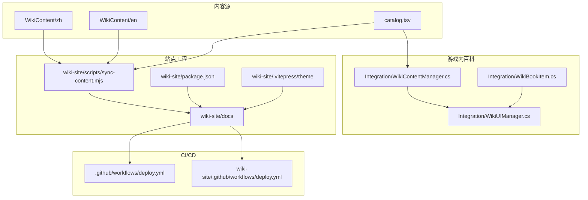
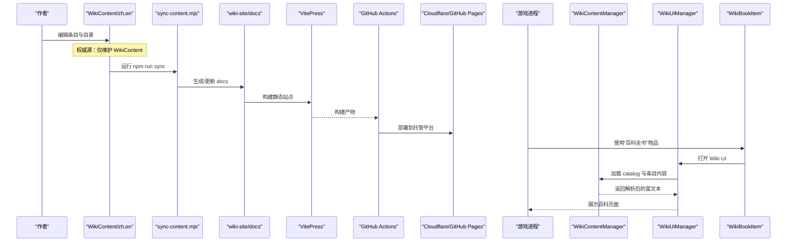
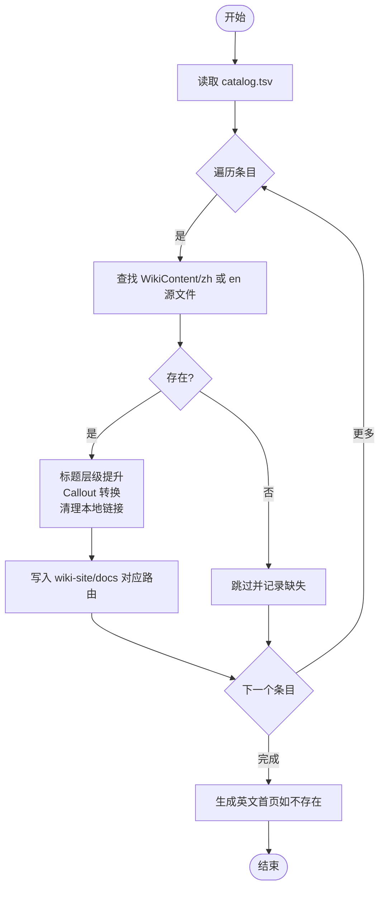
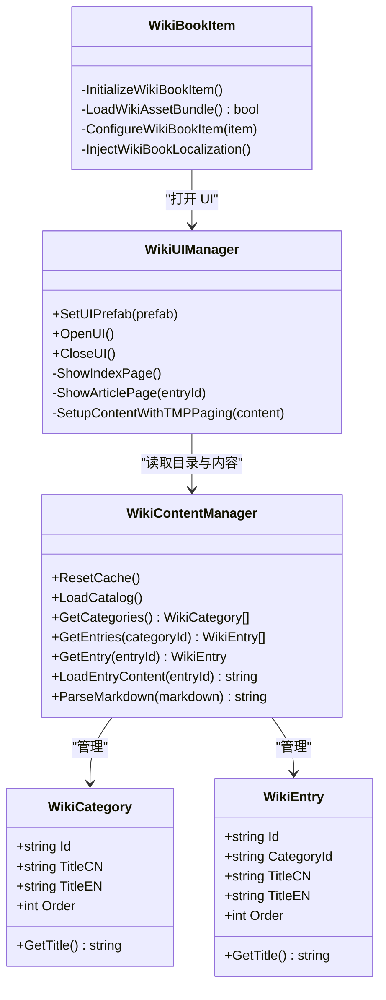
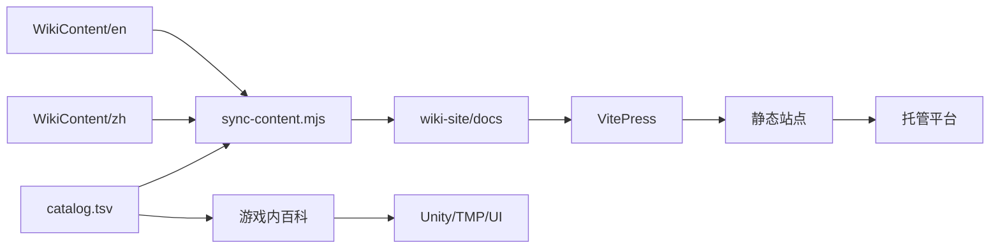

# 文档站点

<cite>
**本文引用的文件**
- [README.md](file://README.md)
- [package.json](file://wiki-site/package.json)
- [index.md](file://wiki-site/docs/index.md)
- [deploy.yml（根仓库）](file://.github/workflows/deploy.yml)
- [deploy.yml（wiki-site）](file://wiki-site/.github/workflows/deploy.yml)
- [sync-content.mjs](file://wiki-site/scripts/sync-content.mjs)
- [catalog.tsv](file://WikiContent/catalog.tsv)
- [WikiContentManager.cs](file://Integration/WikiContentManager.cs)
- [WikiUIManager.cs](file://Integration/WikiUIManager.cs)
- [WikiBookItem.cs](file://Integration/WikiBookItem.cs)
</cite>

## 目录
1. [简介](#简介)
2. [项目结构](#项目结构)
3. [核心组件](#核心组件)
4. [架构总览](#架构总览)
5. [详细组件分析](#详细组件分析)
6. [依赖关系分析](#依赖关系分析)
7. [性能与可用性考虑](#性能与可用性考虑)
8. [故障排查指南](#故障排查指南)
9. [结论](#结论)
10. [附录](#附录)

## 简介
本文件面向“BossRush Mod”的文档站点与游戏内百科系统，覆盖以下主题：
- VitePress 在线 Wiki 站点的配置、内容同步与部署（Cloudflare Pages / GitHub Pages）
- 游戏内百科系统的内容管理、本地化支持、访问控制机制
- 文档同步策略、版本管理与内容更新流程
- 文档编写规范、SEO 优化与用户体验设计
- 维护与扩展指导原则

本项目同时提供两套内容载体：
- 游戏内百科：通过物品“Boss Rush 百科全书”打开，读取本地 Markdown 并渲染为富文本。
- 在线 Wiki：基于 VitePress，由脚本将 WikiContent 源内容同步到 docs，再由 CI/CD 构建并部署到 Cloudflare Pages 或 GitHub Pages。

## 项目结构
与文档相关的核心目录与职责如下：
- WikiContent：权威内容源（zh/en），包含分类索引 catalog.tsv 与各语言条目 Markdown。
- wiki-site：VitePress 站点工程，含 package.json、scripts/sync-content.mjs、docs 输出目录与主题。
- Integration：游戏内百科运行时逻辑（内容加载、解析、UI 管理）。
- .github/workflows：CI/CD 工作流，负责构建与部署。

图表来源
- [sync-content.mjs:1-259](file://wiki-site/scripts/sync-content.mjs#L1-L259)
- [package.json:1-14](file://wiki-site/package.json#L1-L14)
- [deploy.yml（根仓库）](file://.github/workflows/deploy.yml)
- [deploy.yml（wiki-site）](file://wiki-site/.github/workflows/deploy.yml)
- [catalog.tsv:1-103](file://WikiContent/catalog.tsv#L1-L103)
- [WikiContentManager.cs:1-673](file://Integration/WikiContentManager.cs#L1-L673)
- [WikiUIManager.cs:1-800](file://Integration/WikiUIManager.cs#L1-L800)
- [WikiBookItem.cs:1-341](file://Integration/WikiBookItem.cs#L1-L341)

章节来源
- [README.md:15-224](file://README.md#L15-L224)
- [package.json:1-14](file://wiki-site/package.json#L1-L14)
- [index.md:1-35](file://wiki-site/docs/index.md#L1-L35)

## 核心组件
- 内容编排与索引
  - catalog.tsv：定义分类、条目 ID、标题键与排序，是游戏内百科与在线站点的共同契约。
  - sync-content.mjs：唯一权威同步脚本，将 WikiContent/zh 与 WikiContent/en 转换为 VitePress 可消费的 docs 结构，并进行格式转换。
- 在线站点构建与部署
  - package.json：定义 npm scripts（dev/build/preview/sync），依赖 vitepress。
  - .github/workflows：在推送时执行同步与构建，产出静态站点并部署至托管平台。
- 游戏内百科运行时
  - WikiContentManager.cs：加载 catalog.tsv，按当前语言选择 zh/en 目录读取 Markdown，解析为 TMP 富文本。
  - WikiUIManager.cs：管理 UI 生命周期、目录页/正文页切换、分页显示、字体替换与外部链接跳转。
  - WikiBookItem.cs：从 AssetBundle 加载 UI 与书物品预制体，注入使用行为（打开 Wiki UI，不消耗物品）。

章节来源
- [catalog.tsv:1-103](file://WikiContent/catalog.tsv#L1-L103)
- [sync-content.mjs:1-259](file://wiki-site/scripts/sync-content.mjs#L1-L259)
- [package.json:1-14](file://wiki-site/package.json#L1-L14)
- [WikiContentManager.cs:1-673](file://Integration/WikiContentManager.cs#L1-L673)
- [WikiUIManager.cs:1-800](file://Integration/WikiUIManager.cs#L1-L800)
- [WikiBookItem.cs:1-341](file://Integration/WikiBookItem.cs#L1-L341)

## 架构总览
下图展示从内容源到在线站点与游戏内百科的双通道数据流。

图表来源
- [sync-content.mjs:1-259](file://wiki-site/scripts/sync-content.mjs#L1-L259)
- [package.json:1-14](file://wiki-site/package.json#L1-L14)
- [deploy.yml（wiki-site）](file://wiki-site/.github/workflows/deploy.yml)
- [deploy.yml（根仓库）](file://.github/workflows/deploy.yml)
- [WikiContentManager.cs:1-673](file://Integration/WikiContentManager.cs#L1-L673)
- [WikiUIManager.cs:1-800](file://Integration/WikiUIManager.cs#L1-L800)
- [WikiBookItem.cs:1-341](file://Integration/WikiBookItem.cs#L1-L341)

## 详细组件分析

### 在线 Wiki 站点（VitePress）
- 配置与脚本
  - package.json 定义了 dev/build/preview/sync 四个脚本；build 前会先执行 sync，确保 docs 与 WikiContent 一致。
- 内容同步
  - sync-content.mjs 以 WikiContent/zh 与 WikiContent/en 为唯一权威源，依据 catalog.tsv 映射 entryId 到 docs 路由，进行标题层级提升、Callout 转换、清理本地绝对路径链接等操作，并生成英文首页。
- 构建与部署
  - 根仓库与 wiki-site 下均存在 deploy.yml，用于在推送时触发同步与构建，并将产物部署到托管平台（Cloudflare Pages 或 GitHub Pages）。

图表来源
- [sync-content.mjs:101-189](file://wiki-site/scripts/sync-content.mjs#L101-L189)
- [sync-content.mjs:191-259](file://wiki-site/scripts/sync-content.mjs#L191-L259)
- [catalog.tsv:1-103](file://WikiContent/catalog.tsv#L1-L103)

章节来源
- [package.json:1-14](file://wiki-site/package.json#L1-L14)
- [sync-content.mjs:1-259](file://wiki-site/scripts/sync-content.mjs#L1-L259)
- [deploy.yml（wiki-site）](file://wiki-site/.github/workflows/deploy.yml)
- [deploy.yml（根仓库）](file://.github/workflows/deploy.yml)

### 游戏内百科系统
- 内容管理
  - WikiContentManager 单例负责加载 catalog.tsv，按当前语言选择 zh/en 目录读取 Markdown，并通过正则预编译的解析器将 Markdown 转为 TMP 富文本（支持标题自适应字号、列表缩进、代码高亮、链接等）。
- UI 管理
  - WikiUIManager 负责 UI 初始化、节点缓存、目录与正文页切换、分页显示、字体替换、ESC 关闭、以及点击“BossRush Wiki”分类跳转到在线站点。
- 物品集成
  - WikiBookItem 从 AssetBundle 加载 UI 与书物品预制体，设置物品耐久度使其可无限使用，添加 UsageBehavior 打开 Wiki UI，并注入本地化名称与描述。

图表来源
- [WikiContentManager.cs:25-96](file://Integration/WikiContentManager.cs#L25-L96)
- [WikiContentManager.cs:105-673](file://Integration/WikiContentManager.cs#L105-L673)
- [WikiUIManager.cs:22-100](file://Integration/WikiUIManager.cs#L22-L100)
- [WikiUIManager.cs:104-800](file://Integration/WikiUIManager.cs#L104-L800)
- [WikiBookItem.cs:21-341](file://Integration/WikiBookItem.cs#L21-L341)

章节来源
- [WikiContentManager.cs:1-673](file://Integration/WikiContentManager.cs#L1-L673)
- [WikiUIManager.cs:1-800](file://Integration/WikiUIManager.cs#L1-L800)
- [WikiBookItem.cs:1-341](file://Integration/WikiBookItem.cs#L1-L341)

### 内容组织结构与本地化
- 目录组织
  - WikiContent 下按语言分 zh/en，每个条目以 entryId.md 命名，可按 categoryId 子目录存放，也可放于语言根目录。
  - catalog.tsv 统一声明所有条目的分类、ID、标题键与排序，保证游戏内与在线站点的一致性。
- 本地化
  - 游戏内根据 L10n.IsChinese 选择 zh 或 en 目录读取内容；标题通过 titleKey_zh/titleKey_en 在 UI 中呈现。
  - 在线站点通过同步脚本分别生成中文与英文 docs，并在英文目录下生成独立首页。

章节来源
- [catalog.tsv:1-103](file://WikiContent/catalog.tsv#L1-L103)
- [WikiContentManager.cs:280-323](file://Integration/WikiContentManager.cs#L280-L323)
- [sync-content.mjs:163-189](file://wiki-site/scripts/sync-content.mjs#L163-L189)
- [sync-content.mjs:191-259](file://wiki-site/scripts/sync-content.mjs#L191-L259)

### 访问控制机制
- 入口控制
  - 游戏内通过“Boss Rush 百科全书”物品打开 Wiki UI；未持有该物品则无法直接访问。
  - 打开后由 WikiUIManager 接管输入与 UI 生命周期，支持 ESC 关闭。
- 外部链接
  - 目录页提供“BossRush Wiki”分类项，点击后通过 Application.OpenURL 打开在线站点。
- 内容可见性
  - 内容可见性由 catalog.tsv 决定；未登记条目不会出现在目录中。

章节来源
- [WikiBookItem.cs:240-341](file://Integration/WikiBookItem.cs#L240-L341)
- [WikiUIManager.cs:27-29](file://Integration/WikiUIManager.cs#L27-L29)
- [WikiUIManager.cs:556-588](file://Integration/WikiUIManager.cs#L556-L588)
- [catalog.tsv:1-103](file://WikiContent/catalog.tsv#L1-L103)

### 文档同步策略、版本管理与更新流程
- 同步策略
  - 唯一权威源为 WikiContent/zh 与 WikiContent/en；任何变更应优先修改此处。
  - 通过 npm run sync 调用 sync-content.mjs 将内容同步到 wiki-site/docs，再进行构建。
- 版本管理
  - catalog.tsv 中的 changelog 条目按版本号顺序排列，便于追踪历史更新。
  - 同步脚本对 changelog__vX_Y_Z 类条目自动映射到 changelog/vX.Y.Z.md 路由。
- 更新流程
  - 开发者编辑 WikiContent → 本地运行 npm run sync → 预览 npm run preview → 提交代码 → CI 触发构建与部署。

章节来源
- [package.json:1-14](file://wiki-site/package.json#L1-L14)
- [sync-content.mjs:94-99](file://wiki-site/scripts/sync-content.mjs#L94-L99)
- [catalog.tsv:59-103](file://WikiContent/catalog.tsv#L59-L103)

### 文档编写规范、SEO 优化与用户体验设计
- 编写规范
  - 使用 catalog.tsv 登记新条目，保持 entryId 与路由映射一致。
  - 标题层级遵循 WikiContent 约定（## 作为页面标题），由同步脚本提升至 VitePress 要求的 #。
  - 使用 [tip]/[warn] 标注提示与警告，同步时转换为 ::: tip/warning。
- SEO 优化
  - 在线站点首页 index.md 提供 hero 与 features，利于搜索引擎抓取与展示。
  - 各页面保持清晰的标题结构与内部链接，避免本地绝对路径链接。
- 用户体验设计
  - 游戏内百科采用双栏翻页布局，标题自适应字号，长标题启用省略与自动缩放，避免换行错乱。
  - 支持 ESC 关闭、返回目录、外部链接跳转，提升易用性。

章节来源
- [index.md:1-35](file://wiki-site/docs/index.md#L1-L35)
- [sync-content.mjs:131-147](file://wiki-site/scripts/sync-content.mjs#L131-L147)
- [WikiUIManager.cs:290-304](file://Integration/WikiUIManager.cs#L290-L304)
- [WikiUIManager.cs:461-482](file://Integration/WikiUIManager.cs#L461-L482)

### 部署流程（Cloudflare Pages / GitHub Pages）
- 触发条件
  - 推送代码到仓库后，GitHub Actions 读取 .github/workflows/deploy.yml 执行构建与部署。
- 构建步骤
  - 安装依赖（vitepress）、执行 npm run sync、npm run build 生成静态站点。
- 部署目标
  - 根据工作流配置，将构建产物发布到 Cloudflare Pages 或 GitHub Pages。

章节来源
- [deploy.yml（根仓库）](file://.github/workflows/deploy.yml)
- [deploy.yml（wiki-site）](file://wiki-site/.github/workflows/deploy.yml)
- [package.json:1-14](file://wiki-site/package.json#L1-L14)

## 依赖关系分析
- 内容层
  - catalog.tsv 驱动游戏内目录与在线站点路由，是跨端一致性关键。
- 同步层
  - sync-content.mjs 依赖 Node.js 文件系统 API，严格限定权威源与输出目录。
- 站点层
  - VitePress 依赖 package.json 中定义的脚本与主题，theme/index.ts 引入默认主题与样式。
- 运行时层
  - 游戏内百科依赖 Unity 资源（AssetBundle）、TMP 文本系统与 UI 组件。

图表来源
- [catalog.tsv:1-103](file://WikiContent/catalog.tsv#L1-L103)
- [sync-content.mjs:1-259](file://wiki-site/scripts/sync-content.mjs#L1-L259)
- [package.json:1-14](file://wiki-site/package.json#L1-L14)

章节来源
- [catalog.tsv:1-103](file://WikiContent/catalog.tsv#L1-L103)
- [sync-content.mjs:1-259](file://wiki-site/scripts/sync-content.mjs#L1-L259)
- [package.json:1-14](file://wiki-site/package.json#L1-L14)

## 性能与可用性考虑
- 游戏内百科
  - 正则预编译：解析器使用预编译正则减少重复开销。
  - 标题自适应：根据视觉宽度动态调整字号，避免长标题换行导致的布局问题。
  - 分页优化：左栏作为 master 分页源，右栏同步布局属性与 RectTransform，确保左右页对齐。
- 在线站点
  - 同步脚本一次性清理并重建 docs 目录，避免脏数据影响构建。
  - 构建产物为静态站点，适合 CDN 分发与快速加载。

章节来源
- [WikiContentManager.cs:124-147](file://Integration/WikiContentManager.cs#L124-L147)
- [WikiContentManager.cs:407-464](file://Integration/WikiContentManager.cs#L407-L464)
- [WikiUIManager.cs:649-709](file://Integration/WikiUIManager.cs#L649-L709)
- [sync-content.mjs:149-161](file://wiki-site/scripts/sync-content.mjs#L149-L161)

## 故障排查指南
- 目录文件不存在
  - 现象：游戏启动时日志提示目录文件不存在，随后创建默认目录。
  - 处理：检查 WikiContent/catalog.tsv 是否存在且可读；若缺失，系统将回退到默认目录。
- 内容文件不存在
  - 现象：打开某条目时提示内容文件不存在。
  - 处理：确认 catalog.tsv 中 entryId 对应的 md 文件存在于对应语言目录（zh/en）与分类子目录。
- AssetBundle 加载失败
  - 现象：Wiki Book 初始化失败，日志提示未找到 bundle 或缺少 GameObject。
  - 处理：检查 Assets/ui/bossrush_wiki 是否存在，bundle 是否包含 Wiki UI 与 Wiki Book 预制体。
- 同步缺失条目
  - 现象：同步日志提示某 entryId 源缺失。
  - 处理：在 WikiContent/zh 或 en 中补充对应 md 文件，或在 catalog.tsv 中移除无效条目。

章节来源
- [WikiContentManager.cs:196-231](file://Integration/WikiContentManager.cs#L196-L231)
- [WikiContentManager.cs:280-323](file://Integration/WikiContentManager.cs#L280-L323)
- [WikiBookItem.cs:147-235](file://Integration/WikiBookItem.cs#L147-L235)
- [sync-content.mjs:163-189](file://wiki-site/scripts/sync-content.mjs#L163-L189)

## 结论
本项目通过“单一权威源 + 自动化同步 + 双端呈现”的方式，实现了游戏内百科与在线 Wiki 的一致性与可维护性。内容作者只需维护 WikiContent，即可同时服务于玩家在游戏内的阅读体验与在线站点的检索需求。配合 CI/CD 的构建与部署，保证了内容的及时发布与稳定性。

## 附录
- 常用命令
  - 本地开发：npm run dev
  - 构建站点：npm run build
  - 预览站点：npm run preview
  - 同步内容：npm run sync
- 推荐实践
  - 新增条目时，先在 catalog.tsv 登记，再在 WikiContent/zh 与 en 中补充 md 文件。
  - 使用 [tip]/[warn] 标注提示与警告，保持内容可读性。
  - 提交前本地运行 npm run sync 与 npm run build，确保无错误后再推送。