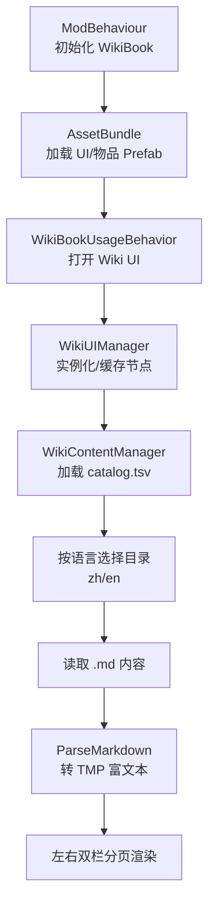
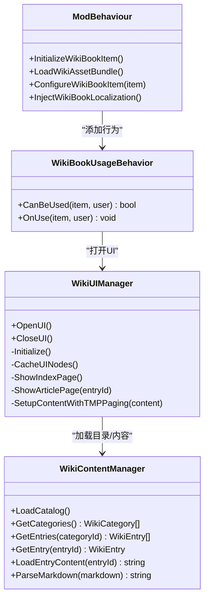
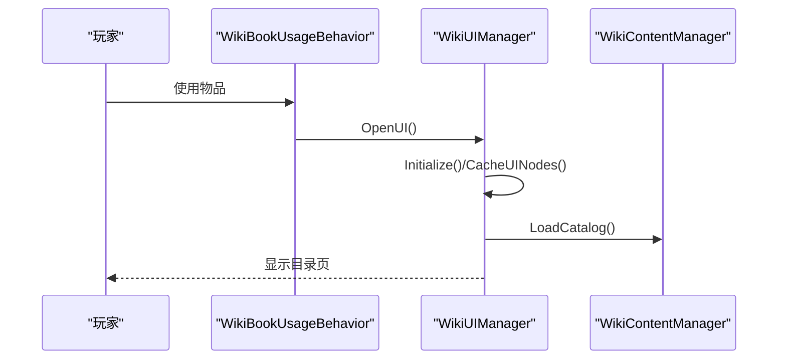
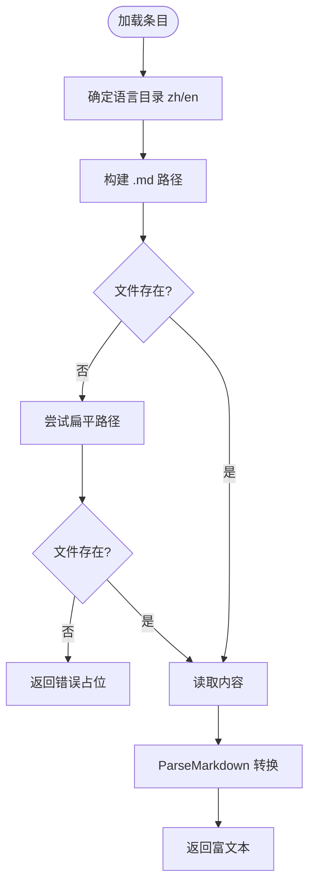
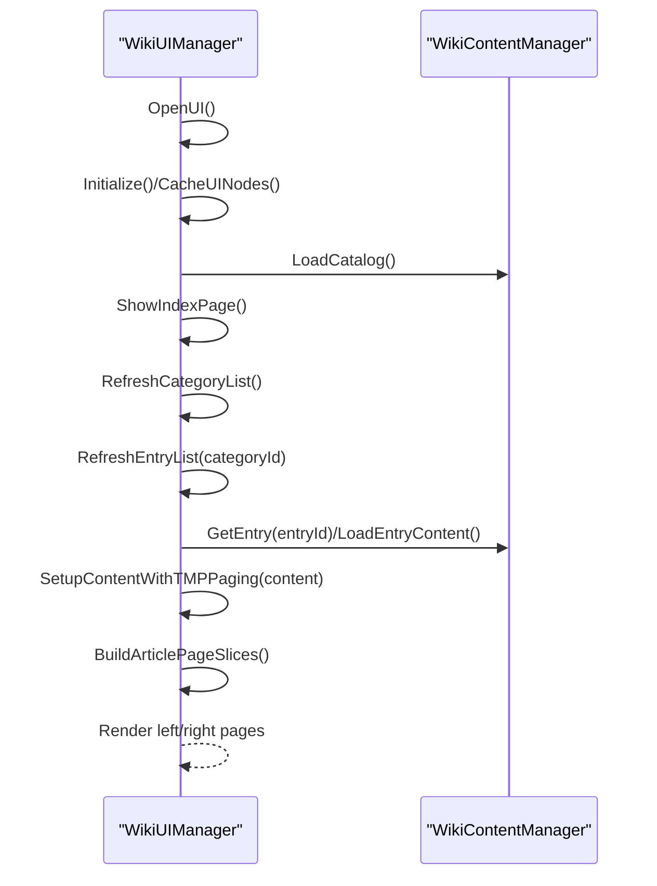
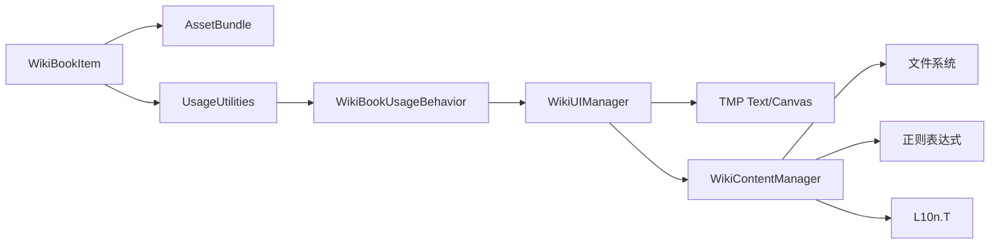

# 游戏内百科系统

<cite>
**本文引用的文件**
- [Integration/WikiBookItem.cs](file://Integration/WikiBookItem.cs)
- [Integration/WikiContentManager.cs](file://Integration/WikiContentManager.cs)
- [Integration/WikiUIManager.cs](file://Integration/WikiUIManager.cs)
- [Localization/LocalizationInjector.cs](file://Localization/LocalizationInjector.cs)
- [WikiContent/catalog.tsv](file://WikiContent/catalog.tsv)
- [tests/WikiUIPageOverflowGuard.py](file://tests/WikiUIPageOverflowGuard.py)
- [tests/WikiUIRuntimeFlowGuard.py](file://tests/WikiUIRuntimeFlowGuard.py)
- [tests/BossWikiGuideContentGuard.py](file://tests/BossWikiGuideContentGuard.py)
</cite>

## 目录
1. [简介](#简介)
2. [项目结构](#项目结构)
3. [核心组件](#核心组件)
4. [架构总览](#架构总览)
5. [详细组件分析](#详细组件分析)
6. [依赖关系分析](#依赖关系分析)
7. [性能与缓存策略](#性能与缓存策略)
8. [本地化与内容组织](#本地化与内容组织)
9. [访问控制与权限](#访问控制与权限)
10. [用户交互设计](#用户交互设计)
11. [内容创作指南](#内容创作指南)
12. [扩展开发方法](#扩展开发方法)
13. [调试与测试工具](#调试与测试工具)
14. [故障排查](#故障排查)
15. [结论](#结论)

## 简介
本模块为游戏内百科系统，提供“Boss Rush 百科全书”物品、内容加载与解析、UI 管理与分页展示。其目标是在不消耗物品的情况下，允许玩家随时打开百科查看 Boss、装备、模式、NPC、系统等知识条目；支持中英文本地化；通过 TSV 索引管理分类与条目；将 Markdown 内容转换为 TMP 富文本并实现左右双栏翻页阅读；同时提供完善的测试与校验工具保障内容质量与运行时稳定性。

## 项目结构
- 物品与行为：在 Integration 下实现 Wiki Book 物品注册与使用行为，绑定到 AssetBundle 中的 UI Prefab 与书物品 Prefab。
- 内容管理：WikiContentManager 负责读取 catalog.tsv、按语言选择目录、加载 .md 内容、Markdown 转富文本。
- UI 管理：WikiUIManager 负责 UI 生命周期、节点缓存、目录页与正文页切换、分页渲染、ESC 关闭等。
- 本地化：通过 LocalizationInjector 注入物品名称与描述；内容标题与分类标题通过 L10n.T 动态切换。
- 内容资源：WikiContent 目录下按 zh/en 分语言存放 .md 内容，根目录 catalog.tsv 作为索引。
- 测试与守卫：tests 下包含多项 Guard 脚本，用于保证 UI 分页边界、运行时流程、内容同步一致性等。

图表来源
- [Integration/WikiBookItem.cs:90-144](file://Integration/WikiBookItem.cs#L90-L144)
- [Integration/WikiUIManager.cs:110-185](file://Integration/WikiUIManager.cs#L110-L185)
- [Integration/WikiContentManager.cs:196-231](file://Integration/WikiContentManager.cs#L196-L231)
- [Integration/WikiContentManager.cs:280-323](file://Integration/WikiContentManager.cs#L280-L323)
- [Integration/WikiContentManager.cs:332-395](file://Integration/WikiContentManager.cs#L332-L395)

章节来源
- [Integration/WikiBookItem.cs:90-144](file://Integration/WikiBookItem.cs#L90-L144)
- [Integration/WikiContentManager.cs:196-231](file://Integration/WikiContentManager.cs#L196-L231)
- [Integration/WikiUIManager.cs:110-185](file://Integration/WikiUIManager.cs#L110-L185)

## 核心组件
- WikiBookItem（物品）：从 AssetBundle 加载 Wiki UI 和书物品 Prefab，配置耐久度使其可无限使用，添加 UsageBehavior 打开 UI，注入本地化名称与描述。
- WikiContentManager（内容）：单例管理分类与条目数据，加载 catalog.tsv，按语言选择目录读取 .md，解析 Markdown 为 TMP 富文本，预编译正则提升性能。
- WikiUIManager（UI）：单例管理 UI 生命周期，缓存节点，处理目录页与正文页切换，实现左右双栏分页、翻页按钮、ESC 关闭、字体替换、外部链接跳转等。

章节来源
- [Integration/WikiBookItem.cs:90-144](file://Integration/WikiBookItem.cs#L90-L144)
- [Integration/WikiContentManager.cs:105-191](file://Integration/WikiContentManager.cs#L105-L191)
- [Integration/WikiUIManager.cs:25-133](file://Integration/WikiUIManager.cs#L25-L133)

## 架构总览
百科系统采用“物品触发 -> UI 管理器 -> 内容管理器 -> 文件系统”的分层架构：
- 物品层：注册书物品并绑定使用行为，确保不消耗物品。
- UI 层：负责页面布局、节点缓存、事件绑定、分页渲染。
- 内容层：负责目录索引、条目检索、Markdown 解析、本地化标题。
- 数据层：catalog.tsv 索引 + zh/en 目录下的 .md 内容文件。

图表来源
- [Integration/WikiBookItem.cs:24-144](file://Integration/WikiBookItem.cs#L24-L144)
- [Integration/WikiBookItem.cs:309-339](file://Integration/WikiBookItem.cs#L309-L339)
- [Integration/WikiUIManager.cs:25-133](file://Integration/WikiUIManager.cs#L25-L133)
- [Integration/WikiContentManager.cs:105-191](file://Integration/WikiContentManager.cs#L105-L191)

## 详细组件分析

### WikiBookItem 物品实现
- 从 AssetBundle 加载 UI 与书物品 Prefab，设置 TypeID，配置耐久度为高值以支持无限使用。
- 动态添加 UsageUtilities 与 WikiBookUsageBehavior，使物品使用时仅打开 UI 而不消耗。
- 通过 LocalizationInjector 注入本地化的名称与描述。

图表来源
- [Integration/WikiBookItem.cs:240-290](file://Integration/WikiBookItem.cs#L240-L290)
- [Integration/WikiBookItem.cs:309-339](file://Integration/WikiBookItem.cs#L309-L339)
- [Integration/WikiUIManager.cs:110-185](file://Integration/WikiUIManager.cs#L110-L185)
- [Integration/WikiContentManager.cs:196-231](file://Integration/WikiContentManager.cs#L196-L231)

章节来源
- [Integration/WikiBookItem.cs:90-144](file://Integration/WikiBookItem.cs#L90-L144)
- [Integration/WikiBookItem.cs:240-290](file://Integration/WikiBookItem.cs#L240-L290)
- [Integration/WikiBookItem.cs:309-339](file://Integration/WikiBookItem.cs#L309-L339)

### 内容管理机制
- 目录索引：解析 catalog.tsv，构建分类列表与条目映射，按 order 排序。
- 内容加载：根据当前语言选择 zh/en 目录，按 categoryId__entryName.md 或 entryName.md 路径读取内容。
- Markdown 解析：预编译正则处理提示块、分隔线、标题、粗体、列表、代码、链接、URL、空行清理；标题自适应字号避免换行问题；去除首行重复标题。

图表来源
- [Integration/WikiContentManager.cs:280-323](file://Integration/WikiContentManager.cs#L280-L323)
- [Integration/WikiContentManager.cs:332-395](file://Integration/WikiContentManager.cs#L332-L395)

章节来源
- [Integration/WikiContentManager.cs:196-231](file://Integration/WikiContentManager.cs#L196-L231)
- [Integration/WikiContentManager.cs:280-323](file://Integration/WikiContentManager.cs#L280-L323)
- [Integration/WikiContentManager.cs:332-395](file://Integration/WikiContentManager.cs#L332-L395)

### UI 管理器功能
- 生命周期：OpenUI/CloseUI 控制显示与隐藏，禁用/启用玩家输入，订阅 ESC 键。
- 节点缓存：递归查找 UI 节点，缓存模板、文本、按钮，替换字体，设置溢出与自动缩放。
- 页面切换：目录页显示分类与条目，正文页显示文章并支持左右双栏翻页。
- 分页渲染：基于 TMP Page 模式生成连续页块，修复跨页富文本标签，确保左右栏一致渲染。

图表来源
- [Integration/WikiUIManager.cs:110-185](file://Integration/WikiUIManager.cs#L110-L185)
- [Integration/WikiUIManager.cs:391-446](file://Integration/WikiUIManager.cs#L391-L446)
- [Integration/WikiUIManager.cs:649-709](file://Integration/WikiUIManager.cs#L649-L709)
- [Integration/WikiUIManager.cs:715-741](file://Integration/WikiUIManager.cs#L715-L741)

章节来源
- [Integration/WikiUIManager.cs:110-185](file://Integration/WikiUIManager.cs#L110-L185)
- [Integration/WikiUIManager.cs:391-446](file://Integration/WikiUIManager.cs#L391-L446)
- [Integration/WikiUIManager.cs:649-709](file://Integration/WikiUIManager.cs#L649-L709)
- [Integration/WikiUIManager.cs:715-741](file://Integration/WikiUIManager.cs#L715-L741)

## 依赖关系分析
- 物品依赖 AssetBundle 与游戏引擎的 Item/UsageUtilities 组件。
- UI 管理器依赖 TMP 文本组件、Canvas 布局重建、字体资源。
- 内容管理器依赖文件系统、UTF-8 编码、正则表达式库。
- 本地化依赖 L10n.T 与 LocalizationInjector。

图表来源
- [Integration/WikiBookItem.cs:90-144](file://Integration/WikiBookItem.cs#L90-L144)
- [Integration/WikiUIManager.cs:352-370](file://Integration/WikiUIManager.cs#L352-L370)
- [Integration/WikiContentManager.cs:128-146](file://Integration/WikiContentManager.cs#L128-L146)
- [Integration/WikiContentManager.cs:280-323](file://Integration/WikiContentManager.cs#L280-L323)

章节来源
- [Integration/WikiBookItem.cs:90-144](file://Integration/WikiBookItem.cs#L90-L144)
- [Integration/WikiUIManager.cs:352-370](file://Integration/WikiUIManager.cs#L352-L370)
- [Integration/WikiContentManager.cs:128-146](file://Integration/WikiContentManager.cs#L128-L146)

## 性能与缓存策略
- 预编译正则：所有 Markdown 解析使用的正则均预编译，减少运行时开销。
- 目录缓存：catalog.tsv 解析后缓存分类与条目映射，避免重复 IO。
- 内容缓存：条目内容与解析结果在 UI 生命周期内复用，避免重复加载与解析。
- 分页优化：基于 TMP Page 模式生成连续页块，修复跨页富文本标签，确保左右栏一致渲染，减少重排与重绘。
- 字体替换：一次性替换所有 TMP 字体，避免多次查找与赋值。

章节来源
- [Integration/WikiContentManager.cs:128-146](file://Integration/WikiContentManager.cs#L128-L146)
- [Integration/WikiContentManager.cs:152-175](file://Integration/WikiContentManager.cs#L152-L175)
- [Integration/WikiUIManager.cs:352-370](file://Integration/WikiUIManager.cs#L352-L370)
- [Integration/WikiUIManager.cs:649-709](file://Integration/WikiUIManager.cs#L649-L709)
- [Integration/WikiUIManager.cs:715-741](file://Integration/WikiUIManager.cs#L715-L741)

## 本地化与内容组织
- 本地化支持：物品名称与描述通过 LocalizationInjector 注入；分类与条目标题通过 L10n.T 动态切换。
- 内容组织：catalog.tsv 定义分类与条目，zh/en 目录下按分类子目录或扁平路径存放 .md 内容。
- 语言选择：根据当前语言选择 zh 或 en 目录，优先匹配分类子目录，否则回退到扁平路径。

章节来源
- [Integration/WikiBookItem.cs:295-299](file://Integration/WikiBookItem.cs#L295-L299)
- [Integration/WikiContentManager.cs:280-323](file://Integration/WikiContentManager.cs#L280-L323)
- [WikiContent/catalog.tsv:1-103](file://WikiContent/catalog.tsv#L1-L103)

## 访问控制与权限
- 当前实现中，Wiki Book 物品始终可用，无额外权限检查。
- 外部链接类别 "_wiki_link" 点击后直接调用 Application.OpenURL 打开浏览器，不进入文章内容路由。
- 建议在后续版本中加入基于游戏进度或成就的解锁逻辑，以实现分级访问控制。

章节来源
- [Integration/WikiBookItem.cs:314-318](file://Integration/WikiBookItem.cs#L314-L318)
- [Integration/WikiUIManager.cs:582-594](file://Integration/WikiUIManager.cs#L582-L594)

## 用户交互设计
- 打开方式：使用 Wiki Book 物品即打开百科 UI，不消耗物品。
- 目录页：左侧显示分类，右侧显示条目，支持 Toggle/Button 两种模板。
- 正文页：顶部显示条目标题，底部显示页码与翻页按钮，支持 ESC 关闭。
- 分页阅读：左右双栏显示，自动计算页数，支持上一页/下一页。

章节来源
- [Integration/WikiBookItem.cs:320-339](file://Integration/WikiBookItem.cs#L320-L339)
- [Integration/WikiUIManager.cs:391-446](file://Integration/WikiUIManager.cs#L391-L446)
- [Integration/WikiUIManager.cs:600-643](file://Integration/WikiUIManager.cs#L600-L643)

## 内容创作指南
- 文件格式：使用 Markdown，支持标题、粗体、列表、代码、链接、URL、提示块、分隔线。
- 标题规范：建议以 ## 开头作为页面标题，系统会自动去除首行重复标题以避免与 TopBar 重复。
- 提示块：使用 [tip]...[/tip] 或行级 [tip] text；[warn]...[/warn] 或行级 [warn] text。
- 链接：支持 [text](url) 与纯 URL，系统将转换为可点击链接。
- 多语言：在 zh/en 目录下分别创建对应 .md 文件，保持结构与标题一致。

章节来源
- [Integration/WikiContentManager.cs:332-395](file://Integration/WikiContentManager.cs#L332-L395)
- [Integration/WikiContentManager.cs:466-504](file://Integration/WikiContentManager.cs#L466-L504)

## 扩展开发方法
- 新增分类与条目：在 catalog.tsv 中添加一行，定义 categoryId、entryId、titleKey_zh、titleKey_en、order。
- 新增内容文件：在 zh/en 目录下创建对应 .md 文件，路径可为分类子目录或扁平路径。
- 自定义 UI 模板：在 AssetBundle 中提供新的 CategoryTemplate/EntryTemplate，并在 CacheUINodes 中适配。
- 扩展 Markdown 语法：在 ParseMarkdown 中添加新的正则处理逻辑。

章节来源
- [Integration/WikiContentManager.cs:513-586](file://Integration/WikiContentManager.cs#L513-L586)
- [Integration/WikiUIManager.cs:236-338](file://Integration/WikiUIManager.cs#L236-L338)
- [Integration/WikiContentManager.cs:332-395](file://Integration/WikiContentManager.cs#L332-L395)

## 调试与测试工具
- 日志输出：各组件通过 DevLog 输出关键步骤，便于定位问题。
- 守卫脚本：
  - WikiUIPageOverflowGuard：验证分页边界与渲染一致性。
  - WikiUIRuntimeFlowGuard：验证重新打开时目录加载、外部链接路由、双语目录完整性。
  - BossWikiGuideContentGuard：验证 Boss 指南内容的必需章节与站点同步。
- 内容校验：Guard 脚本检查 catalog.tsv 唯一性、内容文件存在性、章节结构等。

章节来源
- [Integration/WikiBookItem.cs:100-144](file://Integration/WikiBookItem.cs#L100-L144)
- [Integration/WikiContentManager.cs:220-231](file://Integration/WikiContentManager.cs#L220-L231)
- [Integration/WikiUIManager.cs:164-185](file://Integration/WikiUIManager.cs#L164-L185)
- [tests/WikiUIPageOverflowGuard.py:15-54](file://tests/WikiUIPageOverflowGuard.py#L15-L54)
- [tests/WikiUIRuntimeFlowGuard.py:19-55](file://tests/WikiUIRuntimeFlowGuard.py#L19-L55)
- [tests/BossWikiGuideContentGuard.py:65-96](file://tests/BossWikiGuideContentGuard.py#L65-L96)

## 故障排查
- AssetBundle 加载失败：检查 Assets/ui/bossrush_wiki 是否存在，确认包含 WikiUI 与 WikiBook Prefab。
- 目录文件不存在：系统会创建默认目录，但建议部署完整 catalog.tsv。
- 内容文件缺失：根据 entryId 检查 zh/en 目录下对应 .md 文件是否存在。
- UI 节点缺失：检查 AssetBundle 中 UI 结构是否与 CacheUINodes 期望一致。
- 分页异常：确认 TMP 文本属性设置正确，左右栏布局一致，避免独立分页导致错位。

章节来源
- [Integration/WikiBookItem.cs:150-235](file://Integration/WikiBookItem.cs#L150-L235)
- [Integration/WikiContentManager.cs:212-231](file://Integration/WikiContentManager.cs#L212-L231)
- [Integration/WikiContentManager.cs:303-323](file://Integration/WikiContentManager.cs#L303-L323)
- [Integration/WikiUIManager.cs:236-338](file://Integration/WikiUIManager.cs#L236-L338)
- [Integration/WikiUIManager.cs:649-709](file://Integration/WikiUIManager.cs#L649-L709)

## 结论
游戏内百科系统通过物品触发、内容管理、UI 管理的清晰分层，实现了稳定、可扩展、本地化的百科阅读体验。其 Markdown 解析、分页渲染、缓存策略与测试守卫共同保障了内容质量与运行性能。未来可进一步扩展访问控制、自定义 UI 模板与更多 Markdown 语法，以满足更丰富的内容需求。