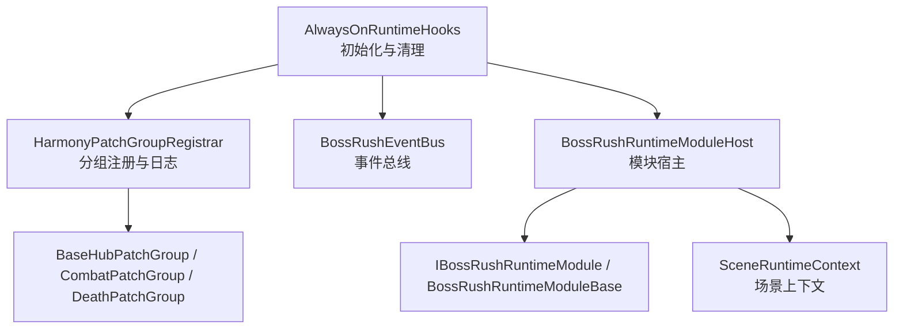
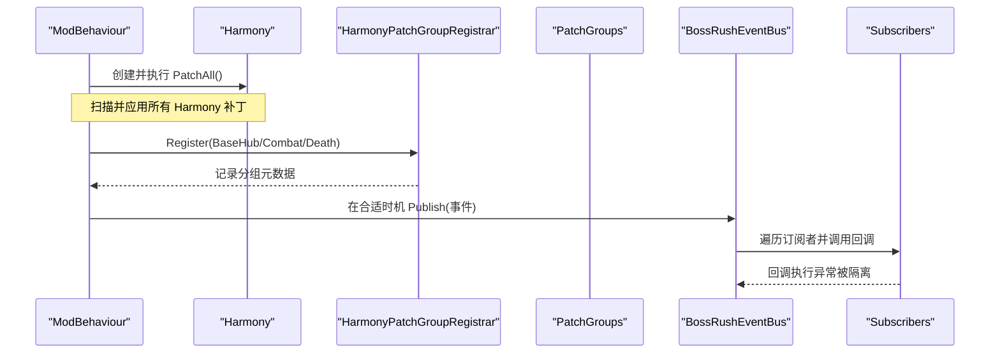
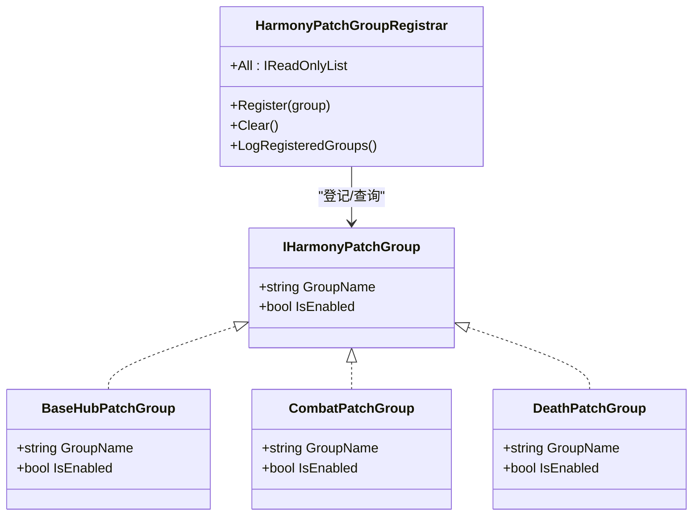
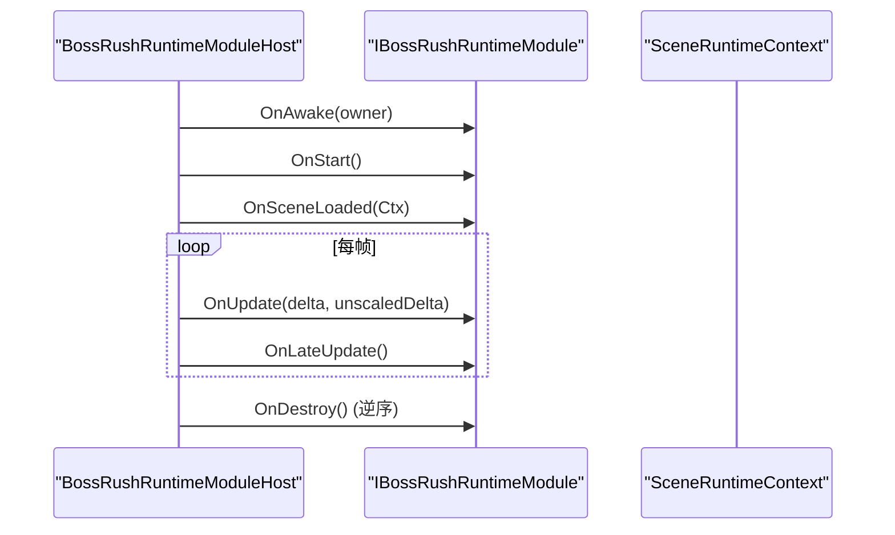
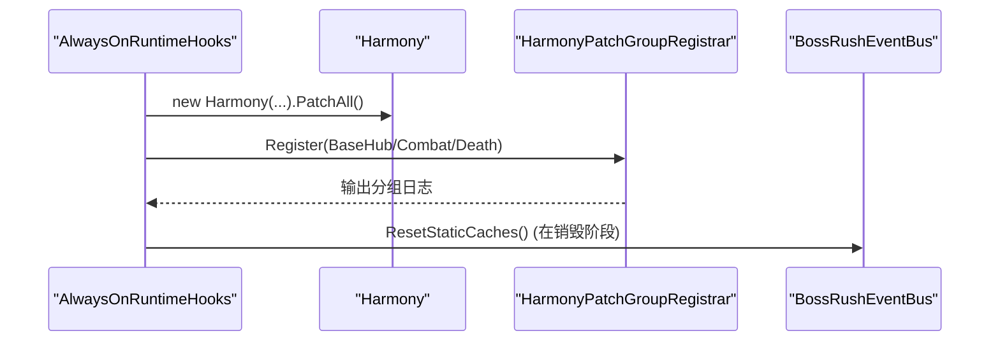
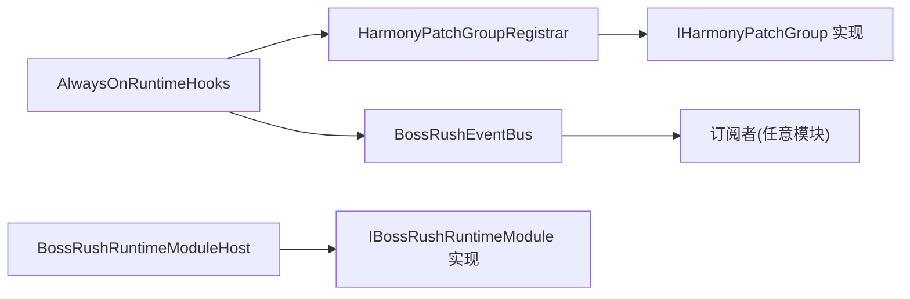

# 事件驱动架构

<cite>
**本文引用的文件**
- [BossRushEventBus.cs](file://Common/Events/BossRushEventBus.cs)
- [IHarmonyPatchGroup.cs](file://Common/Infrastructure/IHarmonyPatchGroup.cs)
- [HarmonyPatchGroupRegistrar.cs](file://Common/Infrastructure/HarmonyPatchGroupRegistrar.cs)
- [BaseHubPatchGroup.cs](file://Patches/BaseHub/BaseHubPatchGroup.cs)
- [CombatPatchGroup.cs](file://Patches/Combat/CombatPatchGroup.cs)
- [DeathPatchGroup.cs](file://Patches/Death/DeathPatchGroup.cs)
- [AlwaysOnRuntimeHooks.cs](file://Utilities/AlwaysOnRuntimeHooks.cs)
- [IBossRushRuntimeModule.cs](file://Common/Lifecycle/IBossRushRuntimeModule.cs)
- [BossRushRuntimeModuleBase.cs](file://Common/Lifecycle/BossRushRuntimeModuleBase.cs)
- [BossRushRuntimeModuleHost.cs](file://Common/Lifecycle/BossRushRuntimeModuleHost.cs)
- [SceneRuntimeContext.cs](file://Common/Lifecycle/SceneRuntimeContext.cs)
</cite>

## 目录
1. [简介](#简介)
2. [项目结构](#项目结构)
3. [核心组件](#核心组件)
4. [架构总览](#架构总览)
5. [详细组件分析](#详细组件分析)
6. [依赖关系分析](#依赖关系分析)
7. [性能考虑](#性能考虑)
8. [故障排查指南](#故障排查指南)
9. [结论](#结论)
10. [附录：示例与最佳实践](#附录示例与最佳实践)

## 简介
本文件系统性阐述 BossRushMod 的事件驱动架构，重点围绕以下方面：
- 事件总线 BossRushEventBus 的实现原理：事件订阅、发布、生命周期管理、重入保护与异常隔离。
- Harmony 补丁组的注册与管理机制：IHarmonyPatchGroup 接口规范、分组元数据登记、日志输出与扩展点。
- 运行时模块生命周期：基于 IBossRushRuntimeModule 的 Awake/Start/SceneLoaded/Update/LateUpdate/Destroy 流程。
- 事件驱动模式在模组开发中的优势：解耦、可扩展性、可测试性。
- 事件优先级、异步处理、错误传播与调试技巧。
- 性能考量与最佳实践建议。

## 项目结构
BossRushMod 将“事件”“Harmony 补丁组”“运行时模块”三大基础设施集中在 Common 目录下，并通过 Utilities 中的启动钩子完成初始化与清理；具体业务 Patch 按领域分目录组织（如 Patches/BaseHub、Patches/Combat、Patches/Death）。



**图示来源**
- [AlwaysOnRuntimeHooks.cs:7-59](file://Utilities/AlwaysOnRuntimeHooks.cs#L7-L59)
- [HarmonyPatchGroupRegistrar.cs:10-61](file://Common/Infrastructure/HarmonyPatchGroupRegistrar.cs#L10-L61)
- [BossRushEventBus.cs:10-136](file://Common/Events/BossRushEventBus.cs#L10-L136)
- [BossRushRuntimeModuleHost.cs:6-127](file://Common/Lifecycle/BossRushRuntimeModuleHost.cs#L6-L127)
- [IBossRushRuntimeModule.cs:5-15](file://Common/Lifecycle/IBossRushRuntimeModule.cs#L5-L15)
- [BossRushRuntimeModuleBase.cs:3-13](file://Common/Lifecycle/BossRushRuntimeModuleBase.cs#L3-L13)
- [SceneRuntimeContext.cs:5-19](file://Common/Lifecycle/SceneRuntimeContext.cs#L5-L19)

**章节来源**
- [AlwaysOnRuntimeHooks.cs:7-59](file://Utilities/AlwaysOnRuntimeHooks.cs#L7-L59)
- [HarmonyPatchGroupRegistrar.cs:10-61](file://Common/Infrastructure/HarmonyPatchGroupRegistrar.cs#L10-L61)
- [BossRushEventBus.cs:10-136](file://Common/Events/BossRushEventBus.cs#L10-L136)
- [BossRushRuntimeModuleHost.cs:6-127](file://Common/Lifecycle/BossRushRuntimeModuleHost.cs#L6-L127)
- [IBossRushRuntimeModule.cs:5-15](file://Common/Lifecycle/IBossRushRuntimeModule.cs#L5-L15)
- [BossRushRuntimeModuleBase.cs:3-13](file://Common/Lifecycle/BossRushRuntimeModuleBase.cs#L3-L13)
- [SceneRuntimeContext.cs:5-19](file://Common/Lifecycle/SceneRuntimeContext.cs#L5-L19)

## 核心组件
- 事件总线 BossRushEventBus：提供类型安全的泛型事件订阅/发布，内置快照分发、共享缓冲复用、重入深度计数、异常隔离与静态缓存重置能力。
- Harmony 补丁组：通过 IHarmonyPatchGroup 定义分组元数据，由 HarmonyPatchGroupRegistrar 集中登记、去重、日志输出，便于调试与未来开关扩展。
- 运行时模块：以 IBossRushRuntimeModule 为契约，BossRushRuntimeModuleHost 统一调度生命周期，封装异常捕获与反向销毁顺序。

**章节来源**
- [BossRushEventBus.cs:10-136](file://Common/Events/BossRushEventBus.cs#L10-L136)
- [IHarmonyPatchGroup.cs:3-14](file://Common/Infrastructure/IHarmonyPatchGroup.cs#L3-L14)
- [HarmonyPatchGroupRegistrar.cs:10-61](file://Common/Infrastructure/HarmonyPatchGroupRegistrar.cs#L10-L61)
- [IBossRushRuntimeModule.cs:5-15](file://Common/Lifecycle/IBossRushRuntimeModule.cs#L5-L15)
- [BossRushRuntimeModuleHost.cs:6-127](file://Common/Lifecycle/BossRushRuntimeModuleHost.cs#L6-L127)

## 架构总览
下图展示从模组启动到事件发布与补丁组登记的完整链路。



**图示来源**
- [AlwaysOnRuntimeHooks.cs:7-59](file://Utilities/AlwaysOnRuntimeHooks.cs#L7-L59)
- [HarmonyPatchGroupRegistrar.cs:14-57](file://Common/Infrastructure/HarmonyPatchGroupRegistrar.cs#L14-L57)
- [BossRushEventBus.cs:60-113](file://Common/Events/BossRushEventBus.cs#L60-L113)

## 详细组件分析

### 事件总线 BossRushEventBus
- 设计要点
  - 类型安全：使用泛型 Action<TEvent> 作为处理器，避免反射开销。
  - 订阅/取消订阅：内部维护 Type -> List<Delegate> 映射，支持重复订阅防护与空引用防御。
  - 发布流程：取当前订阅列表快照，优先复用共享缓冲数组以减少分配；逐条调用处理器，并在首次进入时置空已分发项以避免重入导致的副作用。
  - 重入保护：publishDepth 计数器确保嵌套发布时的正确行为；finally 中清理快照引用，防止内存泄漏。
  - 异常隔离：每个处理器 try/catch 包裹，失败仅记录警告日志，不中断后续处理器。
  - 生命周期：提供 ClearRuntimeSubscribers 与 ResetStaticCaches，配合模组卸载或重载进行资源回收。

- 复杂度与性能
  - 订阅/取消：O(n) 查找与移除（n 为同类型订阅者数量），通常较小。
  - 发布：O(k) 遍历 k 个处理器；共享缓冲在首次需要时扩容，减少频繁分配。
  - 内存：发布期间使用固定容量缓冲，必要时扩容；完成后清空引用，降低 GC 压力。

- 适用场景
  - 低耦合通知：成就解锁、战斗阶段切换、UI 刷新等跨模块通知。
  - 对实时性要求不高但需高可靠性的广播。

```mermaid
flowchart TD
Start(["Publish 入口"]) --> Lookup["查找事件类型的订阅者列表"]
Lookup --> Has{"存在且非空?"}
Has -- 否 --> End(["返回"])
Has -- 是 --> Snapshot{"是否顶层发布?"}
Snapshot -- 是 --> UseScratch["复制至共享缓冲"]
Snapshot -- 否 --> ToArray["复制到新数组"]
UseScratch --> Inc["publishDepth++"]
ToArray --> Inc
Inc --> Loop{"遍历处理器"}
Loop --> Call["调用 handler(eventData)"]
Call --> Catch{"是否抛出异常?"}
Catch -- 是 --> LogWarn["记录警告日志"]
Catch -- 否 --> Next["下一个处理器"]
LogWarn --> Next
Next --> |还有| Loop
Next --> |结束 --> Dec["publishDepth--"]
Dec --> Clear{"depth==0?"}
Clear -- 是 --> Release["清空快照引用"]
Clear -- 否 --> End
Release --> End
```

**图示来源**
- [BossRushEventBus.cs:60-113](file://Common/Events/BossRushEventBus.cs#L60-L113)
- [BossRushEventBus.cs:115-124](file://Common/Events/BossRushEventBus.cs#L115-L124)

**章节来源**
- [BossRushEventBus.cs:10-136](file://Common/Events/BossRushEventBus.cs#L10-L136)

### Harmony 补丁组与注册器
- IHarmonyPatchGroup 接口
  - GroupName：用于日志与调试标识。
  - IsEnabled：预留按组启用/禁用的扩展点（当前未改变 Patch apply 方式）。

- HarmonyPatchGroupRegistrar
  - Register：去重注册（按类型或名称），避免重复登记。
  - LogRegisteredGroups：统一输出分组元数据日志，便于问题定位。
  - Clear：用于模组重载/销毁兜底。

- 具体分组实现
  - BaseHubPatchGroup、CombatPatchGroup、DeathPatchGroup：分别对应基地设施、战斗、死亡/尸体相关 Patch 的分组标记。



**图示来源**
- [IHarmonyPatchGroup.cs:3-14](file://Common/Infrastructure/IHarmonyPatchGroup.cs#L3-L14)
- [BaseHubPatchGroup.cs:9-13](file://Patches/BaseHub/BaseHubPatchGroup.cs#L9-L13)
- [CombatPatchGroup.cs:9-13](file://Patches/Combat/CombatPatchGroup.cs#L9-L13)
- [DeathPatchGroup.cs:9-13](file://Patches/Death/DeathPatchGroup.cs#L9-L13)
- [HarmonyPatchGroupRegistrar.cs:10-61](file://Common/Infrastructure/HarmonyPatchGroupRegistrar.cs#L10-L61)

**章节来源**
- [IHarmonyPatchGroup.cs:3-14](file://Common/Infrastructure/IHarmonyPatchGroup.cs#L3-L14)
- [HarmonyPatchGroupRegistrar.cs:10-61](file://Common/Infrastructure/HarmonyPatchGroupRegistrar.cs#L10-L61)
- [BaseHubPatchGroup.cs:9-13](file://Patches/BaseHub/BaseHubPatchGroup.cs#L9-L13)
- [CombatPatchGroup.cs:9-13](file://Patches/Combat/CombatPatchGroup.cs#L9-L13)
- [DeathPatchGroup.cs:9-13](file://Patches/Death/DeathPatchGroup.cs#L9-L13)

### 运行时模块生命周期
- 契约与基类
  - IBossRushRuntimeModule：定义 ModuleName 与生命周期方法（Awake/Start/SceneLoaded/Update/LateUpdate/Destroy）。
  - BossRushRuntimeModuleBase：提供默认空实现，子类按需覆盖。

- 宿主调度
  - BossRushRuntimeModuleHost：集中注册模块，按序调用各生命周期方法，统一捕获异常并记录警告；销毁时逆序释放。
  - SceneRuntimeContext：携带场景信息（场景对象、加载模式、名称、构建索引）传递给模块。



**图示来源**
- [IBossRushRuntimeModule.cs:5-15](file://Common/Lifecycle/IBossRushRuntimeModule.cs#L5-L15)
- [BossRushRuntimeModuleBase.cs:3-13](file://Common/Lifecycle/BossRushRuntimeModuleBase.cs#L3-L13)
- [BossRushRuntimeModuleHost.cs:21-118](file://Common/Lifecycle/BossRushRuntimeModuleHost.cs#L21-L118)
- [SceneRuntimeContext.cs:5-19](file://Common/Lifecycle/SceneRuntimeContext.cs#L5-L19)

**章节来源**
- [IBossRushRuntimeModule.cs:5-15](file://Common/Lifecycle/IBossRushRuntimeModule.cs#L5-L15)
- [BossRushRuntimeModuleBase.cs:3-13](file://Common/Lifecycle/BossRushRuntimeModuleBase.cs#L3-L13)
- [BossRushRuntimeModuleHost.cs:21-118](file://Common/Lifecycle/BossRushRuntimeModuleHost.cs#L21-L118)
- [SceneRuntimeContext.cs:5-19](file://Common/Lifecycle/SceneRuntimeContext.cs#L5-L19)

### 启动与清理流程
- 启动
  - AlwaysOnRuntimeHooks.InitializeBootstrapRuntime：创建 Harmony 实例并执行 PatchAll；注册并输出 Patch 分组元数据；校验关键动态物品补丁完整性。
- 清理
  - AlwaysOnRuntimeHooks.CleanupAlwaysOnRuntimeOnDestroy：关闭/重置各类子系统缓存，包括事件总线、反射缓存、音频、地图缩略图等，保证热重载与卸载安全。



**图示来源**
- [AlwaysOnRuntimeHooks.cs:7-59](file://Utilities/AlwaysOnRuntimeHooks.cs#L7-L59)
- [AlwaysOnRuntimeHooks.cs:121-186](file://Utilities/AlwaysOnRuntimeHooks.cs#L121-L186)
- [BossRushEventBus.cs:126-136](file://Common/Events/BossRushEventBus.cs#L126-L136)

**章节来源**
- [AlwaysOnRuntimeHooks.cs:7-59](file://Utilities/AlwaysOnRuntimeHooks.cs#L7-L59)
- [AlwaysOnRuntimeHooks.cs:121-186](file://Utilities/AlwaysOnRuntimeHooks.cs#L121-L186)

## 依赖关系分析
- 松耦合
  - 事件总线与订阅者之间无直接引用，仅通过类型匹配，降低耦合度。
  - 补丁组仅承载元数据，实际 Patch 应用仍由 Harmony 完成，职责清晰。
- 内聚性
  - 事件总线聚焦于事件分发与生命周期管理。
  - 运行时模块宿主专注于生命周期调度与异常隔离。
- 外部依赖
  - Harmony：用于注入游戏代码逻辑。
  - Unity 场景系统：通过 SceneRuntimeContext 传递场景信息。



**图示来源**
- [BossRushEventBus.cs:10-136](file://Common/Events/BossRushEventBus.cs#L10-L136)
- [HarmonyPatchGroupRegistrar.cs:10-61](file://Common/Infrastructure/HarmonyPatchGroupRegistrar.cs#L10-L61)
- [BossRushRuntimeModuleHost.cs:6-127](file://Common/Lifecycle/BossRushRuntimeModuleHost.cs#L6-L127)
- [AlwaysOnRuntimeHooks.cs:7-59](file://Utilities/AlwaysOnRuntimeHooks.cs#L7-L59)

**章节来源**
- [BossRushEventBus.cs:10-136](file://Common/Events/BossRushEventBus.cs#L10-L136)
- [HarmonyPatchGroupRegistrar.cs:10-61](file://Common/Infrastructure/HarmonyPatchGroupRegistrar.cs#L10-L61)
- [BossRushRuntimeModuleHost.cs:6-127](file://Common/Lifecycle/BossRushRuntimeModuleHost.cs#L6-L127)
- [AlwaysOnRuntimeHooks.cs:7-59](file://Utilities/AlwaysOnRuntimeHooks.cs#L7-L59)

## 性能考虑
- 事件发布
  - 使用共享缓冲数组减少分配，仅在必要时扩容；发布结束后清空引用，降低 GC 压力。
  - 异常隔离避免单点失败导致整体阻塞。
- 订阅管理
  - 避免重复订阅；及时取消订阅，防止悬挂委托导致内存泄漏。
- 运行时模块
  - 宿主统一捕获异常，避免单模块崩溃影响其他模块。
  - 销毁阶段逆序释放，确保依赖关系正确。
- 建议
  - 高频事件尽量轻量，避免在处理器中进行昂贵计算或 IO。
  - 对 UI 更新等敏感操作，结合帧周期或节流策略。
  - 使用 SceneRuntimeContext 控制场景级逻辑，避免跨场景误用状态。

[本节为通用性能指导，无需特定文件来源]

## 故障排查指南
- 事件未触发
  - 检查是否正确调用 Subscribe；确认事件类型一致；确认未被提前 Unsubscribe。
  - 查看事件总线日志中是否有处理器异常警告。
- 事件处理器异常
  - 事件总线会记录警告日志，包含事件名与异常消息；据此定位具体处理器。
- 补丁组未生效
  - 确认 AlwaysOnRuntimeHooks 已执行 PatchAll 与分组注册；查看分组日志输出。
- 模块生命周期异常
  - 宿主会在各生命周期捕获异常并记录警告；根据模块名与方法名定位问题。
- 资源未释放
  - 确认模组销毁阶段调用了相应 ResetStaticCaches/Cleanup；检查事件总线与反射缓存是否重置。

**章节来源**
- [BossRushEventBus.cs:90-98](file://Common/Events/BossRushEventBus.cs#L90-L98)
- [BossRushEventBus.cs:126-136](file://Common/Events/BossRushEventBus.cs#L126-L136)
- [HarmonyPatchGroupRegistrar.cs:51-57](file://Common/Infrastructure/HarmonyPatchGroupRegistrar.cs#L51-L57)
- [BossRushRuntimeModuleHost.cs:120-127](file://Common/Lifecycle/BossRushRuntimeModuleHost.cs#L120-L127)
- [AlwaysOnRuntimeHooks.cs:121-186](file://Utilities/AlwaysOnRuntimeHooks.cs#L121-L186)

## 结论
BossRushMod 通过事件总线、Harmony 补丁组与运行时模块三大基础设施，构建了高内聚、低耦合的事件驱动架构。事件总线提供稳定可靠的广播机制，补丁组提供清晰的分组管理与调试能力，运行时模块则统一了生命周期与异常处理。该架构显著提升了模组的可扩展性与可测试性，并为后续功能演进提供了良好基础。

[本节为总结性内容，无需特定文件来源]

## 附录：示例与示例路径
以下为常见用法的路径指引（不包含具体代码内容）：
- 定义事件与发布
  - 事件结构体定义参考：[BossRushAchievementUnlockedEvent:139-147](file://Common/Events/BossRushEventBus.cs#L139-L147)
  - 发布事件参考：[Publish 调用位置:60-113](file://Common/Events/BossRushEventBus.cs#L60-L113)
- 订阅与取消订阅
  - 订阅事件参考：[Subscribe:18-37](file://Common/Events/BossRushEventBus.cs#L18-L37)
  - 取消订阅参考：[Unsubscribe:39-58](file://Common/Events/BossRushEventBus.cs#L39-L58)
- 注册与使用补丁组
  - 注册分组参考：[Register:14-39](file://Common/Infrastructure/HarmonyPatchGroupRegistrar.cs#L14-L39)
  - 分组实现参考：[BaseHubPatchGroup:9-13](file://Patches/BaseHub/BaseHubPatchGroup.cs#L9-L13)、[CombatPatchGroup:9-13](file://Patches/Combat/CombatPatchGroup.cs#L9-L13)、[DeathPatchGroup:9-13](file://Patches/Death/DeathPatchGroup.cs#L9-L13)
- 实现运行时模块
  - 接口定义参考：[IBossRushRuntimeModule:5-15](file://Common/Lifecycle/IBossRushRuntimeModule.cs#L5-L15)
  - 基类参考：[BossRushRuntimeModuleBase:3-13](file://Common/Lifecycle/BossRushRuntimeModuleBase.cs#L3-L13)
  - 宿主调度参考：[BossRushRuntimeModuleHost:21-118](file://Common/Lifecycle/BossRushRuntimeModuleHost.cs#L21-L118)
- 启动与清理
  - 启动流程参考：[InitializeBootstrapRuntime:7-59](file://Utilities/AlwaysOnRuntimeHooks.cs#L7-L59)
  - 清理流程参考：[CleanupAlwaysOnRuntimeOnDestroy:121-186](file://Utilities/AlwaysOnRuntimeHooks.cs#L121-L186)

**章节来源**
- [BossRushEventBus.cs:18-147](file://Common/Events/BossRushEventBus.cs#L18-L147)
- [HarmonyPatchGroupRegistrar.cs:14-57](file://Common/Infrastructure/HarmonyPatchGroupRegistrar.cs#L14-L57)
- [BaseHubPatchGroup.cs:9-13](file://Patches/BaseHub/BaseHubPatchGroup.cs#L9-L13)
- [CombatPatchGroup.cs:9-13](file://Patches/Combat/CombatPatchGroup.cs#L9-L13)
- [DeathPatchGroup.cs:9-13](file://Patches/Death/DeathPatchGroup.cs#L9-L13)
- [IBossRushRuntimeModule.cs:5-15](file://Common/Lifecycle/IBossRushRuntimeModule.cs#L5-L15)
- [BossRushRuntimeModuleBase.cs:3-13](file://Common/Lifecycle/BossRushRuntimeModuleBase.cs#L3-L13)
- [BossRushRuntimeModuleHost.cs:21-118](file://Common/Lifecycle/BossRushRuntimeModuleHost.cs#L21-L118)
- [AlwaysOnRuntimeHooks.cs:7-59](file://Utilities/AlwaysOnRuntimeHooks.cs#L7-L59)
- [AlwaysOnRuntimeHooks.cs:121-186](file://Utilities/AlwaysOnRuntimeHooks.cs#L121-L186)