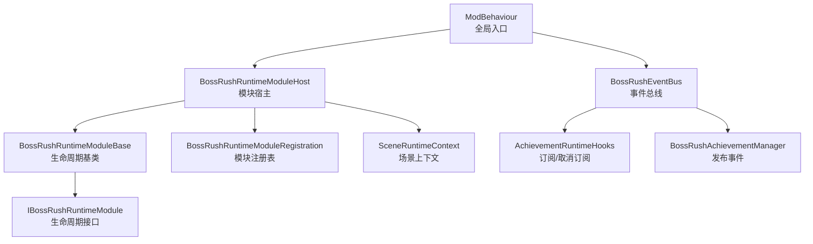
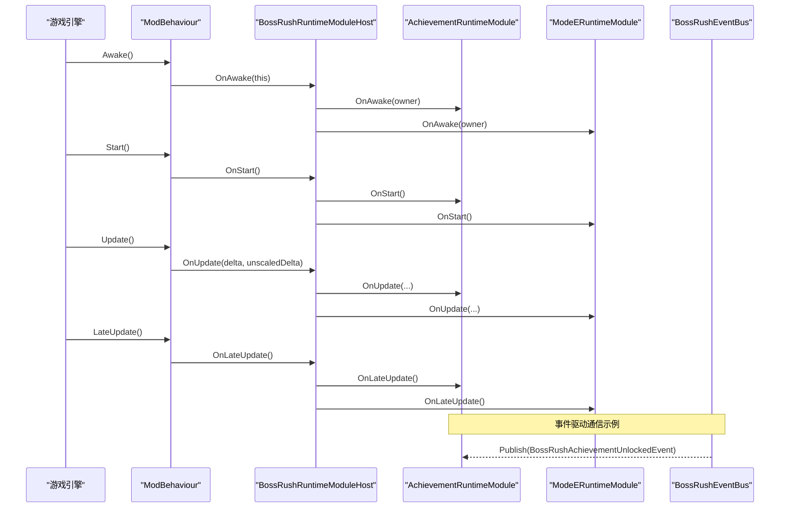
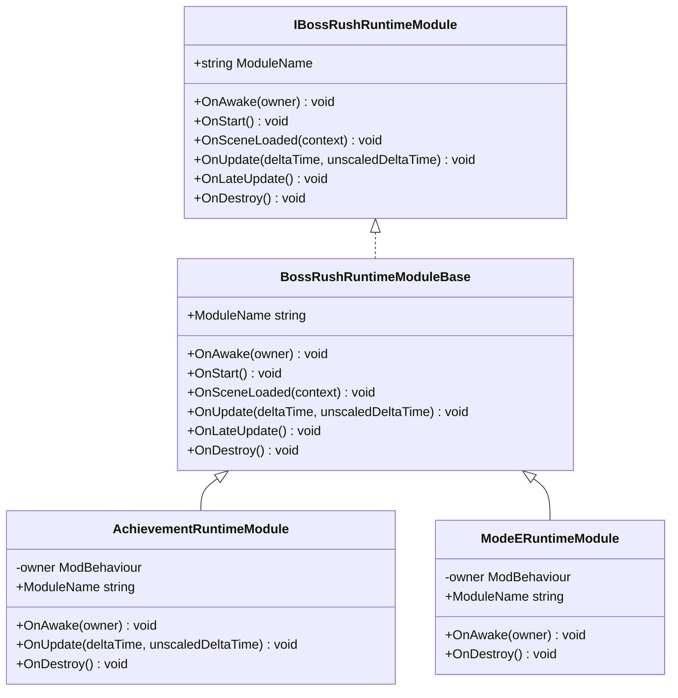
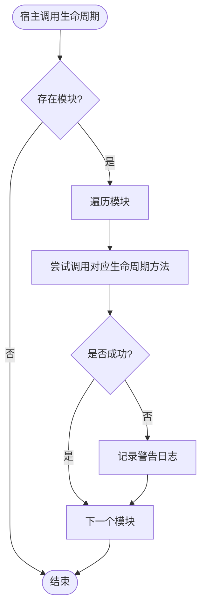
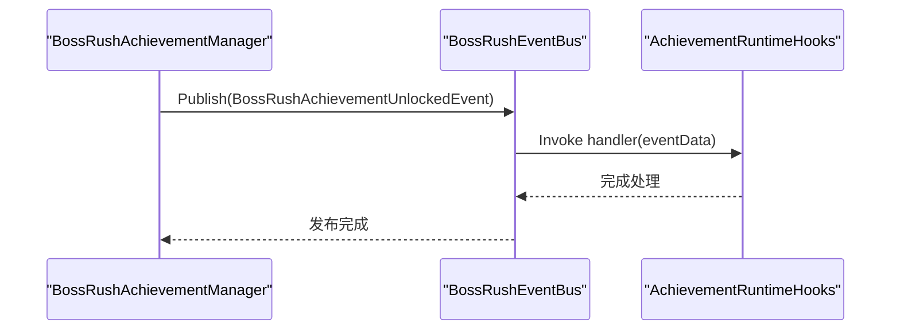
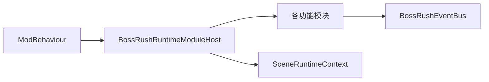

# 架构设计

<cite>
**本文引用的文件**
- [ModBehaviour.cs](file://ModBehaviour.cs)
- [BossRushRuntimeModuleBase.cs](file://Common/Lifecycle/BossRushRuntimeModuleBase.cs)
- [IBossRushRuntimeModule.cs](file://Common/Lifecycle/IBossRushRuntimeModule.cs)
- [BossRushRuntimeModuleHost.cs](file://Common/Lifecycle/BossRushRuntimeModuleHost.cs)
- [BossRushRuntimeModuleRegistration.cs](file://Common/Lifecycle/BossRushRuntimeModuleRegistration.cs)
- [SceneRuntimeContext.cs](file://Common/Lifecycle/SceneRuntimeContext.cs)
- [ArchitectureSentinelRuntimeModule.cs](file://Common/Lifecycle/ArchitectureSentinelRuntimeModule.cs)
- [AchievementRuntimeModule.cs](file://Achievement/AchievementRuntimeModule.cs)
- [ModeERuntimeModule.cs](file://ModeE/ModeERuntimeModule.cs)
- [BossRushEventBus.cs](file://Common/Events/BossRushEventBus.cs)
- [AchievementRuntimeHooks.cs](file://Achievement/AchievementRuntimeHooks.cs)
- [BossRushAchievementManager.cs](file://Achievement/BossRushAchievementManager.cs)
</cite>

## 目录
1. [简介](#简介)
2. [项目结构](#项目结构)
3. [核心组件](#核心组件)
4. [架构总览](#架构总览)
5. [详细组件分析](#详细组件分析)
6. [依赖关系分析](#依赖关系分析)
7. [性能与运行时特性](#性能与运行时特性)
8. [横切关注点：安全、监控与灾难恢复](#横切关注点安全监控与灾难恢复)
9. [故障排查指南](#故障排查指南)
10. [结论](#结论)

## 简介
本架构设计文档聚焦 BossRushMod 的模块化架构原理、运行时模块系统、生命周期管理机制与事件驱动通信模式。围绕以下关键设计展开：
- 基于接口与基类的运行时模块抽象，统一生命周期钩子
- 宿主管理器集中调度模块生命周期，提供异常隔离与错误日志
- 轻量级事件总线实现跨模块解耦通信，支持嵌套发布与内存复用
- 场景上下文传递，使模块在场景加载时获取必要信息并初始化
- 以 ModBehaviour 为根节点，串联启动、更新、销毁等全局流程

该设计强调低耦合、高内聚、可扩展与可维护性，同时兼顾游戏运行时的稳定性与性能。

## 项目结构
BossRushMod 采用按功能域划分的目录组织方式，核心运行时基础设施位于 Common/Lifecycle 与 Common/Events；各模式（D/E/F/G/Zombie）与子系统（成就、音频、地图配置等）作为独立模块通过统一的运行时宿主进行注册与调度。

图表来源
- [ModBehaviour.cs:598-797](file://ModBehaviour.cs#L598-L797)
- [BossRushRuntimeModuleHost.cs:1-130](file://Common/Lifecycle/BossRushRuntimeModuleHost.cs#L1-L130)
- [BossRushRuntimeModuleBase.cs:1-15](file://Common/Lifecycle/BossRushRuntimeModuleBase.cs#L1-L15)
- [IBossRushRuntimeModule.cs:1-17](file://Common/Lifecycle/IBossRushRuntimeModule.cs#L1-L17)
- [BossRushRuntimeModuleRegistration.cs:1-19](file://Common/Lifecycle/BossRushRuntimeModuleRegistration.cs#L1-L19)
- [SceneRuntimeContext.cs:1-21](file://Common/Lifecycle/SceneRuntimeContext.cs#L1-L21)
- [BossRushEventBus.cs:1-149](file://Common/Events/BossRushEventBus.cs#L1-L149)
- [AchievementRuntimeHooks.cs:1-60](file://Achievement/AchievementRuntimeHooks.cs#L1-L60)
- [BossRushAchievementManager.cs:240-270](file://Achievement/BossRushAchievementManager.cs#L240-L270)

章节来源
- [ModBehaviour.cs:598-797](file://ModBehaviour.cs#L598-L797)
- [BossRushRuntimeModuleRegistration.cs:1-19](file://Common/Lifecycle/BossRushRuntimeModuleRegistration.cs#L1-L19)

## 核心组件
- 运行时模块接口与基类：定义统一的生命周期方法（Awake/Start/SceneLoaded/Update/LateUpdate/Destroy），默认空实现便于按需覆盖
- 模块宿主：集中管理模块集合，按顺序调用生命周期方法，捕获异常并记录警告日志，确保单个模块失败不影响整体
- 场景上下文：封装场景对象、加载模式、名称与构建索引，供模块在场景加载阶段使用
- 事件总线：类型安全的泛型事件分发，支持订阅/取消订阅/发布，具备重入保护与共享缓冲，避免频繁分配
- 模块注册：在 ModBehaviour 中集中注册各功能模块，保证启动顺序与一致性

章节来源
- [BossRushRuntimeModuleBase.cs:1-15](file://Common/Lifecycle/BossRushRuntimeModuleBase.cs#L1-L15)
- [BossRushRuntimeModuleHost.cs:1-130](file://Common/Lifecycle/BossRushRuntimeModuleHost.cs#L1-L130)
- [SceneRuntimeContext.cs:1-21](file://Common/Lifecycle/SceneRuntimeContext.cs#L1-L21)
- [BossRushEventBus.cs:1-149](file://Common/Events/BossRushEventBus.cs#L1-L149)
- [BossRushRuntimeModuleRegistration.cs:1-19](file://Common/Lifecycle/BossRushRuntimeModuleRegistration.cs#L1-L19)

## 架构总览
BossRushMod 采用“宿主驱动 + 事件总线”的混合架构：
- 宿主驱动：所有运行时逻辑被拆分为模块，由宿主统一调度生命周期，降低耦合度
- 事件总线：模块之间通过事件进行松耦合通信，避免直接依赖
- 场景上下文：在场景切换时向模块传递必要的场景信息，便于按需初始化或清理

图表来源
- [ModBehaviour.cs:598-797](file://ModBehaviour.cs#L598-L797)
- [BossRushRuntimeModuleHost.cs:1-130](file://Common/Lifecycle/BossRushRuntimeModuleHost.cs#L1-L130)
- [AchievementRuntimeModule.cs:1-33](file://Achievement/AchievementRuntimeModule.cs#L1-L33)
- [ModeERuntimeModule.cs:1-29](file://ModeE/ModeERuntimeModule.cs#L1-L29)
- [BossRushEventBus.cs:1-149](file://Common/Events/BossRushEventBus.cs#L1-L149)

## 详细组件分析

### 运行时模块基类与接口
- 接口 IBossRushRuntimeModule 定义了模块必须实现的生命周期方法
- 基类 BossRushRuntimeModuleBase 提供默认空实现，子类可按需覆盖
- 优势：简化模块开发，减少样板代码，提高一致性

图表来源
- [IBossRushRuntimeModule.cs:1-17](file://Common/Lifecycle/IBossRushRuntimeModule.cs#L1-L17)
- [BossRushRuntimeModuleBase.cs:1-15](file://Common/Lifecycle/BossRushRuntimeModuleBase.cs#L1-L15)
- [AchievementRuntimeModule.cs:1-33](file://Achievement/AchievementRuntimeModule.cs#L1-L33)
- [ModeERuntimeModule.cs:1-29](file://ModeE/ModeERuntimeModule.cs#L1-L29)

章节来源
- [BossRushRuntimeModuleBase.cs:1-15](file://Common/Lifecycle/BossRushRuntimeModuleBase.cs#L1-L15)
- [AchievementRuntimeModule.cs:1-33](file://Achievement/AchievementRuntimeModule.cs#L1-L33)
- [ModeERuntimeModule.cs:1-29](file://ModeE/ModeERuntimeModule.cs#L1-L29)

### 模块宿主与生命周期调度
- 宿主维护模块列表，按顺序调用生命周期方法
- 每个生命周期调用均包裹 try/catch，捕获异常并记录警告日志，避免单模块失败影响整体
- 销毁阶段逆序调用 OnDestroy，确保资源释放顺序正确

图表来源
- [BossRushRuntimeModuleHost.cs:21-118](file://Common/Lifecycle/BossRushRuntimeModuleHost.cs#L21-L118)

章节来源
- [BossRushRuntimeModuleHost.cs:1-130](file://Common/Lifecycle/BossRushRuntimeModuleHost.cs#L1-L130)

### 事件总线与事件驱动通信
- 事件总线提供类型安全的泛型事件机制，支持 Subscribe/Unsubscribe/Publish
- 发布时使用快照与共享缓冲，避免并发修改导致的异常与频繁分配
- 支持嵌套发布（publishDepth），确保重入安全
- 典型用例：成就解锁事件由管理器发布，由运行时钩子订阅处理

图表来源
- [BossRushEventBus.cs:60-113](file://Common/Events/BossRushEventBus.cs#L60-L113)
- [AchievementRuntimeHooks.cs:1-60](file://Achievement/AchievementRuntimeHooks.cs#L1-L60)
- [BossRushAchievementManager.cs:240-270](file://Achievement/BossRushAchievementManager.cs#L240-L270)

章节来源
- [BossRushEventBus.cs:1-149](file://Common/Events/BossRushEventBus.cs#L1-L149)
- [AchievementRuntimeHooks.cs:1-60](file://Achievement/AchievementRuntimeHooks.cs#L1-L60)
- [BossRushAchievementManager.cs:240-270](file://Achievement/BossRushAchievementManager.cs#L240-L270)

### 场景上下文与模块初始化
- 场景加载时，宿主接收 SceneRuntimeContext，包含场景对象、加载模式、名称与构建索引
- 模块可在 OnSceneLoaded 中根据场景信息进行初始化或资源准备
- 优势：将场景相关逻辑与通用逻辑分离，提高模块的可重用性与可测试性

章节来源
- [SceneRuntimeContext.cs:1-21](file://Common/Lifecycle/SceneRuntimeContext.cs#L1-L21)
- [BossRushRuntimeModuleHost.cs:54-68](file://Common/Lifecycle/BossRushRuntimeModuleHost.cs#L54-L68)

### 模块注册与启动顺序
- 在 ModBehaviour.RegisterRuntimeModules 中集中注册各功能模块
- 注册顺序决定生命周期调用顺序，便于控制依赖关系
- 当前注册的模块包括架构哨兵、模式 D/E/F、调试工具、成就、公共 NPC、竞技场等

章节来源
- [BossRushRuntimeModuleRegistration.cs:1-19](file://Common/Lifecycle/BossRushRuntimeModuleRegistration.cs#L1-L19)
- [ModBehaviour.cs:598-620](file://ModBehaviour.cs#L598-L620)

## 依赖关系分析
- ModBehaviour 作为全局入口，持有 BossRushRuntimeModuleHost 实例，负责调度模块生命周期
- 模块通过继承基类实现生命周期钩子，依赖宿主进行调用
- 事件总线作为静态服务，被多个模块引用以实现解耦通信
- 场景上下文由宿主传递给模块，用于场景相关的初始化

图表来源
- [ModBehaviour.cs:598-797](file://ModBehaviour.cs#L598-L797)
- [BossRushRuntimeModuleHost.cs:1-130](file://Common/Lifecycle/BossRushRuntimeModuleHost.cs#L1-L130)
- [BossRushEventBus.cs:1-149](file://Common/Events/BossRushEventBus.cs#L1-L149)
- [SceneRuntimeContext.cs:1-21](file://Common/Lifecycle/SceneRuntimeContext.cs#L1-L21)

章节来源
- [ModBehaviour.cs:598-797](file://ModBehaviour.cs#L598-L797)
- [BossRushRuntimeModuleHost.cs:1-130](file://Common/Lifecycle/BossRushRuntimeModuleHost.cs#L1-L130)

## 性能与运行时特性
- 事件总线使用共享缓冲与快照机制，减少 GC 压力，提升高频事件发布性能
- 宿主对每个生命周期调用进行异常隔离，避免单点故障导致整体崩溃
- 模块销毁逆序执行，确保资源释放顺序合理，防止悬空引用
- 场景上下文仅传递必要信息，避免冗余数据传递

[本节为通用性能讨论，不直接分析具体文件]

## 横切关注点：安全、监控与灾难恢复
- 安全性：事件处理器异常被捕获并记录，避免恶意或错误代码破坏整体流程
- 监控：宿主与事件总线均输出警告日志，便于问题定位与性能分析
- 灾难恢复：模块宿主在异常后继续执行其他模块，保证系统韧性；事件总线支持重置静态缓存，便于热重载或场景切换后的状态清理

章节来源
- [BossRushRuntimeModuleHost.cs:120-127](file://Common/Lifecycle/BossRushRuntimeModuleHost.cs#L120-L127)
- [BossRushEventBus.cs:90-113](file://Common/Events/BossRushEventBus.cs#L90-L113)
- [BossRushEventBus.cs:126-136](file://Common/Events/BossRushEventBus.cs#L126-L136)

## 故障排查指南
- 模块生命周期异常：检查宿主日志中的警告信息，定位失败的模块与方法
- 事件未触发：确认订阅是否正确，取消订阅时机是否合适
- 场景相关逻辑失效：检查 OnSceneLoaded 是否被调用，场景上下文参数是否正确
- 性能问题：关注事件发布频率与处理器复杂度，必要时优化或拆分

章节来源
- [BossRushRuntimeModuleHost.cs:21-118](file://Common/Lifecycle/BossRushRuntimeModuleHost.cs#L21-L118)
- [BossRushEventBus.cs:60-113](file://Common/Events/BossRushEventBus.cs#L60-L113)

## 结论
BossRushMod 通过模块化架构、宿主驱动的运行时系统与事件总线实现了高内聚、低耦合的设计目标。该架构具备良好的扩展性、可维护性与运行时稳定性，适用于复杂游戏模式的开发与集成。未来可考虑引入更多横切能力（如指标收集、分布式追踪）以进一步提升可观测性与可靠性。