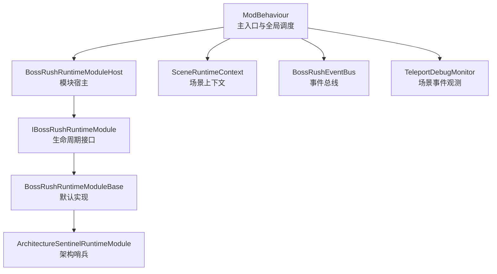
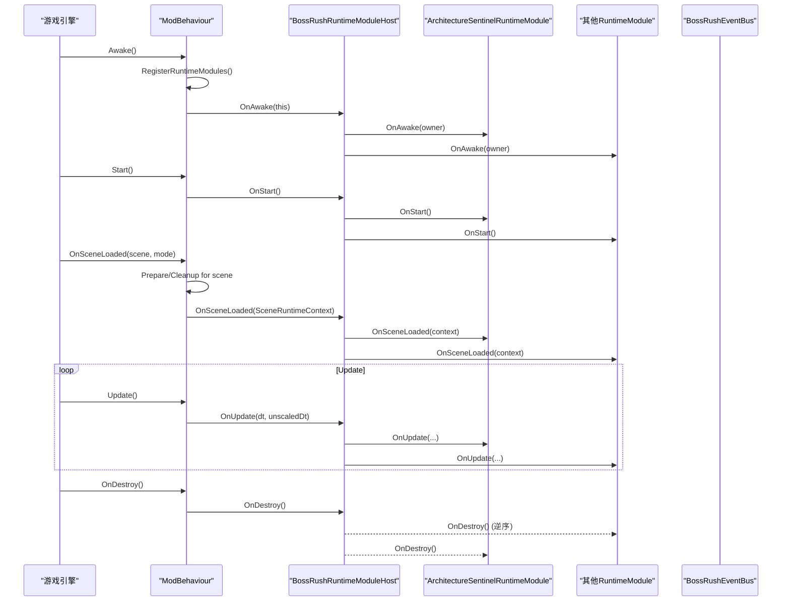
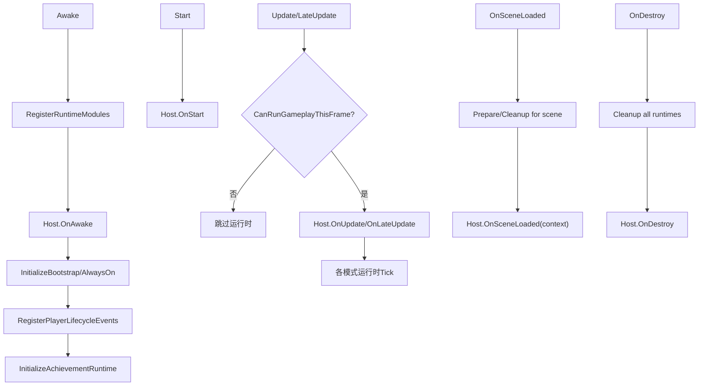
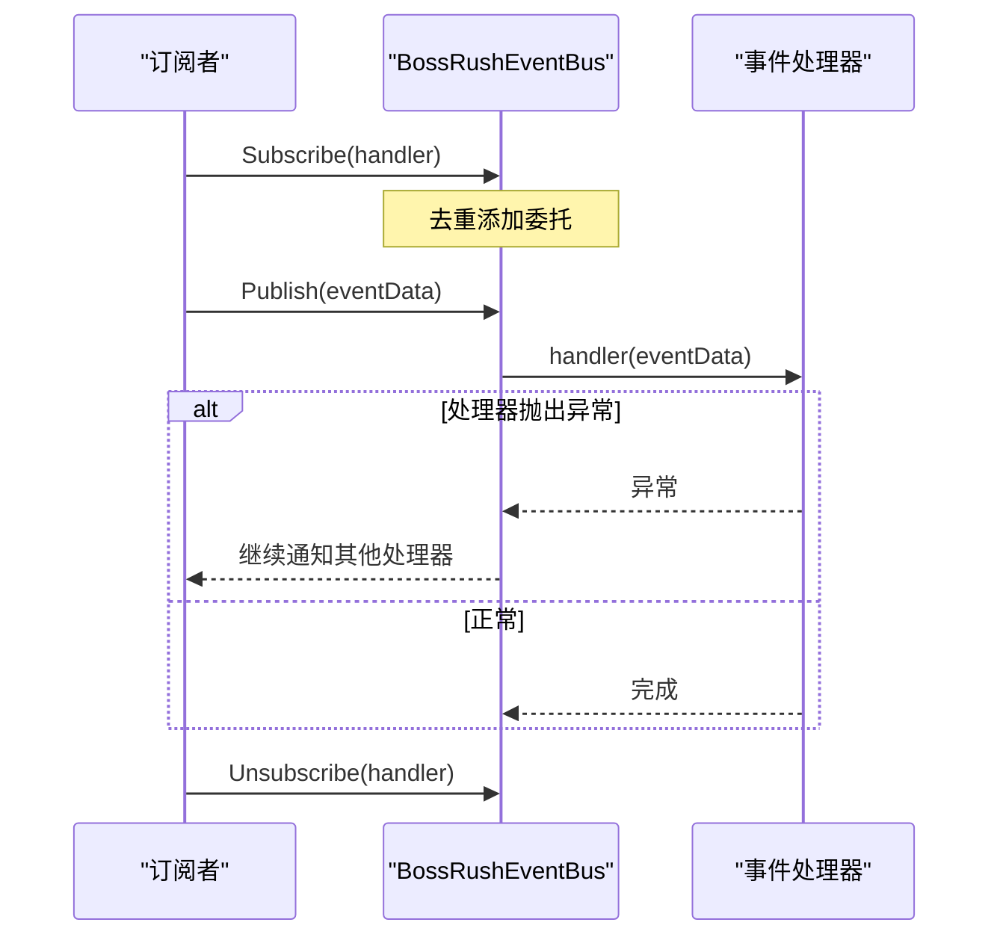
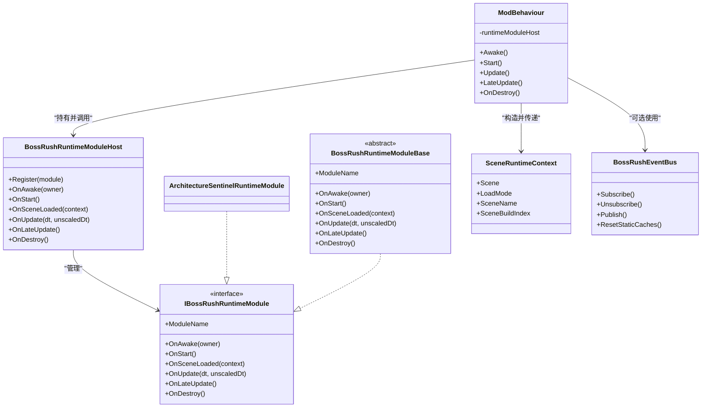

# 生命周期管理

<cite>
**本文引用的文件**
- [ModBehaviour.cs](file://ModBehaviour.cs)
- [BossRushRuntimeModuleHost.cs](file://Common/Lifecycle/BossRushRuntimeModuleHost.cs)
- [IBossRushRuntimeModule.cs](file://Common/Lifecycle/IBossRushRuntimeModule.cs)
- [BossRushRuntimeModuleBase.cs](file://Common/Lifecycle/BossRushRuntimeModuleBase.cs)
- [ArchitectureSentinelRuntimeModule.cs](file://Common/Lifecycle/ArchitectureSentinelRuntimeModule.cs)
- [SceneRuntimeContext.cs](file://Common/Lifecycle/SceneRuntimeContext.cs)
- [BossRushEventBus.cs](file://Common/Events/BossRushEventBus.cs)
- [TeleportDebugMonitor.cs](file://TeleportDebugMonitor.cs)
</cite>

## 目录
1. [简介](#简介)
2. [项目结构](#项目结构)
3. [核心组件](#核心组件)
4. [架构总览](#架构总览)
5. [详细组件分析](#详细组件分析)
6. [依赖关系分析](#依赖关系分析)
7. [性能与内存管理](#性能与内存管理)
8. [故障诊断指南](#故障诊断指南)
9. [结论](#结论)
10. [附录：场景事件监听示例](#附录：场景事件监听示例)

## 简介
本文件聚焦 BossRushMod 的生命周期管理，围绕以下目标展开：
- 解释 SceneRuntimeContext 场景上下文在加载、切换、卸载时的状态传递与管理。
- 说明 ArchitectureSentinelRuntimeModule 作为架构哨兵的作用与监控机制。
- 阐述 ModBehaviour 主入口点的生命周期控制（初始化、更新、清理）。
- 提供场景相关事件的监听与处理示例。
- 讨论内存管理、资源释放、状态持久化等关键问题。
- 给出常见生命周期问题的诊断与解决方案。

## 项目结构
BossRushMod 将运行时能力按“模块”组织，并通过统一宿主进行生命周期编排。核心路径包括：
- 主入口与全局调度：ModBehaviour
- 模块宿主与接口：BossRushRuntimeModuleHost、IBossRushRuntimeModule、BossRushRuntimeModuleBase
- 场景上下文：SceneRuntimeContext
- 架构哨兵：ArchitectureSentinelRuntimeModule
- 事件总线：BossRushEventBus
- 场景调试与钩子观测：TeleportDebugMonitor

图表来源
- [ModBehaviour.cs:598-780](file://ModBehaviour.cs#L598-L780)
- [BossRushRuntimeModuleHost.cs:1-130](file://Common/Lifecycle/BossRushRuntimeModuleHost.cs#L1-L130)
- [IBossRushRuntimeModule.cs:1-17](file://Common/Lifecycle/IBossRushRuntimeModule.cs#L1-L17)
- [BossRushRuntimeModuleBase.cs:1-15](file://Common/Lifecycle/BossRushRuntimeModuleBase.cs#L1-L15)
- [ArchitectureSentinelRuntimeModule.cs:1-11](file://Common/Lifecycle/ArchitectureSentinelRuntimeModule.cs#L1-L11)
- [SceneRuntimeContext.cs:1-21](file://Common/Lifecycle/SceneRuntimeContext.cs#L1-L21)
- [BossRushEventBus.cs:1-149](file://Common/Events/BossRushEventBus.cs#L1-L149)
- [TeleportDebugMonitor.cs:167-248](file://TeleportDebugMonitor.cs#L167-L248)

章节来源
- [ModBehaviour.cs:598-780](file://ModBehaviour.cs#L598-L780)
- [BossRushRuntimeModuleHost.cs:1-130](file://Common/Lifecycle/BossRushRuntimeModuleHost.cs#L1-L130)

## 核心组件
- ModBehaviour：游戏内单例入口，负责 Awake/Start/Update/LateUpdate/OnDestroy 等生命周期分发；注册并驱动所有 RuntimeModule；维护场景切换前后清理与准备逻辑；提供地图配置与刷新点查询。
- BossRushRuntimeModuleHost：集中管理 IBossRushRuntimeModule 列表，按顺序调用 OnAwake/OnStart/OnSceneLoaded/OnUpdate/OnLateUpdate/OnDestroy，并对异常进行捕获与日志记录，保证单个模块失败不影响整体。
- IBossRushRuntimeModule / BossRushRuntimeModuleBase：定义统一的模块生命周期契约，并提供空实现基类，便于各模式/子系统按需覆盖。
- SceneRuntimeContext：轻量不可变结构体，封装当前场景对象、加载模式、场景名与构建索引，用于跨模块安全传递场景信息。
- ArchitectureSentinelRuntimeModule：占位型架构哨兵模块，用于承载架构级检查或监控逻辑的挂载点。
- BossRushEventBus：线程安全的发布订阅总线，支持事件快照发布、重入保护、异常隔离与静态缓存重置。
- TeleportDebugMonitor：通过反射订阅引擎 SceneLoader 的事件，输出场景加载开始/结束、活动场景切换等调试日志，辅助定位生命周期时序问题。

章节来源
- [ModBehaviour.cs:598-780](file://ModBehaviour.cs#L598-L780)
- [BossRushRuntimeModuleHost.cs:1-130](file://Common/Lifecycle/BossRushRuntimeModuleHost.cs#L1-L130)
- [IBossRushRuntimeModule.cs:1-17](file://Common/Lifecycle/IBossRushRuntimeModule.cs#L1-L17)
- [BossRushRuntimeModuleBase.cs:1-15](file://Common/Lifecycle/BossRushRuntimeModuleBase.cs#L1-L15)
- [SceneRuntimeContext.cs:1-21](file://Common/Lifecycle/SceneRuntimeContext.cs#L1-L21)
- [ArchitectureSentinelRuntimeModule.cs:1-11](file://Common/Lifecycle/ArchitectureSentinelRuntimeModule.cs#L1-L11)
- [BossRushEventBus.cs:1-149](file://Common/Events/BossRushEventBus.cs#L1-L149)
- [TeleportDebugMonitor.cs:167-248](file://TeleportDebugMonitor.cs#L167-L248)

## 架构总览
BossRushMod 采用“主入口 + 模块化宿主 + 场景上下文 + 事件总线”的分层架构：
- 主入口 ModBehaviour 负责全局生命周期分发与场景切换前后准备/清理。
- 模块宿主 BossRushRuntimeModuleHost 统一管理所有 RuntimeModule，确保生命周期有序执行与异常隔离。
- 场景上下文 SceneRuntimeContext 在场景加载时由 ModBehaviour 构造并传递给所有模块，避免直接耦合 Unity 场景对象。
- 事件总线 BossRushEventBus 提供低开销、可重入、异常隔离的事件分发，用于跨模块解耦通信。
- 架构哨兵 ArchitectureSentinelRuntimeModule 作为架构级监控/校验的挂载点，便于扩展一致性检查。

图表来源
- [ModBehaviour.cs:598-780](file://ModBehaviour.cs#L598-L780)
- [BossRushRuntimeModuleHost.cs:1-130](file://Common/Lifecycle/BossRushRuntimeModuleHost.cs#L1-L130)
- [ArchitectureSentinelRuntimeModule.cs:1-11](file://Common/Lifecycle/ArchitectureSentinelRuntimeModule.cs#L1-L11)

## 详细组件分析

### SceneRuntimeContext 场景上下文
- 作用：在场景加载回调中封装当前 Scene、LoadSceneMode、场景名与构建索引，作为不可变数据载体传递给所有 RuntimeModule，降低对 Unity 场景对象的直接依赖。
- 使用位置：ModBehaviour 在场景加载回调中构造并传入宿主，再由宿主分发给各模块。
- 复杂度：O(1) 构造与访问。
- 优化建议：保持只读与轻量，避免在其中持有大对象引用。

章节来源
- [SceneRuntimeContext.cs:1-21](file://Common/Lifecycle/SceneRuntimeContext.cs#L1-L21)
- [ModBehaviour.cs:782-797](file://ModBehaviour.cs#L782-L797)
- [BossRushRuntimeModuleHost.cs:54-68](file://Common/Lifecycle/BossRushRuntimeModuleHost.cs#L54-L68)

### ArchitectureSentinelRuntimeModule 架构哨兵
- 作用：作为架构级监控与一致性检查的挂载点，当前为最小实现，仅暴露 ModuleName。
- 监控机制：可通过覆盖 OnAwake/OnStart/OnSceneLoaded/OnUpdate/OnLateUpdate/OnDestroy 注入架构检查逻辑（例如统计模块数量、校验场景状态、断言关键资源存在性等）。
- 扩展建议：在 OnSceneLoaded 中读取 SceneRuntimeContext，验证当前场景是否属于预期范围；在 OnUpdate 中采样性能指标或健康心跳。

章节来源
- [ArchitectureSentinelRuntimeModule.cs:1-11](file://Common/Lifecycle/ArchitectureSentinelRuntimeModule.cs#L1-L11)
- [BossRushRuntimeModuleBase.cs:1-15](file://Common/Lifecycle/BossRushRuntimeModuleBase.cs#L1-L15)
- [BossRushRuntimeModuleHost.cs:21-118](file://Common/Lifecycle/BossRushRuntimeModuleHost.cs#L21-L118)

### ModBehaviour 主入口生命周期
- Awake：设置单例、注册模块、调用宿主 OnAwake、初始化引导与常驻运行时、注册玩家生命周期事件、初始化成就系统。
- Start：启动集成运行时、调用宿主 OnStart。
- Update/LateUpdate：在允许的游戏场景中调用宿主 OnUpdate/OnLateUpdate，并驱动各类运行时 Tick（如变异词条回血、调试工具等）。
- OnSceneLoaded：场景切换前准备与清理（好感度 UI、敌人恢复监控、模式运行时、现金磁铁状态），再调用宿主 OnSceneLoaded。
- OnDestroy：清理调试工具、玩家生命周期事件、成就追踪、常驻运行时、集成运行时、模式运行时，最后调用宿主 OnDestroy 并清空单例。

图表来源
- [ModBehaviour.cs:598-780](file://ModBehaviour.cs#L598-L780)

章节来源
- [ModBehaviour.cs:598-780](file://ModBehaviour.cs#L598-L780)

### 事件总线与场景事件
- BossRushEventBus：提供 Subscribe/Unsubscribe/Publish 方法，内部使用共享缓冲减少分配，支持重入保护（publishDepth）与异常隔离（每个 handler try/catch），并提供 ResetStaticCaches 用于静态缓存清理。
- 场景事件观测：TeleportDebugMonitor 通过反射订阅 SceneLoader.onStartedLoadingScene/onFinishedLoadingScene 以及 ActiveSceneChanged，输出场景加载与切换日志，便于定位生命周期时序问题。

图表来源
- [BossRushEventBus.cs:1-149](file://Common/Events/BossRushEventBus.cs#L1-L149)

章节来源
- [BossRushEventBus.cs:1-149](file://Common/Events/BossRushEventBus.cs#L1-L149)
- [TeleportDebugMonitor.cs:167-248](file://TeleportDebugMonitor.cs#L167-L248)

## 依赖关系分析
- ModBehaviour 依赖 BossRushRuntimeModuleHost 来编排模块生命周期。
- 所有 RuntimeModule 依赖 IBossRushRuntimeModule 接口与 BossRushRuntimeModuleBase 基类。
- 场景上下文 SceneRuntimeContext 被 ModBehaviour 构造后传递给宿主，再由宿主分发给模块。
- 事件总线 BossRushEventBus 被各模块独立使用，实现解耦通信。
- 调试器 TeleportDebugMonitor 独立于主流程，通过反射订阅引擎事件，不阻塞主循环。

图表来源
- [ModBehaviour.cs:598-780](file://ModBehaviour.cs#L598-L780)
- [BossRushRuntimeModuleHost.cs:1-130](file://Common/Lifecycle/BossRushRuntimeModuleHost.cs#L1-L130)
- [IBossRushRuntimeModule.cs:1-17](file://Common/Lifecycle/IBossRushRuntimeModule.cs#L1-L17)
- [BossRushRuntimeModuleBase.cs:1-15](file://Common/Lifecycle/BossRushRuntimeModuleBase.cs#L1-L15)
- [ArchitectureSentinelRuntimeModule.cs:1-11](file://Common/Lifecycle/ArchitectureSentinelRuntimeModule.cs#L1-L11)
- [SceneRuntimeContext.cs:1-21](file://Common/Lifecycle/SceneRuntimeContext.cs#L1-L21)
- [BossRushEventBus.cs:1-149](file://Common/Events/BossRushEventBus.cs#L1-L149)

章节来源
- [ModBehaviour.cs:598-780](file://ModBehaviour.cs#L598-L780)
- [BossRushRuntimeModuleHost.cs:1-130](file://Common/Lifecycle/BossRushRuntimeModuleHost.cs#L1-L130)

## 性能与内存管理
- 事件总线分配优化：BossRushEventBus 使用共享缓冲 publishScratch 减少发布时的数组分配，并在非顶层发布时使用 ToArray 避免重入冲突。
- 模块异常隔离：BossRushRuntimeModuleHost 在每个生命周期阶段对模块调用进行 try/catch，并将错误以警告日志输出，防止单个模块崩溃影响整体。
- 场景切换清理：ModBehaviour 在 OnSceneLoaded 中进行必要的清理（如好感度 UI、敌人恢复监控、模式运行时、现金磁铁状态），避免跨场景状态泄漏。
- 静态缓存重置：BossRushEventBus 提供 ResetStaticCaches，可在合适时机（如场景退出或应用关闭）清理静态订阅与缓存，防止内存泄漏。
- 性能热点规避：避免在热路径中进行大量 FindObjectsOfType 或反射操作；如需扫描场景对象，应结合缓存与定时刷新策略（参考 ModBehaviour 中的角色缓存与刷新计时器设计思路）。

章节来源
- [BossRushEventBus.cs:1-149](file://Common/Events/BossRushEventBus.cs#L1-L149)
- [BossRushRuntimeModuleHost.cs:21-118](file://Common/Lifecycle/BossRushRuntimeModuleHost.cs#L21-L118)
- [ModBehaviour.cs:782-797](file://ModBehaviour.cs#L782-L797)

## 故障诊断指南
- 症状：模块在某生命周期阶段崩溃导致后续模块未执行。
  - 排查：查看宿主日志中的 WARNING 输出，确认具体模块名与阶段（OnAwake/OnStart/OnSceneLoaded/OnUpdate/OnLateUpdate/OnDestroy）。
  - 解决：修复模块异常；必要时在模块内部增加防御式 try/catch 与日志。
- 症状：场景切换后状态未正确清理，导致行为异常。
  - 排查：确认 ModBehaviour 的 OnSceneLoaded 是否调用了必要的清理逻辑；检查各模块是否在 OnSceneLoaded 中基于 SceneRuntimeContext 做状态复位。
  - 解决：补充场景切换后的清理逻辑；确保事件订阅在 OnDestroy 中退订。
- 症状：事件重复触发或内存增长。
  - 排查：确认 Subscribe/Unsubscribe 成对调用；检查是否有重复订阅；必要时调用 ResetStaticCaches。
  - 解决：在对象销毁路径退订；避免在热路径中频繁创建委托。
- 症状：无法定位场景加载时序问题。
  - 排查：启用 TeleportDebugMonitor 观察 SceneLoader 事件与活动场景切换日志。
  - 解决：根据日志调整模块初始化时机，确保在场景完全加载后再执行依赖场景对象的操作。

章节来源
- [BossRushRuntimeModuleHost.cs:21-118](file://Common/Lifecycle/BossRushRuntimeModuleHost.cs#L21-L118)
- [BossRushEventBus.cs:1-149](file://Common/Events/BossRushEventBus.cs#L1-L149)
- [TeleportDebugMonitor.cs:167-248](file://TeleportDebugMonitor.cs#L167-L248)

## 结论
BossRushMod 通过 ModBehaviour 统一编排、BossRushRuntimeModuleHost 集中调度、SceneRuntimeContext 安全传递场景信息、BossRushEventBus 解耦通信，形成了健壮且可扩展的生命周期管理体系。ArchitectureSentinelRuntimeModule 为架构级监控提供了扩展点。配合 TeleportDebugMonitor 的场景事件观测，可有效定位与解决生命周期相关问题。建议在新增模块时遵循统一接口、做好异常隔离与资源清理，确保长期稳定性。

## 附录：场景事件监听示例
- 使用 BossRushEventBus 订阅自定义事件：
  - 在模块 OnAwake 中订阅事件处理器。
  - 在需要时通过 Publish 发送事件。
  - 在 OnDestroy 中退订事件处理器。
- 使用 TeleportDebugMonitor 观测引擎场景事件：
  - 通过反射订阅 SceneLoader.onStartedLoadingScene 与 onFinishedLoadingScene。
  - 订阅 ActiveSceneChanged 获取旧场景与新场景名称。
  - 根据日志调整模块初始化时机与清理逻辑。

章节来源
- [BossRushEventBus.cs:1-149](file://Common/Events/BossRushEventBus.cs#L1-L149)
- [TeleportDebugMonitor.cs:167-248](file://TeleportDebugMonitor.cs#L167-L248)