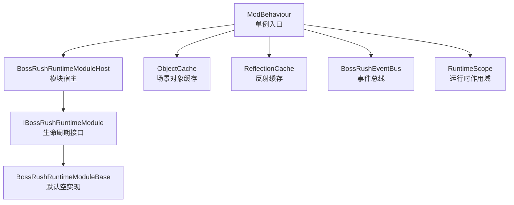
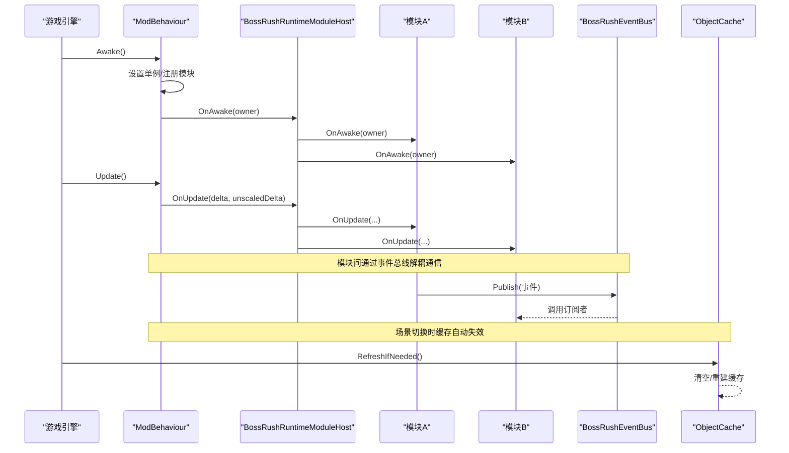
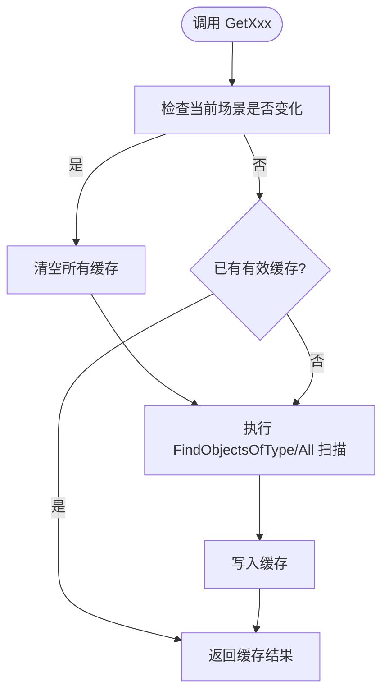
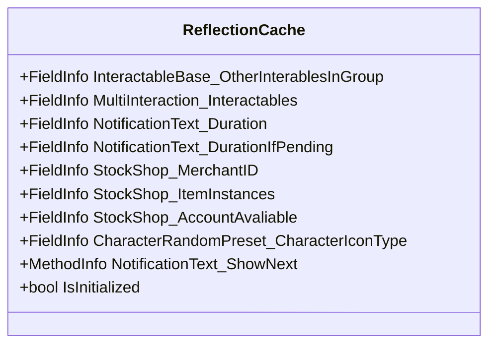
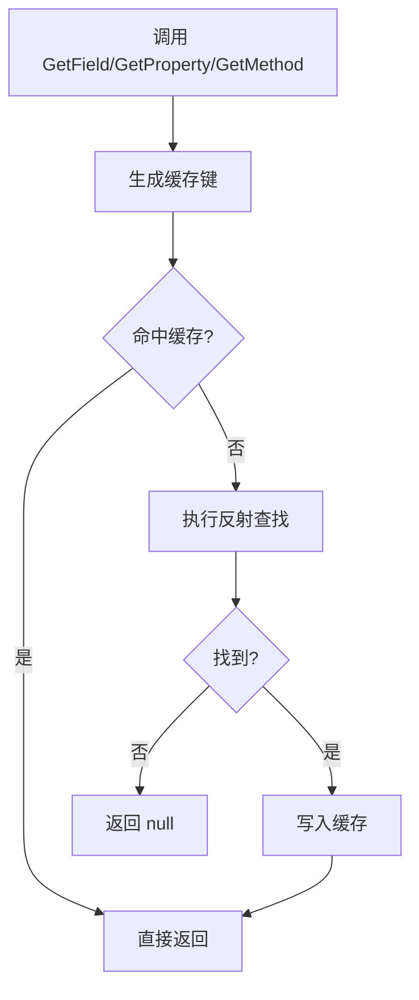
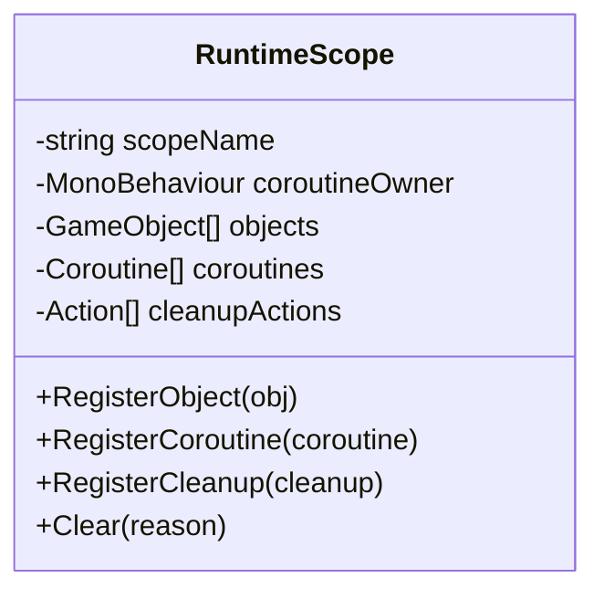
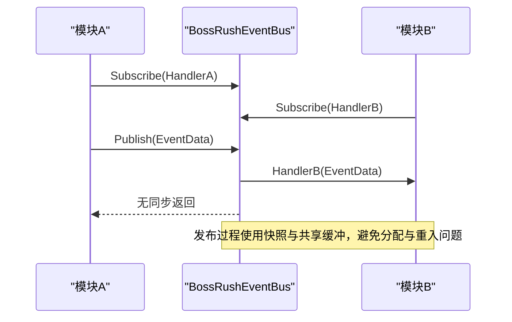
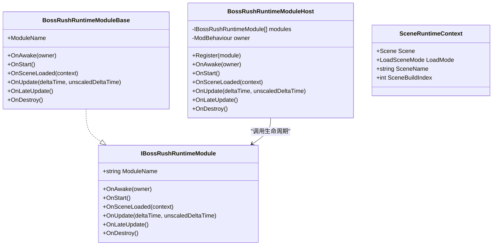
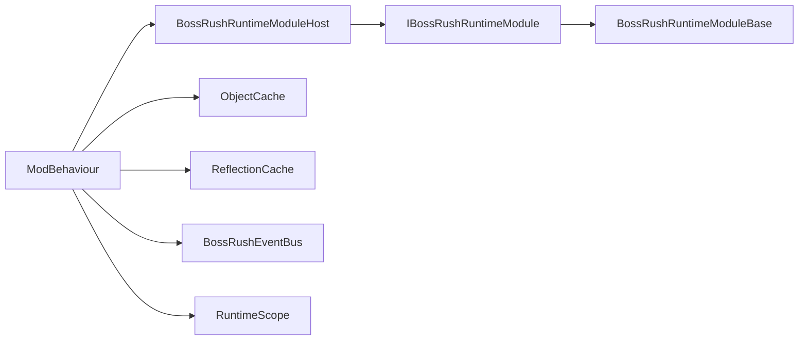

# 组件交互模式

<cite>
**本文引用的文件**
- [ObjectCache.cs](file://Common/Infrastructure/ObjectCache.cs)
- [ReflectionCache.cs（基础设施）](file://Common/Infrastructure/BossRushEagerReflectionCache.cs)
- [RuntimeScope.cs](file://Utilities/RuntimeScope.cs)
- [BossRushEventBus.cs](file://Common/Events/BossRushEventBus.cs)
- [IBossRushRuntimeModule.cs](file://Common/Lifecycle/IBossRushRuntimeModule.cs)
- [BossRushRuntimeModuleBase.cs](file://Common/Lifecycle/BossRushRuntimeModuleBase.cs)
- [BossRushRuntimeModuleHost.cs](file://Common/Lifecycle/BossRushRuntimeModuleHost.cs)
- [SceneRuntimeContext.cs](file://Common/Lifecycle/SceneRuntimeContext.cs)
- [ModBehaviour.cs](file://ModBehaviour.cs)
- [ReflectionCache.cs（通用工具）](file://Common/Utils/ReflectionCache.cs)
</cite>

## 目录
1. [简介](#简介)
2. [项目结构](#项目结构)
3. [核心组件](#核心组件)
4. [架构总览](#架构总览)
5. [详细组件分析](#详细组件分析)
6. [依赖关系分析](#依赖关系分析)
7. [性能考量](#性能考量)
8. [故障排查指南](#故障排查指南)
9. [结论](#结论)
10. [附录](#附录)

## 简介
本文件聚焦 BossRushMod 的组件交互模式，围绕以下主题展开：
- ObjectCache 对象缓存机制：按场景自动失效、类型化缓存与统一刷新策略。
- ReflectionCache 反射缓存：字段/属性/方法查找结果缓存，避免重复反射开销。
- RuntimeScope 运行时作用域：协程、GameObject、清理动作的统一生命周期管理。
- 解耦通信模式：基于事件总线的事件驱动、模块宿主的生命周期编排、以及单例/工厂在运行时的协作方式。
- 实践指导：最佳实践、反模式规避、性能优化、内存泄漏防护与线程安全注意事项。

## 项目结构
BossRushMod 将“基础设施能力”与“玩法模块”分层组织：
- 基础设施层：提供缓存、反射、事件总线、运行时作用域、模块宿主等通用能力。
- 生命周期层：通过接口与基类定义模块生命周期钩子，并由宿主统一调度。
- 玩法集成层：各 Mode/Achievement/Integration 等模块实现具体业务逻辑，复用基础设施能力。

图表来源
- [ModBehaviour.cs:598-653](file://ModBehaviour.cs#L598-L653)
- [BossRushRuntimeModuleHost.cs:1-130](file://Common/Lifecycle/BossRushRuntimeModuleHost.cs#L1-L130)
- [IBossRushRuntimeModule.cs:1-17](file://Common/Lifecycle/IBossRushRuntimeModule.cs#L1-L17)
- [BossRushRuntimeModuleBase.cs:1-15](file://Common/Lifecycle/BossRushRuntimeModuleBase.cs#L1-L15)
- [ObjectCache.cs:1-204](file://Common/Infrastructure/ObjectCache.cs#L1-L204)
- [ReflectionCache.cs（基础设施）:1-87](file://Common/Infrastructure/BossRushEagerReflectionCache.cs#L1-L87)
- [BossRushEventBus.cs:1-149](file://Common/Events/BossRushEventBus.cs#L1-L149)
- [RuntimeScope.cs:1-106](file://Utilities/RuntimeScope.cs#L1-L106)

章节来源
- [ModBehaviour.cs:598-653](file://ModBehaviour.cs#L598-L653)
- [BossRushRuntimeModuleHost.cs:1-130](file://Common/Lifecycle/BossRushRuntimeModuleHost.cs#L1-L130)
- [IBossRushRuntimeModule.cs:1-17](file://Common/Lifecycle/IBossRushRuntimeModule.cs#L1-L17)
- [BossRushRuntimeModuleBase.cs:1-15](file://Common/Lifecycle/BossRushRuntimeModuleBase.cs#L1-L15)
- [ObjectCache.cs:1-204](file://Common/Infrastructure/ObjectCache.cs#L1-L204)
- [ReflectionCache.cs（基础设施）:1-87](file://Common/Infrastructure/BossRushEagerReflectionCache.cs#L1-L87)
- [BossRushEventBus.cs:1-149](file://Common/Events/BossRushEventBus.cs#L1-L149)
- [RuntimeScope.cs:1-106](file://Utilities/RuntimeScope.cs#L1-L106)

## 核心组件
- ObjectCache：集中缓存场景中的 Unity 对象数组，按场景切换自动失效，并提供类型化访问器与强制刷新能力。
- ReflectionCache（基础设施）：静态初始化常用 FieldInfo/MethodInfo，避免热路径重复反射。
- ReflectionCache（通用工具）：提供类型/字段/属性/方法的带缓存查找与调用封装，支持统计与清空。
- RuntimeScope：以“作用域”为单位统一管理 GameObject、Coroutine、清理回调，确保成对创建与销毁。
- BossRushEventBus：轻量级事件总线，支持订阅/发布、重入保护、共享缓冲减少分配。
- 运行时模块体系：通过 IBossRushRuntimeModule 定义生命周期，BossRushRuntimeModuleBase 提供默认实现，BossRushRuntimeModuleHost 负责注册与分发。

章节来源
- [ObjectCache.cs:1-204](file://Common/Infrastructure/ObjectCache.cs#L1-L204)
- [ReflectionCache.cs（基础设施）:1-87](file://Common/Infrastructure/BossRushEagerReflectionCache.cs#L1-L87)
- [ReflectionCache.cs（通用工具）:1-325](file://Common/Utils/ReflectionCache.cs#L1-L325)
- [RuntimeScope.cs:1-106](file://Utilities/RuntimeScope.cs#L1-L106)
- [BossRushEventBus.cs:1-149](file://Common/Events/BossRushEventBus.cs#L1-L149)
- [IBossRushRuntimeModule.cs:1-17](file://Common/Lifecycle/IBossRushRuntimeModule.cs#L1-L17)
- [BossRushRuntimeModuleBase.cs:1-15](file://Common/Lifecycle/BossRushRuntimeModuleBase.cs#L1-L15)
- [BossRushRuntimeModuleHost.cs:1-130](file://Common/Lifecycle/BossRushRuntimeModuleHost.cs#L1-L130)

## 架构总览
BossRushMod 采用“宿主 + 模块 + 基础设施”的分层架构：
- ModBehaviour 作为单例入口，负责初始化并驱动模块宿主。
- 模块宿主按固定顺序调用各模块的生命周期钩子，保证启动/更新/销毁的一致性。
- 基础设施提供跨模块复用的能力：对象缓存、反射缓存、事件总线、作用域管理。
- 场景变化时，基础设施会感知并失效相关缓存，保障数据一致性。

图表来源
- [ModBehaviour.cs:598-653](file://ModBehaviour.cs#L598-L653)
- [BossRushRuntimeModuleHost.cs:21-118](file://Common/Lifecycle/BossRushRuntimeModuleHost.cs#L21-L118)
- [BossRushEventBus.cs:60-113](file://Common/Events/BossRushEventBus.cs#L60-L113)
- [ObjectCache.cs:31-63](file://Common/Infrastructure/ObjectCache.cs#L31-L63)

## 详细组件分析

### ObjectCache 对象缓存机制
- 设计目标：避免频繁调用 FindObjectsOfType/FindObjectsOfTypeAll 带来的性能开销。
- 关键特性：
  - 按场景名检测变化，自动失效所有缓存。
  - 提供多种类型化访问器（BoxCollider、CharacterSpawnerRoot、StockShop、TMP_FontAsset、NotificationText 等）。
  - 支持按 Type 动态获取场景对象数组，并提供显式失效接口。
  - 提供 ResetStaticCaches 用于 Mod 卸载或全局重置。
- 复杂度与性能：
  - 首次访问触发扫描，后续为 O(1) 读取；场景切换后恢复 O(n) 扫描成本。
  - 使用 IsUnityObjectArrayAlive 检查引用有效性，防止已销毁对象导致异常。
- 错误处理：RefreshIfNeeded 内部捕获异常，避免场景查询失败影响主流程。

图表来源
- [ObjectCache.cs:31-63](file://Common/Infrastructure/ObjectCache.cs#L31-L63)
- [ObjectCache.cs:95-142](file://Common/Infrastructure/ObjectCache.cs#L95-L142)
- [ObjectCache.cs:174-201](file://Common/Infrastructure/ObjectCache.cs#L174-L201)

章节来源
- [ObjectCache.cs:1-204](file://Common/Infrastructure/ObjectCache.cs#L1-L204)

### ReflectionCache 反射缓存（基础设施）
- 设计目标：在静态构造中完成常用反射查找，避免热路径重复反射。
- 关键特性：
  - 预缓存 InteractableBase、MultiInteraction、NotificationText、StockShop、CharacterRandomPreset 等类型的字段与方法。
  - 初始化失败时记录日志并标记未初始化状态，便于上层判断。
- 适用场景：需要频繁访问私有字段或静态方法的热点路径。

图表来源
- [ReflectionCache.cs（基础设施）:17-84](file://Common/Infrastructure/BossRushEagerReflectionCache.cs#L17-L84)

章节来源
- [ReflectionCache.cs（基础设施）:1-87](file://Common/Infrastructure/BossRushEagerReflectionCache.cs#L1-L87)

### ReflectionCache 反射缓存（通用工具）
- 设计目标：提供通用的类型/字段/属性/方法缓存与调用封装，降低反射使用门槛。
- 关键特性：
  - 类型查找缓存：支持指定程序集名称或遍历已加载程序集。
  - 字段/属性/方法缓存：键由类型全名+成员名+绑定标志组成，命中即返回。
  - 调用封装：InvokeMethod 自动推导参数类型并调用。
  - 缓存管理：ClearCache/ResetStaticCaches 支持清理；GetCacheStats 输出统计。
- 复杂度与性能：
  - 首次查找 O(1) 字典插入，后续 O(1) 命中；避免重复反射。
  - 注意键空间增长，必要时定期清理。

图表来源
- [ReflectionCache.cs（通用工具）:87-104](file://Common/Utils/ReflectionCache.cs#L87-L104)
- [ReflectionCache.cs（通用工具）:156-173](file://Common/Utils/ReflectionCache.cs#L156-L173)
- [ReflectionCache.cs（通用工具）:225-242](file://Common/Utils/ReflectionCache.cs#L225-L242)
- [ReflectionCache.cs（通用工具）:277-296](file://Common/Utils/ReflectionCache.cs#L277-L296)
- [ReflectionCache.cs（通用工具）:303-322](file://Common/Utils/ReflectionCache.cs#L303-L322)

章节来源
- [ReflectionCache.cs（通用工具）:1-325](file://Common/Utils/ReflectionCache.cs#L1-L325)

### RuntimeScope 运行时作用域管理模式
- 设计目标：以“作用域”为单位统一管理 GameObject、Coroutine、清理回调，确保资源释放。
- 关键特性：
  - RegisterObject/RegisterCoroutine/RegisterCleanup：登记需管理的资源与清理动作。
  - Clear(reason)：逆序执行清理回调、停止协程、销毁 GameObject，并记录异常日志。
  - 每个清理操作均 try/catch，避免单个清理失败影响整体。
- 使用建议：
  - 在模块进入运行时阶段创建作用域，退出时立即 Clear。
  - 将临时 UI、特效、协程、监听器等全部登记到作用域，避免悬挂引用。

图表来源
- [RuntimeScope.cs:7-104](file://Utilities/RuntimeScope.cs#L7-L104)

章节来源
- [RuntimeScope.cs:1-106](file://Utilities/RuntimeScope.cs#L1-L106)

### 解耦通信模式：观察者/工厂/单例
- 观察者模式（事件总线）：
  - BossRushEventBus 提供 Subscribe/Unsubscribe/Publish，支持泛型事件。
  - 发布时使用共享缓冲与快照，避免迭代期间集合修改导致的异常。
  - 支持嵌套发布深度计数，保证重入安全。
- 工厂模式（间接体现）：
  - 通过模块宿主与接口抽象，使模块按需注册与实例化，形成“注册-发现-调用”的工厂式协作。
- 单例模式：
  - ModBehaviour.Instance 作为全局入口，持有模块宿主与运行时状态。
  - 其他基础设施（如 ObjectCache、ReflectionCache）以静态形式提供全局访问。

图表来源
- [BossRushEventBus.cs:18-58](file://Common/Events/BossRushEventBus.cs#L18-L58)
- [BossRushEventBus.cs:60-113](file://Common/Events/BossRushEventBus.cs#L60-L113)
- [BossRushEventBus.cs:126-136](file://Common/Events/BossRushEventBus.cs#L126-L136)

章节来源
- [BossRushEventBus.cs:1-149](file://Common/Events/BossRushEventBus.cs#L1-L149)
- [ModBehaviour.cs:30-32](file://ModBehaviour.cs#L30-L32)

### 运行时模块生命周期编排
- 接口与基类：
  - IBossRushRuntimeModule 定义 ModuleName 与生命周期钩子。
  - BossRushRuntimeModuleBase 提供空实现，便于模块选择性覆盖。
- 宿主职责：
  - 注册模块、按顺序调用 OnAwake/OnStart/OnSceneLoaded/OnUpdate/OnLateUpdate/OnDestroy。
  - 每个钩子调用均 try/catch，并记录模块名与异常信息，提升可观测性。
- 场景上下文：
  - SceneRuntimeContext 携带场景对象、加载模式、名称与构建索引，供模块判断场景变化。

图表来源
- [IBossRushRuntimeModule.cs:5-15](file://Common/Lifecycle/IBossRushRuntimeModule.cs#L5-L15)
- [BossRushRuntimeModuleBase.cs:3-13](file://Common/Lifecycle/BossRushRuntimeModuleBase.cs#L3-L13)
- [BossRushRuntimeModuleHost.cs:6-128](file://Common/Lifecycle/BossRushRuntimeModuleHost.cs#L6-L128)
- [SceneRuntimeContext.cs:5-19](file://Common/Lifecycle/SceneRuntimeContext.cs#L5-L19)

章节来源
- [IBossRushRuntimeModule.cs:1-17](file://Common/Lifecycle/IBossRushRuntimeModule.cs#L1-L17)
- [BossRushRuntimeModuleBase.cs:1-15](file://Common/Lifecycle/BossRushRuntimeModuleBase.cs#L1-L15)
- [BossRushRuntimeModuleHost.cs:1-130](file://Common/Lifecycle/BossRushRuntimeModuleHost.cs#L1-L130)
- [SceneRuntimeContext.cs:1-21](file://Common/Lifecycle/SceneRuntimeContext.cs#L1-L21)

## 依赖关系分析
- 耦合度：
  - 模块通过事件总线松耦合通信，不直接依赖彼此实现。
  - 模块通过宿主接口与基类解耦，便于替换与测试。
- 直接依赖：
  - ModBehaviour 依赖宿主与基础设施。
  - 宿主依赖模块接口与场景上下文。
  - 基础设施之间相互独立，避免循环依赖。
- 外部集成点：
  - Unity 场景系统（SceneManager）、对象系统（GameObject/Collider/Font 等）。
  - Harmony 注入（由 ModBehaviour 所在模块承载）。

图表来源
- [ModBehaviour.cs:598-653](file://ModBehaviour.cs#L598-L653)
- [BossRushRuntimeModuleHost.cs:1-130](file://Common/Lifecycle/BossRushRuntimeModuleHost.cs#L1-L130)
- [IBossRushRuntimeModule.cs:1-17](file://Common/Lifecycle/IBossRushRuntimeModule.cs#L1-L17)
- [BossRushRuntimeModuleBase.cs:1-15](file://Common/Lifecycle/BossRushRuntimeModuleBase.cs#L1-L15)
- [ObjectCache.cs:1-204](file://Common/Infrastructure/ObjectCache.cs#L1-L204)
- [ReflectionCache.cs（基础设施）:1-87](file://Common/Infrastructure/BossRushEagerReflectionCache.cs#L1-L87)
- [BossRushEventBus.cs:1-149](file://Common/Events/BossRushEventBus.cs#L1-L149)
- [RuntimeScope.cs:1-106](file://Utilities/RuntimeScope.cs#L1-L106)

章节来源
- [ModBehaviour.cs:598-653](file://ModBehaviour.cs#L598-L653)
- [BossRushRuntimeModuleHost.cs:1-130](file://Common/Lifecycle/BossRushRuntimeModuleHost.cs#L1-L130)
- [IBossRushRuntimeModule.cs:1-17](file://Common/Lifecycle/IBossRushRuntimeModule.cs#L1-L17)
- [BossRushRuntimeModuleBase.cs:1-15](file://Common/Lifecycle/BossRushRuntimeModuleBase.cs#L1-L15)
- [ObjectCache.cs:1-204](file://Common/Infrastructure/ObjectCache.cs#L1-L204)
- [ReflectionCache.cs（基础设施）:1-87](file://Common/Infrastructure/BossRushEagerReflectionCache.cs#L1-L87)
- [BossRushEventBus.cs:1-149](file://Common/Events/BossRushEventBus.cs#L1-L149)
- [RuntimeScope.cs:1-106](file://Utilities/RuntimeScope.cs#L1-L106)

## 性能考量
- 对象缓存：
  - 使用 ObjectCache 替代每帧 FindObjectsOfType/All，显著降低 GC 与 CPU 开销。
  - 场景切换时自动失效，避免脏数据。
- 反射缓存：
  - 使用 ReflectionCache 缓存字段/属性/方法，避免热路径重复反射。
  - 通用工具版支持统计与清理，便于监控缓存膨胀。
- 事件总线：
  - 发布时使用共享缓冲与快照，减少分配；支持重入保护。
- 作用域管理：
  - 通过 RuntimeScope 集中销毁协程与对象，避免悬挂引用导致的内存泄漏。
- 模块宿主：
  - 每个生命周期钩子 try/catch，避免单模块异常拖垮整体。

[本节为通用性能讨论，不直接分析具体文件]

## 故障排查指南
- 事件订阅泄漏：
  - 确认模块在 OnDestroy 或作用域清理中退订事件。
  - 使用 BossRushEventBus.ClearRuntimeSubscribers/ResetStaticCaches 进行全局清理。
- 场景切换后缓存失效：
  - 确认调用了 ObjectCache.RefreshIfNeeded 或在访问前触发。
  - 如需强制刷新，调用 ForceRefresh 或 ResetStaticCaches。
- 反射初始化失败：
  - 检查 ReflectionCache.IsInitialized，若为 false，查看日志定位缺失类型或字段。
- 作用域清理异常：
  - 关注 RuntimeScope.Clear 中的异常日志，定位具体清理动作失败原因。
- 模块生命周期异常：
  - 查看宿主记录的模块名与钩子名称，快速定位失败位置。

章节来源
- [BossRushEventBus.cs:126-136](file://Common/Events/BossRushEventBus.cs#L126-L136)
- [ObjectCache.cs:31-72](file://Common/Infrastructure/ObjectCache.cs#L31-L72)
- [ReflectionCache.cs（基础设施）:41-84](file://Common/Infrastructure/BossRushEagerReflectionCache.cs#L41-L84)
- [RuntimeScope.cs:45-103](file://Utilities/RuntimeScope.cs#L45-L103)
- [BossRushRuntimeModuleHost.cs:21-128](file://Common/Lifecycle/BossRushRuntimeModuleHost.cs#L21-L128)

## 结论
BossRushMod 通过“宿主 + 模块 + 基础设施”的分层架构，结合对象缓存、反射缓存、事件总线与作用域管理，实现了高内聚、低耦合、易维护的组件交互模式。该模式在性能、稳定性与可扩展性方面具备良好平衡，适合复杂 Mod 的长期演进。

[本节为总结性内容，不直接分析具体文件]

## 附录
- 最佳实践
  - 优先使用 ObjectCache 与 ReflectionCache 减少热路径开销。
  - 使用 RuntimeScope 管理临时资源，确保成对创建与销毁。
  - 通过 BossRushEventBus 进行模块间通信，避免直接依赖。
  - 在模块 OnDestroy 或作用域清理中退订事件与释放资源。
- 反模式避免
  - 避免在热路径中进行反射与 FindObjectsOfType 调用。
  - 避免在事件处理器中做耗时操作，必要时异步或分帧处理。
  - 避免跨作用域持有 GameObject 引用，防止悬挂引用。
  - 避免在模块间直接耦合，优先使用事件与接口抽象。
- 线程安全
  - 事件总线使用共享缓冲与快照，避免并发修改集合；但非完全线程安全，建议在 Unity 主线程调用。
  - 缓存均为静态单例，注意场景切换与 Mod 卸载时的清理。

[本节为通用指导，不直接分析具体文件]