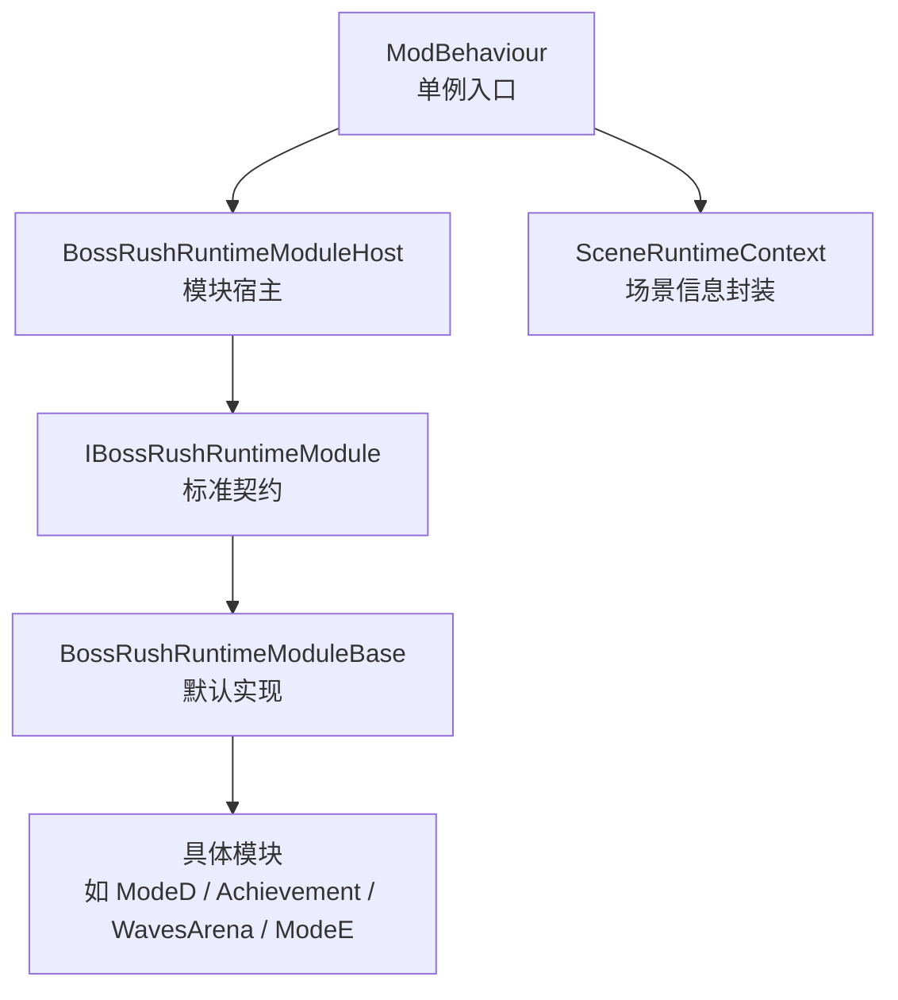
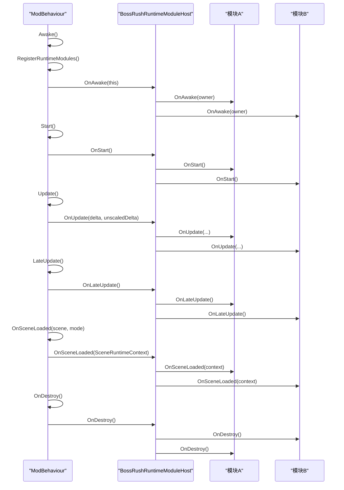
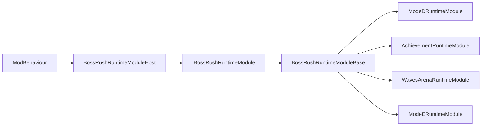

# 运行时模块系统

<cite>
**本文引用的文件**
- [BossRushRuntimeModuleBase.cs](file://Common/Lifecycle/BossRushRuntimeModuleBase.cs)
- [IBossRushRuntimeModule.cs](file://Common/Lifecycle/IBossRushRuntimeModule.cs)
- [BossRushRuntimeModuleHost.cs](file://Common/Lifecycle/BossRushRuntimeModuleHost.cs)
- [BossRushRuntimeModuleRegistration.cs](file://Common/Lifecycle/BossRushRuntimeModuleRegistration.cs)
- [SceneRuntimeContext.cs](file://Common/Lifecycle/SceneRuntimeContext.cs)
- [ModBehaviour.cs](file://ModBehaviour.cs)
- [ModeDRuntimeModule.cs](file://ModeD/ModeDRuntimeModule.cs)
- [AchievementRuntimeModule.cs](file://Achievement/AchievementRuntimeModule.cs)
- [WavesArenaRuntimeModule.cs](file://WavesArena/WavesArenaRuntimeModule.cs)
- [ModeERuntimeModule.cs](file://ModeE/ModeERuntimeModule.cs)
</cite>

## 目录
1. [简介](#简介)
2. [项目结构](#项目结构)
3. [核心组件](#核心组件)
4. [架构总览](#架构总览)
5. [详细组件分析](#详细组件分析)
6. [依赖关系分析](#依赖关系分析)
7. [性能考虑](#性能考虑)
8. [故障排查指南](#故障排查指南)
9. [结论](#结论)
10. [附录：自定义模块示例与最佳实践](#附录自定义模块示例与最佳实践)

## 简介
本文件系统性说明 BossRushMod 的运行时模块系统，围绕以下目标展开：
- 解释基类 BossRushRuntimeModuleBase 的设计原理与生命周期方法
- 阐述宿主管理器 BossRushRuntimeModuleHost 的职责与实现机制
- 明确接口 IBossRushRuntimeModule 的标准契约
- 详细说明模块注册流程、初始化顺序、以及模块间通信模式
- 给出错误处理策略与性能优化建议
- 提供创建自定义模块的具体步骤（Awake、OnSceneLoaded、Update 等）
- 讨论模块隔离性、资源管理与内存优化最佳实践

## 项目结构
运行时模块系统位于 Common/Lifecycle 目录下，由“接口 + 基类 + 宿主 + 场景上下文”构成。各功能模块以“RuntimeModule”命名后缀，继承基类并实现必要生命周期方法，最终通过 ModBehaviour 统一注册与调度。

图表来源
- [ModBehaviour.cs:598-620](file://ModBehaviour.cs#L598-L620)
- [BossRushRuntimeModuleHost.cs:1-130](file://Common/Lifecycle/BossRushRuntimeModuleHost.cs#L1-L130)
- [IBossRushRuntimeModule.cs:1-17](file://Common/Lifecycle/IBossRushRuntimeModule.cs#L1-L17)
- [BossRushRuntimeModuleBase.cs:1-15](file://Common/Lifecycle/BossRushRuntimeModuleBase.cs#L1-L15)
- [SceneRuntimeContext.cs:1-21](file://Common/Lifecycle/SceneRuntimeContext.cs#L1-L21)

章节来源
- [ModBehaviour.cs:598-620](file://ModBehaviour.cs#L598-L620)
- [BossRushRuntimeModuleRegistration.cs:1-19](file://Common/Lifecycle/BossRushRuntimeModuleRegistration.cs#L1-L19)

## 核心组件
- IBossRushRuntimeModule：定义模块必须实现的契约，包括模块名与完整生命周期回调。
- BossRushRuntimeModuleBase：提供空实现基类，简化自定义模块开发。
- BossRushRuntimeModuleHost：集中管理模块集合，按固定顺序调用生命周期方法，并提供异常隔离与日志记录。
- SceneRuntimeContext：在场景切换时向模块传递只读的场景元数据。
- ModBehaviour：作为宿主入口，负责模块注册与生命周期分发。

章节来源
- [IBossRushRuntimeModule.cs:1-17](file://Common/Lifecycle/IBossRushRuntimeModule.cs#L1-L17)
- [BossRushRuntimeModuleBase.cs:1-15](file://Common/Lifecycle/BossRushRuntimeModuleBase.cs#L1-L15)
- [BossRushRuntimeModuleHost.cs:1-130](file://Common/Lifecycle/BossRushRuntimeModuleHost.cs#L1-L130)
- [SceneRuntimeContext.cs:1-21](file://Common/Lifecycle/SceneRuntimeContext.cs#L1-L21)
- [ModBehaviour.cs:598-620](file://ModBehaviour.cs#L598-L620)

## 架构总览
运行时模块系统采用“宿主-模块”解耦设计：
- 注册阶段：在 ModBehaviour.Awake 中完成模块实例化与注册。
- 启动阶段：在 Start 中触发所有模块的 OnStart。
- 运行阶段：每帧 Update/LateUpdate 中依次调用模块的 OnUpdate/OnLateUpdate。
- 场景阶段：场景加载完成后，向模块广播 OnSceneLoaded，附带 SceneRuntimeContext。
- 销毁阶段：在 OnDestroy 中按逆序调用模块的 OnDestroy，确保资源释放有序。

图表来源
- [ModBehaviour.cs:598-620](file://ModBehaviour.cs#L598-L620)
- [ModBehaviour.cs:642-654](file://ModBehaviour.cs#L642-L654)
- [ModBehaviour.cs:727-736](file://ModBehaviour.cs#L727-L736)
- [ModBehaviour.cs:782-797](file://ModBehaviour.cs#L782-L797)
- [BossRushRuntimeModuleHost.cs:21-118](file://Common/Lifecycle/BossRushRuntimeModuleHost.cs#L21-L118)

## 详细组件分析

### 接口契约：IBossRushRuntimeModule
- 模块名：ModuleName，用于错误日志与调试标识。
- 生命周期：
  - OnAwake(ModBehaviour owner)：持有宿主引用，适合缓存全局对象或订阅事件。
  - OnStart()：模块启动，适合初始化状态机、读取配置。
  - OnSceneLoaded(SceneRuntimeContext context)：场景切换后执行，适合根据场景名/构建索引做分支逻辑。
  - OnUpdate(float deltaTime, float unscaledDeltaTime)：每帧更新，适合轻量计算与状态推进。
  - OnLateUpdate()：晚更新，适合收尾逻辑或渲染相关操作。
  - OnDestroy()：清理资源、取消订阅、释放引用。

章节来源
- [IBossRushRuntimeModule.cs:1-17](file://Common/Lifecycle/IBossRushRuntimeModule.cs#L1-L17)

### 基类：BossRushRuntimeModuleBase
- 提供 ModuleName 抽象属性与所有生命周期方法的空实现，便于按需覆盖。
- 推荐做法：仅覆盖需要的方法，避免无意义的空方法体。

章节来源
- [BossRushRuntimeModuleBase.cs:1-15](file://Common/Lifecycle/BossRushRuntimeModuleBase.cs#L1-L15)

### 宿主管理器：BossRushRuntimeModuleHost
- 职责：
  - 维护模块列表，保证注册幂等（重复注册忽略）。
  - 按注册顺序正向调用 Awake/Start/SceneLoaded/Update/LateUpdate。
  - 销毁阶段按逆序调用 OnDestroy，确保依赖先于被依赖者释放。
  - 每个生命周期调用均包裹 try/catch，捕获异常并记录警告日志，避免单个模块失败影响整体。
- 关键行为：
  - OnAwake 接收 ModBehaviour 宿主引用，供模块缓存。
  - OnSceneLoaded 传入 SceneRuntimeContext，包含场景对象、加载模式、名称与构建索引。
  - LogModuleError 使用 ModBehaviour.DevLog 输出带模块名与生命周期阶段的警告。

章节来源
- [BossRushRuntimeModuleHost.cs:1-130](file://Common/Lifecycle/BossRushRuntimeModuleHost.cs#L1-L130)

### 场景上下文：SceneRuntimeContext
- 只读结构，封装当前场景的关键信息：
  - Scene：Unity 场景对象
  - LoadSceneMode：加载模式
  - SceneName：场景名称
  - SceneBuildIndex：构建索引
- 用途：模块内部依据场景信息进行差异化处理，例如不同地图的初始化逻辑。

章节来源
- [SceneRuntimeContext.cs:1-21](file://Common/Lifecycle/SceneRuntimeContext.cs#L1-L21)

### 模块注册与调度：ModBehaviour
- 注册：RegisterRuntimeModules 集中注册各功能模块，顺序即执行顺序。
- 生命周期分发：
  - Awake：注册模块并调用 host.OnAwake。
  - Start：调用 host.OnStart。
  - Update：调用 host.OnUpdate（受 CanRunGameplayThisFrame 控制）。
  - LateUpdate：调用 host.OnLateUpdate。
  - OnSceneLoaded：构造 SceneRuntimeContext 并调用 host.OnSceneLoaded。
  - OnDestroy：调用 host.OnDestroy 并清理其他子系统。

章节来源
- [BossRushRuntimeModuleRegistration.cs:1-19](file://Common/Lifecycle/BossRushRuntimeModuleRegistration.cs#L1-L19)
- [ModBehaviour.cs:598-620](file://ModBehaviour.cs#L598-L620)
- [ModBehaviour.cs:642-654](file://ModBehaviour.cs#L642-L654)
- [ModBehaviour.cs:727-736](file://ModBehaviour.cs#L727-L736)
- [ModBehaviour.cs:782-797](file://ModBehaviour.cs#L782-L797)
- [ModBehaviour.cs:758-780](file://ModBehaviour.cs#L758-L780)

## 依赖关系分析
- 耦合度：
  - 模块仅依赖 IBossRushRuntimeModule 契约，不直接依赖宿主实现，松耦合。
  - 宿主集中管理模块集合，单一职责清晰。
- 内聚性：
  - 每个模块聚焦自身业务，通过宿主进行生命周期协调。
- 外部依赖：
  - Unity 场景系统（SceneManager）、ModBehaviour（宿主入口）、Harmony（若模块使用）。
- 循环依赖：
  - 通过宿主转发调用，避免模块间直接相互引用导致的循环依赖。

图表来源
- [ModBehaviour.cs:598-620](file://ModBehaviour.cs#L598-L620)
- [BossRushRuntimeModuleHost.cs:1-130](file://Common/Lifecycle/BossRushRuntimeModuleHost.cs#L1-L130)
- [IBossRushRuntimeModule.cs:1-17](file://Common/Lifecycle/IBossRushRuntimeModule.cs#L1-L17)
- [BossRushRuntimeModuleBase.cs:1-15](file://Common/Lifecycle/BossRushRuntimeModuleBase.cs#L1-L15)
- [ModeDRuntimeModule.cs:1-33](file://ModeD/ModeDRuntimeModule.cs#L1-L33)
- [AchievementRuntimeModule.cs:1-33](file://Achievement/AchievementRuntimeModule.cs#L1-L33)
- [WavesArenaRuntimeModule.cs:1-23](file://WavesArena/WavesArenaRuntimeModule.cs#L1-L23)
- [ModeERuntimeModule.cs:1-29](file://ModeE/ModeERuntimeModule.cs#L1-L29)

章节来源
- [BossRushRuntimeModuleRegistration.cs:1-19](file://Common/Lifecycle/BossRushRuntimeModuleRegistration.cs#L1-L19)

## 性能考虑
- 宿主层：
  - 每帧遍历模块列表调用 OnUpdate/OnLateUpdate，应避免在模块中执行重计算。
  - 异常捕获开销较小，但频繁异常会影响性能，需确保模块健壮。
- 模块层：
  - 缓存 ModBehaviour 引用，避免每帧查找单例。
  - 使用增量更新与节流策略，减少每帧分配与昂贵操作。
  - 仅在必要时响应场景切换，利用 SceneRuntimeContext 快速判断场景类型。
- 资源管理：
  - 在 OnDestroy 中释放资源、取消事件订阅，防止内存泄漏。
  - 避免在 Update 中创建临时对象，复用缓冲或静态缓存。

[本节为通用指导，不直接分析具体文件]

## 故障排查指南
- 常见症状：
  - 某模块未生效：检查是否已注册到 RegisterRuntimeModules。
  - 模块崩溃导致后续模块未执行：宿主会捕获异常并记录警告，查看日志定位模块名与生命周期阶段。
  - 场景切换后状态异常：确认 OnSceneLoaded 是否正确处理新场景。
- 诊断步骤：
  - 查看 ModBehaviour.DevLog 输出的警告，定位失败的模块与方法。
  - 检查模块是否在 OnDestroy 中正确清理引用与事件。
  - 验证模块对场景信息的判断逻辑（SceneName/BuildIndex）。

章节来源
- [BossRushRuntimeModuleHost.cs:120-127](file://Common/Lifecycle/BossRushRuntimeModuleHost.cs#L120-L127)

## 结论
BossRushMod 的运行时模块系统通过清晰的接口契约、统一的宿主调度与严格的异常隔离，实现了高内聚、低耦合的模块化架构。模块按注册顺序执行生命周期，支持场景切换感知与逐帧更新，便于扩展与维护。遵循最佳实践可进一步提升稳定性与性能。

[本节为总结，不直接分析具体文件]

## 附录：自定义模块示例与最佳实践

### 如何创建自定义模块
- 步骤概览：
  - 新建类继承 BossRushRuntimeModuleBase。
  - 实现 ModuleName 属性。
  - 根据需要覆盖 OnAwake、OnStart、OnSceneLoaded、OnUpdate、OnLateUpdate、OnDestroy。
  - 在 ModBehaviour.RegisterRuntimeModules 中注册该模块。
- 参考实现路径：
  - 简单模块：[WavesArenaRuntimeModule.cs:1-23](file://WavesArena/WavesArenaRuntimeModule.cs#L1-L23)
  - 每帧更新：[ModeDRuntimeModule.cs:1-33](file://ModeD/ModeDRuntimeModule.cs#L1-L33)
  - 成就模块：[AchievementRuntimeModule.cs:1-33](file://Achievement/AchievementRuntimeModule.cs#L1-L33)
  - 模式清理：[ModeERuntimeModule.cs:1-29](file://ModeE/ModeERuntimeModule.cs#L1-L29)

章节来源
- [WavesArenaRuntimeModule.cs:1-23](file://WavesArena/WavesArenaRuntimeModule.cs#L1-L23)
- [ModeDRuntimeModule.cs:1-33](file://ModeD/ModeDRuntimeModule.cs#L1-L33)
- [AchievementRuntimeModule.cs:1-33](file://Achievement/AchievementRuntimeModule.cs#L1-L33)
- [ModeERuntimeModule.cs:1-29](file://ModeE/ModeERuntimeModule.cs#L1-L29)
- [BossRushRuntimeModuleRegistration.cs:1-19](file://Common/Lifecycle/BossRushRuntimeModuleRegistration.cs#L1-L19)

### 关键方法实现要点
- OnAwake：
  - 缓存 ModBehaviour 宿主引用，避免每帧查询单例。
  - 订阅事件或初始化轻量状态。
- OnStart：
  - 读取配置、建立状态机初始态。
- OnSceneLoaded：
  - 基于 SceneRuntimeContext.SceneName/BuildIndex 进行分支处理。
  - 重置或迁移场景相关状态。
- OnUpdate：
  - 保持轻量，避免分配；使用增量计算与节流。
- OnLateUpdate：
  - 收尾逻辑，如 UI 更新、渲染同步。
- OnDestroy：
  - 取消订阅、释放资源、清空引用。

章节来源
- [BossRushRuntimeModuleBase.cs:1-15](file://Common/Lifecycle/BossRushRuntimeModuleBase.cs#L1-L15)
- [SceneRuntimeContext.cs:1-21](file://Common/Lifecycle/SceneRuntimeContext.cs#L1-L21)

### 模块间通信模式
- 推荐方式：
  - 通过 ModBehaviour 暴露公共方法或状态，模块间接访问，避免直接耦合。
  - 使用事件总线（如项目中已有的事件机制）进行解耦通信。
- 注意事项：
  - 避免循环依赖；优先通过宿主或中央服务中转。
  - 在 OnDestroy 中取消事件订阅，防止悬挂引用。

[本节为通用指导，不直接分析具体文件]

### 错误处理策略
- 宿主层：
  - 每个生命周期调用均包裹 try/catch，捕获异常并记录警告日志，确保一个模块失败不影响其他模块。
- 模块层：
  - 在可能出错的代码块中加入防御性检查（空引用、无效参数）。
  - 避免抛出未捕获异常，尽量降级或跳过当前帧逻辑。

章节来源
- [BossRushRuntimeModuleHost.cs:21-118](file://Common/Lifecycle/BossRushRuntimeModuleHost.cs#L21-L118)

### 资源管理与内存优化最佳实践
- 缓存：
  - 缓存 ModBehaviour 引用、常用组件引用，减少查找成本。
- 分配：
  - 避免在 Update 中创建临时对象；使用对象池或静态缓冲。
- 清理：
  - 在 OnDestroy 中释放资源、取消订阅、清空引用。
- 场景切换：
  - 使用 SceneRuntimeContext 快速判断场景类型，避免昂贵的反射或查找。

[本节为通用指导，不直接分析具体文件]

### 模块隔离性与安全性
- 隔离性：
  - 模块之间不直接相互依赖，通过宿主与中央服务交互，降低耦合。
- 安全性：
  - 宿主异常隔离，单个模块崩溃不会导致整体崩溃。
  - 严格的生命周期顺序，确保资源释放有序。

[本节为通用指导，不直接分析具体文件]