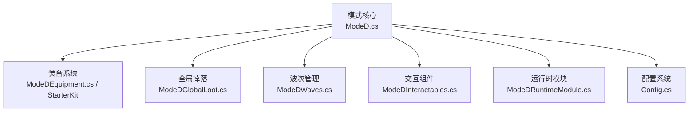
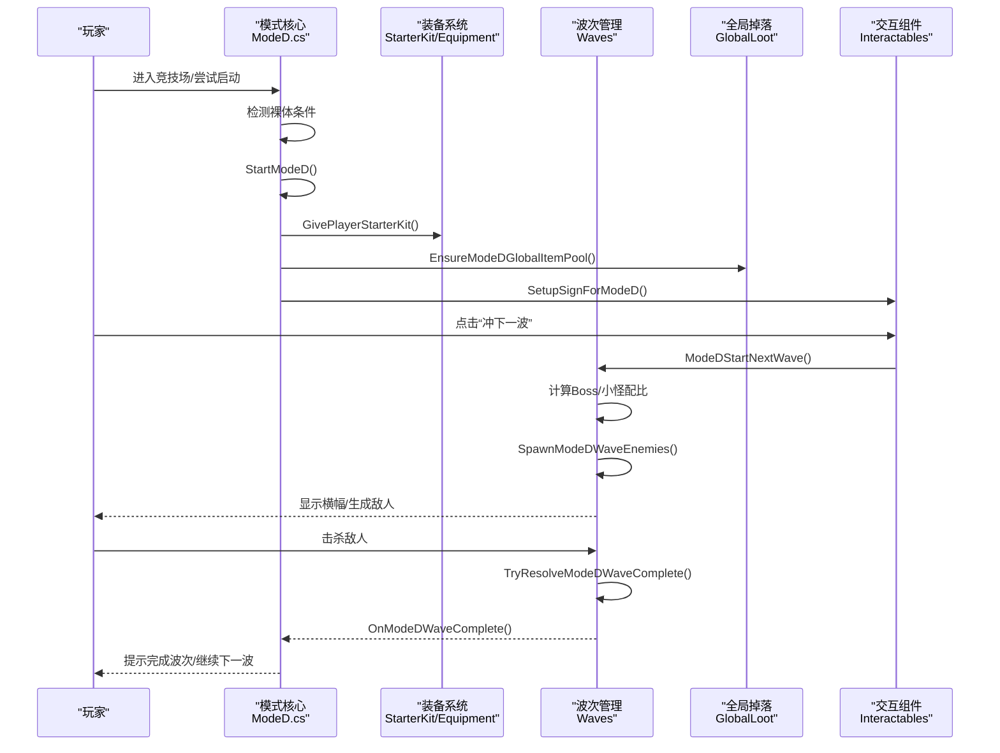
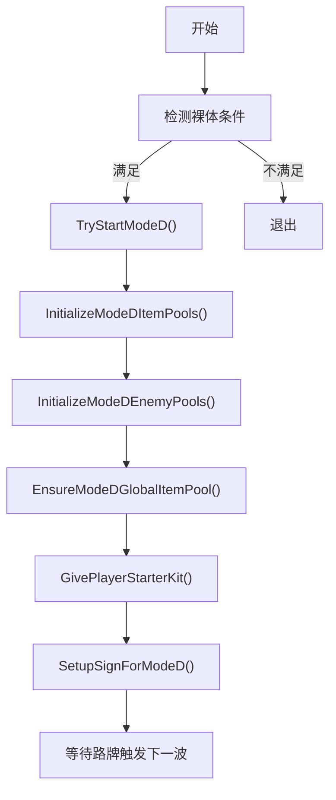
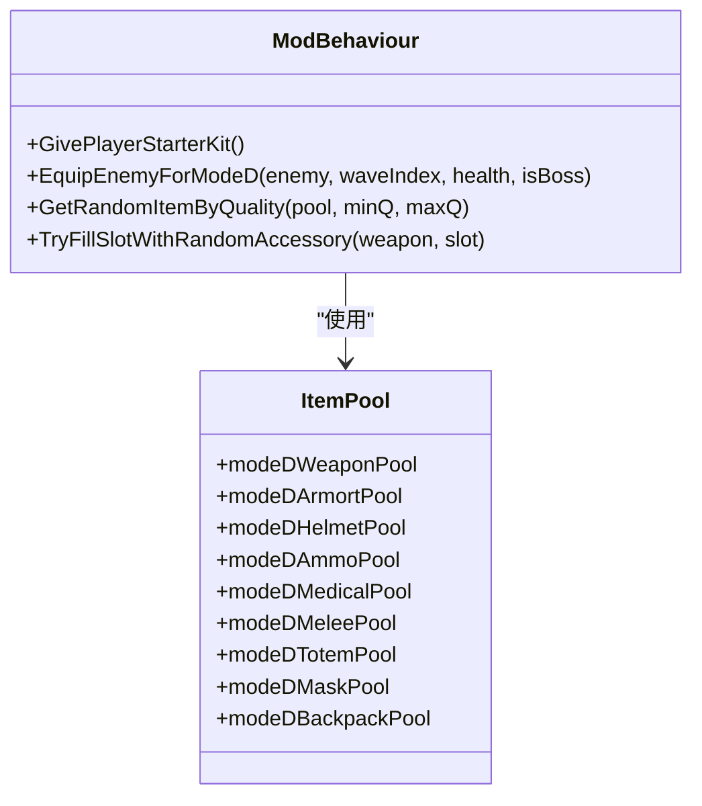
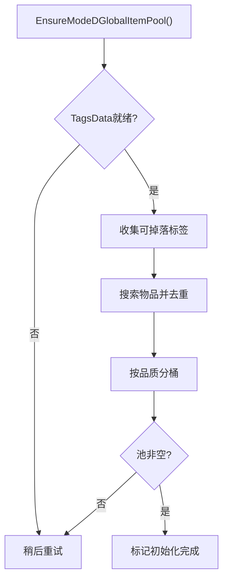
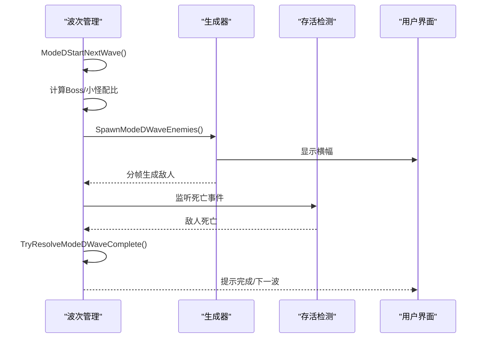
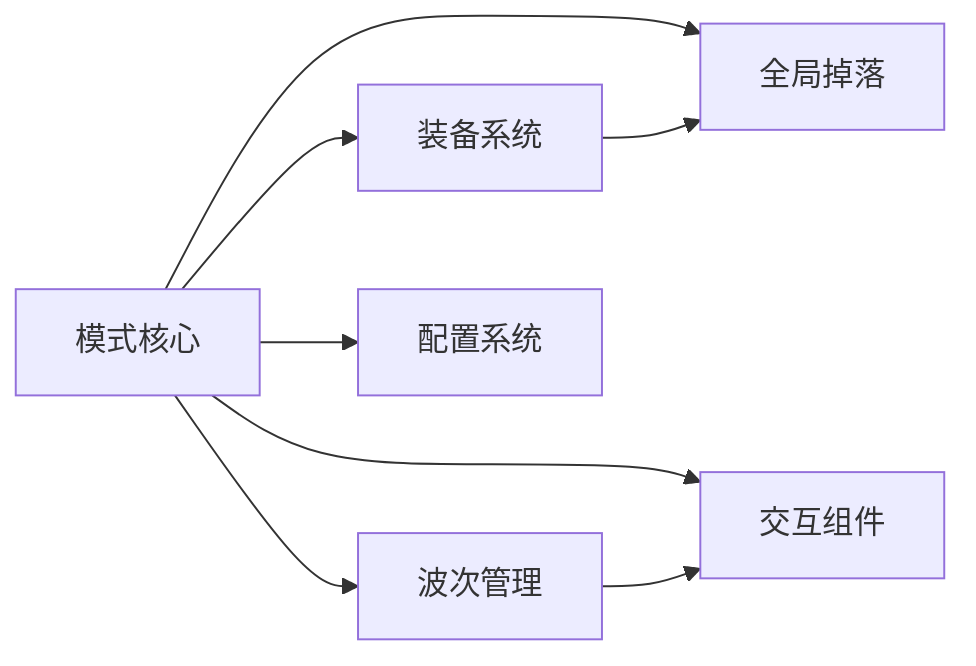

# Mode D：白手起家

<cite>
**本文引用的文件**
- [ModeD.cs](file://ModeD/ModeD.cs)
- [ModeDEquipment.cs](file://ModeD/ModeDEquipment.cs)
- [ModeDEquipment_StarterKit.cs](file://ModeD/ModeDEquipment_StarterKit.cs)
- [ModeDGlobalLoot.cs](file://ModeD/ModeDGlobalLoot.cs)
- [ModeDWaves.cs](file://ModeD/ModeDWaves.cs)
- [ModeDInteractables.cs](file://ModeD/ModeDInteractables.cs)
- [ModeDRuntimeModule.cs](file://ModeD/ModeDRuntimeModule.cs)
- [Config.cs](file://Config/Config.cs)
</cite>

## 目录
1. [简介](#简介)
2. [项目结构](#项目结构)
3. [核心组件](#核心组件)
4. [架构总览](#架构总览)
5. [详细组件分析](#详细组件分析)
6. [依赖关系分析](#依赖关系分析)
7. [性能与平衡性](#性能与平衡性)
8. [故障排查指南](#故障排查指南)
9. [结论](#结论)
10. [附录：配置与扩展](#附录：配置与扩展)

## 简介
Mode D（白手起家）是 BossRush 的“独立敌池 + 随机装备”挑战模式。玩家以“裸体+船票”入场，系统发放随机开局装备，随后通过击杀敌人获取更好的掉落。该模式采用独立的小怪池与Boss池、全局掉落池、波次管理与难度递增机制，提供独特的游戏循环与策略规划空间。

## 项目结构
Mode D 由多个职责清晰的模块组成：
- 模式核心：状态管理、启动/结束、物品池与敌人池初始化
- 装备系统：开局包生成、敌人配装、配件填充、弹药匹配
- 全局掉落：全物品池构建与按品质抽取
- 波次管理：分波生成、Boss/小怪配比、存活检测与完成结算
- 交互组件：路牌选项注入、“冲下一波”按钮
- 运行时模块：生命周期钩子与完整性自检
- 配置系统：每波敌人数、概率模型等可调参数

图表来源
- [ModeD.cs:126-227](file://ModeD/ModeD.cs#L126-L227)
- [ModeDEquipment.cs:469-623](file://ModeD/ModeDEquipment.cs#L469-L623)
- [ModeDEquipment_StarterKit.cs:44-116](file://ModeD/ModeDEquipment_StarterKit.cs#L44-L116)
- [ModeDGlobalLoot.cs:64-208](file://ModeD/ModeDGlobalLoot.cs#L64-L208)
- [ModeDWaves.cs:45-138](file://ModeD/ModeDWaves.cs#L45-L138)
- [ModeDInteractables.cs:118-194](file://ModeD/ModeDInteractables.cs#L118-L194)
- [ModeDRuntimeModule.cs:12-30](file://ModeD/ModeDRuntimeModule.cs#L12-L30)
- [Config.cs:55-56](file://Config/Config.cs#L55-L56)

章节来源
- [ModeD.cs:126-227](file://ModeD/ModeD.cs#L126-L227)
- [Config.cs:55-56](file://Config/Config.cs#L55-L56)

## 核心组件
- 模式核心（ModeD.cs）
  - 检测“裸体”条件、启动/结束模式、初始化物品池与敌人池、预构建全局掉落池、设置路牌为 Mode D 模式
- 装备系统（ModeDEquipment.cs / ModeDEquipment_StarterKit.cs）
  - 开局装备包：武器必给并优先低品质，弹药匹配，护甲/头盔各50%概率，近战40%，医疗品3格，图腾/面具各30%，背包40%
  - 敌人配装：根据血量与波次计算品质等级，清空或保留特定类型敌人的原始近战配置，确保掉落物数量与质量
  - 配件池：按槽位有限随机抽样安装，避免大量 Instantiate/Destroy
- 全局掉落（ModeDGlobalLoot.cs）
  - 预热与缓存全物品池，按品质分桶；支持历史/非历史两种品质分布；皇冠权重降低
- 波次管理（ModeDWaves.cs）
  - 第1-5波全小怪，6-10波1个Boss+小怪，11-15波2个Boss+小怪，16+波全Boss
  - 分帧生成、安全刷点、存活检测、结案计数、波次完成触发
  - 数值强化：每波约3%属性提升，统一伤害倍率为1
- 交互组件（ModeDInteractables.cs）
  - 注入“冲下一波”到路牌，运行时隐藏/显示；清理BossRush箱子
- 运行时模块（ModeDRuntimeModule.cs）
  - 每帧调用完整性检查，保障状态一致
- 配置（Config.cs）
  - modeDEnemiesPerWave 控制每波敌人数（1-10），useLegacyBossLootProbabilities 控制掉落概率模型

章节来源
- [ModeD.cs:126-227](file://ModeD/ModeD.cs#L126-L227)
- [ModeDEquipment.cs:469-623](file://ModeD/ModeDEquipment.cs#L469-L623)
- [ModeDEquipment_StarterKit.cs:44-116](file://ModeD/ModeDEquipment_StarterKit.cs#L44-L116)
- [ModeDGlobalLoot.cs:64-208](file://ModeD/ModeDGlobalLoot.cs#L64-L208)
- [ModeDWaves.cs:45-138](file://ModeD/ModeDWaves.cs#L45-L138)
- [ModeDInteractables.cs:118-194](file://ModeD/ModeDInteractables.cs#L118-L194)
- [ModeDRuntimeModule.cs:12-30](file://ModeD/ModeDRuntimeModule.cs#L12-L30)
- [Config.cs:55-56](file://Config/Config.cs#L55-L56)

## 架构总览
Mode D 的核心流程围绕“启动→开局包→波次循环→完成结算”展开，配合全局掉落池与敌人配装形成资源获取闭环。

图表来源
- [ModeD.cs:139-195](file://ModeD/ModeD.cs#L139-L195)
- [ModeDEquipment_StarterKit.cs:44-116](file://ModeD/ModeDEquipment_StarterKit.cs#L44-L116)
- [ModeDGlobalLoot.cs:64-208](file://ModeD/ModeDGlobalLoot.cs#L64-L208)
- [ModeDInteractables.cs:68-100](file://ModeD/ModeDInteractables.cs#L68-L100)
- [ModeDWaves.cs:45-138](file://ModeD/ModeDWaves.cs#L45-L138)

## 详细组件分析

### 模式核心（ModeD.cs）
- 裸体检测：仅允许携带船票，其他为空
- 启动流程：清理残留状态、读取配置、初始化物品池/敌人池、预构建全局掉落池、发放开局包、抽取变异词条、设置路牌
- 结束流程：保存完成波次数、清理状态与词条、提示结果

图表来源
- [ModeD.cs:131-195](file://ModeD/ModeD.cs#L131-L195)

章节来源
- [ModeD.cs:131-195](file://ModeD/ModeD.cs#L131-L195)

### 装备系统与开局包（ModeDEquipment.cs / ModeDEquipment_StarterKit.cs）
- 开局包规则：
  - 武器：必给，优先低品质（1-3级），配件随机概率安装
  - 弹药：必给，按武器口径匹配并填满弹夹
  - 护甲/头盔：各50%概率
  - 近战：40%概率
  - 医疗品：必给3格，过滤 Healing Tag
  - 图腾/面具：各30%概率
  - 背包：40%概率
- 敌人配装：
  - 根据波次与血量计算品质等级
  - 对近战/宠物型敌人保留原始近战配置，仅追加掉落
  - 其他敌人清空后重新配装，确保有可用武器与掉落物

图表来源
- [ModeDEquipment.cs:53-88](file://ModeD/ModeDEquipment.cs#L53-L88)
- [ModeDEquipment.cs:469-623](file://ModeD/ModeDEquipment.cs#L469-L623)
- [ModeDEquipment_StarterKit.cs:44-116](file://ModeD/ModeDEquipment_StarterKit.cs#L44-L116)

章节来源
- [ModeDEquipment.cs:53-88](file://ModeD/ModeDEquipment.cs#L53-L88)
- [ModeDEquipment.cs:469-623](file://ModeD/ModeDEquipment.cs#L469-L623)
- [ModeDEquipment_StarterKit.cs:44-116](file://ModeD/ModeDEquipment_StarterKit.cs#L44-L116)

### 全局掉落池（ModeDGlobalLoot.cs）
- 预热与节流：避免 TagsData 未就绪时频繁重试
- 构建流程：遍历所有标签，排除黑名单与不应掉落项，按品质分桶
- 抽取逻辑：支持历史/非历史两种品质分布；皇冠权重降低；失败回退

图表来源
- [ModeDGlobalLoot.cs:64-208](file://ModeD/ModeDGlobalLoot.cs#L64-L208)

章节来源
- [ModeDGlobalLoot.cs:64-208](file://ModeD/ModeDGlobalLoot.cs#L64-L208)

### 波次管理系统（ModeDWaves.cs）
- 波次规则：
  - 1-5波：全小怪
  - 6-10波：1个Boss+小怪
  - 11-15波：2个Boss+小怪
  - 16+波：全Boss
- 生成流程：
  - 计算Boss/小怪数量，准备安全刷点，分帧逐个生成
  - 注册死亡事件，追踪当前波敌人列表
  - 结案计数：成功或失败均计入，防止卡波
- 难度控制：
  - 每波约3%属性提升
  - 统一伤害倍率为1，避免高倍率Boss过强
  - 前期Boss过滤：6-10波排除强力Boss

图表来源
- [ModeDWaves.cs:45-138](file://ModeD/ModeDWaves.cs#L45-L138)
- [ModeDWaves.cs:185-334](file://ModeD/ModeDWaves.cs#L185-L334)
- [ModeDWaves.cs:659-681](file://ModeD/ModeDWaves.cs#L659-L681)

章节来源
- [ModeDWaves.cs:45-138](file://ModeD/ModeDWaves.cs#L45-L138)
- [ModeDWaves.cs:185-334](file://ModeD/ModeDWaves.cs#L185-L334)
- [ModeDWaves.cs:659-681](file://ModeD/ModeDWaves.cs#L659-L681)

### 交互组件（ModeDInteractables.cs）
- 注入“冲下一波”到路牌，运行时隐藏/显示
- 清理BossRush箱子（全部/仅空箱）
- 防抖：本地标志防止帧内重复触发

章节来源
- [ModeDInteractables.cs:68-100](file://ModeD/ModeDInteractables.cs#L68-L100)
- [ModeDInteractables.cs:118-194](file://ModeD/ModeDInteractables.cs#L118-L194)

### 运行时模块（ModeDRuntimeModule.cs）
- 每帧调用完整性检查，保障状态一致与异常恢复

章节来源
- [ModeDRuntimeModule.cs:12-30](file://ModeD/ModeDRuntimeModule.cs#L12-L30)

## 依赖关系分析
- 模式核心依赖装备系统、全局掉落、波次管理、交互组件与配置
- 装备系统依赖物品池与配件池，依赖全局掉落进行掉落物生成
- 波次管理依赖通用生成核心与AI仇恨设置，依赖存活检测与UI反馈
- 交互组件依赖路牌与BossRush箱子工具
- 配置系统提供难度与节奏调节键

图表来源
- [ModeD.cs:126-227](file://ModeD/ModeD.cs#L126-L227)
- [ModeDEquipment.cs:469-623](file://ModeD/ModeDEquipment.cs#L469-L623)
- [ModeDGlobalLoot.cs:64-208](file://ModeD/ModeDGlobalLoot.cs#L64-L208)
- [ModeDWaves.cs:45-138](file://ModeD/ModeDWaves.cs#L45-L138)
- [ModeDInteractables.cs:118-194](file://ModeD/ModeDInteractables.cs#L118-L194)
- [Config.cs:55-56](file://Config/Config.cs#L55-L56)

章节来源
- [ModeD.cs:126-227](file://ModeD/ModeD.cs#L126-L227)
- [Config.cs:55-56](file://Config/Config.cs#L55-L56)

## 性能与平衡性
- 性能优化
  - 分帧生成敌人，避免低端机帧尖刺
  - 复用 List 与向量缓存，减少分配与GC
  - 配件安装采用有限随机抽样，避免全池洗牌
  - 全局掉落池预热与节流，避免 TagsData 未就绪时的频繁重试
- 平衡性设计
  - 每波约3%属性提升，平滑难度曲线
  - 统一伤害倍率为1，避免高倍率Boss过强
  - 前期Boss过滤，保护新手体验
  - 皇冠权重降低，避免稀有掉落过度集中
- 玩家体验优化
  - 开局包保证基本战斗能力（武器+弹药+医疗）
  - 敌人配装确保掉落物数量与质量
  - 路牌交互清晰，支持手动开波与清理箱子

章节来源
- [ModeDWaves.cs:185-334](file://ModeD/ModeDWaves.cs#L185-L334)
- [ModeDEquipment.cs:412-459](file://ModeD/ModeDEquipment.cs#L412-L459)
- [ModeDGlobalLoot.cs:64-208](file://ModeD/ModeDGlobalLoot.cs#L64-L208)
- [ModeDWaves.cs:692-781](file://ModeD/ModeDWaves.cs#L692-L781)

## 故障排查指南
- 常见问题
  - 波次无法开始：检查上一波是否仍有敌人生成未完成（结案计数）
  - 开局包缺失：确认物品池与配件池已初始化
  - 全局掉落池为空：检查 TagsData 是否就绪，查看日志中的重试记录
  - 敌人无掉落：确认敌人配装流程是否执行，检查库存是否为空
- 调试建议
  - 启用详细日志，关注“[ModeD]”前缀
  - 检查波次索引与预期敌人数是否一致
  - 验证配置项是否正确加载（如 modeDEnemiesPerWave）

章节来源
- [ModeDWaves.cs:57-65](file://ModeD/ModeDWaves.cs#L57-L65)
- [ModeDGlobalLoot.cs:64-208](file://ModeD/ModeDGlobalLoot.cs#L64-L208)
- [ModeDEquipment.cs:469-623](file://ModeD/ModeDEquipment.cs#L469-L623)

## 结论
Mode D 通过独立敌池、随机装备与全局掉落池，构建了“从零开始、逐步变强”的挑战循环。其波次管理与难度递增机制保证了长期游玩的可持续性，而丰富的配置项与性能优化则提升了可玩性与稳定性。对于希望体验高风险高回报、策略规划与资源管理的玩家，Mode D 提供了独特且富有深度的玩法。

## 附录：配置与扩展
- 关键配置项
  - modeDEnemiesPerWave：每波敌人数（1-10），默认3
  - useLegacyBossLootProbabilities：是否使用历史掉落概率模型
  - bossStatMultiplier：Boss全局数值倍率（影响整体难度）
  - milestoneRestBonusSeconds：每5波额外休息时间（秒）
- 自定义扩展方法
  - 调整开局包概率：修改 StarterKit 中的随机判断阈值
  - 扩展敌人池：在 InitializeModeDEnemyPools 中添加过滤规则
  - 自定义掉落池：在 GlobalLoot 中增加标签或黑名单
  - 波次规则定制：修改 GetModeDWaveBossCount 的区间逻辑
- 最佳实践
  - 保持开局包基础能力，避免玩家过早陷入困境
  - 控制前期Boss强度，保护新手体验
  - 使用分帧生成与缓存优化，确保低端设备流畅运行

章节来源
- [Config.cs:55-56](file://Config/Config.cs#L55-L56)
- [ModeDEquipment_StarterKit.cs:44-116](file://ModeD/ModeDEquipment_StarterKit.cs#L44-L116)
- [ModeD.cs:580-799](file://ModeD/ModeD.cs#L580-L799)
- [ModeDGlobalLoot.cs:64-208](file://ModeD/ModeDGlobalLoot.cs#L64-L208)
- [ModeDWaves.cs:155-177](file://ModeD/ModeDWaves.cs#L155-L177)