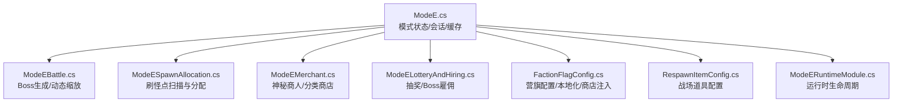
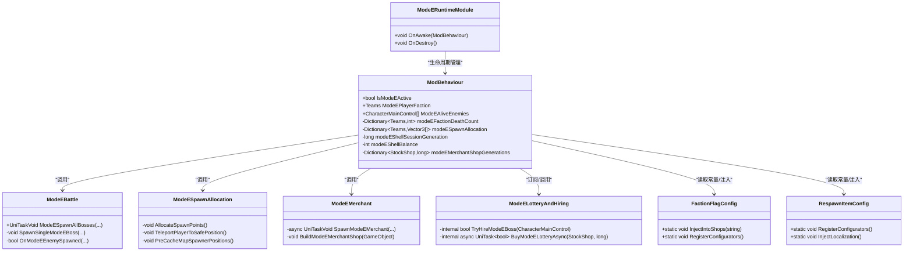
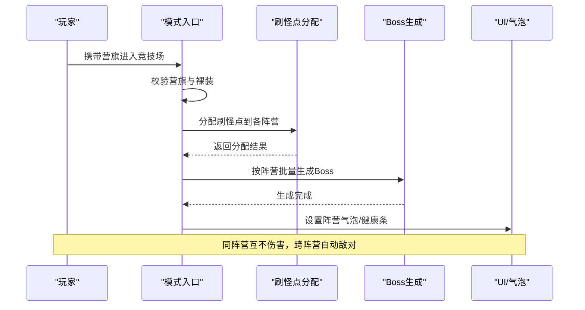
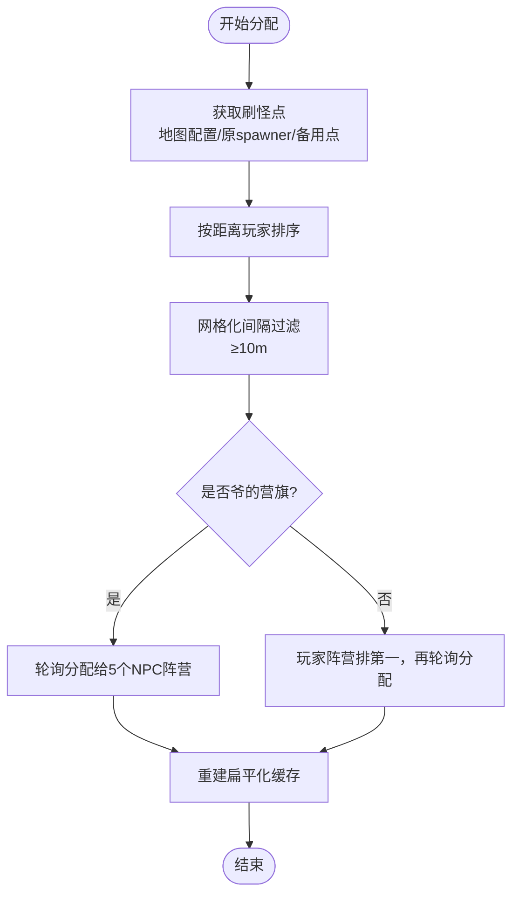
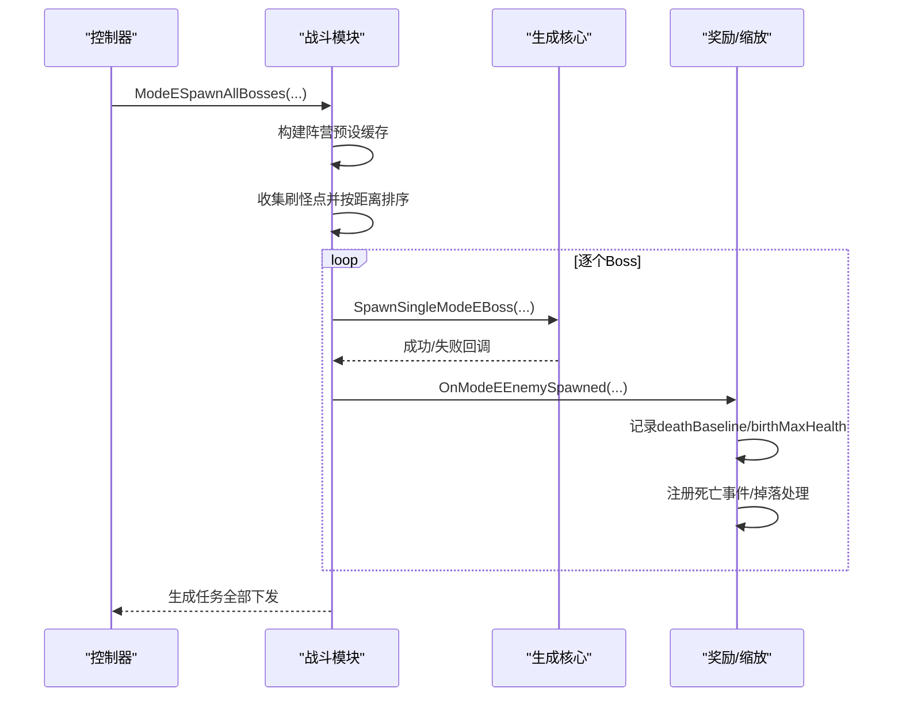
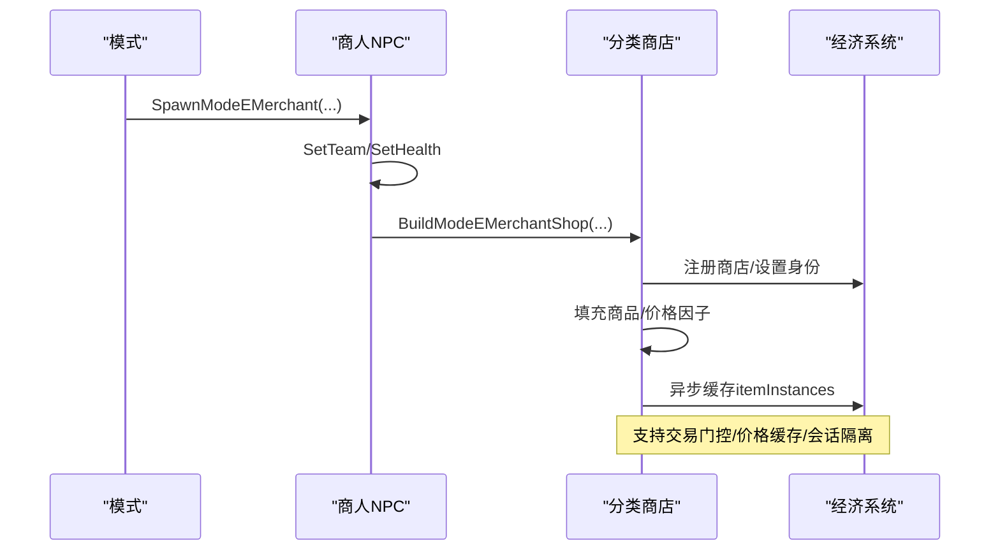
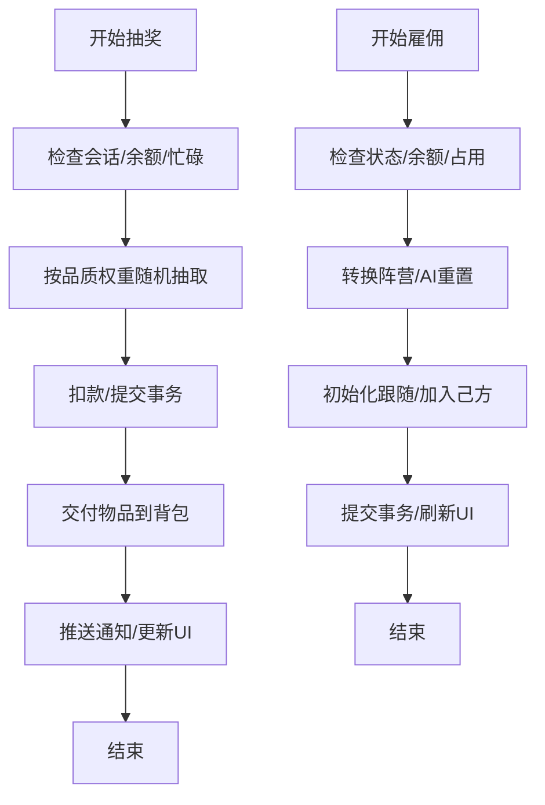
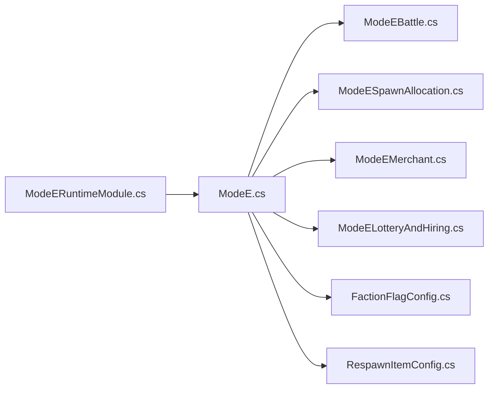

# Mode E：划地为营

<cite>
**本文引用的文件**
- [ModeE.cs](file://ModeE/ModeE.cs)
- [ModeEBattle.cs](file://ModeE/ModeEBattle.cs)
- [ModeEMerchant.cs](file://ModeE/ModeEMerchant.cs)
- [ModeELotteryAndHiring.cs](file://ModeE/ModeELotteryAndHiring.cs)
- [ModeESpawnAllocation.cs](file://ModeE/ModeESpawnAllocation.cs)
- [FactionFlagConfig.cs](file://ModeE/FactionFlagConfig.cs)
- [RespawnItemConfig.cs](file://ModeE/RespawnItemConfig.cs)
- [ModeERuntimeModule.cs](file://ModeE/ModeERuntimeModule.cs)
</cite>

## 目录
1. [简介](#简介)
2. [项目结构](#项目结构)
3. [核心组件](#核心组件)
4. [架构总览](#架构总览)
5. [详细组件分析](#详细组件分析)
6. [依赖关系分析](#依赖关系分析)
7. [性能与调优](#性能与调优)
8. [故障排查](#故障排查)
9. [结论](#结论)
10. [附录](#附录)

## 简介
Mode E（划地为营）是 BossRush 的多阵营沙盒混战模式。玩家以“营旗”为入场凭证，裸装进入竞技场后由系统分配阵营；地图刷怪点按规则平均分配给各参战阵营，每个阵营在各自领地一次性生成 Boss。同阵营实体互不伤害，不同阵营自动敌对交战。敌人按“出生时死亡基线”计算个人层数，随本阵营累计死亡数动态提升难度。模式中提供神秘商人、抽奖、Boss雇佣、战场道具等玩法，并内置经济系统与升级机制，支持势力对抗、资源争夺与战略部署。

## 项目结构
Mode E 的核心代码集中在 ModeE 目录下，围绕“状态与生命周期、战斗与缩放、刷怪点分配、商人商店、抽奖与雇佣、战场道具、运行时模块”等职责进行拆分，便于维护与扩展。

图表来源
- [ModeE.cs:65-328](file://ModeE/ModeE.cs#L65-L328)
- [ModeEBattle.cs:27-800](file://ModeE/ModeEBattle.cs#L27-L800)
- [ModeESpawnAllocation.cs:27-628](file://ModeE/ModeESpawnAllocation.cs#L27-L628)
- [ModeEMerchant.cs:29-800](file://ModeE/ModeEMerchant.cs#L29-L800)
- [ModeELotteryAndHiring.cs:17-800](file://ModeE/ModeELotteryAndHiring.cs#L17-L800)
- [FactionFlagConfig.cs:19-332](file://ModeE/FactionFlagConfig.cs#L19-L332)
- [RespawnItemConfig.cs:18-405](file://ModeE/RespawnItemConfig.cs#L18-L405)
- [ModeERuntimeModule.cs:1-29](file://ModeE/ModeERuntimeModule.cs#L1-L29)

章节来源
- [ModeE.cs:65-328](file://ModeE/ModeE.cs#L65-L328)
- [ModeERuntimeModule.cs:1-29](file://ModeE/ModeERuntimeModule.cs#L1-L29)

## 核心组件
- 模式壳与状态管理：负责会话令牌、经济会话、价格缓存、交易门控、存活敌人集合、阵营死亡计数、UI健康条缓存等。
- 战斗与动态缩放：负责批量生成 Boss、按阵营池选择预设、安全距离重选、AI行为修正、基础血量提升、BEAR补偿、掉落适配、死亡事件注册、奖励快照等。
- 刷怪点分配：优先使用地图配置的 Mode E 专用刷怪点，否则回退到原地图 spawner 位置或基于玩家位置的备用点；按距离排序、间隔过滤、轮询分配，确保差异不超过 1。
- 神秘商人：生成 NPC，注入分类商店（枪、近战、配件、子弹、头盔、护甲、背包、图腾、面罩/耳机、医疗），除子弹外价格×10，生命设为极高值，支持 Mode E 专属消耗品与其他物品。
- 抽奖与雇佣：按品质桶与时间权重抽取物品，价格线性递增；Boss 可被雇佣成为玩家阵营单位，价格随已雇佣数量指数增长，支持交易原子性与回滚。
- 战场道具：挑衅烟雾弹、混沌引爆器、猎王响哨、血狩烽火，用于刷新 Boss、吸引仇恨等战术操作。
- 营旗系统：随机/指定阵营/独狼（爷的营旗）三种入场方式，基地售货机注入与本地化。

章节来源
- [ModeE.cs:65-328](file://ModeE/ModeE.cs#L65-L328)
- [ModeEBattle.cs:27-800](file://ModeE/ModeEBattle.cs#L27-L800)
- [ModeESpawnAllocation.cs:27-628](file://ModeE/ModeESpawnAllocation.cs#L27-L628)
- [ModeEMerchant.cs:29-800](file://ModeE/ModeEMerchant.cs#L29-L800)
- [ModeELotteryAndHiring.cs:17-800](file://ModeE/ModeELotteryAndHiring.cs#L17-L800)
- [FactionFlagConfig.cs:19-332](file://ModeE/FactionFlagConfig.cs#L19-L332)
- [RespawnItemConfig.cs:18-405](file://ModeE/RespawnItemConfig.cs#L18-L405)

## 架构总览
Mode E 采用“中心状态 + 模块化子系统”的架构。主类持有全局会话、经济、缓存与集合；各子系统通过方法调用与事件协作，保证高内聚低耦合。

图表来源
- [ModeE.cs:65-328](file://ModeE/ModeE.cs#L65-L328)
- [ModeEBattle.cs:27-800](file://ModeE/ModeEBattle.cs#L27-L800)
- [ModeESpawnAllocation.cs:27-628](file://ModeE/ModeESpawnAllocation.cs#L27-L628)
- [ModeEMerchant.cs:29-800](file://ModeE/ModeEMerchant.cs#L29-L800)
- [ModeELotteryAndHiring.cs:17-800](file://ModeE/ModeELotteryAndHiring.cs#L17-L800)
- [FactionFlagConfig.cs:19-332](file://ModeE/FactionFlagConfig.cs#L19-L332)
- [RespawnItemConfig.cs:18-405](file://ModeE/RespawnItemConfig.cs#L18-L405)
- [ModeERuntimeModule.cs:1-29](file://ModeE/ModeERuntimeModule.cs#L1-L29)

## 详细组件分析

### 阵营系统与入场流程
- 营旗类型：随机营旗、拾荒者、USEC、BEAR、实验室、狼群、爷的营旗（独立阵营）。
- 入场条件：携带对应营旗且裸装进入竞技场，系统解析营旗并分配阵营；若为“爷的营旗”，玩家不参与分配，所有刷怪点分给 5 个 NPC 阵营，并将玩家传送到安全区域。
- 阵营气泡与 UI：根据当前阵营显示气泡与健康条信息，避免误伤与增强沉浸感。

图表来源
- [ModeE.cs:65-328](file://ModeE/ModeE.cs#L65-L328)
- [ModeESpawnAllocation.cs:182-362](file://ModeE/ModeESpawnAllocation.cs#L182-L362)
- [ModeEBattle.cs:244-355](file://ModeE/ModeEBattle.cs#L244-L355)

章节来源
- [FactionFlagConfig.cs:19-332](file://ModeE/FactionFlagConfig.cs#L19-L332)
- [ModeE.cs:65-328](file://ModeE/ModeE.cs#L65-L328)
- [ModeESpawnAllocation.cs:182-362](file://ModeE/ModeESpawnAllocation.cs#L182-L362)

### 刷怪点分配算法
- 数据来源优先级：地图配置的 Mode E 专用刷怪点 → 原地图 CharacterSpawnerRoot.Points → 基于玩家位置的备用点。
- 预处理：按距离玩家由近到远排序；网格化间隔过滤（最小间距 10m）。
- 分配策略：轮询分配至各阵营，余数依次分配，确保差异不超过 1；若为“爷的营旗”，玩家不参与分配，所有点分给 5 个 NPC 阵营。
- 安全传送：为“爷的营旗”选择离所有 Boss 最远的可行走点，并通过 NavMesh 采样微调。

图表来源
- [ModeESpawnAllocation.cs:182-362](file://ModeE/ModeESpawnAllocation.cs#L182-L362)
- [ModeESpawnAllocation.cs:366-461](file://ModeE/ModeESpawnAllocation.cs#L366-L461)
- [ModeESpawnAllocation.cs:466-623](file://ModeE/ModeESpawnAllocation.cs#L466-L623)

章节来源
- [ModeESpawnAllocation.cs:182-362](file://ModeE/ModeESpawnAllocation.cs#L182-L362)
- [ModeESpawnAllocation.cs:366-461](file://ModeE/ModeESpawnAllocation.cs#L366-L461)
- [ModeESpawnAllocation.cs:466-623](file://ModeE/ModeESpawnAllocation.cs#L466-L623)

### 战斗系统与动态难度缩放
- 批量生成：按距离玩家由近到远分批下发生成任务，每批之间让出帧以避免卡顿；龙裔遗族全局限制最多 1 个，龙王完全排除。
- 预设选择：优先从该阵营 Boss 池选取；若无则从小怪池提升为 Boss；狼阵营先刷完所有 wolf Boss 后再出小怪；BEAR 无预设时从全阵营小怪池兜底并提升属性。
- AI修正：统一 aiCombatFactor=1，避免 AI 互殴伤害缩放；强制清零 forceTracePlayerDistance，阻止原版追踪玩家逻辑。
- 基础增强：非玩家阵营基础血量×1.5；BEAR 额外提升血量和伤害 150%。
- 动态缩放：记录每个敌人出生时的死亡基线；个人层数 = 当前阵营死亡计数 - deathBaseline；每层生命/伤害+5%。
- 奖励快照：区分标准 Boss、提升 Boss、非 Boss，结合会话/场景/代数标记，确保结算正确。

图表来源
- [ModeEBattle.cs:244-355](file://ModeE/ModeEBattle.cs#L244-L355)
- [ModeEBattle.cs:431-623](file://ModeE/ModeEBattle.cs#L431-L623)
- [ModeEBattle.cs:641-797](file://ModeE/ModeEBattle.cs#L641-L797)

章节来源
- [ModeEBattle.cs:244-355](file://ModeE/ModeEBattle.cs#L244-L355)
- [ModeEBattle.cs:431-623](file://ModeE/ModeEBattle.cs#L431-L623)
- [ModeEBattle.cs:641-797](file://ModeE/ModeEBattle.cs#L641-L797)

### 商人系统与分类商店
- 生成与身份：异步生成神秘商人 NPC，设置极高生命值；通过 nameKey/iconType 匹配预设，回退策略健壮。
- 分类商店：为每个物品分类创建独立 StockShop，注入交互选项；除子弹外价格×10，医疗品排除黑名单。
- 其他商店：固定售卖特定物品 ID（含 Mode E 专属消耗品）。
- 经济集成：在 Mode E shell 模式下注册商店，验证 merchantID/accountAvaliable，异步缓存 itemInstances，支持交易门控与价格缓存。

图表来源
- [ModeEMerchant.cs:73-191](file://ModeE/ModeEMerchant.cs#L73-L191)
- [ModeEMerchant.cs:302-609](file://ModeE/ModeEMerchant.cs#L302-L609)

章节来源
- [ModeEMerchant.cs:73-191](file://ModeE/ModeEMerchant.cs#L73-L191)
- [ModeEMerchant.cs:302-609](file://ModeE/ModeEMerchant.cs#L302-L609)

### 抽奖与雇佣系统
- 抽奖：按品质桶与时间权重（随游玩时长变化）抽取物品；每次购买价格线性递增；支持事务原子性、余额检查、库存实例缓存。
- 雇佣：Boss 可被雇佣为玩家阵营单位；基础价格与最大血量相关，受已雇佣数量指数影响；雇佣过程包含阵营转换、AI重置、跟随初始化、交易回滚与清理。

图表来源
- [ModeELotteryAndHiring.cs:128-286](file://ModeE/ModeELotteryAndHiring.cs#L128-L286)
- [ModeELotteryAndHiring.cs:288-407](file://ModeE/ModeELotteryAndHiring.cs#L288-L407)
- [ModeELotteryAndHiring.cs:459-736](file://ModeE/ModeELotteryAndHiring.cs#L459-L736)

章节来源
- [ModeELotteryAndHiring.cs:128-286](file://ModeE/ModeELotteryAndHiring.cs#L128-L286)
- [ModeELotteryAndHiring.cs:288-407](file://ModeE/ModeELotteryAndHiring.cs#L288-L407)
- [ModeELotteryAndHiring.cs:459-736](file://ModeE/ModeELotteryAndHiring.cs#L459-L736)

### 战场道具机制
- 挑衅烟雾弹：在最近的刷怪点重新生成随机阵营 Boss。
- 混沌引爆器：在全图所有刷怪点重新生成随机阵营 Boss。
- 猎王响哨：玩家周围 50 米内非同阵营 Boss 将把玩家视为首要目标。
- 血狩烽火：信号传遍整张地图，全图所有非同阵营 Boss 将把玩家视为首要猎物。
- 这些道具通过 UsageUtilities 与 RespawnItemUsage 接入原版使用流程，具备本地化与品质配置。

章节来源
- [RespawnItemConfig.cs:18-405](file://ModeE/RespawnItemConfig.cs#L18-L405)

### 经济系统、升级机制与特殊事件
- 经济会话：会话令牌、代数、商人代数、交易门控、价格缓存、余额变更事件，确保多商店并发安全与一致性。
- 升级机制：敌人按个人层数提升生命与伤害；玩家层数按最终击杀独立累计；Boss 掉落适配 Mode D 风格。
- 特殊事件：龙裔遗族全局限制、龙王完全排除；BEAR 阵营兜底与属性补偿；“爷的营旗”安全传送与独狼体验。

章节来源
- [ModeE.cs:65-328](file://ModeE/ModeE.cs#L65-L328)
- [ModeEBattle.cs:641-797](file://ModeE/ModeEBattle.cs#L641-L797)
- [ModeEMerchant.cs:236-300](file://ModeE/ModeEMerchant.cs#L236-L300)

## 依赖关系分析
- 模块间耦合：ModeE.cs 作为中心状态，协调战斗、分配、商人、抽奖雇佣等子系统；各子系统通过方法调用与事件通信，降低直接耦合。
- 外部依赖：游戏原生 CharacterSpawnerRoot、Points、StockShop、ItemStatsSystem、Harmony 补丁、UI 系统等。
- 潜在循环：未发现明显循环依赖；通过会话令牌与代数隔离异步任务，避免旧续体污染新会话。

图表来源
- [ModeE.cs:65-328](file://ModeE/ModeE.cs#L65-L328)
- [ModeERuntimeModule.cs:1-29](file://ModeE/ModeERuntimeModule.cs#L1-L29)

章节来源
- [ModeE.cs:65-328](file://ModeE/ModeE.cs#L65-L328)
- [ModeERuntimeModule.cs:1-29](file://ModeE/ModeERuntimeModule.cs#L1-L29)

## 性能与调优
- 生成批次化：Boss 生成按距离排序分批下发，前几个使用更长间隔，减少低端机卡顿。
- 预设缓存：按阵营缓存 Boss/小怪池与加权总血量，避免重复构建。
- 存活敌人索引：按阵营维护独立列表与映射，避免全量遍历；BossRegen 专用缓存减少变异词条开销。
- 价格缓存：基于商店、物品 ID、商人代数的键缓存价格，减少反射与查询成本。
- 建议调优：
  - SPAWN_DELAY_MS/INITIAL_BATCH_DELAY_MS 可根据硬件调整。
  - MODE_E_SPAWN_MIN_DISTANCE 可微调刷怪点密度。
  - 抽奖质量权重锚点可按赛季节奏调整。
  - 商人价格因子与医疗黑名单可按平衡需求修改。

[本节为通用指导，无需具体文件引用]

## 故障排查
- 商人生成失败：检查预设查找、玩家实例、会话有效性、补丁安装；失败时销毁实例并标记不可用。
- 刷怪点为空：确认地图配置、spawner 缓存、备用点生成；日志输出关键步骤。
- 生成异常：捕获异常并回退龙裔占位标记；确保生成计数结案。
- 交易异常：事务提交前后检查余额与会话；失败时退款与清理临时样本。
- UI 健康条：语言切换与版本缓存，避免重复刷新。

章节来源
- [ModeEMerchant.cs:236-300](file://ModeE/ModeEMerchant.cs#L236-L300)
- [ModeESpawnAllocation.cs:466-623](file://ModeE/ModeESpawnAllocation.cs#L466-L623)
- [ModeEBattle.cs:579-623](file://ModeE/ModeEBattle.cs#L579-L623)
- [ModeELotteryAndHiring.cs:288-407](file://ModeE/ModeELotteryAndHiring.cs#L288-L407)

## 结论
Mode E 通过清晰的模块划分与稳健的会话/交易/缓存机制，实现了多阵营混战的复杂玩法。其刷怪点分配、动态难度缩放、商人商店、抽奖雇佣与战场道具共同构成完整的策略生态。建议在平衡性调优时关注生成批次、预设权重、价格曲线与道具效果，并结合日志与测试持续优化。

[本节为总结，无需具体文件引用]

## 角色预设与动态商店生命周期

Mode E/F 为运行时角色克隆的 `CharacterRandomPreset` 由挂在角色对象上的 lease 持有，必须等角色
本体 OnDestroy 链完成后再延迟释放。模式结束不再用 Hurt 触发死亡，而是先禁掉落、注销运行时追踪，
再停用并销毁角色，避免 Health 或血条访问已失效 preset。

分类 `StockShop` 在 inactive 子对象上创建，先以 `Merchant_Normal` 引导官方 Awake，同帧 Start 前
切回稳定 `ModeE_*` ID，然后清空并填入分类库存。这样避免默认 `Albert` 的无效数据库查询，同时
保持保存键、Mode E 贝壳交易 capability 与 fail-closed 身份回读契约。

## 附录
- 战术建议：
  - 利用挑衅烟雾弹集中刷新 Boss，快速积累层数与经济收益。
  - 使用混沌引爆器制造混乱，打乱敌方阵型，配合雇佣 Boss 形成局部优势。
  - 血狩烽火全图引怪，适合清场或逼迫敌方分散。
- 配置调优：
  - 调整 MAP 配置的 Mode E 专用刷怪点以提升分布合理性。
  - 调整 BEAR 补偿比例与基础血量增强系数以平衡阵营强度。
  - 调整抽奖权重锚点与价格递增曲线以控制经济通胀。
- 模组扩展接口：
  - 新增营旗/道具：在 FactionFlagConfig/RespawnItemConfig 中注册 TypeID 与本地化。
  - 新增分类商店：在 ModeEMerchant 中添加 Tag 分类与商品列表。
  - 新增预设池：在 ModeEBattle 的阵营预设缓存中扩展 Boss/小怪池。
  - 新增事件钩子：通过 ModeE 事件总线与 Harmony 补丁扩展交互与 UI。

[本节为扩展指导，无需具体文件引用]
