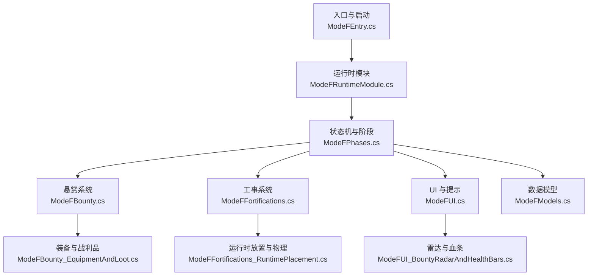
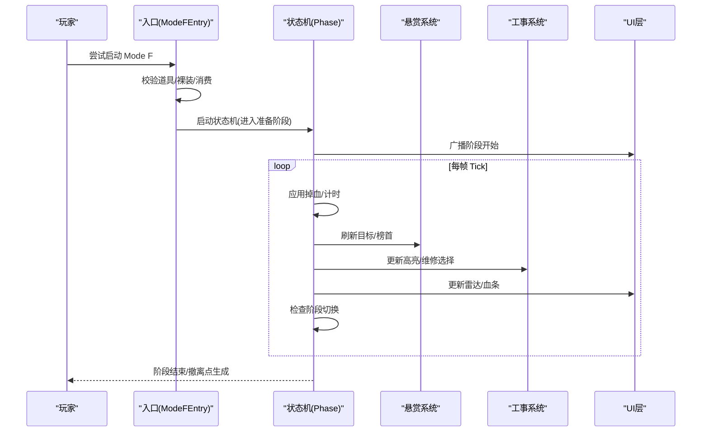
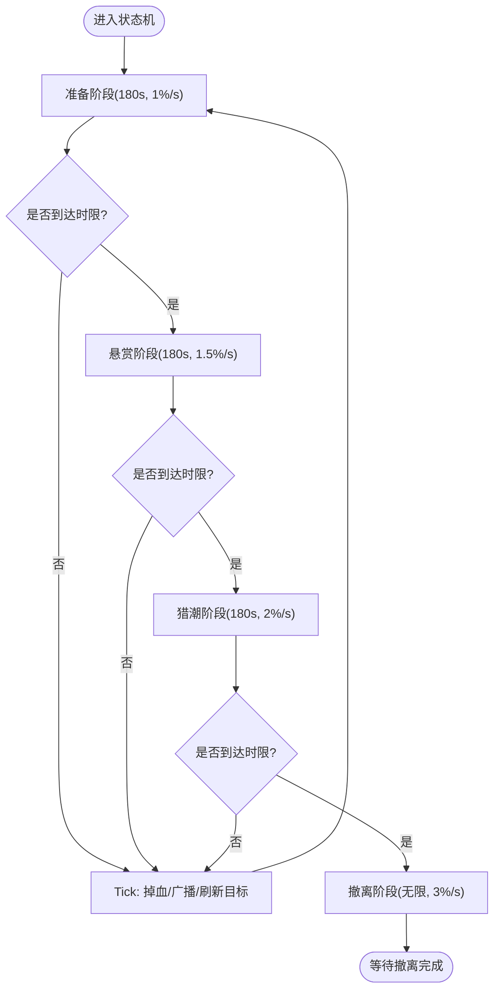
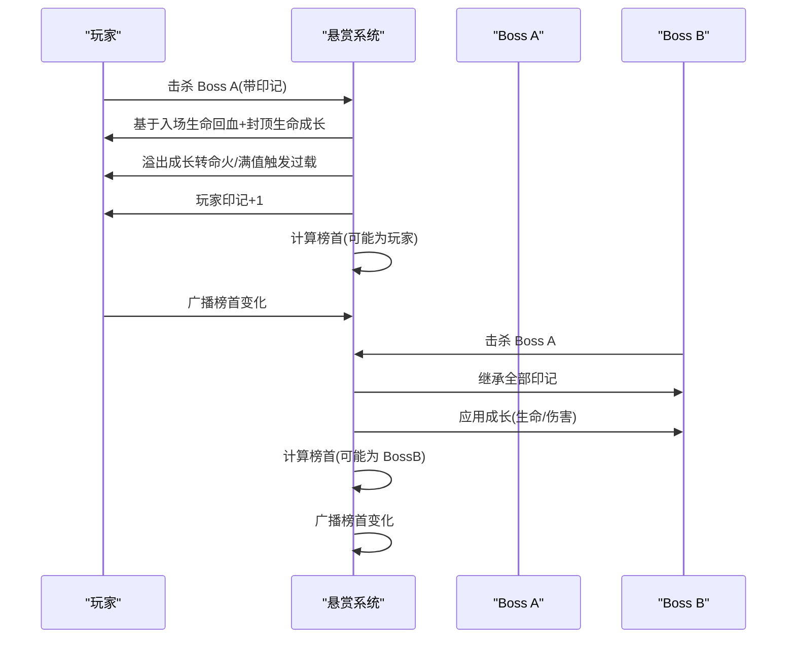
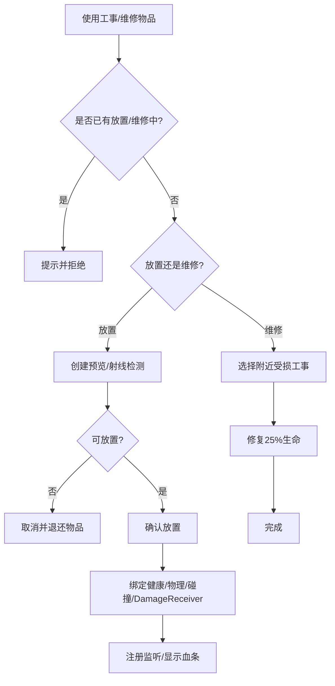
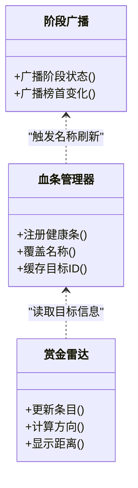
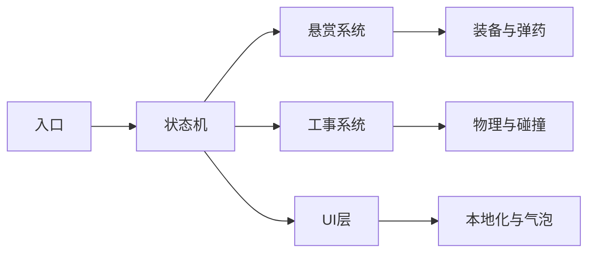

# Mode F：血猎追击

2026-09-02 撤离修正（COMPAT）：`Utilities/ModeExtractionPointFactory.cs` 清空 prefab 官方事件后，
再决定通知与返基地兜底；一次性成功标记在结算前占有，防止重复或递归事件发起双重加载。
`ModeF/ModeFExtraction.cs` 在真实成功结算并退出后累计成功次数。F3 不再读取已被 Reset 的
ExtractionResolved，而是核对计数增量、模式退出和基地完整就绪；第三轮 MODE_F_EXTRACTION
已通过，baseReady=True。共享工厂的丧尸实际撤离不在此项覆盖范围。

<cite>
**本文引用的文件**
- [ModeFEntry.cs](file://ModeF/ModeFEntry.cs)
- [ModeFPhases.cs](file://ModeF/ModeFPhases.cs)
- [ModeFBounty.cs](file://ModeF/ModeFBounty.cs)
- [ModeFFortifications.cs](file://ModeF/ModeFFortifications.cs)
- [ModeFFortifications_RuntimePlacement.cs](file://ModeF/ModeFFortifications_RuntimePlacement.cs)
- [ModeFUI.cs](file://ModeF/ModeFUI.cs)
- [ModeFUI_BountyRadarAndHealthBars.cs](file://ModeF/ModeFUI_BountyRadarAndHealthBars.cs)
- [ModeFBounty_EquipmentAndLoot.cs](file://ModeF/ModeFBounty_EquipmentAndLoot.cs)
- [ModeFModels.cs](file://ModeF/ModeFModels.cs)
- [ModeFRuntimeModule.cs](file://ModeF/ModeFRuntimeModule.cs)
</cite>

## 目录
1. [简介](#简介)
2. [项目结构](#项目结构)
3. [核心组件](#核心组件)
4. [架构总览](#架构总览)
5. [详细组件分析](#详细组件分析)
6. [依赖关系分析](#依赖关系分析)
7. [性能与内存优化](#性能与内存优化)
8. [故障排查指南](#故障排查指南)
9. [结论](#结论)
10. [附录：策略、配置与扩展](#附录：策略配置与扩展)

## 简介
Mode F（血猎追击）是一个以“持续掉血 + 阶段推进 + 悬赏目标 + 工事防御”为核心的高压力生存模式。玩家进入后，会经历准备、悬赏、猎潮、撤离四个阶段，每阶段提升掉血速率并改变 Boss 行为；击杀 Boss 可回血并提升最大生命值，同时可能获得额外高品质掉落；玩家可部署和维修工事构建防线；界面提供雷达、血条名称、阶段广播等反馈。

## 项目结构
Mode F 的核心逻辑集中在 ModeF 目录下，按职责拆分为：
- 入口与生命周期：ModeFEntry.cs、ModeFRuntimeModule.cs
- 状态机与阶段控制：ModeFPhases.cs
- 悬赏系统：ModeFBounty.cs、ModeFBounty_EquipmentAndLoot.cs
- 工事系统：ModeFFortifications.cs、ModeFFortifications_RuntimePlacement.cs
- UI 与显示：ModeFUI.cs、ModeFUI_BountyRadarAndHealthBars.cs
- 数据模型：ModeFModels.cs

**图表来源**
- [ModeFEntry.cs:15-396](file://ModeF/ModeFEntry.cs#L15-L396)
- [ModeFRuntimeModule.cs:1-23](file://ModeF/ModeFRuntimeModule.cs#L1-L23)
- [ModeFPhases.cs:72-267](file://ModeF/ModeFPhases.cs#L72-L267)
- [ModeFBounty.cs:69-208](file://ModeF/ModeFBounty.cs#L69-L208)
- [ModeFFortifications.cs:202-261](file://ModeF/ModeFFortifications.cs#L202-L261)
- [ModeFFortifications_RuntimePlacement.cs:14-188](file://ModeF/ModeFFortifications_RuntimePlacement.cs#L14-L188)
- [ModeFUI.cs:289-350](file://ModeF/ModeFUI.cs#L289-L350)
- [ModeFUI_BountyRadarAndHealthBars.cs:264-428](file://ModeF/ModeFUI_BountyRadarAndHealthBars.cs#L264-L428)
- [ModeFModels.cs:7-98](file://ModeF/ModeFModels.cs#L7-L98)

**章节来源**
- [ModeFEntry.cs:15-396](file://ModeF/ModeFEntry.cs#L15-L396)
- [ModeFModels.cs:7-98](file://ModeF/ModeFModels.cs#L7-L98)

## 核心组件
- 入口与启动：检测入场道具（船票、血猎收发器）、裸装校验、原子性消耗与退款、初始化共享池与变异词条、生成 Boss 与商人、启动状态机。
- 状态机：四阶段（准备、悬赏、猎潮、撤离），每阶段固定时长与不同掉血率；Tick 驱动掉血、阶段广播、Boss 目标刷新、阶段切换。
- 悬赏系统：生成初始标记、Boss 间印记继承与成长、玩家击杀回血与封顶生命成长、溢出命火与过载、榜首广播、额外高品质掉落。
- 工事系统：三种工事类型（折叠掩体、加固路障、铁丝网），放置预览、碰撞检测、健康绑定、DamageReceiver 配置、维修选择与修复。
- UI：阶段广播、奖励气泡、血条名称覆盖（含悬赏后缀）、赏金雷达（方向、距离、首领标识）。

**章节来源**
- [ModeFEntry.cs:69-396](file://ModeF/ModeFEntry.cs#L69-L396)
- [ModeFPhases.cs:72-267](file://ModeF/ModeFPhases.cs#L72-L267)
- [ModeFBounty.cs:69-208](file://ModeF/ModeFBounty.cs#L69-L208)
- [ModeFFortifications.cs:202-261](file://ModeF/ModeFFortifications.cs#L202-L261)
- [ModeFUI.cs:289-350](file://ModeF/ModeFUI.cs#L289-L350)

## 架构总览
Mode F 采用“入口 → 运行时模块 → 状态机 → 子系统（悬赏/工事/UI）”的分层架构。状态机作为中枢，驱动掉血、阶段切换与全局压力调整；悬赏系统与工事系统通过事件与状态共享协作；UI 层订阅状态变化进行渲染更新。

**图表来源**
- [ModeFEntry.cs:265-396](file://ModeF/ModeFEntry.cs#L265-L396)
- [ModeFPhases.cs:116-267](file://ModeF/ModeFPhases.cs#L116-L267)
- [ModeFUI.cs:289-350](file://ModeF/ModeFUI.cs#L289-L350)

## 详细组件分析

### 四阶段状态机
- 阶段定义：准备（180s，1%/s）、悬赏（180s，1.5%/s）、猎潮（180s，2%/s）、撤离（无限，3%/s）。
- 阶段切换：基于 PhaseElapsed >= PhaseDuration 自动推进；撤离阶段无限持续。
- 掉血机制：按阶段速率对玩家施加伤害，致死路径使用真实伤害并忽略护甲/难度；异常兜底确保死亡处理触发。
- 压力调整：猎潮/撤离阶段为 Boss 增加速度加成并强制追踪玩家；非标记 Boss 在猎潮阶段额外加速。
- 持续补位：Boss 死亡或完整性检查发现对象失效时按缺口补 1 只，准备阶段也立即执行；两条路径一旦移除活跃引用，就通过 `finally` 保证奖励、日志、掉落或清理异常不会丢失补位，且重复死亡回调不会重复入队。队列保持单个异步生成在途，连续恢复压力但不额外抬高场上目标数量。
- 广播与 UI：每 15 秒广播当前阶段剩余时间或撤离提示。

**图表来源**
- [ModeFPhases.cs:15-45](file://ModeF/ModeFPhases.cs#L15-L45)
- [ModeFPhases.cs:189-267](file://ModeF/ModeFPhases.cs#L189-L267)
- [ModeFPhases.cs:272-361](file://ModeF/ModeFPhases.cs#L272-L361)

**章节来源**
- [ModeFPhases.cs:72-267](file://ModeF/ModeFPhases.cs#L72-L267)
- [ModeFPhases.cs:272-361](file://ModeF/ModeFPhases.cs#L272-L361)

### 赏金系统
- 生成名单：第二阶段开始时为所有存活 Boss 赋予 1 层印记，并刷新名称标签与压力。
- 印记继承：Boss 被其他 Boss 击杀时，受害者印记全部转移给击杀者，并按印记数增长生命与伤害（每层 5%）。
- 玩家击杀：击杀带印记 Boss 为玩家加 1 印记。回血按入场最大生命结算：普通 30%，悬赏基础 45%，每层额外印记再加 5%，最高 60%。最大生命成长同样按入场最大生命结算：普通击杀 +4%，悬赏击杀 +4%×印记数（至少 1 倍），本局累计成长最多为入场上限的 +50%。成长奖励与成长上限必须同为比例量纲，否则击杀量无法填满上限、命火永远不会触发。
- 命火过载：超过生命成长上限的部分按“成长上限容量”归一化为 0～100 命火；满值自动进入 15 秒过载，枪械/近战 +40%、移速 +15%、Mode F 失血 ×2，并向玩家施加官方 Burn Buff。过载期间击杀悬赏 Boss 续时 3 秒，剩余时间最高 24 秒；自然结束保留 25 命火。
- 榜首广播：根据印记数计算榜首，若玩家最高则玩家为榜首；变更时广播上下文消息。
- 额外掉落：悬赏 Boss 额外掉落高品质物品，数量等于其印记数。

**图表来源**
- [ModeFBounty.cs:69-208](file://ModeF/ModeFBounty.cs#L69-L208)
- [ModeFBounty.cs:213-311](file://ModeF/ModeFBounty.cs#L213-L311)
- [ModeFBounty.cs:570-653](file://ModeF/ModeFBounty.cs#L570-L653)
- [ModeFPhases.cs:363-635](file://ModeF/ModeFPhases.cs#L363-L635)

**章节来源**
- [ModeFBounty.cs:69-208](file://ModeF/ModeFBounty.cs#L69-L208)
- [ModeFBounty.cs:213-311](file://ModeF/ModeFBounty.cs#L213-L311)
- [ModeFBounty.cs:570-653](file://ModeF/ModeFBounty.cs#L570-L653)
- [ModeFPhases.cs:363-635](file://ModeF/ModeFPhases.cs#L363-L635)

### 工事系统
- 工事类型：折叠掩体、加固路障、铁丝网，每种有独立预制体、最大生命、碰撞体尺寸与半障碍物触发范围。
- 放置流程：进入放置模式 → 创建预览对象 → 禁用碰撞/刚体 → 射线检测地面 → 颜色反馈可放置性 → 左键确认放置。
- 碰撞与物理：Wall 层承担挡子弹与挡角色移动；DamageReceiver 子对象负责扣血；避免重复扣血与误伤。
- 维修流程：使用维修喷雾进入选择模式 → 鼠标悬停高亮受损工事 → 左键确认修复（恢复 25% 生命，范围 3m）。
- 限制与优化：活动工事硬上限（24），低端机 Raycast 层掩码收敛，Outline 延迟销毁避免资源泄漏。

**图表来源**
- [ModeFFortifications.cs:202-261](file://ModeF/ModeFFortifications.cs#L202-L261)
- [ModeFFortifications.cs:269-408](file://ModeF/ModeFFortifications.cs#L269-L408)
- [ModeFFortifications.cs:474-544](file://ModeF/ModeFFortifications.cs#L474-L544)
- [ModeFFortifications_RuntimePlacement.cs:14-188](file://ModeF/ModeFFortifications_RuntimePlacement.cs#L14-L188)
- [ModeFFortifications_RuntimePlacement.cs:441-684](file://ModeF/ModeFFortifications_RuntimePlacement.cs#L441-L684)

**章节来源**
- [ModeFFortifications.cs:202-261](file://ModeF/ModeFFortifications.cs#L202-L261)
- [ModeFFortifications.cs:269-408](file://ModeF/ModeFFortifications.cs#L269-L408)
- [ModeFFortifications.cs:474-544](file://ModeF/ModeFFortifications.cs#L474-L544)
- [ModeFFortifications_RuntimePlacement.cs:14-188](file://ModeF/ModeFFortifications_RuntimePlacement.cs#L14-L188)
- [ModeFFortifications_RuntimePlacement.cs:441-684](file://ModeF/ModeFFortifications_RuntimePlacement.cs#L441-L684)

### UI 系统集成
- 阶段广播：每 15 秒显示当前阶段与剩余时间或撤离提示。
- 血条名称覆盖：为 Boss 与玩家添加悬赏后缀（如“悬赏 x”），支持语言切换与版本缓存。
- 赏金雷达：显示最多 5 个最近未可见的悬赏目标与首领，包含方向箭头、图标、距离面板；Canvas 层级与字体缓存优化。
- 奖励气泡：击杀回报（血量、生命上限、命火、续时、悬赏印记）以玩家头顶对话气泡展示；过载开始时优先显示 4 秒警告，明确火力 +40%、移速 +15%、失血 ×2 与烧伤状态。

**图表来源**
- [ModeFUI.cs:116-138](file://ModeF/ModeFUI.cs#L116-L138)
- [ModeFUI.cs:289-350](file://ModeF/ModeFUI.cs#L289-L350)
- [ModeFUI_BountyRadarAndHealthBars.cs:264-428](file://ModeF/ModeFUI_BountyRadarAndHealthBars.cs#L264-L428)

**章节来源**
- [ModeFUI.cs:289-350](file://ModeF/ModeFUI.cs#L289-L350)
- [ModeFUI_BountyRadarAndHealthBars.cs:264-428](file://ModeF/ModeFUI_BountyRadarAndHealthBars.cs#L264-L428)

## 依赖关系分析
- 入口依赖：共享运行时准备、地图刷怪点分配、变异词条抽取、Boss 生成与商人生成。
- 状态机依赖：悬赏系统（生成名单、榜首计算）、工事系统（高亮、维修选择）、UI（广播、雷达）。
- 悬赏系统依赖：装备互换与弹药补给、高品质掉落池、Boss 成长 Modifier。
- 工事系统依赖：实体模型工厂、物理层掩码、DamageReceiver 反射字段、健康事件绑定。
- UI 依赖：本地化、对话框气泡、小地图遮挡判断、字体与纹理缓存。

**图表来源**
- [ModeFEntry.cs:265-396](file://ModeF/ModeFEntry.cs#L265-L396)
- [ModeFPhases.cs:116-267](file://ModeF/ModeFPhases.cs#L116-L267)
- [ModeFBounty.cs:69-208](file://ModeF/ModeFBounty.cs#L69-L208)
- [ModeFFortifications.cs:202-261](file://ModeF/ModeFFortifications.cs#L202-L261)
- [ModeFUI.cs:289-350](file://ModeF/ModeFUI.cs#L289-L350)

**章节来源**
- [ModeFEntry.cs:265-396](file://ModeF/ModeFEntry.cs#L265-L396)
- [ModeFPhases.cs:116-267](file://ModeF/ModeFPhases.cs#L116-L267)
- [ModeFBounty.cs:69-208](file://ModeF/ModeFBounty.cs#L69-L208)
- [ModeFFortifications.cs:202-261](file://ModeF/ModeFFortifications.cs#L202-L261)
- [ModeFUI.cs:289-350](file://ModeF/ModeFUI.cs#L289-L350)

## 性能与内存优化
- 掉血与 Tick：每帧仅一次掉血计算与阶段广播节流（15s），Boss 目标刷新间隔 1.5s，完整性检查 1s。
- 工事放置：Raycast 层掩码收敛至地面/墙体，Fallback 全层仅在必要时触发；OverlapBox 使用预分配缓冲避免分配。
- 工事渲染：Outline 高亮延迟销毁（10s），减少频繁创建/销毁 MeshFilter/MeshRenderer。
- UI 缓存：血条名称版本化缓存、雷达字体与纹理静态缓存、相机帧级缓存。
- 内存与状态清理：活动工事硬上限（24）；退出时清理所有 Boss、工事、商人、快递员与龙息 Buff 处理器，释放提取区域与 UI 对象；先撤销命火过载的枪械、近战和移速 Modifier，再撤销玩家本局最大生命成长并把当前生命限制到恢复后的真实上限，避免临时属性或超额生命进入模式外。

**章节来源**
- [ModeFPhases.cs:116-184](file://ModeF/ModeFPhases.cs#L116-L184)
- [ModeFFortifications.cs:142-158](file://ModeF/ModeFFortifications.cs#L142-L158)
- [ModeFFortifications.cs:366-403](file://ModeF/ModeFFortifications.cs#L366-L403)
- [ModeFUI.cs:59-69](file://ModeF/ModeFUI.cs#L59-L69)
- [ModeFPhases.cs:579-837](file://ModeF/ModeFPhases.cs#L579-L837)

## 故障排查指南
- 启动失败：检查是否已运行其他模式、是否携带营旗、是否满足裸装条件；查看日志中的“未检测到船票或血猎收发器”“玩家不满足裸装条件”。
- 阶段卡住：确认 TickModeF 是否正常调用，检查 PhaseElapsed 与 PhaseDuration；查看“阶段切换”相关日志。
- 赏金不生效：验证 GenerateBountyList 是否执行，检查 Boss 存活列表与印记字典；查看“悬赏名单已生成”日志。
- 工事无法放置：确认放置位置过近或被场景物体占用；检查 Raycast 层掩码与 OverlapBox 结果；查看“部署位置被场景物体占用”提示。
- UI 不显示：检查 ShouldShowModeFBountyRadar 条件（阶段、叠加层、是否有悬赏标记）；查看“隐藏雷达条目”日志。
- 命火不触发：确认玩家最大生命成长已达到入场上限的 +50%（每杀 +4%，约 13 杀到顶），检查 `BloodfireCharge` 是否随溢出成长增加（每杀约 +8）；查看“命火过载开始”以及 Burn/Stat 缺失警告。若成长奖励被改回绝对 HP 值，本局击杀量将永远填不满比例上限，表现为命火恒为 0。
- 退出后生命异常：检查日志是否出现“退出时钳制超额生命”；退出后必须满足 `CurrentHealth <= MaxHealth`，否则说明 `ExitModeF` 未完成生命成长清理。

**章节来源**
- [ModeFEntry.cs:69-164](file://ModeF/ModeFEntry.cs#L69-L164)
- [ModeFPhases.cs:250-267](file://ModeF/ModeFPhases.cs#L250-L267)
- [ModeFBounty.cs:69-114](file://ModeF/ModeFBounty.cs#L69-L114)
- [ModeFFortifications.cs:613-632](file://ModeF/ModeFFortifications.cs#L613-L632)
- [ModeFUI_BountyRadarAndHealthBars.cs:403-428](file://ModeF/ModeFUI_BountyRadarAndHealthBars.cs#L403-L428)

## 结论
Mode F 通过清晰的状态机驱动高压生存体验，结合悬赏系统与工事系统形成“进攻-防守-撤离”的循环。代码实现注重性能与稳定性，采用缓存、节流、层掩码收敛与硬上限等手段保障低端设备流畅运行。UI 层提供丰富的反馈，帮助玩家理解局势与决策。

## 附录：策略、配置与扩展
- 策略建议：
  - 准备阶段优先部署关键工事（路障封路、掩体掩护、铁丝网减速）。
  - 悬赏阶段集中击杀高印记 Boss，以 45%～60% 入场生命回血并快速积累生命上限；达到上限后利用命火过载抢一段高风险输出节奏。
  - 猎潮阶段利用工事拖延，优先清除无标记 Boss 以减少追兵压力。
  - 撤离阶段保持移动，利用工事延缓 Boss 接近，尽快抵达撤离点。
- 配置选项：
  - 阶段时长与掉血率：可通过常量调整（准备/悬赏/猎潮/撤离）。
  - 命火曲线：生命成长上限、充能容量、过载时长/续时、属性加成与失血倍率均由 `MODEF_*` 常量集中维护。
  - 工事上限与修复比例：活动工事硬上限（24），修复比例（25%）。
  - 雷达显示阈值：最大目标数（5）、刷新间隔（0.2s）、边缘边距（54）。
- 扩展方法：
  - 新增工事类型：在 FortDef 表注册新类型，定义预制体、碰撞体尺寸与最大生命。
  - 新增悬赏规则：修改 GenerateBountyList 与 ApplyModeFBossGrowth，调整印记继承与成长公式。
  - 扩展 UI：在 ModeFUI_BountyRadarAndHealthBars.cs 中添加新的雷达条目或血条样式。

**章节来源**
- [ModeFPhases.cs:15-45](file://ModeF/ModeFPhases.cs#L15-L45)
- [ModeFFortifications.cs:142-158](file://ModeF/ModeFFortifications.cs#L142-L158)
- [ModeFUI.cs:24-38](file://ModeF/ModeFUI.cs#L24-L38)
- [ModeFFortifications.cs:15-78](file://ModeF/ModeFFortifications.cs#L15-L78)
