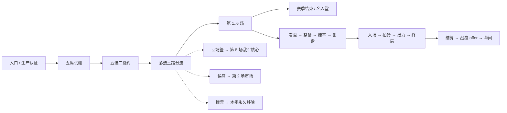

# Mode H：百战留痕（黑市鸭王杯）

2026-09-02 F3 验收清理修正：`ForceResetStateForValidation` 复用完整的 `ReleaseRuntimeObjects`
逆序收尾，先保留 run 上下文尝试押品返还，再停止认证/生成、释放选手与两种租约、关闭 UI，
最后清空临时状态和 run owner。两种租约提供 `Release(sceneGeneration)`，不提供 `Dispose`。
此入口仅限 Dev；正式认证拒绝仍按 `AbortSetup` 退款离场，F3 在下个场内用例前恢复竞技场。
晚间完整报告的 H 拒绝后清理、场景恢复和最终泄漏差值已通过。

同日生产认证修正：`ModeHSpawnBridge` 已为独立 clone 打开非 Raid 图死亡，
`ModeHProductionCertification` 改为验证生成后 Health 的该标志，不再按原预设的地图保护标志拒绝。
两个诊断 clone 均走完整 DamageInfo 的 Hurt，并观察 IsDead 与实例受伤/死亡事件；
同步监听在 finally 退订。第三轮真实伤害出现空引用，静态检查发现已安装的击杀提示订阅
直接读取伤害来源；认证现由两只诊断 clone 互作攻击者，拒绝空来源、自身和主玩家，
避免认证计入玩家击杀提示。异常保留完整栈及事件状态，不能只看到 IsDead 就判通过。
第四轮不再出现伤害异常或逐 key 拒绝，但整体认证仍被口令门槛拒绝。

第四轮口令认证修正（COMPAT）：矩阵写入接口此前无人调用，只有 steady 自结算分量提供
1 条可用口令，永远达不到 3 条门槛。`ModeHCommandCertificationProbe` 复用生产适配器，
在双方诊断 AI 激活、无敌期间，对可读且可还原的字段跨至少 3 帧、累计 0.3 秒采样，
先读后重申，并验证还原；双方均通过才写逐效果证据。无目标/路径/技能释放遥测的点火和 marker
保持 ReportOnly。测量前绑定签名，缓存恢复合法逐效果而非相信口令聚合状态，恢复后再检查门槛；
报告也保留招牌口令结果。取消/异常会还原适配器并回收诊断角色，日志输出实际门槛失败原因。
8 个候选、5 原型、3 口令门槛不变；新流程经编译及模拟探针验证，整体首次认证和缓存仍待实机。

<cite>
**本文档引用的文件**
- [ModeHConfig.cs](file://ModeH/ModeHConfig.cs)
- [ModeHRuntimeModule.cs](file://ModeH/ModeHRuntimeModule.cs)
- [ModeHStateMachine.cs](file://ModeH/ModeHStateMachine.cs)
- [ModeHEntry.cs](file://ModeH/ModeHEntry.cs)
- [ModeHDraftController.cs](file://ModeH/ModeHDraftController.cs)
- [ModeHEncounterPlanner.cs](file://ModeH/ModeHEncounterPlanner.cs)
- [ModeHOddsController.cs](file://ModeH/ModeHOddsController.cs)
- [ModeHVirtualStakeController.cs](file://ModeH/ModeHVirtualStakeController.cs)
- [ModeHCommandController.cs](file://ModeH/ModeHCommandController.cs)
- [ModeHCommandAdapters.cs](file://ModeH/ModeHCommandAdapters.cs)
- [ModeHCommandCertificationProbe.cs](file://ModeH/ModeHCommandCertificationProbe.cs)
- [ModeHProductionCertification.cs](file://ModeH/ModeHProductionCertification.cs)
- [ModeHCommandCompatibilityRegistry.cs](file://ModeH/ModeHCommandCompatibilityRegistry.cs)
- [ModeHCombatControl.cs](file://ModeH/ModeHCombatControl.cs)
- [ModeHCombatTelemetry.cs](file://ModeH/ModeHCombatTelemetry.cs)
- [ModeHEventRouter.cs](file://ModeH/ModeHEventRouter.cs)
- [ModeHInjuryAndScarSystem.cs](file://ModeH/ModeHInjuryAndScarSystem.cs)
- [ModeHBattleSnapshot.cs](file://ModeH/ModeHBattleSnapshot.cs)
- [ModeHHarmonyPatches.cs](file://ModeH/ModeHHarmonyPatches.cs)
- [ModeHStandInPerformer.cs](file://ModeH/ModeHStandInPerformer.cs)
- [ModeHWarehouseStakeJournal.cs](file://ModeH/ModeHWarehouseStakeJournal.cs)
- [ModeHRewardTransaction.cs](file://ModeH/ModeHRewardTransaction.cs)
- [ModeHSeasonRewardService.cs](file://ModeH/ModeHSeasonRewardService.cs)
- [ModeHTransferMarket.cs](file://ModeH/ModeHTransferMarket.cs)
- [ModeHUI.cs](file://ModeH/ModeHUI.cs)
- [ModeHLocalization.cs](file://Localization/ModeHLocalization.cs)
</cite>

## 一句话

你不是选手，是经理人。签两只斗士，看懂盘口，全场只喊一嗓子，让它们替你打完六场。

## 进入方式与前置

- 由 `ModeHInteractable` 的擂台门交互进入，走 `BossRushMapSelectionHelper` 的
  typed pending entry kind（`BossRushPendingEntryKind.ModeH`），与 Mode G 互斥。
- `modeHEnabled` 字段与旧键 `BossRush_ModeHEnabled` 仅为兼容保留；Mode H 现属默认内容，
  不再注册总开关，并会在读配置后强制恢复为开启。
- 入口页顶部**固定显示**真实资产风险行 `BossRush_ModeH_RealStakeRiskNotice`，
  不可折叠、不可关闭：本模式允许押上真实仓库物品，失败会永久没收，唯一装备也不豁免。
- 五种拒绝原因（内容未就绪、地图不支持、展示资源缺失、旧模式冲突、生产认证失败）
  各自恰好退还一张预扣船票，退款是 `ModeHEntry.TryRefundPrepaidTicket()` 的唯一实现点。

## 一季的形状



- 六场，第一幕 1/2，第二幕 3/4，第三幕 5/6；第 6 场就是冠军赛，没有第 7 场。
- 每场最多 180 秒；到时判玩家失败，不补伤害、不伪造击倒。
- 市场只有两个窗口：第 2 场后（候签）与第 4 场后（特殊敌军资格）。

## 五席试棚（§17.2）

`ModeHDraftController` 一季只生成一次五名候选，且必须同时满足：

- 覆盖突进 / 远程 / 重装 / 消耗 / 残局五种公开原型各一名；
- 至多一名稀有异常；至少两名稳定型底色；
- `stableKey` 与 `profileId` 两两不同；
- 展示顺序由 `runSeed` 固定——**关掉页面重开不会重抽**。

候选不是运行时角色实例，只是稳定 key 的公开档案。签约顺序固定为“先主将、后替补”，
剩余三席立刻以固定种子做一次 Fisher-Yates，得到回场签 / 候签 / 撕票三张去向牌。

## 敌军计划与赔率（§17.5）

`ModeHEncounterPlanner` 在玩家整备**之前**冻结敌军计划，三层叠加：

| 层 | 内容 |
| --- | --- |
| 编制骨架 | 独兽 / 双煞 / 头领与护卫 / 猎群 / 接力队 / 远近交替 / 残阵 / 回场核心 / 冠军独兽 / 后程增援 |
| 进场剧本 | 斥候先行 / 开场压上 / 后程增援 / 远近交替 / 核心压轴 / 未知席位 |
| 擂台条件 | 中央掩体 / 危险边缘 / 医疗受限 / 窄笼 / 开阔场 / 余威 |

威胁走廊按场次冻结为 `100 / 115 / 130 / 145 / 165 / 190`，同屏上限 `2 / 2 / 3 / 3 / 3 / 3`。
候选先过全局能力矩阵审计（不得同时封死五种原型），再过 roster-level veto
（存活合同选手中至少一名原型未被硬封锁）；连续 8 个候选都失败才以 `TechnicalAbort`
进入 `Recovering`——**始终至少保留一种合法排列**。

赔率是公开分差，`ModeHOddsController` 只读公开摘要与玩家当前公开整备：

```text
publicEdge = playerPublicScore - enemyPublicScore
x1: >= 20    x2: 5..19    x3: -9..4    x4: -24..-10    x5: <= -25
```

只有 `VerifiedBehavior` 的行为进入分数，`ReportOnly` 计 0 分，`Unavailable` 不得被抽取。
下注额不参与赔率计算，避免循环定价。

## 虚拟筹码（§17.5 的 2026-08-27 定价修订）

每季初始 6 点、上限 30，每场可下 `0..min(2, 余额)`，0 点始终合法。**净赔率**语义：

```text
grossVirtualPayout   = 胜利 ? stake * (1 + odds) : 0
netVirtualProfit     = gross - stake
settledBalance       = clamp(余额 + gross, 0, 30)
rewardCandidateCount = 1 + min(2, floor(max(0, net) / 2))
```

因此押满 2 点在**任何**赔率档胜利时都严格优于不下注；1 点小注只在 `x1` 档与不下注
同为 1 个候选，那是刻意保留的保守选项。失败按 `stake` 扣除余额，
余额下降后可下注额自然收紧，起步 6 点最多承受三次满额失败。

## 拍铃：全场唯一主动操作（§17.6）

赛前从可用通用口令与在场者的招牌口令中锁定**一条**，战中每场只有**一次**拍铃：

- 八条通用口令：稳住 / 压上 / 回到中间 / 清掉旁边 / 收割 / 留一手 / 护替补 / 拼了；
- 五类招牌口令：打弱点 / 钉住 / 最后一梭 / 一起上 / 交给你；
- 口令窗口 6 秒，`ModeHCommandAdapters` 以 **0.1 秒**周期重申，
  压过行为树 0.15 秒的 `TraceTarget` 重发；
- 控制点严格限于 §17.6.2 白名单；`nextReleaseSkillTimeMarker` 写入后**不还原**，
  只把所有权交还原版；
- 窗口结束、倒地、接力、技术中止、切图与 shutdown 共用同一幂等还原入口；
- **点火类效果的目标由 `ModeHCombatControl.RefreshFireTargets` 按遥测的存活敌军名单算出**
  （2026-09-03 修正，CR-2026-09-03-017）。此前这两个目标只有消费者没有生产者，
  「收割」（`finish`）整条是空操作、「压上」（`press`）的转火一项失效，
  而生产认证仍把它们标成通过——`Validate()` 判的是 `_ai.searchedEnemy != null`，
  AI 自己有目标就算保持住。目标以**当前登场选手**为参照点，
  按 0.1 秒重申节奏节流，拍铃那一刻强制重扫。

拍铃不暂停战斗、不弹菜单，HUD 按钮三态呈现（可用 + 口令名 / 窗口进行中 / 已消耗置灰）。

## 伤病与战痕（§17.4）

`ModeHFighterDownToken` 是唯一规范倒地事件，每个 `participantId + matchIndex` 至多一次。
只有本场**从未实际踏入擂台**的选手才算完整休息；带伤选手再次登场被击倒直接退役。

**2026-09-03 补接线**：上述「休息一场解除带伤」此前只是设计与文案，代码里没有任何实现——
`ModeHCombatTelemetry.HasRested` 写好了零调用，`injuryId` 与 `status` 都没有回到
`Available` 的路径。结果是把带伤选手按在替补席毫无收益，伤病 debuff 与赔率惩罚（
`starterInjured -5` / `relayInjured -3`）持续整个赛季，选手实际只有「两条命、无恢复」。
现在 `BeginMatchSettlement` 对 `matchStarter` 与 `matchRelay` 两席各做一次休息结算，
判据取 `HasRested`（本场 entrant 名单里没有它），与倒地结算天然互斥；
结算页用 `Injury_Rested` / `Injury_Retired` 明示本场谁休息好了、谁退役了。
休息名单只存运行时，不进持久化 DTO（赛季摘要按反射遍历全部字段，加字段会触发写屏障）。

**2026-09-03 内容层接通**：上面这条「必须落在已验证控制点上」的规则此前是**一句空话**——
认证探针只遍历 `ModeHContentCatalog.Commands`，只写 `<commandId>.<controlPointId>` 形状的
effectId，于是 `Scars.json` 里那批分量 ID（`leg.sightDistance` 等）与四个裸异常 ID
永远查不到实测记录，`IsEntryUsableForKey` 对任何 key 恒 false。表现是：
**战痕一条都开不出**（`PickScarOffer` 恒 `scar_offer_no_candidate`）、
**伤病永远无名**（可用条目只有全自结算的 `armor` / `spirit` 两条，`PickInjury` 拿不满 3 条返回空串）、
**四个公开异常一次都不触发**——而选秀卡照样把异常名与描述展示给玩家，据此签约与看赔率。
现在探针把伤病与战痕按同一条路径（`ProbeGroup`）实测，认证报告与名人堂缓存往返
（`BuildCommandStatuses` / `RestoreCertificationEffects`）也一并按条目级查询，
否则缓存命中的那一局会把内容层结论整批丢掉、而口令层看起来毫无异常。

三点实现细节值得记住：
- **四个公开异常改走 `selfSettledEffects`**（`blood` / `crowd` / `strong` / `error`）。
  它们不写任何原版字段，没有可实测的对象；§17.6.4 line 1308 本来就要求三条胆怯恒为
  `VerifiedBehavior`。`error` 同列是 owner 2026-09-03 裁决：互换自带 2 秒 deadline
  与完整回滚，运行时已 fail-safe，白名单加不了安全性，实测改由 F3 覆盖。
- **同条目重复控制点必须投影**。战痕 `relay_expert` 有两条分量都写 `skillSuccessChance`，
  后写的会盖掉先写的，`Validate` 只可能确认最后那一条。不做 `(key, controlPointId)` 投影，
  这条战痕会因为「自己盖自己」而对任何 key 永久不可用。口令里不存在重复控制点，
  所以既有探针从没遇到过这一类。
- **`blood_rush` 目前仍不可开出**：它唯一的非自结算分量是 `blood_rush.searchedEnemy`，
  `ReadField` 读不到该字段（守卫明令禁止给它加 case，因为点火类效果没有目标遥测，
  `_ai.searchedEnemy != null` 证明不了仍是**我们**设的那个目标）。战痕池实际是 7 / 8。
  要恢复第 8 条需要真正的目标身份遥测，属独立课题。

五条伤病（`leg` / `hand` / `armor` / `old_wound` / `spirit`）与八条战痕都必须落在
已验证控制点或 Mode H 自结算上，**不存在“只有文案没有战斗影响”的条目**；
任一分量对当前 key 不可用，整条就不进抽池——不允许“收益生效、代价失效”。

**接线口径（2026-09-03 修正，CR-2026-09-03-019）**：战痕分两类落地路径，
`windowSeconds == 0` 的常驻战痕（`center_keeper` / `skill_saver_scar` / `crowd_favorite`）
由选手登场时的 `ApplyStandingScars` 施加；其余为触发型，靠
`TryOpenScarWindow(scarId, triggerId)` 开窗，而它对 `Scars.json` 的 `trigger` 做**逐字**比对，
不匹配时静默返回 false。此前八条里只有两条真能生效：
`broken_shield_charge` 与 `crowd_favorite` 的 triggerId 与表对不上、
`blood_rush` 与 `longshot_memory` 根本没有调用点。三条触发条件现已按表接通——
护甲耐久首次归零 / 敌军首次进残血 / 登场选手首次吃到远程伤害；
`crowd_favorite` 的多余触发调用已删（它本就是常驻）。
由 `ModeHScarTriggerWiringGuard` 按 JSON 反查代码守卫。

自结算分量的 `command_scale` 有两种等价写法（`op=self_settled_command_scale`，
或 `op=self_settled` + `controlPointId=command_scale`），两种都必须被识别：
此前只认前者，`bell_dependence` 的 +20% 收益从未生效而 −10% 代价照常生效，
恰好违反上面那条“不允许收益生效、代价失效”。

**分量条件 `appliesWhen`：随战斗持续求值**（owner 2026-09-03 拍板，CR-2026-09-03-020）。
8 种条件由 `ModeHEffectConditions` 按重申节奏（0.1 秒）求值，分量随条件真伪**上下线**：
条件转真时按当前值重新捕获并施加，转假时还原那一条并摘掉。点火类分量同样受约束，
否则"下线"只对调制类生效。

`condition_<id>` 与本场 `plan.conditionId` 逐字比对——`danger_edge` 与 `open_field`
本就是 `ThreatPlans.json` 里真实存在的 `arenaConditionId`，不存在第二套映射表。

**自结算分量是例外**：`_selfSettledCommandScale` 是累乘标量，无法只撤销其中一项，
因此只在开窗时求值一次；守卫据此断言自结算分量只能带整场恒定的 `condition_*` 族条件。

此前这一层**完全没有实现**：`appliesWhen` 解析后零读者，9 个分量一律无条件施加。
最明显的是 `crowd_favorite`：收益写“敌军≥3 才给”、代价写“单核战才吃”，
两个互斥条件同时恒真，这条战痕在任何局面下都同时拿到全部收益与全部代价。
战痕最多三条，满三条时接受新战痕必须明确替换一条；拒绝换取稳定名声 +1（上限 99），
名声只用于展示，不影响战斗、赔率、奖励或市场。

## ERROR 完整互换（§17.6.5）

`error` 异常有几率把控制权交到玩家手上，同时选手的性格进入玩家身体在看台自行行动。
三个部件：

1. **控制权切换**复用原版 `ControlOtherCharacter(target, -1f)`，2 秒 deadline 兜底，
   并独立确认 `LevelManager.ControllingCharacter` 已切换，不只信任原版回调。
2. **解冻玩家身体**是 Mode H 首发唯一允许的 Harmony 新增：恰好两个 postfix，
   打在 `CA_ControlOtherCharacter.CanMove` 与 `CanRun` 上。
   **`CanUseHand` 与 `CanControlAim` 保持原版 `false`**——看台身体因此在引擎层面
   就无法使用武器、无法瞄准、无法手部交互。
3. **看台表演**由 `ModeHStandInPerformer` 驱动，六种底色对应六种走位模式，
   只写移动意图，半径 3 米、每 0.5 秒重设一次目标、越界拉回、连续 3 次失败停演；
   停演绝不升级为技术中止。

执行顺序不可颠倒：**先中立无敌，再解冻移动，最后启动表演**；恢复顺序为
停表演 → 清门 → 确认控制目标已还原 → 受控选手重设回 `scav` → 恢复身体 team →
恢复无敌 → 恢复位置。互换期间原版会把击杀归属改写为主角，
因此**接管期间的击杀按原版规则计入你的击杀统计与经验**，候选卡对此有明确说明。

**2026-09-03 接线**：以上三个部件此前**整条是死的**——`TryBeginErrorSwap` 全仓零调用点，
`_swapPhase` 永远停在 `None`，`TickErrorSwap` 首行即早返，于是看台表演与那两个
Harmony postfix 在生产里从未生效过；`_errorTriggered` 只被写进赛后报告，
「本局触发过 ERROR」被记了下来，而游戏里什么都没发生。
唯一生产调用点现在是 `ModeHRuntimeModule_CombatFlow.TryBeginErrorSwapIfDue`，
每帧轮询 `ErrorTriggered && !ErrorSwapAttempted`，
由 `_errorSwapAttempted` 闩住每场至多一次（没有这个闩，deadline 回滚后条件立刻重新成立，
玩家会被反复夺走控制权）。

**同时必须修的硬阻断**：观战租约在 `TryAcquire` 步骤 1 就 `InputManager.DisableInput`，
只在 `Release` 恢复。不让渡输入的话，接通后的互换是把一个**动不了的选手**交到玩家手上，
§17.6.5 整条退化成一次镜头切换。租约新增 `YieldInputForErrorSwap` /
`ReclaimInputAfterErrorSwap`，只动自己的 token（`blockInputSources` 是 HashSet，
增删幂等），`_inputDisabled` 保持 true 使 `Release` 分支不变，最终态恒为「输入已恢复」。
模块侧 `SyncErrorSwapInputYield` 只在相位翻转时才真正调 `InputManager`，
并在 `ReleaseCombatRuntimeObjects` 里兜底收回（结算与技术中止路径不会再进 Tick）。

**已知边界（接受并记录）**：互换期间光标被官方锁定，HUD 上的铃是 uGUI 按钮，
因此**互换期间点不到铃**；互换结束后铃仍可用、未消耗。
另外被接管选手的背包在互换期间是可达的——§17.6.5 只保证看台身体不碰真实仓库，
这条列入 §26.5 人工 smoke。

实测入口：F3 用例 `MODE_H_ERROR_SWAP`（`DebugAndTools/F3GameplayValidationModeHErrorSwap.cs`）
端到端跑一遍触发 → 控制权切换 → 看台表演 → 完整还原，
三态记账；看台身体位移只报告不作判据（`CanMove()` 还要求 `CharacterWalkSpeed > 0f`）。

## 战场快照与恢复（§17.4）

`ModeHBattleSnapshot` 在四类离散事件采集（每批敌军入场后 / 每 10 秒 / 拍铃后 /
倒地或接力后），只在内存构造并随下一次 Season 写入一并落盘，不额外调用 `SaveFile`。
**快照只采集，不重建**（2026-09-03 修正，CR-2026-09-03-018）。
§17.4 原本计划按 `healthFraction * MaxHealth` 就地重建这一场；那套代码写完过，
但全链零调用点，且与实际生效的恢复语义互斥：

§20.3 规定战前/战中的**任何**故障一律回落到**同一场看盘**——
`ResolveRecoveryResumeLifecycle` 把 `MatchBrief..MatchSettling` 整个战斗族映射到 `MatchBrief`，
再由 `RestoreMatchReservationAndSnapshot` 整场回滚：退还虚拟筹码预留、还原选手档案、
删除未归档的战报与奖励 operation、清空 `currentBattleSnapshot`。

冻结转换表站在 §20.3 这边：`Recovering` 的出边只有
`EntryIntent / SceneLoading / Drafting / RosterLocked / MatchBrief / ErrorRecoveryPending /
Intermission / TransferWindow / HallOfFame / Suspended`，**没有任何一条通向战斗态**，
局中重建因此在状态机层面结构性不可达。重建侧四个成员已随之移除，
`ModeHBattleSnapshotGuard` 的断言方向反转为「必须保持缺席」。

玩家侧口径：中断后是**重打这一场**，不是接着打；这一场押的虚拟筹码与真实押品全额退回，
**绝不判负**，也绝不声称继续了原战斗。

采集侧保持不变（四类触发点、只在内存构造、随 Season 一并落盘、参与 §20.2 canonical digest）：
`currentBattleSnapshot` 是落盘字段，摘掉它属 `SCHEMA-`，需 owner 签字。

## 真实仓库抵押（§22）

没有真实资产开关，可用性是**只读派生结果** `IsSlotConsistent`（§22.1 四条取值规则）。

**2026-09-01 已接线**（owner 明确要求）。此前 `LoadPersisted` 没有任何调用点，
`_slotConsistent` 恒为 false，整套抵押事务 API 与 `ModeHRewardTransaction` 全部零调用，
但看盘页仍无条件显示「失败会永久没收」的风险提示——功能不存在却挂着恐吓文案。
现在的实际形态：

- 存档：新增 `ModeHStakeJournalPersistence`（独立 key `BossRush_ModeH_StakeJournal_v1`，
  形态照 `ModeHProfilePersistence`）。该 key 必须同时能反序列化成
  `ModeHStakeJournalHeaderDto`（`InitializeRiskForSlot` 的轻量风险扫描只读 header，
  不许加载 Season/bundle/候选池）与完整 `ModeHStakeJournalDto`——header 是完整 DTO 的
  字段子集，**增删 journal 字段时不得改动 header 的 7 个字段名**。
- 落盘时机：**写盘是阶段推进的一部分**，`TryAdvancePhase` 内联 `RequestStakeJournalWrite`，
  写失败整体回滚阶段。三个 `*Durable` 阶段的名字就是这个语义：内存说"已持久化"
  而磁盘上没有，等于崩溃后无法证明玩家那件装备去了哪。
- 编排：`ModeHRealStakeService` 是选择器与 journal 之间的唯一桥梁，自身不碰库存 API
  （`ModeHIsolationGuard` 冻结「只有 journal 与 `ModeHInventoryPersistenceBridge`
  可引用 `Inventory`/`PlayerStorage`」，选择器需要的只读查询已下沉进 bridge）。
- 状态机：押了物品的那一场走冻结表为真实资产支路预留的
  `LoadoutLocked → StakePrepared → MatchSpawning`；没押的主干仍是直连
  （`ModeHStateMachineGuard` 冻结这一点）。
- 数值：单场件数上限 `MaxRealStakeItemsPerMatch = 3`；最坏损失 = 全部押品（不暗中打折，
  「唯一装备不豁免」）；胜利返还全部押品并按**原始整数倍率**发同品质奖励（x5 上限 = 5 件）。
- 文案：风险提示改为仅在真能押时显示；禁用原因按 `slot_active_journal` /
  `slot_manual_intervention` / `slot_storage_unavailable` 分因展示，
  不再用一句「无法证明资产安全」让玩家以为存档坏了。

⚠️ **仍待实机验证**：escrow 重建、满仓返还（`return_no_empty_slot`）与
`ManualIntervention` 出口只能靠加载存档进基地实测，静态审计与 guard 无法覆盖。

journal 阶段严格单向，`phase` 是唯一终态来源：

```text
None → Prepared → EscrowSnapshotDurable → EscrowRemovedDurable → MatchLocked
     → ResultCommitted → SettlementPending → Terminal
     ↘ AbortReturnCommitted → SettlementPending → RefundedTerminal
任一非终态且证据不一致 → ManualIntervention
```

`ModeHWarehouseStakeJournal` 是**唯一**真实仓库写入者；`ModeHRewardTransaction`
只生成不可变结果计划并调用 journal 的 `CommitResult/Settle`。
物品身份靠 `ModeHItemTreeNormalizer` 的语义树摘要 + 出现次数双重比对，
`Item.GetInstanceID`、TypeID 与 `LockIndex` 都**不是**所有权证明。
证据不足时优先保护资产：保持 `SettlementPending` 或转 `ManualIntervention`，
不追债、不少扣、不静默删除 journal。

## 与其它模式的边界

- 与 Mode D/E/F/G 及僵尸模式互斥；旧模式最终入口只读取
  `IsModeHRiskScanReady` 与 `IsModeHExternalAssetRiskBlocked` 两个门，
  绝不等待 H 内容或恢复壳状态。
- 隔离由 `ModeHArenaIsolationLease`（冻结原图 spawner、清理原生敌人、核对边界）
  与 `ModeHSpectatorLease`（固定获取/释放顺序的观战租约）负责。
- 额外死亡掉落抑制仍走既有的 `Patches/Combat/CharacterOnDeadPatch.cs` 扩展，
  不新增全局补丁。

## 2026-08-31 可玩闭环收口

`ModeHRuntimeModule_CombatFlow` 已把赔率页、虚拟下注、锁盘、分帧生成、双方入场、
拍铃口令、接力、180 秒胜负、遥测、伤病/战痕 offer、奖励、幕间、转会和名人堂接成一条主线。
选手快照与查询辅助拆在 `ModeHRuntimeModule_CombatProfiles`，只用于控制文件规模；
技术故障从 `ErrorRecoveryPending` 有显式出口进入 `Recovering`，不会停在恢复死态。
结算只生成一份未归档 report；恢复时优先路由到该 report，避免重放战斗或重复发奖。
技术重试会撤销本场未归档 report、奖励 operation、虚拟筹码预约和战前快照，再回到同场看盘。

地图选择只展示通过 Mode H 五点位审计的地图，玩家点击其他条目时只重绑冻结目标、
不创建第二个 generation。原图隔离清场只销毁明确敌对玩家的战斗角色；玩家、玩家阵营、
遗种巢随从、带 `INPCController` 的 NPC/配偶/商人与其他非敌对角色全部保留。
HUD 的选手名在备战时缓存，战斗每帧只消费缓存与数值，不重复做本地化/名称解析。

## 已知待办

- 全部运行时结论（生成无副作用、AI 双向伤害、资源显示、存档物理落盘、无泄漏）
  只能由设计提案 §26.5 的 18 项实机 smoke 矩阵确认，静态守卫通过不等于运行时通过。
- 真实仓库押品已于 2026-09-01 接线（见上文 §22 小节）。它仍是**自愿**支路：
  不选押品时不创建 journal，虚拟筹码主线不受影响，可完整打完六场。
  escrow 重建、满仓返还与 ManualIntervention 出口三条路径尚未实机验证。

- **2026-09-03 内容层与 ERROR 接通后的待验项**：认证时长（每 key 由约 3.3 秒升到约 6.6 秒，
  仍在 `CertificationPerKeyTimeoutSeconds = 15f` 内；全池约 100-110 秒，
  在 `CertificationPoolTimeoutSeconds = 180f` 内）需要实机复核 `RecordPassed` 打出的
  `ms=` 数字；缓存命中那一局的伤病/战痕是否仍具名（F3 `MODE_H_CACHE_HIT` 覆盖）；
  ERROR 接管期间玩家**是否真的能操纵**被控选手（这是输入让渡那一腿，
  F3 只能验到状态位，实际手感必须人工确认）。
- **新赛季赔率分布会变**：`profile.behaviorStatuses` 此前恒空，
  导致 `ModeHOddsController.IsVerified` 恒 false，伤病 / 异常 / 战痕三类赔率项
  **一直计 0**。现在抽签与转会签入时一次写定该 key 的实测快照，
  `anomalyBlood -5` / `anomalyCrowd -7` / `anomalyStrong -4` / `anomalyError -2`、
  `starterInjured` / `relayInjured`、战痕 ±3 开始真正生效。
  已存赛季保持空表、不追溯（该表进赛季 canonical digest，事后刷新会让 VerifyDigest 失败）。
- **伤病门只进诊断**：§17.5 的「任一生产 key 可用伤病少于 3 条即拒绝入场」
  按 owner 2026-09-03 裁决**不做成玩家可见的入场拒绝**——那条信息对玩家不可行动，
  而一旦某个官方版本下少验一条就会把整个模式关在门外。
  `MeetsInjuryGate` 现在只出现在 `RecordPassed` 的 DevLog 里。

## 2026-09-02 第五轮：成功入场消费与真实整备

兼容分类：COMPAT / WIRE+。第五轮首次生产认证与缓存复用已实机 PASS（12 个候选，通用可用口令 7 条）；这只关闭认证链，不代表六场赛季与真实押品全部通过。

`ModeHRuntimeModule_SceneFlow.CreateDraftingSeason` 在首份赛季写入并读回成功后调用 `ModeHEntry.CancelPendingEntry` 消费冻结入场意图及预扣票所有权。成功前保留退款凭据，防止后续单纯重访同一地图重开 H；Dev 强制清理也回收遗留意图。

`ModeHLoadoutKitApplicator` 的枪械弹药必须存入新造枪的 Inventory 与临时选手 Inventory，不能用只操作装备槽的 TryPlug。严格保持 kit 的冻结总量，按 MaxStackCount 拆分，每个新实例都进入 CreatedItems；不合并进旧堆，任何失败整批逆序回收。直接写 Inventory 不会失效官方 `_bulletCountCache`，因此缓存反射字段置 -1 后由公开 BulletCount getter 重算并回读；字段缺失明确拒绝，不伪装可开火。

F3 新 `MODE_H_STARTER_KITS` 在缓存认证后的 Drafting 租约内使用真实认证池与隔离生成桥，逐件检查全部 starter kit 的槽位、弹匣实际/可用数、库存总数与堆叠上限；异步迟到产物由请求 owner 回收。生产源码离线模拟 34 项通过。第六轮实机 `MODE_H_STARTER_KITS` 已 8/8 PASS，三枪弹匣可用数/总量分别 30/120、10/40、13/60；两次入场均 intent_cleared=True，后续重访未重开 H。该结果不代表完整 AI 比赛、六场赛季或真实押品恢复已通过（报告 `BossRushValidation_20260902_140735_794.log`）。

章节来源：`ModeH/ModeHRuntimeModule_SceneFlow.cs`、`ModeH/ModeHLoadoutKitApplicator.cs`、`DebugAndTools/F3GameplayValidationModeHKits.cs`。

## 2026-09-04 赔率页「锁盘」被推出屏幕；分量标签双前缀

兼容分类：COMPAT（纯布局与本地化，不动状态机冻结表）。
Finding CR-2026-09-04-004/005/006/007。

**锁盘出屏**：`ModeHUIPages.CreateActions` 是无界单行居中平铺，步距 264，
canvas 参考分辨率固定 1920x1080；而赔率页把数量无上界的「押品格」也塞进了动作行
（格数 = 仓库前 40 格的非空格数，最坏 44 个按钮、行宽约 11600px）。
第 8 个按钮起就越过屏幕半宽 960，即**仓库里有 4 件以上东西就点不到「锁盘」**。
模态 surface 上没有任何 Mask，越界按钮不会被裁掉而是照常画到屏幕外。
`OddsPreview` 唯一的玩家侧出边就是锁盘，该页又是 timeScale=0 且无关闭按钮，
玩家只能靠官方 ESC 菜单退出关卡弃局（ESC 走 `UIInputManager`，
不受 Mode H 的 `InputManager.DisableInput` 影响）。

修复：押品格本质是**选择器**不是**动作**，移出动作行进 `ModeHPageContent.RealStakeSlots`，
渲染到已预留的 `ModeH_RealStakeSelector` 区，超出视口即套 `ScrollRect + RectMask2D`
（形态照 `PetNestUI` 的动作滚动区——同架构、同坑、已修）。
动作行只剩下注档 + 锁盘，固定 4 个以内。`CreateActions` 另加换行兜底
（`MaxSingleRowActions = 7`），越界向上堆而不是往两侧铺。
恢复壳 `RebuildActions` 同款公式、5 个按钮就出面板，一并改为换行（上限 4）。
入口页 5 张选秀卡按固定 3 列排两行时第 2 行会压在动作按钮上，
改为按可用高度推 `maxRows`、放不下就加列。

**双前缀**：`ModeHOddsController.Add` 已把完整 key 写进 `entry.LabelKey`，
`ModeHRuntimeModule_MatchFlow` 又拼了一次 `LocalizationKeyPrefix`，
18 条赔率分量标签全部显示 `*BossRush_ModeH_BossRush_ModeH_Odds_xxx*`。
消费侧改为 `L10n.T(entry.LabelKey)`。

回归守卫：新增 `tests/ModeHActionLayoutGuard.py`（两处动作区换行、押品格不得进
`page.Actions`、押品格必须有滚动兜底、卡片网格必须避让动作行）；
`ModeHLocalizationGuard` 新增双前缀反查（`LocalizationKeyPrefix +` 后不得跟成员读取）
与生产侧对偶断言。均经反向验证。

章节来源：`ModeH/ModeHUIPages.cs`、`ModeH/ModeHRecoveryPanel.cs`、
`ModeH/ModeHRuntimeModule_MatchFlow.cs`、`tests/ModeHActionLayoutGuard.py`。

## 2026-09-04 审核修复（真实押品与结算）

**押品在仓库满时不再只留在内存。** `_escrowItems` 是纯内存 `static List<Item>`，
而 `LoadPersisted` / `ResetStaticCaches` 会清空它。三处滞留点
（`ReturnEscrowItems` / `GrantPlannedRewards` / `RollbackDetached`）此前在无空位时
「保持 pending」，玩家退出 / 切槽 / 删档即物品蒸发，且没有任何路径能从 journal 的语义摘要
反造物品。现全部改走官方 `PlayerStorage.Push(item, toBufferDirectly: true)`，
物品进**持久**的 `IncomingItemBuffer`，玩家之后在 `StorageDock` 取回。

落点被守卫约束死：只能写在 `ModeHWarehouseStakeJournal`
（`check_bridge` 禁止 bridge 出现 `PlayerStorage.Push`，`check_single_writer` 禁止其余
ModeH 文件引用 `PlayerStorage`）。为守 1200 行预算，helper 拆进同一 partial 类的
`ModeHWarehouseStakeJournalStorageBuffer.cs`。

**换槽刻意不做物理返还。** `HandleSetFile` 调 `LoadPersisted` 时 `PlayerStorage` 已经指向
新槽，此时 Push 等于把旧档装备搬进新档。因此排空按调用场景分开：同槽的宿主销毁交缓冲区，
换槽只记账、由该槽自己的 journal 在重新载入时经恢复壳处置。

**三个死态可以续做了。** `ResultCommitted` / `AbortReturnCommitted` / `SettlementPending`
在冻结表里没有通向 `AbortReturnCommitted` 的出边，而 `TryAbortReturn` 此前无条件提交一次
abort return，必撞 `journal_illegal_transition`——押品退不回来，非终态 journal 还会经
`RecomputeSlotConsistency` 把 D/E/F/G/无间/丧尸**七个旧模式入口**一起锁死。

**冻结表未改动**：`ResultCommitted → SettlementPending → Terminal` 与
`AbortReturnCommitted → SettlementPending → RefundedTerminal` 本来就是合法路径，
缺的只是按阶段分派。新增 `TryCompleteFrozenSettlement` 沿用已冻结的 `settlementKind` 续做
（切换 kind 会撞 `journal_settlement_kind_drift`）；`TrySettleMatch` 加重入保护；
`CommitResult` / `CommitAbortReturn` 的字段写入随 `TryAdvancePhase` 一起回滚
（不回滚会让 `commit_result_already_committed` 早退使任何重试永久失败）；
`ManualIntervention` 单留一条**只返还不推进阶段**的物理出路。

**结算失败有玩家可见文案了**（`Settle_Failed`）。此前只写 `CriticalLog`，
而 `ShowMessage` 本身在正式构建里也是静默的（反射绑定恒 null，已同批修复），
等于玩家完全无从察觉押品没结算完。
