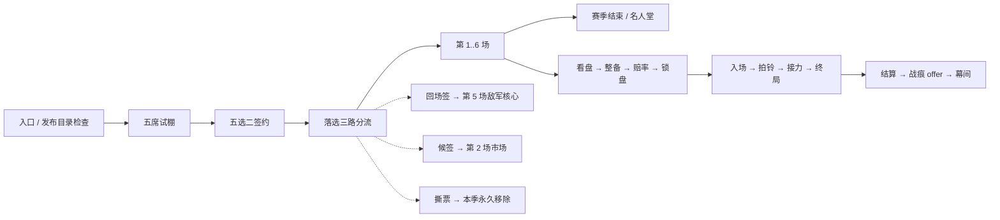

# Mode H：百战留痕（黑市鸭王杯）

2026-09-24 F3 认证迁移（COMPAT，L1/L2，实机待复测）：普通新赛季与续赛在正式版、Dev 版均只调用 `TryUseReleaseCatalog`，入场直接选人，点击候选沿原自动链开打。自动 F3 套件也模拟普通玩家入口，`MODE_H_PLAYER_ENTRY` / `MODE_H_PLAYER_REENTRY` 断言到达 Drafting 且未启动动态认证，再执行整备、ERROR 与六场赛季用例。

逐项生成、受伤、死亡与口令探针仅由 F3 → 玩法验收 →「鸭王杯逐项认证」按钮显式启动，要求 Dev 构建、专用测试档、当前停在选人页，且无其他验收、保存或场景加载。按钮先关闭 F3，再关闭 Mode H 选人页，依次释放两层暂停。完成、失败与「停止测试并返回选人」均回收诊断选手、恢复发布目录和原选人页；不创建新赛季、不重抽候选、不写赛季或认证缓存、不退票。关停及过图取消当前 owner，旧认证的迟到 finally 不能清掉新认证的句柄或 UI。旧的首次入场认证与缓存实测记录只描述历史版本，不再是当前玩家流程。认证驱动复用 `ValidationCoroutineStack`，嵌套协程异常同样清理并返回选人页，取消不记通过。整备页口令说明与候选列表共用兼容表判据，发布支持的效果正常显示。

2026-09-23 人工复查修订（COMPAT / SCHEMA+）：普通入口（正式版与 Dev 版）完成场景与租约就绪后，
`TryUseReleaseCatalog` 同步核对实际 preset、公开 AI 控制点与候选/原型/口令门槛，直接显示选人页。
逐 key 生成、受伤、死亡和口令保持率探针只由 F3 专项按钮显式运行，玩家不再等待「擂台准备中」。
沿用原报告和存档字段，兼容状态末尾追加 `ReleaseSupported=6`，与动态实测的 VerifiedBehavior /
ActionApplied 分开；报告静态来源为 `release_contract_v1`、耗时字段 0，旧枚举和 DTO 字段不变。
当前签名验证、实际生成失败的回收/同场恢复、真实资产屏障继续使用原路径。

同轮交战修复：Mode H 清掉原生追踪玩家后，没有给选手补对手，原生朝向、雨夜视角与围挡会让
无目标双方只等索敌。现在复用 `RefreshFireTargets` 的本场存活敌人扫描，为缺失/已死亡目标的
双方写入 `searchedEnemy`、`noticed`、`SetNoticedToTarget`；已有有效目标不覆盖，当前受控的 ERROR
选手、inactive 隔离对象和中立看台不参与。`StopAcceptingBell` 过去只在赛季取得观战租约时开启，
第一场结束/技术中止后永久关着；现每场成功进入 MatchFighting 时重开，HUD 与点击共用租约门。
`ModeHPlayerFlow` 执行真实目录、报告/兼容矩阵、补目标与开铃方法；静态接线由
`ModeHPlayerReadyGuard` 约束。离线证据为 L1/L2，选手是否真实开火、鼠标命中与完整六场待 L3。

2026-09-22 入场位置 owner 修复（COMPAT，CR22-012）：原生 `sceneLoaded` 只负责匹配 typed
intent 和调度等待。新开局与恢复赛季共用 `ModeHRuntimeModule_SceneFlow` 的单个协程，要求目标
scene handle、主角、`LevelManager.LevelInited`、`LevelManager.AfterInit`、`!SceneLoader.IsSceneLoading` 和
`!MultiSceneCore.IsLoading` 连续两帧就绪，然后才依次取得 arena/spectator 租约。等待携带
请求、场景、槽及入场代数，替换、取消、切图和 shutdown 会作废旧请求；旧协程不能清新句柄
或退新票。普通 custom 入场在调度前、协程起点和等待后都排除 H；认证已消费 intent 时仍按
活跃 H owner 排除，避免把看台搬回普通出生点。续赛遇 Storm B0/冷库的主图先通过官方
`LoadAndTeleport` 到目标子场景，保持旧赛季身份，不重复扣票或创建新赛季。
官方在 LevelInited 后还会等待 0.25 秒并最终 SetPosition，AfterInit 才是这一步已完成的依据，
两帧稳定不能替代 AfterInit。`ModeHSceneEntry` 执行真实入口/等待/Legacy 方法体的隔离回归；
物理、视野与九图完整对局仍待实机。

2026-09-02 F3 验收清理修正：`ForceResetStateForValidation` 复用完整的 `ReleaseRuntimeObjects`
逆序收尾，先保留 run 上下文尝试押品返还，再停止认证/生成、释放选手与两种租约、关闭 UI，
最后清空临时状态和 run owner。两种租约提供 `Release(sceneGeneration)`，不提供 `Dispose`。
此入口仅限 Dev；正式认证拒绝仍按 `AbortSetup` 退款离场，F3 在下个场内用例前恢复竞技场。
晚间完整报告的 H 拒绝后清理、场景恢复和最终泄漏差值已通过。

同日生产认证修正：`ModeHSpawnBridge` 已为独立 clone 打开非 Raid 图死亡，
`ModeHProductionCertification` 改为验证生成后 Health 的该标志，不再按原预设的地图保护标志拒绝。
两个诊断 clone 均走完整 DamageInfo 的 Hurt，并观察 IsDead 与实例受伤/死亡事件；
同步监听在 finally 退订。第三轮真实伤害出现空引用，静态检查发现已安装的击杀提示订阅
直接读取伤害来源；认证现由两只诊断 clone 互作攻击者，拒绝空来源、自身和主玩家，
避免认证计入玩家击杀提示。异常保留完整栈及事件状态，不能只看到 IsDead 就判通过。
第四轮不再出现伤害异常或逐 key 拒绝，但整体认证仍被口令门槛拒绝。

第四轮口令认证修正（COMPAT）：矩阵写入接口此前无人调用，只有 steady 自结算分量提供
1 条可用口令，永远达不到 3 条门槛。`ModeHCommandCertificationProbe` 复用生产适配器，
在双方诊断 AI 激活、无敌期间，对可读且可还原的字段跨至少 3 帧、累计 0.3 秒采样，
先读后重申，并验证还原；双方均通过才写逐效果证据。无目标/路径/技能释放遥测的点火和 marker
保持 ReportOnly。测量前绑定签名，缓存恢复合法逐效果而非相信口令聚合状态，恢复后再检查门槛；
报告也保留招牌口令结果。取消/异常会还原适配器并回收诊断角色，日志输出实际门槛失败原因。
8 个候选、5 原型、3 口令门槛不变；新流程经编译及模拟探针验证，整体首次认证和缓存仍待实机。

<cite>
**本文档引用的文件**
- [ModeHConfig.cs](file://ModeH/ModeHConfig.cs)
- [ModeHRuntimeModule.cs](file://ModeH/ModeHRuntimeModule.cs)
- [ModeHStateMachine.cs](file://ModeH/ModeHStateMachine.cs)
- [ModeHEntry.cs](file://ModeH/ModeHEntry.cs)
- [ModeHDraftController.cs](file://ModeH/ModeHDraftController.cs)
- [ModeHEncounterPlanner.cs](file://ModeH/ModeHEncounterPlanner.cs)
- [ModeHOddsController.cs](file://ModeH/ModeHOddsController.cs)
- [ModeHVirtualStakeController.cs](file://ModeH/ModeHVirtualStakeController.cs)
- [ModeHCommandController.cs](file://ModeH/ModeHCommandController.cs)
- [ModeHCommandAdapters.cs](file://ModeH/ModeHCommandAdapters.cs)
- [ModeHCommandCertificationProbe.cs](file://ModeH/ModeHCommandCertificationProbe.cs)
- [ModeHProductionCertification.cs](file://ModeH/ModeHProductionCertification.cs)
- [ModeHCommandCompatibilityRegistry.cs](file://ModeH/ModeHCommandCompatibilityRegistry.cs)
- [ModeHCombatControl.cs](file://ModeH/ModeHCombatControl.cs)
- [ModeHMatchRules.cs](file://ModeH/ModeHMatchRules.cs)
- [ModeHCombatTelemetry.cs](file://ModeH/ModeHCombatTelemetry.cs)
- [ModeHEventRouter.cs](file://ModeH/ModeHEventRouter.cs)
- [ModeHInjuryAndScarSystem.cs](file://ModeH/ModeHInjuryAndScarSystem.cs)
- [ModeHBattleSnapshot.cs](file://ModeH/ModeHBattleSnapshot.cs)
- [ModeHHarmonyPatches.cs](file://ModeH/ModeHHarmonyPatches.cs)
- [ModeHStandInPerformer.cs](file://ModeH/ModeHStandInPerformer.cs)
- [ModeHWarehouseStakeJournal.cs](file://ModeH/ModeHWarehouseStakeJournal.cs)
- [ModeHRewardTransaction.cs](file://ModeH/ModeHRewardTransaction.cs)
- [ModeHSeasonRewardService.cs](file://ModeH/ModeHSeasonRewardService.cs)
- [ModeHTransferMarket.cs](file://ModeH/ModeHTransferMarket.cs)
- [ModeHUI.cs](file://ModeH/ModeHUI.cs)
- [ModeHLocalization.cs](file://Localization/ModeHLocalization.cs)
</cite>

## 一句话

你不是选手，是经理人。签两只斗士，看懂盘口，全场只喊一嗓子，让它们替你打完六场。

## 进入方式与前置

- 由 `ModeHInteractable` 的擂台门交互进入，走 `BossRushMapSelectionHelper` 的
  typed pending entry kind（`BossRushPendingEntryKind.ModeH`），与 Mode G 互斥。
- `modeHEnabled` 字段与旧键 `BossRush_ModeHEnabled` 仅为兼容保留；Mode H 现属默认内容，
  不再注册总开关，并会在读配置后强制恢复为开启。
- 入口页顶部**固定显示**风险行 `BossRush_ModeH_RealStakeRiskNotice`，不可折叠、不可关闭。
  2026-09-24 起文案改为押钱口径（「押的是你的钱……押金归庄家」，见下文「押钱」一节）；
  key 不变，`ModeHLocalizationGuard` 按新口径核对中英关键词。
- 五种拒绝原因（内容未就绪、地图不支持、展示资源缺失、旧模式冲突、生产认证失败）
  各自恰好退还一张预扣船票，退款是 `ModeHEntry.TryRefundPrepaidTicket()` 的唯一实现点。

## 一季的形状



- 六场，第一幕 1/2，第二幕 3/4，第三幕 5/6；第 6 场就是冠军赛，没有第 7 场。
- 每场最多 180 秒；到时判玩家失败，不补伤害、不伪造击倒。
- 市场只有两个窗口：第 2 场后（候签）与第 4 场后（特殊敌军资格）。
- **2026-09-23 复查后的玩家流程**：场景就绪后直接进入唯一的选人页，点一位即签主将、自动配接力并开打；
  每场「看盘 → 整备 → 赔率 → 锁盘」由自动链按默认值走完不停页，场间只有结算页一个「下一场」（转会窗口两键直达下一场）。
  状态机相位与上图一致，只是中间相位不再弹页。详见文末「2026-09-23」一节。

## 五席试棚（§17.2）

`ModeHDraftController` 一季只生成一次五名候选，且必须同时满足：

- 覆盖突进 / 远程 / 重装 / 消耗 / 残局五种公开原型各一名；
- 至多一名稀有异常；至少两名稳定型底色；
- `stableKey` 与 `profileId` 两两不同；
- 展示顺序由 `runSeed` 固定——**关掉页面重开不会重抽**。

候选不是运行时角色实例，只是稳定 key 的公开档案。签约顺序固定为“先主将、后替补”，
剩余三席立刻以固定种子做一次 Fisher-Yates，得到回场签 / 候签 / 撕票三张去向牌。

## 2026-09-18 生产复核：现行规则

本轮为 COMPAT / WIRE+。owner 已明确授权补齐擂台与敌军伤势并允许相应玩法、数值调整。
此前只有标签/赔率的条件现由 `ModeHMatchRules` 在本场临时参赛者上执行：

| 条件 | 实战 | 玩家决策 |
| --- | --- | --- |
| center_cover | 中央蓝圈（擂台半径 30%）内物理伤害系数 -25% | 争夺掩护位置；不是新增实体墙 |
| danger_edge | 橙圈（半径 65%）外每秒最大生命 2% 穿甲伤害；每人入场宽限 5 秒 | 可用时留 center 令回中；增援有独立宽限 |
| medical_limited | 每次实际正向生命增量减半 | 治疗和拖延收益下降 |
| narrow_cage | 双方近战伤害系数 +20%、枪械 -20% | 武器/首发选择；不改变导航网格 |
| open_field | 双方枪械伤害系数 +15% | 对射火力取舍 |
| residual_might | 每人入场前 8 秒枪械与近战系数 +20% | 首发、接力、增援分别利用窗口 |

全部规则对双方同等适用。位置与入场的动态优势不虚拟成固定原型赔率分。
`wounded_line` 的 `woundedUnits` 现在由同一规划 helper 分配给最高威胁者优先的计划槽位，
真实入场生命为 75%；侦察公开数量后按既有 woundedEnemy 权重计分。敌方的经理人胆怯/ERROR
仍不投影为实战能力，不再借这些字段改赔率。普通怪癖保留为履历，不消耗侦察；当前可选
侦察为伤病、批次、核心作战特点。旧 ID/字段保留，不迁移存档。

规则由 CombatControl 的本场 owner 持有，首发、接力与增援实际入场时幂等登记，收尾统一移除
Modifier、健康事件与区域圈。属性复用 `RuntimeStatModifierTracker`；医疗只订阅本对象的
`Health.OnHealthChange`，有递归门与对称退订；圈复用 `SkyIslandGroundRing`，不新建材质系统。
生产认证提前核对所需 Stat 和 Health 事件；缺可见标识时拒绝危险场，不能静默伤人。

口令、伤病、战痕的 AI 字段统一经 `ModeHFieldLayers` 合成：同一个 AI/字段只有一个真实基线，
任意窗口到期重算剩余层，最后一层恢复原值。无全局缓存，稳定重申不分配；条件标签比较不再
每次 Substring。首发不提供只能接力使用的 handoff，人数不可能满足的口令也不进入选择/锁盘。
畏强的五秒从实际最高威胁核心入场算起，核心未进场或已死亡不判畏强。

整备复用既有页面，按阵容/首发套装/接力套装/口令分区并分页，展示真实说明与限制。
护甲伤病的无效 kit 在摘要、赔率与实战之前统一剔除；结算显示战痕利弊、奖励说明与名声。
套装文案按真实物品槽、品质与配发弹药修正，不再许诺未实现的额外射速、视野或经验。

证据：生产源码执行回归、结构反向验证及 Windows 隔离正式编译，未获得本轮 L3。
真实 AI、区域圈观感、完整六场、ERROR 与实际帧耗须按本轮交付报告验收。

## 敌军计划与赔率（§17.5）

`ModeHEncounterPlanner` 在玩家整备**之前**冻结敌军计划，三层叠加：

| 层 | 内容 |
| --- | --- |
| 编制骨架 | 独兽 / 双煞 / 头领与护卫 / 猎群 / 接力队 / 远近交替 / 残阵 / 回场核心 / 冠军独兽 / 后程增援 |
| 进场剧本 | 斥候先行 / 开场压上 / 后程增援 / 远近交替 / 核心压轴 / 未知席位 |
| 擂台条件 | 六类双边实战规则，具体数值与接线见上节；只有中央掩护与危险边缘使用区域判定 |

威胁走廊按场次冻结为 `100 / 115 / 130 / 145 / 165 / 190`，同屏上限 `2 / 2 / 3 / 3 / 3 / 3`。
候选先过全局能力矩阵审计（不得同时封死五种原型），再过 roster-level veto
（存活合同选手中至少一名原型未被硬封锁）；连续 8 个候选都失败才以 `TechnicalAbort`
进入 `Recovering`——**始终至少保留一种合法排列**。

**抽签只从「本池真组得出来」的 (骨架, 人数) 里取**（2026-09-12，`CR-2026-09-12-003`）。
走廊下界是 `threatBudget × minFillPercent`，按**基础威胁和**编制，而单体威胁分只有 38..62，
于是一部分骨架档位在任何池子上都够不着自己的下界——第 6 场「冠军独兽」只许 1–2 人（上界 62 / 144
都低于下界 136 / 164）、第 3 场「接力队」的 4 人档、第 1 场「独兽」的 1 人档（除非池里有 62 分那位）
全属此类。这些空抽会吃光候选预算，并因为**对手池 =「认证池 − 本季五席」与签下哪两位无关**，
让整季被判「组不出六场」而玩家在选秀页怎么点都签不下去。

因此 `BuildCandidate` 的取值顺序是 **擂台条件 → 可行 (骨架, 人数) → 进场剧本**：
中间那步用与威胁修复同一条枚举（`TryFindLegalRosterSelection`，同走廊、同必选回响核心、
同擂台条件、同合同原型矩阵）逐档确认至少存在一组解，只从这些档位里抽；一档都筛不出来时
回落原抽签路径并照旧报原来的拒绝原因（对手池大于 `MaxProductionCandidateCount` 时枚举会整体早退，
兜底必须保留）。**数据表、走廊数值与 `ModeHConfig` 常量未变。**

选秀页同时补了一个出口：**再点一次已选中的主将 = 取消选择**（此前点错主将只能在四名替补里打转）。

守卫与回归：`tests/ModeHSeasonViabilityGuard.py`（结构断言 + 破坏探针，并在数据层重算走廊算术：
每场至少一档可行；认证池 ≥ 10 人时任何合法五席都建得出六场）、
`tests/fixtures/ModeHMarketAudit` 的 `TenCertifiedViabilityAudit`（500 组签约组合走真实 `CanConstructFullSeason`）。
**候选池边界**：生产最低候选数已在 2026-09-12 调到 9（见本文末节）。低于足够组合规模时仍须以真实 `CanConstructFullSeason` 结果为准；签约前验证完整六场，不能承诺单凭数量必然可行。

赔率是公开分差，`ModeHOddsController` 只读公开摘要与玩家当前公开整备：

```text
publicEdge = playerPublicScore - enemyPublicScore
x1: >= 20    x2: 5..19    x3: -9..4    x4: -24..-10    x5: <= -25
```

只有 `VerifiedBehavior` 的行为进入分数，`ReportOnly` 计 0 分，`Unavailable` 不得被抽取。
下注额不参与赔率计算，避免循环定价。

## 虚拟筹码（§17.5 的 2026-08-27 定价修订）

每季初始 6 点、上限 30，每场可下 `0..min(2, 余额)`，0 点始终合法。**净赔率**语义：

```text
grossVirtualPayout   = 胜利 ? stake * (1 + odds) : 0
netVirtualProfit     = gross - stake
settledBalance       = clamp(余额 + gross, 0, 30)
rewardCandidateCount = 1 + min(2, floor(max(0, net) / 2))
```

因此押满 2 点在**任何**赔率档胜利时都严格优于不下注；1 点小注只在 `x1` 档与不下注
同为 1 个候选，那是刻意保留的保守选项。失败按 `stake` 扣除余额，
余额下降后可下注额自然收紧，起步 6 点最多承受三次满额失败。

## 拍铃：全场唯一主动操作（§17.6）

赛前从可用通用口令与在场者的招牌口令中锁定**一条**，战中每场只有**一次**拍铃：

- 八条通用口令：稳住 / 压上 / 回到中间 / 清掉旁边 / 收割 / 留一手 / 护替补 / 拼了；
- 五类招牌口令：打弱点 / 钉住 / 最后一梭 / 一起上 / 交给你；
- 口令窗口 6 秒，`ModeHCommandAdapters` 以 **0.1 秒**周期重申；
  具体控制点是否可用以生产认证为准，节流数字本身不能证明能覆盖原版行为树；
- 控制点严格限于 §17.6.2 白名单；`nextReleaseSkillTimeMarker` 写入后**不还原**，
  只把所有权交还原版；
- 窗口结束、倒地、接力、技术中止、切图与 shutdown 共用同一幂等还原入口；
- **点火类效果的目标由 `ModeHCombatControl.RefreshFireTargets` 按遥测的存活敌军名单算出**
  （2026-09-03 修正，CR-2026-09-03-017）。此前这两个目标只有消费者没有生产者，
  「收割」（`finish`）整条是空操作、「压上」（`press`）的转火一项失效，
  而生产认证仍把它们标成通过——`Validate()` 判的是 `_ai.searchedEnemy != null`，
  AI 自己有目标就算保持住。目标以**当前登场选手**为参照点，
  按 0.1 秒重申节奏节流，拍铃那一刻强制重扫。

拍铃不暂停战斗、不弹菜单，HUD 按钮三态呈现（可用 + 口令名 / 窗口进行中 / 已消耗置灰）。

## 伤病与战痕（§17.4）

`ModeHFighterDownToken` 是唯一规范倒地事件，每个 `participantId + matchIndex` 至多一次。
只有本场**从未实际踏入擂台**的选手才算完整休息；带伤选手再次登场被击倒直接退役。

**2026-09-03 补接线**：上述「休息一场解除带伤」此前只是设计与文案，代码里没有任何实现——
`ModeHCombatTelemetry.HasRested` 写好了零调用，`injuryId` 与 `status` 都没有回到
`Available` 的路径。结果是把带伤选手按在替补席毫无收益，伤病 debuff 与赔率惩罚（
`starterInjured -5` / `relayInjured -3`）持续整个赛季，选手实际只有「两条命、无恢复」。
现在 `BeginMatchSettlement` 对 `matchStarter` 与 `matchRelay` 两席各做一次休息结算，
判据取 `HasRested`（本场 entrant 名单里没有它），与倒地结算天然互斥；
结算页用 `Injury_Rested` / `Injury_Retired` 明示本场谁休息好了、谁退役了。
休息名单只存运行时，不进持久化 DTO（赛季摘要按反射遍历全部字段，加字段会触发写屏障）。

**2026-09-03 内容层接通**：上面这条「必须落在已验证控制点上」的规则此前是**一句空话**——
认证探针只遍历 `ModeHContentCatalog.Commands`，只写 `<commandId>.<controlPointId>` 形状的
effectId，于是 `Scars.json` 里那批分量 ID（`leg.sightDistance` 等）与四个裸异常 ID
永远查不到实测记录，`IsEntryUsableForKey` 对任何 key 恒 false。表现是：
**战痕一条都开不出**（`PickScarOffer` 恒 `scar_offer_no_candidate`）、
**伤病永远无名**（可用条目只有全自结算的 `armor` / `spirit` 两条，`PickInjury` 拿不满 3 条返回空串）、
**四个公开异常一次都不触发**——而选秀卡照样把异常名与描述展示给玩家，据此签约与看赔率。
现在探针把伤病与战痕按同一条路径（`ProbeGroup`）实测，认证报告与名人堂缓存往返
（`BuildCommandStatuses` / `RestoreCertificationEffects`）也一并按条目级查询，
否则缓存命中的那一局会把内容层结论整批丢掉、而口令层看起来毫无异常。

三点实现细节值得记住：
- **四个公开异常改走 `selfSettledEffects`**（`blood` / `crowd` / `strong` / `error`）。
  它们不写任何原版字段，没有可实测的对象；§17.6.4 line 1308 本来就要求三条胆怯恒为
  `VerifiedBehavior`。`error` 同列是 owner 2026-09-03 裁决：互换自带 2 秒 deadline
  与完整回滚，运行时已 fail-safe，白名单加不了安全性，实测改由 F3 覆盖。
- **同条目重复控制点必须投影**。战痕 `relay_expert` 有两条分量都写 `skillSuccessChance`，
  后写的会盖掉先写的，`Validate` 只可能确认最后那一条。不做 `(key, controlPointId)` 投影，
  这条战痕会因为「自己盖自己」而对任何 key 永久不可用。口令里不存在重复控制点，
  所以既有探针从没遇到过这一类。
- **`blood_rush` 目前仍不可开出**：它唯一的非自结算分量是 `blood_rush.searchedEnemy`，
  `ReadField` 读不到该字段（守卫明令禁止给它加 case，因为点火类效果没有目标遥测，
  `_ai.searchedEnemy != null` 证明不了仍是**我们**设的那个目标）。战痕池实际是 7 / 8。
  要恢复第 8 条需要真正的目标身份遥测，属独立课题。

五条伤病（`leg` / `hand` / `armor` / `old_wound` / `spirit`）与八条战痕都必须落在
已验证控制点或 Mode H 自结算上，**不存在“只有文案没有战斗影响”的条目**；
任一分量对当前 key 不可用，整条就不进抽池——不允许“收益生效、代价失效”。

**接线口径（2026-09-03 修正，CR-2026-09-03-019）**：战痕分两类落地路径，
`windowSeconds == 0` 的常驻战痕（`center_keeper` / `skill_saver_scar` / `crowd_favorite`）
由选手登场时的 `ApplyStandingScars` 施加；其余为触发型，靠
`TryOpenScarWindow(scarId, triggerId)` 开窗，而它对 `Scars.json` 的 `trigger` 做**逐字**比对，
不匹配时静默返回 false。此前八条里只有两条真能生效：
`broken_shield_charge` 与 `crowd_favorite` 的 triggerId 与表对不上、
`blood_rush` 与 `longshot_memory` 根本没有调用点。三条触发条件现已按表接通——
护甲耐久首次归零 / 敌军首次进残血 / 登场选手首次吃到远程伤害；
`crowd_favorite` 的多余触发调用已删（它本就是常驻）。
由 `ModeHScarTriggerWiringGuard` 按 JSON 反查代码守卫。

**选手归属与窗口收尾（2026-09-05，CR-2026-09-05-002 / 008，COMPAT）**：
登场时先登记该选手持有的全部 `scarIds`，常驻与触发型共享同一份归属集合；
触发入口与快照窗口恢复都必须通过持有检查、逐字触发匹配和整条可用性检查。
切换选手/清理时清空归属与一次性触发记录。健康选手不会因为全局存在某条战痕就得到效果；
`old_wound` / `spirit` 的伤病归属检查独立保留。
适配器每帧扣减后先检查到期并还原，再考虑 0.1 秒重申节流；伤病战痕 owner 在移除窗口前
再次幂等还原，避免 5/6/8 秒窗口在重申间隙结束时遗留字段修改。

自结算分量的 `command_scale` 有两种等价写法（`op=self_settled_command_scale`，
或 `op=self_settled` + `controlPointId=command_scale`），两种都必须被识别：
此前只认前者，`bell_dependence` 的 +20% 收益从未生效而 −10% 代价照常生效，
恰好违反上面那条“不允许收益生效、代价失效”。

**自结算范围与期限（2026-09-05，CR-2026-09-05-009，COMPAT）**：
每个口令倍率分量保存 `TargetCommandId`、倍率和剩余秒数；有目标 ID 的只作用于对应口令，
空目标作用于全部口令。分量期限优先取自身 `windowSeconds`，且不超过所属条目窗口；
未指定时跟随条目窗口，纯自结算条目也按帧到期移除。`spirit` 的整场 x0.85 仍独立保留，
不会与敌军数量门叠加两次；`blood_rush` 的 x0.5 只在五秒窗口内影响 `center`。
拍铃在 Apply 时读取当前口令的组合倍率，并只读预览持有且尚未消费的 `bell_dependence` +20%；
控制器返回成功后才实际打开战痕窗口，并先刷新拍铃条件。资格拒绝或 Apply 失败不会消费战痕；
口令控制器原有“Apply 失败仍消耗本场拍铃次数”契约保持不变。已开始的口令使用 Apply 时的倍率。

**分量条件 `appliesWhen`：随战斗持续求值**（owner 2026-09-03 拍板，CR-2026-09-03-020）。
8 种条件由 `ModeHEffectConditions` 按重申节奏（0.1 秒）求值，分量随条件真伪**上下线**：
条件转真时按当前值重新捕获并施加，转假时还原那一条并摘掉。点火类分量同样受约束，
否则"下线"只对调制类生效。

`condition_<id>` 与本场 `plan.conditionId` 逐字比对——`danger_edge` 与 `open_field`
本就是 `ThreatPlans.json` 里真实存在的 `arenaConditionId`，不存在第二套映射表。

**自结算条件仍只在开窗时求值**：虽然倍率已按范围和期限保存为可撤销记录，动态条件重申
尚未接入该路径，守卫继续限制其只带整场恒定的 `condition_*` 族条件。
登场时 `ModeHCombatControl` 先刷新并向 `BindFighter` 传入当前上下文，再施加常驻效果，
因此首发的 `center_keeper` 在 `danger_edge` 中立即取得 `center` x1.25，
在 `open_field` 中立即取得视距代价（2026-09-05，CR-2026-09-05-010，COMPAT）。

上述四项由 `ModeHEffectLifecycleGuard`（含反向变异检查）及
`tests/fixtures/modeh_effects/run.py` 验证。夹具直接编译效果系统、适配器、口令控制器，
并逐字提取生产登场/拍铃方法，读取当前 Scars.json；AI 字段、场况采集和兼容矩阵是宿主替身，
因此结果只证明调用顺序、数值回读与生命周期，真实 AI 行为和认证后的战痕可用性仍需实机。

此前这一层**完全没有实现**：`appliesWhen` 解析后零读者，9 个分量一律无条件施加。
最明显的是 `crowd_favorite`：收益写“敌军≥3 才给”、代价写“单核战才吃”，
两个互斥条件同时恒真，这条战痕在任何局面下都同时拿到全部收益与全部代价。
战痕最多三条，满三条时接受新战痕必须明确替换一条；拒绝换取稳定名声 +1（上限 99），
名声只用于展示，不影响战斗、赔率、奖励或市场。

## ERROR 完整互换（§17.6.5）

`error` 异常有几率把控制权交到玩家手上，同时选手的性格进入玩家身体在看台自行行动。
三个部件：

1. **控制权切换**复用原版 `ControlOtherCharacter(target, -1f)`，2 秒 deadline 兜底，
   并独立确认 `LevelManager.ControllingCharacter` 已切换，不只信任原版回调。
2. **解冻玩家身体**是 Mode H 首发唯一允许的 Harmony 新增：恰好两个 postfix，
   打在 `CA_ControlOtherCharacter.CanMove` 与 `CanRun` 上。
   **`CanUseHand` 与 `CanControlAim` 保持原版 `false`**——看台身体因此在引擎层面
   就无法使用武器、无法瞄准、无法手部交互。
3. **看台表演**由 `ModeHStandInPerformer` 驱动，六种底色对应六种走位模式，
   只写移动意图，半径 3 米、每 0.5 秒重设一次目标、越界拉回、连续 3 次失败停演；
   停演绝不升级为技术中止。

执行顺序不可颠倒：**先中立无敌，再解冻移动，最后启动表演**；恢复顺序为
停表演 → 清门 → 确认控制目标已还原 → 受控选手重设回 `scav` → 恢复身体 team →
恢复无敌 → 恢复位置。互换期间原版会把击杀归属改写为主角，
因此**接管期间的击杀按原版规则计入你的击杀统计与经验**，候选卡对此有明确说明。

**2026-09-03 接线**：以上三个部件此前**整条是死的**——`TryBeginErrorSwap` 全仓零调用点，
`_swapPhase` 永远停在 `None`，`TickErrorSwap` 首行即早返，于是看台表演与那两个
Harmony postfix 在生产里从未生效过；`_errorTriggered` 只被写进赛后报告，
「本局触发过 ERROR」被记了下来，而游戏里什么都没发生。
唯一生产调用点现在是 `ModeHRuntimeModule_CombatFlow.TryBeginErrorSwapIfDue`，
每帧轮询 `ErrorTriggered && !ErrorSwapAttempted`，
由 `_errorSwapAttempted` 闩住每场至多一次（没有这个闩，deadline 回滚后条件立刻重新成立，
玩家会被反复夺走控制权）。

**同时必须修的硬阻断**：观战租约在 `TryAcquire` 步骤 1 就 `InputManager.DisableInput`，
只在 `Release` 恢复。不让渡输入的话，接通后的互换是把一个**动不了的选手**交到玩家手上，
§17.6.5 整条退化成一次镜头切换。租约新增 `YieldInputForErrorSwap` /
`ReclaimInputAfterErrorSwap`，只动自己的 token（`blockInputSources` 是 HashSet，
增删幂等），`_inputDisabled` 保持 true 使 `Release` 分支不变，最终态恒为「输入已恢复」。
模块侧 `SyncErrorSwapInputYield` 只在相位翻转时才真正调 `InputManager`，
并在 `ReleaseCombatRuntimeObjects` 里兜底收回（结算与技术中止路径不会再进 Tick）。

**已知边界（接受并记录）**：互换期间光标被官方锁定，HUD 上的铃是 uGUI 按钮，
因此**互换期间点不到铃**；互换结束后铃仍可用、未消耗。
另外被接管选手的背包在互换期间是可达的——§17.6.5 只保证看台身体不碰真实仓库，
这条列入 §26.5 人工 smoke。

实测入口：F3 用例 `MODE_H_ERROR_SWAP`（`DebugAndTools/F3GameplayValidationModeHErrorSwap.cs`）
端到端跑一遍触发 → 控制权切换 → 看台表演 → 完整还原，
三态记账；看台身体位移只报告不作判据（`CanMove()` 还要求 `CharacterWalkSpeed > 0f`）。

## 战场快照与恢复（§17.4）

`ModeHBattleSnapshot` 在四类离散事件采集（每批敌军入场后 / 每 10 秒 / 拍铃后 /
倒地或接力后），只在内存构造并随下一次 Season 写入一并落盘，不额外调用 `SaveFile`。
**快照只采集，不重建**（2026-09-03 修正，CR-2026-09-03-018）。
§17.4 原本计划按 `healthFraction * MaxHealth` 就地重建这一场；那套代码写完过，
但全链零调用点，且与实际生效的恢复语义互斥：

§20.3 规定战前/战中的**任何**故障一律回落到**同一场看盘**——
`ResolveRecoveryResumeLifecycle` 把 `MatchBrief..MatchSettling` 整个战斗族映射到 `MatchBrief`，
再由 `RestoreMatchReservationAndSnapshot` 整场回滚：退还虚拟筹码预留、还原选手档案、
删除未归档的战报与奖励 operation、清空 `currentBattleSnapshot`。

冻结转换表站在 §20.3 这边：`Recovering` 的出边只有
`EntryIntent / SceneLoading / Drafting / RosterLocked / MatchBrief / ErrorRecoveryPending /
Intermission / TransferWindow / HallOfFame / Suspended`，**没有任何一条通向战斗态**，
局中重建因此在状态机层面结构性不可达。重建侧四个成员已随之移除，
`ModeHBattleSnapshotGuard` 的断言方向反转为「必须保持缺席」。

玩家侧口径：中断后是**重打这一场**，不是接着打；这一场押的虚拟筹码与真实押品全额退回，
**绝不判负**，也绝不声称继续了原战斗。

采集侧保持不变（四类触发点、只在内存构造、随 Season 一并落盘、参与 §20.2 canonical digest）：
`currentBattleSnapshot` 是落盘字段，摘掉它属 `SCHEMA-`，需 owner 签字。

## 押钱 / 押背包物品：押你的选手赢（2026-09-24，COMPAT / SCHEMA+）

**现行玩家侧押注只有这一种。** 起因：`PlayerStorage` 只在基地场景存在，鸭王杯在出击地图上打，下一节的真实仓库押品链在比赛里恒为 `slot_storage_unavailable`，赔率页的押品选择器因此整块不画（`RealStakeSelectorEnabled` 为假）。owner 拍板改押钱：看比赛输赢、按赔率抽水，长期让玩家的钱慢慢往下掉。

- 档位 `ModeHConfig.CashBetAmounts = {0, 1000, 5000, 20000}` 加一颗「押物品」，默认不押、读档回到不押；在选人页、每场结算页、兜底赔率页的页脚一排选（`AppendCashBetRow`）。
- 赔付：赢了拿回 `押金 × (1000 − 80) ÷ 假定胜率‰`，向下取整到 10；假定胜率表 `CashBetAssumedWinPermilleByOdds`（x1…x5 = 850/700/550/420/300）。每档满 20 场后取 `max(表, 实际胜率)`，只会让赔付变少。
- 资金：`ModeHCashBetService` 的账本是本槽 typed 存档 `BossRush_ModeHCashBet_v1`（`BossRushSlotJsonStore` + `BossRushSaveCoordinatorEngine`，现金快照同批落盘）；Reserved → Settled / Refunded 单向，结算与退回至多一次。赛季 DTO 不动（canonical digest 反射全部公有字段）。
- 接线：锁盘落盘后下注（`ReserveStandingCashBet`，并播 `ModeHBetRevealView`「开盘」揭晓）；本场结算处结算（`SettleCashBetForMatch` → `SettleReservedBet`）；两处读档与开新赛季对账（`ReconcileCashBetOnRestore`）。
- **押注跟着这一场走**（同日第二轮）：技术重试、恢复回落、挂起 / 关停 / 切图中止（`TryReturnRealStakeOnAbort`）都不退，重锁时经 `ModeHCashBetService.ReservedFor` 沿用挂着的那一笔、按重打结果结算；只有恢复页放弃赛季、开新赛季对到上一季、F3 清理才退。旧版一中断就整额退回，打输了强退重进等于免费重掷。
- **押背包物品**（同日第二轮，第三轮去掉限制并改发奖品）：押注行「押物品」打开 `ModeHPage.ItemBet` 卡片栅格选背包里的东西，押什么、押几件都不限（只挡任务物品与估值为 0 的），估值 = 官方总价 × 0.5 的商人收购口径，只管下一场。物品侧 `ModeH/ModeHItemBetStake.cs` 是玩家资产访问白名单的一条：只读主角色背包，物品押上**不离开背包**；输了由 `ForfeitLocked` 收走仍在玩家身上的那几件，找不到的按估值从余额扣到 0 为止；赢了东西留着、另发奖品——品质 = 押品按估值加权的平均品质，总价值 = 「赔付 − 估值」，件数 = 押上件数（最多 6），从 `BossRushQualityItemPool` 挑、经 `ModeHRewardItemPool.TryInstantiate` 实例化，账本记成才 `SendToPlayer(prize, true, false)` 发，凑不满的折成钱；读档后按账本 typeId / 数量重新认领。账本同一本（`kind`、`items`、`charged`、`prizes`、`prizeCash`）。
- ESC（同日第二轮）：页面动作可标 `IsCancel`（整备页与押物品页的「完成」、恢复壳的「稍后处理」），ESC 等于点它；没有返回语义的页不接 ESC，照常交给官方暂停菜单。
- 守卫 `tests/ModeHCashBetGuard.py`、`tests/ModeHIsolationGuard.py`（`check_item_bet_stake`）；设计与回退见本地 `docs/设计文档/鸭王杯押钱_2026-09-24.md`。

## 真实仓库抵押（§22）

> 2026-09-24：这条链保留（旧档托管的押品照常结清、返还），但在比赛场景里仓库不可用，玩家侧已不再提供押品选择；现行押注见上一节「押钱」。

没有真实资产开关，可用性是**只读派生结果** `IsSlotConsistent`（§22.1 四条取值规则）。

**2026-09-01 已接线**（owner 明确要求）。此前 `LoadPersisted` 没有任何调用点，
`_slotConsistent` 恒为 false，整套抵押事务 API 与 `ModeHRewardTransaction` 全部零调用，
但看盘页仍无条件显示「失败会永久没收」的风险提示——功能不存在却挂着恐吓文案。
现在的实际形态：

- 存档：新增 `ModeHStakeJournalPersistence`（独立 key `BossRush_ModeH_StakeJournal_v1`，
  形态照 `ModeHProfilePersistence`）。该 key 必须同时能反序列化成
  `ModeHStakeJournalHeaderDto`（`InitializeRiskForSlot` 的轻量风险扫描只读 header，
  不许加载 Season/bundle/候选池）与完整 `ModeHStakeJournalDto`——header 是完整 DTO 的
  字段子集，**增删 journal 字段时不得改动 header 的 7 个字段名**。
- 落盘时机：**写盘是阶段推进的一部分**，`TryAdvancePhase` 内联 `RequestStakeJournalWrite`，
  写失败整体回滚阶段。三个 `*Durable` 阶段的名字就是这个语义：内存说"已持久化"
  而磁盘上没有，等于崩溃后无法证明玩家那件装备去了哪。
- 编排：`ModeHRealStakeService` 是选择器与 journal 之间的唯一桥梁，自身不碰库存 API
  （`ModeHIsolationGuard` 冻结「只有 journal 与 `ModeHInventoryPersistenceBridge`
  可引用 `Inventory`/`PlayerStorage`」，选择器需要的只读查询已下沉进 bridge）。
- 状态机：押了物品的那一场走冻结表为真实资产支路预留的
  `LoadoutLocked → StakePrepared → MatchSpawning`；没押的主干仍是直连
  （`ModeHStateMachineGuard` 冻结这一点）。
- 数值：单场件数上限 `MaxRealStakeItemsPerMatch = 3`；最坏损失 = 全部押品（不暗中打折，
  「唯一装备不豁免」）；胜利返还全部押品并按**原始整数倍率**发同品质奖励（x5 上限 = 5 件）。
- 文案：风险提示改为仅在真能押时显示；禁用原因按 `slot_active_journal` /
  `slot_manual_intervention` / `slot_storage_unavailable` 分因展示，
  不再用一句「无法证明资产安全」让玩家以为存档坏了。

⚠️ **仍待实机验证**：escrow 重建、满仓返还（`return_no_empty_slot`）与
`ManualIntervention` 出口只能靠加载存档进基地实测，静态审计与 guard 无法覆盖。

journal 阶段严格单向，`phase` 是唯一终态来源：

```text
None → Prepared → EscrowSnapshotDurable → EscrowRemovedDurable → MatchLocked
     → ResultCommitted → SettlementPending → Terminal
     ↘ AbortReturnCommitted → SettlementPending → RefundedTerminal
任一非终态且证据不一致 → ManualIntervention
```

`ModeHWarehouseStakeJournal` 是**唯一**真实仓库写入者；`ModeHRewardTransaction`
只生成不可变结果计划并调用 journal 的 `CommitResult/Settle`。
物品身份靠 `ModeHItemTreeNormalizer` 的语义树摘要 + 出现次数双重比对，
`Item.GetInstanceID`、TypeID 与 `LockIndex` 都**不是**所有权证明。
证据不足时优先保护资产：保持 `SettlementPending` 或转 `ManualIntervention`，
不追债、不少扣、不静默删除 journal。

## 与其它模式的边界

- 与 Mode D/E/F/G 及僵尸模式互斥；旧模式最终入口只读取
  `IsModeHRiskScanReady` 与 `IsModeHExternalAssetRiskBlocked` 两个门，
  绝不等待 H 内容或恢复壳状态。
- 隔离由 `ModeHArenaIsolationLease`（冻结原图 spawner、清理原生敌人、核对边界）
  与 `ModeHSpectatorLease`（固定获取/释放顺序的观战租约）负责。
- 额外死亡掉落抑制仍走既有的 `Patches/Combat/CharacterOnDeadPatch.cs` 扩展，
  不新增全局补丁。

## 2026-08-31 可玩闭环收口

`ModeHRuntimeModule_CombatFlow` 已把赔率页、虚拟下注、锁盘、分帧生成、双方入场、
拍铃口令、接力、180 秒胜负、遥测、伤病/战痕 offer、奖励、幕间、转会和名人堂接成一条主线。
选手快照与查询辅助拆在 `ModeHRuntimeModule_CombatProfiles`，只用于控制文件规模；
技术故障从 `ErrorRecoveryPending` 有显式出口进入 `Recovering`，不会停在恢复死态。
结算只生成一份未归档 report；恢复时优先路由到该 report，避免重放战斗或重复发奖。
技术重试只有在尚无完整持久战报、真实押品取消/返还终态与槽证据均通过时，才恢复虚拟筹码预约和战前快照并回到同场看盘；已有战报只续做结算，不再回滚重打。

地图选择只展示通过 Mode H 五点位审计的地图，玩家点击其他条目时只重绑冻结目标、
不创建第二个 generation。原图隔离清场只销毁明确敌对玩家的战斗角色；玩家、玩家阵营、
遗种巢随从、带 `INPCController` 的 NPC/配偶/商人与其他非敌对角色全部保留。
HUD 的选手名在备战时缓存，战斗每帧只消费缓存与数值，不重复做本地化/名称解析。

## 已知待办

- 全部运行时结论（生成无副作用、AI 双向伤害、资源显示、存档物理落盘、无泄漏）
  只能由设计提案 §26.5 的 18 项实机 smoke 矩阵确认，静态守卫通过不等于运行时通过。
- 真实仓库押品已于 2026-09-01 接线（见上文 §22 小节）。它仍是**自愿**支路：
  不选押品时不创建 journal，虚拟筹码主线不受影响，可完整打完六场。
  escrow 重建、满仓返还与 ManualIntervention 出口三条路径尚未实机验证。

- **2026-09-03 内容层与 ERROR 接通后的待验项**：认证时长（每 key 由约 3.3 秒升到约 6.6 秒，
  仍在 `CertificationPerKeyTimeoutSeconds = 15f` 内；全池约 100-110 秒，
  在 `CertificationPoolTimeoutSeconds = 180f` 内）需要实机复核 `RecordPassed` 打出的
  `ms=` 数字；缓存命中那一局的伤病/战痕是否仍具名（F3 `MODE_H_CACHE_HIT` 覆盖）；
  ERROR 接管期间玩家**是否真的能操纵**被控选手（这是输入让渡那一腿，
  F3 只能验到状态位，实际手感必须人工确认）。
- **新赛季赔率分布会变**：`profile.behaviorStatuses` 此前恒空，
  导致 `ModeHOddsController.IsVerified` 恒 false，伤病 / 异常 / 战痕三类赔率项
  **一直计 0**。现在抽签与转会签入时一次写定该 key 的实测快照，
  `anomalyBlood -5` / `anomalyCrowd -7` / `anomalyStrong -4` / `anomalyError -2`、
  `starterInjured` / `relayInjured`、战痕 ±3 开始真正生效。
  已存赛季保持空表、不追溯（该表进赛季 canonical digest，事后刷新会让 VerifyDigest 失败）。
- **伤病门只进诊断**：§17.5 的「任一生产 key 可用伤病少于 3 条即拒绝入场」
  按 owner 2026-09-03 裁决**不做成玩家可见的入场拒绝**——那条信息对玩家不可行动，
  而一旦某个官方版本下少验一条就会把整个模式关在门外。
  `MeetsInjuryGate` 现在只出现在 `RecordPassed` 的 DevLog 里。

## 2026-09-02 第五轮：成功入场消费与真实整备

兼容分类：COMPAT / WIRE+。第五轮首次生产认证与缓存复用已实机 PASS（12 个候选，通用可用口令 7 条）；这只关闭认证链，不代表六场赛季与真实押品全部通过。

`ModeHRuntimeModule_SceneFlow.CreateDraftingSeason` 在首份赛季写入并读回成功后调用 `ModeHEntry.CancelPendingEntry` 消费冻结入场意图及预扣票所有权。成功前保留退款凭据，防止后续单纯重访同一地图重开 H；Dev 强制清理也回收遗留意图。

`ModeHLoadoutKitApplicator` 的枪械弹药必须存入新造枪的 Inventory 与临时选手 Inventory，不能用只操作装备槽的 TryPlug。严格保持 kit 的冻结总量，按 MaxStackCount 拆分，每个新实例都进入 CreatedItems；不合并进旧堆，任何失败整批逆序回收。直接写 Inventory 不会失效官方 `_bulletCountCache`，因此缓存反射字段置 -1 后由公开 BulletCount getter 重算并回读；字段缺失明确拒绝，不伪装可开火。

F3 新 `MODE_H_STARTER_KITS` 在缓存认证后的 Drafting 租约内使用真实认证池与隔离生成桥，逐件检查全部 starter kit 的槽位、弹匣实际/可用数、库存总数与堆叠上限；异步迟到产物由请求 owner 回收。生产源码离线模拟 34 项通过。第六轮实机 `MODE_H_STARTER_KITS` 已 8/8 PASS，三枪弹匣可用数/总量分别 30/120、10/40、13/60；两次入场均 intent_cleared=True，后续重访未重开 H。该结果不代表完整 AI 比赛、六场赛季或真实押品恢复已通过（报告 `BossRushValidation_20260902_140735_794.log`）。

章节来源：`ModeH/ModeHRuntimeModule_SceneFlow.cs`、`ModeH/ModeHLoadoutKitApplicator.cs`、`DebugAndTools/F3GameplayValidationModeHKits.cs`。

## 2026-09-04 赔率页「锁盘」被推出屏幕；分量标签双前缀

兼容分类：COMPAT（纯布局与本地化，不动状态机冻结表）。
Finding CR-2026-09-04-004/005/006/007。

**锁盘出屏**：`ModeHUIPages.CreateActions` 是无界单行居中平铺，步距 264，
canvas 参考分辨率固定 1920x1080；而赔率页把数量无上界的「押品格」也塞进了动作行
（格数 = 仓库前 40 格的非空格数，最坏 44 个按钮、行宽约 11600px）。
第 8 个按钮起就越过屏幕半宽 960，即**仓库里有 4 件以上东西就点不到「锁盘」**。
模态 surface 上没有任何 Mask，越界按钮不会被裁掉而是照常画到屏幕外。
`OddsPreview` 唯一的玩家侧出边就是锁盘，该页又是 timeScale=0 且无关闭按钮，
玩家只能靠官方 ESC 菜单退出关卡弃局（ESC 走 `UIInputManager`，
不受 Mode H 的 `InputManager.DisableInput` 影响）。

修复：押品格本质是**选择器**不是**动作**，移出动作行进 `ModeHPageContent.RealStakeSlots`，
渲染到已预留的 `ModeH_RealStakeSelector` 区，超出视口即套 `ScrollRect + RectMask2D`
（形态照 `PetNestUI` 的动作滚动区——同架构、同坑、已修）。
动作行只剩下注档 + 锁盘，固定 4 个以内。`CreateActions` 另加换行兜底
（`MaxSingleRowActions = 7`），越界向上堆而不是往两侧铺。
恢复壳 `RebuildActions` 同款公式、5 个按钮就出面板，一并改为换行（上限 4）。
入口页 5 张选秀卡按固定 3 列排两行时第 2 行会压在动作按钮上，
改为按可用高度推 `maxRows`、放不下就加列。

**双前缀**：`ModeHOddsController.Add` 已把完整 key 写进 `entry.LabelKey`，
`ModeHRuntimeModule_MatchFlow` 又拼了一次 `LocalizationKeyPrefix`，
18 条赔率分量标签全部显示 `*BossRush_ModeH_BossRush_ModeH_Odds_xxx*`。
消费侧改为 `L10n.T(entry.LabelKey)`。

回归守卫：新增 `tests/ModeHActionLayoutGuard.py`（两处动作区换行、押品格不得进
`page.Actions`、押品格必须有滚动兜底、卡片网格必须避让动作行）；
`ModeHLocalizationGuard` 新增双前缀反查（`LocalizationKeyPrefix +` 后不得跟成员读取）
与生产侧对偶断言。均经反向验证。

章节来源：`ModeH/ModeHUIPages.cs`、`ModeH/ModeHRecoveryPanel.cs`、
`ModeH/ModeHRuntimeModule_MatchFlow.cs`、`tests/ModeHActionLayoutGuard.py`。

## 2026-09-04 审核修复（真实押品与结算）

**押品在仓库满时不再只留在内存。** `_escrowItems` 是纯内存 `static List<Item>`，
而 `LoadPersisted` / `ResetStaticCaches` 会清空它。三处滞留点
（`ReturnEscrowItems` / `GrantPlannedRewards` / `RollbackDetached`）此前在无空位时
「保持 pending」，玩家退出 / 切槽 / 删档即物品蒸发，且没有任何路径能从 journal 的语义摘要
反造物品。现全部改走官方 `PlayerStorage.Push(item, toBufferDirectly: true)`，
物品进**持久**的 `IncomingItemBuffer`，玩家之后在 `StorageDock` 取回。

落点被守卫约束死：只能写在 `ModeHWarehouseStakeJournal`
（`check_bridge` 禁止 bridge 出现 `PlayerStorage.Push`，`check_single_writer` 禁止其余
ModeH 文件引用 `PlayerStorage`）。为守 1200 行预算，helper 拆进同一 partial 类的
`ModeHWarehouseStakeJournalStorageBuffer.cs`。

**换槽刻意不做物理返还。** `HandleSetFile` 调 `LoadPersisted` 时 `PlayerStorage` 已经指向
新槽，此时 Push 等于把旧档装备搬进新档。因此排空按调用场景分开：同槽的宿主销毁交缓冲区，
换槽只记账、由该槽自己的 journal 在重新载入时经恢复壳处置。

**三个死态可以续做了。** `ResultCommitted` / `AbortReturnCommitted` / `SettlementPending`
在冻结表里没有通向 `AbortReturnCommitted` 的出边，而 `TryAbortReturn` 此前无条件提交一次
abort return，必撞 `journal_illegal_transition`——押品退不回来，非终态 journal 还会经
`RecomputeSlotConsistency` 把 D/E/F/G/无间/丧尸**七个旧模式入口**一起锁死。

**冻结表未改动**：`ResultCommitted → SettlementPending → Terminal` 与
`AbortReturnCommitted → SettlementPending → RefundedTerminal` 本来就是合法路径，
缺的只是按阶段分派。新增 `TryCompleteFrozenSettlement` 沿用已冻结的 `settlementKind` 续做
（切换 kind 会撞 `journal_settlement_kind_drift`）；`TrySettleMatch` 加重入保护；
`CommitResult` / `CommitAbortReturn` 的字段写入随 `TryAdvancePhase` 一起回滚
（不回滚会让 `commit_result_already_committed` 早退使任何重试永久失败）；
`ManualIntervention` 单留一条**只返还不推进阶段**的物理出路。

**结算失败有玩家可见文案了**（`Settle_Failed`）。此前只写 `CriticalLog`，
而 `ShowMessage` 本身在正式构建里也是静默的（反射绑定恒 null，已同批修复），
等于玩家完全无从察觉押品没结算完。

## 2026-09-04 深度复审修复

`COMPAT` / `SCHEMA+`。真实押品的同步阶段写屏障先采集官方 `Inventory/PlayerStorage` 与 `PlayerStorage_Buffer`，回读仓库树并核对，再写 journal 和同一 ES3 文件。四个锁盘阶段显式绕过普通每帧节流；普通赛季写保留独立物理写欠账，战斗等待不消耗失败重试预算。失败后重试重新采集当前实物与回滚后的 journal，切槽清除旧欠账。

押品规范载荷新增变量类型、显示标记与排序锁，DTO 和 header 七字段不变。跨会话返还检查同槽、合法阶段、仓库 post-image、逐原始索引的移除/返还/没收凭据；先完整校验所有树，再送官方仓库缓冲区。旧载荷只在 prefab 能证明全部变量类型时恢复，否则保留人工介入；不猜测动态变量、不改写旧摘要。返还、奖励、没收均按逐项凭据持久化，满仓与关闭路径也记录返还凭据。

赔率页新增“调整阵容 / 配装 / 口令”入口：可换首发、接力或让接力休息，从已解锁且适配选手的套装中选择；同槽替换，每人最多四件。口令按两席当前可用矩阵列出。滚动列表使用共享 UI；回调检查当前 roster 实例和整备生命周期。选择共同驱动赔率、loadoutDigest 与最终锁盘；接力专属招牌绑定接力持有者；锁盘失败退回预留虚拟筹码。默认值只在创建本场 roster 时提供。

章节来源：`ModeH/ModeHSaveFlushCoordinator.cs`、`ModeH/ModeHInventoryPersistenceBridge.cs`、`ModeH/ModeHWarehouseStakeJournalStorageBuffer.cs`、`ModeH/ModeHItemTreeRestoration.cs`、`ModeH/ModeHRuntimeModule_LoadoutEditing.cs`。


## 2026-09-05 全面复审修复：续赛、保存屏障与合同休息

兼容分类：`COMPAT`。CR-2026-09-05-001 与 CR-2026-09-04-022/024/025 已完成代码修复；没有更改冻结状态表、持久 DTO、存档 key、摘要算法或数值。

`RestoreFromSaveIfPresent` 同时恢复完整 Season 与新 run owner，并保持恢复门。待恢复阶段停止战斗更新；玩家明确续赛后，`ModeHRuntimeModule_Recovery` 校验槽位、游戏/Mod/内容三签名、原地图、资产 journal 和生产认证报告，重新加载原图，按序取得 arena/spectator 租约，然后回到合法恢复目标。续赛不重扣船票、不创建新赛季；有已结算 report 时回幕间，否则撤销本场预约并恢复战前快照后回同场看盘。异步请求绑定 owner、槽位和入场意图代次，换槽/关停取消旧请求；换槽只释放运行时，不向新槽返还旧槽押品。不能证明兼容时保留恢复壳，不重盖旧签名。

强制物理写仅用于需要即时提交结果才能继续的节点：首份赛季、锁盘、结算、幕间归档、名人堂终局及明确弃赛。这些节点通过显式 `requireDurable` 绕过普通每帧节流，允许押品四阶段后的同帧锁盘和冠军终局连续提交；仍尊重官方 IsSaving、typed Store、回读及 I/O 失败。普通写继续节流并保留物理欠账，没有关闭全局节流器。

旧 Prepared 核对按待匹配 snapshot 是否包含恢复载荷选择对应捕获格式；预计数、移除后计数与取消核对均传完整 snapshot，而非只传 digest。保留旧摘要，不能因相同 TypeID 就视为同一押品，新格式的变量/显示/排序锁检查仍有效。

赛后伤病恢复枚举全部有效合同 profile（包含 Injured，排除 Retired/Released/Removed），再由实际入场遥测判断是否休息。清空接力席的选手因此仍有恢复机会；实际出战者不会获得休息恢复。

验证：`tests/fixtures/ModeHReviewFixes/` 用生产源码和准确提取的方法通过 35 条执行断言；`ModeHReviewFixesGuard` 用 6 个反向变异守卫调用关系。地图/租约/认证环境及 I/O 是明确替身，完整六场、真实押品和 Unity 场景调度仍需实机验证。

章节来源：`ModeH/ModeHRuntimeModule_Recovery.cs`、`ModeH/ModeHRuntimeModule.cs`、`ModeH/ModeHRuntimeModule_MatchFlow.cs`、`ModeH/ModeHRuntimeModule_CombatFlow.cs`、`ModeH/ModeHRuntimeModule_SettlementFlow.cs`、`ModeH/ModeHSaveFlushCoordinator.cs`、`ModeH/ModeHInventoryPersistenceBridge.cs`、`ModeH/ModeHWarehouseStakeJournal.cs`、`ModeH/ModeHProductionCertification.cs`。

## 2026-09-05 第二轮修复：恢复动作、赛季身份与增援所有权

兼容分类：`COMPAT`。CR-2026-09-05-011/012/013/014/015/016；不改持久 DTO、存档 key、随机算法、敌军计划数值或冻结状态表。

幕间页面、奖励点击与归档统一从当前场次的持久 report/operation 取事实，恢复不依赖 `_lastRewardOperation` 展示缓存。套装、名声和确认按钮捕获 owner token、matchIndex 与 operationId，重新校验当前生命周期和命令门；旧 owner、旧场次和重复点击不能应用到另一个奖励。

放弃赛季先处理未结押品，再要求 SeasonEnded 写入 durable 成功，随后关闭命令、取消续赛并调用既有 `ReleaseRuntimeObjects`。比赛对象、观战租约、竞技场租约和 UI 释放完成后才清 run/season 与恢复门。ReleaseMatchRuntime 异常隔离，不阻断后续双租约/UI 的释放尝试；写失败仍保留运行 owner 与恢复控件。

新赛季 runId 在地图/generation 前缀后追加一次 Guid，避免进程重启后计数复用。runId 与派生 seed 一起持久化；FromDto 原样保留旧、新格式身份和 seed，只有内存 owner token 更新。名人堂继续用 `hof|runId` 幂等插入，跨季新冠军不会因重启计数相同而被误去重。

增援属于本场运行所有权：整批事务在 Begin 前登记，成功批次也持有到统一战斗收尾才回收；本场版本、场次、control 引用和 run/scene owner 共同阻止晚回调写入下一场。生成事务另持独立代次，官方 UniTask 完成时立即接管 handle，协程已停的晚结果也进入回收。判胜要求最后一批已入场且无 pending/in-flight/预留；整批容量必须和当前存活数、已预留数共同满足场次上限及全局上限，两者都不因分帧生成而放宽。

恢复回归：`tests/fixtures/ModeHRecoverySecondReview/` 每次编译提取 21 个完整生产方法，直接编译 DTO、run owner、状态机与 seed 实现，33 条执行断言覆盖恢复点击、过期动作、失败/异常弃赛、逆序清理、两独立进程 ID、旧档恢复和冠军去重；`ModeHRecoverySecondReviewGuard` 拦截 9 个反向变异。Unity、租约和 I/O 为明确替身，清理异常只证明后续阶段继续尝试；真实输入还原、地图重开和完整六场仍需实机确认。

增援回归：`tests/fixtures/ModeHReinforcementSecondReview/` 的 93 条执行断言与 `ModeHReinforcementSecondReviewGuard` 的 11 个反向变异覆盖真实计划、生成时序、容量、接力、统一清理、旧迭代器及晚结果。除异步完成续作外，SpawnBatch 迭代器也冻结 batchGeneration，旧迭代器不能在事务重新 Begin 后回滚新批。生产沿用官方主线程 UniTask，无额外线程池。相关 44 个 Mode H guards 通过；真实 AI 和 Unity 调度仍需实机。

章节来源：`ModeH/ModeHRuntimeModule_SettlementFlow.cs`、`ModeH/ModeHRuntimeModule_UiFlow.cs`、`ModeH/ModeHRuntimeModule_SceneFlow.cs`、`ModeH/ModeHRuntimeModule_CombatFlow.cs`、`ModeH/ModeHRuntimeModule_CombatProfiles.cs`、`ModeH/ModeHSpawnTransaction.cs`、`ModeH/ModeHRunState.cs`、`tests/ModeHRecoverySecondReviewGuard.py`。

## 2026-09-06 第三轮修复：技术重试押品屏障与战痕持久处置

兼容分类：`COMPAT`。CR-2026-09-06-007 / 008。不增删持久 DTO 字段、存档 key 或 schemaVersion，保留 v1 canonical 摘要兼容。

`ModeHRealStakeService.TryPrepareTechnicalRetry` 是回到可编辑同场准备页前的资产屏障。它先检查 journal 的 run / match 身份和已提交结果；无结果的当前押品只能沿原冻结阶段取消或全额返还，核对 `CancelledTerminal` / `RefundedTerminal` 与 `IsSlotConsistent` 后才清空选择。初次生成失败、战斗自动重试和 `DriveRecovery` 共用此屏障；失败保留锁盘与赛前快照并挂起，不能先撤销虚拟预约或隐式再退款。已有完整战报只恢复幕间结算，已提交 MatchResult 不改为退款后重打。空选择仍检查历史 journal 一致性；退款终态 journal 不属于新比赛的真实押品。

战痕候选归属从战报关联的 `ModeHSeasonRewardOperationDto.rewardProfileId` 恢复，并核对 matchIndex / resultToken。新候选在原有 `appliedEventTokenIds` 中写入 `scar_offered|<operationId>|<scarId>`，处置写入 `scar_resolved|<operationId>|<scarId>`；两者由 `ModeHRunState` 维护并投影进 Season。接受、拒绝换名声和显式替换把 profile 收益与处置 token 同屏障持久化。写入结果不确定时保留两者、进入挂起，不能再次发收益或把 token 单独回滚。UI 回调同时核对 owner token、当前页面场次、历史 operation 和候选身份。

选完装备可继续下一场，未处理战痕仍留在原战报；后续结算按记录逐条显示，避免积压按钮撑出页面。最后一场结束前必须处理剩余有效候选。旧版没有持久处置凭据，无法区分未领取与已拒绝；不能根据 `scarOfferId` 单独推定应补发，旧记录保持不自动发放的既有行为，明确提示无法确认领取结果、保留记录且不阻断赛季。已持有该战痕的旧记录不会被重新判为未领取，查看和保存不补造历史 token。

验证：`tests/fixtures/ModeHThirdReviewFixes/run.py` 直接编译押品服务、结算页面及状态模型，逐字提取恢复/投影/奖励方法，覆盖 59 条执行断言；`ModeHThirdReviewFixesGuard` 拒绝 13 个回归变异。旧两套恢复夹具分别保留 35 / 33 条通过。Unity、真实库存与磁盘是显式替身，官方 ES3、满仓返还、切槽与六场实机仍待验证。

章节来源：`ModeH/ModeHRealStakeService.cs`、`ModeH/ModeHRuntimeModule_MatchFlow.cs`、`ModeH/ModeHRuntimeModule_SettlementFlow.cs`、`ModeH/ModeHRuntimeModule_CombatFlow.cs`、`ModeH/ModeHRuntimeModule.cs`、`tests/ModeHThirdReviewFixesGuard.py`、`tests/fixtures/ModeHThirdReviewFixes/README.md`。

## 2026-09-07 界面可读性与视觉整理（COMPAT）

`ModeH/ModeHUI.cs` 的三条观战状态按 y=64/0/-64 排入原 560×220 背景，计时文字宽度按 320×96 的计时背景计算。`ModeHUIPages.cs` 将卡片标题/副标题/正文拆成互不交叠的区段；战报行固定字号测高后滚动，赔率明细与押品选择器各占一列。战报与战痕卡同时出现时使用上下独立阅读区；底部按钮换行后，各阅读区按同一个 `GetActionBandReserve` 让位。滚动容器继续优先复用官方 ScrollRect，并使用共享滚轮/滑块设置。模态页只保留根遮罩一次，拍铃文字按实际底色配深浅。层段、冻结面板尺寸、唯一模态租约及真实押品/恢复命令不变；实机长战报、五席/32席、多行动作和滚轮待验。

**复核补修**：恢复壳不再叠第二层遮罩；口令窗倒计时条补 sprite 后 `fillAmount` 才真正生效；拍铃三态底色走 `SetButtonBaseColor`；押品格滚动区接入共享滚轮/滑块设置。

## 2026-09-07 F3 六场赛季验收（COMPAT）

`F3GameplayValidationSeasons.RunModeHFullSeason` 接在缓存认证、初始整备和 ERROR 专项之后，仍从 Drafting 开始。通过现有 ModeH_Modal 的 Button 回调签两人、确认/锁盘、处理幕间与 2/4 场转会、名人堂确认，固定零真实押品。
`ModeHEventRouter.GetParticipantsForValidation` 是 Dev 门控的只读本场注册快照，仅 MatchFighting 且无 diagnostic 时返回；测试只对真实登记敌人调用 Health.Hurt，不扫描全场或写模式状态。末尾要求六场实际战斗、六条唯一已归档战报与奖励操作、基地完整就绪、参赛者/诊断注册归零。
自动流程使用辅助伤害，不证明自然战斗、拍铃/口令的操作体验、按钮未遮挡或真实押品可恢复。六场新流程未实机，旧 2026-09-02 的认证 PASS 不可替代。

## 2026-09-07 锁盘与验收归档修复（COMPAT）

已选档再加载 Mod 时，运行时会主动读取当前真实押品日志，先初始化槽一致性再恢复赛季；仓库未就绪延后重算。零押品仍检查旧 journal，历史未结资产及损坏记录不会被略过。这修复了日志中 OddsPreview 连续 `stake_slot_inconsistent`、始终无法开战的初始化缺口。

F3 首次认证结束的主动归档使用 durable 保存，不再被同帧候选写入的普通节流挡住；I/O 真失败仍不退出。阶段日志附押品槽状态和阻断原因，便于区分初始化未完成与真实资产欠账。修复后完整六场仍须实机日志验证。

章节来源：`ModeH/ModeHRuntimeModule.cs`、`ModeH/ModeHRuntimeModule_SceneFlow.cs`、`ModeH/ModeHWarehouseStakeJournal.cs`、`DebugAndTools/F3GameplayValidationModes.cs`、`DebugAndTools/F3GameplayValidationSeasons.cs`。

## 2026-09-12 生产目录下限 8 → 9（`CR-2026-09-12-018`）

`ModeHConfig.MinProductionCandidateCount` 由 8 抬到 9。旧值的理由写的是「5 个候选席 + 至少 3 个敌军/回响备选」，
但那句算术不成立：**对手池 = 认证池 − 本季五席**，8 人只剩 3 人，而第 4 / 第 6 场的走廊在 3 人池上常常一档都建不出来。
用冻结数据穷举（`tests/ModeHSeasonViabilityGuard.py` 每次重算）：

| 认证池 | 建不出六场的合法抽签 |
| --- | --- |
| 8 人 | **52.9%** |
| 9 人 | 2.5%（全在第 4 场） |
| ≥10 人 | 0 |

三条互斥出路的取舍：

- **不放宽第 4 / 第 6 场走廊**——那是改平衡数值，而且离线证不了打起来是什么样。
- **不让落选三席回到对手池**——与已公布设计直接冲突：落选三人各翻一张**去向牌**
  （回场签第 5 场回来打你 / 候签进转会窗口 / **撕票「本季永久移除，谁也签不到」**，见玩家 Wiki）。
  无差别丢回对手池等于让「撕票」那位照样出现在场上。
- **停在 9 而不是 10**：认证失败是**每台机器**的事（12 个预设里可能有几个不可用），
  10 会把只认证过 9 个的玩家整个挡在模式之外；而 9 人的 2.5% **有出路**——
  判死时的提示本来就是「退出本赛季重新进入，候选名单会重抽」，重进即重抽，下一次仍有 97.5%。
  8 人的 52.9% 没有出路：过半的重进照样撞墙。

撞门槛走的是**既有**路径：`EvaluateThreshold` → `certification_passed_below_min` → `AbortSetup`
→ `Abort_Certification` 文案 + `AbortAndRefund`，**发生在玩家选秀、下注、押注之前**，
比让他抽完五席再死在第 6 场好得多。

守卫：`ModeHSeasonViabilityGuard` 枚举起点抬到 9、`KNOWN_DEAD_SCENARIOS` 由 `{8: 1332, 9: 62}` 收成 `{9: 62}`；
`ModeHPresetEligibilityGuard` / `ModeHStructureGuard` 的冻结常量同步；执行回归 `ModeHMarketAudit`
把「8 人在选秀门口被 `draft_pool_too_small` 挡下」正向钉住，原来的 8 人可建性审计整体改到 9 人那一档。

## 2026-09-20：接入全部 BossRush 地图

owner 定：「地图选择器里已有的所有图都接入我们 7 月以来的所有新模式以及新玩法。」

`ModeHMapSupportRegistry.TryBuildMap` 在地图 JSON 没给 Mode H 点位时改走
`TryDeriveMap`，从该图已有 Boss 刷新点与非重复的 `customSpawnPos` 派生：

- 候选 = 展开度落在 [4, 26] 米内且最紧凑的 5 个实点；中心取均值，仅用于范围与口令；
- 斗士 = 离中心最近的候选实点，对手 = 其余四点，避免均值落在墙、坑或楼层间；
- 看台 = 五席之外、离中心最近且仍在合理间距内的实点；
- 隔离点 = 擂台中心正下方 240 米（角色在 staging 是 inactive + invincible 创建的，
  不需要地面，小地图也一定满足 30 米隔离判据）；
- 离场点 = 玩家自定义传送点或已有 Mode E 传送点，均缺失才回落看台，不能回落地下隔离点。

任何一步找不到合格点就返回 null（fail-closed），绝不凭空造坐标。
派生地图带 `Derived = true`，`TryGetPrimaryMap` 优先选 owner 实机调过的显式地图
（DemoChallenge），玩家仍可在地图选择界面改选。`ManualSeptemberReview` 读取真实九图 JSON，
验证 1 张显式配置、8 张派生配置均可构建，派生落点来自已有实点且席位不重叠；37 号实验区
使用既有玩家落点补齐五席。L2 不能证明实际导航连通性、看台视野或完整对局，仍需 L3。


2026-09-22 审计修复（COMPAT，L2，未实机）：逐 effect 报告恢复接受合法 ActionApplied=5，拒绝未知状态与仅用于聚合的 PartiallyVerified=4，finish 动作证据在报告往返后保留。诊断创建改走独立 async 接收器；取消、代次变化和超时后晚成功立即 Recycle，返回成功也在协程读取前交给 owner 持有。pending task 超时不再强行 GetResult，保留接收器等待并回收晚结果。执行回归覆盖 scav/wolf 创建期取消、超时、后继代次及返回后尚未被协程读取的取消。

## 2026-09-23：一页选人、自动开打、观战镜头与拍铃卡（COMPAT / WIRE+，L1/L2，未实机）

owner 人工实测第 6 条：「一进去就在跑什么契约」「选完武将还要选一堆东西」「选完后完全看不到有斗蛐蛐」「拍铃铛按钮太丑」。

- **开发认证页（2026-09-24 更新）**：F3 显式按钮启动后才显示逐项进度与「停止测试并返回选人」。正式版和 Dev 版普通入口均直接使用发布目录；完成或取消回到原选人页，不退款、不写认证缓存。
- **一页选人**：五张大卡，立绘取自鸭皇图鉴（图鉴立绘 → 官方角色图标 → 名字首字），正文是逐人两三句白话（`BossRush_ModeH_Fighter_<id>_Plain`），副标题是打法大白话（`Archetype_<id>_Plain`）。点「选他出战」= 签主将 + 自动配一位能组成六场的接力（优先原型不同）+ 直接开打。风险披露改为页脚小字。
- **默认值**：不下虚拟注、不押真实物品（自动链锁盘前清空押品选择）、默认配装（奖励套装 ID 排在起手套装前，赢来就自动穿上）、先发的招牌口令；主将带伤而接力健康时互换席位。
- **结算 / 转会**：战痕有空位自动留下、满或重复换名声；整备奖励自动领第一件；结算页只剩「下一场 / 继续」。转会页用选人卡展示报价对象，「签下他（换掉接力）」与「不换人，下一场」都直达下一场。
- **兜底**：自动锁盘被拒或技术重试回来时，仍会出现原看盘 / 赔率页：看盘页有「开打」（同一条默认值链）与「自己调整再开打」（原整备、侦察、押品选择）。
- **观战**：交战期间官方镜头 `GameCamera.SetTarget` 对准当前选手（不转移控制权），Raid 图临时打开官方迷雾管理器的全视野分支（私有字段 `allVision`，反射失败只跳过），交战结束 / 技术中止 / 离场全部还原。
- **HUD**：拍铃改为左上状态卡下方的一整张卡片（徽章、「拍铃：口令名」、口令白话、6 秒倒计时细线，三态：可拍 / 生效中 / 已用完）；敌人行改为「场上敌人 N」。

守卫：`ModeHOneClickFlowGuard`（新）、`ModeHSeasonViabilityGuard`、`ModeHSaveCompatibilityGuard`、`ModeHPresetEligibilityGuard`、`ModeHSpectatorLeaseGuard`、`ModeHPerformanceGuard`。执行回归沿用现有七套 Mode H 夹具。实机待验：镜头是否全程跟住、Raid 图上选手是否可见、拍铃卡是否与官方 HUD 冲突、选人卡文字是否完整。

## 2026-09-23 审美修复与一键流程补缺

- 观战 HUD 收小分层：标签小号灰字、值白字，计时 m:ss 等宽数字，最后 10 / 5 秒变金 / 红；整组下移到官方左上时钟之下（y=140）。
- 拍铃卡徽章改用 Mode H 徽记图（不再是「铃」字）；三态颜色渐变、拍下时徽章弹一下，倒计时条改圆角细条。
- 选人页与结算页加 Mode H 横幅（共享组件 `Common/UI/BossRushUIHero.cs`）；结算页顶部大字显示胜 / 负 / 超时 / 弃赛（旧版 `Body` 在有逐行内容时不渲染，胜负从来没显示过）。
- 按钮口径：每页至多一个 `AccentFill` 主按钮，不可逆操作 `Danger`，其余次级描边按钮；选人卡整张可点。同页刷新不重播打开动画、保住滚动位置。
- 复核补缺：凑不出接力搭档时选人页有「退出本赛季」按钮（复用既有退出路径、不退船票）；热身文案不再写「只做这一次」；无报价的转会窗口自动关窗直进下一场（F3 `MODE_H_FULL_SEASON` 已接受这种情况）；12 位选手描述只写战斗代码真实实现的行为；打法标签改为「打持久战」「专收残血」。
- 新文件 `ModeH/ModeHUIPageParts.cs`（从 `ModeHUIPages.cs` 拆出，行数预算）。详情：本地 `docs/代码审查/2026-09-23-审美审查/fix_modeH_report.md`。
