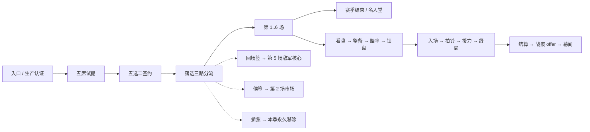

# Mode H：百战留痕（黑市鸭王杯）

<cite>
**本文档引用的文件**
- [ModeHConfig.cs](file://ModeH/ModeHConfig.cs)
- [ModeHRuntimeModule.cs](file://ModeH/ModeHRuntimeModule.cs)
- [ModeHStateMachine.cs](file://ModeH/ModeHStateMachine.cs)
- [ModeHEntry.cs](file://ModeH/ModeHEntry.cs)
- [ModeHDraftController.cs](file://ModeH/ModeHDraftController.cs)
- [ModeHEncounterPlanner.cs](file://ModeH/ModeHEncounterPlanner.cs)
- [ModeHOddsController.cs](file://ModeH/ModeHOddsController.cs)
- [ModeHVirtualStakeController.cs](file://ModeH/ModeHVirtualStakeController.cs)
- [ModeHCommandController.cs](file://ModeH/ModeHCommandController.cs)
- [ModeHCommandAdapters.cs](file://ModeH/ModeHCommandAdapters.cs)
- [ModeHCombatControl.cs](file://ModeH/ModeHCombatControl.cs)
- [ModeHCombatTelemetry.cs](file://ModeH/ModeHCombatTelemetry.cs)
- [ModeHEventRouter.cs](file://ModeH/ModeHEventRouter.cs)
- [ModeHInjuryAndScarSystem.cs](file://ModeH/ModeHInjuryAndScarSystem.cs)
- [ModeHBattleSnapshot.cs](file://ModeH/ModeHBattleSnapshot.cs)
- [ModeHHarmonyPatches.cs](file://ModeH/ModeHHarmonyPatches.cs)
- [ModeHStandInPerformer.cs](file://ModeH/ModeHStandInPerformer.cs)
- [ModeHWarehouseStakeJournal.cs](file://ModeH/ModeHWarehouseStakeJournal.cs)
- [ModeHRewardTransaction.cs](file://ModeH/ModeHRewardTransaction.cs)
- [ModeHSeasonRewardService.cs](file://ModeH/ModeHSeasonRewardService.cs)
- [ModeHTransferMarket.cs](file://ModeH/ModeHTransferMarket.cs)
- [ModeHUI.cs](file://ModeH/ModeHUI.cs)
- [ModeHLocalization.cs](file://Localization/ModeHLocalization.cs)
</cite>

## 一句话

你不是选手，是经理人。签两只斗士，看懂盘口，全场只喊一嗓子，让它们替你打完六场。

## 进入方式与前置

- 由 `ModeHInteractable` 的擂台门交互进入，走 `BossRushMapSelectionHelper` 的
  typed pending entry kind（`BossRushPendingEntryKind.ModeH`），与 Mode G 互斥。
- 需要配置项 `modeHEnabled`（ModConfig 键 `BossRush_ModeHEnabled`，默认关闭）。
- 入口页顶部**固定显示**真实资产风险行 `BossRush_ModeH_RealStakeRiskNotice`，
  不可折叠、不可关闭：本模式允许押上真实仓库物品，失败会永久没收，唯一装备也不豁免。
- 五种拒绝原因（内容未就绪、地图不支持、展示资源缺失、旧模式冲突、生产认证失败）
  各自恰好退还一张预扣船票，退款是 `ModeHEntry.TryRefundPrepaidTicket()` 的唯一实现点。

## 一季的形状



- 六场，第一幕 1/2，第二幕 3/4，第三幕 5/6；第 6 场就是冠军赛，没有第 7 场。
- 每场最多 180 秒；到时判玩家失败，不补伤害、不伪造击倒。
- 市场只有两个窗口：第 2 场后（候签）与第 4 场后（特殊敌军资格）。

## 五席试棚（§17.2）

`ModeHDraftController` 一季只生成一次五名候选，且必须同时满足：

- 覆盖突进 / 远程 / 重装 / 消耗 / 残局五种公开原型各一名；
- 至多一名稀有异常；至少两名稳定型底色；
- `stableKey` 与 `profileId` 两两不同；
- 展示顺序由 `runSeed` 固定——**关掉页面重开不会重抽**。

候选不是运行时角色实例，只是稳定 key 的公开档案。签约顺序固定为“先主将、后替补”，
剩余三席立刻以固定种子做一次 Fisher-Yates，得到回场签 / 候签 / 撕票三张去向牌。

## 敌军计划与赔率（§17.5）

`ModeHEncounterPlanner` 在玩家整备**之前**冻结敌军计划，三层叠加：

| 层 | 内容 |
| --- | --- |
| 编制骨架 | 独兽 / 双煞 / 头领与护卫 / 猎群 / 接力队 / 远近交替 / 残阵 / 回场核心 / 冠军独兽 / 后程增援 |
| 进场剧本 | 斥候先行 / 开场压上 / 后程增援 / 远近交替 / 核心压轴 / 未知席位 |
| 擂台条件 | 中央掩体 / 危险边缘 / 医疗受限 / 窄笼 / 开阔场 / 余威 |

威胁走廊按场次冻结为 `100 / 115 / 130 / 145 / 165 / 190`，同屏上限 `2 / 2 / 3 / 3 / 3 / 3`。
候选先过全局能力矩阵审计（不得同时封死五种原型），再过 roster-level veto
（存活合同选手中至少一名原型未被硬封锁）；连续 8 个候选都失败才以 `TechnicalAbort`
进入 `Recovering`——**始终至少保留一种合法排列**。

赔率是公开分差，`ModeHOddsController` 只读公开摘要与玩家当前公开整备：

```text
publicEdge = playerPublicScore - enemyPublicScore
x1: >= 20    x2: 5..19    x3: -9..4    x4: -24..-10    x5: <= -25
```

只有 `VerifiedBehavior` 的行为进入分数，`ReportOnly` 计 0 分，`Unavailable` 不得被抽取。
下注额不参与赔率计算，避免循环定价。

## 虚拟筹码（§17.5 的 2026-08-27 定价修订）

每季初始 6 点、上限 30，每场可下 `0..min(2, 余额)`，0 点始终合法。**净赔率**语义：

```text
grossVirtualPayout   = 胜利 ? stake * (1 + odds) : 0
netVirtualProfit     = gross - stake
settledBalance       = clamp(余额 + gross, 0, 30)
rewardCandidateCount = 1 + min(2, floor(max(0, net) / 2))
```

因此押满 2 点在**任何**赔率档胜利时都严格优于不下注；1 点小注只在 `x1` 档与不下注
同为 1 个候选，那是刻意保留的保守选项。失败按 `stake` 扣除余额，
余额下降后可下注额自然收紧，起步 6 点最多承受三次满额失败。

## 拍铃：全场唯一主动操作（§17.6）

赛前从可用通用口令与在场者的招牌口令中锁定**一条**，战中每场只有**一次**拍铃：

- 八条通用口令：稳住 / 压上 / 回到中间 / 清掉旁边 / 收割 / 留一手 / 护替补 / 拼了；
- 五类招牌口令：打弱点 / 钉住 / 最后一梭 / 一起上 / 交给你；
- 口令窗口 6 秒，`ModeHCommandAdapters` 以 **0.1 秒**周期重申，
  压过行为树 0.15 秒的 `TraceTarget` 重发；
- 控制点严格限于 §17.6.2 白名单；`nextReleaseSkillTimeMarker` 写入后**不还原**，
  只把所有权交还原版；
- 窗口结束、倒地、接力、技术中止、切图与 shutdown 共用同一幂等还原入口。

拍铃不暂停战斗、不弹菜单，HUD 按钮三态呈现（可用 + 口令名 / 窗口进行中 / 已消耗置灰）。

## 伤病与战痕（§17.4）

`ModeHFighterDownToken` 是唯一规范倒地事件，每个 `participantId + matchIndex` 至多一次。
只有本场**从未实际踏入擂台**的选手才算完整休息；带伤选手再次登场被击倒直接退役。

五条伤病（`leg` / `hand` / `armor` / `old_wound` / `spirit`）与八条战痕都必须落在
已验证控制点或 Mode H 自结算上，**不存在“只有文案没有战斗影响”的条目**；
任一分量对当前 key 不可用，整条就不进抽池——不允许“收益生效、代价失效”。
战痕最多三条，满三条时接受新战痕必须明确替换一条；拒绝换取稳定名声 +1（上限 99），
名声只用于展示，不影响战斗、赔率、奖励或市场。

## ERROR 完整互换（§17.6.5）

`error` 异常有几率把控制权交到玩家手上，同时选手的性格进入玩家身体在看台自行行动。
三个部件：

1. **控制权切换**复用原版 `ControlOtherCharacter(target, -1f)`，2 秒 deadline 兜底，
   并独立确认 `LevelManager.ControllingCharacter` 已切换，不只信任原版回调。
2. **解冻玩家身体**是 Mode H 首发唯一允许的 Harmony 新增：恰好两个 postfix，
   打在 `CA_ControlOtherCharacter.CanMove` 与 `CanRun` 上。
   **`CanUseHand` 与 `CanControlAim` 保持原版 `false`**——看台身体因此在引擎层面
   就无法使用武器、无法瞄准、无法手部交互。
3. **看台表演**由 `ModeHStandInPerformer` 驱动，六种底色对应六种走位模式，
   只写移动意图，半径 3 米、每 0.5 秒重设一次目标、越界拉回、连续 3 次失败停演；
   停演绝不升级为技术中止。

执行顺序不可颠倒：**先中立无敌，再解冻移动，最后启动表演**；恢复顺序为
停表演 → 清门 → 确认控制目标已还原 → 受控选手重设回 `scav` → 恢复身体 team →
恢复无敌 → 恢复位置。互换期间原版会把击杀归属改写为主角，
因此**接管期间的击杀按原版规则计入你的击杀统计与经验**，候选卡对此有明确说明。

## 战场快照与恢复（§17.4）

`ModeHBattleSnapshot` 在四类离散事件采集（每批敌军入场后 / 每 10 秒 / 拍铃后 /
倒地或接力后），只在内存构造并随下一次 Season 写入一并落盘，不额外调用 `SaveFile`。
重建走**同一个** `ModeHSpawnTransaction`，按 `healthFraction * MaxHealth` 调 `SetHealth`
并读回核对，续接计时、批次、口令窗口、战痕窗口与一次性判定。

六类 fail-closed 条件（快照缺失 / 摘要不符 / key 不再 Passed / 场次上下文不符 /
位置不可行走 / 生命读回不符）任一命中都丢弃快照，回落到“技术中止 + 同场重开”，
**绝不判负**，也绝不声称继续了原战斗。

## 真实仓库抵押（§22）

没有真实资产开关。是否押上真实物品是玩家在 `LoadoutEditing` 中的逐场自愿选择，默认不选；
不选也能完整打完六场。系统唯一会自行禁用押品的情况是只读派生结果
`ModeHWarehouseStakeJournal.IsSlotConsistent` 为假。

journal 阶段严格单向，`phase` 是唯一终态来源：

```text
None → Prepared → EscrowSnapshotDurable → EscrowRemovedDurable → MatchLocked
     → ResultCommitted → SettlementPending → Terminal
     ↘ AbortReturnCommitted → SettlementPending → RefundedTerminal
任一非终态且证据不一致 → ManualIntervention
```

`ModeHWarehouseStakeJournal` 是**唯一**真实仓库写入者；`ModeHRewardTransaction`
只生成不可变结果计划并调用 journal 的 `CommitResult/Settle`。
物品身份靠 `ModeHItemTreeNormalizer` 的语义树摘要 + 出现次数双重比对，
`Item.GetInstanceID`、TypeID 与 `LockIndex` 都**不是**所有权证明。
证据不足时优先保护资产：保持 `SettlementPending` 或转 `ManualIntervention`，
不追债、不少扣、不静默删除 journal。

## 与其它模式的边界

- 与 Mode D/E/F/G 及僵尸模式互斥；旧模式最终入口只读取
  `IsModeHRiskScanReady` 与 `IsModeHExternalAssetRiskBlocked` 两个门，
  绝不等待 H 内容或恢复壳状态。
- 隔离由 `ModeHArenaIsolationLease`（冻结原图 spawner、清理原生敌人、核对边界）
  与 `ModeHSpectatorLease`（固定获取/释放顺序的观战租约）负责。
- 额外死亡掉落抑制仍走既有的 `Patches/Combat/CharacterOnDeadPatch.cs` 扩展，
  不新增全局补丁。

## 已知待办

- 展示 AssetBundle `Assets/ui/modeh_presentation` 是 local-only 制品，
  由兄弟 Unity 工程 `Assets/Editor/ModeHPresentationBundleBuilder.cs` 生成后复制；
  未落位时入口 fail-closed，`ModeHPresentationAssetGuard` 的“bundle 存在”断言为红。
- 全部运行时结论（生成无副作用、AI 双向伤害、资源显示、存档物理落盘、无泄漏）
  只能由设计提案 §26.5 的 18 项实机 smoke 矩阵确认，静态守卫通过不等于运行时通过。
