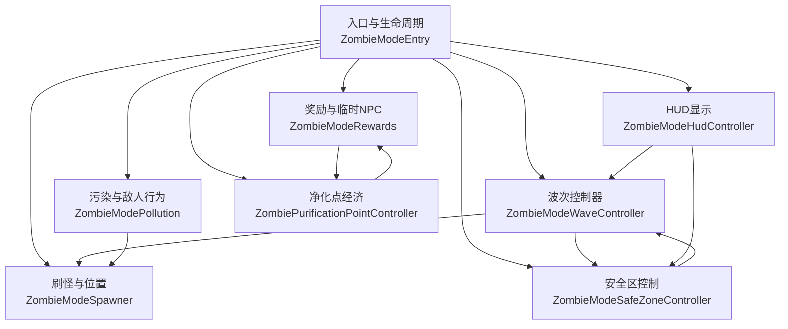
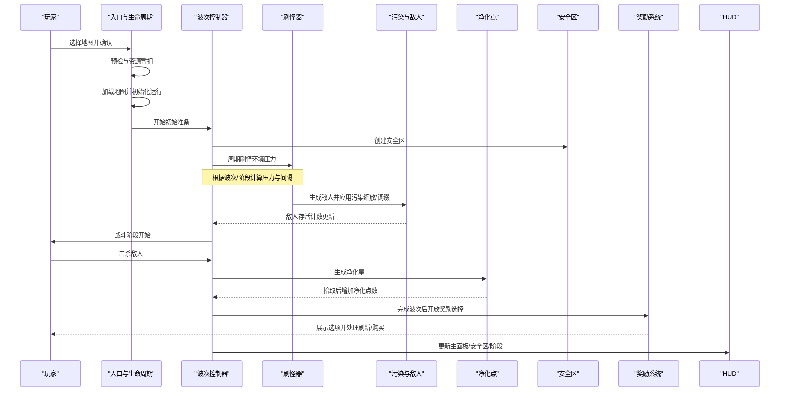
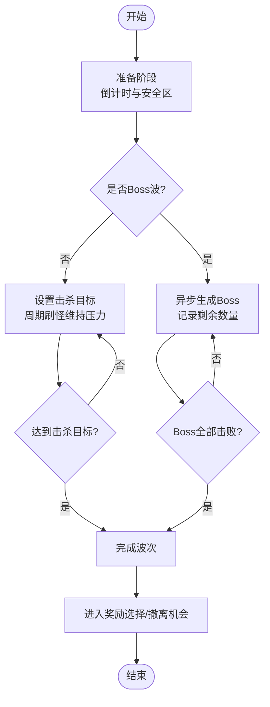
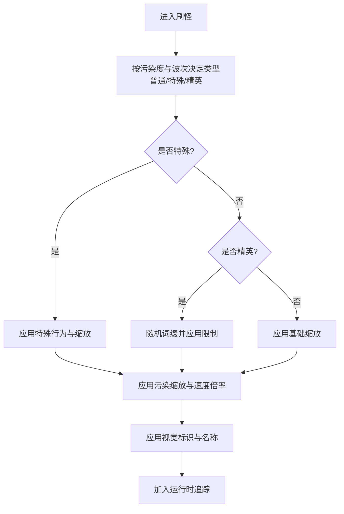
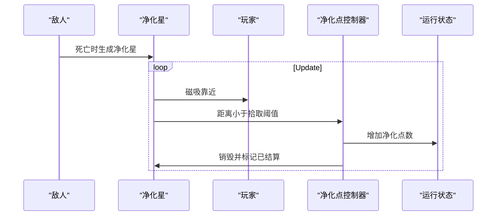
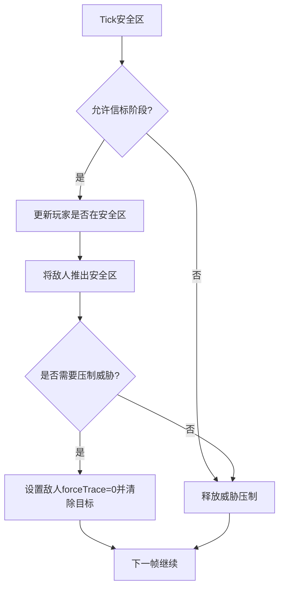
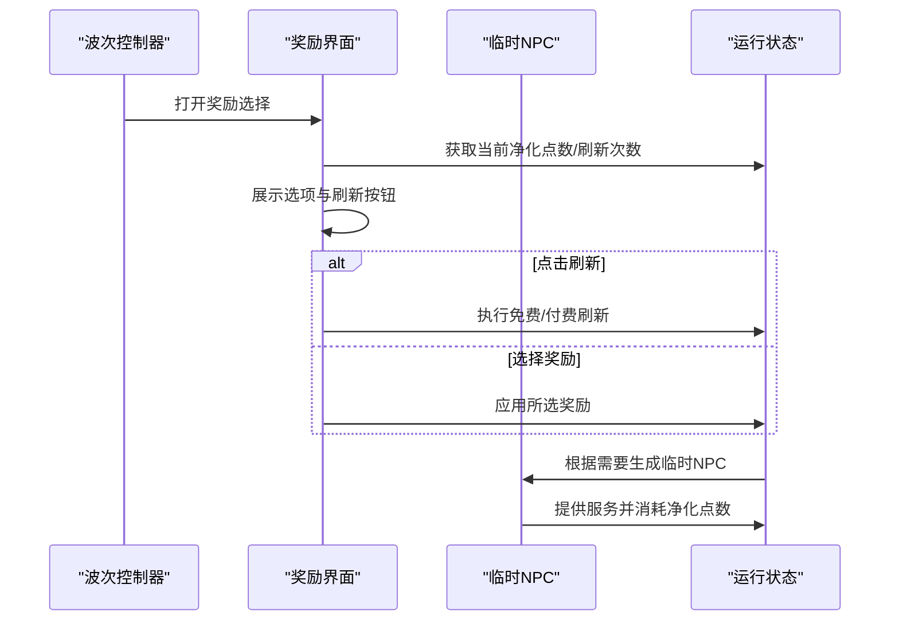
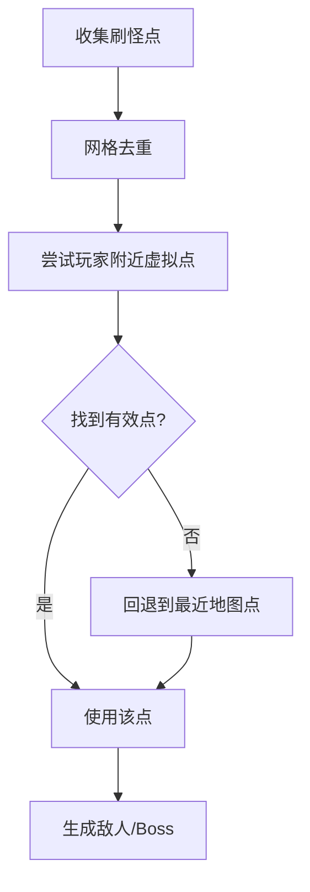
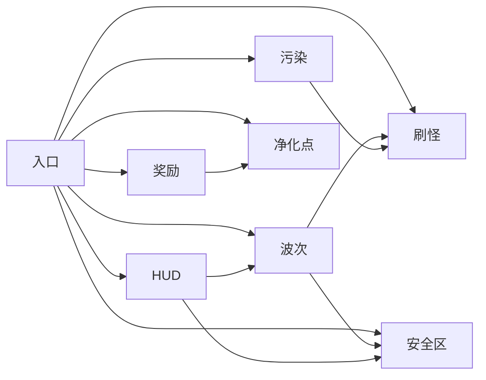

# 僵尸模式

<cite>
**本文引用的文件**
- [ZombieModeEntry.cs](file://ZombieMode/ZombieModeEntry.cs)
- [ZombieModePollution.cs](file://ZombieMode/ZombieModePollution.cs)
- [ZombieModeWaveController.cs](file://ZombieMode/ZombieModeWaveController.cs)
- [ZombiePurificationPointController.cs](file://ZombieMode/ZombiePurificationPointController.cs)
- [ZombieModeSafeZoneController.cs](file://ZombieMode/ZombieModeSafeZoneController.cs)
- [ZombieModeModels.cs](file://ZombieMode/ZombieModeModels.cs)
- [ZombieModeTuning.cs](file://ZombieMode/ZombieModeTuning.cs)
- [ZombieModeSpawner.cs](file://ZombieMode/ZombieModeSpawner.cs)
- [ZombieModeRewards.cs](file://ZombieMode/ZombieModeRewards.cs)
- [ZombieModeHudController.cs](file://ZombieMode/ZombieModeHudController.cs)
</cite>

## 目录
1. [简介](#简介)
2. [项目结构](#项目结构)
3. [核心组件](#核心组件)
4. [架构总览](#架构总览)
5. [详细组件分析](#详细组件分析)
6. [依赖关系分析](#依赖关系分析)
7. [性能与调优](#性能与调优)
8. [故障排查指南](#故障排查指南)
9. [结论](#结论)
10. [附录：玩法、策略与配置](#附录玩法策略与配置)

## 简介
本文件面向“丧尸生存模式”的系统设计、数值与实现要点，覆盖污染系统、净化点经济、波次控制器、安全区管理、奖励系统、敌人行为模式、生存挑战、资源管理与策略规划。文档以代码为依据，提供流程图与时序图帮助理解关键流程，并给出可操作的调参与集成建议。

## 项目结构
丧尸模式由多个职责清晰的模块组成：
- 入口与生命周期：负责入场校验、资源暂扣、地图加载、运行期状态机推进。
- 波次控制器：负责准备阶段、战斗阶段、环境压力、刷怪节奏、Boss 波调度。
- 污染与敌人：根据污染度调整敌人生成权重、词缀、属性缩放与视觉标识。
- 净化点经济：击杀掉落净化星，自动磁吸拾取，转化为净化点数用于刷新与交易。
- 安全区：周期性刷新、玩家进入保护、破隐机制、威胁压制与驱逐。
- 奖励系统：节点式选择界面、免费/付费刷新、临时 NPC 服务（商人/护士）。
- HUD：主面板、安全区面板、阶段面板，按节流刷新降低 UI 开销。
- 配置与模型：统一数值常量、枚举与运行时状态对象。

图表来源
- [ZombieModeEntry.cs:147-439](file://ZombieMode/ZombieModeEntry.cs#L147-L439)
- [ZombieModeWaveController.cs:278-376](file://ZombieMode/ZombieModeWaveController.cs#L278-L376)
- [ZombieModeSpawner.cs:18-44](file://ZombieMode/ZombieModeSpawner.cs#L18-L44)
- [ZombieModePollution.cs:362-415](file://ZombieMode/ZombieModePollution.cs#L362-L415)
- [ZombiePurificationPointController.cs:214-297](file://ZombieMode/ZombiePurificationPointController.cs#L214-L297)
- [ZombieModeSafeZoneController.cs:9-39](file://ZombieMode/ZombieModeSafeZoneController.cs#L9-L39)
- [ZombieModeRewards.cs:28-190](file://ZombieMode/ZombieModeRewards.cs#L28-L190)
- [ZombieModeHudController.cs:26-71](file://ZombieMode/ZombieModeHudController.cs#L26-L71)

章节来源
- [ZombieModeEntry.cs:147-439](file://ZombieMode/ZombieModeEntry.cs#L147-L439)
- [ZombieModeTuning.cs:44-154](file://ZombieMode/ZombieModeTuning.cs#L44-L154)

## 核心组件
- 入口与生命周期：入场预检、资源暂扣、地图加载、运行初始化、暂停/恢复时间轴、失败回滚。
- 波次控制器：准备倒计时、战斗阶段、周期刷怪、目标击杀数、Boss 波、撤离机会。
- 污染系统：污染度影响精英/特殊敌人权重、词缀解锁层级、敌人属性缩放、视觉标识。
- 净化点经济：击杀掉落净化星，磁吸+距离拾取，累计为净化点数；用于刷新选项与临时 NPC 服务。
- 安全区：每波生成安全区，玩家进入时抑制威胁；在安全区内用枪械/近战攻击会破隐，持续至下一波。
- 奖励系统：节点式奖励选择，支持免费/付费刷新；临时商人/护士提供装备、补给、保险等。
- HUD：三面板（主信息、安全区状态、阶段提示），文本节流刷新。

章节来源
- [ZombieModeEntry.cs:494-515](file://ZombieMode/ZombieModeEntry.cs#L494-L515)
- [ZombieModeWaveController.cs:312-376](file://ZombieMode/ZombieModeWaveController.cs#L312-L376)
- [ZombieModePollution.cs:578-645](file://ZombieMode/ZombieModePollution.cs#L578-L645)
- [ZombiePurificationPointController.cs:50-114](file://ZombieMode/ZombiePurificationPointController.cs#L50-L114)
- [ZombieModeSafeZoneController.cs:41-75](file://ZombieMode/ZombieModeSafeZoneController.cs#L41-L75)
- [ZombieModeRewards.cs:28-190](file://ZombieMode/ZombieModeRewards.cs#L28-L190)
- [ZombieModeHudController.cs:26-71](file://ZombieMode/ZombieModeHudController.cs#L26-L71)

## 架构总览
丧尸模式采用“事件驱动 + 状态机”的架构：
- 全局事件监听：伤害/死亡事件触发波次计数、净化星生成、Boss 结算。
- 运行期状态机：生命周期阶段（SelectingMap → Active → Exiting）与战斗阶段（Preparation → Combat → RewardSelection）。
- 子系统解耦：波次、污染、安全区、奖励、HUD 通过共享状态与配置交互，避免紧耦合。

图表来源
- [ZombieModeEntry.cs:147-439](file://ZombieMode/ZombieModeEntry.cs#L147-L439)
- [ZombieModeWaveController.cs:278-376](file://ZombieMode/ZombieModeWaveController.cs#L278-L376)
- [ZombieModeSpawner.cs:305-405](file://ZombieMode/ZombieModeSpawner.cs#L305-L405)
- [ZombieModePollution.cs:362-415](file://ZombieMode/ZombieModePollution.cs#L362-L415)
- [ZombiePurificationPointController.cs:214-297](file://ZombieMode/ZombiePurificationPointController.cs#L214-L297)
- [ZombieModeRewards.cs:28-190](file://ZombieMode/ZombieModeRewards.cs#L28-L190)
- [ZombieModeHudController.cs:26-71](file://ZombieMode/ZombieModeHudController.cs#L26-L71)

## 详细组件分析

### 波次控制器
- 准备阶段：倒计时、生成安全区、清理附近敌人、确保环境压力。
- 战斗阶段：设置击杀目标或 Boss 数量，周期刷怪维持压力，Boss 波异步生成。
- 结算阶段：完成波次后进入奖励选择或撤离机会。

图表来源
- [ZombieModeWaveController.cs:278-376](file://ZombieMode/ZombieModeWaveController.cs#L278-L376)
- [ZombieModeWaveController.cs:388-441](file://ZombieMode/ZombieModeWaveController.cs#L388-L441)
- [ZombieModeWaveController.cs:443-507](file://ZombieMode/ZombieModeWaveController.cs#L443-L507)

章节来源
- [ZombieModeWaveController.cs:278-376](file://ZombieMode/ZombieModeWaveController.cs#L278-L376)
- [ZombieModeWaveController.cs:388-441](file://ZombieMode/ZombieModeWaveController.cs#L388-L441)
- [ZombieModeWaveController.cs:443-507](file://ZombieMode/ZombieModeWaveController.cs#L443-L507)

### 污染系统与敌人行为
- 污染度影响精英/特殊敌人权重与词缀解锁层级。
- 敌人属性随污染度线性缩放（生命/伤害），速度受波次倍率影响。
- 特殊敌人具备专属行为（冲刺、爆炸、瘟疫云、召唤、骚扰）。
- 精英敌人拥有词缀组合（护盾、再生、分裂、毒雾等），存在组合限制与高威胁视觉增强。

图表来源
- [ZombieModePollution.cs:362-415](file://ZombieMode/ZombieModePollution.cs#L362-L415)
- [ZombieModePollution.cs:417-435](file://ZombieMode/ZombieModePollution.cs#L417-L435)
- [ZombieModePollution.cs:464-521](file://ZombieMode/ZombieModePollution.cs#L464-L521)
- [ZombieModePollution.cs:578-645](file://ZombieMode/ZombieModePollution.cs#L578-L645)
- [ZombieModePollution.cs:647-795](file://ZombieMode/ZombieModePollution.cs#L647-L795)

章节来源
- [ZombieModePollution.cs:362-415](file://ZombieMode/ZombieModePollution.cs#L362-L415)
- [ZombieModePollution.cs:417-435](file://ZombieMode/ZombieModePollution.cs#L417-L435)
- [ZombieModePollution.cs:464-521](file://ZombieMode/ZombieModePollution.cs#L464-L521)
- [ZombieModePollution.cs:578-645](file://ZombieMode/ZombieModePollution.cs#L578-L645)
- [ZombieModePollution.cs:647-795](file://ZombieMode/ZombieModePollution.cs#L647-L795)

### 净化点经济
- 击杀掉落净化星，具有磁吸半径与拾取距离。
- 自动收集超时回收，避免滞留。
- 拾取后增加净化点数，用于刷新奖励与临时 NPC 服务。

图表来源
- [ZombiePurificationPointController.cs:50-114](file://ZombieMode/ZombiePurificationPointController.cs#L50-L114)
- [ZombiePurificationPointController.cs:214-297](file://ZombieMode/ZombiePurificationPointController.cs#L214-L297)
- [ZombiePurificationPointController.cs:350-375](file://ZombieMode/ZombiePurificationPointController.cs#L350-L375)

章节来源
- [ZombiePurificationPointController.cs:50-114](file://ZombieMode/ZombiePurificationPointController.cs#L50-L114)
- [ZombiePurificationPointController.cs:214-297](file://ZombieMode/ZombiePurificationPointController.cs#L214-L297)
- [ZombiePurificationPointController.cs:350-375](file://ZombieMode/ZombiePurificationPointController.cs#L350-L375)

### 安全区管理
- 每波开始时创建安全区，周期性检查玩家位置与威胁压制。
- 玩家在安全区内且未破隐时，敌人被推离并抑制仇恨。
- 在安全区内使用枪械/近战攻击会破隐，直到下一波重置。

图表来源
- [ZombieModeSafeZoneController.cs:9-39](file://ZombieMode/ZombieModeSafeZoneController.cs#L9-L39)
- [ZombieModeSafeZoneController.cs:41-75](file://ZombieMode/ZombieModeSafeZoneController.cs#L41-L75)
- [ZombieModeSafeZoneController.cs:77-161](file://ZombieMode/ZombieModeSafeZoneController.cs#L77-L161)
- [ZombieModeSafeZoneController.cs:163-266](file://ZombieMode/ZombieModeSafeZoneController.cs#L163-L266)

章节来源
- [ZombieModeSafeZoneController.cs:9-39](file://ZombieMode/ZombieModeSafeZoneController.cs#L9-L39)
- [ZombieModeSafeZoneController.cs:41-75](file://ZombieMode/ZombieModeSafeZoneController.cs#L41-L75)
- [ZombieModeSafeZoneController.cs:77-161](file://ZombieMode/ZombieModeSafeZoneController.cs#L77-L161)
- [ZombieModeSafeZoneController.cs:163-266](file://ZombieMode/ZombieModeSafeZoneController.cs#L163-L266)

### 奖励系统与临时NPC
- 奖励节点：普通波与Boss波分别提供不同数量的选项。
- 刷新机制：免费刷新上限与付费刷新成本递增。
- 临时NPC：商人提供装备库存，护士提供治疗/强化服务，均使用净化点数支付。

图表来源
- [ZombieModeRewards.cs:28-190](file://ZombieMode/ZombieModeRewards.cs#L28-L190)
- [ZombieModeRewards.cs:297-382](file://ZombieMode/ZombieModeRewards.cs#L297-L382)
- [ZombieModeRewards.cs:384-726](file://ZombieMode/ZombieModeRewards.cs#L384-L726)

章节来源
- [ZombieModeRewards.cs:28-190](file://ZombieMode/ZombieModeRewards.cs#L28-L190)
- [ZombieModeRewards.cs:297-382](file://ZombieMode/ZombieModeRewards.cs#L297-L382)
- [ZombieModeRewards.cs:384-726](file://ZombieMode/ZombieModeRewards.cs#L384-L726)

### 刷怪与位置选择
- 收集地图静态刷怪点与缓存的原生刷怪点，去重网格化避免重复。
- 优先选择远离玩家的虚拟环位，其次最近的有效地图点。
- Boss 波分散生成，避免重叠。

图表来源
- [ZombieModeSpawner.cs:18-44](file://ZombieMode/ZombieModeSpawner.cs#L18-L44)
- [ZombieModeSpawner.cs:81-148](file://ZombieMode/ZombieModeSpawner.cs#L81-L148)
- [ZombieModeSpawner.cs:150-191](file://ZombieMode/ZombieModeSpawner.cs#L150-L191)
- [ZombieModeSpawner.cs:193-253](file://ZombieMode/ZombieModeSpawner.cs#L193-L253)
- [ZombieModeSpawner.cs:255-303](file://ZombieMode/ZombieModeSpawner.cs#L255-L303)
- [ZombieModeSpawner.cs:588-614](file://ZombieMode/ZombieModeSpawner.cs#L588-L614)

章节来源
- [ZombieModeSpawner.cs:18-44](file://ZombieMode/ZombieModeSpawner.cs#L18-L44)
- [ZombieModeSpawner.cs:81-148](file://ZombieMode/ZombieModeSpawner.cs#L81-L148)
- [ZombieModeSpawner.cs:150-191](file://ZombieMode/ZombieModeSpawner.cs#L150-L191)
- [ZombieModeSpawner.cs:193-253](file://ZombieMode/ZombieModeSpawner.cs#L193-L253)
- [ZombieModeSpawner.cs:255-303](file://ZombieMode/ZombieModeSpawner.cs#L255-L303)
- [ZombieModeSpawner.cs:588-614](file://ZombieMode/ZombieModeSpawner.cs#L588-L614)

### HUD显示
- 主面板：波次、污染等级、净化点数、压力、击杀进度、下一Boss提示。
- 安全区面板：是否在安全区、隐匿状态、准备倒计时。
- 阶段面板：当前阶段、信标可用、撤离提示。

章节来源
- [ZombieModeHudController.cs:26-71](file://ZombieMode/ZombieModeHudController.cs#L26-L71)
- [ZombieModeHudController.cs:143-187](file://ZombieMode/ZombieModeHudController.cs#L143-L187)
- [ZombieModeHudController.cs:221-292](file://ZombieMode/ZombieModeHudController.cs#L221-L292)
- [ZombieModeHudController.cs:300-515](file://ZombieMode/ZombieModeHudController.cs#L300-L515)

## 依赖关系分析
- 入口依赖波次控制器、刷怪器、污染系统、奖励系统、安全区、净化点、HUD。
- 波次控制器依赖刷怪器与安全区，同时驱动奖励系统。
- 污染系统影响刷怪器生成的敌人类型与属性。
- 净化点经济驱动奖励系统与临时NPC服务。
- HUD读取运行状态与波次/安全区信息。

图表来源
- [ZombieModeEntry.cs:494-515](file://ZombieMode/ZombieModeEntry.cs#L494-L515)
- [ZombieModeWaveController.cs:312-376](file://ZombieMode/ZombieModeWaveController.cs#L312-L376)
- [ZombieModeSpawner.cs:305-405](file://ZombieMode/ZombieModeSpawner.cs#L305-L405)
- [ZombieModePollution.cs:362-415](file://ZombieMode/ZombieModePollution.cs#L362-L415)
- [ZombiePurificationPointController.cs:214-297](file://ZombieMode/ZombiePurificationPointController.cs#L214-L297)
- [ZombieModeRewards.cs:28-190](file://ZombieMode/ZombieModeRewards.cs#L28-L190)
- [ZombieModeHudController.cs:26-71](file://ZombieMode/ZombieModeHudController.cs#L26-L71)

章节来源
- [ZombieModeEntry.cs:494-515](file://ZombieMode/ZombieModeEntry.cs#L494-L515)
- [ZombieModeWaveController.cs:312-376](file://ZombieMode/ZombieModeWaveController.cs#L312-L376)
- [ZombieModeSpawner.cs:305-405](file://ZombieMode/ZombieModeSpawner.cs#L305-L405)
- [ZombieModePollution.cs:362-415](file://ZombieMode/ZombieModePollution.cs#L362-L415)
- [ZombiePurificationPointController.cs:214-297](file://ZombieMode/ZombiePurificationPointController.cs#L214-L297)
- [ZombieModeRewards.cs:28-190](file://ZombieMode/ZombieModeRewards.cs#L28-L190)
- [ZombieModeHudController.cs:26-71](file://ZombieMode/ZombieModeHudController.cs#L26-L71)

## 性能与调优
- 事件热路径优化：非丧尸模式敌人直接早返，避免 marker 查询。
- 视觉对象复用：平面区域 visual 共享 mesh/material，减少 GC 与物理初始化。
- 刷新节流：HUD 文本按固定间隔刷新，避免每帧字符串拼接。
- 刷怪去重：网格化去重避免重复刷怪点。
- 净化点磁吸：缓存玩家 Transform，减少查找开销。

章节来源
- [ZombieModeWaveController.cs:51-71](file://ZombieMode/ZombieModeWaveController.cs#L51-L71)
- [ZombieModePollution.cs:64-121](file://ZombieMode/ZombieModePollution.cs#L64-L121)
- [ZombieModeHudController.cs:414-451](file://ZombieMode/ZombieModeHudController.cs#L414-L451)
- [ZombieModeSpawner.cs:81-148](file://ZombieMode/ZombieModeSpawner.cs#L81-L148)
- [ZombiePurificationPointController.cs:127-137](file://ZombieMode/ZombiePurificationPointController.cs#L127-L137)

## 故障排查指南
- 入场失败：检查邀请函与现金扣除逻辑，确认失败原因与回滚路径。
- 地图加载异常：等待目标场景激活与初始化完成，失败则清理并返回。
- 刷怪失败：检查刷怪点收集与虚拟点回退，必要时回退到玩家位置。
- 安全区失效：确认阶段允许信标、玩家位置检测与威胁压制逻辑。
- 净化点不拾取：检查磁吸半径与拾取距离，确认控制器初始化与运行状态。
- 奖励界面卡住：确认输入租赁与关闭逻辑，避免模态阻塞。

章节来源
- [ZombieModeEntry.cs:147-240](file://ZombieMode/ZombieModeEntry.cs#L147-L240)
- [ZombieModeEntry.cs:275-357](file://ZombieMode/ZombieModeEntry.cs#L275-L357)
- [ZombieModeEntry.cs:699-741](file://ZombieMode/ZombieModeEntry.cs#L699-L741)
- [ZombieModeSpawner.cs:18-44](file://ZombieMode/ZombieModeSpawner.cs#L18-L44)
- [ZombieModeSafeZoneController.cs:9-39](file://ZombieMode/ZombieModeSafeZoneController.cs#L9-L39)
- [ZombiePurificationPointController.cs:50-114](file://ZombieMode/ZombiePurificationPointController.cs#L50-L114)
- [ZombieModeRewards.cs:277-294](file://ZombieMode/ZombieModeRewards.cs#L277-L294)

## 结论
丧尸模式通过清晰的状态机与模块化设计，实现了污染驱动的敌人生态、净化点经济循环、安全区保护与波次压力控制。数值集中在配置层，便于调参与扩展。建议在后续迭代中继续优化事件热路径、视觉对象复用与刷怪去重，以提升稳定性与性能。

## 附录：玩法、策略与配置
- 生存技巧
  - 利用安全区规避伤害，谨慎在安全区内攻击以免破隐。
  - 优先击杀特殊/精英敌人以获取更多净化点数。
  - 合理刷新奖励，关注下一波预览以调整策略。
- 资源管理
  - 净化点数用于刷新选项与临时 NPC 服务，注意成本控制。
  - 现金投资可转换为初始净化点数，提升开局资源。
- 策略规划
  - 前期注重生存与净化点数积累，后期应对 Boss 波与高污染压力。
  - 结合词缀与敌人行为，选择合适的武器与走位。
- 配置调优
  - 调整波次压力、刷怪间隔、安全区半径与净化点价值以平衡难度。
  - 修改污染缩放系数与词缀解锁层级以改变敌人强度曲线。
- 模组集成
  - 通过事件监听与状态接口接入自定义奖励或敌人行为。
  - 使用统一配置常量扩展新词缀或 Boss 类型。

章节来源
- [ZombieModeWaveController.cs:312-376](file://ZombieMode/ZombieModeWaveController.cs#L312-L376)
- [ZombieModePollution.cs:362-415](file://ZombieMode/ZombieModePollution.cs#L362-L415)
- [ZombieModeTuning.cs:44-154](file://ZombieMode/ZombieModeTuning.cs#L44-L154)
- [ZombieModeRewards.cs:28-190](file://ZombieMode/ZombieModeRewards.cs#L28-L190)
- [ZombieModeHudController.cs:26-71](file://ZombieMode/ZombieModeHudController.cs#L26-L71)