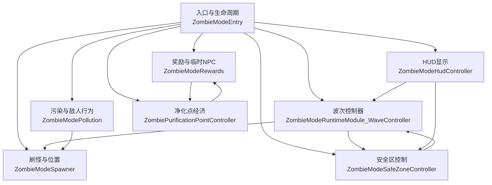
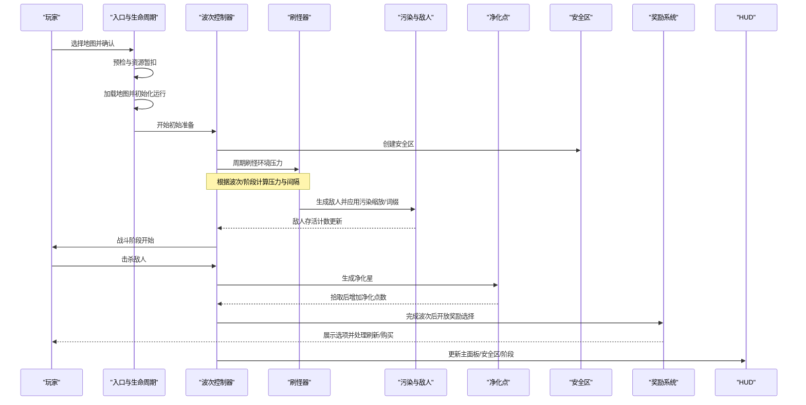
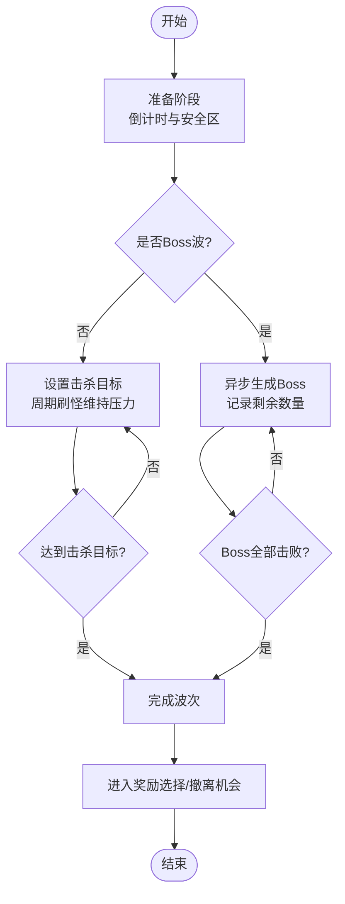
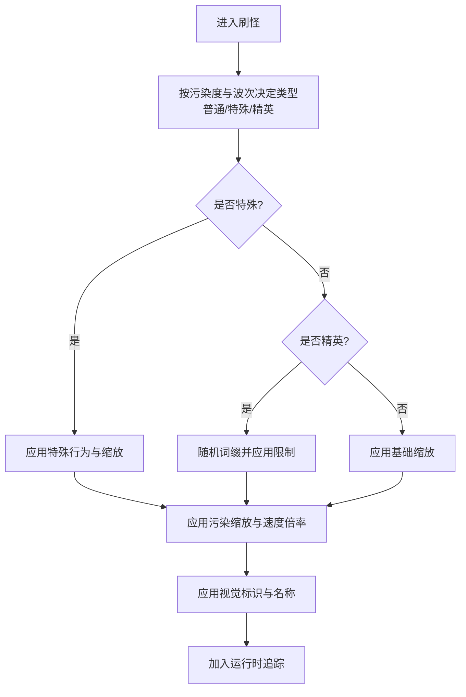
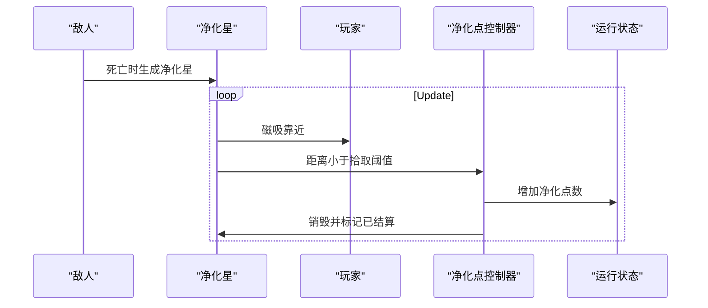
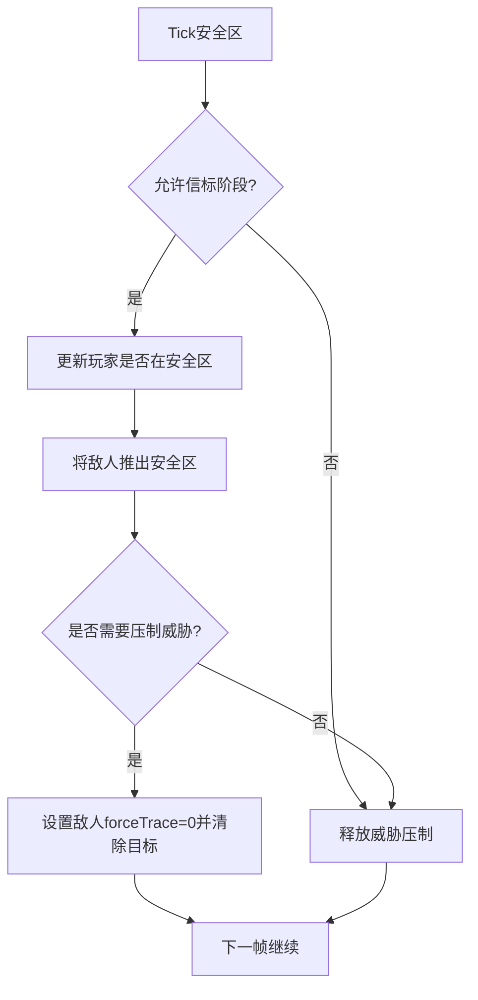
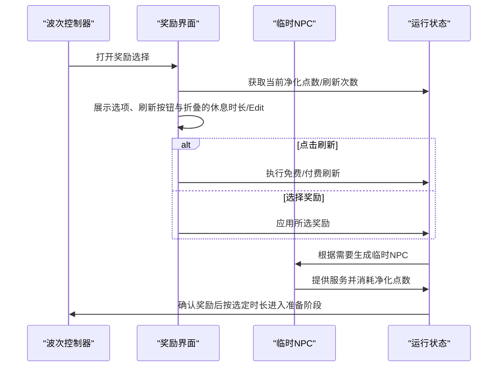
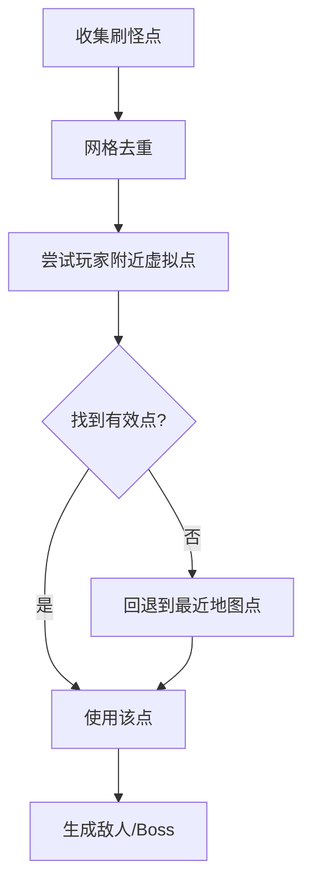
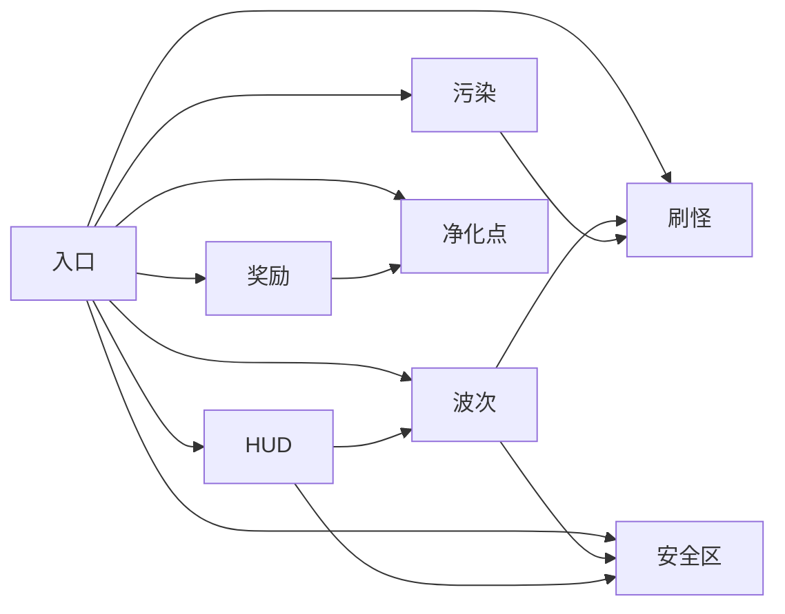

# 僵尸模式

## 运行时 Tick 与暂停时钟归属（2026-09-24，COMPAT）

`ZombieModeRuntimeModule` 持有局状态、入场事务、道具生成候选缓存与局内 Tick，并执行暂停判据及按 `unscaledTime` 累计的时钟。宿主 `TickZombieMode` 和暂停 API 保留兼容转发；原控制器调用顺序、传入的 `deltaTime`、模态与官方暂停门维持不变。`AuditModeLifecycle` 直接抽取生产模块 Tick 和暂停方法，验证暂停期间不推进局内时钟、恢复时不补计暂停时长、无活动局时重置。奖励目录、选项生成、刷新与选择也已迁入模块；效果发放和临时 NPC 服务也由模块奖励 partial 执行，RunOnly 记录由模块持有。

## 污染与敌人行为叶子迁入（2026-09-25，COMPAT）

污染叶子的宿主业务状态、调优与词缀方法、特殊 / 精英运行时技能、区域伤害及技能协程现由已注册的 `ZombieModeRuntimeModule` partial 执行：视觉逻辑在 `ZombieModeRuntimeModule_Pollution.cs`，权重、属性和受击逻辑在 `ZombieModeRuntimeModule_PollutionTuning.cs`，技能与区域效果在 `ZombieModeRuntimeModule_PollutionSkills.cs`。`ZombieModeCombatHostBridge.cs` 与 `ZombieModeCombatHostBridge.cs` 保留旧签名的兼容转发，以及与刷怪器和场景协程衔接的窄桥；波次阶段判断、运行时钟、随机采样顺序和协程 yield 点沿用迁移前流程。相关守卫直接检查模块方法体，`AffixCombat` 从技能模块抽取原生爆炸实现验证调度、暂停和兜底路径。

## 奖励目录与局内选择叶子迁入（2026-09-25，COMPAT）

奖励目录构建、按类别加权抽取、早期保底选项、选项展示文本、节点创建、免费 / 付费刷新、选择结算和净化点数扣退由 `ZombieModeRuntimeModule_RewardCatalogAndSelection.cs` 执行。当前节点、剩余选择次数、刷新余额与付费刷新序号继续存放在模块持有的 `ZombieModeRunState`；目录列表仍是每次抽取时临时构建的局部对象。模块沿用原 `Random.Range` 调用位置与循环顺序、分类权重、保底条件和所有奖励键 / 数值；选择发放失败时保留节点，Boss 追加选择只在奖励成功后扣减并重抽，常规选择仍先结算，再进入撤离机会或准备阶段，并按原序生成临时 NPC。宿主 `ZombieModeRewardHostBridge.cs` 保留旧公开入口转发；奖励效果、金额计算、临时 NPC 和面板创建 / 重排现由模块 partial 在原位置直接调用。相关守卫现在直接读模块实际方法体，覆盖候选目录、权重、刷新扣点与选择事务。

## 波次控制器迁入运行模块（2026-09-25，COMPAT）

准备与战斗阶段推进、环境丧尸压力、击杀目标、Boss 波调度、死亡事件处理、净化星生成和波次结算现由 `ZombieModeRuntimeModule_WaveController.cs` 执行。`ZombieModeRunState` 仍由 `ZombieModeRuntimeModule` 持有；事件委托也由模块登记到 RunOnly 清理通道。宿主 `ZombieModeCombatHostBridge.cs` 保留旧入口的兼容转发；刷怪、净化点和附近安全区敌人清理由模块直接调用。

Tick 仍按既有模块调度顺序接收原 `deltaTime`。迁移保持 runId 校验、定时来源、随机调用位置、异步 `UniTask.Yield()` 与结算协程 `yield return null` 的位置和次数。波次压力、暂停门、生成阶段谓词、死亡计数和掉落顺序的守卫现在检查模块实际方法体。

## 安全区与敌人空间查询归属（2026-09-25，COMPAT）

`ZombieModeSafeZoneController.cs` 的业务 partial 已归 `ZombieModeRuntimeModule`，包含两槽位置与边界判断、周期驱逐、威胁距离保存 / 恢复、射击事件订阅及两种附近敌人清理。文件中的 `ZombieModeSafeZoneController` 仍是按实例保存 RunId 的 Unity 组件。`ZombieModeRuntimeModule_EnemyRuntime.cs` 持有可复用敌人查询缓冲区，并执行 RunOnly marker 收集、Owner / AI 缓存、主角索敌、重力牵引和最近目标选择；波次、Boss、撤离与 HUD 在原调用位置直接使用模块方法，宿主保留未迁调用方需要的转发。

安全区 Tick 继续使用原 `Time.unscaledTime` 节流，并先计算抑制条件再驱逐。新部署清理保持先注销敌人身份，再调用绑定的恢复监控注销入口、减少存活计数、停用并销毁对象，最后剪枝 RunOnly 记录；Boss 只驱逐，波次击杀目标不变。射击订阅标记归模块实例，并由原 RunOnly 回调退订和重置。`ZombieModeSafeZoneRuntime` 直接编译生产安全区与调优文件，抽取生产空间查询和记录管理方法，覆盖双槽边界、威胁恢复、销毁顺序、跨 run 隔离及订阅幂等；真实导航、枪械命中与切图仍需游戏内验收。

## 奖励执行、掉落与临时 NPC 归属（2026-09-25，COMPAT）

奖励应用、属性 / 弹道 / 战场 / 触发效果、保险结算、商店与医疗服务、普通和 Boss 掉落、容器补货及临时 NPC 创建 / 回收现由 ZombieModeRuntimeModule 的既有奖励与掉落文件执行。ZombieModeRewardEffects.cs 中的健康订阅、手持订阅、散射快照与清理标记，以及 ZombieModeDropsAndPerformance.cs 中的拾取扫描时间归模块实例。原 Unity 组件保留在同文件；宿主旧接口集中于 ZombieModeRewardHostBridge.cs 向下转发。

ZombieModeRewards.cs 接管候选标签、品质筛选、候选缓存算法和奖励面板创建；ZombieModeRewardItemGrants.cs 接管共用弹药 / 道具辅助；ZombieModeBackpackJunkRecycle.cs 的业务 partial 归模块。原缓存对象仍由已有挂载流程接管。NPC 创建只接收资源解析与 Courier 交互两个窄依赖：原资源加载成功后读取 prefab，每个原调用点只解析一次，再按原顺序实例化和接线。模块内部的选择、波次、撤离与清理路径直接调用这些方法。

本次保持原随机调用、等待帧、时间源、数值和失败处理。服务先扣点，发放失败退回净化点，成功后才扣库存 / 使用次数；属性与奖励清理仍先于 RunId 失效；NPC 服务关闭、RunOnly 回调和销毁顺序不变。ZombieModeRewardRuntime 抽取生产字段和方法验证服务事务、事件 owner、资源调用次数及 NPC 回收；RuntimeOwnership、AffixCombat 与 AuditModeLifecycle 继续执行生产掉落归属、爆炸和生命周期逻辑。真实物品树、碰撞、商店界面和切图仍待 L3。

## 刷怪、开局与地图隔离归属（2026-09-25，SAFE）

`ZombieModeSpawner.cs`、`ZombieModeEntry_StarterLoadout.cs`、`ZombieModeMapIsolation.cs`，以及现金与净化点文件中的业务 partial 均归已有 `ZombieModeRuntimeModule`。模块持有刷怪点去重网格和原版地图对象隔离记录，负责异步刷怪、暂停等待、开局发放、现金校验、SoulCube 查询缓存与净化星结算。视觉缩放恢复和脚标回收归 `ZombieModeRuntimeModule_EnemyRuntime.cs`；同文件 Unity 组件和现金弹窗视图保留原实现，宿主公开入口继续转发。

刷怪仍在原位置调用共享 `SpawnEnemyCore`，保留 runId / 阶段门、名额预占与一次释放、暂停回调销毁后重试、随机采样与 Boss 生命周期登记顺序。开局仍先完成武器、保底治疗、弹药和防具发放，再确认资源并进入 Active；现金校验失败保留旧选择。地图隔离按预缓存、刷怪器、撤离点、角色的顺序执行，恢复按角色、刷怪状态、撤离点的顺序执行。净化星逆序结算，失效 run 只清记录、不加点；SoulCube 未命中缓存沿用，视觉清理保留 destroyed-null 容错。

环境桥只提供原缓存数组、缓存场景名、刷怪器重置 / 禁用和恢复锚点登记的原始单语句；NPC 场景判定继续传入原宿主 `owner`。`ZombieModeSpawnRuntime` 抽取生产异步方法验证暂停、名额、随机 / 登记顺序和敌对兜底；`ZombieModeStarterRuntime` 验证发放失败、现金、净化结算、隔离与视觉清理。两者属于 L2，导航、真实物品树、UI 和跨场景表现仍需 L3 验收。

## 追加爆炸与局内清理（2026-09-17，COMPAT）

暴击爆发、末日脉冲、特殊 / 精英 / Boss 死亡爆炸共用 `ZombieModeRuntimeModule.DeferExplosion`：先让出一帧，离开原始 Hurt / Dead 调用栈，再检查原局、关卡和主角身份 / 存活。暂停时等待；局内清理通过既有 `RunOnlyObjects` 停协程，完成 / 取消 / 调度失败即移除记录。没有另建队列或常驻 Update。末日脉冲的入口校验、三次几何计算与爆炸调度都归模块，范围 / 伤害 / 触发计数不变。

玩家光环与弹道尾迹按效果来源结算，不冒充直接命中；禁止自伤的玩家区域效果在官方接口失败时也不会回退为打自己。敌方技能保留原来源、阵营与 player-only 后备。`AffixCombat` 链接真实模块和逐字入口，覆盖暂停 / 取消、批量反向清理、持续触发不积累记录与参数保留；不代表物理、特效或帧时间已经过实机。

## 掉落回收归属保护（2026-09-05，COMPAT）

普通掉落候选的全表拾取扫描仍按一秒间隔执行，但任何达到回收条件的候选在销毁前都会进行本帧背包/装备槽归属检查。已被玩家拾取的物品仅注销清理记录，不销毁物品；未到期候选不会因此增加逐帧组件扫描。可见掉落 agent 与 Item 根对象的位置不同，所以距玩家 5 米的保护区不能代替所有权判定。Boss/高价值豁免、回收时间和下一波规则保持原值。

章节来源：`ZombieMode/ZombieModeDropsAndPerformance.cs`、`ZombieMode/ZombieModeTuning.cs`。`tests/fixtures/RuntimeOwnership` 用生产方法覆盖扫描间隔、背包/槽位与到期回收边界；仍需游戏内拾取 smoke。

<cite>
**本文引用的文件**
- [ZombieModeEntryHostBridge.cs](file://ZombieMode/ZombieModeEntryHostBridge.cs)
- [ZombieModeCombatHostBridge.cs](file://ZombieMode/ZombieModeCombatHostBridge.cs)
- [ZombieModeRuntimeModule_Pollution.cs](file://ZombieMode/ZombieModeRuntimeModule_Pollution.cs)
- [ZombieModeRuntimeModule_PollutionTuning.cs](file://ZombieMode/ZombieModeRuntimeModule_PollutionTuning.cs)
- [ZombieModeRuntimeModule_PollutionSkills.cs](file://ZombieMode/ZombieModeRuntimeModule_PollutionSkills.cs)
- [ZombieModeRuntimeModule_WaveController.cs](file://ZombieMode/ZombieModeRuntimeModule_WaveController.cs)
- [ZombieModeCombatHostBridge.cs](file://ZombieMode/ZombieModeCombatHostBridge.cs)
- [ZombiePurificationPointController.cs](file://ZombieMode/ZombiePurificationPointController.cs)
- [ZombieModeSafeZoneController.cs](file://ZombieMode/ZombieModeSafeZoneController.cs)
- [ZombieModeRuntimeModule_EnemyRuntime.cs](file://ZombieMode/ZombieModeRuntimeModule_EnemyRuntime.cs)
- [ZombieModeRuntimeModule_Extraction.cs](file://ZombieMode/ZombieModeRuntimeModule_Extraction.cs)
- [ZombieModeSafeZoneRuntime](file://tests/fixtures/ZombieModeSafeZoneRuntime/README.md)
- [ZombieModeModels.cs](file://ZombieMode/ZombieModeModels.cs)
- [ZombieModeTuning.cs](file://ZombieMode/ZombieModeTuning.cs)
- [ZombieModeSpawner.cs](file://ZombieMode/ZombieModeSpawner.cs)
- [ZombieModeEntry_StarterLoadout.cs](file://ZombieMode/ZombieModeEntry_StarterLoadout.cs)
- [ZombieModeMapIsolation.cs](file://ZombieMode/ZombieModeMapIsolation.cs)
- [ZombieModeCashInvestmentView.cs](file://ZombieMode/ZombieModeCashInvestmentView.cs)
- [ZombieModeSpawnRuntime](file://tests/fixtures/ZombieModeSpawnRuntime/README.md)
- [ZombieModeStarterRuntime](file://tests/fixtures/ZombieModeStarterRuntime/README.md)
- [ZombieModeRewards.cs](file://ZombieMode/ZombieModeRewards.cs)
- [ZombieModeRewardEffectsAndNpc.cs](file://ZombieMode/ZombieModeRewardEffectsAndNpc.cs)
- [ZombieModeRewardNpcServices.cs](file://ZombieMode/ZombieModeRewardNpcServices.cs)
- [ZombieModeDropsAndPerformance.cs](file://ZombieMode/ZombieModeDropsAndPerformance.cs)
- [ZombieModeRewardRuntime](file://tests/fixtures/ZombieModeRewardRuntime/README.md)
- [ZombieModeRuntimeModule_RewardCatalogAndSelection.cs](file://ZombieMode/ZombieModeRuntimeModule_RewardCatalogAndSelection.cs)
- [ZombieModeRewardHostBridge.cs](file://ZombieMode/ZombieModeRewardHostBridge.cs)
- [ZombieModeHudController.cs](file://ZombieMode/ZombieModeHudController.cs)
- [ZombieModeRewardHostBridge.cs](file://ZombieMode/ZombieModeRewardHostBridge.cs)
- [ZombieModeBackpackJunkRecycle.cs](file://ZombieMode/ZombieModeBackpackJunkRecycle.cs)
- [PortableSafeZoneDeviceConfig.cs](file://Integration/Items/PortableSafeZoneDeviceConfig.cs)
- [PortableSafeZoneDeviceUsage.cs](file://Integration/Items/PortableSafeZoneDeviceUsage.cs)
</cite>

## 目录
1. [简介](#简介)
2. [项目结构](#项目结构)
3. [核心组件](#核心组件)
4. [架构总览](#架构总览)
5. [详细组件分析](#详细组件分析)
6. [依赖关系分析](#依赖关系分析)
7. [性能与调优](#性能与调优)
8. [故障排查指南](#故障排查指南)
9. [结论](#结论)
10. [附录：玩法、策略与配置](#附录玩法策略与配置)

## 简介
本文件面向“丧尸生存模式”的系统设计、数值与实现要点，覆盖污染系统、净化点经济、波次控制器、安全区管理、奖励系统、敌人行为模式、生存挑战、资源管理与策略规划。文档以代码为依据，提供流程图与时序图帮助理解关键流程，并给出可操作的调参与集成建议。

## 项目结构
丧尸模式由多个职责清晰的模块组成：
- 入口与生命周期：负责入场校验、资源暂扣、地图加载、运行期状态机推进。
- 波次控制由 `ZombieModeRuntimeModule_WaveController.cs` 负责准备阶段、战斗阶段、环境压力、刷怪节奏、Boss 波调度与死亡事件结算；刷怪与净化点业务由模块 partial 执行，宿主文件保留旧入口转发。
- 污染与敌人：根据污染度调整敌人生成权重、词缀、属性缩放与视觉标识。
- 净化点经济：击杀掉落净化星，自动磁吸拾取，转化为净化点数用于刷新与交易。
- 安全区：部署时立即清除区内非 Boss 丧尸并把 Boss 移到边界外，周期性维持丧尸禁入；玩家在当前安全区内直接伤害丧尸会立即取消整个安全区，圆圈、地图 POI、绑定终端、仇恨压制和丧尸禁入同步解除。一次性便携安全区装置按阶段分流：战斗期使用便携装置会替换主槽安全区，本波结束后由准备期流程重新生成带商人的正常安全区；准备期使用则写入独立副槽，与带商人的正常安全区并存，两槽在下一波开始时一起清除；替换主槽时清理旧视觉、地图 POI 与绑定临时 NPC，写副槽时保留主槽商人。取消判定只认枪械与近战直伤，手雷、投掷物和玩家来源的奖励弹道不会误取消。
- 奖励系统：`ZombieModeRuntimeModule` 负责目录抽取、节点选择和刷新扣点；奖励模块 partial 创建 / 重排面板、发放效果并提供临时 NPC 服务，宿主保留旧入口转发。面板默认只显示当前休息时长和「修改/Edit」按钮，点击后展开 15 秒步进的 15～300 秒选项，初始和回退值为 45 秒，玩家修改后跨波次沿用；经济奖励包含高权重的背包低品质普通废品回收，仅处理没有附件、插槽内容或内置库存的叶子物品，装备奖励包含一次性便携安全区装置。
- HUD：主面板、安全区面板、阶段面板，按节流刷新降低 UI 开销。
- 配置与模型：统一数值常量、枚举与运行时状态对象。

```mermaid
graph TB
Entry["入口与生命周期<br/>ZombieModeEntry"] --> Wave["波次控制器<br/>ZombieModeRuntimeModule_WaveController"]
Entry --> Spawner["刷怪与位置<br/>ZombieModeSpawner"]
Entry --> Pollution["污染与敌人行为<br/>ZombieModePollution"]
Entry --> Rewards["奖励与临时NPC<br/>ZombieModeRewards"]
Entry --> SafeZone["安全区控制<br/>ZombieModeSafeZoneController"]
Entry --> Purification["净化点经济<br/>ZombiePurificationPointController"]
Entry --> HUD["HUD显示<br/>ZombieModeHudController"]
Wave --> Spawner
Wave --> SafeZone
Pollution --> Spawner
Rewards --> Purification
SafeZone --> Wave
Purification --> Rewards
HUD --> Wave
HUD --> SafeZone
```

图表来源
- [ZombieModeEntryHostBridge.cs:147-439](file://ZombieMode/ZombieModeEntryHostBridge.cs#L147-L439)
- [ZombieModeRuntimeModule_WaveController.cs](file://ZombieMode/ZombieModeRuntimeModule_WaveController.cs)
- [ZombieModeSpawner.cs:18-44](file://ZombieMode/ZombieModeSpawner.cs#L18-L44)
- [ZombieModeCombatHostBridge.cs:362-415](file://ZombieMode/ZombieModeCombatHostBridge.cs#L362-L415)
- [ZombiePurificationPointController.cs:214-297](file://ZombieMode/ZombiePurificationPointController.cs#L214-L297)
- [ZombieModeSafeZoneController.cs:9-39](file://ZombieMode/ZombieModeSafeZoneController.cs#L9-L39)
- [ZombieModeRuntimeModule_RewardCatalogAndSelection.cs](file://ZombieMode/ZombieModeRuntimeModule_RewardCatalogAndSelection.cs)
- [ZombieModeHudController.cs:26-71](file://ZombieMode/ZombieModeHudController.cs#L26-L71)

章节来源
- [ZombieModeEntryHostBridge.cs:147-439](file://ZombieMode/ZombieModeEntryHostBridge.cs#L147-L439)
- [ZombieModeTuning.cs:44-154](file://ZombieMode/ZombieModeTuning.cs#L44-L154)

## 核心组件
- 入口与生命周期：入场预检、资源暂扣、地图加载、运行初始化、暂停/恢复时间轴、失败回滚。
- 波次控制器模块：准备倒计时、战斗阶段、周期刷怪、目标击杀数、Boss 波、撤离机会，以及死亡事件与波次结算。
- 污染系统：污染度影响精英/特殊敌人权重、词缀解锁层级、敌人属性缩放、视觉标识。
- 净化点经济：击杀掉落净化星，磁吸+距离拾取，累计为净化点数；用于刷新选项与临时 NPC 服务。
- 安全区：每波生成普通安全区，玩家进入时抑制威胁；玩家在当前安全区内直接伤害丧尸会立即取消整个安全区。战斗期使用便携装置会替换主槽安全区，本波结束后由准备期流程重新生成带商人的正常安全区；准备期使用则写入独立副槽，与带商人的正常安全区并存，两槽在下一波开始时一起清除。安全区被手动替换时旧地图标记和绑定服务 NPC 会同步清理。
- 奖励系统：运行模块生成类别多样的节点选项、处理免费 / 付费刷新和奖励选择；模块 partial 创建或重排面板、发放效果并提供临时商人 / 护士服务，宿主入口向下转发。确认奖励后按运行状态中沿用的时长进入准备阶段。
- 掉落清理：普通散落物延迟到下一波正式开始时清理，奖励选择和休息期间仍可拾取；Boss 高价值掉落保留到领取或局末清理。
- HUD：三面板（主信息、安全区状态、阶段提示），文本节流刷新。

章节来源
- [ZombieModeEntryHostBridge.cs:494-515](file://ZombieMode/ZombieModeEntryHostBridge.cs#L494-L515)
- [ZombieModeRuntimeModule_WaveController.cs](file://ZombieMode/ZombieModeRuntimeModule_WaveController.cs)
- [ZombieModeCombatHostBridge.cs:578-645](file://ZombieMode/ZombieModeCombatHostBridge.cs#L578-L645)
- [ZombiePurificationPointController.cs:50-114](file://ZombieMode/ZombiePurificationPointController.cs#L50-L114)
- [ZombieModeSafeZoneController.cs:41-75](file://ZombieMode/ZombieModeSafeZoneController.cs#L41-L75)
- [ZombieModeRuntimeModule_RewardCatalogAndSelection.cs](file://ZombieMode/ZombieModeRuntimeModule_RewardCatalogAndSelection.cs)
- [ZombieModeHudController.cs:26-71](file://ZombieMode/ZombieModeHudController.cs#L26-L71)

## 架构总览
丧尸模式采用“事件驱动 + 状态机”的架构：
- 全局事件监听：伤害/死亡事件触发波次计数、净化星生成、Boss 结算。
- 运行期状态机：生命周期阶段（SelectingMap → Active → Exiting）与战斗阶段（Preparation → Combat → RewardSelection）。
- 子系统解耦：波次、污染、安全区、奖励、HUD 通过共享状态与配置交互，避免紧耦合。

```mermaid
sequenceDiagram
participant Player as "玩家"
participant Entry as "入口与生命周期"
participant Wave as "波次控制器"
participant Spawn as "刷怪器"
participant Poll as "污染与敌人"
participant Purif as "净化点"
participant Safe as "安全区"
participant Rew as "奖励系统"
participant HUD as "HUD"
Player->>Entry : 选择地图并确认
Entry->>Entry : 预检与资源暂扣
Entry->>Entry : 加载地图并初始化运行
Entry->>Wave : 开始初始准备
Wave->>Safe : 创建安全区
Wave->>Spawn : 周期刷怪环境压力
Note over Wave,Spawn : 根据波次/阶段计算压力与间隔
Spawn->>Poll : 生成敌人并应用污染缩放/词缀
Poll-->>Wave : 敌人存活计数更新
Wave->>Player : 战斗阶段开始
Player->>Wave : 击杀敌人
Wave->>Purif : 生成净化星
Purif-->>Wave : 拾取后增加净化点数
Wave->>Rew : 完成波次后开放奖励选择
Rew-->>Player : 展示选项并处理刷新/购买
Wave->>HUD : 更新主面板/安全区/阶段
```

图表来源
- [ZombieModeEntryHostBridge.cs:147-439](file://ZombieMode/ZombieModeEntryHostBridge.cs#L147-L439)
- [ZombieModeRuntimeModule_WaveController.cs](file://ZombieMode/ZombieModeRuntimeModule_WaveController.cs)
- [ZombieModeSpawner.cs:305-405](file://ZombieMode/ZombieModeSpawner.cs#L305-L405)
- [ZombieModeCombatHostBridge.cs:362-415](file://ZombieMode/ZombieModeCombatHostBridge.cs#L362-L415)
- [ZombiePurificationPointController.cs:214-297](file://ZombieMode/ZombiePurificationPointController.cs#L214-L297)
- [ZombieModeRuntimeModule_RewardCatalogAndSelection.cs](file://ZombieMode/ZombieModeRuntimeModule_RewardCatalogAndSelection.cs)
- [ZombieModeHudController.cs:26-71](file://ZombieMode/ZombieModeHudController.cs#L26-L71)

## 详细组件分析

### 波次控制器
- 准备阶段：倒计时、生成安全区、清理附近敌人、确保环境压力。
- 战斗阶段：设置击杀目标或 Boss 数量，周期刷怪维持压力，Boss 波异步生成。
- 结算阶段：完成波次后进入奖励选择或撤离机会。

```mermaid
flowchart TD
Start(["开始"]) --> Prep["准备阶段<br/>倒计时与安全区"]
Prep --> Combat{"是否Boss波?"}
Combat --> |否| Normal["设置击杀目标<br/>周期刷怪维持压力"]
Combat --> |是| Boss["异步生成Boss<br/>记录剩余数量"]
Normal --> KillCheck{"达到击杀目标?"}
KillCheck --> |否| Normal
KillCheck --> |是| Complete["完成波次"]
Boss --> BossKill{"Boss全部击败?"}
BossKill --> |否| Boss
BossKill --> |是| Complete
Complete --> Reward["进入奖励选择/撤离机会"]
Reward --> End(["结束"])
```

图表来源
- [ZombieModeRuntimeModule_WaveController.cs](file://ZombieMode/ZombieModeRuntimeModule_WaveController.cs)
- [ZombieModeRuntimeModule_WaveController.cs](file://ZombieMode/ZombieModeRuntimeModule_WaveController.cs)
- [ZombieModeRuntimeModule_WaveController.cs](file://ZombieMode/ZombieModeRuntimeModule_WaveController.cs)

章节来源
- [ZombieModeRuntimeModule_WaveController.cs](file://ZombieMode/ZombieModeRuntimeModule_WaveController.cs)
- [ZombieModeRuntimeModule_WaveController.cs](file://ZombieMode/ZombieModeRuntimeModule_WaveController.cs)
- [ZombieModeRuntimeModule_WaveController.cs](file://ZombieMode/ZombieModeRuntimeModule_WaveController.cs)

### 污染系统与敌人行为
- 污染度影响精英/特殊敌人权重与词缀解锁层级。
- 敌人属性随污染度线性缩放（生命/伤害），速度受波次倍率影响。
- 特殊敌人具备专属行为（冲刺、爆炸、瘟疫云、召唤、骚扰）。
- 精英敌人拥有词缀组合（护盾、再生、分裂、污染光环等，游戏内显示名以 LocalizationInjector 的 BossRush_ZombieMode_Affix_* 为准），存在组合限制与高威胁视觉增强。

```mermaid
flowchart TD
PStart["进入刷怪"] --> Roll["按污染度与波次决定类型<br/>普通/特殊/精英"]
Roll --> Special{"是否特殊?"}
Special --> |是| ApplySpecial["应用特殊行为与缩放"]
Special --> |否| Elite{"是否精英?"}
Elite --> |是| ApplyElite["随机词缀并应用限制"]
Elite --> |否| Normal["应用基础缩放"]
ApplySpecial --> Tune["应用污染缩放与速度倍率"]
ApplyElite --> Tune
Normal --> Tune
Tune --> Visual["应用视觉标识与名称"]
Visual --> End["加入运行时追踪"]
```

图表来源
- [ZombieModeCombatHostBridge.cs:362-415](file://ZombieMode/ZombieModeCombatHostBridge.cs#L362-L415)
- [ZombieModeCombatHostBridge.cs:417-435](file://ZombieMode/ZombieModeCombatHostBridge.cs#L417-L435)
- [ZombieModeCombatHostBridge.cs:464-521](file://ZombieMode/ZombieModeCombatHostBridge.cs#L464-L521)
- [ZombieModeCombatHostBridge.cs:578-645](file://ZombieMode/ZombieModeCombatHostBridge.cs#L578-L645)
- [ZombieModeCombatHostBridge.cs:647-795](file://ZombieMode/ZombieModeCombatHostBridge.cs#L647-L795)

章节来源
- [ZombieModeCombatHostBridge.cs:362-415](file://ZombieMode/ZombieModeCombatHostBridge.cs#L362-L415)
- [ZombieModeCombatHostBridge.cs:417-435](file://ZombieMode/ZombieModeCombatHostBridge.cs#L417-L435)
- [ZombieModeCombatHostBridge.cs:464-521](file://ZombieMode/ZombieModeCombatHostBridge.cs#L464-L521)
- [ZombieModeCombatHostBridge.cs:578-645](file://ZombieMode/ZombieModeCombatHostBridge.cs#L578-L645)
- [ZombieModeCombatHostBridge.cs:647-795](file://ZombieMode/ZombieModeCombatHostBridge.cs#L647-L795)

### 净化点经济

撤离时净化点兑换现金必须以后端 `EconomyManager.Add` 成功为准。若经济实例暂不可用，系统保留本局净化点并回到撤离机会，玩家可稍后重新撤离；只有现金到账后才清零净化点并完成场景清理。
- 入场资源回滚走**可持久化欠账账本** `ZombieMode/ZombieModeEntryDebt.cs`（2026-09-12 修 `CR-2026-09-11-019`，`SCHEMA+`）：
  入场先扣邀请函再扣现金，任一后续步骤失败就回滚。但回滚发生在切图途中——`EconomyManager.Instance`
  已随场景销毁（`Add` 返回 false）、`ItemAssetsCollection.InstantiateSync` 可能因资源未就绪返回 null。
  修复前两处都丢掉返回值、还在 `finally` 里无条件清事务状态，玩家花掉的入场费与邀请函会永久蒸发。
  - 账本两个原始类型 key（`BossRush_ZombieMode_RefundDebt_Cash` / `_Invitations`），老档缺键即 0；
    写入后回读核对（官方 `SavesSystem.Save` 在没有当前存档文件时只打日志就返回）。
  - `RefundCash` / `RefundInvitation` 返回「这笔账了结了没有」：退成功或已记进账本都算了结（宿主清事务状态），
    **连账都记不下才返回 false**，宿主据此保留事务状态等下一次清理路径重试。
  - 结账**先到账再销账**；销账失败仍可能重发，保留既有至少一次补偿语义。邀请函逐张推进，中途资源或接收方掉线时剩余张数留在账上。
  - 2026-09-25 修复“已实例化却未送达”：先确认角色/完整仓库就绪，再核对入包、入仓、有效拾取物或 Buffer 内同实例 ID 的物品树。投递前异常不销账；投递后通知异常已有回执则不重发；无归属临时物由交付方法清理。
  - 结账点：官方 `EconomyManager.OnEconomyManagerLoaded`、`LevelManager.OnAfterLevelInitialized` 与每次入场扣款之前。两个事件共用幂等 owner，随 `ZombieModeRuntimeModule` 销毁成对退订；关卡就绪补偿经济 Awake 早于角色加载的情况。
  - 宿主 partial 只转发（AGENTS 4.15）；结构由 `tests/ZombieModeEntryDebtGuard.py` 守卫，L2 回归与替身边界见 `tests/fixtures/ZombieModeEntryDebt/README.md`。真实切图与交付仍待实机。
- 击杀掉落净化星，具有磁吸半径与拾取距离。
- 自动收集超时回收，避免滞留。
- 拾取后增加净化点数，用于刷新奖励与临时 NPC 服务。

```mermaid
sequenceDiagram
participant Enemy as "敌人"
participant Star as "净化星"
participant Player as "玩家"
participant Controller as "净化点控制器"
participant RunState as "运行状态"
Enemy->>Star : 死亡时生成净化星
loop Update
Star->>Player : 磁吸靠近
Star->>Controller : 距离小于拾取阈值
Controller->>RunState : 增加净化点数
Controller->>Star : 销毁并标记已结算
end
```

图表来源
- [ZombiePurificationPointController.cs:50-114](file://ZombieMode/ZombiePurificationPointController.cs#L50-L114)
- [ZombiePurificationPointController.cs:214-297](file://ZombieMode/ZombiePurificationPointController.cs#L214-L297)
- [ZombiePurificationPointController.cs:350-375](file://ZombieMode/ZombiePurificationPointController.cs#L350-L375)

章节来源
- [ZombiePurificationPointController.cs:50-114](file://ZombieMode/ZombiePurificationPointController.cs#L50-L114)
- [ZombiePurificationPointController.cs:214-297](file://ZombieMode/ZombiePurificationPointController.cs#L214-L297)
- [ZombiePurificationPointController.cs:350-375](file://ZombieMode/ZombiePurificationPointController.cs#L350-L375)

### 安全区管理
- 每波开始时创建安全区，周期性检查玩家位置与威胁压制。
- 安全区部署时立即清空区内非 Boss 丧尸，Boss 移到边界外；后续敌人进入排斥缓冲后会被持续移出。
- 玩家在安全区内且未取消时额外抑制敌人仇恨；直接伤害丧尸会立即取消安全区并解除仇恨压制与丧尸禁入。

```mermaid
flowchart TD
SStart["Tick安全区"] --> CheckPhase{"允许信标阶段?"}
CheckPhase --> |否| Release["释放威胁压制"]
CheckPhase --> |是| UpdatePresence["更新玩家是否在安全区"]
UpdatePresence --> KeepOutside["将敌人推出安全区"]
KeepOutside --> Suppress{"是否需要压制威胁?"}
Suppress --> |是| DoSuppress["设置敌人forceTrace=0并清除目标"]
Suppress --> |否| Release
DoSuppress --> Next["下一帧继续"]
Release --> Next
```

图表来源
- [ZombieModeSafeZoneController.cs:9-39](file://ZombieMode/ZombieModeSafeZoneController.cs#L9-L39)
- [ZombieModeSafeZoneController.cs:41-75](file://ZombieMode/ZombieModeSafeZoneController.cs#L41-L75)
- [ZombieModeSafeZoneController.cs:77-161](file://ZombieMode/ZombieModeSafeZoneController.cs#L77-L161)
- [ZombieModeSafeZoneController.cs:163-266](file://ZombieMode/ZombieModeSafeZoneController.cs#L163-L266)

章节来源
- [ZombieModeSafeZoneController.cs:9-39](file://ZombieMode/ZombieModeSafeZoneController.cs#L9-L39)
- [ZombieModeSafeZoneController.cs:41-75](file://ZombieMode/ZombieModeSafeZoneController.cs#L41-L75)
- [ZombieModeSafeZoneController.cs:77-161](file://ZombieMode/ZombieModeSafeZoneController.cs#L77-L161)
- [ZombieModeSafeZoneController.cs:163-266](file://ZombieMode/ZombieModeSafeZoneController.cs#L163-L266)

### 奖励系统与临时NPC
- 奖励节点：普通波与Boss波分别提供不同数量的选项。
- 刷新机制：免费刷新上限与付费刷新成本递增。
- 临时NPC：商人提供装备库存，护士提供治疗/强化服务，均使用净化点数支付。

```mermaid
sequenceDiagram
participant Wave as "波次控制器"
participant RewUI as "奖励界面"
participant Npc as "临时NPC"
participant State as "运行状态"
Wave->>RewUI : 打开奖励选择
RewUI->>State : 获取当前净化点数/刷新次数
RewUI->>RewUI : 展示选项、刷新按钮与折叠的休息时长/Edit
alt 点击刷新
RewUI->>State : 执行免费/付费刷新
else 选择奖励
RewUI->>State : 应用所选奖励
end
State->>Npc : 根据需要生成临时NPC
Npc->>State : 提供服务并消耗净化点数
State->>Wave : 确认奖励后按选定时长进入准备阶段
```

图表来源
- [ZombieModeRuntimeModule_RewardCatalogAndSelection.cs](file://ZombieMode/ZombieModeRuntimeModule_RewardCatalogAndSelection.cs)
- [ZombieModeRuntimeModule_RewardCatalogAndSelection.cs](file://ZombieMode/ZombieModeRuntimeModule_RewardCatalogAndSelection.cs)
- [ZombieModeRuntimeModule_RewardCatalogAndSelection.cs](file://ZombieMode/ZombieModeRuntimeModule_RewardCatalogAndSelection.cs)

章节来源
- [ZombieModeRuntimeModule_RewardCatalogAndSelection.cs](file://ZombieMode/ZombieModeRuntimeModule_RewardCatalogAndSelection.cs)
- [ZombieModeRuntimeModule_RewardCatalogAndSelection.cs](file://ZombieMode/ZombieModeRuntimeModule_RewardCatalogAndSelection.cs)
- [ZombieModeRuntimeModule_RewardCatalogAndSelection.cs](file://ZombieMode/ZombieModeRuntimeModule_RewardCatalogAndSelection.cs)

### 刷怪与位置选择
- 收集地图静态刷怪点与缓存的原生刷怪点，去重网格化避免重复。
- 优先选择远离玩家的虚拟环位，其次最近的有效地图点。
- Boss 波分散生成，避免重叠。
- 没有波数上限；每 5 波一个 Boss 波，Boss 数 = 1 + (波数-1)/5。单只 Boss 生成失败会换落点重试，最多 `ZombieModeTuning.BossSpawnAttempts`（4）次，全部失败才从本波扣掉（2026-09-30，此前失败直接按已击败扣，HUD 数量与场上不符）。

```mermaid
flowchart TD
Collect["收集刷怪点"] --> Dedup["网格去重"]
Dedup --> Virtual["尝试玩家附近虚拟点"]
Virtual --> MapPoint{"找到有效点?"}
MapPoint --> |否| Fallback["回退到最近地图点"]
MapPoint --> |是| Use["使用该点"]
Fallback --> Use
Use --> Spawn["生成敌人/Boss"]
```

图表来源
- [ZombieModeSpawner.cs:18-44](file://ZombieMode/ZombieModeSpawner.cs#L18-L44)
- [ZombieModeSpawner.cs:81-148](file://ZombieMode/ZombieModeSpawner.cs#L81-L148)
- [ZombieModeSpawner.cs:150-191](file://ZombieMode/ZombieModeSpawner.cs#L150-L191)
- [ZombieModeSpawner.cs:193-253](file://ZombieMode/ZombieModeSpawner.cs#L193-L253)
- [ZombieModeSpawner.cs:255-303](file://ZombieMode/ZombieModeSpawner.cs#L255-L303)
- [ZombieModeSpawner.cs:588-614](file://ZombieMode/ZombieModeSpawner.cs#L588-L614)

章节来源
- [ZombieModeSpawner.cs:18-44](file://ZombieMode/ZombieModeSpawner.cs#L18-L44)
- [ZombieModeSpawner.cs:81-148](file://ZombieMode/ZombieModeSpawner.cs#L81-L148)
- [ZombieModeSpawner.cs:150-191](file://ZombieMode/ZombieModeSpawner.cs#L150-L191)
- [ZombieModeSpawner.cs:193-253](file://ZombieMode/ZombieModeSpawner.cs#L193-L253)
- [ZombieModeSpawner.cs:255-303](file://ZombieMode/ZombieModeSpawner.cs#L255-L303)
- [ZombieModeSpawner.cs:588-614](file://ZombieMode/ZombieModeSpawner.cs#L588-L614)

### HUD显示
- 主面板：波次、污染等级、净化点数、压力、击杀进度、下一Boss提示。
- 安全区面板：是否在安全区、隐匿状态、准备倒计时。
- 阶段面板：当前阶段、信标可用、撤离提示。
- HUD 的创建、逐帧刷新、净化点滚动状态、文本 / 颜色缓存和 RunOnly 清理由 `ZombieModeRuntimeModule` 持有；`ZombieModeHudController` 保留 Canvas、TMP 和进度条组件。
- 控制器仍按原顺序检查 ZombieMode 暂停、官方 HUD 隐藏、游戏暂停和场景加载；门通过后把 `Time.unscaledDeltaTime` 交给模块。画布继续使用 `BossRushUILayers.ZombieHud`，文本节流以 `Time.unscaledTime` 计时。
- RunOnly 回调与组件销毁都调用模块的幂等清理入口，清除该 HUD 实例的缓存；UI 构建和绘制仍由 Unity 组件执行。

章节来源
- [ZombieModeRuntimeModule_Hud.cs:36-244](file://ZombieMode/ZombieModeRuntimeModule_Hud.cs#L36-L244)
- [ZombieModeRuntimeModule_Hud.cs:246-560](file://ZombieMode/ZombieModeRuntimeModule_Hud.cs#L246-L560)
- [ZombieModeHudController.cs:23-177](file://ZombieMode/ZombieModeHudController.cs#L23-L177)
- [ZombieModeHudController.cs:209-504](file://ZombieMode/ZombieModeHudController.cs#L209-L504)

## 依赖关系分析
- 入口依赖波次控制器、刷怪器、污染系统、奖励系统、安全区、净化点、HUD。
- 波次控制器依赖刷怪器与安全区，同时驱动奖励系统。
- 污染系统影响刷怪器生成的敌人类型与属性。
- 净化点经济驱动奖励系统与临时NPC服务。
- HUD读取运行状态与波次/安全区信息。

```mermaid
graph LR
Entry["入口"] --> Wave["波次"]
Entry --> Spawner["刷怪"]
Entry --> Pollution["污染"]
Entry --> Rewards["奖励"]
Entry --> Safe["安全区"]
Entry --> Purif["净化点"]
Entry --> HUD["HUD"]
Wave --> Spawner
Wave --> Safe
Pollution --> Spawner
Rewards --> Purif
HUD --> Wave
HUD --> Safe
```

图表来源
- [ZombieModeEntryHostBridge.cs:494-515](file://ZombieMode/ZombieModeEntryHostBridge.cs#L494-L515)
- [ZombieModeRuntimeModule_WaveController.cs](file://ZombieMode/ZombieModeRuntimeModule_WaveController.cs)
- [ZombieModeSpawner.cs:305-405](file://ZombieMode/ZombieModeSpawner.cs#L305-L405)
- [ZombieModeCombatHostBridge.cs:362-415](file://ZombieMode/ZombieModeCombatHostBridge.cs#L362-L415)
- [ZombiePurificationPointController.cs:214-297](file://ZombieMode/ZombiePurificationPointController.cs#L214-L297)
- [ZombieModeRuntimeModule_RewardCatalogAndSelection.cs](file://ZombieMode/ZombieModeRuntimeModule_RewardCatalogAndSelection.cs)
- [ZombieModeRuntimeModule_Hud.cs:36-244](file://ZombieMode/ZombieModeRuntimeModule_Hud.cs#L36-L244)
- [ZombieModeHudController.cs:352-369](file://ZombieMode/ZombieModeHudController.cs#L352-L369)

章节来源
- [ZombieModeEntryHostBridge.cs:494-515](file://ZombieMode/ZombieModeEntryHostBridge.cs#L494-L515)
- [ZombieModeRuntimeModule_WaveController.cs](file://ZombieMode/ZombieModeRuntimeModule_WaveController.cs)
- [ZombieModeSpawner.cs:305-405](file://ZombieMode/ZombieModeSpawner.cs#L305-L405)
- [ZombieModeCombatHostBridge.cs:362-415](file://ZombieMode/ZombieModeCombatHostBridge.cs#L362-L415)
- [ZombiePurificationPointController.cs:214-297](file://ZombieMode/ZombiePurificationPointController.cs#L214-L297)
- [ZombieModeRuntimeModule_RewardCatalogAndSelection.cs](file://ZombieMode/ZombieModeRuntimeModule_RewardCatalogAndSelection.cs)
- [ZombieModeHudController.cs:26-71](file://ZombieMode/ZombieModeHudController.cs#L26-L71)

## 性能与调优
- 事件热路径优化：非丧尸模式敌人直接早返，避免 marker 查询。
- 视觉对象复用：平面区域 visual 共享 mesh/material，减少 GC 与物理初始化。
- 刷新节流：HUD 文本缓存与 0.1 秒节流由 ZombieModeRuntimeModule 管理，净化点滚动时仍按原路径逐帧刷新主面板。
- 刷怪去重：网格化去重避免重复刷怪点。
- 净化点磁吸：缓存玩家 Transform，减少查找开销。

章节来源
- [ZombieModeRuntimeModule_WaveController.cs](file://ZombieMode/ZombieModeRuntimeModule_WaveController.cs)
- [ZombieModeCombatHostBridge.cs:64-121](file://ZombieMode/ZombieModeCombatHostBridge.cs#L64-L121)
- [ZombieModeRuntimeModule_Hud.cs:169-244](file://ZombieMode/ZombieModeRuntimeModule_Hud.cs#L169-L244)
- [ZombieModeSpawner.cs:81-148](file://ZombieMode/ZombieModeSpawner.cs#L81-L148)
- [ZombiePurificationPointController.cs:127-137](file://ZombieMode/ZombiePurificationPointController.cs#L127-L137)

## 故障排查指南
- 入场失败：检查邀请函与现金扣除逻辑，确认失败原因与回滚路径。
- 地图加载异常：等待目标场景激活与初始化完成，失败则清理并返回。
- 刷怪失败：检查刷怪点收集与虚拟点回退，必要时回退到玩家位置。
- 安全区失效：确认阶段允许信标、玩家位置检测与威胁压制逻辑。
- 净化点不拾取：检查磁吸半径与拾取距离，确认控制器初始化与运行状态。
- 奖励界面卡住：确认输入租赁与关闭逻辑，避免模态阻塞。

章节来源
- [ZombieModeEntryHostBridge.cs:147-240](file://ZombieMode/ZombieModeEntryHostBridge.cs#L147-L240)
- [ZombieModeEntryHostBridge.cs:275-357](file://ZombieMode/ZombieModeEntryHostBridge.cs#L275-L357)
- [ZombieModeEntryHostBridge.cs:699-741](file://ZombieMode/ZombieModeEntryHostBridge.cs#L699-L741)
- [ZombieModeSpawner.cs:18-44](file://ZombieMode/ZombieModeSpawner.cs#L18-L44)
- [ZombieModeSafeZoneController.cs:9-39](file://ZombieMode/ZombieModeSafeZoneController.cs#L9-L39)
- [ZombiePurificationPointController.cs:50-114](file://ZombieMode/ZombiePurificationPointController.cs#L50-L114)
- [ZombieModeRuntimeModule_RewardCatalogAndSelection.cs](file://ZombieMode/ZombieModeRuntimeModule_RewardCatalogAndSelection.cs)

## 结论
丧尸模式通过清晰的状态机与模块化设计，实现了污染驱动的敌人生态、净化点经济循环、安全区保护与波次压力控制。数值集中在配置层，便于调参与扩展。建议在后续迭代中继续优化事件热路径、视觉对象复用与刷怪去重，以提升稳定性与性能。

## 附录：玩法、策略与配置
- 生存技巧
  - 利用安全区规避伤害，谨慎在安全区内攻击，以免直接取消安全区。
  - 优先击杀特殊/精英敌人以获取更多净化点数。
  - 合理刷新奖励，关注下一波预览以调整策略。
- 资源管理
  - 净化点数用于刷新选项与临时 NPC 服务，注意成本控制。
  - 现金投资可转换为初始净化点数，提升开局资源。
- 策略规划
  - 前期注重生存与净化点数积累，后期应对 Boss 波与高污染压力。
  - 结合词缀与敌人行为，选择合适的武器与走位。
- 配置调优
  - 调整波次压力、刷怪间隔、安全区半径与净化点价值以平衡难度。
  - 修改污染缩放系数与词缀解锁层级以改变敌人强度曲线。
- 模组集成
  - 通过事件监听与状态接口接入自定义奖励或敌人行为。
  - 使用统一配置常量扩展新词缀或 Boss 类型。

章节来源
- [ZombieModeRuntimeModule_WaveController.cs](file://ZombieMode/ZombieModeRuntimeModule_WaveController.cs)
- [ZombieModeCombatHostBridge.cs:362-415](file://ZombieMode/ZombieModeCombatHostBridge.cs#L362-L415)
- [ZombieModeTuning.cs:44-154](file://ZombieMode/ZombieModeTuning.cs#L44-L154)
- [ZombieModeRuntimeModule_RewardCatalogAndSelection.cs](file://ZombieMode/ZombieModeRuntimeModule_RewardCatalogAndSelection.cs)
- [ZombieModeHudController.cs:26-71](file://ZombieMode/ZombieModeHudController.cs#L26-L71)
