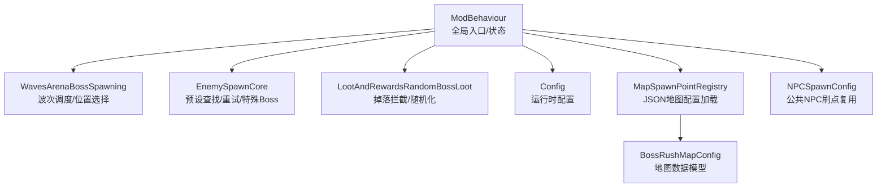
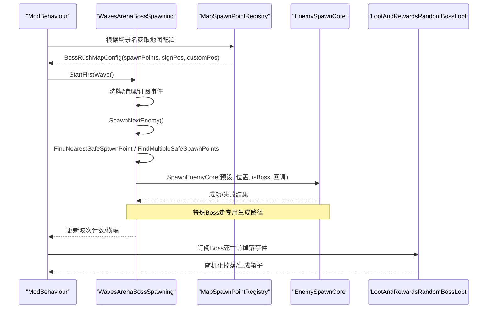
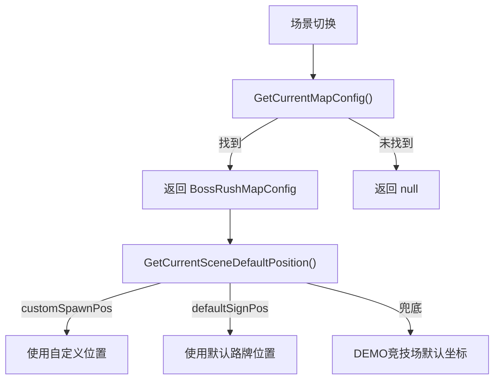
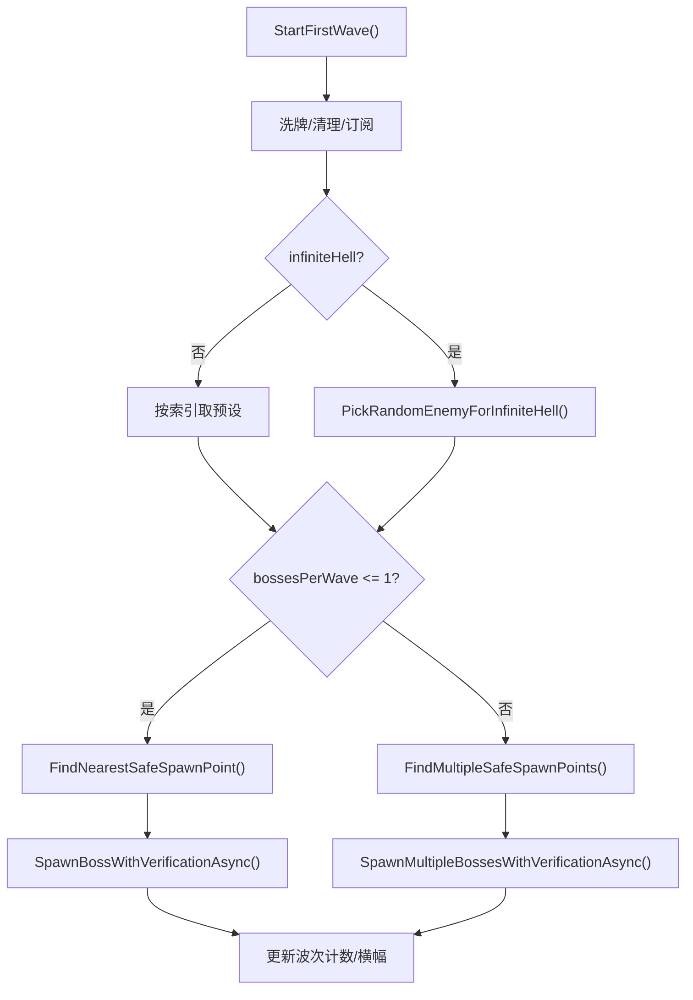
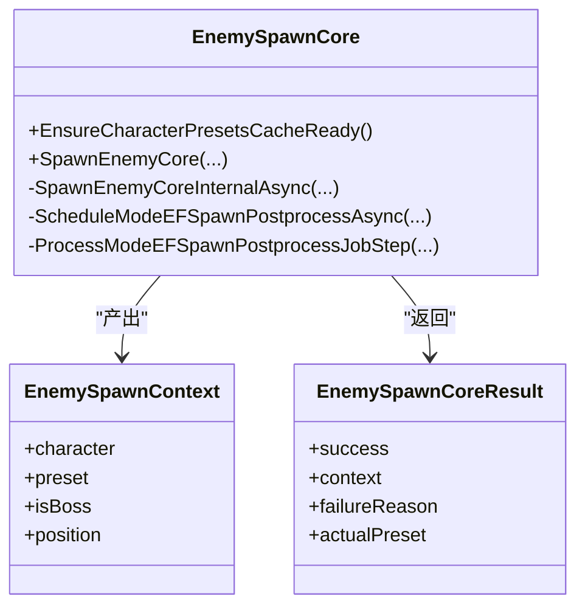
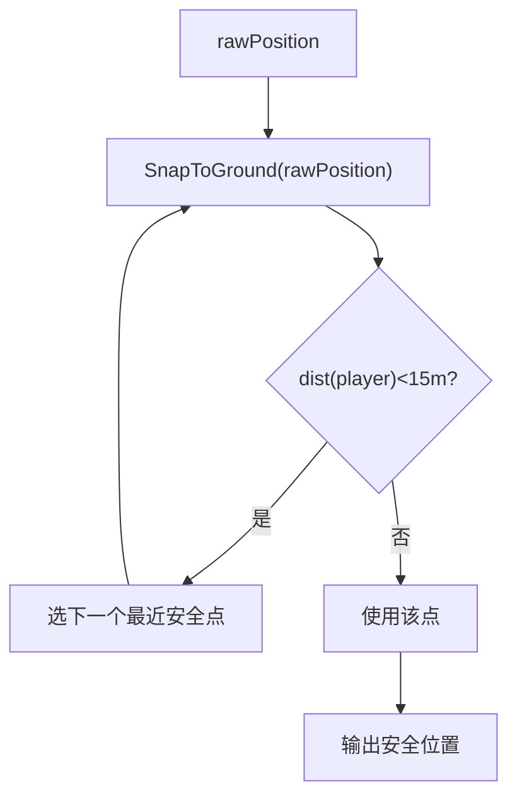
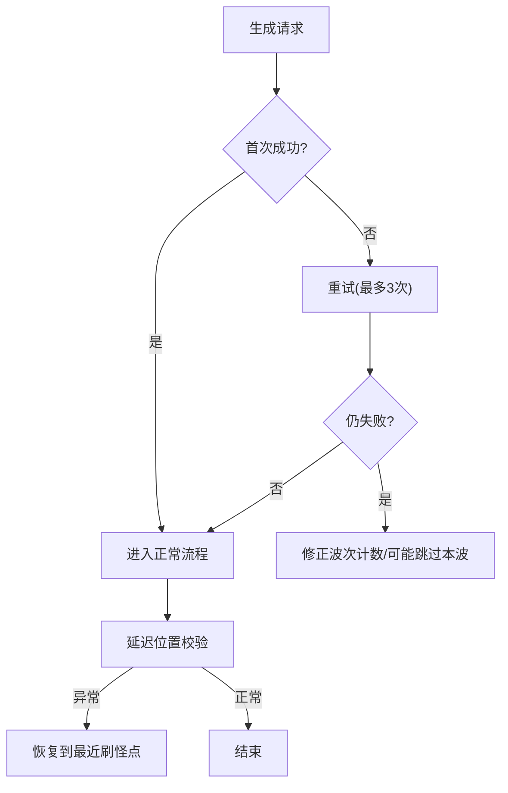
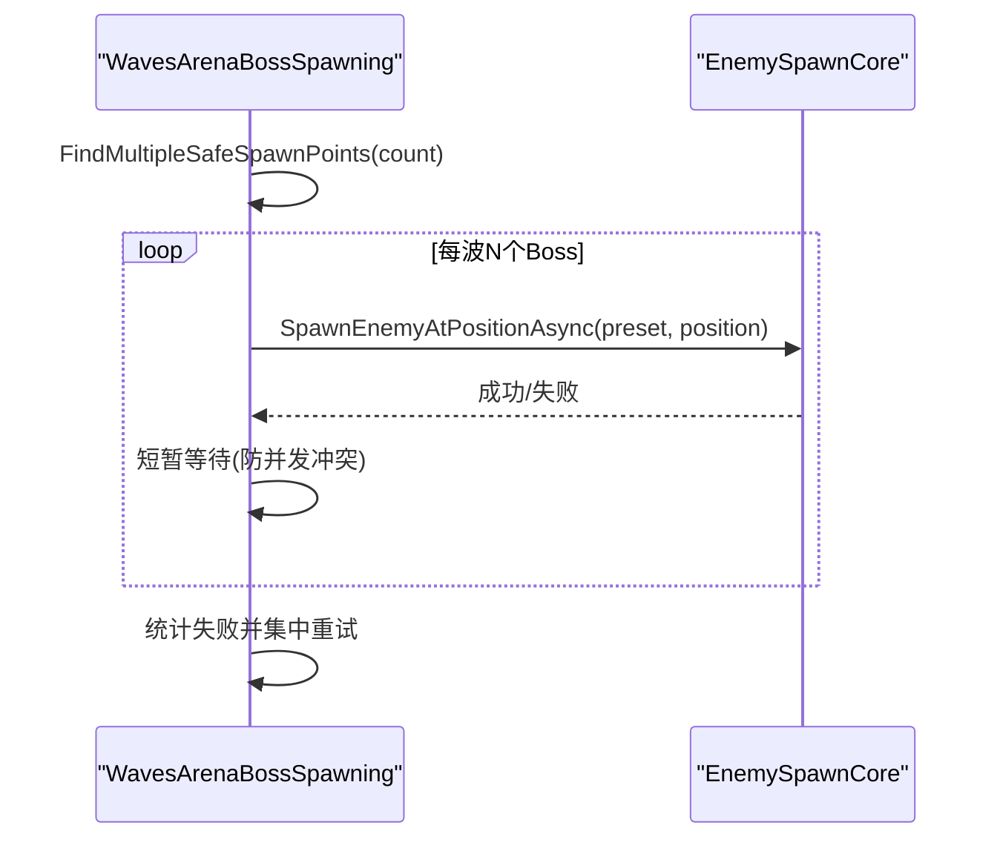
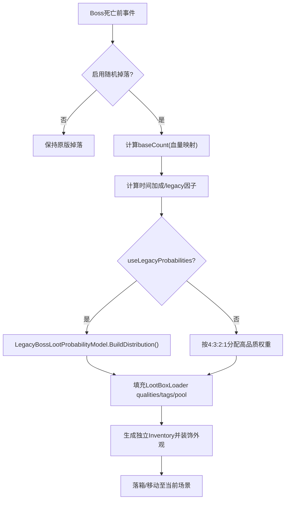
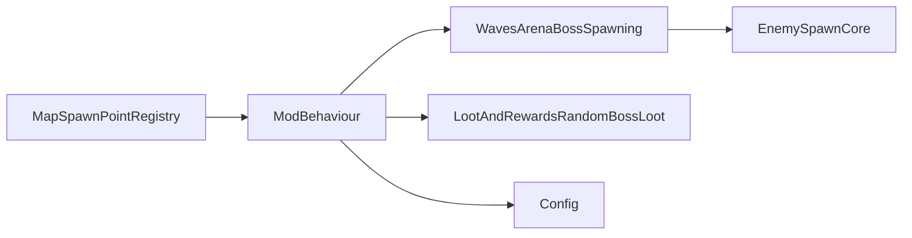

# Boss 生成系统

<cite>
**本文引用的文件**
- [ModBehaviour.cs](file://ModBehaviour.cs)
- [BossRushMapConfig.cs](file://Common/MapConfig/BossRushMapConfig.cs)
- [MapSpawnPointRegistry.cs](file://Common/MapConfig/MapSpawnPointRegistry.cs)
- [WavesArenaBossSpawning.cs](file://WavesArena/WavesArenaBossSpawning.cs)
- [EnemySpawnCore.cs](file://Utilities/EnemySpawnCore.cs)
- [LootAndRewardsRandomBossLoot.cs](file://LootAndRewards/LootAndRewardsRandomBossLoot.cs)
- [LegacyBossLootProbabilityModel.cs](file://LootAndRewards/LegacyBossLootProbabilityModel.cs)
- [NPCSpawnConfig.cs](file://Config/NPCSpawnConfig.cs)
- [Config.cs](file://Config/Config.cs)
</cite>

## 目录
1. [简介](#简介)
2. [项目结构](#项目结构)
3. [核心组件](#核心组件)
4. [架构总览](#架构总览)
5. [详细组件分析](#详细组件分析)
6. [依赖关系分析](#依赖关系分析)
7. [性能考虑](#性能考虑)
8. [故障排查指南](#故障排查指南)
9. [结论](#结论)
10. [附录](#附录)

## 简介
本文件系统性说明 Boss 生成系统的实现与使用，覆盖以下主题：
- Boss 预设发现机制与动态注册流程
- Boss 池构建算法与多 Boss 同波协调
- 生成位置计算、传送点选择逻辑与场景适配
- 生成失败处理与重试策略
- Boss 属性继承与修改、难度相关调节
- 掉落随机化算法与配置项
- 自定义 Boss 添加方法与性能监控优化建议

## 项目结构
Boss 生成系统由“地图配置与刷新点”“波次调度与生成”“通用敌人生成核心”“掉落与奖励”“配置系统”等模块协作完成。

图表来源
- [ModBehaviour.cs:1-200](file://ModBehaviour.cs#L1-L200)
- [WavesArenaBossSpawning.cs:1-200](file://WavesArena/WavesArenaBossSpawning.cs#L1-L200)
- [EnemySpawnCore.cs:1-200](file://Utilities/EnemySpawnCore.cs#L1-L200)
- [LootAndRewardsRandomBossLoot.cs:1-200](file://LootAndRewards/LootAndRewardsRandomBossLoot.cs#L1-L200)
- [MapSpawnPointRegistry.cs:1-120](file://Common/MapConfig/MapSpawnPointRegistry.cs#L1-L120)
- [BossRushMapConfig.cs:1-49](file://Common/MapConfig/BossRushMapConfig.cs#L1-L49)
- [NPCSpawnConfig.cs:1-120](file://Config/NPCSpawnConfig.cs#L1-L120)

章节来源
- [ModBehaviour.cs:1-200](file://ModBehaviour.cs#L1-L200)
- [MapSpawnPointRegistry.cs:1-120](file://Common/MapConfig/MapSpawnPointRegistry.cs#L1-L120)
- [WavesArenaBossSpawning.cs:1-200](file://WavesArena/WavesArenaBossSpawning.cs#L1-L200)

## 核心组件
- 地图配置与刷新点
  - JSON 驱动的地图配置加载与查询，提供 spawnPoints、默认路牌位置、自定义传送位置等。
- 波次调度与生成
  - 负责每波 Boss 数量控制、位置选择、批量生成与重试、失败回退。
- 通用敌人生成核心
  - 统一预设查找、重试、特殊 Boss（龙王/龙裔遗族/幽灵女巫）分支、属性标准化、掉落追踪注册。
- 掉落与奖励
  - 在 Boss 死亡前拦截掉落，按血量/速度/模式计算掉落数量与品质分布，支持原版概率或新权重模式。
- 配置系统
  - 本地文件与 ModConfig 双源配置，支持随机掉落开关、原版概率、掩体行为、无间炼狱参数等。

章节来源
- [BossRushMapConfig.cs:1-49](file://Common/MapConfig/BossRushMapConfig.cs#L1-L49)
- [MapSpawnPointRegistry.cs:1-120](file://Common/MapConfig/MapSpawnPointRegistry.cs#L1-L120)
- [WavesArenaBossSpawning.cs:100-250](file://WavesArena/WavesArenaBossSpawning.cs#L100-L250)
- [EnemySpawnCore.cs:140-220](file://Utilities/EnemySpawnCore.cs#L140-L220)
- [LootAndRewardsRandomBossLoot.cs:196-450](file://LootAndRewards/LootAndRewardsRandomBossLoot.cs#L196-L450)
- [Config.cs:36-120](file://Config/Config.cs#L36-L120)

## 架构总览
Boss 生成从“地图配置”获取刷新点，由“波次调度”决定每波目标与数量，调用“通用敌人生成核心”完成实例化与后处理；Boss 死亡时通过“掉落系统”拦截并随机化战利品；所有行为受“配置系统”控制。

图表来源
- [WavesArenaBossSpawning.cs:18-120](file://WavesArena/WavesArenaBossSpawning.cs#L18-L120)
- [WavesArenaBossSpawning.cs:343-473](file://WavesArena/WavesArenaBossSpawning.cs#L343-L473)
- [EnemySpawnCore.cs:485-592](file://Utilities/EnemySpawnCore.cs#L485-L592)
- [LootAndRewardsRandomBossLoot.cs:196-450](file://LootAndRewards/LootAndRewardsRandomBossLoot.cs#L196-L450)
- [MapSpawnPointRegistry.cs:40-80](file://Common/MapConfig/MapSpawnPointRegistry.cs#L40-L80)

## 详细组件分析

### 地图配置与刷新点系统
- 数据模型
  - 包含场景名、加载ID、显示名、spawnPoints、customSpawnPos、defaultSignPos、北方向、Mode E 专用刷点等。
- 加载与缓存
  - 启动时扫描 Assets/SpawnPoints/*.json，解析为字典并按 sortOrder 排序，提供 TryGet/All 查询。
- 默认传送位置
  - 优先 customSpawnPos，其次 defaultSignPos，最后回退到 DEMO 竞技场默认坐标。

图表来源
- [ModBehaviour.cs:186-229](file://ModBehaviour.cs#L186-L229)
- [MapSpawnPointRegistry.cs:40-80](file://Common/MapConfig/MapSpawnPointRegistry.cs#L40-L80)
- [BossRushMapConfig.cs:1-49](file://Common/MapConfig/BossRushMapConfig.cs#L1-L49)

章节来源
- [MapSpawnPointRegistry.cs:40-120](file://Common/MapConfig/MapSpawnPointRegistry.cs#L40-L120)
- [BossRushMapConfig.cs:1-49](file://Common/MapConfig/BossRushMapConfig.cs#L1-L49)
- [ModBehaviour.cs:186-229](file://ModBehaviour.cs#L186-L229)

### 波次调度与多 Boss 协调
- 开始挑战
  - 记录玩家出生点、打乱敌人顺序、清理场景敌人、订阅死亡事件、清空掉落追踪。
- 单波生成
  - 普通模式顺序推进；无间炼狱按权重随机选择。
- 位置选择
  - 单 Boss：选取距玩家最近且不在安全距离内的点；多 Boss：分配多个不重复的安全点，按距离排序。
- 批量生成与重试
  - 串行生成避免冲突，失败则分批重试，最终修正波次计数，必要时跳过本波。

图表来源
- [WavesArenaBossSpawning.cs:18-120](file://WavesArena/WavesArenaBossSpawning.cs#L18-L120)
- [WavesArenaBossSpawning.cs:343-473](file://WavesArena/WavesArenaBossSpawning.cs#L343-L473)
- [WavesArenaBossSpawning.cs:475-661](file://WavesArena/WavesArenaBossSpawning.cs#L475-L661)

章节来源
- [WavesArenaBossSpawning.cs:18-120](file://WavesArena/WavesArenaBossSpawning.cs#L18-L120)
- [WavesArenaBossSpawning.cs:343-473](file://WavesArena/WavesArenaBossSpawning.cs#L343-L473)
- [WavesArenaBossSpawning.cs:475-661](file://WavesArena/WavesArenaBossSpawning.cs#L475-L661)

### 通用敌人生成核心（预设发现与动态注册）
- 预设缓存
  - EnsureCharacterPresetsCacheReady() 扫描 Resources 中的 CharacterRandomPreset，建立 nameKey 到预设的映射。
- 预设选择与重试
  - 首次使用传入预设；若为空则随机选择；重试时可按 Mode E 规则跳过特定类型（龙裔/龙王/幽灵女巫）。
- 特殊 Boss 分支
  - 龙王/龙裔遗族/幽灵女巫走专用生成方法，内部完成配装与激活；SpawnCore 仅做伤害归一化、变异词条应用与提交回调。
- 后处理队列
  - 将装备装配、Boss 倍率应用、掉落追踪注册等延后至异步队列，按帧预算分步执行，避免卡顿。
  - EnemySpawnCoreOptions 全量透传进延后队列（ScheduleModeEFSpawnPostprocessAsync 显式无默认值参数）：队列收尾与同步路径保持同一组门控——HoldForExternalCommit 时冻结（SetInvincible + SetActive(false)）并跳过 Legacy 提交回调、ApplySharedMutators 门控变异词条；options == null 逐字保持 Legacy 行为（激活 + 变异 + 提交）。

图表来源
- [EnemySpawnCore.cs:147-187](file://Utilities/EnemySpawnCore.cs#L147-L187)
- [EnemySpawnCore.cs:485-592](file://Utilities/EnemySpawnCore.cs#L485-L592)
- [EnemySpawnCore.cs:280-421](file://Utilities/EnemySpawnCore.cs#L280-L421)

章节来源
- [EnemySpawnCore.cs:147-187](file://Utilities/EnemySpawnCore.cs#L147-L187)
- [EnemySpawnCore.cs:485-592](file://Utilities/EnemySpawnCore.cs#L485-L592)
- [EnemySpawnCore.cs:280-421](file://Utilities/EnemySpawnCore.cs#L280-L421)

### 生成位置计算与传送点选择
- 安全高度修正
  - 使用 Raycast/NavMesh 采样，确保 Y 轴贴合地面，避免卡在地下或空中。
- 安全距离过滤
  - 排除距玩家过近的点（默认 15 米），优先选最近安全点；不足时补充最远可用点。
- 多 Boss 多点分配
  - 为每波多个 Boss 分配互不重复的安全点，保证间距与可寻路性。
- 传送点优先级
  - 自定义传送位置 > 默认路牌位置 > DEMO 竞技场默认坐标。

图表来源
- [WavesArenaBossSpawning.cs:110-201](file://WavesArena/WavesArenaBossSpawning.cs#L110-L201)
- [WavesArenaBossSpawning.cs:135-146](file://WavesArena/WavesArenaBossSpawning.cs#L135-L146)
- [ModBehaviour.cs:186-229](file://ModBehaviour.cs#L186-L229)

章节来源
- [WavesArenaBossSpawning.cs:110-201](file://WavesArena/WavesArenaBossSpawning.cs#L110-L201)
- [ModBehaviour.cs:186-229](file://ModBehaviour.cs#L186-L229)

### 生成失败处理机制
- 单 Boss 重试
  - 最多 3 次重试，每次更换安全位置，短暂等待后继续。
- 多 Boss 批量重试
  - 首轮串行生成，统计失败列表；后续轮次集中重新分配不同安全点重试。
- 波次计数修正
  - 最终校验存活 Boss 数，修正剩余计数；若全部失败则跳过本波，推进下一波。
- 位置恢复
  - 延迟校验位置，若发现低于地面或悬空，尝试恢复到最近刷怪点。

图表来源
- [WavesArenaBossSpawning.cs:475-661](file://WavesArena/WavesArenaBossSpawning.cs#L475-L661)
- [WavesArenaBossSpawning.cs:253-341](file://WavesArena/WavesArenaBossSpawning.cs#L253-L341)

章节来源
- [WavesArenaBossSpawning.cs:475-661](file://WavesArena/WavesArenaBossSpawning.cs#L475-L661)
- [WavesArenaBossSpawning.cs:253-341](file://WavesArena/WavesArenaBossSpawning.cs#L253-L341)

### 多 Boss 同时生成的协调机制
- 预分配多点
  - 为每波多个 Boss 预先计算多个安全点，避免并行生成时的位置冲突。
- 串行生成+短间隔
  - 第一轮串行生成，每个 Boss 之间短暂等待，确保游戏状态稳定。
- 失败集中重试
  - 收集失败项，一次性重新分配不同位置重试，减少资源竞争。

图表来源
- [WavesArenaBossSpawning.cs:521-661](file://WavesArena/WavesArenaBossSpawning.cs#L521-L661)
- [EnemySpawnCore.cs:485-592](file://Utilities/EnemySpawnCore.cs#L485-L592)

章节来源
- [WavesArenaBossSpawning.cs:521-661](file://WavesArena/WavesArenaBossSpawning.cs#L521-L661)
- [EnemySpawnCore.cs:485-592](file://Utilities/EnemySpawnCore.cs#L485-L592)

### Boss 属性继承与修改、难度相关调节
- 属性继承
  - 通过 CharacterRandomPreset 创建角色，继承基础属性与装备模板。
- 伤害归一化
  - NormalizeDamageMultiplier 对伤害倍率进行统一处理，保证跨 Boss 一致性。
- Boss 倍率
  - ApplyBossStatMultiplier 应用全局数值倍率（来自配置）。
- 变异词条
  - MutatorManager.ApplyToEnemy 在生成后应用当前局随机到的词条效果。
- 阵营与仇恨
  - 强制设置敌对阵营与 AI 追踪距离，确保远距离也能锁定玩家。

章节来源
- [EnemySpawnCore.cs:780-800](file://Utilities/EnemySpawnCore.cs#L780-L800)
- [ModBehaviour.cs:1098-1195](file://ModBehaviour.cs#L1098-L1195)
- [Config.cs:36-120](file://Config/Config.cs#L36-L120)

### 掉落随机化算法
- 触发时机
  - 在 Boss 真正生成掉落物之前拦截（BeforeCharacterSpawnLootOnDead）。
- 掉落数量
  - 基于 Boss 最大生命值映射到 [7,15] 区间，击杀越快加成越高。
- 品质分布
  - 可选“原版概率模式”或“新权重模式”；前者使用 LegacyBossLootProbabilityModel 计算各品质概率；后者按高品质 4:3:2:1 比例分配。
- 保底机制
  - 当 Boss 最大生命超过阈值且无高品质物品时，追加一件高品质物品。
- 独立库存
  - 为 Boss 奖励箱创建独立本地 Inventory，避免与其他箱子共享导致格子异常。

图表来源
- [LootAndRewardsRandomBossLoot.cs:196-450](file://LootAndRewards/LootAndRewardsRandomBossLoot.cs#L196-L450)
- [LootAndRewardsRandomBossLoot.cs:453-800](file://LootAndRewards/LootAndRewardsRandomBossLoot.cs#L453-L800)
- [LegacyBossLootProbabilityModel.cs:1-200](file://LootAndRewards/LegacyBossLootProbabilityModel.cs#L1-L200)

章节来源
- [LootAndRewardsRandomBossLoot.cs:196-450](file://LootAndRewards/LootAndRewardsRandomBossLoot.cs#L196-L450)
- [LootAndRewardsRandomBossLoot.cs:453-800](file://LootAndRewards/LootAndRewardsRandomBossLoot.cs#L453-L800)
- [LegacyBossLootProbabilityModel.cs:1-200](file://LootAndRewards/LegacyBossLootProbabilityModel.cs#L1-L200)

### 配置选项与自定义 Boss 添加
- 关键配置
  - enableRandomBossLoot：是否启用 Boss 随机掉落
  - useLegacyBossLootProbabilities：是否使用原版概率分布
  - lootBoxBlocksBullets：掉落箱是否作为掩体
  - infiniteHellBossesPerWave：无间炼狱每波 Boss 数量
  - bossStatMultiplier：全局数值倍率
  - modeDEnemiesPerWave：白手起家每波敌人数
  - mutatorCount：每局变异词条数量
- 自定义 Boss 添加
  - 通过新增 CharacterRandomPreset 并加入 Resources；或在 MapSpawnPointRegistry 中为场景添加 spawnPoints。
  - 特殊 Boss（龙王/龙裔遗族/幽灵女巫）需在其专用生成方法内完成能力与资产绑定。

章节来源
- [Config.cs:36-120](file://Config/Config.cs#L36-L120)
- [Config.cs:706-800](file://Config/Config.cs#L706-L800)
- [MapSpawnPointRegistry.cs:40-120](file://Common/MapConfig/MapSpawnPointRegistry.cs#L40-L120)
- [EnemySpawnCore.cs:661-739](file://Utilities/EnemySpawnCore.cs#L661-L739)

## 依赖关系分析
- 低耦合高内聚
  - 地图配置与刷新点解耦于波次调度；波次调度仅依赖位置选择与生成核心接口。
  - 掉落系统与生成流程通过事件解耦，仅在 Boss 死亡前介入。
- 外部依赖
  - Unity 场景管理、AI NavMesh、Resources 查找、Harmony 补丁（部分功能）。
- 潜在循环依赖
  - 未发现明显循环；各模块通过回调与事件通信。

图表来源
- [ModBehaviour.cs:1-200](file://ModBehaviour.cs#L1-L200)
- [WavesArenaBossSpawning.cs:1-200](file://WavesArena/WavesArenaBossSpawning.cs#L1-L200)
- [EnemySpawnCore.cs:1-200](file://Utilities/EnemySpawnCore.cs#L1-L200)
- [LootAndRewardsRandomBossLoot.cs:1-200](file://LootAndRewards/LootAndRewardsRandomBossLoot.cs#L1-L200)
- [Config.cs:1-120](file://Config/Config.cs#L1-L120)

章节来源
- [ModBehaviour.cs:1-200](file://ModBehaviour.cs#L1-L200)
- [WavesArenaBossSpawning.cs:1-200](file://WavesArena/WavesArenaBossSpawning.cs#L1-L200)
- [EnemySpawnCore.cs:1-200](file://Utilities/EnemySpawnCore.cs#L1-L200)
- [LootAndRewardsRandomBossLoot.cs:1-200](file://LootAndRewards/LootAndRewardsRandomBossLoot.cs#L1-L200)
- [Config.cs:1-120](file://Config/Config.cs#L1-L120)

## 性能考虑
- 预设缓存
  - EnsureCharacterPresetsCacheReady() 避免重复扫描 Resources。
- 后处理分帧
  - 将装备装配、Boss 倍率应用、掉落追踪注册等拆分为多步骤，按帧预算执行，避免卡顿。
- 位置采样优化
  - 使用 SnapToGround 与最近安全点算法，减少无效生成尝试。
- 批量生成节流
  - 多 Boss 串行生成并插入短暂等待，降低瞬时压力。
- 掉落系统缓存
  - 候选物品 ID 与品质权重使用局部缓冲数组/字典，减少 GC 压力。

章节来源
- [EnemySpawnCore.cs:147-187](file://Utilities/EnemySpawnCore.cs#L147-L187)
- [EnemySpawnCore.cs:198-248](file://Utilities/EnemySpawnCore.cs#L198-L248)
- [WavesArenaBossSpawning.cs:110-201](file://WavesArena/WavesArenaBossSpawning.cs#L110-L201)
- [LootAndRewardsRandomBossLoot.cs:94-115](file://LootAndRewards/LootAndRewardsRandomBossLoot.cs#L94-L115)

## 故障排查指南
- 无法生成 Boss
  - 检查当前场景是否有有效地图配置与刷新点；确认 Boss 池非空。
- 生成位置异常
  - 查看延迟位置校验日志，确认是否被判定为“低于地面/悬空”，并自动恢复。
- 掉落异常
  - 确认 enableRandomBossLoot 与 useLegacyBossLootProbabilities 配置；检查 LootBoxLoader 的 qualities/tags/randomPool 是否正确注入。
- 多 Boss 冲突
  - 观察批量生成重试日志，确认是否因位置冲突导致失败；调整刷新点密度与安全距离。

章节来源
- [WavesArenaBossSpawning.cs:343-473](file://WavesArena/WavesArenaBossSpawning.cs#L343-L473)
- [WavesArenaBossSpawning.cs:253-341](file://WavesArena/WavesArenaBossSpawning.cs#L253-L341)
- [LootAndRewardsRandomBossLoot.cs:483-549](file://LootAndRewards/LootAndRewardsRandomBossLoot.cs#L483-L549)

## 结论
Boss 生成系统以 JSON 地图配置为基础，结合波次调度、通用生成核心与掉落拦截，实现了稳定、可扩展的多 Boss 生成流程。通过预设缓存、后处理分帧、安全位置选择与批量重试机制，系统在复杂场景下仍能保持良好性能与鲁棒性。配置项提供了灵活的难度与掉落控制，便于调参与扩展。

## 附录
- 常用 API 参考
  - GetCurrentSceneSpawnPoints()：获取当前场景刷新点
  - GetCurrentSceneDefaultPosition()：获取默认传送位置
  - StartFirstWave()：开始第一波挑战
  - EnsureCharacterPresetsCacheReady()：确保预设缓存就绪
  - OnBossBeforeSpawnLoot_LootAndRewards()：掉落拦截入口

章节来源
- [ModBehaviour.cs:171-229](file://ModBehaviour.cs#L171-L229)
- [WavesArenaBossSpawning.cs:18-120](file://WavesArena/WavesArenaBossSpawning.cs#L18-L120)
- [EnemySpawnCore.cs:147-187](file://Utilities/EnemySpawnCore.cs#L147-L187)
- [LootAndRewardsRandomBossLoot.cs:196-450](file://LootAndRewards/LootAndRewardsRandomBossLoot.cs#L196-L450)