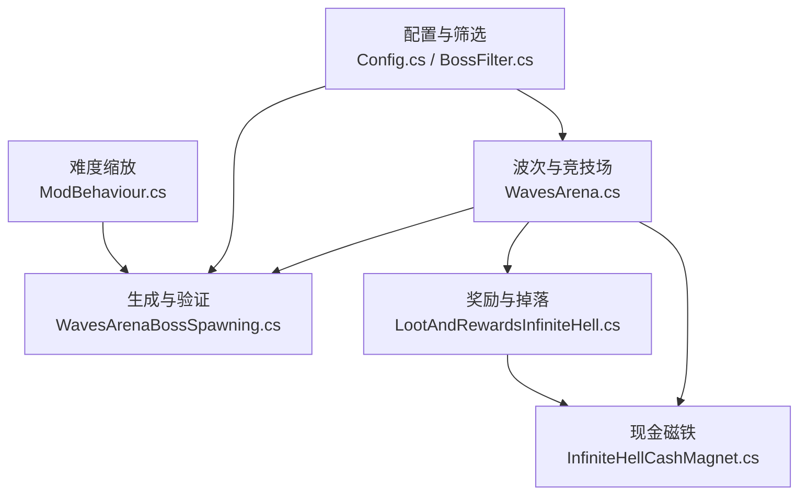
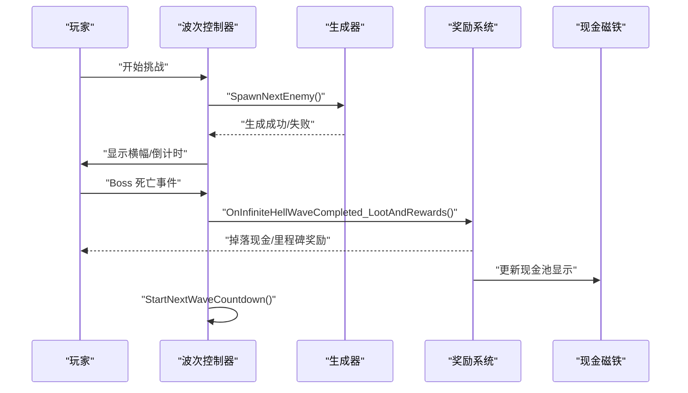
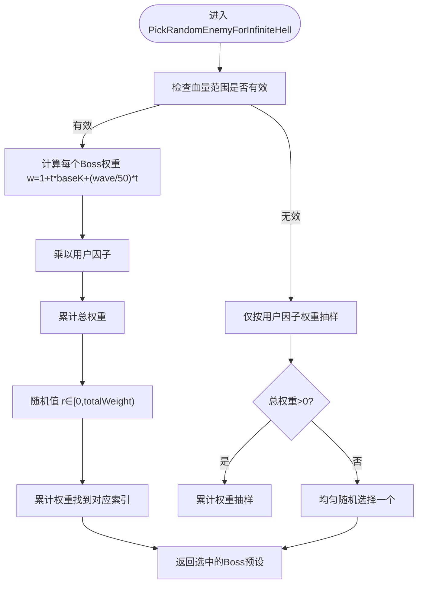
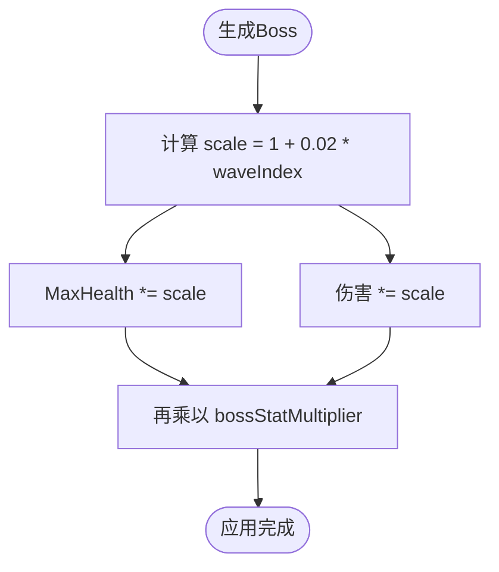
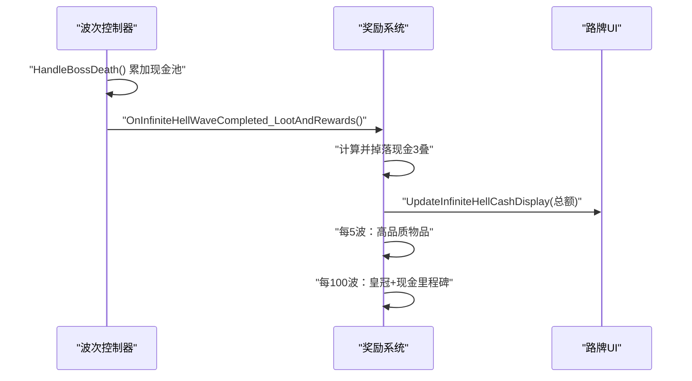
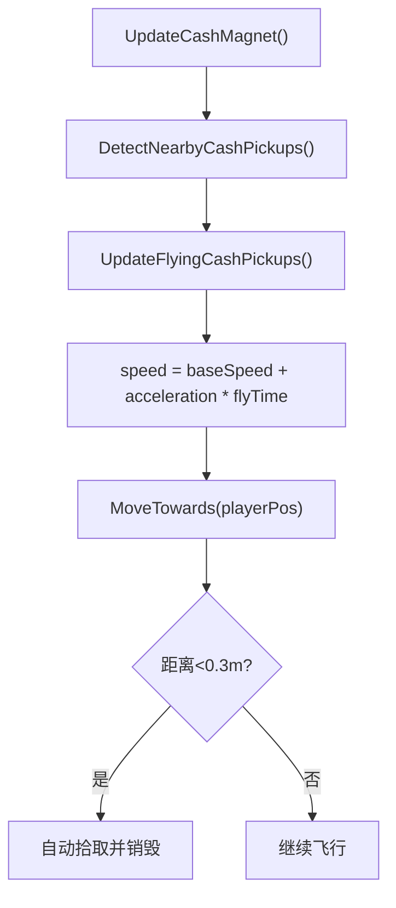
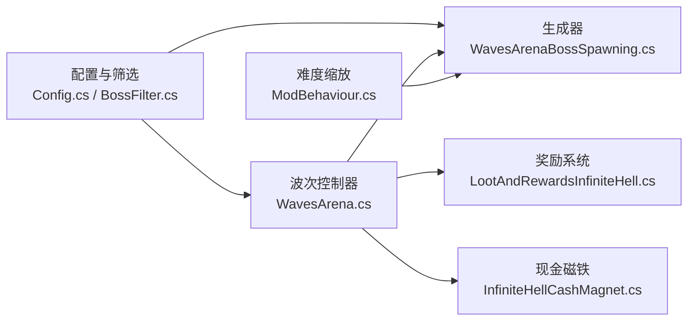

# 无间炼狱模式

<cite>
**本文引用的文件**
- [WavesArena.cs](file://WavesArena/WavesArena.cs)
- [LootAndRewardsInfiniteHell.cs](file://LootAndRewards/LootAndRewardsInfiniteHell.cs)
- [InfiniteHellCashMagnet.cs](file://WavesArena/InfiniteHellCashMagnet.cs)
- [WavesArenaBossSpawning.cs](file://WavesArena/WavesArenaBossSpawning.cs)
- [Config.cs](file://Config/Config.cs)
- [BossFilter.cs](file://BossFilter/BossFilter.cs)
- [ModBehaviour.cs](file://ModBehaviour.cs)
</cite>

## 目录
1. [简介](#简介)
2. [项目结构](#项目结构)
3. [核心组件](#核心组件)
4. [架构总览](#架构总览)
5. [详细组件分析](#详细组件分析)
6. [依赖关系分析](#依赖关系分析)
7. [性能与平衡性](#性能与平衡性)
8. [故障排查指南](#故障排查指南)
9. [结论](#结论)
10. [附录：配置与调试](#附录配置与调试)

## 简介
无间炼狱是 BossRush 的无尽挑战模式。其核心特点包括：
- 无终点、无撤离，每波 Boss 血量与伤害按波次递增（累计 +2%/波）。
- 掉落箱被替换为“现金池”系统：击杀 Boss 后掉落现金并累积到现金池，路牌显示当前总额；2 米内现金自动吸附飞行拾取。
- 奖励机制：每 5 波发放高品质随机物品；每 100 波发放皇冠与指数增长的巨额现金里程碑奖励。
- 权重随机选择：每波从 Boss 池中按权重随机抽取 Boss，权重受基础血量归一化、波次线性项以及用户自定义因子共同影响。
- 难度递增：通过全局数值倍率与逐波缩放叠加，形成持续上升的挑战曲线。
- 进度保存与恢复：配置持久化至本地文件，支持运行时热更新部分选项。

## 项目结构
本模式由多个子系统协作完成：
- 波次与竞技场管理：负责倒计时、波次推进、死亡事件处理与现金池累加。
- 生成与验证：负责安全刷怪点选择、批量生成与重试、位置校验。
- 奖励与掉落：负责单波现金掉落、里程碑奖励、高品质物品池构建与抽取。
- 现金磁铁：检测并吸附 2 米范围内现金，加速飞向玩家并自动拾取。
- 配置与筛选：提供 UI 与配置文件，支持禁用 Boss、设置无间炼狱因子、调整每波 Boss 数量等。
- 难度缩放：在 Boss 生成后应用逐波血量与伤害提升。

图表来源
- [WavesArena.cs:108-184](file://WavesArena/WavesArena.cs#L108-L184)
- [WavesArenaBossSpawning.cs:346-473](file://WavesArena/WavesArenaBossSpawning.cs#L346-L473)
- [LootAndRewardsInfiniteHell.cs:30-308](file://LootAndRewards/LootAndRewardsInfiniteHell.cs#L30-L308)
- [InfiniteHellCashMagnet.cs:79-114](file://WavesArena/InfiniteHellCashMagnet.cs#L79-L114)
- [Config.cs:158-232](file://Config/Config.cs#L158-L232)
- [BossFilter.cs:91-158](file://BossFilter/BossFilter.cs#L91-L158)
- [ModBehaviour.cs:1212-1243](file://ModBehaviour.cs#L1212-L1243)

章节来源
- [WavesArena.cs:108-184](file://WavesArena/WavesArena.cs#L108-L184)
- [WavesArenaBossSpawning.cs:346-473](file://WavesArena/WavesArenaBossSpawning.cs#L346-L473)
- [LootAndRewardsInfiniteHell.cs:30-308](file://LootAndRewards/LootAndRewardsInfiniteHell.cs#L30-L308)
- [InfiniteHellCashMagnet.cs:79-114](file://WavesArena/InfiniteHellCashMagnet.cs#L79-L114)
- [Config.cs:158-232](file://Config/Config.cs#L158-L232)
- [BossFilter.cs:91-158](file://BossFilter/BossFilter.cs#L91-L158)
- [ModBehaviour.cs:1212-1243](file://ModBehaviour.cs#L1212-L1243)

## 核心组件
- 波次控制器：维护波次间隔、里程碑休息、下一波预告、死亡事件处理与现金池累加。
- 生成器：安全刷怪点选择、批量生成、重试与失败回退，确保多 Boss 同波不冲突。
- 奖励系统：单波现金掉落、5 波高品质物品、100 波里程碑奖励（皇冠+现金），以及高品质池构建与抽取。
- 现金磁铁：2 米范围检测、加速飞行、自动拾取与气泡提示。
- 配置与筛选：本地 JSON 配置、ModConfig 集成、Boss 启用/禁用、无间炼狱因子编辑、每波 Boss 数量调节。
- 难度缩放：逐波累计 +2% 血量与伤害，配合全局数值倍率。

章节来源
- [WavesArena.cs:348-441](file://WavesArena/WavesArena.cs#L348-L441)
- [WavesArenaBossSpawning.cs:346-473](file://WavesArena/WavesArenaBossSpawning.cs#L346-L473)
- [LootAndRewardsInfiniteHell.cs:30-308](file://LootAndRewards/LootAndRewardsInfiniteHell.cs#L30-L308)
- [InfiniteHellCashMagnet.cs:79-114](file://WavesArena/InfiniteHellCashMagnet.cs#L79-L114)
- [Config.cs:158-232](file://Config/Config.cs#L158-L232)
- [BossFilter.cs:91-158](file://BossFilter/BossFilter.cs#L91-L158)
- [ModBehaviour.cs:1212-1243](file://ModBehaviour.cs#L1212-L1243)

## 架构总览
无间炼狱的核心流程如下：
- 开始第一波：记录出生点、打乱敌人顺序、清理场景、订阅死亡事件、立即生成首个敌人。
- 每波生成：根据模式决定选取策略（普通模式顺序，无间炼狱权重随机）；选择安全刷怪点；异步生成并校验位置。
- 死亡处理：识别当前波 Boss 是否死亡，累加现金池，推进波次或结束。
- 奖励结算：掉落现金、更新路牌显示、气泡提示、5 波/100 波里程碑奖励。
- 下一波准备：切换交互或启动倒计时。

图表来源
- [WavesArenaBossSpawning.cs:19-108](file://WavesArena/WavesArenaBossSpawning.cs#L19-L108)
- [WavesArenaBossSpawning.cs:346-473](file://WavesArena/WavesArenaBossSpawning.cs#L346-L473)
- [WavesArena.cs:348-441](file://WavesArena/WavesArena.cs#L348-L441)
- [LootAndRewardsInfiniteHell.cs:30-308](file://LootAndRewards/LootAndRewardsInfiniteHell.cs#L30-L308)
- [InfiniteHellCashMagnet.cs:79-114](file://WavesArena/InfiniteHellCashMagnet.cs#L79-L114)

## 详细组件分析

### 权重随机选择算法
- 目标：在无间炼狱模式下，每波从过滤后的 Boss 池按权重随机选取一个 Boss。
- 权重构成：
  - 基础系数：基于 Boss 基础血量的归一化 t ∈ [0,1]，w = 1 + t * baseK + (wave/50) * t，baseK=4。
  - 用户因子：GetBossInfiniteHellFactor(name) 返回的乘数，默认 1.0，可在 Boss 过滤器中调整。
  - 兜底：若无法计算血量范围，则仅按用户因子权重抽样；若总权重为 0，则均匀随机。
- 复杂度：O(N)，N 为过滤后 Boss 数量；使用累计权重抽样。

图表来源
- [WavesArena.cs:643-742](file://WavesArena/WavesArena.cs#L643-L742)
- [BossFilter.cs:332-340](file://BossFilter/BossFilter.cs#L332-L340)

章节来源
- [WavesArena.cs:643-742](file://WavesArena/WavesArena.cs#L643-L742)
- [BossFilter.cs:332-340](file://BossFilter/BossFilter.cs#L332-L340)

### Boss 权重计算公式与用户因子
- 公式：w_i = (1 + t_i * 4 + (infiniteHellWaveIndex/50) * t_i) * factor_i
  - t_i = clamp((baseHealth_i - minH)/(maxH - minH), 0, 1)
  - factor_i = GetBossInfiniteHellFactor(name_i)，默认 1.0
- 作用：高血量 Boss 在后期权重更高；用户可通过 Boss 过滤器调高/降低特定 Boss 的出现概率。

章节来源
- [WavesArena.cs:692-720](file://WavesArena/WavesArena.cs#L692-L720)
- [BossFilter.cs:130-145](file://BossFilter/BossFilter.cs#L130-L145)

### 血量缩放机制与难度递增
- 逐波缩放：每波累计 +2% 血量与伤害，scale = 1 + 0.02 * max(0, infiniteHellWaveIndex)。
- 全局倍率：bossStatMultiplier 可整体放大 Boss 数值（配置项，范围 0.1–10）。
- 效果：随波次推进，Boss 强度快速上升，例如第 50 波 +100%，第 100 波 +200%。

图表来源
- [ModBehaviour.cs:1212-1243](file://ModBehaviour.cs#L1212-L1243)
- [Config.cs:919-937](file://Config/Config.cs#L919-L937)

章节来源
- [ModBehaviour.cs:1212-1243](file://ModBehaviour.cs#L1212-L1243)
- [Config.cs:919-937](file://Config/Config.cs#L919-L937)

### 现金池积累规则与奖励兑换
- 积累规则：每击杀一个 Boss，将 MaxHealth * 10 折算为现金，加入无限炼狱现金池与当波临时计数。
- 掉落行为：单波完成后，在路牌附近掉落 3 叠现金（或不足时全部放入一叠），并在路牌显示当前现金池总额；玩家头顶气泡提示累计额。
- 5 波奖励：每 5 波掉落一个高品质随机物品（优先 Q≥5 且价值≥10000），皇冠有 90% 概率重抽。
- 100 波里程碑：每 100 波发放皇冠与现金，数量按 2^(tier-1) 指数增长（tier = wave/100）。

图表来源
- [WavesArena.cs:368-388](file://WavesArena/WavesArena.cs#L368-L388)
- [LootAndRewardsInfiniteHell.cs:30-308](file://LootAndRewards/LootAndRewardsInfiniteHell.cs#L30-L308)

章节来源
- [WavesArena.cs:368-388](file://WavesArena/WavesArena.cs#L368-L388)
- [LootAndRewardsInfiniteHell.cs:30-308](file://LootAndRewards/LootAndRewardsInfiniteHell.cs#L30-L308)

### 现金磁铁吸附机制
- 检测半径：2 米；拾取距离：0.3 米。
- 行为：每帧扫描范围内现金 pickup，加入飞行列表；以 baseSpeed + acceleration * flyTime 的加速曲线飞向玩家；到达拾取距离后自动拾取并销毁。
- 性能：使用非分配碰撞检测缓冲，溢出时回退到二级缓冲；避免重复检测已在飞行的 pickup。

图表来源
- [InfiniteHellCashMagnet.cs:79-114](file://WavesArena/InfiniteHellCashMagnet.cs#L79-L114)
- [InfiniteHellCashMagnet.cs:122-184](file://WavesArena/InfiniteHellCashMagnet.cs#L122-L184)
- [InfiniteHellCashMagnet.cs:191-301](file://WavesArena/InfiniteHellCashMagnet.cs#L191-L301)

章节来源
- [InfiniteHellCashMagnet.cs:79-114](file://WavesArena/InfiniteHellCashMagnet.cs#L79-L114)
- [InfiniteHellCashMagnet.cs:122-184](file://WavesArena/InfiniteHellCashMagnet.cs#L122-L184)
- [InfiniteHellCashMagnet.cs:191-301](file://WavesArena/InfiniteHellCashMagnet.cs#L191-L301)

### 模式结束条件与波次推进
- 普通模式：跑完过滤后的 Boss 列表即通关。
- 无间炼狱：无终点，不会调用 OnAllEnemiesDefeated；每波完成后直接准备下一波。
- 波次推进：所有 Boss 死亡或生成失败时，统一推进到下一波；支持多 Boss 同波计数与剩余计数修正。

章节来源
- [WavesArena.cs:443-506](file://WavesArena/WavesArena.cs#L443-L506)
- [WavesArenaBossSpawning.cs:509-549](file://WavesArena/WavesArenaBossSpawning.cs#L509-L549)

### 用户自定义权重配置与 Boss 因子调节
- 配置入口：Boss 过滤器（Ctrl+F10）或 ModConfig 界面。
- 功能：
  - 禁用/启用 Boss：影响所有模式的 Boss 池。
  - 设置无间炼狱因子：对特定 Boss 的出现概率进行乘数调节（极低/低/中/高/极高）。
  - 每波 Boss 数量：无间炼狱模式下可配置每波同时出现的 Boss 数（1–10）。
- 持久化：配置保存到本地 JSON 文件，游戏启动时加载；运行时变更可即时生效（如波次间隔）。

章节来源
- [BossFilter.cs:91-158](file://BossFilter/BossFilter.cs#L91-L158)
- [BossFilter.cs:302-321](file://BossFilter/BossFilter.cs#L302-L321)
- [Config.cs:158-232](file://Config/Config.cs#L158-L232)
- [Config.cs:709-1041](file://Config/Config.cs#L709-L1041)

### 模式进度保存与恢复
- 配置持久化：本地文件路径 StreamingAssets/BossRushModConfig.txt，包含波次间隔、额外休息时间、Boss 数值倍率、禁用列表、无间炼狱因子等。
- 运行时热更新：波次间隔修改后立即重算倒计时；其他配置变更后保存并应用。

章节来源
- [Config.cs:158-232](file://Config/Config.cs#L158-L232)
- [Config.cs:588-622](file://Config/Config.cs#L588-L622)

## 依赖关系分析
- 波次控制器依赖生成器进行 Boss 生成与重试，依赖奖励系统进行掉落与里程碑奖励，依赖现金磁铁进行现金拾取体验优化。
- 配置与筛选模块为波次控制器与生成器提供 Boss 池过滤与权重因子。
- 难度缩放模块在生成后对 Boss 属性进行实时修改。

图表来源
- [WavesArena.cs:108-184](file://WavesArena/WavesArena.cs#L108-L184)
- [WavesArenaBossSpawning.cs:346-473](file://WavesArena/WavesArenaBossSpawning.cs#L346-L473)
- [LootAndRewardsInfiniteHell.cs:30-308](file://LootAndRewards/LootAndRewardsInfiniteHell.cs#L30-L308)
- [InfiniteHellCashMagnet.cs:79-114](file://WavesArena/InfiniteHellCashMagnet.cs#L79-L114)
- [Config.cs:158-232](file://Config/Config.cs#L158-L232)
- [BossFilter.cs:91-158](file://BossFilter/BossFilter.cs#L91-L158)
- [ModBehaviour.cs:1212-1243](file://ModBehaviour.cs#L1212-L1243)

章节来源
- [WavesArena.cs:108-184](file://WavesArena/WavesArena.cs#L108-L184)
- [WavesArenaBossSpawning.cs:346-473](file://WavesArena/WavesArenaBossSpawning.cs#L346-L473)
- [LootAndRewardsInfiniteHell.cs:30-308](file://LootAndRewards/LootAndRewardsInfiniteHell.cs#L30-L308)
- [InfiniteHellCashMagnet.cs:79-114](file://WavesArena/InfiniteHellCashMagnet.cs#L79-L114)
- [Config.cs:158-232](file://Config/Config.cs#L158-L232)
- [BossFilter.cs:91-158](file://BossFilter/BossFilter.cs#L91-L158)
- [ModBehaviour.cs:1212-1243](file://ModBehaviour.cs#L1212-L1243)

## 性能与平衡性
- 性能要点：
  - 敌人预设初始化缓存，避免重复扫描。
  - 现金磁铁使用非分配碰撞检测与复用缓冲，防止高频分配。
  - 批量生成串行执行并短暂等待，减少并发冲突。
- 平衡性建议：
  - 合理设置每波 Boss 数量与用户因子，避免极端难度。
  - 利用 5 波/100 波里程碑奖励缓解长期挑战压力。
  - 结合全局数值倍率与逐波缩放，控制总体难度曲线。

## 故障排查指南
- 常见问题：
  - Boss 生成失败：检查刷怪点与安全距离，查看日志中的重试轮次与最终失败计数。
  - 现金掉落异常：确认现金池累加逻辑与掉落位置获取；检查气泡显示与路牌更新。
  - 配置未生效：确认本地文件路径与 ModConfig 键名；检查运行时热更新回调。
- 调试工具：
  - 日志输出：DevLog 记录关键流程与异常信息。
  - 路牌交互：在无间炼狱下用于显示现金池与下一波选项。
  - Boss 过滤器：打开 Ctrl+F10 查看与调整 Boss 池状态与因子。

章节来源
- [WavesArenaBossSpawning.cs:475-661](file://WavesArena/WavesArenaBossSpawning.cs#L475-L661)
- [LootAndRewardsInfiniteHell.cs:30-308](file://LootAndRewards/LootAndRewardsInfiniteHell.cs#L30-L308)
- [Config.cs:588-622](file://Config/Config.cs#L588-L622)

## 结论
无间炼狱模式通过权重随机选择、逐波难度递增、现金池奖励与里程碑机制，构建了高挑战性与高回报的无尽玩法。其模块化设计使得配置、生成、奖励与磁铁等功能解耦且易于扩展。通过合理的配置与策略，玩家可以在不断升级的难度中获得持续的成就感与资源回报。

## 附录：配置与调试
- 配置项：
  - 波次间隔：2–60 秒，默认 15 秒。
  - 每 5 波额外休息：0–120 秒，默认 30 秒。
  - Boss 全局数值倍率：0.1–10，默认 1。
  - 无间炼狱每波 Boss 数量：1–10，默认 3。
  - 禁用 Boss 列表与无间炼狱因子：通过 Boss 过滤器设置。
- 调试建议：
  - 观察日志中的波次推进、生成重试与奖励发放。
  - 使用路牌交互检查现金池与下一波选项。
  - 通过 Boss 过滤器调整权重，测试不同 Boss 组合的难度曲线。

章节来源
- [Config.cs:879-997](file://Config/Config.cs#L879-L997)
- [BossFilter.cs:91-158](file://BossFilter/BossFilter.cs#L91-L158)
- [WavesArena.cs:108-184](file://WavesArena/WavesArena.cs#L108-L184)
- [LootAndRewardsInfiniteHell.cs:30-308](file://LootAndRewards/LootAndRewardsInfiniteHell.cs#L30-L308)