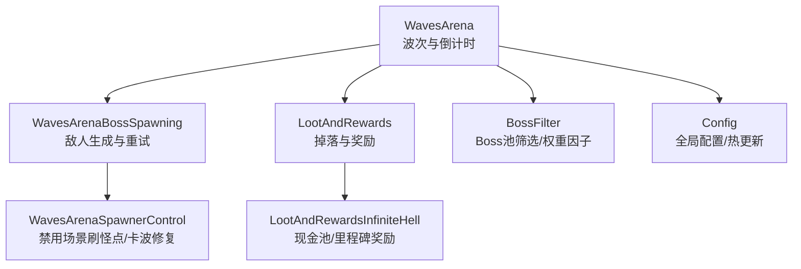
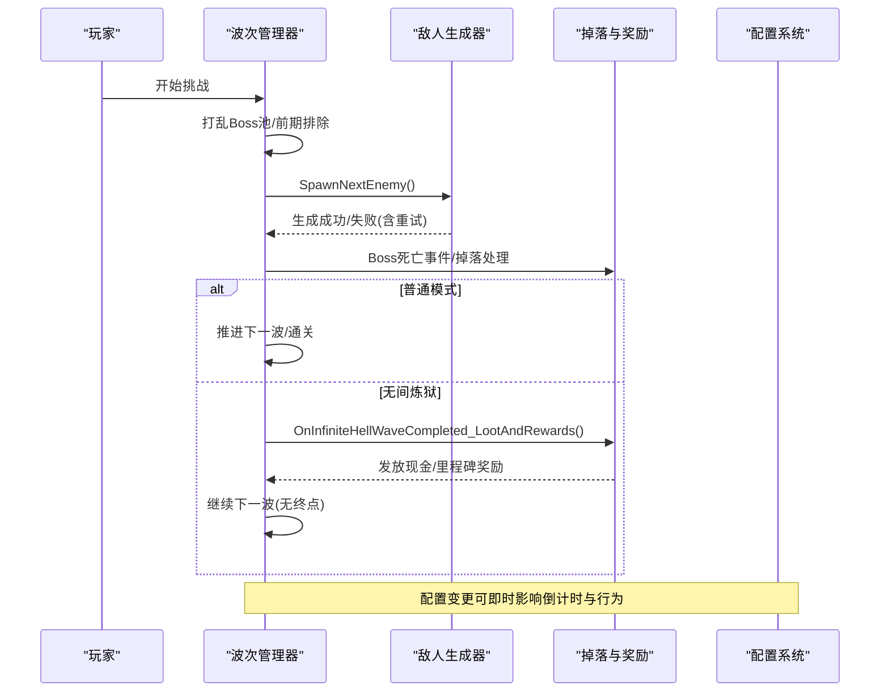
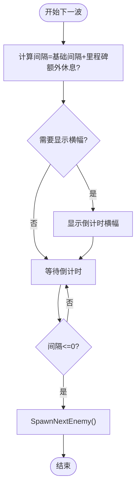
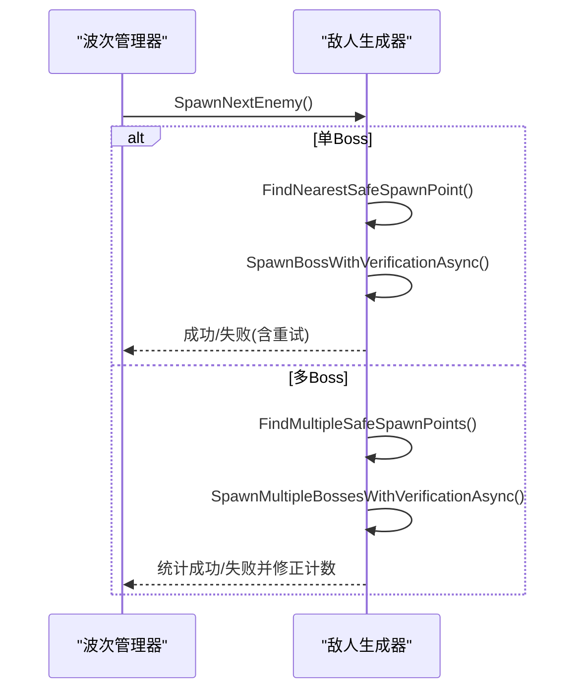
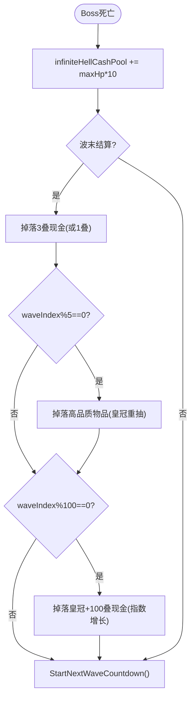
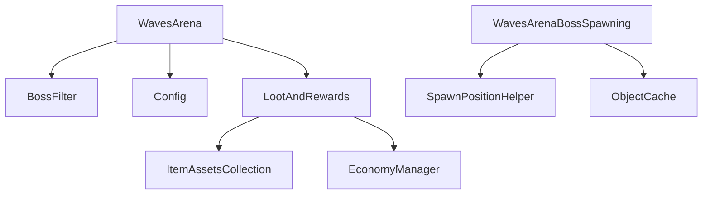

# 标准 BossRush 模式

<cite>
**本文引用的文件**
- [WavesArena.cs](file://WavesArena/WavesArena.cs)
- [WavesArenaBossSpawning.cs](file://WavesArena/WavesArenaBossSpawning.cs)
- [WavesArenaSpawnerControl.cs](file://WavesArena/WavesArenaSpawnerControl.cs)
- [LootAndRewards.cs](file://LootAndRewards/LootAndRewards.cs)
- [LootAndRewardsInfiniteHell.cs](file://LootAndRewards/LootAndRewardsInfiniteHell.cs)
- [Config.cs](file://Config/Config.cs)
- [BossFilter.cs](file://BossFilter/BossFilter.cs)
- [README.md](file://README.md)
</cite>

## 目录
1. [简介](#简介)
2. [项目结构](#项目结构)
3. [核心组件](#核心组件)
4. [架构总览](#架构总览)
5. [详细组件分析](#详细组件分析)
6. [依赖关系分析](#依赖关系分析)
7. [性能考量](#性能考量)
8. [故障排查指南](#故障排查指南)
9. [结论](#结论)
10. [附录：配置与自定义](#附录配置与自定义)

## 简介
本文件系统化说明标准 BossRush 模式的实现机制，覆盖三种难度级别（弹指可灭、有点意思、无间炼狱）的波次管理、敌人生成算法、难度调节、奖励分配、前期 Boss 排除逻辑、多 Boss 同波支持、波次间隔倒计时、里程碑休息奖励，以及无间炼狱的权重随机选择与现金池系统。同时提供各难度的配置项与自定义方法，帮助玩家与开发者快速理解与调优体验。

## 项目结构
BossRush 相关代码集中在以下模块：
- 波次与竞技场：WavesArena 系列负责波次流程、倒计时、敌人生成与生命周期管理。
- 掉落与奖励：LootAndRewards 系列负责 Boss 掉落、通关奖励箱、无间炼狱现金池与里程碑奖励。
- 配置系统：Config 提供本地文件与 ModConfig 动态配置加载、保存与热更新。
- Boss 筛选器：BossFilter 提供 Boss 池启用/禁用与无间炼狱权重因子编辑 UI。
- 地图与刷怪点：通过配置系统获取当前场景刷怪点与默认路牌位置。

图表来源
- [WavesArena.cs:108-184](file://WavesArena/WavesArena.cs#L108-L184)
- [WavesArenaBossSpawning.cs:346-473](file://WavesArena/WavesArenaBossSpawning.cs#L346-L473)
- [WavesArenaSpawnerControl.cs:21-81](file://WavesArena/WavesArenaSpawnerControl.cs#L21-L81)
- [LootAndRewards.cs:300-310](file://LootAndRewards/LootAndRewards.cs#L300-L310)
- [LootAndRewardsInfiniteHell.cs:30-308](file://LootAndRewards/LootAndRewardsInfiniteHell.cs#L30-L308)
- [BossFilter.cs:197-232](file://BossFilter/BossFilter.cs#L197-L232)
- [Config.cs:41-81](file://Config/Config.cs#L41-L81)

章节来源
- [README.md:29-61](file://README.md#L29-L61)

## 核心组件
- 波次管理器：负责开始挑战、计算波次间隔、里程碑休息奖励、倒计时横幅、推进下一波或结束挑战。
- 敌人生成器：按单波或多波生成 Boss，支持安全刷怪点选择、批量分配不重复位置、失败重试与位置校验。
- 掉落与奖励：追踪 Boss 掉落、生成通关奖励箱；无间炼狱模式下发放现金、每5波高品质物品、每100波递进里程碑奖励。
- 配置系统：集中管理波次间隔、随机掉落开关、原版概率、交互点开启下一波、掉落箱掩体、无间炼狱每波 Boss 数、Boss 数值倍率、里程碑额外休息时间等。
- Boss 筛选器：启用/禁用 Boss，调整无间炼狱中每个 Boss 的出现权重因子，并持久化到配置文件。

章节来源
- [WavesArena.cs:108-184](file://WavesArena/WavesArena.cs#L108-L184)
- [WavesArenaBossSpawning.cs:346-473](file://WavesArena/WavesArenaBossSpawning.cs#L346-L473)
- [LootAndRewards.cs:300-310](file://LootAndRewards/LootAndRewards.cs#L300-L310)
- [LootAndRewardsInfiniteHell.cs:30-308](file://LootAndRewards/LootAndRewardsInfiniteHell.cs#L30-L308)
- [Config.cs:41-81](file://Config/Config.cs#L41-L81)
- [BossFilter.cs:197-232](file://BossFilter/BossFilter.cs#L197-L232)

## 架构总览
BossRush 的核心流程如下：
- 进入挑战后，打乱 Boss 池顺序并进行前期强力 Boss 排除（前20波）。
- 根据难度模式决定每波 Boss 数量与生成策略。
- 每波结束后触发掉落与奖励处理，普通模式推进至下一波或通关；无间炼狱持续循环并发放现金与里程碑奖励。
- 配置项可在运行时热更新，影响倒计时与行为。

图表来源
- [WavesArenaBossSpawning.cs:19-107](file://WavesArena/WavesArenaBossSpawning.cs#L19-L107)
- [WavesArena.cs:108-184](file://WavesArena/WavesArena.cs#L108-L184)
- [LootAndRewardsInfiniteHell.cs:30-308](file://LootAndRewards/LootAndRewardsInfiniteHell.cs#L30-L308)
- [Config.cs:586-704](file://Config/Config.cs#L586-L704)

## 详细组件分析

### 波次管理与倒计时
- 波次间隔与里程碑休息：每波间隔由配置决定；每5波完成时若配置了额外休息时间，则延长倒计时并显示提示。
- 倒计时横幅：非无间炼狱模式下会预告下一波 Boss 名称；倒计时不足1秒时强制为1秒。
- 推进逻辑：所有 Boss 被击败后，通知快递员战斗结束，递增索引，判断是否还有下一波；若无则通关。

图表来源
- [WavesArena.cs:108-184](file://WavesArena/WavesArena.cs#L108-L184)

章节来源
- [WavesArena.cs:108-184](file://WavesArena/WavesArena.cs#L108-L184)

### 敌人生成算法与安全刷怪点
- 单波/多波生成：单波直接生成一个 Boss；多波同一波生成 bossesPerWave 个相同 Boss（无间炼狱下每波可独立随机不同 Boss）。
- 安全刷怪点：优先选择距玩家一定距离外的点，避免太近；批量生成时为每个 Boss 分配不同的安全位置，防止重叠。
- 重试与校验：生成失败最多重试三次；生成后延迟校验位置，若发现地下或虚空则尝试恢复至最近刷怪点。

图表来源
- [WavesArenaBossSpawning.cs:117-251](file://WavesArena/WavesArenaBossSpawning.cs#L117-L251)
- [WavesArenaBossSpawning.cs:346-473](file://WavesArena/WavesArenaBossSpawning.cs#L346-L473)
- [WavesArenaBossSpawning.cs:478-661](file://WavesArena/WavesArenaBossSpawning.cs#L478-L661)

章节来源
- [WavesArenaBossSpawning.cs:117-251](file://WavesArena/WavesArenaBossSpawning.cs#L117-L251)
- [WavesArenaBossSpawning.cs:346-473](file://WavesArena/WavesArenaBossSpawning.cs#L346-L473)
- [WavesArenaBossSpawning.cs:478-661](file://WavesArena/WavesArenaBossSpawning.cs#L478-L661)

### 难度调节系统与前期 Boss 排除
- 难度级别：
  - 弹指可灭：每波1个 Boss，适合新手。
  - 有点意思：每波3个 Boss，标准多目标战斗。
  - 无间炼狱：无限波次，每波 Boss 数由配置决定，带现金池与自动吸附。
- 前期排除：挑战开始时对 Boss 池进行洗牌，并将前20波中的强力 Boss（如口口口口、四骑士、龙裔遗族、焚天龙皇）与后续普通 Boss 交换，确保前期体验平滑。

章节来源
- [WavesArenaBossSpawning.cs:19-107](file://WavesArena/WavesArenaBossSpawning.cs#L19-L107)
- [WavesArena.cs:42-104](file://WavesArena/WavesArena.cs#L42-L104)
- [README.md:29-35](file://README.md#L29-L35)

### 多 Boss 模式支持与波次推进
- 多 Boss 同波：维护 currentWaveBosses 列表与剩余计数；任一 Boss 死亡从列表中移除，当剩余为0时推进下一波。
- 生成失败处理：若某 Boss 生成失败，减少当前波剩余计数；若全部失败则跳过本波并推进。
- 卡波自检：定期检测当前波是否有存活 Boss；若无则强制修正并推进，避免卡关。

章节来源
- [WavesArena.cs:209-346](file://WavesArena/WavesArena.cs#L209-L346)
- [WavesArenaBossSpawning.cs:511-549](file://WavesArena/WavesArenaBossSpawning.cs#L511-L549)
- [WavesArenaSpawnerControl.cs:141-251](file://WavesArena/WavesArenaSpawnerControl.cs#L141-L251)

### 掉落与奖励机制
- Boss 掉落追踪：注册 Boss 死亡前事件，记录原始掉落数量，用于后续随机化或保底逻辑。
- 通关奖励箱：所有敌人击败后生成难度奖励箱，包含高品质物品与现金。
- 黑名单过滤：掉落候选排除特定标签与黑名单物品，保证掉落质量与合规性。

章节来源
- [LootAndRewards.cs:322-432](file://LootAndRewards/LootAndRewards.cs#L322-L432)
- [LootAndRewards.cs:605-663](file://LootAndRewards/LootAndRewards.cs#L605-L663)

### 无间炼狱：权重随机选择与现金池
- 权重随机选择：
  - 基于基础血量归一化 t 与波次项 waveTerm = infiniteHellWaveIndex / 50 计算权重 w = 1 + t*baseK + waveTerm*t。
  - 应用用户配置的 bossInfiniteHellFactors 作为乘数，最终累计权重抽样。
  - 若无有效血量范围，退化为仅按因子权重随机。
- 现金池系统：
  - 每击杀一个 Boss，按最大生命值累加现金池（maxHp * 10），并在波末掉落3叠现金（或1叠）。
  - 每5波掉落一个高品质物品（优先价格≥10000，皇冠有重抽概率）。
  - 每100波递进里程碑奖励：皇冠数量与现金总额按 2^(tier-1) 增长，分批次掉落。

图表来源
- [WavesArena.cs:348-441](file://WavesArena/WavesArena.cs#L348-L441)
- [WavesArena.cs:643-742](file://WavesArena/WavesArena.cs#L643-L742)
- [LootAndRewardsInfiniteHell.cs:30-308](file://LootAndRewards/LootAndRewardsInfiniteHell.cs#L30-L308)

章节来源
- [WavesArena.cs:643-742](file://WavesArena/WavesArena.cs#L643-L742)
- [LootAndRewardsInfiniteHell.cs:30-308](file://LootAndRewards/LootAndRewardsInfiniteHell.cs#L30-L308)

### 配置选项与自定义方法
- 全局配置项：
  - waveIntervalSeconds：波次间隔（2-60秒，默认15秒）。
  - enableRandomBossLoot：Boss 掉落随机化开关。
  - useLegacyBossLootProbabilities：使用原版 Boss 战利品概率。
  - useInteractBetweenWaves：波次间使用交互点开启下一波。
  - lootBoxBlocksBullets：掉落箱作为掩体。
  - infiniteHellBossesPerWave：无间炼狱每波 Boss 数（1-10，默认3）。
  - bossStatMultiplier：Boss 全局数值倍率（0.1-10，默认1）。
  - milestoneRestBonusSeconds：每5波额外休息时间（0-120秒，默认30秒）。
  - modeDEnemiesPerWave：白手起家每波敌人数（1-10，默认3）。
  - enableMutators / mutatorCount：变异词条开关与数量。
- 自定义方式：
  - 本地文件：StreamingAssets/BossRushModConfig.txt，JSON 格式。
  - ModConfig 模组：通过反射加载与热更新，支持运行时修改并立即生效（如波次间隔）。
  - Boss 筛选器：Ctrl+F10 打开面板，禁用 Boss 或调整无间炼狱权重因子（极低/低/中/高/极高）。

章节来源
- [Config.cs:41-81](file://Config/Config.cs#L41-L81)
- [Config.cs:155-232](file://Config/Config.cs#L155-L232)
- [Config.cs:234-407](file://Config/Config.cs#L234-L407)
- [Config.cs:586-704](file://Config/Config.cs#L586-L704)
- [BossFilter.cs:85-158](file://BossFilter/BossFilter.cs#L85-L158)
- [BossFilter.cs:329-346](file://BossFilter/BossFilter.cs#L329-L346)

## 依赖关系分析
- WavesArena 依赖 BossFilter 获取过滤后的 Boss 列表，依赖 Config 读取配置，依赖 LootAndRewards 处理掉落与奖励。
- WavesArenaBossSpawning 依赖 SpawnPositionHelper 与 ObjectCache 获取安全刷怪点与场景数据。
- LootAndRewards 依赖 ItemAssetsCollection 与 EconomyManager 生成物品与现金。
- 配置系统通过反射与 ModConfig 集成，支持热更新并持久化到本地文件。

图表来源
- [WavesArena.cs:108-184](file://WavesArena/WavesArena.cs#L108-L184)
- [WavesArenaBossSpawning.cs:117-251](file://WavesArena/WavesArenaBossSpawning.cs#L117-L251)
- [LootAndRewards.cs:605-663](file://LootAndRewards/LootAndRewards.cs#L605-L663)
- [Config.cs:234-407](file://Config/Config.cs#L234-L407)

章节来源
- [WavesArena.cs:108-184](file://WavesArena/WavesArena.cs#L108-L184)
- [WavesArenaBossSpawning.cs:117-251](file://WavesArena/WavesArenaBossSpawning.cs#L117-L251)
- [LootAndRewards.cs:605-663](file://LootAndRewards/LootAndRewards.cs#L605-L663)
- [Config.cs:234-407](file://Config/Config.cs#L234-L407)

## 性能考量
- 敌人预设初始化缓存：避免每次传送重复扫描，提升启动效率。
- 分帧销毁场景刷怪点：将大量 GameObject 销毁分散到多帧，避免过图卡顿。
- 掉落候选预缓存：异步分帧构建物品价值缓存，减少 Boss 死亡时的同步实例化开销。
- 安全刷怪点批量分配：为多 Boss 同波分配不同位置，减少碰撞与重试。

章节来源
- [WavesArena.cs:551-641](file://WavesArena/WavesArena.cs#L551-L641)
- [WavesArenaSpawnerControl.cs:21-81](file://WavesArena/WavesArenaSpawnerControl.cs#L21-L81)
- [LootAndRewards.cs:490-586](file://LootAndRewards/LootAndRewards.cs#L490-L586)

## 故障排查指南
- 生成失败：检查刷怪点是否为空、玩家是否存在；查看日志中“生成失败”与重试次数。
- 卡波：若当前波无存活 Boss，系统会自动修正并推进；可检查 TryFixStuckWaveIfNoBossAlive 日志。
- 掉落异常：确认掉落黑名单与标签过滤是否正确；查看物品价值缓存初始化日志。
- 配置未生效：确认 ModConfig 键名与范围限制；检查热更新回调是否触发。

章节来源
- [WavesArenaBossSpawning.cs:346-473](file://WavesArena/WavesArenaBossSpawning.cs#L346-L473)
- [WavesArenaSpawnerControl.cs:141-251](file://WavesArena/WavesArenaSpawnerControl.cs#L141-L251)
- [LootAndRewards.cs:246-262](file://LootAndRewards/LootAndRewards.cs#L246-L262)
- [Config.cs:586-704](file://Config/Config.cs#L586-L704)

## 结论
标准 BossRush 模式通过模块化设计实现了灵活的波次管理、安全的敌人生成、丰富的奖励机制与强大的配置系统。三种难度级别满足不同玩家需求，无间炼狱的权重随机与现金池提供了高重玩性与成长反馈。通过 Boss 筛选器与配置热更新，玩家可以精细调优体验，开发者也可便捷扩展内容。

## 附录：配置与自定义
- 配置文件路径：StreamingAssets/BossRushModConfig.txt（JSON 格式）。
- 关键配置项：
  - waveIntervalSeconds：波次间隔（2-60秒）。
  - milestoneRestBonusSeconds：每5波额外休息时间（0-120秒）。
  - infiniteHellBossesPerWave：无间炼狱每波 Boss 数（1-10）。
  - bossStatMultiplier：Boss 数值倍率（0.1-10）。
  - enableMutators / mutatorCount：变异词条开关与数量。
- 自定义步骤：
  - 编辑本地配置文件或使用 ModConfig 界面。
  - 打开 Boss 筛选器（Ctrl+F10）禁用 Boss 或调整无间炼狱权重因子。
  - 重启或热更新后生效，观察日志确认配置加载。

章节来源
- [Config.cs:41-81](file://Config/Config.cs#L41-L81)
- [Config.cs:155-232](file://Config/Config.cs#L155-L232)
- [BossFilter.cs:85-158](file://BossFilter/BossFilter.cs#L85-L158)
- [BossFilter.cs:329-346](file://BossFilter/BossFilter.cs#L329-L346)