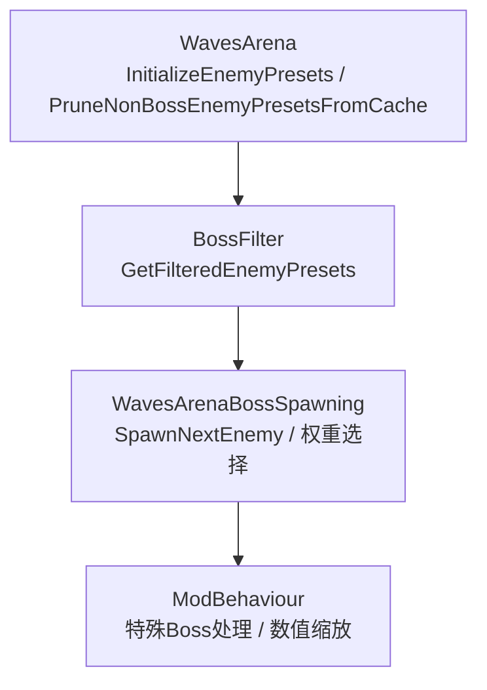
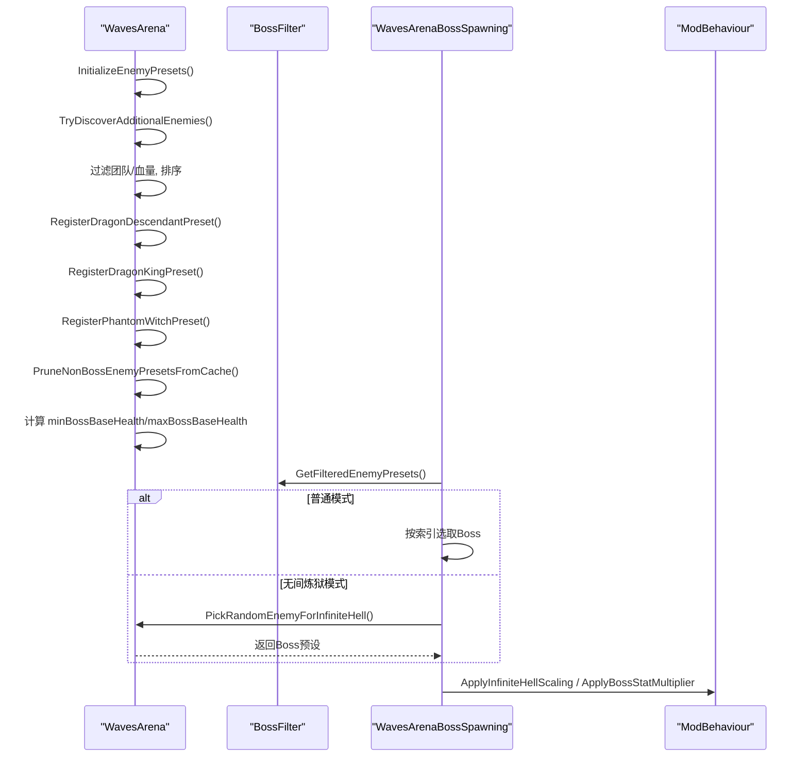
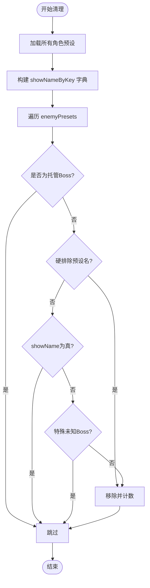
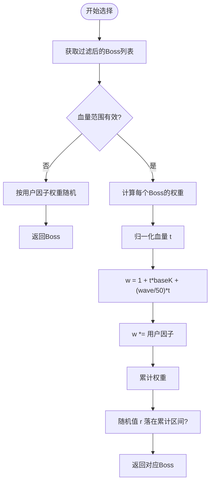
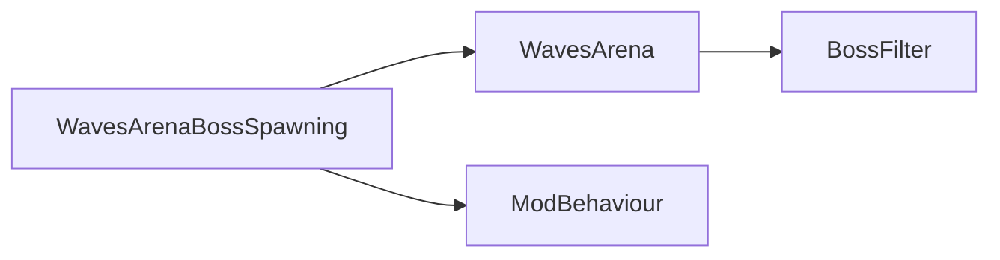

# Boss池管理

<cite>
**本文引用的文件**
- [WavesArena.cs](file://WavesArena/WavesArena.cs)
- [BossFilter.cs](file://BossFilter/BossFilter.cs)
- [WavesArenaBossSpawning.cs](file://WavesArena/WavesArenaBossSpawning.cs)
- [ModBehaviour.cs](file://ModBehaviour.cs)
</cite>

## 目录
1. [简介](#简介)
2. [项目结构](#项目结构)
3. [核心组件](#核心组件)
4. [架构总览](#架构总览)
5. [详细组件分析](#详细组件分析)
6. [依赖关系分析](#依赖关系分析)
7. [性能考量](#性能考量)
8. [故障排查指南](#故障排查指南)
9. [结论](#结论)

## 简介
本文件聚焦于Boss池管理系统，围绕以下目标展开：
- 深入解析 InitializeEnemyPresets 的实现：动态敌人类型发现、团队类型过滤、基础生命值排序。
- 说明Boss池的动态调整机制：PruneNonBossEnemyPresetsFromCache 的缓存清理逻辑与Boss池基础血量范围计算。
- 解释无间炼狱模式下的权重随机选择算法 PickRandomEnemyForInfiniteHell：基于血量的权重计算与用户因子应用。
- 阐述Boss池过滤器的集成：GetFilteredEnemyPresets 的使用方式与缓存策略。
- 提供Boss池性能优化技巧：初始化标记的使用与重复扫描避免。

## 项目结构
Boss池相关能力分布在以下模块：
- WavesArena：波次与竞技场管理，包含敌人预设初始化、筛选、血量范围计算、无间炼狱权重选择等核心逻辑。
- BossFilter：Boss池筛选器，负责启用/禁用Boss、维护用户配置、提供过滤后的Boss列表并缓存结果。
- WavesArenaBossSpawning：Boss生成流程，调用过滤后的Boss池进行单波或多波生成，支持重试与位置校验。
- ModBehaviour：通用行为与辅助方法（如特殊Boss识别、数值倍率应用等）。

图表来源
- [WavesArena.cs:555-641](file://WavesArena/WavesArena.cs#L555-L641)
- [BossFilter.cs:201-223](file://BossFilter/BossFilter.cs#L201-L223)
- [WavesArenaBossSpawning.cs:346-395](file://WavesArena/WavesArenaBossSpawning.cs#L346-L395)
- [ModBehaviour.cs:1212-1243](file://ModBehaviour.cs#L1212-L1243)

章节来源
- [WavesArena.cs:555-641](file://WavesArena/WavesArena.cs#L555-L641)
- [BossFilter.cs:201-223](file://BossFilter/BossFilter.cs#L201-L223)
- [WavesArenaBossSpawning.cs:346-395](file://WavesArena/WavesArenaBossSpawning.cs#L346-L395)
- [ModBehaviour.cs:1212-1243](file://ModBehaviour.cs#L1212-L1243)

## 核心组件
- 敌人预设初始化：InitializeEnemyPresets
  - 动态发现所有显示名称的敌人类型（通过 ObjectCache.GetCharacterPresets）。
  - 团队类型过滤：排除玩家与中立阵营，仅保留 baseHealth > 100f 的敌人。
  - 排序：按 team 升序，再按 baseHealth 升序。
  - 注册特殊Boss：龙裔遗族、龙王、幽灵女巫。
  - 清理非Boss预设：PruneNonBossEnemyPresetsFromCache。
  - 计算Boss池基础血量范围：minBossBaseHealth、maxBossBaseHealth。
  - 性能优化：使用 _enemyPresetsInitialized 标记避免重复扫描。

- Boss池过滤器：BossFilter
  - GetFilteredEnemyPresets：返回启用状态的Boss列表，带缓存与脏标记。
  - 持久化：保存禁用的Boss与无间炼狱因子到配置。
  - UI：打开/关闭Boss池配置窗口，支持全选/全不选与因子编辑。

- 无间炼狱权重选择：PickRandomEnemyForInfiniteHell
  - 基于血量归一化的权重：t = (h - refMin)/(refMax - refMin)，w = 1 + t*baseK + (wave/50)*t。
  - 用户因子：每个Boss可设置出现权重倍率，最终 w *= userFactor。
  - 回退：若无有效血量范围或总权重为0，则均匀随机。

- 生成流程：WavesArenaBossSpawning.SpawnNextEnemy
  - 普通模式：按顺序从过滤后的Boss池选取。
  - 无间炼狱模式：每波调用 PickRandomEnemyForInfiniteHell 选择Boss。
  - 多Boss同波：批量分配安全刷怪点，串行生成+重试。

章节来源
- [WavesArena.cs:555-641](file://WavesArena/WavesArena.cs#L555-L641)
- [WavesArena.cs:648-742](file://WavesArena/WavesArena.cs#L648-L742)
- [BossFilter.cs:201-223](file://BossFilter/BossFilter.cs#L201-L223)
- [WavesArenaBossSpawning.cs:346-395](file://WavesArena/WavesArenaBossSpawning.cs#L346-L395)

## 架构总览
Boss池管理的整体数据流如下：
- 初始化阶段：InitializeEnemyPresets 动态发现敌人、过滤团队、排序、注册特殊Boss、清理非Boss预设、计算血量范围。
- 运行时阶段：GetFilteredEnemyPresets 提供启用状态的Boss列表；SpawnNextEnemy 根据模式选择Boss；PickRandomEnemyForInfiniteHell 在无间炼狱模式下按权重随机选择。
- 清理阶段：PruneNonBossEnemyPresetsFromCache 定期清理误入的非Boss预设，保持Boss池纯净。

图表来源
- [WavesArena.cs:555-641](file://WavesArena/WavesArena.cs#L555-L641)
- [WavesArena.cs:648-742](file://WavesArena/WavesArena.cs#L648-L742)
- [WavesArenaBossSpawning.cs:346-395](file://WavesArena/WavesArenaBossSpawning.cs#L346-L395)
- [ModBehaviour.cs:1212-1243](file://ModBehaviour.cs#L1212-L1243)

## 详细组件分析

### InitializeEnemyPresets 实现细节
- 动态敌人类型发现：
  - 通过 ObjectCache.GetCharacterPresets 获取所有角色预设。
  - 跳过运行时克隆预设（IsRuntimeCharacterPresetClone）。
  - 仅纳入 showName=true 的预设（或特殊未知Boss白名单）。
  - 硬排除特定预设名（IsBossPoolHardExcludedPresetName）。
  - 去重：按 nameKey 避免重复添加。
  - 提取信息：name、displayName、team、baseHealth、baseDamage。

- 团队类型过滤与排序：
  - 过滤条件：team != player 且 team != middle 且 baseHealth > 100f。
  - 排序：OrderBy(team).ThenBy(baseHealth)。

- 特殊Boss注册：
  - 龙裔遗族、龙王、幽灵女巫通过专用注册方法加入Boss池。

- 缓存清理与血量范围计算：
  - PruneNonBossEnemyPresetsFromCache 清理非Boss预设。
  - 遍历 enemyPresets 计算 minBossBaseHealth 与 maxBossBaseHealth。

- 性能优化：
  - 使用 _enemyPresetsInitialized 标记，避免重复扫描。
  - 本地化 ToPlainText 反射结果缓存，减少反射开销。

章节来源
- [WavesArena.cs:555-641](file://WavesArena/WavesArena.cs#L555-L641)
- [WavesArena.cs:870-936](file://WavesArena/WavesArena.cs#L870-L936)
- [WavesArena.cs:938-1003](file://WavesArena/WavesArena.cs#L938-L1003)

### PruneNonBossEnemyPresetsFromCache 缓存清理
- 目的：清理误入Boss池的非Boss预设（例如Mode E/F临时生成的杂兵）。
- 逻辑：
  - 构建 showNameByKey 字典，记录每个nameKey是否显示名称。
  - 遍历 enemyPresets，若preset未显示名称且不在特殊白名单，则移除。
  - 硬排除预设名直接移除。
  - 统计移除数量并记录日志。

图表来源
- [WavesArena.cs:775-865](file://WavesArena/WavesArena.cs#L775-L865)

章节来源
- [WavesArena.cs:775-865](file://WavesArena/WavesArena.cs#L775-L865)

### 无间炼狱权重随机选择：PickRandomEnemyForInfiniteHell
- 输入：过滤后的Boss列表、当前波次 infiniteHellWaveIndex、血量范围 minBossBaseHealth/maxBossBaseHealth。
- 权重计算：
  - 归一化血量 t = Clamp((h - refMin)/(refMax - refMin), 0, 1)。
  - 基础权重 w = 1 + t * baseK + (wave/50) * t，其中 baseK=4。
  - 用户因子：w *= GetBossInfiniteHellFactor(name)。
- 抽样：累计权重随机选择，若总权重<=0则均匀随机。
- 回退：若无有效血量范围，仅按用户因子权重随机。

图表来源
- [WavesArena.cs:648-742](file://WavesArena/WavesArena.cs#L648-L742)
- [BossFilter.cs:332-346](file://BossFilter/BossFilter.cs#L332-L346)

章节来源
- [WavesArena.cs:648-742](file://WavesArena/WavesArena.cs#L648-L742)
- [BossFilter.cs:332-346](file://BossFilter/BossFilter.cs#L332-L346)

### Boss池过滤器集成：GetFilteredEnemyPresets
- 功能：返回启用状态的Boss列表，带缓存与脏标记。
- 缓存策略：
  - 若 _filteredPresetsCacheDirty=false 且缓存存在，直接返回缓存。
  - 当启用状态变化时，标记缓存为脏，下次访问重新计算。
- 集成点：
  - 波次倒计时、生成下一波、完成推进等均使用此方法确保一致性。

章节来源
- [BossFilter.cs:201-223](file://BossFilter/BossFilter.cs#L201-L223)
- [WavesArena.cs:134-143](file://WavesArena/WavesArena.cs#L134-L143)
- [WavesArenaBossSpawning.cs:358-366](file://WavesArena/WavesArenaBossSpawning.cs#L358-L366)

### 生成流程与多Boss支持
- 单Boss模式：按顺序或权重选择后，调用 SpawnEnemyAtPositionAsync。
- 多Boss模式：同一波生成多个相同Boss，批量分配安全刷怪点，串行生成+重试。
- 位置校验：延迟校验Boss位置，防止低配地形加载慢导致Boss卡在地下。

章节来源
- [WavesArenaBossSpawning.cs:346-473](file://WavesArena/WavesArenaBossSpawning.cs#L346-L473)
- [WavesArenaBossSpawning.cs:478-661](file://WavesArena/WavesArenaBossSpawning.cs#L478-L661)

## 依赖关系分析
- WavesArena 依赖 BossFilter 提供的过滤列表。
- WavesArenaBossSpawning 依赖 WavesArena 的初始化与选择逻辑。
- ModBehaviour 提供特殊Boss识别与数值缩放。

图表来源
- [WavesArena.cs:555-641](file://WavesArena/WavesArena.cs#L555-L641)
- [BossFilter.cs:201-223](file://BossFilter/BossFilter.cs#L201-L223)
- [WavesArenaBossSpawning.cs:346-395](file://WavesArena/WavesArenaBossSpawning.cs#L346-L395)
- [ModBehaviour.cs:1212-1243](file://ModBehaviour.cs#L1212-L1243)

章节来源
- [WavesArena.cs:555-641](file://WavesArena/WavesArena.cs#L555-L641)
- [BossFilter.cs:201-223](file://BossFilter/BossFilter.cs#L201-L223)
- [WavesArenaBossSpawning.cs:346-395](file://WavesArena/WavesArenaBossSpawning.cs#L346-L395)
- [ModBehaviour.cs:1212-1243](file://ModBehaviour.cs#L1212-L1243)

## 性能考量
- 初始化标记：_enemyPresetsInitialized 避免重复扫描，提升进竞技场性能。
- 过滤缓存：_filteredPresetsCache 与 _filteredPresetsCacheDirty 减少频繁过滤计算。
- 反射缓存：ToPlainText 方法解析一次复用，降低本地化开销。
- 批量生成：多Boss模式串行生成+重试，避免并行冲突。
- 位置校验：延迟校验Boss位置，减少低配场景卡顿。

章节来源
- [WavesArena.cs:555-641](file://WavesArena/WavesArena.cs#L555-L641)
- [BossFilter.cs:201-223](file://BossFilter/BossFilter.cs#L201-L223)
- [WavesArena.cs:938-1003](file://WavesArena/WavesArena.cs#L938-L1003)
- [WavesArenaBossSpawning.cs:525-661](file://WavesArena/WavesArenaBossSpawning.cs#L525-L661)

## 故障排查指南
- Boss池为空：检查 GetFilteredEnemyPresets 返回值，确认至少启用一个Boss。
- 生成失败：查看 SpawnNextEnemy 日志，确认刷怪点与玩家位置。
- 权重异常：检查 PickRandomEnemyForInfiniteHell 的血量范围与用户因子。
- 缓存污染：运行 PruneNonBossEnemyPresetsFromCache 清理非Boss预设。

章节来源
- [WavesArenaBossSpawning.cs:358-366](file://WavesArena/WavesArenaBossSpawning.cs#L358-L366)
- [WavesArena.cs:648-742](file://WavesArena/WavesArena.cs#L648-L742)
- [WavesArena.cs:775-865](file://WavesArena/WavesArena.cs#L775-L865)

## 结论
Boss池管理系统通过动态敌人发现、团队过滤、血量排序、缓存清理与权重随机选择，实现了灵活高效的Boss生成机制。结合Boss池过滤器与性能优化策略，确保了在不同模式下的稳定表现与用户体验。建议在实际使用中关注初始化标记与缓存脏标记的正确使用，以避免重复计算与性能瓶颈。