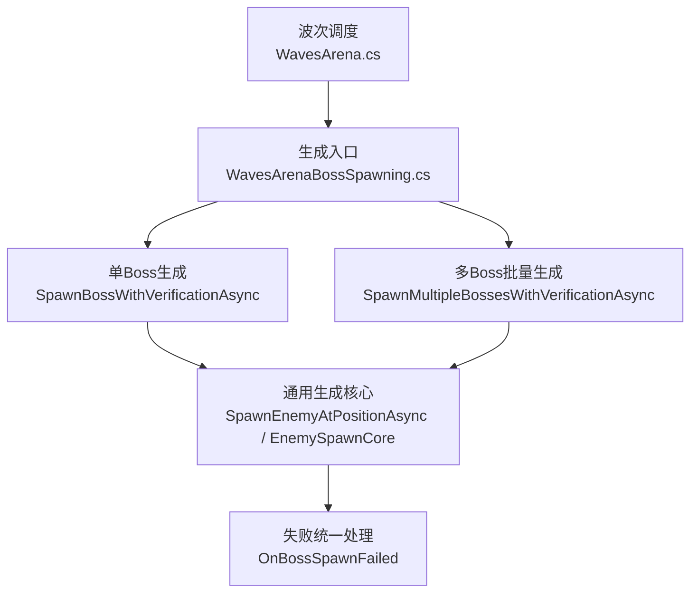
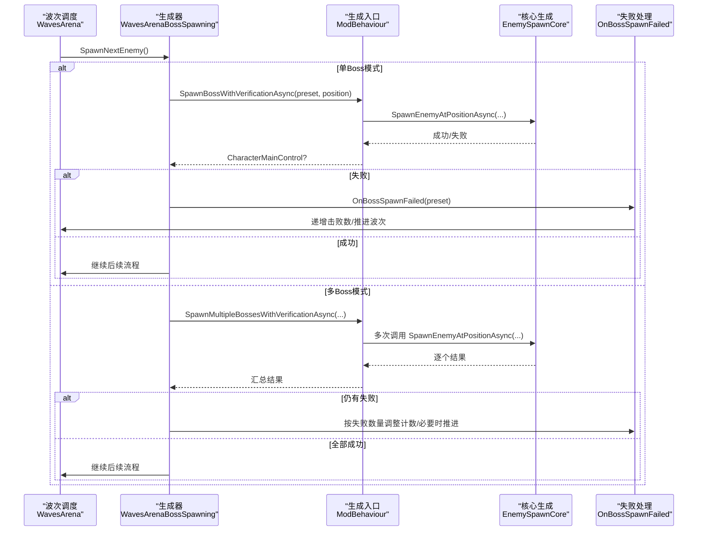
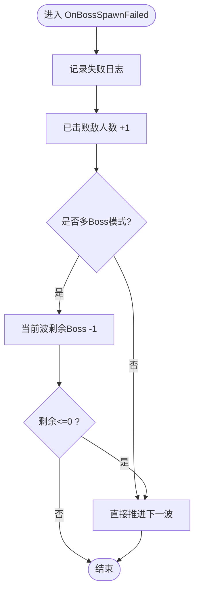
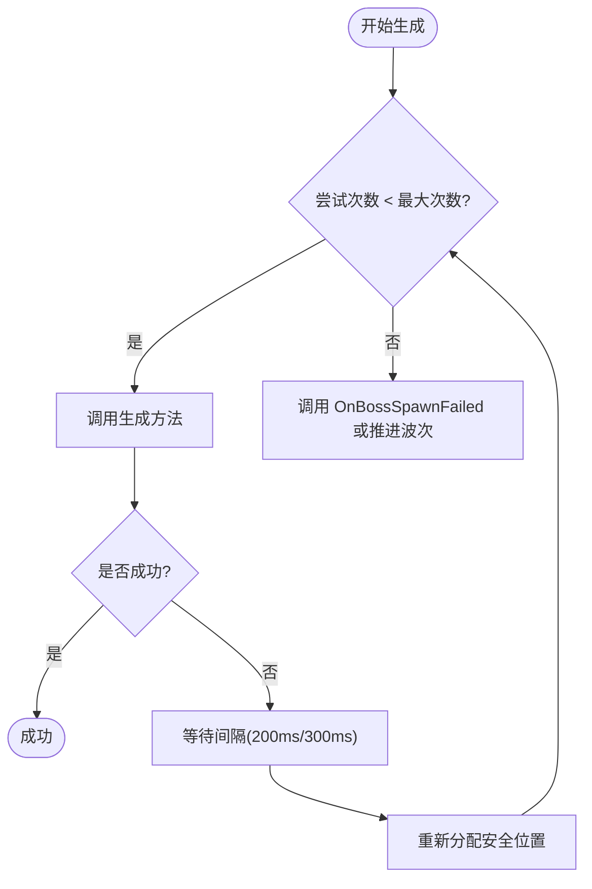
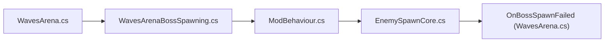

# Boss生成失败处理

<cite>
**本文引用的文件**
- [WavesArena.cs](file://WavesArena/WavesArena.cs)
- [WavesArenaBossSpawning.cs](file://WavesArena/WavesArenaBossSpawning.cs)
- [EnemySpawnCore.cs](file://Utilities/EnemySpawnCore.cs)
- [ModBehaviour.cs](file://ModBehaviour.cs)
- [ZombieModeSpawner.cs](file://ZombieMode/ZombieModeSpawner.cs)
</cite>

## 目录
1. [简介](#简介)
2. [项目结构](#项目结构)
3. [核心组件](#核心组件)
4. [架构总览](#架构总览)
5. [详细组件分析](#详细组件分析)
6. [依赖关系分析](#依赖关系分析)
7. [性能考量](#性能考量)
8. [故障排查指南](#故障排查指南)
9. [结论](#结论)

## 简介
本文聚焦于 BossRush 模组中“Boss 生成失败”的处理机制，围绕 OnBossSpawnFailed 方法展开，系统说明失败检测、重试逻辑与降级策略；解释常见失败原因（空间不足、路径阻塞、资源加载失败等）及对应处理方式；梳理重试机制的实现细节（最大重试次数、间隔时间、退避策略）；总结异常处理与日志记录的最佳实践，并提供调试信息收集与分析方法以及性能优化建议。

## 项目结构
Boss 生成失败处理涉及三个层次：
- 波次调度层：负责选择下一波敌人、触发生成流程、统计失败并推进波次。
- 生成执行层：封装具体生成过程，包含位置校验、特殊 Boss 分支、异步生成与错误捕获。
- 通用核心层：提供可复用的生成核心流程，包括预设查找、重试循环、后处理队列与提交回调。

图表来源
- [WavesArena.cs:508-549](file://WavesArena/WavesArena.cs#L508-L549)
- [WavesArenaBossSpawning.cs:475-661](file://WavesArena/WavesArenaBossSpawning.cs#L475-L661)
- [ModBehaviour.cs:1002-1206](file://ModBehaviour.cs#L1002-L1206)
- [EnemySpawnCore.cs:594-800](file://Utilities/EnemySpawnCore.cs#L594-L800)

章节来源
- [WavesArena.cs:508-549](file://WavesArena/WavesArena.cs#L508-L549)
- [WavesArenaBossSpawning.cs:475-661](file://WavesArena/WavesArenaBossSpawning.cs#L475-L661)
- [ModBehaviour.cs:1002-1206](file://ModBehaviour.cs#L1002-L1206)
- [EnemySpawnCore.cs:594-800](file://Utilities/EnemySpawnCore.cs#L594-L800)

## 核心组件
- OnBossSpawnFailed：统一处理生成失败的计数修正与波次推进。
- SpawnNextEnemy：选择预设、分配刷怪点、调用带验证的异步生成。
- SpawnBossWithVerificationAsync：单Boss重试生成，固定最大重试次数与短间隔等待。
- SpawnMultipleBossesWithVerificationAsync：多Boss批量生成，分轮重试与位置重分配。
- SpawnEnemyAtPositionAsync：通用生成入口，区分特殊 Boss（龙裔遗族、龙王、幽灵女巫）与普通预设，捕获异常并返回结果。
- EnemySpawnCore：通用生成核心，内置最多5次尝试的重试循环、后处理队列与提交回调。

章节来源
- [WavesArena.cs:508-549](file://WavesArena/WavesArena.cs#L508-L549)
- [WavesArenaBossSpawning.cs:343-661](file://WavesArena/WavesArenaBossSpawning.cs#L343-L661)
- [ModBehaviour.cs:1002-1206](file://ModBehaviour.cs#L1002-L1206)
- [EnemySpawnCore.cs:594-800](file://Utilities/EnemySpawnCore.cs#L594-L800)

## 架构总览
下图展示了从波次调度到最终失败处理的完整调用链，包括重试与降级策略。

图表来源
- [WavesArena.cs:508-549](file://WavesArena/WavesArena.cs#L508-L549)
- [WavesArenaBossSpawning.cs:475-661](file://WavesArena/WavesArenaBossSpawning.cs#L475-L661)
- [ModBehaviour.cs:1002-1206](file://ModBehaviour.cs#L1002-L1206)
- [EnemySpawnCore.cs:594-800](file://Utilities/EnemySpawnCore.cs#L594-L800)

## 详细组件分析

### OnBossSpawnFailed 实现机制
- 失败检测：由上层生成器在异步生成返回 null 或抛出异常时判定为失败，并调用此方法。
- 计数修正：将 defeatedEnemies 加一，保证总数一致；多Boss模式下减少当前波剩余Boss数量。
- 降级策略：若当前波剩余Boss数量为0，则直接推进到下一波，避免卡关。
- 日志记录：记录 preset 名称与失败事件；对日志本身进行异常保护，防止二次异常。

图表来源
- [WavesArena.cs:508-549](file://WavesArena/WavesArena.cs#L508-L549)

章节来源
- [WavesArena.cs:508-549](file://WavesArena/WavesArena.cs#L508-L549)

### 生成失败常见原因与处理方式
- 空间不足：当目标位置无法放置角色（如被障碍物占据或地面不可达），生成结果为空。处理：重试时重新选择安全距离外的最近刷怪点；多Boss批量生成时分轮重试并重新分配不同安全位置。
- 路径阻塞：AI路径或NavMesh采样导致生成点无效。处理：使用 SnapToGround 与 FindNearestSafeSpawnPoint 确保Y轴对齐与安全距离；延迟校验并在必要时恢复至最近刷怪点。
- 资源加载失败：CharacterRandomPreset.CreateCharacterAsync 或特殊Boss专用生成方法抛异常。处理：捕获异常并记录堆栈；在核心层设置 currentPreset=null 以触发下一次随机重试；超过最大尝试次数后返回失败。

章节来源
- [WavesArenaBossSpawning.cs:117-201](file://WavesArena/WavesArenaBossSpawning.cs#L117-L201)
- [WavesArenaBossSpawning.cs:253-341](file://WavesArena/WavesArenaBossSpawning.cs#L253-L341)
- [ModBehaviour.cs:1002-1206](file://ModBehaviour.cs#L1002-L1206)
- [EnemySpawnCore.cs:618-746](file://Utilities/EnemySpawnCore.cs#L618-L746)

### 重试机制实现
- 单Boss模式：
  - 最大重试次数：3次。
  - 间隔时间：每次重试前等待约200ms。
  - 位置策略：首次失败后，重新选择安全距离外最近的刷怪点。
  - 失败处理：达到上限后调用 OnBossSpawnFailed。
- 多Boss模式：
  - 第一轮串行生成所有Boss，记录失败列表。
  - 分轮重试：每轮等待约300ms，一次性为失败Boss分配不同的安全重试位置，再次尝试。
  - 最终验证：统计仍失败的数量，修正当前波计数；若全部失败则跳过本波。
- 通用核心层：
  - 最大尝试次数：5次。
  - 重试策略：每次失败时将 currentPreset 置空以触发下一次随机选取；对特殊Boss（龙裔遗族、龙王、幽灵女巫）在重试时可能跳过以避免重复或超限。
  - 后处理队列：将激活、变异词条应用、掉落追踪等延后至帧预算内完成，降低首帧压力。

图表来源
- [WavesArenaBossSpawning.cs:475-661](file://WavesArena/WavesArenaBossSpawning.cs#L475-L661)
- [EnemySpawnCore.cs:618-746](file://Utilities/EnemySpawnCore.cs#L618-L746)

章节来源
- [WavesArenaBossSpawning.cs:475-661](file://WavesArena/WavesArenaBossSpawning.cs#L475-L661)
- [EnemySpawnCore.cs:618-746](file://Utilities/EnemySpawnCore.cs#L618-L746)

### 指数退避算法评估
- 当前实现未采用指数退避算法；重试间隔为固定值（200ms/300ms）。
- 优点：简单稳定，易于控制整体节奏。
- 缺点：在高并发或瞬时资源紧张场景下，可能无法有效缓解竞争。
- 建议：如需增强鲁棒性，可在重试间隔上引入指数增长（例如 200ms * 2^(attempt-1)），并结合抖动（jitter）避免同步峰值。

章节来源
- [WavesArenaBossSpawning.cs:475-661](file://WavesArena/WavesArenaBossSpawning.cs#L475-L661)

### 异常处理与日志记录最佳实践
- 生成入口：捕获所有异常并记录堆栈，确保上层能感知失败并继续重试或降级。
- 日志保护：对日志记录本身进行 try/catch，避免二次异常影响主流程。
- 上下文信息：记录 preset 名称、尝试次数、玩家位置、刷怪点索引等关键上下文，便于定位问题。
- 特殊Boss：对龙裔遗族、龙王、幽灵女巫的专用生成方法进行独立异常捕获，分别记录失败原因。

章节来源
- [ModBehaviour.cs:1002-1206](file://ModBehaviour.cs#L1002-L1206)
- [WavesArena.cs:508-549](file://WavesArena/WavesArena.cs#L508-L549)
- [EnemySpawnCore.cs:618-746](file://Utilities/EnemySpawnCore.cs#L618-L746)

### 调试信息收集与分析
- 关键日志关键字：
  - “SpawnNextEnemy 调用”：查看波次调度状态。
  - “单Boss生成重试 #”：观察重试轮次与失败原因。
  - “批量生成完成: 本波 X 个目标Boss已全部处理”：确认批量生成结果。
  - “OnBossSpawnFailed: Boss 生成失败”：定位失败点。
- 辅助检查：
  - 刷怪点有效性：通过 FindNearestSafeSpawnPoint 与 SnapToGround 的输出判断位置是否合理。
  - 地形加载延迟：利用 DelayedBossPositionValidation 的延迟校验结果判断是否因低配设备导致卡顿。
  - 特殊Boss分支：关注专用生成方法的异常日志，识别资源或配置问题。

章节来源
- [WavesArenaBossSpawning.cs:343-661](file://WavesArena/WavesArenaBossSpawning.cs#L343-L661)
- [ModBehaviour.cs:1002-1206](file://ModBehaviour.cs#L1002-L1206)

## 依赖关系分析
- 波次调度依赖生成器：WavesArena 通过 WavesArenaBossSpawning 发起生成请求。
- 生成器依赖通用入口：WavesArenaBossSpawning 调用 ModBehaviour.SpawnEnemyAtPositionAsync。
- 通用入口依赖核心层：ModBehaviour 委托 EnemySpawnCore 完成复杂重试与后处理。
- 失败处理反向影响波次：OnBossSpawnFailed 修改计数并推进波次，形成闭环。

图表来源
- [WavesArena.cs:508-549](file://WavesArena/WavesArena.cs#L508-L549)
- [WavesArenaBossSpawning.cs:475-661](file://WavesArena/WavesArenaBossSpawning.cs#L475-L661)
- [ModBehaviour.cs:1002-1206](file://ModBehaviour.cs#L1002-L1206)
- [EnemySpawnCore.cs:594-800](file://Utilities/EnemySpawnCore.cs#L594-L800)

章节来源
- [WavesArena.cs:508-549](file://WavesArena/WavesArena.cs#L508-L549)
- [WavesArenaBossSpawning.cs:475-661](file://WavesArena/WavesArenaBossSpawning.cs#L475-L661)
- [ModBehaviour.cs:1002-1206](file://ModBehaviour.cs#L1002-L1206)
- [EnemySpawnCore.cs:594-800](file://Utilities/EnemySpawnCore.cs#L594-L800)

## 性能考量
- 帧预算与后处理：EnemySpawnCore 使用队列与帧预算拆分后处理步骤，避免首帧卡顿。
- 位置计算优化：使用缓存的安全刷怪点选择逻辑，减少重复计算。
- 批量生成稳定性：多Boss模式串行首轮生成，避免并行冲突；重试时集中分配位置，降低碰撞概率。
- 建议：
  - 考虑引入指数退避与抖动，缓解瞬时资源竞争。
  - 对高频日志进行分级输出，生产环境仅保留关键错误。
  - 监控重试次数与失败率，作为健康指标纳入遥测。

章节来源
- [EnemySpawnCore.cs:198-248](file://Utilities/EnemySpawnCore.cs#L198-L248)
- [WavesArenaBossSpawning.cs:525-661](file://WavesArena/WavesArenaBossSpawning.cs#L525-L661)

## 故障排查指南
- 常见问题定位：
  - 刷怪点无效：检查 FindNearestSafeSpawnPoint 返回值与 SnapToGround 结果。
  - 资源加载失败：查看 SpawnEnemyAtPositionAsync 与专用生成方法的异常日志。
  - 路径阻塞：结合 ValidateAndFixBossPosition 的恢复逻辑，确认是否需调整地形或NavMesh。
- 调试步骤：
  - 启用详细日志，过滤 “[BossRush]” 相关条目。
  - 观察重试轮次与失败原因，定位是否为特定预设或地图问题。
  - 使用延迟校验结果判断是否因低配设备导致地形加载慢。
- 修复建议：
  - 调整刷怪点分布，避免过于密集或靠近玩家。
  - 优化资源预加载，减少运行时加载失败。
  - 增加重试间隔或最大重试次数，提升鲁棒性。

章节来源
- [WavesArenaBossSpawning.cs:253-341](file://WavesArena/WavesArenaBossSpawning.cs#L253-L341)
- [ModBehaviour.cs:1002-1206](file://ModBehaviour.cs#L1002-L1206)

## 结论
BossRush 模组的 Boss 生成失败处理通过分层设计实现了高鲁棒性与可维护性：波次调度层负责状态管理与降级推进，生成执行层提供重试与位置校正，通用核心层封装复杂流程与后处理。当前实现采用固定间隔重试，未使用指数退避；建议在关键路径引入指数退避与抖动以提升抗干扰能力。通过完善的异常处理与日志记录，开发者可快速定位问题并进行针对性优化。