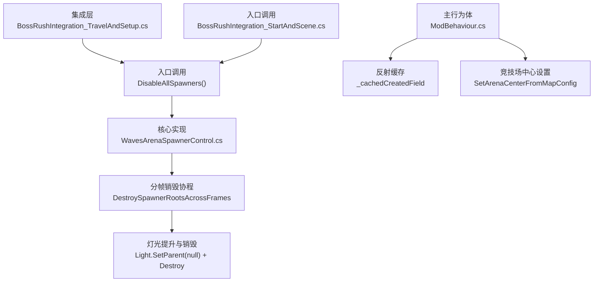
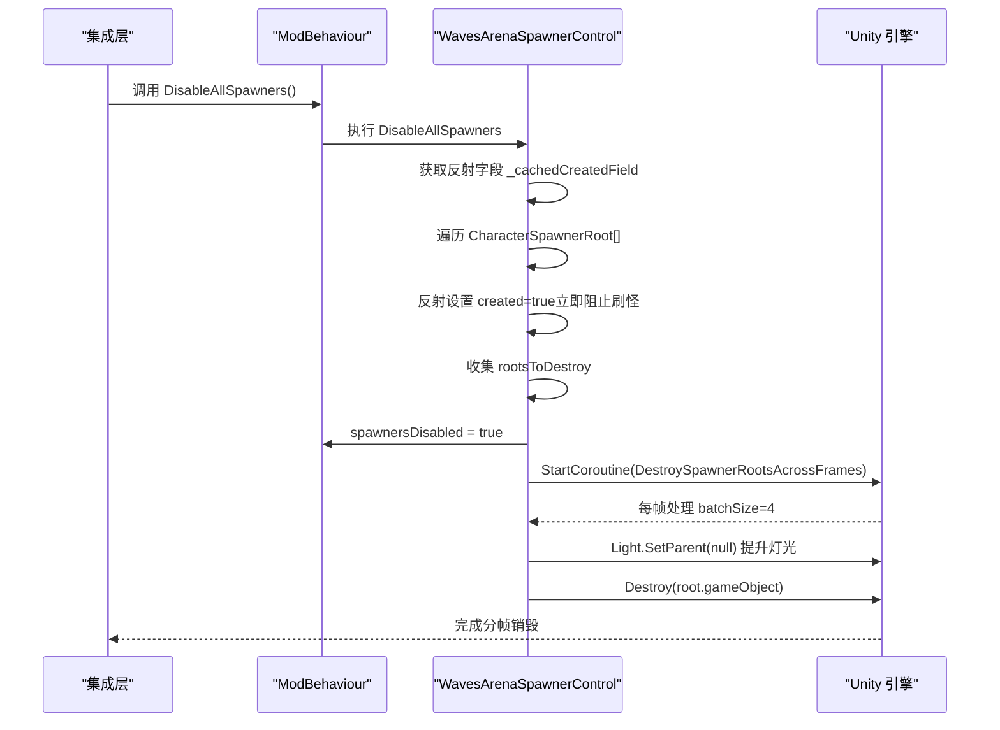
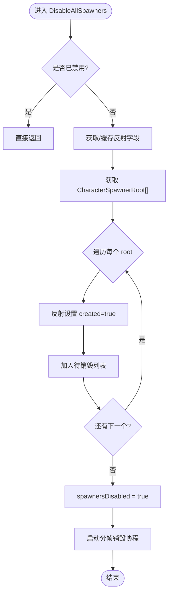
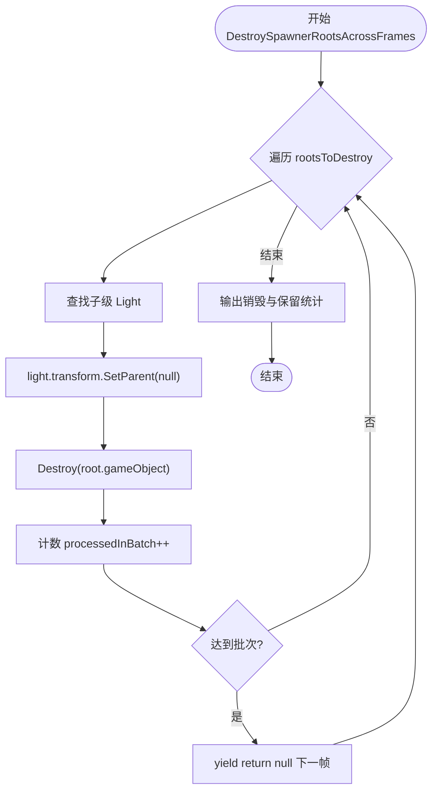
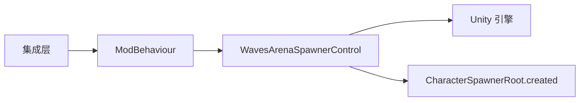

# 原生生成器禁用

<cite>
**本文引用的文件**
- [WavesArenaSpawnerControl.cs](file://WavesArena/WavesArenaSpawnerControl.cs)
- [ModBehaviour.cs](file://ModBehaviour.cs)
- [BossRushIntegration_TravelAndSetup.cs](file://Integration/BossRushIntegration_TravelAndSetup.cs)
- [BossRushIntegration_StartAndScene.cs](file://Integration/BossRushIntegration_StartAndScene.cs)
- [ZombieModeMapIsolation.cs](file://ZombieMode/ZombieModeMapIsolation.cs)
- [v2.0.2.md](file://wiki-site/docs/en/changelog/v2.0.2.md)
</cite>

## 目录
1. [简介](#简介)
2. [项目结构](#项目结构)
3. [核心组件](#核心组件)
4. [架构总览](#架构总览)
5. [详细组件分析](#详细组件分析)
6. [依赖关系分析](#依赖关系分析)
7. [性能考量](#性能考量)
8. [故障排查指南](#故障排查指南)
9. [结论](#结论)
10. [附录](#附录)

## 简介
本文聚焦于“原生生成器禁用”的实现与优化，围绕以下目标展开：
- DisableAllSpawners 方法的实现机制：通过反射访问 CharacterSpawnerRoot.created 字段，立即阻止刷怪。
- 分帧销毁策略：DestroySpawnerRootsAcrossFrames 协程的批次处理逻辑，避免过图帧卡顿。
- 灯光组件保留机制：在销毁前将子级灯光提升为场景根节点，防止场景变暗。
- 性能优化：反射缓存、批量操作、内存复用与范围限制。
- 状态监控与调试：日志输出、F3 调试菜单集成与关键指标观察。

## 项目结构
与“原生生成器禁用”直接相关的代码主要分布在以下位置：
- 入口调用：在地图加载/旅行/启动流程中触发禁用逻辑。
- 核心实现：DisableAllSpawners 与 DestroySpawnerRootsAcrossFrames。
- 辅助与上下文：竞技场中心设置、角色缓存、可复用销毁列表等。
- 兼容性约束：其他模式（如僵尸模式）需复用共享清理逻辑，避免重复实现。

**图表来源**
- [BossRushIntegration_TravelAndSetup.cs:314-400](file://Integration/BossRushIntegration_TravelAndSetup.cs#L314-L400)
- [BossRushIntegration_StartAndScene.cs:318](file://Integration/BossRushIntegration_StartAndScene.cs#L318)
- [WavesArenaSpawnerControl.cs:21-139](file://WavesArena/WavesArenaSpawnerControl.cs#L21-L139)
- [ModBehaviour.cs:530-552](file://ModBehaviour.cs#L530-L552)

**章节来源**
- [BossRushIntegration_TravelAndSetup.cs:314-400](file://Integration/BossRushIntegration_TravelAndSetup.cs#L314-L400)
- [BossRushIntegration_StartAndScene.cs:318](file://Integration/BossRushIntegration_StartAndScene.cs#L318)
- [WavesArenaSpawnerControl.cs:21-139](file://WavesArena/WavesArenaSpawnerControl.cs#L21-L139)
- [ModBehaviour.cs:530-552](file://ModBehaviour.cs#L530-L552)

## 核心组件
- DisableAllSpawners：扫描并标记所有 CharacterSpawnerRoot，立即阻止后续刷怪；随后启动分帧销毁协程。
- DestroySpawnerRootsAcrossFrames：按批次处理待销毁的 root，先提升灯光再销毁，避免单帧尖峰。
- 反射缓存：缓存 CharacterSpawnerRoot.created 字段的 FieldInfo，减少反射开销。
- 竞技场中心与范围限制：基于地图配置设置中心点，用于后续清理/禁用的范围控制。
- 可复用销毁列表：静态 List<GameObject> 复用，降低 GC 压力。

**章节来源**
- [WavesArenaSpawnerControl.cs:21-139](file://WavesArena/WavesArenaSpawnerControl.cs#L21-L139)
- [ModBehaviour.cs:530-552](file://ModBehaviour.cs#L530-L552)

## 架构总览
下图展示了从集成层到核心实现的调用链，以及分帧销毁的关键步骤。

**图表来源**
- [WavesArenaSpawnerControl.cs:21-139](file://WavesArena/WavesArenaSpawnerControl.cs#L21-L139)
- [ModBehaviour.cs:530-552](file://ModBehaviour.cs#L530-L552)

## 详细组件分析

### DisableAllSpawners 实现机制
- 反射访问 created 字段：首次调用时通过反射获取 CharacterSpawnerRoot.created 的 FieldInfo，并缓存至静态字段，后续直接使用，避免重复反射。
- 同步阻止刷怪：对每个 root 立即设置 created=true，确保过图帧不再产生新敌人。
- 分帧销毁：将销毁动作放入协程，避免一次性 Destroy 大量 GameObject 导致卡顿。
- 错误处理：对反射和销毁过程进行 try/catch，记录警告日志，保证鲁棒性。

**图表来源**
- [WavesArenaSpawnerControl.cs:21-81](file://WavesArena/WavesArenaSpawnerControl.cs#L21-L81)
- [ModBehaviour.cs:530-552](file://ModBehaviour.cs#L530-L552)

**章节来源**
- [WavesArenaSpawnerControl.cs:21-81](file://WavesArena/WavesArenaSpawnerControl.cs#L21-L81)
- [ModBehaviour.cs:530-552](file://ModBehaviour.cs#L530-L552)

### 分帧销毁策略与批次处理
- 批次大小：每帧处理固定数量（batchSize=4）的 root，平衡吞吐与帧率。
- 灯光保留：在销毁前查找所有子级 Light，并将其父节点设为 null，使其成为场景根节点，避免被销毁后场景变暗。
- 异常保护：对灯光提升与销毁分别 try/catch，记录警告日志。
- 完成统计：协程结束时输出销毁数量与保留灯光数量，便于监控。

**图表来源**
- [WavesArenaSpawnerControl.cs:87-139](file://WavesArena/WavesArenaSpawnerControl.cs#L87-L139)

**章节来源**
- [WavesArenaSpawnerControl.cs:87-139](file://WavesArena/WavesArenaSpawnerControl.cs#L87-L139)

### 灯光组件保留机制
- 问题背景：销毁 spawner root 可能连带销毁其子级灯光，导致场景变暗。
- 解决方案：在销毁前将所有子级 Light 的父节点设为 null，使其脱离原层级并被保留在场景中。
- 版本修复：v2.0.2 明确修复了“销毁 spawner 时把灯光也清理”的问题。

**章节来源**
- [WavesArenaSpawnerControl.cs:104-118](file://WavesArena/WavesArenaSpawnerControl.cs#L104-L118)
- [v2.0.2.md:6-11](file://wiki-site/docs/en/changelog/v2.0.2.md#L6-L11)

### 反射缓存与性能优化
- 反射缓存：首次获取 CharacterSpawnerRoot.created 的 FieldInfo 并缓存，避免每次调用都进行反射。
- 角色缓存：使用静态 List<CharacterMainControl> 缓存当前场景角色，定时刷新以捕获动态生成的敌人。
- 可复用销毁列表：静态 List<GameObject> 复用，减少分配与 GC。
- 范围限制：基于地图配置设置竞技场中心，用于后续清理/禁用的范围控制（半径常量定义）。

**章节来源**
- [ModBehaviour.cs:530-552](file://ModBehaviour.cs#L530-L552)

### 入口调用与生命周期
- 旅行/启动流程：在 BossRushIntegration_TravelAndSetup.cs 中多处调用 DisableAllSpawners，确保在进入相关场景前禁用原生生成器。
- 场景加载：在 BossRushIntegration_StartAndScene.cs 中触发禁用逻辑，保证场景切换后的正确性。
- 模式兼容：ZombieModeMapIsolation.cs 中调用 DisableAllSpawners，并通过测试约束复用共享清理逻辑，避免本地复制实现。

**章节来源**
- [BossRushIntegration_TravelAndSetup.cs:314-400](file://Integration/BossRushIntegration_TravelAndSetup.cs#L314-L400)
- [BossRushIntegration_StartAndScene.cs:318](file://Integration/BossRushIntegration_StartAndScene.cs#L318)
- [ZombieModeMapIsolation.cs:105](file://ZombieMode/ZombieModeMapIsolation.cs#L105)

## 依赖关系分析
- 模块耦合：
  - 集成层依赖 ModBehaviour 提供的 DisableAllSpawners。
  - 核心实现依赖 Unity 引擎 API（Object.Destroy、GetComponentsInChildren）。
  - 反射缓存依赖 CharacterSpawnerRoot 类型及其内部字段。
- 外部依赖：
  - Unity 场景系统（SceneManager、Light、GameObject）。
  - 异步协程（Coroutine）用于分帧处理。
- 潜在循环依赖：无直接循环依赖，调用方向清晰（集成 -> 行为 -> 控制 -> 引擎）。

**图表来源**
- [WavesArenaSpawnerControl.cs:21-139](file://WavesArena/WavesArenaSpawnerControl.cs#L21-L139)
- [ModBehaviour.cs:530-552](file://ModBehaviour.cs#L530-L552)

**章节来源**
- [WavesArenaSpawnerControl.cs:21-139](file://WavesArena/WavesArenaSpawnerControl.cs#L21-L139)
- [ModBehaviour.cs:530-552](file://ModBehaviour.cs#L530-L552)

## 性能考量
- 反射缓存：避免重复反射带来的性能损耗。
- 批量操作：分帧销毁采用固定批次大小，平滑帧时间。
- 内存管理：复用销毁列表，减少临时分配。
- 范围限制：基于竞技场中心与半径，缩小扫描/清理范围，降低开销。
- 日志与监控：关键路径输出统计信息，便于定位性能瓶颈。

[本节提供通用指导，不直接分析具体文件]

## 故障排查指南
- 常见问题：
  - 反射失败：检查 CharacterSpawnerRoot.created 字段是否存在及可见性。
  - 灯光丢失：确认灯光提升逻辑是否执行，必要时手动恢复场景灯光。
  - 卡顿问题：调整批次大小或检查是否有异常分支导致协程阻塞。
- 调试工具：
  - F3 调试菜单：可通过 F3 键打开，查看运行时状态与统计数据。
  - 日志输出：关注“已标记禁用 X 个 CharacterSpawnerRoot”“分帧销毁完成”等关键日志。
- 兼容性检查：
  - 其他模式（如僵尸模式）应复用共享清理逻辑，避免本地复制导致的差异。

**章节来源**
- [WavesArenaSpawnerControl.cs:51-81](file://WavesArena/WavesArenaSpawnerControl.cs#L51-L81)
- [WavesArenaSpawnerControl.cs:104-139](file://WavesArena/WavesArenaSpawnerControl.cs#L104-L139)
- [F3DebugCheatMenu.cs:107-181](file://DebugAndTools/F3DebugCheatMenu.cs#L107-L181)

## 结论
“原生生成器禁用”通过反射即时阻止刷怪、分帧销毁与灯光保留机制，在保证场景稳定性的同时兼顾性能与用户体验。反射缓存、批量操作与内存复用进一步优化了运行效率。结合 F3 调试菜单与日志输出，可有效监控与排查问题。建议在多模式环境下统一复用共享清理逻辑，确保行为一致性与维护性。

[本节总结整体发现，不直接分析具体文件]

## 附录
- 关键常量与配置：
  - 竞技场半径：ARENA_RADIUS = 500f
  - 批次大小：batchSize = 4
  - 角色缓存刷新间隔：CharacterCacheRefreshInterval = 10f
- 参考路径：
  - 入口调用：[BossRushIntegration_TravelAndSetup.cs:314-400](file://Integration/BossRushIntegration_TravelAndSetup.cs#L314-L400)
  - 核心实现：[WavesArenaSpawnerControl.cs:21-139](file://WavesArena/WavesArenaSpawnerControl.cs#L21-L139)
  - 性能优化：[ModBehaviour.cs:530-552](file://ModBehaviour.cs#L530-L552)

[本节提供补充信息，不直接分析具体文件]