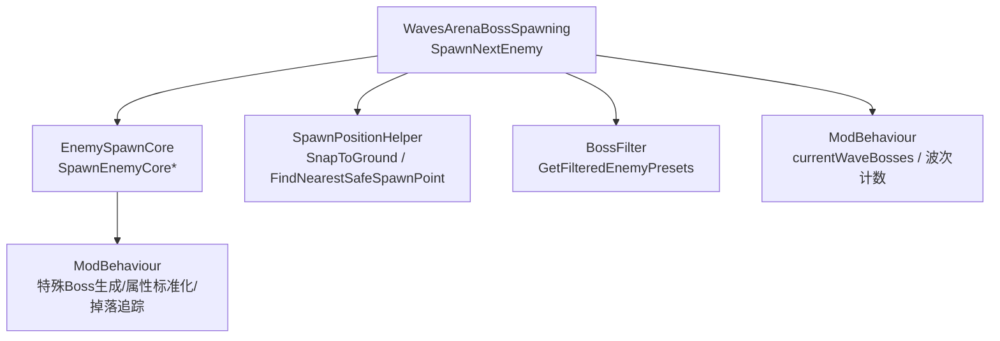
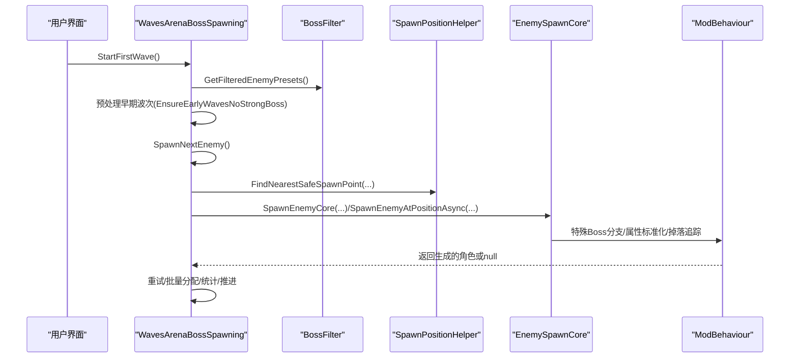
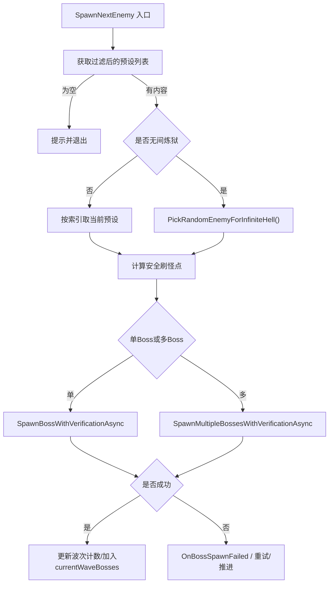
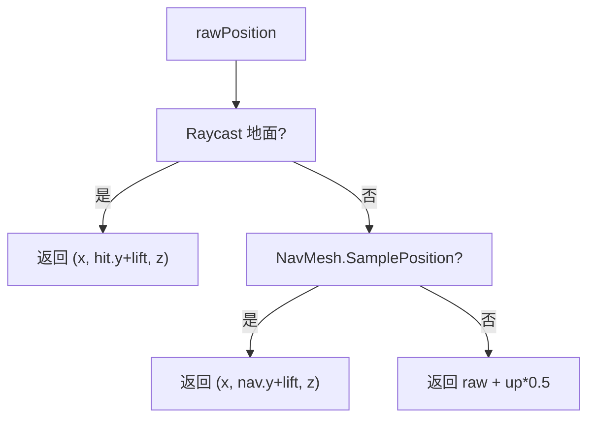
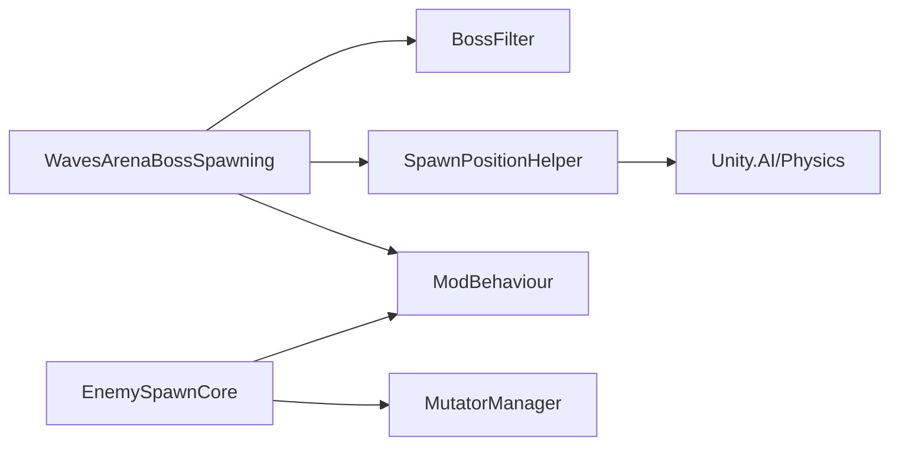

# 敌人生成调度

<cite>
**本文引用的文件**
- [ModBehaviour.cs](file://ModBehaviour.cs)
- [WavesArenaBossSpawning.cs](file://WavesArena/WavesArenaBossSpawning.cs)
- [EnemySpawnCore.cs](file://Utilities/EnemySpawnCore.cs)
- [SpawnPositionHelper.cs](file://Utilities/SpawnPositionHelper.cs)
- [BossFilter.cs](file://BossFilter/BossFilter.cs)
</cite>

## 目录
1. [简介](#简介)
2. [项目结构](#项目结构)
3. [核心组件](#核心组件)
4. [架构总览](#架构总览)
5. [详细组件分析](#详细组件分析)
6. [依赖关系分析](#依赖关系分析)
7. [性能考虑](#性能考虑)
8. [故障排查指南](#故障排查指南)
9. [结论](#结论)
10. [附录](#附录)

## 简介
本文件聚焦于“敌人生成调度系统”，围绕以下目标展开：
- 深入解析 SpawnNextEnemy 的实现机制，包括敌人预设选择、生成位置计算与失败处理。
- 说明前期 Boss 排除机制（EarlyWaveExcludedBosses）的设计目的与 EnsureEarlyWavesNoStrongBoss 的预处理逻辑。
- 解释多 Boss 模式下的生成策略，包括 bossesPerWave 的作用与 currentWaveBosses 的管理。
- 统一 Boss 生成失败处理 OnBossSpawnFailed 的流程，以及异常处理和日志记录。
- 提供自定义敌人预设的注册方法与动态发现机制。

## 项目结构
该子系统由多个协作模块构成：
- 波次与调度入口：WavesArenaBossSpawning.cs 负责启动第一波、选择下一波敌人、分配刷怪点、批量生成与重试。
- 通用生成核心：EnemySpawnCore.cs 封装跨模式的生成流程、重试、特殊 Boss 分支、后处理队列与提交回调。
- 位置工具：SpawnPositionHelper.cs 提供安全的 Y 轴修正、玩家最小距离过滤、候选环采样等几何能力。
- Boss 池筛选：BossFilter.cs 管理启用状态、过滤缓存、无间炼狱因子等。
- 主控制器：ModBehaviour.cs 聚合配置、波次状态、掉落追踪、变异词条应用、UI 提示等。

图表来源
- [WavesArenaBossSpawning.cs:346-473](file://WavesArena/WavesArenaBossSpawning.cs#L346-L473)
- [EnemySpawnCore.cs:485-592](file://Utilities/EnemySpawnCore.cs#L485-L592)
- [SpawnPositionHelper.cs:33-153](file://Utilities/SpawnPositionHelper.cs#L33-L153)
- [BossFilter.cs:197-223](file://BossFilter/BossFilter.cs#L197-L223)
- [ModBehaviour.cs:507-528](file://ModBehaviour.cs#L507-L528)

章节来源
- [WavesArenaBossSpawning.cs:346-473](file://WavesArena/WavesArenaBossSpawning.cs#L346-L473)
- [EnemySpawnCore.cs:485-592](file://Utilities/EnemySpawnCore.cs#L485-L592)
- [SpawnPositionHelper.cs:33-153](file://Utilities/SpawnPositionHelper.cs#L33-L153)
- [BossFilter.cs:197-223](file://BossFilter/BossFilter.cs#L197-L223)
- [ModBehaviour.cs:507-528](file://ModBehaviour.cs#L507-L528)

## 核心组件
- 波次调度器（WavesArenaBossSpawning）：负责按模式（普通/无间炼狱）选择预设、维护每波 Boss 数量与剩余数、分配安全刷怪点、串行/批量生成与重试、最终校验与推进。
- 通用生成核心（EnemySpawnCore）：抽象出跨模式（Mode D/E）的生成流程，包含最大重试次数、特殊 Boss 分支（龙裔遗族/龙王/幽灵女巫）、后处理队列、提交回调与失败路径。
- 位置工具（SpawnPositionHelper）：提供 Raycast/NavMesh 混合落地、玩家最小距离判断、候选环采样、最近安全点选择等。
- Boss 池筛选（BossFilter）：维护启用状态、过滤缓存、无间炼狱刷新因子；提供 GetFilteredEnemyPresets 供调度使用。
- 主控制器（ModBehaviour）：持有 bossesPerWave、currentWaveBosses、totalEnemies 等状态；执行掉落追踪、变异词条应用、UI 提示与日志。

章节来源
- [WavesArenaBossSpawning.cs:346-473](file://WavesArena/WavesArenaBossSpawning.cs#L346-L473)
- [EnemySpawnCore.cs:485-592](file://Utilities/EnemySpawnCore.cs#L485-L592)
- [SpawnPositionHelper.cs:33-153](file://Utilities/SpawnPositionHelper.cs#L33-L153)
- [BossFilter.cs:197-223](file://BossFilter/BossFilter.cs#L197-L223)
- [ModBehaviour.cs:507-528](file://ModBehaviour.cs#L507-L528)

## 架构总览
下图展示了从“开始挑战”到“生成下一个敌人”的关键调用链与数据流：

图表来源
- [WavesArenaBossSpawning.cs:17-108](file://WavesArena/WavesArenaBossSpawning.cs#L17-L108)
- [WavesArenaBossSpawning.cs:346-473](file://WavesArena/WavesArenaBossSpawning.cs#L346-L473)
- [EnemySpawnCore.cs:485-592](file://Utilities/EnemySpawnCore.cs#L485-L592)
- [ModBehaviour.cs:1002-1198](file://ModBehaviour.cs#L1002-L1198)

## 详细组件分析

### 波次调度：SpawnNextEnemy 实现机制
- 预设选择
  - 非无间炼狱：按顺序取 filteredPresets[currentEnemyIndex]。
  - 无间炼狱：每次调用 PickRandomEnemyForInfiniteHell() 按权重随机选取。
- 刷怪点计算
  - 单 Boss：FindNearestSafeSpawnPoint(spawnPoints, playerPos)，再经 SnapToGround 修正 Y。
  - 多 Boss：FindMultipleSafeSpawnPoints(count, spawnPoints, playerPos) 为每个 Boss 分配不同安全位置。
- 生成与重试
  - 单 Boss：SpawnBossWithVerificationAsync 最多重试 3 次，每次失败更换最近安全点。
  - 多 Boss：SpawnMultipleBossesWithVerificationAsync 串行首轮生成，失败项集中重试并重新分配位置。
- 失败处理与推进
  - 若全部失败，修正波次计数并直接 ProceedAfterWaveFinished() 跳过本波。
  - 部分成功则更新 remaining 与 total，等待存活 Boss 死亡推进。

图表来源
- [WavesArenaBossSpawning.cs:346-473](file://WavesArena/WavesArenaBossSpawning.cs#L346-L473)
- [WavesArenaBossSpawning.cs:478-661](file://WavesArena/WavesArenaBossSpawning.cs#L478-L661)

章节来源
- [WavesArenaBossSpawning.cs:346-473](file://WavesArena/WavesArenaBossSpawning.cs#L346-L473)
- [WavesArenaBossSpawning.cs:478-661](file://WavesArena/WavesArenaBossSpawning.cs#L478-L661)

### 敌人预设选择算法
- 过滤层：BossFilter.GetFilteredEnemyPresets() 基于启用状态与配置生成缓存列表。
- 模式差异：
  - 普通/弹指可灭/有点意思：顺序遍历 filteredPresets。
  - 无间炼狱：按权重随机选择（通过 PickRandomEnemyForInfiniteHell）。
- 特殊分支：在 EnemySpawnCore 中，对龙裔遗族/龙王/幽灵女巫进行专用生成路径。

章节来源
- [BossFilter.cs:197-223](file://BossFilter/BossFilter.cs#L197-L223)
- [EnemySpawnCore.cs:610-739](file://Utilities/EnemySpawnCore.cs#L610-L739)

### 生成位置计算与安全校验
- 安全高度修正：SpawnPositionHelper.SnapToGround 优先 Raycast 地面，其次 NavMesh 采样，最后 +0.5m 兜底。
- 玩家最小距离：PassesMinPlayerDistance 仅比较 XZ 平面距离平方，避免 Y 干扰。
- 最近安全点：FindNearestSafeSpawnPoint 在候选点中选择距玩家最近且满足最小距离的点；若无则回退最远点。
- 多位置分配：FindMultipleSafeSpawnPoints 先收集安全候选并按距离排序，不足时补充未用点。

图表来源
- [SpawnPositionHelper.cs:33-52](file://Utilities/SpawnPositionHelper.cs#L33-L52)
- [SpawnPositionHelper.cs:95-153](file://Utilities/SpawnPositionHelper.cs#L95-L153)

章节来源
- [SpawnPositionHelper.cs:33-153](file://Utilities/SpawnPositionHelper.cs#L33-L153)

### 前期 Boss 排除机制（EarlyWaveExcludedBosses 与 EnsureEarlyWavesNoStrongBoss）
- 设计目的：在前若干波（例如前 20 波）屏蔽高强度 Boss，降低开局难度曲线，提升新手体验。
- 预处理逻辑：在 StartFirstWave 中，当非无间炼狱模式时，对 enemyPresets 进行洗牌并调用 EnsureEarlyWavesNoStrongBoss，将前 N 位中的强力 Boss 与后续普通 Boss 交换，从而保证早期波次不出现强敌。
- 注意：该预处理仅在非无间炼狱模式下生效，以维持该模式的随机性与强度曲线。

章节来源
- [WavesArenaBossSpawning.cs:41-66](file://WavesArena/WavesArenaBossSpawning.cs#L41-L66)

### 多 Boss 模式下的生成策略（bossesPerWave 与 currentWaveBosses）
- bossesPerWave：决定每波同时存在的 Boss 数量。通过 ConfigureBossRushMode 设置，并在 Update 中用于 BossRegen 等系统。
- currentWaveBosses：保存当前波已生成的 Boss 引用，用于：
  - 统计波内存活数量（PruneAndCountTrackedWaveBosses）。
  - 变异词条回血 Tick（TickBossRegen）。
  - 批量生成失败时的波次计数修正。
- 批量生成：SpawnMultipleBossesWithVerificationAsync 串行首轮生成，失败项集中重试并重新分配位置，确保不重复占用同一刷怪点。

章节来源
- [ModBehaviour.cs:252-306](file://ModBehaviour.cs#L252-L306)
- [ModBehaviour.cs:507-528](file://ModBehaviour.cs#L507-L528)
- [WavesArenaBossSpawning.cs:525-661](file://WavesArena/WavesArenaBossSpawning.cs#L525-L661)

### Boss 生成失败的统一处理（OnBossSpawnFailed）
- 触发时机：单 Boss 生成重试耗尽仍失败时，或在批量生成最终验证阶段仍有失败。
- 行为：
  - 记录失败原因与预设信息。
  - 修正波次计数（liveBossCount），必要时跳过本波并推进。
  - 清理相关临时状态，避免卡波。
- 日志：全程输出 DevLog，便于定位问题。

章节来源
- [WavesArenaBossSpawning.cs:478-519](file://WavesArena/WavesArenaBossSpawning.cs#L478-L519)
- [WavesArenaBossSpawning.cs:639-656](file://WavesArena/WavesArenaBossSpawning.cs#L639-L656)

### 生成过程中的异常处理与日志记录
- 异常捕获：多处 try/catch 包裹关键步骤（如 AI 设置、掉落追踪、位置校验、特殊 Boss 生成）。
- 降级策略：
  - 生成失败时更换刷怪点并重试。
  - 批量生成失败项集中重试，必要时推进下一波。
- 日志：DevLog 贯穿全流程，标注尝试次数、失败原因、成功信息等。

章节来源
- [ModBehaviour.cs:1115-1198](file://ModBehaviour.cs#L1115-L1198)
- [WavesArenaBossSpawning.cs:468-473](file://WavesArena/WavesArenaBossSpawning.cs#L468-L473)
- [EnemySpawnCore.cs:661-739](file://Utilities/EnemySpawnCore.cs#L661-L739)

### 自定义敌人预设的注册与动态发现
- 动态发现：
  - EnsureCharacterPresetsCacheReady 扫描 Resources 中的 CharacterRandomPreset，构建 nameKey -> preset 的缓存字典，支持运行时新增预设。
  - ModBehaviour 中通过 ObjectCache.GetCharacterPresets() 或直接 Resources 查找进行匹配。
- 注册方式：
  - 将新的 CharacterRandomPreset 放入 Resources，即可被缓存与筛选系统自动发现。
  - BossFilter 初始化时会读取 enemyPresets 并建立启用状态映射。
- 匹配优先级：
  - 优先通过 nameKey 精确匹配。
  - 否则按同阵营且 showName=true 的强敌预设回退匹配。

章节来源
- [EnemySpawnCore.cs:147-187](file://Utilities/EnemySpawnCore.cs#L147-L187)
- [ModBehaviour.cs:1035-1084](file://ModBehaviour.cs#L1035-L1084)
- [BossFilter.cs:87-158](file://BossFilter/BossFilter.cs#L87-L158)

## 依赖关系分析
- WavesArenaBossSpawning 依赖：
  - BossFilter 提供过滤后的预设集合。
  - SpawnPositionHelper 提供安全刷怪点计算。
  - ModBehaviour 提供特殊 Boss 生成、状态管理与 UI/日志。
- EnemySpawnCore 依赖：
  - ModBehaviour 的特殊生成方法（龙裔遗族/龙王/幽灵女巫）。
  - MutatorManager 应用变异词条。
  - 后处理队列与提交回调，解耦各模式差异化逻辑。
- 位置工具独立性强，被多处复用。

图表来源
- [WavesArenaBossSpawning.cs:346-473](file://WavesArena/WavesArenaBossSpawning.cs#L346-L473)
- [EnemySpawnCore.cs:485-592](file://Utilities/EnemySpawnCore.cs#L485-L592)
- [SpawnPositionHelper.cs:275-314](file://Utilities/SpawnPositionHelper.cs#L275-L314)

章节来源
- [WavesArenaBossSpawning.cs:346-473](file://WavesArena/WavesArenaBossSpawning.cs#L346-L473)
- [EnemySpawnCore.cs:485-592](file://Utilities/EnemySpawnCore.cs#L485-L592)
- [SpawnPositionHelper.cs:275-314](file://Utilities/SpawnPositionHelper.cs#L275-L314)

## 性能考虑
- 过滤缓存：BossFilter 使用 _filteredPresetsCache 与脏标记，减少频繁过滤开销。
- 位置计算优化：SpawnPositionHelper 使用平方距离比较，避免开方；Raycast/NavMesh 分层处理，减少无效采样。
- 后处理队列：EnemySpawnCore 的 ModeEFSpawnPostprocessQueue 分帧执行，控制每帧预算，避免卡顿。
- 角色缓存：ModBehaviour 缓存 CharacterMainControl 列表，降低 FindObjectsOfType 频率。

章节来源
- [BossFilter.cs:40-43](file://BossFilter/BossFilter.cs#L40-L43)
- [SpawnPositionHelper.cs:95-153](file://Utilities/SpawnPositionHelper.cs#L95-L153)
- [EnemySpawnCore.cs:198-248](file://Utilities/EnemySpawnCore.cs#L198-L248)
- [ModBehaviour.cs:1482-1503](file://ModBehaviour.cs#L1482-L1503)

## 故障排查指南
- 常见问题
  - 预设为空：检查 BossFilter 初始化与启用状态；确认 enemyPresets 已填充。
  - 生成失败：查看 DevLog 中的尝试次数与失败原因；确认刷怪点有效且未被遮挡。
  - 位置异常：检查 SnapToGround 与 NavMesh 可用性；低配设备地形加载延迟可能导致初始位置错误，依赖 DelayedBossPositionValidation 修复。
- 定位建议
  - 开启 DevLog，关注 “[BossRush]” 与 “[SpawnCore]” 标签。
  - 检查 currentWaveBosses 是否为空或包含 null，必要时调用 PruneAndCountTrackedWaveBosses 清理。
  - 确认 bossesPerWave 配置正确，避免多 Boss 模式下的资源竞争。

章节来源
- [WavesArenaBossSpawning.cs:468-473](file://WavesArena/WavesArenaBossSpawning.cs#L468-L473)
- [WavesArenaBossSpawning.cs:639-656](file://WavesArena/WavesArenaBossSpawning.cs#L639-L656)
- [ModBehaviour.cs:1115-1198](file://ModBehaviour.cs#L1115-L1198)

## 结论
本敌人生成调度系统通过清晰的职责划分与稳健的重试/回退机制，实现了：
- 灵活的预设选择（顺序/权重随机）。
- 安全的刷怪点计算（Raycast/NavMesh 混合与玩家距离过滤）。
- 强大的多 Boss 支持（批量分配、去重、重试与计数修正）。
- 完善的异常处理与日志记录，便于问题定位。
- 可扩展的动态预设发现与筛选机制，支持自定义内容扩展。

## 附录
- 关键参数
  - bossesPerWave：每波 Boss 数量，影响 currentWaveBosses 管理与回血逻辑。
  - SPAWN_SAFE_DISTANCE：默认 15 米，用于安全距离过滤。
  - maxRetries：单 Boss 与批量重试上限，防止无限重试。
- 扩展点
  - 新增 CharacterRandomPreset 即被动态发现。
  - 可通过 BossFilter 调整启用状态与无间炼狱因子。
  - 可在 SpawnNextEnemy 中接入自定义波次策略（如事件驱动、条件波次）。