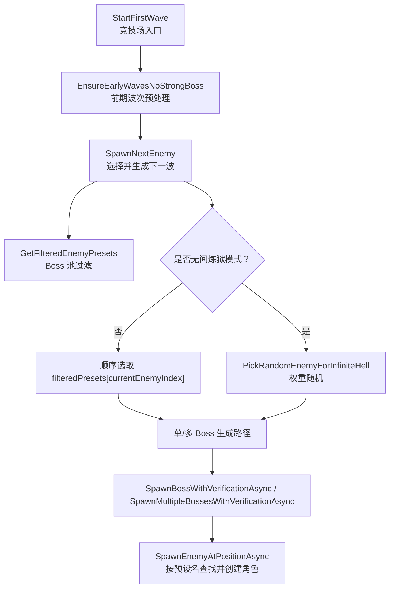
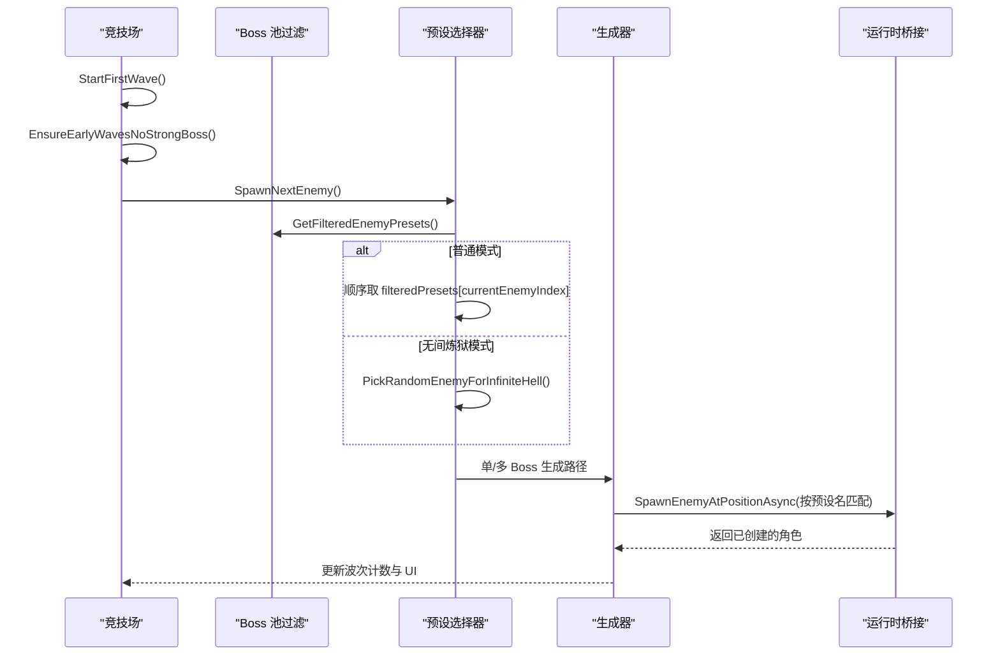
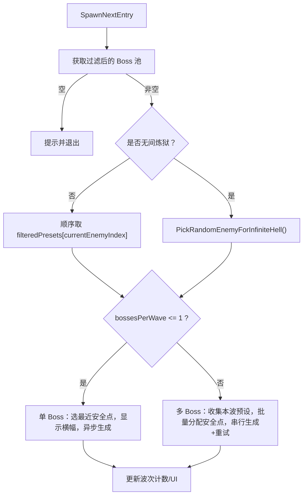
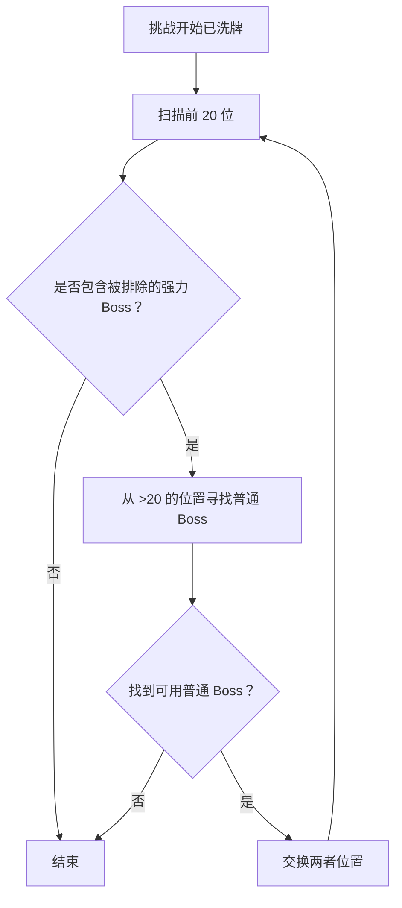
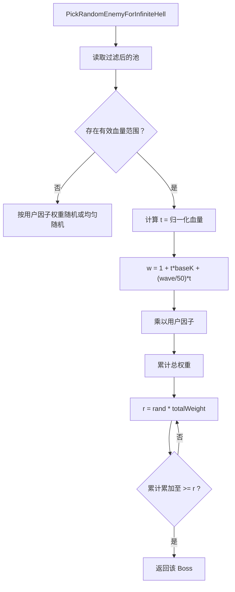
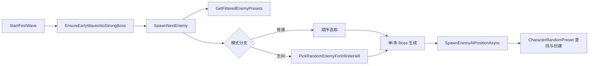

# 敌人预设选择算法

<cite>
**本文引用的文件**
- [WavesArenaBossSpawning.cs](file://WavesArena/WavesArenaBossSpawning.cs)
- [WavesArena.cs](file://WavesArena/WavesArena.cs)
- [BossFilter.cs](file://BossFilter/BossFilter.cs)
- [ModBehaviour.cs](file://ModBehaviour.cs)
</cite>

## 目录
1. [简介](#简介)
2. [项目结构](#项目结构)
3. [核心组件](#核心组件)
4. [架构总览](#架构总览)
5. [详细组件分析](#详细组件分析)
6. [依赖关系分析](#依赖关系分析)
7. [性能考量](#性能考量)
8. [故障排查指南](#故障排查指南)
9. [结论](#结论)
10. [附录](#附录)

## 简介
本文聚焦 BossRush 模组中“敌人预设选择算法”的实现，重点解析 SpawnNextEnemy 的调用流程、Boss 池过滤机制、无间炼狱模式下的权重随机选择策略，以及前期波次强力 Boss 的排除与预处理。同时说明多 Boss 模式下 bossesPerWave 的作用，并给出自定义 Boss 预设的注册与动态发现要点。

## 项目结构
围绕敌人预设选择的核心代码分布在以下模块：
- 波次与竞技场管理：负责挑战启动、倒计时、下一波生成调度与早期波次处理
- Boss 池筛选：提供过滤后的 Boss 列表与缓存机制
- 生成与验证：负责具体敌人生成、重试、位置校验与批量生成
- 运行时桥接：负责按预设名称匹配 CharacterRandomPreset、应用数值倍率与多 Boss 追踪

图表来源
- [WavesArena.cs:42-104](file://WavesArena/WavesArena.cs#L42-L104)
- [WavesArenaBossSpawning.cs:19-107](file://WavesArena/WavesArenaBossSpawning.cs#L19-L107)
- [WavesArenaBossSpawning.cs:346-473](file://WavesArena/WavesArenaBossSpawning.cs#L346-L473)
- [WavesArena.cs:643-742](file://WavesArena/WavesArena.cs#L643-L742)
- [ModBehaviour.cs:1027-1147](file://ModBehaviour.cs#L1027-L1147)

章节来源
- [WavesArena.cs:42-104](file://WavesArena/WavesArena.cs#L42-L104)
- [WavesArenaBossSpawning.cs:19-107](file://WavesArena/WavesArenaBossSpawning.cs#L19-L107)
- [WavesArenaBossSpawning.cs:346-473](file://WavesArena/WavesArenaBossSpawning.cs#L346-L473)
- [WavesArena.cs:643-742](file://WavesArena/WavesArena.cs#L643-L742)
- [ModBehaviour.cs:1027-1147](file://ModBehaviour.cs#L1027-L1147)

## 核心组件
- 波次入口与预处理：StartFirstWave 在挑战开始时打乱出场顺序，并在非无间炼狱模式下执行 EnsureEarlyWavesNoStrongBoss，确保前 20 波不出现强力 Boss
- Boss 池过滤：GetFilteredEnemyPresets 基于启用状态与配置返回过滤后的 Boss 列表，带缓存优化
- 预设选择：
  - 普通模式：按 currentEnemyIndex 顺序从 filteredPresets 取用
  - 无间炼狱模式：PickRandomEnemyForInfiniteHell 按权重随机选择
- 生成与验证：SpawnNextEnemy 根据 bossesPerWave 决定单/多 Boss 生成路径，并通过异步方法完成生成、重试与位置修复
- 运行时桥接：SpawnEnemyAtPositionAsync 通过 nameKey/name/team 匹配 CharacterRandomPreset，创建并激活角色，应用数值倍率与多 Boss 追踪

章节来源
- [WavesArenaBossSpawning.cs:19-107](file://WavesArena/WavesArenaBossSpawning.cs#L19-L107)
- [WavesArenaBossSpawning.cs:346-473](file://WavesArena/WavesArenaBossSpawning.cs#L346-L473)
- [BossFilter.cs:197-232](file://BossFilter/BossFilter.cs#L197-L232)
- [WavesArena.cs:643-742](file://WavesArena/WavesArena.cs#L643-L742)
- [ModBehaviour.cs:1027-1147](file://ModBehaviour.cs#L1027-L1147)

## 架构总览
下图展示从挑战开始到敌人生成的完整调用链，包括前期波次预处理、Boss 池过滤、权重随机选择与多 Boss 批量生成的关键节点。

图表来源
- [WavesArenaBossSpawning.cs:19-107](file://WavesArena/WavesArenaBossSpawning.cs#L19-L107)
- [WavesArenaBossSpawning.cs:346-473](file://WavesArena/WavesArenaBossSpawning.cs#L346-L473)
- [WavesArena.cs:643-742](file://WavesArena/WavesArena.cs#L643-L742)
- [ModBehaviour.cs:1027-1147](file://ModBehaviour.cs#L1027-L1147)

## 详细组件分析

### SpawnNextEnemy 方法与多 Boss 模式
- 职责：获取过滤后的 Boss 池；在非无间炼狱模式下检查索引越界以结束挑战；在无间炼狱模式下按权重随机选择；根据 bossesPerWave 决定单/多 Boss 生成路径；显示横幅并触发异步生成
- 关键点：
  - 单 Boss：维护当前波 Boss 计数，选择最近安全刷怪点，调用单目标生成
  - 多 Boss：为每波分配 bossesPerWave 个相同或不同预设（无间炼狱可替换），批量分配安全位置，串行生成并支持重试
- 错误处理：玩家或刷新点为空时直接返回；生成失败记录日志并进入失败处理

图表来源
- [WavesArenaBossSpawning.cs:346-473](file://WavesArena/WavesArenaBossSpawning.cs#L346-L473)

章节来源
- [WavesArenaBossSpawning.cs:346-473](file://WavesArena/WavesArenaBossSpawning.cs#L346-L473)

### EarlyWaveExcludedBosses 与 EnsureEarlyWavesNoStrongBoss
- 设计目的：防止前期波次出现过强 Boss，提升新手体验与难度曲线平滑性
- 实现细节：
  - EarlyWaveExcludedBosses 包含若干强力 Boss 的名称键（如风暴系列、龙裔遗族、焚天龙皇等）
  - EnsureEarlyWavesNoStrongBoss 在挑战开始时对 enemyPresets 进行洗牌后扫描前 20 位，若发现被排除的强力 Boss，则与第 20 位之后的普通 Boss 交换，直至前 20 位不再包含被排除者
- 效果：保证前 20 波不会出现这些强力 Boss，后续波次再正常参与顺序或权重选择

图表来源
- [WavesArena.cs:42-104](file://WavesArena/WavesArena.cs#L42-L104)

章节来源
- [WavesArena.cs:42-104](file://WavesArena/WavesArena.cs#L42-L104)

### 无间炼狱模式的权重随机选择（PickRandomEnemyForInfiniteHell）
- 输入：过滤后的 Boss 池、当前波次索引、用户配置的因子
- 权重计算：
  - 基础系数：t = (baseHealth - minH) / (maxH - minH)，归一化到 [0,1]
  - 权重公式：w = 1 + t * baseK + (waveIndex/50) * t，其中 baseK=4
  - 用户因子：每个 Boss 的 bossInfiniteHellFactors 作为乘数应用到 w
- 抽样策略：累计权重法，随机值 r 落在哪个区间即选中对应 Boss
- 回退逻辑：若无有效血量范围或总权重为 0，退化为均匀随机或仅按因子权重随机

图表来源
- [WavesArena.cs:643-742](file://WavesArena/WavesArena.cs#L643-L742)

章节来源
- [WavesArena.cs:643-742](file://WavesArena/WavesArena.cs#L643-L742)

### 多 Boss 模式下的 bossesPerWave 作用
- 行为：当 bossesPerWave > 1 时，同一波生成多个 Boss；单 Boss 模式每波只生成一个
- 实现：
  - 单 Boss：设置当前波总数与剩余数为 1，选择最近安全点，调用单目标生成
  - 多 Boss：设置当前波总数与剩余数为 bossesPerWave，收集本波预设信息，批量分配安全位置，串行生成并支持重试
- 影响：多 Boss 模式会改变 HUD 统计、掉落与清理逻辑中的波次计数与存活统计

章节来源
- [WavesArenaBossSpawning.cs:417-467](file://WavesArena/WavesArenaBossSpawning.cs#L417-L467)
- [WavesArenaBossSpawning.cs:521-661](file://WavesArena/WavesArenaBossSpawning.cs#L521-L661)

### 运行时桥接：按预设名匹配与创建角色
- 匹配策略：
  - 优先通过 nameKey 精确匹配 CharacterRandomPreset
  - 未命中时尝试同阵营且 showName=true 的强敌预设
  - 特殊 Boss（如幽灵女巫）使用专用生成方法
- 创建与激活：
  - 使用 CreateCharacterAsync 生成非激活状态，便于修改属性
  - 应用无间炼狱缩放与全局 Boss 数值倍率
  - 多 Boss 模式下加入当前波追踪列表，最后激活对象
- 失败处理：未找到合适预设或创建失败时记录日志并返回空

章节来源
- [ModBehaviour.cs:1027-1147](file://ModBehaviour.cs#L1027-L1147)

### 自定义 Boss 预设的注册与动态发现
- 注册方式：
  - 通过官方 CharacterRandomPreset 系统注册预设，并提供 nameKey 与 team 标识
  - 模组在初始化阶段扫描所有 CharacterRandomPreset，构建 enemyPresets 列表
- 动态发现：
  - 运行时定期刷新角色缓存，捕获新增或动态生成的敌人
  - 过滤掉运行时克隆体与特定不可显示预设，避免污染 Boss 池
- 注意事项：
  - 临时召唤单位（如派系战/血猎产生的小怪）会被排除出 Boss 列表
  - 特殊低等级 Boss（如龙裔遗族、焚天龙皇）会被保留，不受清理影响

章节来源
- [WavesArena.cs:745-800](file://WavesArena/WavesArena.cs#L745-L800)
- [ModBehaviour.cs:1482-1513](file://ModBehaviour.cs#L1482-L1513)

## 依赖关系分析
- 波次入口依赖：StartFirstWave 依赖 EnsureEarlyWavesNoStrongBoss 与 SpawnNextEnemy
- 预设选择依赖：SpawnNextEnemy 依赖 GetFilteredEnemyPresets 与 PickRandomEnemyForInfiniteHell（无间炼狱）
- 生成依赖：SpawnNextEnemy 依赖单/多 Boss 生成方法，最终调用 SpawnEnemyAtPositionAsync
- 运行时依赖：SpawnEnemyAtPositionAsync 依赖 ObjectCache.GetCharacterPresets 与 CharacterRandomPreset.CreateCharacterAsync

图表来源
- [WavesArenaBossSpawning.cs:19-107](file://WavesArena/WavesArenaBossSpawning.cs#L19-L107)
- [WavesArenaBossSpawning.cs:346-473](file://WavesArena/WavesArenaBossSpawning.cs#L346-L473)
- [WavesArena.cs:643-742](file://WavesArena/WavesArena.cs#L643-L742)
- [ModBehaviour.cs:1027-1147](file://ModBehaviour.cs#L1027-L1147)

章节来源
- [WavesArenaBossSpawning.cs:19-107](file://WavesArena/WavesArenaBossSpawning.cs#L19-L107)
- [WavesArenaBossSpawning.cs:346-473](file://WavesArena/WavesArenaBossSpawning.cs#L346-L473)
- [WavesArena.cs:643-742](file://WavesArena/WavesArena.cs#L643-L742)
- [ModBehaviour.cs:1027-1147](file://ModBehaviour.cs#L1027-L1147)

## 性能考量
- Boss 池过滤缓存：GetFilteredEnemyPresets 使用 _filteredPresetsCache 与脏标记，仅在启用状态变化时重新计算，减少频繁过滤开销
- 批量生成串行化：多 Boss 模式串行生成并短暂等待，避免并行冲突与资源竞争
- 重试与位置修复：单/多 Boss 生成均支持重试与位置修正，降低因地形或 NavMesh 导致的失败概率
- 角色缓存刷新：定时刷新角色缓存，捕获动态生成的敌人，保持 Boss 池最新

章节来源
- [BossFilter.cs:197-232](file://BossFilter/BossFilter.cs#L197-L232)
- [WavesArenaBossSpawning.cs:475-661](file://WavesArena/WavesArenaBossSpawning.cs#L475-L661)
- [ModBehaviour.cs:1482-1513](file://ModBehaviour.cs#L1482-L1513)

## 故障排查指南
- Boss 池为空：SpawnNextEnemy 检测到过滤后列表为空时提示并退出，需检查 Boss 启用状态与配置
- 玩家或刷新点为空：生成前校验玩家与地图刷新点，缺失时记录日志并返回
- 生成失败：单/多 Boss 生成失败会记录尝试次数与错误信息，必要时推进下一波或修正波次计数
- 位置异常：生成后延迟校验并尝试恢复至最近刷怪点，避免 Boss 卡在地下或空中

章节来源
- [WavesArenaBossSpawning.cs:346-473](file://WavesArena/WavesArenaBossSpawning.cs#L346-L473)
- [WavesArenaBossSpawning.cs:475-661](file://WavesArena/WavesArenaBossSpawning.cs#L475-L661)

## 结论
BossRush 的敌人预设选择算法通过“过滤—排序/权重—生成—验证”的分层设计，兼顾了普通模式的顺序可控性与无间炼狱模式的动态难度调节。前期波次强力 Boss 排除确保了难度曲线的平滑，多 Boss 模式提升了战斗密度与策略性。结合缓存与重试机制，系统在稳定性与性能上具备良好表现。

## 附录
- 配置项参考：
  - 无间炼狱每波 Boss 数量：config.infiniteHellBossesPerWave
  - Boss 禁用列表：config.disabledBosses
  - 无间炼狱因子：config.bossInfiniteHellFactors
- 相关文档：
  - Boss 过滤器使用说明与持久化规则
  - 无间炼狱模式规则与奖励机制