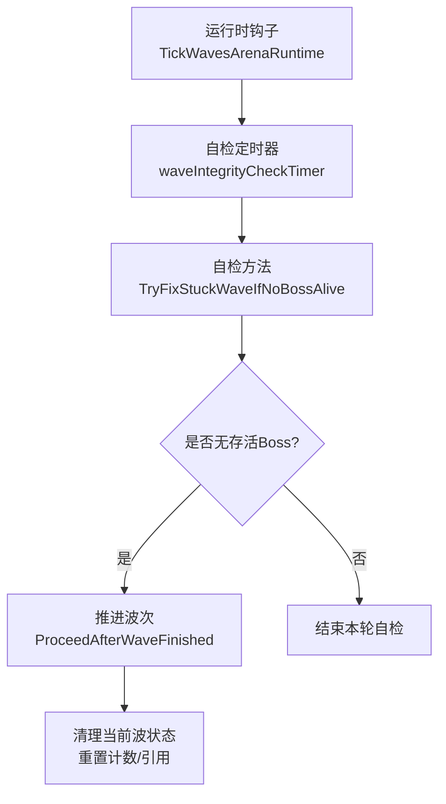
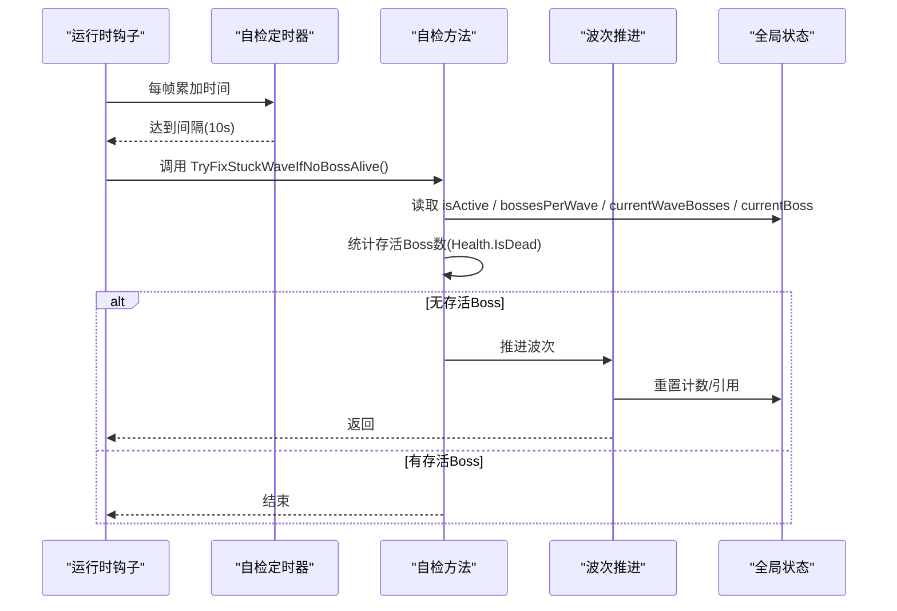
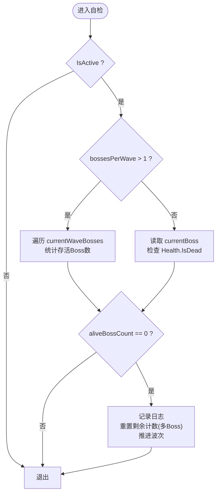
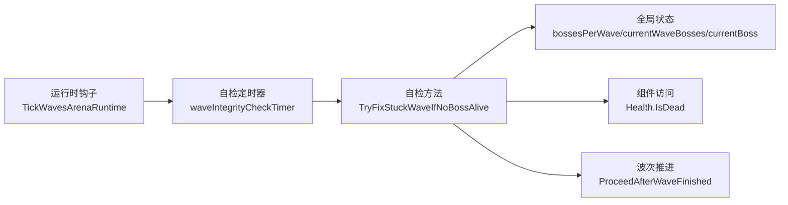

# 波次状态恢复

<cite>
**本文引用的文件**
- [WavesArenaSpawnerControl.cs](file://WavesArena/WavesArenaSpawnerControl.cs)
- [WavesArenaRuntimeHooks.cs](file://WavesArena/WavesArenaRuntimeHooks.cs)
- [ModBehaviour.cs](file://ModBehaviour.cs)
- [ModeDWaves.cs](file://ModeD/ModeDWaves.cs)
- [WavesArena.cs](file://WavesArena/WavesArena.cs)
</cite>

## 目录
1. [简介](#简介)
2. [项目结构](#项目结构)
3. [核心组件](#核心组件)
4. [架构总览](#架构总览)
5. [详细组件分析](#详细组件分析)
6. [依赖关系分析](#依赖关系分析)
7. [性能考量](#性能考量)
8. [故障排查指南](#故障排查指南)
9. [结论](#结论)
10. [附录：监控与调试接口](#附录监控与调试接口)

## 简介
本文档聚焦于“波次状态恢复机制”，重点解析 TryFixStuckWaveIfNoBossAlive 方法的自检逻辑，包括存活 Boss 检测、波次状态验证、多 Boss 与单 Boss 模式下的不同处理策略、自动修正（推进波次与状态重置）以及异常恢复。同时给出状态监控与调试接口的使用方法，帮助在复杂场景下快速定位并修复卡关问题。

## 项目结构
围绕波次恢复的关键代码分布在以下模块：
- 波次自检触发器：每 10 秒调用一次自检方法
- 自检实现：按当前模式判断存活 Boss 数量，必要时推进波次
- 波次推进：清理当前波状态并进入下一波
- 辅助计时与全局状态：IsActive、bossesPerWave、currentWaveBosses、currentBoss 等

图表来源
- [WavesArenaRuntimeHooks.cs:7-67](file://WavesArena/WavesArenaRuntimeHooks.cs#L7-L67)
- [WavesArenaSpawnerControl.cs:144-251](file://WavesArena/WavesArenaSpawnerControl.cs#L144-L251)
- [WavesArena.cs:446-504](file://WavesArena/WavesArena.cs#L446-L504)

章节来源
- [WavesArenaRuntimeHooks.cs:7-67](file://WavesArena/WavesArenaRuntimeHooks.cs#L7-L67)
- [WavesArenaSpawnerControl.cs:144-251](file://WavesArena/WavesArenaSpawnerControl.cs#L144-L251)
- [WavesArena.cs:446-504](file://WavesArena/WavesArena.cs#L446-L504)

## 核心组件
- 自检触发器：每 10 秒检查一次，避免频繁扫描影响性能
- 自检方法：根据 bossesPerWave 分支处理多 Boss/单 Boss 两种情况
- 波次推进：统一入口 ProceedAfterWaveFinished，负责状态复位与下一波调度
- 全局状态：isActive、bossesPerWave、currentWaveBosses、currentBoss、bossesInCurrentWaveRemaining 等

章节来源
- [ModBehaviour.cs:514-528](file://ModBehaviour.cs#L514-L528)
- [WavesArenaSpawnerControl.cs:144-251](file://WavesArena/WavesArenaSpawnerControl.cs#L144-L251)
- [WavesArena.cs:446-504](file://WavesArena/WavesArena.cs#L446-L504)

## 架构总览
自检流程由运行时钩子驱动，周期性调用自检方法；自检方法读取当前模式与状态，若发现“当前波应存在存活 Boss 但实际为 0”的异常，则强制推进到下一波，完成状态重置。

图表来源
- [WavesArenaRuntimeHooks.cs:7-67](file://WavesArena/WavesArenaRuntimeHooks.cs#L7-L67)
- [WavesArenaSpawnerControl.cs:144-251](file://WavesArena/WavesArenaSpawnerControl.cs#L144-L251)
- [WavesArena.cs:446-504](file://WavesArena/WavesArena.cs#L446-L504)

## 详细组件分析

### 自检方法 TryFixStuckWaveIfNoBossAlive
- 前置条件：仅在 IsActive 时执行；非活跃时直接返回
- 多 Boss 模式（bossesPerWave > 1）：
  - 仅当 bossesInCurrentWaveRemaining > 0 且 currentWaveBosses 非空时才进行检查
  - 遍历 currentWaveBosses，通过 Health.IsDead 判定存活
  - 若 aliveBossCount == 0，则记录日志并推进波次
- 单 Boss 模式（bossesPerWave == 1）：
  - 从 currentBoss 获取 MonoBehaviour，再读取 Health.IsDead
  - 若 aliveBossCount == 0，则推进波次
- 推进动作：
  - 多 Boss 模式下将 bossesInCurrentWaveRemaining 置 0
  - 调用 ProceedAfterWaveFinished 完成波次推进与状态重置

图表来源
- [WavesArenaSpawnerControl.cs:144-251](file://WavesArena/WavesArenaSpawnerControl.cs#L144-L251)

章节来源
- [WavesArenaSpawnerControl.cs:144-251](file://WavesArena/WavesArenaSpawnerControl.cs#L144-L251)

### 波次推进 ProceedAfterWaveFinished
- 职责：统一收尾当前波，清理 currentBoss 引用，重置相关计数，并准备下一波
- 关键点：
  - 清理 currentBoss 引用，避免悬挂指针
  - 重置交互对象或路牌状态（如适用）
  - 触发下一波生成或等待倒计时

章节来源
- [WavesArena.cs:446-504](file://WavesArena/WavesArena.cs#L446-L504)

### 多 Boss 与单 Boss 模式差异
- 多 Boss 模式：
  - 使用 currentWaveBosses 列表维护当前波 Boss
  - 使用 bossesInCurrentWaveRemaining 跟踪剩余未击杀 Boss 数
  - 自检时逐项检查 Health 组件
- 单 Boss 模式：
  - 使用 currentBoss 单一引用
  - 自检时直接检查其 Health 组件
- 共同点：
  - 均基于 Health.IsDead 判定存活
  - 均在无存活 Boss 时推进波次

章节来源
- [ModBehaviour.cs:514-528](file://ModBehaviour.cs#L514-L528)
- [WavesArenaSpawnerControl.cs:144-251](file://WavesArena/WavesArenaSpawnerControl.cs#L144-L251)

### 自动修正与状态重置
- 自动修正触发条件：
  - 当前波应存在存活 Boss（计数或列表指示）
  - 实际存活数为 0
- 状态重置步骤：
  - 多 Boss 模式：重置 bossesInCurrentWaveRemaining = 0
  - 统一调用 ProceedAfterWaveFinished 完成推进与清理

章节来源
- [WavesArenaSpawnerControl.cs:228-245](file://WavesArena/WavesArenaSpawnerControl.cs#L228-L245)
- [WavesArena.cs:446-504](file://WavesArena/WavesArena.cs#L446-L504)

### 异常情况下的恢复策略
- 反射/组件访问异常：
  - 对 Health 组件的获取与 IsDead 检查均包裹 try/catch，记录警告日志
  - 避免因个别 Boss 异常导致自检中断
- 非活跃状态：
  - 非 IsActive 时不执行自检，防止误判
- 日志与可观测性：
  - 关键路径输出 DevLog，便于定位问题

章节来源
- [WavesArenaSpawnerControl.cs:175-220](file://WavesArena/WavesArenaSpawnerControl.cs#L175-L220)
- [WavesArenaSpawnerControl.cs:232-249](file://WavesArena/WavesArenaSpawnerControl.cs#L232-L249)

## 依赖关系分析
- 运行时钩子 TickWavesArenaRuntime 负责累计自检时间并在达到阈值时调用自检方法
- 自检方法依赖全局状态字段（bossesPerWave、currentWaveBosses、currentBoss）与 Health 组件
- 波次推进依赖统一的 ProceedAfterWaveFinished，确保状态一致性

图表来源
- [WavesArenaRuntimeHooks.cs:7-67](file://WavesArena/WavesArenaRuntimeHooks.cs#L7-L67)
- [WavesArenaSpawnerControl.cs:144-251](file://WavesArena/WavesArenaSpawnerControl.cs#L144-L251)
- [WavesArena.cs:446-504](file://WavesArena/WavesArena.cs#L446-L504)

章节来源
- [WavesArenaRuntimeHooks.cs:7-67](file://WavesArena/WavesArenaRuntimeHooks.cs#L7-L67)
- [WavesArenaSpawnerControl.cs:144-251](file://WavesArena/WavesArenaSpawnerControl.cs#L144-L251)
- [WavesArena.cs:446-504](file://WavesArena/WavesArena.cs#L446-L504)

## 性能考量
- 自检频率：固定 10 秒一次，避免每帧扫描造成开销
- 列表遍历：多 Boss 模式下仅遍历 currentWaveBosses，长度可控
- 组件访问：Health 组件获取与 IsDead 检查尽量短路，失败时捕获异常并继续
- 日志输出：仅在异常或修正时输出，减少 IO 压力

[本节为通用性能建议，不直接分析具体文件]

## 故障排查指南
- 现象：波次卡住，提示“下一波将在 X 秒后开始”但不推进
- 可能原因：
  - 事件丢失导致死亡计数未更新
  - Boss 被瞬杀或脱离场景导致 Health 不可用
  - currentWaveBosses 或 currentBoss 引用异常
- 排查步骤：
  - 查看自检日志：搜索“自检：当前波没有任何存活 Boss，自动修正并推进下一波”
  - 检查 Health 组件是否存在且可读
  - 确认 bossesInCurrentWaveRemaining 与 currentWaveBosses 的一致性
- 恢复手段：
  - 自检会自动推进波次；若未触发，检查 IsActive 与定时器是否正常
  - 手动重启波次或重新进入地图以重建状态

章节来源
- [WavesArenaSpawnerControl.cs:228-249](file://WavesArena/WavesArenaSpawnerControl.cs#L228-L249)
- [WavesArenaRuntimeHooks.cs:48-67](file://WavesArena/WavesArenaRuntimeHooks.cs#L48-L67)

## 结论
TryFixStuckWaveIfNoBossAlive 提供了稳健的波次自愈能力：通过周期自检、存活 Boss 检测与统一推进流程，有效应对事件丢失、瞬杀、组件异常等导致的卡关问题。配合清晰的日志与安全的异常处理，可在复杂战斗场景中保障流程连续性。

[本节为总结性内容，不直接分析具体文件]

## 附录：监控与调试接口
- 自检定时器：
  - 字段：waveIntegrityCheckTimer
  - 间隔：WaveIntegrityCheckInterval（10 秒）
  - 触发：TickWavesArenaRuntime 中累加并调用自检
- 日志关键字：
  - “自检：当前波没有任何存活 Boss，自动修正并推进下一波”
  - “读取多Boss Health失败”、“读取当前Boss Health失败”
- 调试建议：
  - 在游戏日志中搜索上述关键字，定位自检触发与修正结果
  - 观察 currentWaveBosses 与 currentBoss 的生命周期，确保引用正确
  - 在多 Boss 模式下，关注 bossesInCurrentWaveRemaining 的变化

章节来源
- [WavesArenaRuntimeHooks.cs:48-67](file://WavesArena/WavesArenaRuntimeHooks.cs#L48-L67)
- [WavesArenaSpawnerControl.cs:175-220](file://WavesArena/WavesArenaSpawnerControl.cs#L175-L220)
- [WavesArenaSpawnerControl.cs:228-249](file://WavesArena/WavesArenaSpawnerControl.cs#L228-L249)