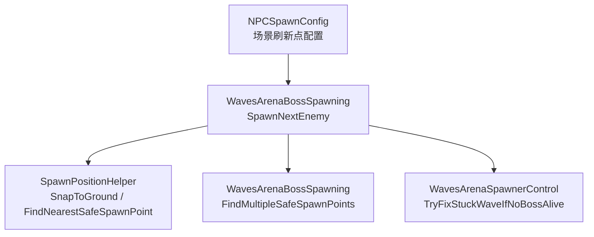
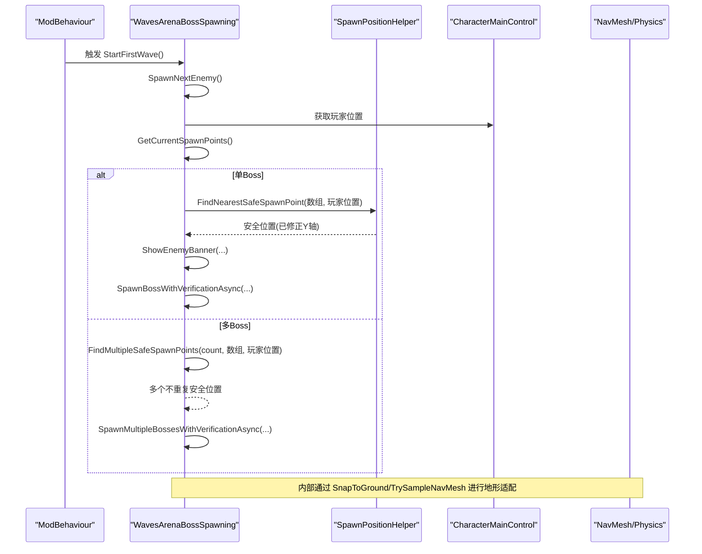
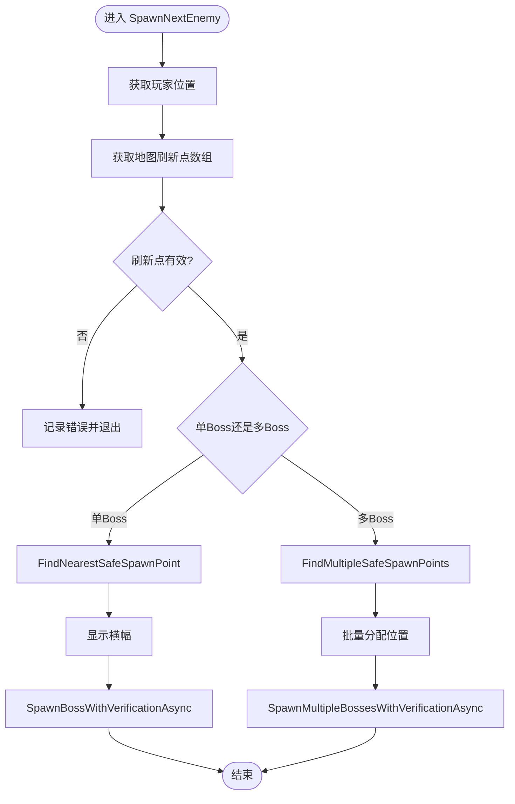
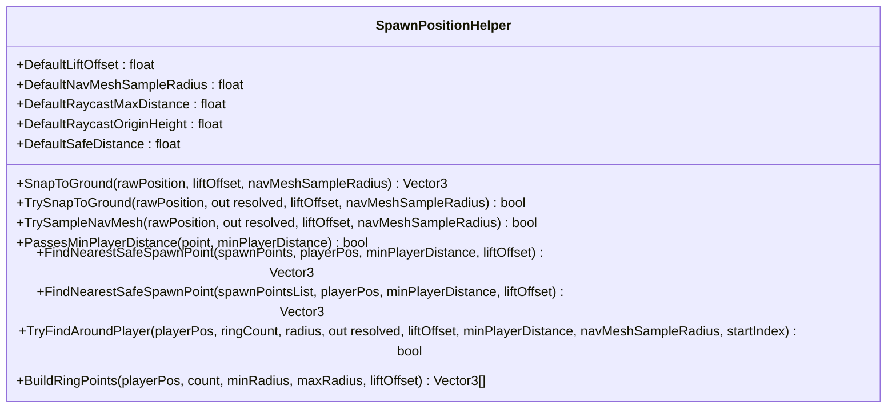
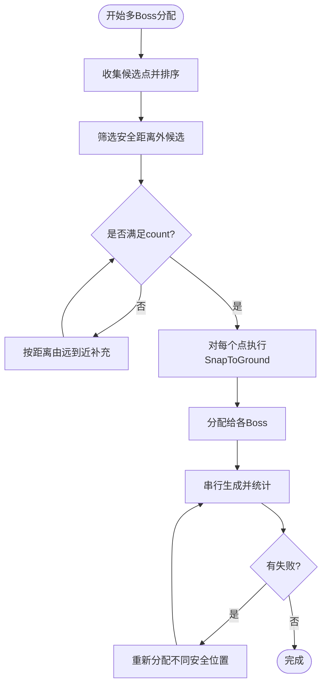
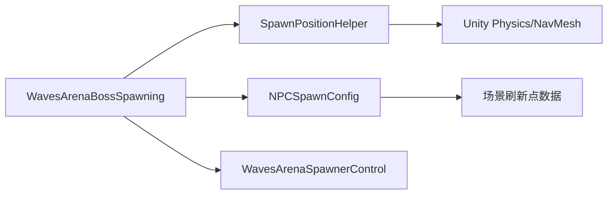

# 生成位置计算

<cite>
**本文引用的文件**
- [WavesArenaBossSpawning.cs](file://WavesArena/WavesArenaBossSpawning.cs)
- [SpawnPositionHelper.cs](file://Utilities/SpawnPositionHelper.cs)
- [NPCSpawnConfig.cs](file://Config/NPCSpawnConfig.cs)
- [WavesArenaSpawnerControl.cs](file://WavesArena/WavesArenaSpawnerControl.cs)
</cite>

## 目录
1. [简介](#简介)
2. [项目结构](#项目结构)
3. [核心组件](#核心组件)
4. [架构总览](#架构总览)
5. [详细组件分析](#详细组件分析)
6. [依赖关系分析](#依赖关系分析)
7. [性能考虑](#性能考虑)
8. [故障排查指南](#故障排查指南)
9. [结论](#结论)
10. [附录：自定义生成点配置与最佳实践](#附录自定义生成点配置与最佳实践)

## 简介
本文聚焦于敌人生成位置的计算流程，围绕 SpawnNextEnemy 方法展开，系统说明玩家位置获取、安全距离验证、地形适配（Raycast/NavMesh）、以及失败回退策略。同时详解 SpawnPositionHelper 工具类的实现原理与使用方式，并给出多玩家场景下的优化建议与自定义生成点配置的最佳实践。

## 项目结构
与“生成位置计算”直接相关的代码主要分布在以下模块：
- WavesArenaBossSpawning.cs：负责 BossRush 波次生成入口、单/多 Boss 生成流程、重试与批量分配位置。
- SpawnPositionHelper.cs：统一的刷怪点几何工具，提供地面贴合、最小玩家距离判断、环形候选点生成等能力。
- NPCSpawnConfig.cs：集中管理不同场景的刷新点配置，支持随机选择与避让逻辑。
- WavesArenaSpawnerControl.cs：竞技场相关控制，包含禁用场景原生 Spawner、波次自检修复等。

图表来源
- [WavesArenaBossSpawning.cs:110-146](file://WavesArena/WavesArenaBossSpawning.cs#L110-L146)
- [SpawnPositionHelper.cs:33-153](file://Utilities/SpawnPositionHelper.cs#L33-L153)
- [WavesArenaSpawnerControl.cs:141-251](file://WavesArena/WavesArenaSpawnerControl.cs#L141-L251)
- [NPCSpawnConfig.cs:24-45](file://Config/NPCSpawnConfig.cs#L24-L45)

章节来源
- [WavesArenaBossSpawning.cs:110-146](file://WavesArena/WavesArenaBossSpawning.cs#L110-L146)
- [SpawnPositionHelper.cs:33-153](file://Utilities/SpawnPositionHelper.cs#L33-L153)
- [WavesArenaSpawnerControl.cs:141-251](file://WavesArena/WavesArenaSpawnerControl.cs#L141-L251)
- [NPCSpawnConfig.cs:24-45](file://Config/NPCSpawnConfig.cs#L24-L45)

## 核心组件
- SpawnNextEnemy：BossRush 每波生成的统一入口，负责获取玩家、地图刷新点、选择安全位置、显示横幅、调用异步生成与重试。
- SpawnPositionHelper：提供地面贴合（Raycast/NavMesh）、最小玩家距离过滤、最近安全点查找、环形候选点构建等通用能力。
- FindMultipleSafeSpawnPoints：为多 Boss 同波生成分配多个不重复的安全位置。
- TryFixStuckWaveIfNoBossAlive：当波次计数异常且场上无存活 Boss 时自动推进波次，避免卡关。

章节来源
- [WavesArenaBossSpawning.cs:346-473](file://WavesArena/WavesArenaBossSpawning.cs#L346-L473)
- [SpawnPositionHelper.cs:33-153](file://Utilities/SpawnPositionHelper.cs#L33-L153)
- [WavesArenaBossSpawning.cs:148-251](file://WavesArena/WavesArenaBossSpawning.cs#L148-L251)
- [WavesArenaSpawnerControl.cs:141-251](file://WavesArena/WavesArenaSpawnerControl.cs#L141-L251)

## 架构总览
下图展示了从 SpawnNextEnemy 到具体位置计算的调用链与数据流：

图表来源
- [WavesArenaBossSpawning.cs:346-473](file://WavesArena/WavesArenaBossSpawning.cs#L346-L473)
- [WavesArenaBossSpawning.cs:475-661](file://WavesArena/WavesArenaBossSpawning.cs#L475-L661)
- [SpawnPositionHelper.cs:33-93](file://Utilities/SpawnPositionHelper.cs#L33-L93)

## 详细组件分析

### SpawnNextEnemy 的位置计算流程
- 玩家位置获取：从 CharacterMainControl.Main 读取当前玩家位置，作为安全距离校验与候选点排序的依据。
- 刷新点来源：通过 GetCurrentSpawnPoints() 获取当前地图配置的刷新点数组；若为空则终止生成。
- 单 Boss 模式：
  - 调用 FindNearestSafeSpawnPoint(spawnPoints, playerPos)，返回距玩家最近且不在安全距离内的点；若全部在安全距离内，则回退到最远点。
  - 显示敌人生成横幅后，调用带验证的异步生成方法，并在失败时最多重试三次。
- 多 Boss 模式：
  - 调用 FindMultipleSafeSpawnPoints(count, spawnPoints, playerPos) 分配多个不重复的安全位置，优先选择安全距离外的点，不足时按距离由远到近补充。
  - 串行生成每个 Boss，统计成功数量并对失败项进行多轮重试，最终修正波次计数，必要时跳过本波。

图表来源
- [WavesArenaBossSpawning.cs:346-473](file://WavesArena/WavesArenaBossSpawning.cs#L346-L473)
- [WavesArenaBossSpawning.cs:475-661](file://WavesArena/WavesArenaBossSpawning.cs#L475-L661)

章节来源
- [WavesArenaBossSpawning.cs:346-473](file://WavesArena/WavesArenaBossSpawning.cs#L346-L473)
- [WavesArenaBossSpawning.cs:475-661](file://WavesArena/WavesArenaBossSpawning.cs#L475-L661)

### SpawnPositionHelper 工具类与 GetSafeSpawnPositionAroundPlayer 原理
- 地面贴合（SnapToGround）：
  - 优先使用 Raycast 向下探测地面层（groundLayerMask），保留原始 XZ，仅修正 Y 轴并加上抬升偏移。
  - 若 Raycast 失败，则尝试 NavMesh.SamplePosition 就近采样，同样保留原始 XZ 并修正 Y。
  - 若两者均失败，则向上抬升固定高度作为兜底，确保始终返回可用位置。
- 严格版本（TrySnapToGround）：失败时不兜底，用于“无地面则丢弃”的场景。
- 虚拟回退环（TrySampleNavMesh）：优先采纳 NavMesh 完整 XYZ，再回退到 Raycast 仅修正 Y，适用于“在 raw 周围找到可达点”的场景。
- 最小玩家距离（PassesMinPlayerDistance）：
  - 忽略 Y 轴，仅比较 XZ 平面距离；若未设置最小距离或玩家不存在，视为通过。
- 最近安全点（FindNearestSafeSpawnPoint）：
  - 遍历候选点，筛选出满足最小玩家距离的点中最近的；若没有，则回退到最远点；最后对结果执行 SnapToGround。
- 环形候选点（BuildRingPoints / TryFindAroundPlayer）：
  - 以玩家为中心生成等距候选点，半径可随机区间；逐个尝试 NavMesh 落地并通过最小玩家距离检查，首个成功即返回。

图表来源
- [SpawnPositionHelper.cs:25-31](file://Utilities/SpawnPositionHelper.cs#L25-L31)
- [SpawnPositionHelper.cs:33-93](file://Utilities/SpawnPositionHelper.cs#L33-L93)
- [SpawnPositionHelper.cs:95-153](file://Utilities/SpawnPositionHelper.cs#L95-L153)
- [SpawnPositionHelper.cs:196-273](file://Utilities/SpawnPositionHelper.cs#L196-L273)

章节来源
- [SpawnPositionHelper.cs:33-93](file://Utilities/SpawnPositionHelper.cs#L33-L93)
- [SpawnPositionHelper.cs:95-153](file://Utilities/SpawnPositionHelper.cs#L95-L153)
- [SpawnPositionHelper.cs:196-273](file://Utilities/SpawnPositionHelper.cs#L196-L273)

### 多 Boss 同波位置分配与去重
- FindMultipleSafeSpawnPoints：
  - 收集所有候选点并按距离排序，优先选取安全距离外的点；若数量不足，从未使用的点中按距离由远到近补充。
  - 使用 HashSet 记录已用索引，确保同一波内不重复。
  - 对每个选中的点进行 SnapToGround 修正，保证地面贴合。
- 批量生成与重试：
  - 首轮串行生成，统计成功数量；对失败的 Boss 进行多轮重试，每次重试前重新分配不同的安全位置。
  - 最终修正波次计数，若全部失败则跳过本波，避免卡关。

图表来源
- [WavesArenaBossSpawning.cs:148-251](file://WavesArena/WavesArenaBossSpawning.cs#L148-L251)
- [WavesArenaBossSpawning.cs:521-661](file://WavesArena/WavesArenaBossSpawning.cs#L521-L661)

章节来源
- [WavesArenaBossSpawning.cs:148-251](file://WavesArena/WavesArenaBossSpawning.cs#L148-L251)
- [WavesArenaBossSpawning.cs:521-661](file://WavesArena/WavesArenaBossSpawning.cs#L521-L661)

### 生成失败的回退策略
- 单 Boss 重试：
  - 最多重试三次；每次重试前重新计算最近安全位置，避免重复失败。
- 多 Boss 重试：
  - 首轮串行生成，失败项进入重试队列；每轮重试前一次性为失败项分配不同安全位置，减少冲突。
- 边界检查与波次修正：
  - 最终统计成功数量，修正 bossesInCurrentWaveTotal/bossesInCurrentWaveRemaining；若全部失败则跳过本波。
  - 结合 TryFixStuckWaveIfNoBossAlive 进行自检：当波次计数大于0但场上无存活 Boss 时，自动推进下一波。

章节来源
- [WavesArenaBossSpawning.cs:475-661](file://WavesArena/WavesArenaBossSpawning.cs#L475-L661)
- [WavesArenaSpawnerControl.cs:141-251](file://WavesArena/WavesArenaSpawnerControl.cs#L141-L251)

### 地形适配与边界检查
- 地面贴合：
  - Raycast 优先，使用 groundLayerMask 精确命中地面；失败则 NavMesh 就近采样；仍失败则向上抬升固定高度。
- 玩家附近回退环：
  - 使用 TryFindAroundPlayer 在玩家周围生成等距候选点，逐个尝试 NavMesh 落地并通过最小玩家距离检查。
- 边界检查：
  - 通过最小玩家距离过滤避免在玩家附近生成；多 Boss 模式下使用去重集合避免位置冲突。

章节来源
- [SpawnPositionHelper.cs:33-93](file://Utilities/SpawnPositionHelper.cs#L33-L93)
- [SpawnPositionHelper.cs:196-273](file://Utilities/SpawnPositionHelper.cs#L196-L273)

## 依赖关系分析
- SpawnNextEnemy 依赖：
  - 玩家对象 CharacterMainControl.Main 获取位置。
  - 地图刷新点 GetCurrentSpawnPoints() 来自配置系统。
  - 位置计算委托给 SpawnPositionHelper。
  - 多 Boss 模式依赖 FindMultipleSafeSpawnPoints 进行位置分配。
- SpawnPositionHelper 依赖：
  - Unity Physics 与 NavMesh 进行地面贴合与可达性检查。
  - 游戏层掩码 groundLayerMask 用于 Raycast 过滤。
- 配置系统：
  - NPCSpawnConfig 提供场景级刷新点配置，支持随机选择与避让逻辑。

图表来源
- [WavesArenaBossSpawning.cs:346-473](file://WavesArena/WavesArenaBossSpawning.cs#L346-L473)
- [SpawnPositionHelper.cs:33-93](file://Utilities/SpawnPositionHelper.cs#L33-L93)
- [NPCSpawnConfig.cs:24-45](file://Config/NPCSpawnConfig.cs#L24-L45)
- [WavesArenaSpawnerControl.cs:141-251](file://WavesArena/WavesArenaSpawnerControl.cs#L141-L251)

章节来源
- [WavesArenaBossSpawning.cs:346-473](file://WavesArena/WavesArenaBossSpawning.cs#L346-L473)
- [SpawnPositionHelper.cs:33-93](file://Utilities/SpawnPositionHelper.cs#L33-L93)
- [NPCSpawnConfig.cs:24-45](file://Config/NPCSpawnConfig.cs#L24-L45)
- [WavesArenaSpawnerControl.cs:141-251](file://WavesArena/WavesArenaSpawnerControl.cs#L141-L251)

## 性能考虑
- 平方距离比较：
  - 在距离判断中使用平方距离避免开方运算，提升性能（如 PassesMinPlayerDistance、FindNearestSafeSpawnPoint）。
- 批量与串行生成：
  - 多 Boss 模式采用串行生成以避免并行潜在冲突，并在每步之间短暂等待，确保游戏状态稳定。
- 分帧销毁与延迟校验：
  - 禁用场景原生 Spawner 时分帧销毁，避免过图帧尖峰；生成后延迟校验 Boss 位置，防止低配设备地形加载慢导致卡地下。
- 缓存与复用：
  - 反射字段缓存、对象池与缓冲列表减少运行时分配与查找开销。

章节来源
- [SpawnPositionHelper.cs:95-153](file://Utilities/SpawnPositionHelper.cs#L95-L153)
- [WavesArenaSpawnerControl.cs:21-139](file://WavesArena/WavesArenaSpawnerControl.cs#L21-L139)
- [WavesArenaBossSpawning.cs:521-661](file://WavesArena/WavesArenaBossSpawning.cs#L521-L661)

## 故障排查指南
- 玩家未找到：
  - 若 CharacterMainControl.Main 为空，SpawnNextEnemy 会记录错误并退出；检查玩家初始化与场景加载顺序。
- 刷新点为空：
  - 若 GetCurrentSpawnPoints() 返回空数组，生成流程终止；检查地图配置是否正确加载。
- 生成失败：
  - 单 Boss 最多重试三次；多 Boss 进行多轮重试并重新分配位置；若全部失败则跳过本波。
- 卡波问题：
  - TryFixStuckWaveIfNoBossAlive 会在检测到波次计数异常且无存活 Boss 时自动推进；若仍卡住，检查波次计数修正逻辑。

章节来源
- [WavesArenaBossSpawning.cs:346-473](file://WavesArena/WavesArenaBossSpawning.cs#L346-L473)
- [WavesArenaSpawnerControl.cs:141-251](file://WavesArena/WavesArenaSpawnerControl.cs#L141-L251)

## 结论
SpawnNextEnemy 通过统一的工具类 SpawnPositionHelper 实现了稳健的敌人生成位置计算，涵盖玩家位置获取、安全距离验证、地形适配与失败回退。多 Boss 模式下的位置分配与去重机制确保了生成的稳定性与公平性。结合配置系统与自检修复逻辑，整体流程在高负载与复杂地形下仍能保持良好表现。

## 附录：自定义生成点配置与最佳实践
- 配置方式：
  - 使用 NPCSpawnConfig 中的数据结构定义场景刷新点，支持固定位置与随机选择。
  - 通过字典键值映射场景名称与刷新点数组，便于扩展新场景与新 NPC 类型。
- 最佳实践：
  - 合理设置最小玩家距离，避免在玩家附近生成导致体验不佳。
  - 使用 Raycast 优先、NavMesh 兜底的策略，确保地面贴合与可达性。
  - 多 Boss 模式下使用去重集合与距离排序，避免位置冲突与聚集。
  - 定期校验生成位置，延迟修正以防地形加载延迟导致的卡位问题。

章节来源
- [NPCSpawnConfig.cs:24-45](file://Config/NPCSpawnConfig.cs#L24-L45)
- [NPCSpawnConfig.cs:261-338](file://Config/NPCSpawnConfig.cs#L261-L338)
- [SpawnPositionHelper.cs:33-93](file://Utilities/SpawnPositionHelper.cs#L33-L93)