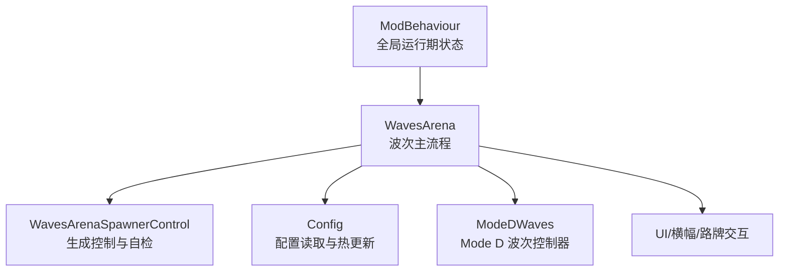
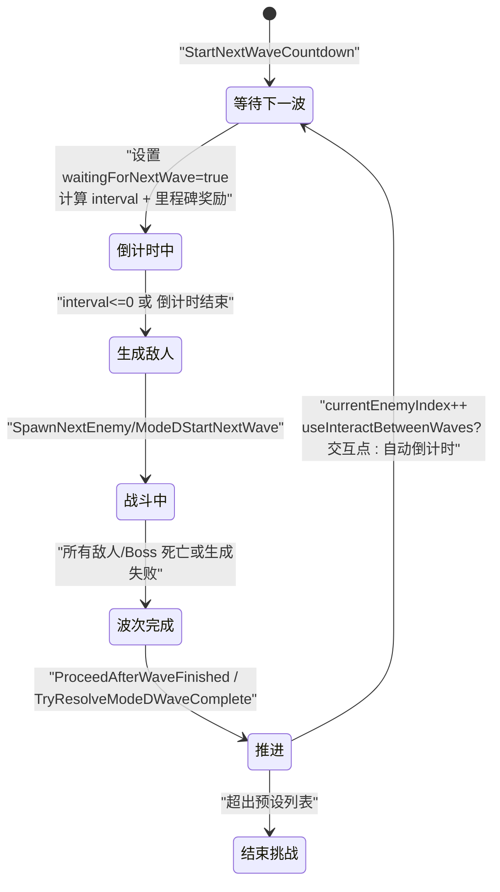
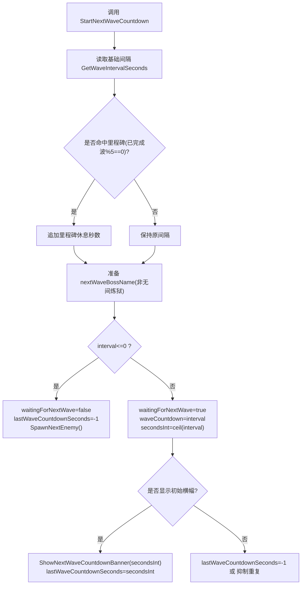
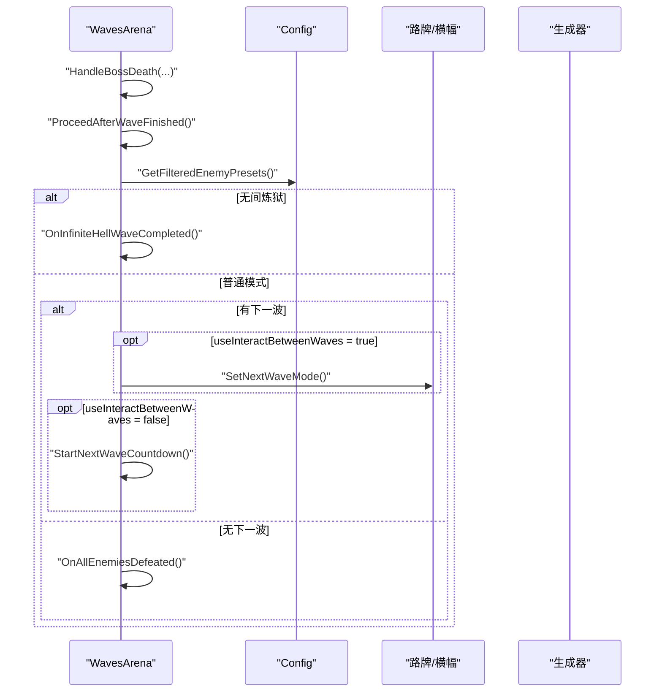
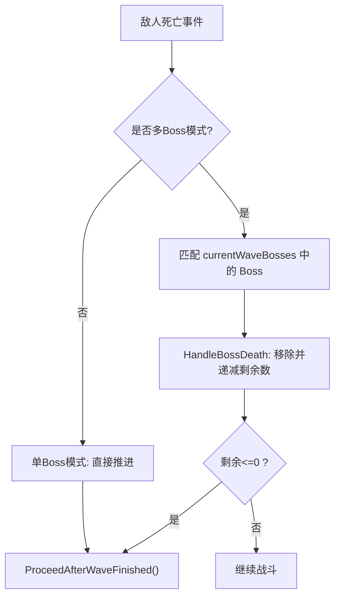
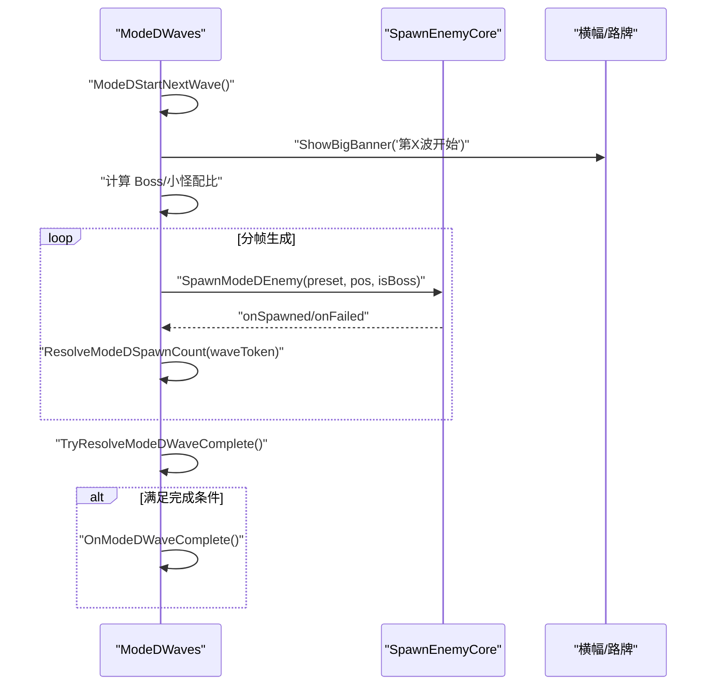
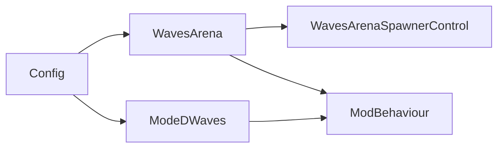

# 波次生命周期管理

<cite>
**本文引用的文件**
- [WavesArena.cs](file://WavesArena/WavesArena.cs)
- [WavesArenaSpawnerControl.cs](file://WavesArena/WavesArenaSpawnerControl.cs)
- [ModeDWaves.cs](file://ModeD/ModeDWaves.cs)
- [Config.cs](file://Config/Config.cs)
- [ModBehaviour.cs](file://ModBehaviour.cs)
</cite>

## 目录
1. [简介](#简介)
2. [项目结构](#项目结构)
3. [核心组件](#核心组件)
4. [架构总览](#架构总览)
5. [详细组件分析](#详细组件分析)
6. [依赖关系分析](#依赖关系分析)
7. [性能考量](#性能考量)
8. [故障排查指南](#故障排查指南)
9. [结论](#结论)
10. [附录：配置选项说明](#附录配置选项说明)

## 简介
本文件聚焦 BossRush 模组的“波次生命周期管理”，覆盖从波次开始、进行中到完成与结束的完整状态流转。重点解析以下能力：
- StartNextWaveCountdown 的倒计时初始化、里程碑休息奖励（每5波额外休息时间）与倒计时显示系统。
- 波次状态机设计：waitingForNextWave 标志位、currentEnemyIndex 递增逻辑，以及 ProceedAfterWaveFinished 的状态推进流程。
- 多 Boss 模式下的波次完成判定逻辑。
- 无间炼狱模式的特殊处理（独立索引、现金池、结算分支）。
- 波次间交互界面控制（useInteractBetweenWaves）对流程的影响。

## 项目结构
BossRush 的波次系统由多个模块协作实现：
- 竞技场与波次主流程：WavesArena.cs
- 生成器与自检修复：WavesArenaSpawnerControl.cs
- Mode D 独立波次控制器：ModeDWaves.cs
- 配置与运行时动态更新：Config.cs
- 全局运行期状态与 Tick：ModBehaviour.cs

图表来源
- [WavesArena.cs:108-184](file://WavesArena/WavesArena.cs#L108-L184)
- [WavesArenaSpawnerControl.cs:141-251](file://WavesArena/WavesArenaSpawnerControl.cs#L141-L251)
- [ModeDWaves.cs:41-138](file://ModeD/ModeDWaves.cs#L41-L138)
- [Config.cs:1056-1089](file://Config/Config.cs#L1056-L1089)
- [ModBehaviour.cs:507-528](file://ModBehaviour.cs#L507-L528)

章节来源
- [WavesArena.cs:108-184](file://WavesArena/WavesArena.cs#L108-L184)
- [WavesArenaSpawnerControl.cs:141-251](file://WavesArena/WavesArenaSpawnerControl.cs#L141-L251)
- [ModeDWaves.cs:41-138](file://ModeD/ModeDWaves.cs#L41-L138)
- [Config.cs:1056-1089](file://Config/Config.cs#L1056-L1089)
- [ModBehaviour.cs:507-528](file://ModBehaviour.cs#L507-L528)

## 核心组件
- 波次主控制器（WavesArena）：负责倒计时、里程碑休息、下一波预告、敌人死亡事件聚合、波次完成推进。
- 生成器与自检（WavesArenaSpawnerControl）：禁用场景刷怪点、分帧销毁、当场上无存活 Boss 时强制修正并推进波次。
- Mode D 波次控制器（ModeDWaves）：独立开波、按波次配比生成 Boss/小怪、分帧生成、结案计数与完成判定。
- 配置系统（Config）：提供波次间隔、里程碑休息秒数、是否使用交互点等配置，支持运行时热更新。
- 全局运行期（ModBehaviour）：维护 waitingForNextWave、waveCountdown、lastWaveCountdownSeconds、currentEnemyIndex 等关键状态。

章节来源
- [WavesArena.cs:108-184](file://WavesArena/WavesArena.cs#L108-L184)
- [WavesArena.cs:209-506](file://WavesArena/WavesArena.cs#L209-L506)
- [WavesArenaSpawnerControl.cs:21-139](file://WavesArena/WavesArenaSpawnerControl.cs#L21-L139)
- [WavesArenaSpawnerControl.cs:141-251](file://WavesArena/WavesArenaSpawnerControl.cs#L141-L251)
- [ModeDWaves.cs:41-138](file://ModeD/ModeDWaves.cs#L41-L138)
- [Config.cs:1056-1089](file://Config/Config.cs#L1056-L1089)
- [ModBehaviour.cs:507-528](file://ModBehaviour.cs#L507-L528)

## 架构总览
波次生命周期围绕“等待—倒计时—生成—战斗—完成—推进”循环展开。不同模式在“完成推进”阶段分流：普通模式进入下一波或结束；无间炼狱走专用 OnInfiniteHellWaveCompleted；Mode D 通过独立控制器完成开波与结案。

图表来源
- [WavesArena.cs:108-184](file://WavesArena/WavesArena.cs#L108-L184)
- [WavesArena.cs:443-506](file://WavesArena/WavesArena.cs#L443-L506)
- [ModeDWaves.cs:41-138](file://ModeD/ModeDWaves.cs#L41-L138)
- [Config.cs:1056-1089](file://Config/Config.cs#L1056-L1089)

## 详细组件分析

### 倒计时与里程碑休息：StartNextWaveCountdown
- 功能要点
  - 获取基础波次间隔 GetWaveIntervalSeconds()。
  - 计算里程碑休息奖励 GetMilestoneRestBonusSeconds()，当已完成波数为 5 的倍数时追加额外休息时间。
  - 非无间炼狱模式下，根据当前 currentEnemyIndex 读取下一个 Boss 名称用于横幅预告。
  - 若 interval<=0，直接跳过等待并立即 SpawnNextEnemy()。
  - 否则设置 waitingForNextWave=true、waveCountdown=interval，并基于 secondsInt 决定是否显示初始横幅。
- 显示系统
  - ShowNextWaveCountdownBanner 会在满足条件时展示“下一波将在 X 秒后开始...”或带 Boss 名称的预告横幅。
- 配置联动
  - 运行时修改 waveIntervalSeconds 会静默重算下一次倒计时（suppressImmediateRepeatBanner=true），避免重复横幅。

图表来源
- [WavesArena.cs:108-184](file://WavesArena/WavesArena.cs#L108-L184)
- [WavesArena.cs:186-207](file://WavesArena/WavesArena.cs#L186-L207)
- [Config.cs:1056-1089](file://Config/Config.cs#L1056-L1089)

章节来源
- [WavesArena.cs:108-184](file://WavesArena/WavesArena.cs#L108-L184)
- [WavesArena.cs:186-207](file://WavesArena/WavesArena.cs#L186-L207)
- [Config.cs:1056-1089](file://Config/Config.cs#L1056-L1089)

### 波次状态机与推进：waitingForNextWave 与 currentEnemyIndex
- waitingForNextWave
  - 在 StartNextWaveCountdown 中置为 true，表示进入等待阶段。
  - 当 interval<=0 时重置为 false 并立即生成下一波。
- currentEnemyIndex
  - 在 ProceedAfterWaveFinished 中递增，代表已完成的波次数。
  - 用于判断是否还有下一波（对比过滤后的预设列表长度）。
- ProceedAfterWaveFinished
  - 通知快递员 Boss 战结束与无 Boss 状态。
  - 递增 currentEnemyIndex，清空 currentBoss。
  - 无间炼狱模式：转入 OnInfiniteHellWaveCompleted。
  - 非无间炼狱：若仍有下一波且 useInteractBetweenWaves 为真，则切换路牌至“下一波”交互模式；否则启动倒计时。
  - 若无下一波：触发 OnAllEnemiesDefeated 结束挑战。

图表来源
- [WavesArena.cs:443-506](file://WavesArena/WavesArena.cs#L443-L506)
- [WavesArena.cs:108-184](file://WavesArena/WavesArena.cs#L108-L184)

章节来源
- [WavesArena.cs:443-506](file://WavesArena/WavesArena.cs#L443-L506)
- [WavesArena.cs:108-184](file://WavesArena/WavesArena.cs#L108-L184)

### 多 Boss 模式下的波次完成判定
- 多 Boss 列表
  - currentWaveBosses 记录当前波的所有 Boss。
  - bossesInCurrentWaveRemaining 跟踪剩余未击败数量。
- 死亡事件处理
  - OnEnemyDiedWithDamageInfo 匹配当前波中的 Boss，调用 HandleBossDeath。
  - HandleBossDeath 移除已死 Boss，递减 bossesInCurrentWaveRemaining。
  - 当剩余<=0 时，调用 ProceedAfterWaveFinished 推进。
- 单 Boss 模式
  - 直接调用 ProceedAfterWaveFinished。

图表来源
- [WavesArena.cs:209-441](file://WavesArena/WavesArena.cs#L209-L441)

章节来源
- [WavesArena.cs:209-441](file://WavesArena/WavesArena.cs#L209-L441)

### 无间炼狱模式的特殊处理
- 独立索引
  - infiniteHellWaveIndex 在 OnInfiniteHellWaveCompleted 中自增，代表已完成波数。
  - 里程碑休息奖励判断使用 infiniteHellWaveIndex（而非 currentEnemyIndex）。
- 现金池
  - 每次 Boss 击杀将 MaxHealth*10 折算为现金加入 infiniteHellCashPool，并计入本波累计。
- 完成推进
  - ProceedAfterWaveFinished 在无间炼狱下直接跳转 OnInfiniteHellWaveCompleted，不检查预设列表长度。

章节来源
- [WavesArena.cs:108-184](file://WavesArena/WavesArena.cs#L108-L184)
- [WavesArena.cs:348-441](file://WavesArena/WavesArena.cs#L348-L441)
- [WavesArena.cs:443-506](file://WavesArena/WavesArena.cs#L443-L506)

### Mode D 波次控制器
- 开波入口
  - ModeDStartNextWave：校验上一波生成是否全部结案、隐藏“冲下一波”选项、递增波次索引、计算 Boss/小怪配比、显示横幅、分帧生成敌人。
- 生成与结案
  - SpawnModeDWaveEnemiesCoroutine：预分配安全刷怪点、洗牌、逐个生成敌人（每生成一个等待一帧）、登记死亡事件。
  - ResolveModeDSpawnCount：成功或失败均计数，防止“迟到的怪”导致卡波。
  - TryResolveModeDWaveComplete：当无存活敌人且全部结案时触发 OnModeDWaveComplete。
- 难度与配比
  - GetModeDWaveBossCount：第 1-5 波全小怪，6-10 波 1 个 Boss，11-15 波 2 个 Boss，16+ 波全 Boss。
  - ApplyModeDWaveScaling：每波提升 3% 属性（通过 Stat Modifier 增加 MaxHealth 并同步 CurrentHealth）。

图表来源
- [ModeDWaves.cs:41-138](file://ModeD/ModeDWaves.cs#L41-L138)
- [ModeDWaves.cs:185-334](file://ModeD/ModeDWaves.cs#L185-L334)
- [ModeDWaves.cs:635-681](file://ModeD/ModeDWaves.cs#L635-L681)

章节来源
- [ModeDWaves.cs:41-138](file://ModeD/ModeDWaves.cs#L41-L138)
- [ModeDWaves.cs:185-334](file://ModeD/ModeDWaves.cs#L185-L334)
- [ModeDWaves.cs:635-681](file://ModeD/ModeDWaves.cs#L635-L681)

### 生成器与自检：防卡波机制
- 禁用场景 Spawner
  - DisableAllSpawners：反射设置 created=true 阻止生成，随后分帧销毁 CharacterSpawnerRoot，保留灯光避免场景变暗。
- 自检修复
  - TryFixStuckWaveIfNoBossAlive：定期检测当前波是否有存活 Boss；若无，则强制推进到下一波，避免卡关。

章节来源
- [WavesArenaSpawnerControl.cs:21-139](file://WavesArena/WavesArenaSpawnerControl.cs#L21-L139)
- [WavesArenaSpawnerControl.cs:141-251](file://WavesArena/WavesArenaSpawnerControl.cs#L141-L251)

## 依赖关系分析
- WavesArena 依赖 Config 获取波次间隔与里程碑休息秒数，并在 ProceedAfterWaveFinished 中根据 useInteractBetweenWaves 决定交互或自动倒计时。
- WavesArena 与 WavesArenaSpawnerControl 协同：前者负责流程推进，后者负责场景级生成控制与健壮性修复。
- ModeDWaves 独立于 WavesArena 的波次推进，但同样受 Config 影响（如 milestoneRestBonusSeconds 在 Mode D 中也参与节奏调整）。
- ModBehaviour 维护全局状态（waitingForNextWave、waveCountdown、lastWaveCountdownSeconds、currentEnemyIndex），被各模块读写。

图表来源
- [WavesArena.cs:108-184](file://WavesArena/WavesArena.cs#L108-L184)
- [WavesArena.cs:443-506](file://WavesArena/WavesArena.cs#L443-L506)
- [ModeDWaves.cs:41-138](file://ModeD/ModeDWaves.cs#L41-L138)
- [Config.cs:1056-1089](file://Config/Config.cs#L1056-L1089)
- [ModBehaviour.cs:507-528](file://ModBehaviour.cs#L507-L528)

章节来源
- [WavesArena.cs:108-184](file://WavesArena/WavesArena.cs#L108-L184)
- [WavesArena.cs:443-506](file://WavesArena/WavesArena.cs#L443-L506)
- [ModeDWaves.cs:41-138](file://ModeD/ModeDWaves.cs#L41-L138)
- [Config.cs:1056-1089](file://Config/Config.cs#L1056-L1089)
- [ModBehaviour.cs:507-528](file://ModBehaviour.cs#L507-L528)

## 性能考量
- 分帧生成与销毁
  - Mode D 波次敌人逐个生成，每生成一个等待一帧，降低低端机帧尖刺。
  - 禁用 Spawner 后分帧销毁 CharacterSpawnerRoot，避免一次性 Destroy 大量对象造成卡顿。
- 缓存与复用
  - 角色缓存列表与销毁列表复用，减少 GC 压力。
  - 本地化 ToPlainText 方法反射结果缓存，避免逐 preset 反射开销。
- 自检频率
  - 波次完整性自检间隔合理（例如 10 秒），平衡及时修复与性能。

章节来源
- [WavesArenaSpawnerControl.cs:21-139](file://WavesArena/WavesArenaSpawnerControl.cs#L21-L139)
- [WavesArenaSpawnerControl.cs:141-251](file://WavesArena/WavesArenaSpawnerControl.cs#L141-L251)
- [ModeDWaves.cs:185-334](file://ModeD/ModeDWaves.cs#L185-L334)
- [WavesArena.cs:938-1003](file://WavesArena/WavesArena.cs#L938-L1003)

## 故障排查指南
- 波次卡住（无存活 Boss 但无法推进）
  - 现象：当前波计数>0，但场上无存活 Boss。
  - 处理：TryFixStuckWaveIfNoBossAlive 会检测到并强制推进。
  - 建议：检查生成回调 onFailed 是否正确执行 ResolveModeDSpawnCount。
- 倒计时异常（重复横幅或未按预期显示）
  - 现象：连续开启波次时横幅重复或延迟。
  - 处理：StartNextWaveCountdown 使用 lastWaveCountdownSeconds 抑制重复；配置变更时 suppressImmediateRepeatBanner=true 静默重算。
- 多 Boss 模式未完成推进
  - 现象：部分 Boss 死亡但未推进。
  - 处理：确认 HandleBossDeath 正确递减 bossesInCurrentWaveRemaining，并在<=0 时调用 ProceedAfterWaveFinished。
- 无间炼狱现金池异常
  - 现象：击杀 Boss 未加现金或数值异常。
  - 处理：检查 HandleBossDeath 中 MaxHealth 读取与累加逻辑，确保无限地狱模式分支生效。

章节来源
- [WavesArenaSpawnerControl.cs:141-251](file://WavesArena/WavesArenaSpawnerControl.cs#L141-L251)
- [WavesArena.cs:108-184](file://WavesArena/WavesArena.cs#L108-L184)
- [WavesArena.cs:348-441](file://WavesArena/WavesArena.cs#L348-L441)
- [ModeDWaves.cs:635-681](file://ModeD/ModeDWaves.cs#L635-L681)

## 结论
BossRush 的波次生命周期通过清晰的状态机与模块化设计实现了高鲁棒性与可配置性：
- StartNextWaveCountdown 统一了倒计时与里程碑休息，兼顾用户体验与节奏控制。
- ProceedAfterWaveFinished 作为推进枢纽，区分普通模式、无间炼狱与交互模式。
- 多 Boss 模式与 Mode D 各自完善了对应完成判定与结案机制。
- 生成器自检与分帧策略保障了复杂场景下的稳定性与性能。

## 附录：配置选项说明
- waveIntervalSeconds
  - 作用：波次间基础休息时间（秒）。
  - 影响：StartNextWaveCountdown 的基础间隔；运行时可热更新并静默重算倒计时。
- milestoneRestBonusSeconds
  - 作用：每 5 波额外休息时间（秒），设为 0 则关闭里程碑休息。
  - 影响：在 StartNextWaveCountdown 中根据已完成波数（普通模式用 currentEnemyIndex，无间炼狱用 infiniteHellWaveIndex）追加奖励。
- useInteractBetweenWaves
  - 作用：是否在波次间启用交互点（路牌）手动开启下一波。
  - 影响：ProceedAfterWaveFinished 中若为真，则切换路牌至“下一波”模式；否则自动进入倒计时。
- infiniteHellBossesPerWave
  - 作用：无间炼狱模式每波 Boss 数量。
  - 影响：ConfigureBossRushMode 在无间炼狱模式下优先使用该配置值。
- bossStatMultiplier
  - 作用：Boss 全局数值倍率。
  - 影响：整体难度调节（与波次生命周期间接相关）。
- modeDEnemiesPerWave
  - 作用：Mode D 白手起家模式每波敌人数。
  - 影响：ModeDStartNextWave 中动态刷新并用于 Boss/小怪配比。

章节来源
- [Config.cs:41-81](file://Config/Config.cs#L41-L81)
- [Config.cs:1056-1089](file://Config/Config.cs#L1056-L1089)
- [WavesArena.cs:108-184](file://WavesArena/WavesArena.cs#L108-L184)
- [WavesArena.cs:443-506](file://WavesArena/WavesArena.cs#L443-L506)
- [ModeDWaves.cs:41-138](file://ModeD/ModeDWaves.cs#L41-L138)