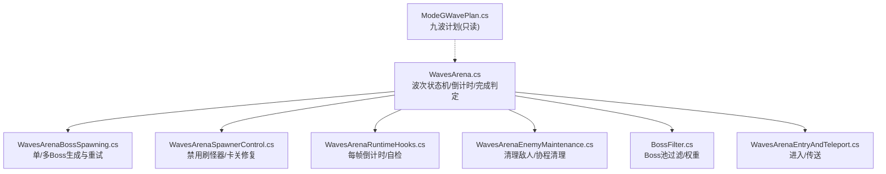
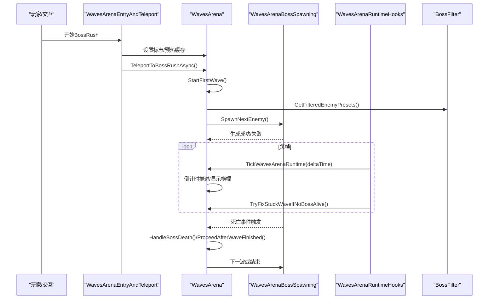
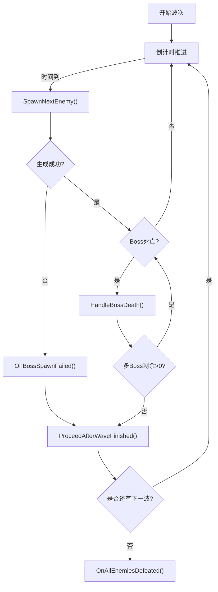
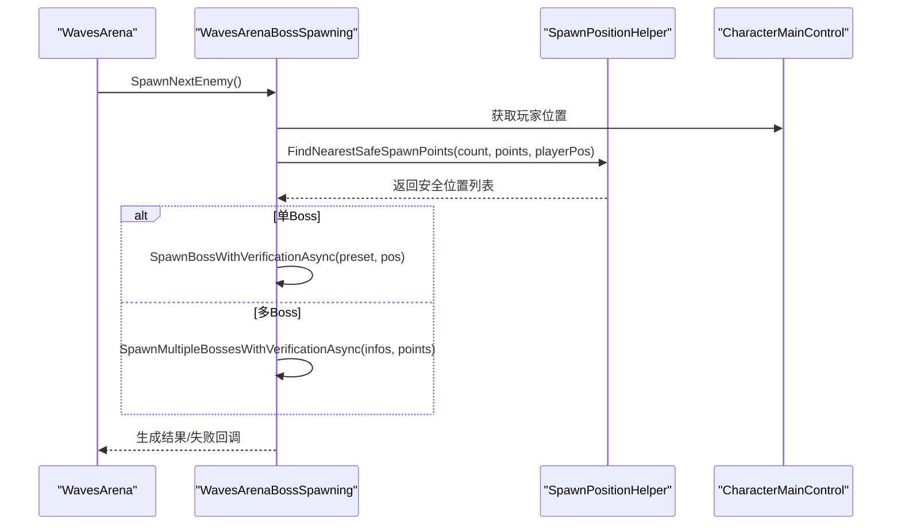
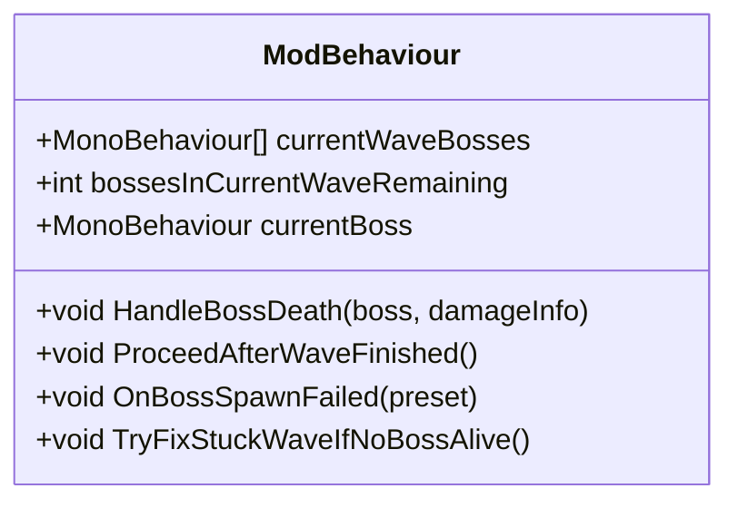
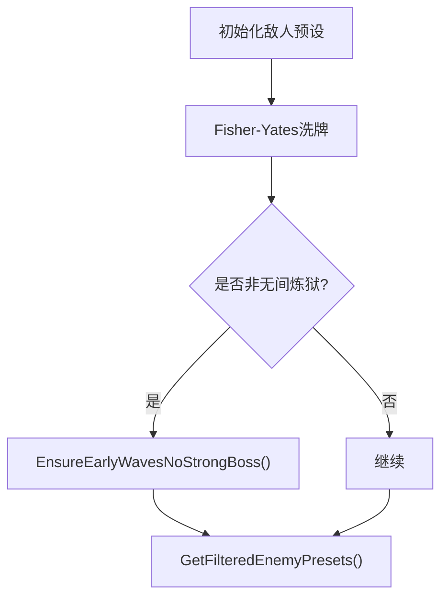
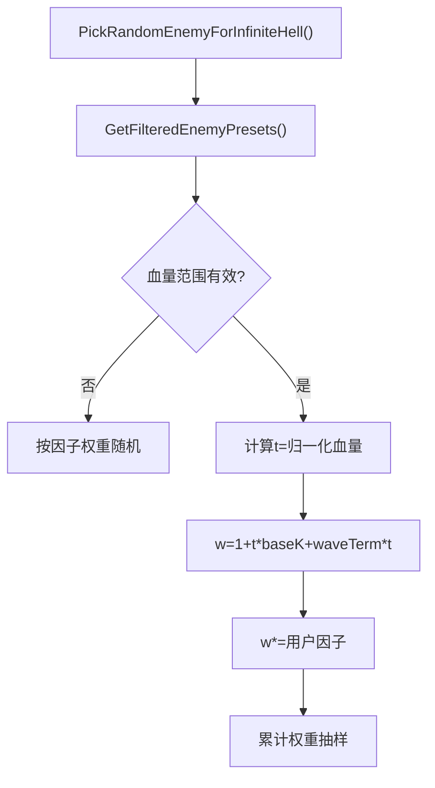
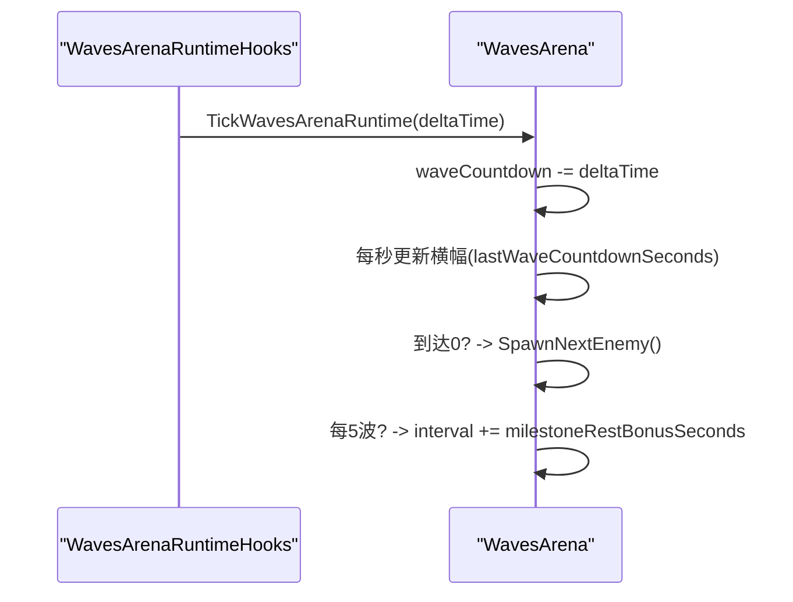
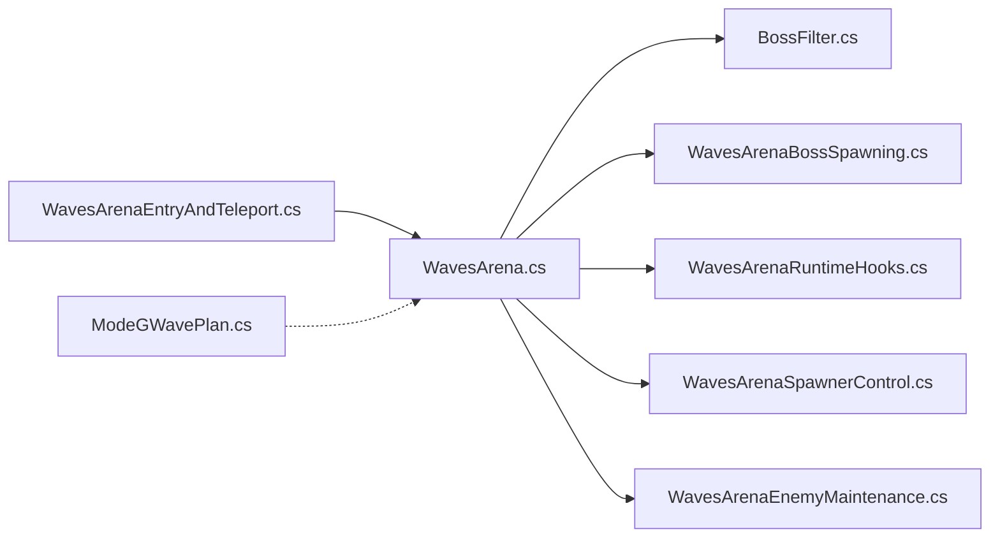

# 波次管理系统

<cite>
**本文引用的文件**
- [WavesArena.cs](file://WavesArena/WavesArena.cs)
- [WavesArenaBossSpawning.cs](file://WavesArena/WavesArenaBossSpawning.cs)
- [WavesArenaSpawnerControl.cs](file://WavesArena/WavesArenaSpawnerControl.cs)
- [WavesArenaEntryAndTeleport.cs](file://WavesArena/WavesArenaEntryAndTeleport.cs)
- [WavesArenaRuntimeHooks.cs](file://WavesArena/WavesArenaRuntimeHooks.cs)
- [WavesArenaEnemyMaintenance.cs](file://WavesArena/WavesArenaEnemyMaintenance.cs)
- [BossFilter.cs](file://BossFilter/BossFilter.cs)
- [ModeGWavePlan.cs](file://ModeG/ModeGWavePlan.cs)
</cite>

## 目录
1. [简介](#简介)
2. [项目结构](#项目结构)
3. [核心组件](#核心组件)
4. [架构总览](#架构总览)
5. [详细组件分析](#详细组件分析)
6. [依赖关系分析](#依赖关系分析)
7. [性能考量](#性能考量)
8. [故障排查指南](#故障排查指南)
9. [结论](#结论)
10. [附录：配置与自定义](#附录：配置与自定义)

## 简介
本模块实现 BossRush 的波次管理系统，覆盖波次生命周期、敌人生成调度、多 Boss 同波支持、前期强力 Boss 排除、Boss 池动态过滤与权重调整、无间炼狱模式下的随机选择、里程碑休息奖励、波次间隔倒计时、以及波次进度跟踪与显示。系统通过运行时钩子驱动倒计时与自检，结合异步生成与重试机制，确保在复杂场景下稳定推进波次。

## 项目结构
- WavesArena：波次与竞技场主逻辑（状态机、倒计时、完成判定、多 Boss 同波）
- WavesArenaBossSpawning：Boss 生成、位置校验、批量生成与重试
- WavesArenaSpawnerControl：禁用场景刷怪器、分帧销毁、卡关自检修复
- WavesArenaEntryAndTeleport：进入 BossRush 流程与传送
- WavesArenaRuntimeHooks：每帧倒计时推进与完整性自检
- WavesArenaEnemyMaintenance：清理敌人、持续清理协程
- BossFilter：Boss 池筛选、启用/禁用、无间炼狱因子权重
- ModeGWavePlan：Mode G 九波不可变计划（确定性编排）

图表来源
- [WavesArena.cs:108-184](file://WavesArena/WavesArena.cs#L108-L184)
- [WavesArenaBossSpawning.cs:346-473](file://WavesArena/WavesArenaBossSpawning.cs#L346-L473)
- [WavesArenaSpawnerControl.cs:144-251](file://WavesArena/WavesArenaSpawnerControl.cs#L144-L251)
- [WavesArenaRuntimeHooks.cs:7-67](file://WavesArena/WavesArenaRuntimeHooks.cs#L7-L67)
- [WavesArenaEnemyMaintenance.cs:124-312](file://WavesArena/WavesArenaEnemyMaintenance.cs#L124-L312)
- [BossFilter.cs:201-223](file://BossFilter/BossFilter.cs#L201-L223)
- [ModeGWavePlan.cs:54-112](file://ModeG/ModeGWavePlan.cs#L54-L112)

章节来源
- [WavesArena.cs:108-184](file://WavesArena/WavesArena.cs#L108-L184)
- [WavesArenaBossSpawning.cs:346-473](file://WavesArena/WavesArenaBossSpawning.cs#L346-L473)
- [WavesArenaSpawnerControl.cs:144-251](file://WavesArena/WavesArenaSpawnerControl.cs#L144-L251)
- [WavesArenaRuntimeHooks.cs:7-67](file://WavesArena/WavesArenaRuntimeHooks.cs#L7-L67)
- [WavesArenaEnemyMaintenance.cs:124-312](file://WavesArena/WavesArenaEnemyMaintenance.cs#L124-L312)
- [BossFilter.cs:201-223](file://BossFilter/BossFilter.cs#L201-L223)
- [ModeGWavePlan.cs:54-112](file://ModeG/ModeGWavePlan.cs#L54-L112)

## 核心组件
- 波次状态机与推进：StartNextWaveCountdown → SpawnNextEnemy → HandleBossDeath → ProceedAfterWaveFinished → OnAllEnemiesDefeated
- 敌人生成调度：单 Boss 与多 Boss 同波；安全刷怪点选择；失败重试；位置校验与恢复
- 多 Boss 模式：维护 currentWaveBosses、bossesInCurrentWaveRemaining，逐击杀推进
- 前期 Boss 排除：前 20 波强力 Boss 预处理交换
- Boss 池过滤与权重：GetFilteredEnemyPresets；无间炼狱按血量与用户因子加权随机
- 里程碑休息奖励：每 5 波额外休息时间
- 波次间隔倒计时：每帧 Tick 推进，横幅提示下一波 Boss
- 波次完整性自检：无存活 Boss 时自动修正并推进

章节来源
- [WavesArena.cs:108-184](file://WavesArena/WavesArena.cs#L108-L184)
- [WavesArena.cs:213-441](file://WavesArena/WavesArena.cs#L213-L441)
- [WavesArenaBossSpawning.cs:346-473](file://WavesArena/WavesArenaBossSpawning.cs#L346-L473)
- [WavesArenaSpawnerControl.cs:144-251](file://WavesArena/WavesArenaSpawnerControl.cs#L144-L251)
- [WavesArenaRuntimeHooks.cs:7-67](file://WavesArena/WavesArenaRuntimeHooks.cs#L7-L67)
- [BossFilter.cs:201-223](file://BossFilter/BossFilter.cs#L201-L223)

## 架构总览
波次管理以 ModBehaviour 为核心，协调以下子系统：
- 入口与传送：启动 BossRush 并传送到竞技场
- 波次控制：倒计时、生成、完成判定
- 生成器：单/多 Boss 生成、重试、位置校验
- 环境维护：禁用原生刷怪器、清理残留敌人
- 过滤器：Boss 池启用/禁用与权重
- 运行时钩子：每帧推进倒计时与自检

图表来源
- [WavesArenaEntryAndTeleport.cs:16-226](file://WavesArena/WavesArenaEntryAndTeleport.cs#L16-L226)
- [WavesArena.cs:108-184](file://WavesArena/WavesArena.cs#L108-L184)
- [WavesArenaBossSpawning.cs:346-473](file://WavesArena/WavesArenaBossSpawning.cs#L346-L473)
- [WavesArenaRuntimeHooks.cs:7-67](file://WavesArena/WavesArenaRuntimeHooks.cs#L7-L67)
- [BossFilter.cs:201-223](file://BossFilter/BossFilter.cs#L201-L223)

## 详细组件分析

### 波次状态机与推进
- 倒计时启动：StartNextWaveCountdown 计算基础间隔与里程碑奖励，设置 waitingForNextWave 与 waveCountdown，并在必要时显示下一波 Boss 横幅
- 完成判定：HandleBossDeath 记录击败数，多 Boss 模式下递减剩余计数；当剩余为 0 时调用 ProceedAfterWaveFinished
- 推进逻辑：ProceedAfterWaveFinished 递增索引、通知快递员、检查是否还有下一波；若无则结束挑战；否则进入下一波倒计时或交互引导
- 生成失败处理：OnBossSpawnFailed 将失败视为跳过，修正计数并推进

图表来源
- [WavesArena.cs:108-184](file://WavesArena/WavesArena.cs#L108-L184)
- [WavesArena.cs:213-441](file://WavesArena/WavesArena.cs#L213-L441)
- [WavesArenaBossSpawning.cs:346-473](file://WavesArena/WavesArenaBossSpawning.cs#L346-L473)

章节来源
- [WavesArena.cs:108-184](file://WavesArena/WavesArena.cs#L108-L184)
- [WavesArena.cs:213-441](file://WavesArena/WavesArena.cs#L213-L441)
- [WavesArenaBossSpawning.cs:346-473](file://WavesArena/WavesArenaBossSpawning.cs#L346-L473)

### 敌人生成调度与多 Boss 支持
- 单 Boss 模式：每波生成一个 Boss，维护波次计数用于自检
- 多 Boss 模式：同一波生成 bossesPerWave 个相同 Boss；为每个 Boss 分配不同安全刷怪点，避免重叠
- 安全刷怪点：优先距离玩家较近且不在安全距离内的点；若不足则回退到最远可用点；Y 轴高度由 SnapToGround 修正
- 重试机制：单 Boss 最多重试 3 次；多 Boss 首轮串行生成，失败项分批重试，最终统计并修正计数
- 位置校验：生成后延迟校验，若发现低于地面或虚空，尝试恢复到最近刷怪点

图表来源
- [WavesArenaBossSpawning.cs:117-251](file://WavesArena/WavesArenaBossSpawning.cs#L117-L251)
- [WavesArenaBossSpawning.cs:346-473](file://WavesArena/WavesArenaBossSpawning.cs#L346-L473)
- [WavesArenaBossSpawning.cs:478-661](file://WavesArena/WavesArenaBossSpawning.cs#L478-L661)

章节来源
- [WavesArenaBossSpawning.cs:117-251](file://WavesArena/WavesArenaBossSpawning.cs#L117-L251)
- [WavesArenaBossSpawning.cs:346-473](file://WavesArena/WavesArenaBossSpawning.cs#L346-L473)
- [WavesArenaBossSpawning.cs:478-661](file://WavesArena/WavesArenaBossSpawning.cs#L478-L661)

### 当前波 Boss 追踪与完成判定
- 多 Boss 模式：currentWaveBosses 保存当前波所有 Boss 引用；每次击杀从列表中移除对应实例；bossesInCurrentWaveRemaining 递减至 0 即完成
- 单 Boss 模式：currentBoss 指向当前 Boss；死亡后直接推进
- 生成失败：OnBossSpawnFailed 将失败视为跳过，修正剩余计数并推进
- 卡关修复：TryFixStuckWaveIfNoBossAlive 定期检测无存活 Boss 但计数未清零的情况，强制推进

图表来源
- [WavesArena.cs:213-441](file://WavesArena/WavesArena.cs#L213-L441)
- [WavesArenaSpawnerControl.cs:144-251](file://WavesArena/WavesArenaSpawnerControl.cs#L144-L251)

章节来源
- [WavesArena.cs:213-441](file://WavesArena/WavesArena.cs#L213-L441)
- [WavesArenaSpawnerControl.cs:144-251](file://WavesArena/WavesArenaSpawnerControl.cs#L144-L251)

### 前期 Boss 排除机制与强力 Boss 过滤
- 前期排除：EnsureEarlyWavesNoStrongBoss 在挑战开始时对前 20 位进行扫描，将强力 Boss 与第 20 位之后的普通 Boss 交换，保证前期难度曲线
- 强力 Boss 名单：包含风暴 Boss 系列、龙裔遗族、焚天龙皇等
- 过滤算法：GetFilteredEnemyPresets 基于 bossEnabledStates 过滤启用状态；BossFilter 提供 UI 与持久化

图表来源
- [WavesArenaBossSpawning.cs:19-108](file://WavesArena/WavesArenaBossSpawning.cs#L19-L108)
- [WavesArena.cs:42-104](file://WavesArena/WavesArena.cs#L42-L104)
- [BossFilter.cs:201-223](file://BossFilter/BossFilter.cs#L201-L223)

章节来源
- [WavesArenaBossSpawning.cs:19-108](file://WavesArena/WavesArenaBossSpawning.cs#L19-L108)
- [WavesArena.cs:42-104](file://WavesArena/WavesArena.cs#L42-L104)
- [BossFilter.cs:201-223](file://BossFilter/BossFilter.cs#L201-L223)

### 无间炼狱模式与 Boss 池动态调整
- 权重随机：PickRandomEnemyForInfiniteHell 根据基础血量归一化与波次项计算权重，再乘以用户设置的因子，累计抽样选择
- 因子系统：BossFilter 维护 bossInfiniteHellFactors，默认 1.0，可调整为极低/低/中/高/极高
- 动态调整：修改启用状态或因子后标记缓存脏，下次读取重新计算过滤列表

图表来源
- [WavesArena.cs:648-742](file://WavesArena/WavesArena.cs#L648-L742)
- [BossFilter.cs:332-346](file://BossFilter/BossFilter.cs#L332-L346)

章节来源
- [WavesArena.cs:648-742](file://WavesArena/WavesArena.cs#L648-L742)
- [BossFilter.cs:332-346](file://BossFilter/BossFilter.cs#L332-L346)

### 波次间隔倒计时与里程碑休息奖励
- 倒计时：StartNextWaveCountdown 计算 interval，设置 waitingForNextWave 与 waveCountdown；每帧 TickWavesArenaRuntime 递减并更新横幅
- 里程碑奖励：每 5 波完成时增加 milestoneRestBonusSeconds，提升休息时长
- 横幅显示：interval > 5f 时每 5 秒更新一次大横幅；初始 banner 在短间隔或里程碑时显示

图表来源
- [WavesArenaRuntimeHooks.cs:7-67](file://WavesArena/WavesArenaRuntimeHooks.cs#L7-L67)
- [WavesArena.cs:108-184](file://WavesArena/WavesArena.cs#L108-L184)

章节来源
- [WavesArenaRuntimeHooks.cs:7-67](file://WavesArena/WavesArenaRuntimeHooks.cs#L7-L67)
- [WavesArena.cs:108-184](file://WavesArena/WavesArena.cs#L108-L184)

### 波次进度跟踪与显示
- 进度跟踪：totalEnemies 使用过滤后的 Boss 池数量；currentEnemyIndex 指示当前波序；defeatedEnemies 累计击败数
- 横幅显示：ShowNextWaveCountdownBanner 显示下一波 Boss 名称与倒计时；ShowEnemyBanner 显示即将生成的 Boss
- 多 Boss 横幅：多 Boss 模式仅显示第一个 Boss 的横幅，避免重复

章节来源
- [WavesArenaBossSpawning.cs:346-473](file://WavesArena/WavesArenaBossSpawning.cs#L346-L473)
- [WavesArena.cs:108-184](file://WavesArena/WavesArena.cs#L108-L184)

### 环境维护与卡关修复
- 禁用刷怪器：DisableAllSpawners 立即标记 created=true 阻止生成，随后分帧销毁 CharacterSpawnerRoot，保留灯光避免场景变暗
- 持续清理：ContinuousClearEnemiesUntilWaveStart 在波次开始前周期性清理敌人，降低 CPU 开销
- 卡关修复：TryFixStuckWaveIfNoBossAlive 检测无存活 Boss 但计数未清零，自动修正并推进

章节来源
- [WavesArenaSpawnerControl.cs:21-139](file://WavesArena/WavesArenaSpawnerControl.cs#L21-L139)
- [WavesArenaSpawnerControl.cs:144-251](file://WavesArena/WavesArenaSpawnerControl.cs#L144-L251)
- [WavesArenaEnemyMaintenance.cs:124-312](file://WavesArena/WavesArenaEnemyMaintenance.cs#L124-L312)

### Mode G 九波计划（参考）
- 确定性计划：ModeGWavePlan.Build 基于 runSeed 生成固定 9 波计划，包含 Boss 选择、数量、编排变体与反制轴参数
- 只读访问：Active 阶段只读，Starting 阶段构建

章节来源
- [ModeGWavePlan.cs:54-112](file://ModeG/ModeGWavePlan.cs#L54-L112)

## 依赖关系分析
- WavesArena 依赖 BossFilter 获取过滤后的 Boss 池
- WavesArena 依赖 WavesArenaBossSpawning 执行生成与重试
- WavesArena 依赖 WavesArenaRuntimeHooks 驱动倒计时与自检
- WavesArena 依赖 WavesArenaSpawnerControl 禁用原生刷怪器与修复卡关
- WavesArena 依赖 WavesArenaEnemyMaintenance 清理敌人
- 入口与传送由 WavesArenaEntryAndTeleport 负责

图表来源
- [WavesArena.cs:108-184](file://WavesArena/WavesArena.cs#L108-L184)
- [BossFilter.cs:201-223](file://BossFilter/BossFilter.cs#L201-L223)
- [WavesArenaBossSpawning.cs:346-473](file://WavesArena/WavesArenaBossSpawning.cs#L346-L473)
- [WavesArenaRuntimeHooks.cs:7-67](file://WavesArena/WavesArenaRuntimeHooks.cs#L7-L67)
- [WavesArenaSpawnerControl.cs:144-251](file://WavesArena/WavesArenaSpawnerControl.cs#L144-L251)
- [WavesArenaEnemyMaintenance.cs:124-312](file://WavesArena/WavesArenaEnemyMaintenance.cs#L124-L312)
- [WavesArenaEntryAndTeleport.cs:16-226](file://WavesArena/WavesArenaEntryAndTeleport.cs#L16-L226)
- [ModeGWavePlan.cs:54-112](file://ModeG/ModeGWavePlan.cs#L54-L112)

章节来源
- [WavesArena.cs:108-184](file://WavesArena/WavesArena.cs#L108-L184)
- [BossFilter.cs:201-223](file://BossFilter/BossFilter.cs#L201-L223)
- [WavesArenaBossSpawning.cs:346-473](file://WavesArena/WavesArenaBossSpawning.cs#L346-L473)
- [WavesArenaRuntimeHooks.cs:7-67](file://WavesArena/WavesArenaRuntimeHooks.cs#L7-L67)
- [WavesArenaSpawnerControl.cs:144-251](file://WavesArena/WavesArenaSpawnerControl.cs#L144-L251)
- [WavesArenaEnemyMaintenance.cs:124-312](file://WavesArena/WavesArenaEnemyMaintenance.cs#L124-L312)
- [WavesArenaEntryAndTeleport.cs:16-226](file://WavesArena/WavesArenaEntryAndTeleport.cs#L16-L226)
- [ModeGWavePlan.cs:54-112](file://ModeG/ModeGWavePlan.cs#L54-L112)

## 性能考量
- 预缓存角色预设：进入 BossRush 前预热 ObjectCache.GetCharacterPresets，减少进图帧扫描开销
- 分帧销毁刷怪器：DestroySpawnerRootsAcrossFrames 每帧处理少量 root，避免尖峰卡顿
- 渐进式清理：ContinuousClearEnemiesUntilWaveStart 前期快速清理，后期降低频率
- 过滤缓存：BossFilter 缓存过滤结果，仅在启用状态变化时刷新
- 多 Boss 串行生成：避免并行冲突，短暂等待确保游戏状态稳定

章节来源
- [WavesArenaEntryAndTeleport.cs:35-43](file://WavesArena/WavesArenaEntryAndTeleport.cs#L35-L43)
- [WavesArenaSpawnerControl.cs:87-139](file://WavesArena/WavesArenaSpawnerControl.cs#L87-L139)
- [WavesArenaEnemyMaintenance.cs:279-312](file://WavesArena/WavesArenaEnemyMaintenance.cs#L279-L312)
- [BossFilter.cs:201-223](file://BossFilter/BossFilter.cs#L201-L223)
- [WavesArenaBossSpawning.cs:543-573](file://WavesArena/WavesArenaBossSpawning.cs#L543-L573)

## 故障排查指南
- 生成失败：查看 SpawnNextEnemy 日志，确认 Boss 池是否为空；检查刷怪点是否有效；重试机制会尝试多次
- 卡关：TryFixStuckWaveIfNoBossAlive 会自动修复；若仍异常，检查 currentWaveBosses 与 Health.IsDead 读取
- 倒计时不推进：确认 waitingForNextWave 与 waveCountdown 状态；检查 IsActive 与 bossRushArenaActive 标志
- 场景变暗：确保 DisableAllSpawners 保留灯光组件；分帧销毁完成后验证场景光照
- Boss 池为空：打开 Boss 池配置窗口（Ctrl+F10），启用至少一个 Boss；检查过滤缓存是否脏

章节来源
- [WavesArenaBossSpawning.cs:357-366](file://WavesArena/WavesArenaBossSpawning.cs#L357-L366)
- [WavesArenaSpawnerControl.cs:144-251](file://WavesArena/WavesArenaSpawnerControl.cs#L144-L251)
- [WavesArenaRuntimeHooks.cs:7-67](file://WavesArena/WavesArenaRuntimeHooks.cs#L7-L67)
- [WavesArenaSpawnerControl.cs:21-81](file://WavesArena/WavesArenaSpawnerControl.cs#L21-L81)
- [BossFilter.cs:355-408](file://BossFilter/BossFilter.cs#L355-L408)

## 结论
本波次管理系统通过清晰的状态机、稳健的生成与重试机制、灵活的 Boss 池过滤与权重调整，以及完善的运行时钩子与自检，实现了稳定的波次推进与良好的用户体验。前期强力 Boss 排除与里程碑休息奖励优化了难度曲线，多 Boss 同波支持提升了战斗多样性。建议在自定义规则时重点关注 Boss 池过滤与权重配置，并结合性能优化策略确保流畅体验。

## 附录：配置与自定义
- 打开 Boss 池配置：Ctrl+F10，可禁用/启用 Boss，或在无间炼狱模式下调整各 Boss 的出现权重
- 推荐调整：缩短 waveIntervalSeconds 加快节奏；提高 bossStatMultiplier 增加难度；启用 useInteractBetweenWaves 手动控制节奏；调整 infiniteHellBossesPerWave 控制拥挤度；设置 milestoneRestBonusSeconds 为 0 关闭额外休息
- 自定义波次规则：通过 BossFilter 的启用状态与因子权重影响 Boss 池；在 EnsureEarlyWavesNoStrongBoss 中扩展前期排除名单；在 PickRandomEnemyForInfiniteHell 中调整权重公式

章节来源
- [BossFilter.cs:355-408](file://BossFilter/BossFilter.cs#L355-L408)
- [BossFilter.cs:445-511](file://BossFilter/BossFilter.cs#L445-L511)
- [BossFilter.cs:709-736](file://BossFilter/BossFilter.cs#L709-L736)
- [WavesArena.cs:42-104](file://WavesArena/WavesArena.cs#L42-L104)
- [WavesArena.cs:648-742](file://WavesArena/WavesArena.cs#L648-L742)