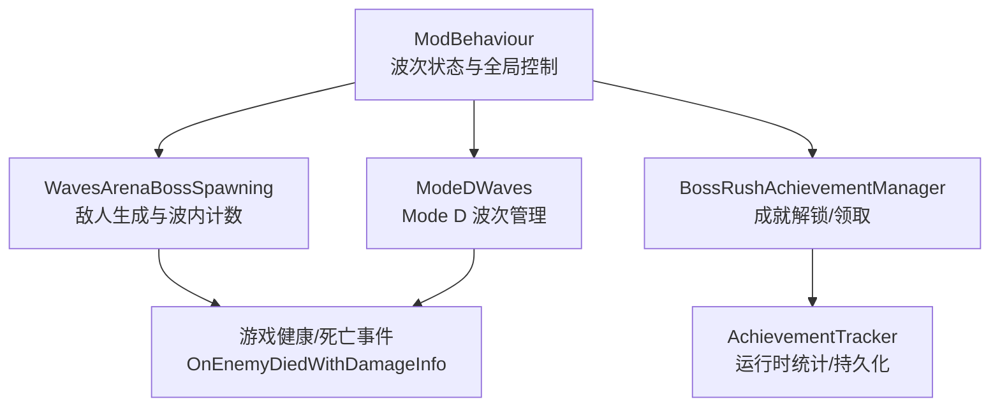
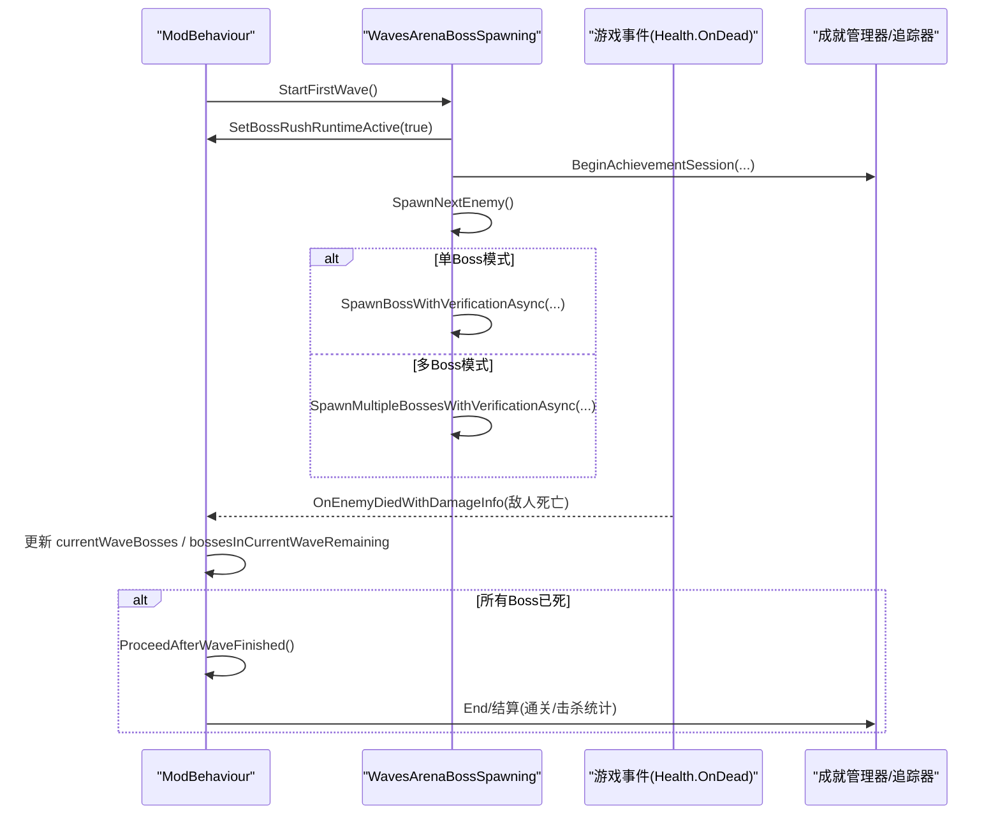
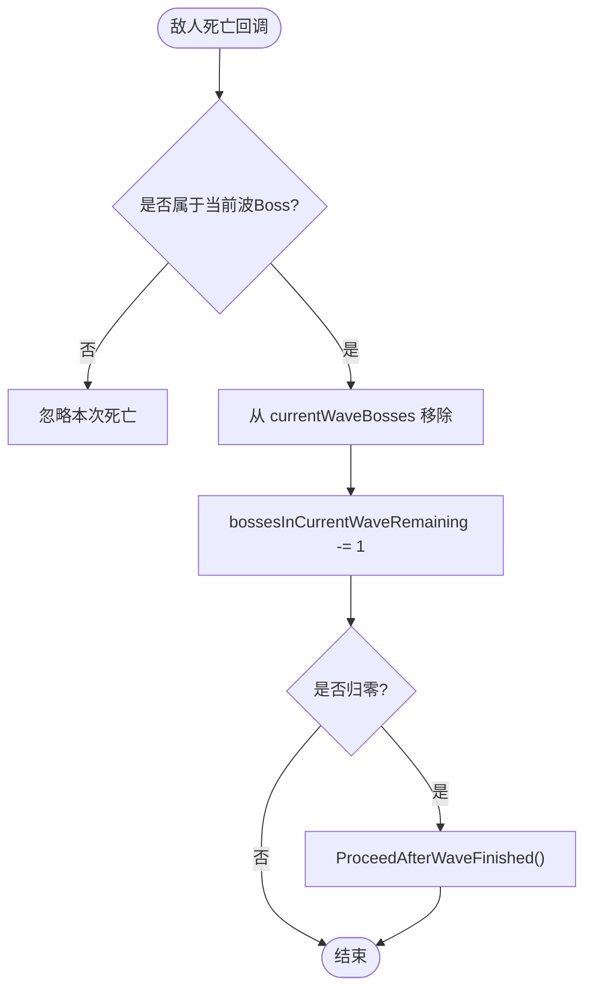
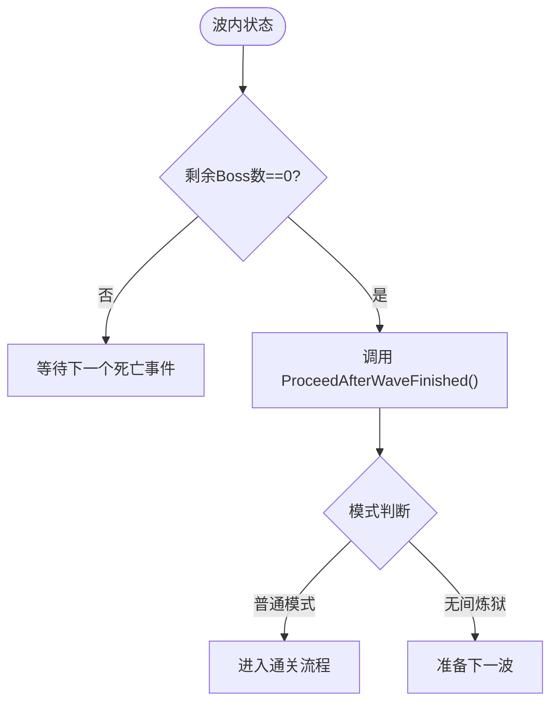
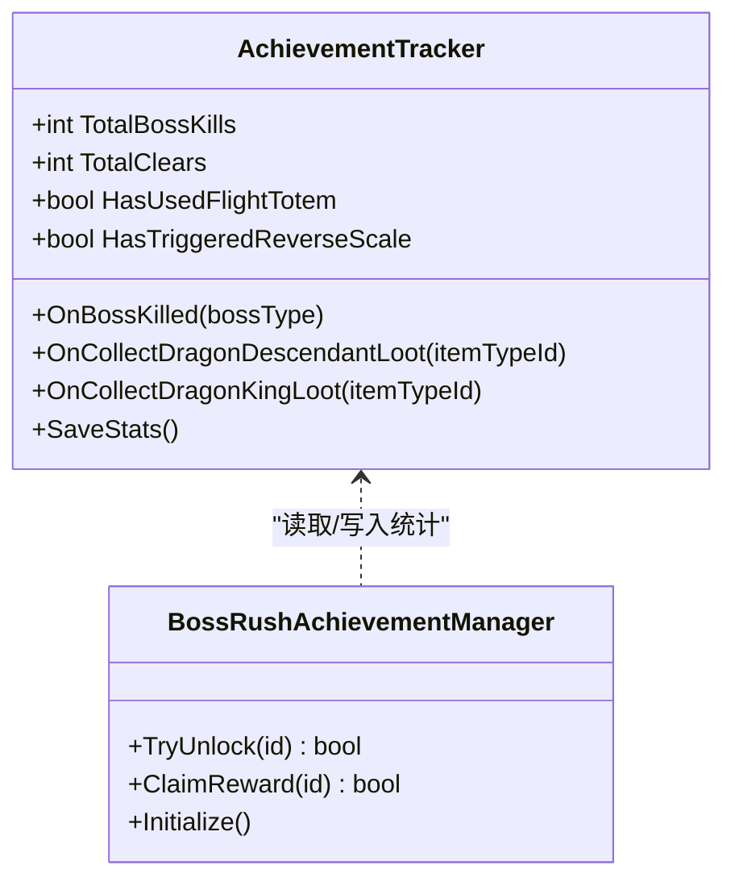
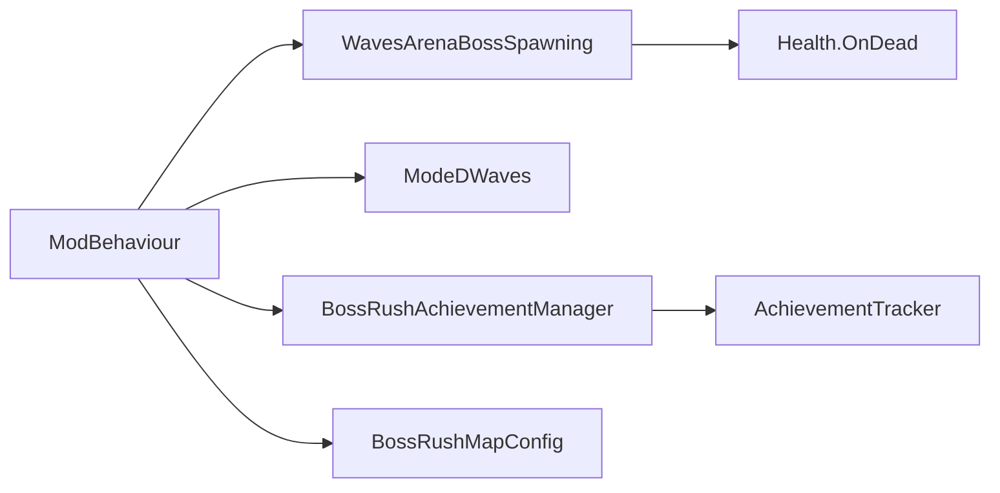

# 波次进度跟踪

<cite>
**本文引用的文件**
- [ModBehaviour.cs](file://ModBehaviour.cs)
- [WavesArenaBossSpawning.cs](file://WavesArena/WavesArenaBossSpawning.cs)
- [ModeDWaves.cs](file://ModeD/ModeDWaves.cs)
- [BossRushAchievementManager.cs](file://Achievement/BossRushAchievementManager.cs)
- [AchievementTracker.cs](file://Achievement/AchievementTracker.cs)
</cite>

## 目录
1. [简介](#简介)
2. [项目结构](#项目结构)
3. [核心组件](#核心组件)
4. [架构总览](#架构总览)
5. [详细组件分析](#详细组件分析)
6. [依赖关系分析](#依赖关系分析)
7. [性能考量](#性能考量)
8. [故障排查指南](#故障排查指南)
9. [结论](#结论)
10. [附录](#附录)

## 简介
本文件聚焦“波次进度跟踪系统”，围绕 defeatedEnemies 计数器、当前波 Boss 追踪（currentWaveBosses、bossesInCurrentWaveRemaining）、多 Boss 死亡事件匹配、波次完成判定与 ProceedAfterWaveFinished 调用时机，以及成就系统集成（CheckBossKillAchievementsOnce 防重复计数）进行系统化说明。同时给出进度显示与调试日志输出要点（DevLog），帮助读者快速定位问题并理解整体流程。

## 项目结构
BossRush 的波次进度跟踪由主行为类与波生成模块共同实现：
- ModBehaviour：集中维护波次状态、计数器、单/多 Boss 模式分支逻辑、回血 Tick、自检计时器、成就会话生命周期等。
- WavesArenaBossSpawning：负责每波敌人生成、安全刷怪点选择、批量生成与重试、波内剩余计数修正、失败兜底推进下一波。
- ModeDWaves：Mode D 模式的波次管理（含 Boss/小怪配比、分帧生成、结案计数与波完成判定）。
- Achievement 子系统：成就定义、解锁与奖励发放；运行时统计追踪与自动保存。

图表来源
- [ModBehaviour.cs:507-528](file://ModBehaviour.cs#L507-L528)
- [WavesArenaBossSpawning.cs:16-108](file://WavesArena/WavesArenaBossSpawning.cs#L16-L108)
- [ModeDWaves.cs:41-138](file://ModeD/ModeDWaves.cs#L41-L138)
- [BossRushAchievementManager.cs:43-60](file://Achievement/BossRushAchievementManager.cs#L43-L60)
- [AchievementTracker.cs:124-164](file://Achievement/AchievementTracker.cs#L124-L164)

章节来源
- [ModBehaviour.cs:507-528](file://ModBehaviour.cs#L507-L528)
- [WavesArenaBossSpawning.cs:16-108](file://WavesArena/WavesArenaBossSpawning.cs#L16-L108)
- [ModeDWaves.cs:41-138](file://ModeD/ModeDWaves.cs#L41-L138)
- [BossRushAchievementManager.cs:43-60](file://Achievement/BossRushAchievementManager.cs#L43-L60)
- [AchievementTracker.cs:124-164](file://Achievement/AchievementTracker.cs#L124-L164)

## 核心组件
- 波次状态与计数器
  - bossesPerWave：每波 Boss 数量（支持单 Boss 与多 Boss 模式）。
  - bossesInCurrentWaveTotal/bossesInCurrentWaveRemaining：当前波 Boss 总数与剩余数。
  - currentWaveBosses：当前波已生成且仍被追踪的 Boss 实例列表。
  - defeatedEnemies：累计击败敌人计数，用于通关条件与成就统计。
- 生成与校验
  - StartFirstWave：初始化挑战、随机打乱敌人顺序、清理场景、订阅死亡事件、重置计数并生成首敌。
  - SpawnNextEnemy：根据模式（普通/无间炼狱）选取预设，按 bossesPerWave 决定单/多 Boss 生成路径。
  - 多 Boss 批量生成：FindMultipleSafeSpawnPoints 分配不重复安全位置，串行生成+重试，最终校验并修正 remaining。
- 死亡事件与波完成
  - OnEnemyDiedWithDamageInfo：统一处理敌人死亡，更新 currentWaveBosses 与 bossesInCurrentWaveRemaining，并在全部清除时触发 ProceedAfterWaveFinished。
- 成就集成
  - BeginAchievementSession/End：在开始挑战时开启会话，结束时结算通关与击杀统计。
  - CheckBossKillAchievementsOnce：通过 AchievementTracker 的累计字段与集合去重，避免重复计数。

章节来源
- [ModBehaviour.cs:507-528](file://ModBehaviour.cs#L507-L528)
- [WavesArenaBossSpawning.cs:16-108](file://WavesArena/WavesArenaBossSpawning.cs#L16-L108)
- [WavesArenaBossSpawning.cs:343-473](file://WavesArena/WavesArenaBossSpawning.cs#L343-L473)
- [WavesArenaBossSpawning.cs:521-661](file://WavesArena/WavesArenaBossSpawning.cs#L521-L661)
- [BossRushAchievementManager.cs:43-60](file://Achievement/BossRushAchievementManager.cs#L43-L60)
- [AchievementTracker.cs:124-164](file://Achievement/AchievementTracker.cs#L124-L164)

## 架构总览
下图展示从“开始第一波”到“波次完成”的关键调用链，包括单/多 Boss 生成、死亡事件匹配与波完成推进。

图表来源
- [WavesArenaBossSpawning.cs:16-108](file://WavesArena/WavesArenaBossSpawning.cs#L16-L108)
- [WavesArenaBossSpawning.cs:343-473](file://WavesArena/WavesArenaBossSpawning.cs#L343-L473)
- [WavesArenaBossSpawning.cs:521-661](file://WavesArena/WavesArenaBossSpawning.cs#L521-L661)
- [ModBehaviour.cs:507-528](file://ModBehaviour.cs#L507-L528)
- [BossRushAchievementManager.cs:43-60](file://Achievement/BossRushAchievementManager.cs#L43-L60)
- [AchievementTracker.cs:124-164](file://Achievement/AchievementTracker.cs#L124-L164)

## 详细组件分析

### defeatedEnemies 计数器：作用与管理逻辑
- 作用
  - 记录本局累计击败敌人数量，用于通关判定、成就统计与 UI 进度显示。
  - 在 StartFirstWave 中重置为 0，确保每局独立计数。
- 管理逻辑
  - 每次敌人死亡回调中递增 defeatedEnemies。
  - 在普通模式下，当 totalEnemies 全部击败后进入通关流程；在无间炼狱模式下，继续推进下一波。
- 复杂度
  - 计数器更新为 O(1)，无额外数据结构开销。

章节来源
- [WavesArenaBossSpawning.cs:83-99](file://WavesArena/WavesArenaBossSpawning.cs#L83-L99)
- [ModBehaviour.cs:507-528](file://ModBehaviour.cs#L507-L528)

### 当前波 Boss 追踪机制
- currentWaveBosses 列表维护
  - 单 Boss 模式：每波仅维护一个 Boss 引用，便于回血 Tick 与死亡匹配。
  - 多 Boss 模式：批量生成后，将成功生成的 Boss 加入列表；若部分生成失败，会在最终校验阶段修剪无效项并修正计数。
- bossesInCurrentWaveRemaining 更新
  - 初始值等于 bossesPerWave（或 1）。
  - 每次有 Boss 死亡时递减，直到归零触发波完成。
- 多 Boss 死亡事件匹配
  - 使用 Health.OnDead 统一回调，匹配当前波 Boss 实例，移除并减少剩余计数。
  - 若出现“迟到死亡”或“重复死亡”，需保证幂等性（已不在列表则忽略）。

图表来源
- [WavesArenaBossSpawning.cs:343-473](file://WavesArena/WavesArenaBossSpawning.cs#L343-L473)
- [WavesArenaBossSpawning.cs:521-661](file://WavesArena/WavesArenaBossSpawning.cs#L521-L661)
- [ModBehaviour.cs:507-528](file://ModBehaviour.cs#L507-L528)

章节来源
- [WavesArenaBossSpawning.cs:343-473](file://WavesArena/WavesArenaBossSpawning.cs#L343-L473)
- [WavesArenaBossSpawning.cs:521-661](file://WavesArena/WavesArenaBossSpawning.cs#L521-L661)
- [ModBehaviour.cs:507-528](file://ModBehaviour.cs#L507-L528)

### 波次完成判定与 ProceedAfterWaveFinished 调用时机
- 判定条件
  - 当前波所有 Boss 均被击败（bossesInCurrentWaveRemaining == 0）。
  - 普通模式：totalEnemies 全部击败后进入通关流程。
  - 无间炼狱模式：每波完成后继续推进下一波。
- 调用时机
  - 在死亡回调中将剩余计数减至 0 时立即调用 ProceedAfterWaveFinished。
  - 若批量生成阶段出现全部失败，也会修正计数并直接推进下一波，防止卡波。

图表来源
- [WavesArenaBossSpawning.cs:343-473](file://WavesArena/WavesArenaBossSpawning.cs#L343-L473)
- [WavesArenaBossSpawning.cs:521-661](file://WavesArena/WavesArenaBossSpawning.cs#L521-L661)
- [ModBehaviour.cs:507-528](file://ModBehaviour.cs#L507-L528)

章节来源
- [WavesArenaBossSpawning.cs:343-473](file://WavesArena/WavesArenaBossSpawning.cs#L343-L473)
- [WavesArenaBossSpawning.cs:521-661](file://WavesArena/WavesArenaBossSpawning.cs#L521-L661)
- [ModBehaviour.cs:507-528](file://ModBehaviour.cs#L507-L528)

### 成就系统集成与防重复计数
- 会话生命周期
  - StartFirstWave 中调用 BeginAchievementSession，标记本局开始；通关或失败时结算。
- 击杀统计与防重
  - AchievementTracker.OnBossKilled 累计 TotalBossKills，并对特定 Boss（如龙王）单独计数。
  - 收藏类成就使用 HashSet 存储已收集物品 ID，天然去重。
  - 特殊成就（如首次使用图腾、首次触发逆鳞）通过布尔标志位防止重复计数。
- 解锁与奖励
  - BossRushAchievementManager.TryUnlock 检查是否已解锁，避免重复解锁；ClaimReward 检查是否已领取，避免重复发放。

图表来源
- [AchievementTracker.cs:124-164](file://Achievement/AchievementTracker.cs#L124-L164)
- [AchievementTracker.cs:208-260](file://Achievement/AchievementTracker.cs#L208-L260)
- [BossRushAchievementManager.cs:241-349](file://Achievement/BossRushAchievementManager.cs#L241-L349)

章节来源
- [AchievementTracker.cs:124-164](file://Achievement/AchievementTracker.cs#L124-L164)
- [AchievementTracker.cs:208-260](file://Achievement/AchievementTracker.cs#L208-L260)
- [BossRushAchievementManager.cs:241-349](file://Achievement/BossRushAchievementManager.cs#L241-L349)

### 进度显示与调试信息输出
- DevLog 关键节点
  - 开始第一波、生成敌人、批量生成结果、重试轮次、最终验证、波完成推进等。
  - 角色缓存刷新、竞技场中心设置、AI 仇恨强制设置等辅助信息。
- 建议观察点
  - 若波次卡住：检查 bossesInCurrentWaveRemaining 与 currentWaveBosses 一致性。
  - 若成就未解锁：检查 AchievementTracker 累计字段与集合是否按预期增长。
  - 若生成异常：查看批量生成重试日志与最终失败计数。

章节来源
- [WavesArenaBossSpawning.cs:16-108](file://WavesArena/WavesArenaBossSpawning.cs#L16-L108)
- [WavesArenaBossSpawning.cs:343-473](file://WavesArena/WavesArenaBossSpawning.cs#L343-L473)
- [WavesArenaBossSpawning.cs:521-661](file://WavesArena/WavesArenaBossSpawning.cs#L521-L661)
- [ModBehaviour.cs:507-528](file://ModBehaviour.cs#L507-L528)

## 依赖关系分析
- 模块耦合
  - ModBehaviour 依赖 WavesArenaBossSpawning 进行敌人生成与波内计数；依赖 Achievement 子系统进行会话与统计。
  - ModeDWaves 作为独立波次控制器，复用 ModBehaviour 的通用能力（如刷怪点、横幅、成就会话）。
- 外部依赖
  - 游戏事件 Health.OnDead 用于死亡回调。
  - 地图配置 BossRushMapConfig 提供刷怪点与默认位置。
- 循环依赖
  - 未发现直接循环依赖；成就系统与波次系统通过事件与静态方法解耦。

图表来源
- [ModBehaviour.cs:507-528](file://ModBehaviour.cs#L507-L528)
- [WavesArenaBossSpawning.cs:16-108](file://WavesArena/WavesArenaBossSpawning.cs#L16-L108)
- [ModeDWaves.cs:41-138](file://ModeD/ModeDWaves.cs#L41-L138)
- [BossRushAchievementManager.cs:43-60](file://Achievement/BossRushAchievementManager.cs#L43-L60)
- [AchievementTracker.cs:124-164](file://Achievement/AchievementTracker.cs#L124-L164)

章节来源
- [ModBehaviour.cs:507-528](file://ModBehaviour.cs#L507-L528)
- [WavesArenaBossSpawning.cs:16-108](file://WavesArena/WavesArenaBossSpawning.cs#L16-L108)
- [ModeDWaves.cs:41-138](file://ModeD/ModeDWaves.cs#L41-L138)
- [BossRushAchievementManager.cs:43-60](file://Achievement/BossRushAchievementManager.cs#L43-L60)
- [AchievementTracker.cs:124-164](file://Achievement/AchievementTracker.cs#L124-L164)

## 性能考量
- 列表复用与缓存
  - currentWaveBosses 与 _singleBossRegenList 复用，避免每帧分配。
  - 角色缓存列表定期刷新，降低 FindObjectsOfType 频率。
- 批量生成与重试
  - 多 Boss 批量生成采用串行+重试策略，避免并发冲突；失败时修正计数，防止卡波。
- 自检与兜底
  - 波次完整性自检计时器与 Mode E 独立计时器，保障长时间运行稳定性。
  - 生成失败兜底推进下一波，提升容错率。

[本节为通用性能指导，无需具体文件引用]

## 故障排查指南
- 症状：波次卡住，无法推进
  - 检查 bossesInCurrentWaveRemaining 是否为 0；若非 0，确认是否有 Boss 未被正确移除。
  - 查看批量生成日志，确认是否存在大量失败与重试。
- 症状：成就未解锁或重复计数
  - 检查 AchievementTracker 的累计字段与集合是否按预期增长。
  - 确认 TryUnlock/ClaimReward 的幂等性逻辑是否生效。
- 症状：Boss 位置异常或卡在地下
  - 查看 ValidateAndFixBossPosition 与 DelayedBossPositionValidation 日志，确认是否触发修复。
- 症状：AI 未锁定玩家
  - 检查 AICharacterController 的 forceTracePlayerDistance、SetTarget 与 SetNoticedToTarget 调用。

章节来源
- [WavesArenaBossSpawning.cs:253-341](file://WavesArena/WavesArenaBossSpawning.cs#L253-L341)
- [WavesArenaBossSpawning.cs:521-661](file://WavesArena/WavesArenaBossSpawning.cs#L521-L661)
- [AchievementTracker.cs:124-164](file://Achievement/AchievementTracker.cs#L124-L164)
- [BossRushAchievementManager.cs:241-349](file://Achievement/BossRushAchievementManager.cs#L241-L349)

## 结论
波次进度跟踪系统以 ModBehaviour 为核心，结合 WavesArenaBossSpawning 的生成与校验、ModeDWaves 的波次管理，以及成就子系统的统计与解锁，形成完整闭环。通过 defeatedEnemies 计数器、currentWaveBosses 列表与 bossesInCurrentWaveRemaining 计数器，系统能够准确追踪单/多 Boss 模式的波次进度，并在所有 Boss 被击败时及时推进流程。成就系统通过集合与标志位实现防重复计数，确保数据一致性与用户体验。DevLog 提供了丰富的调试信息，便于快速定位问题。

## 附录
- 关键术语
  - 单 Boss 模式：每波仅生成一个 Boss。
  - 多 Boss 模式：每波生成多个相同或不同 Boss。
  - 波次完成：当前波所有 Boss 被击败，触发推进逻辑。
  - 成就防重：通过集合与标志位避免重复计数与重复奖励。

[本节为概念性说明，无需具体文件引用]
